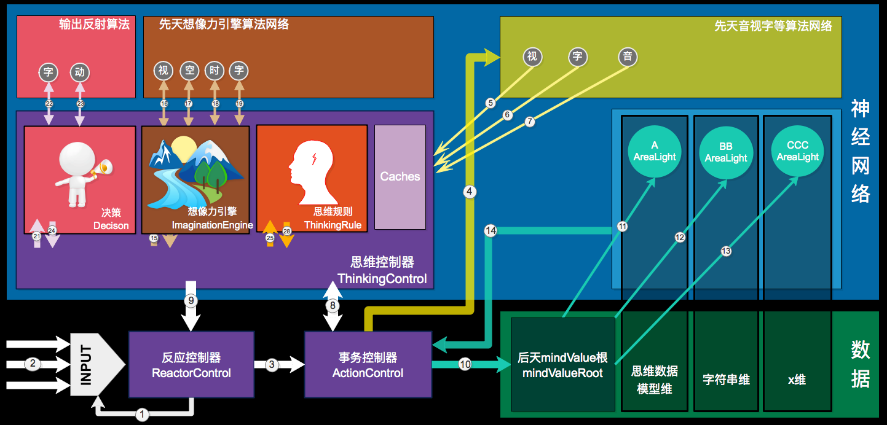

# 2017年接近尾声，写本文总结一下今年smg的进步与研究状况。

***

 

## 1. 简介

smg是纯软件的模拟大脑。软件架构上与大脑几乎是一致的(并非事先完全参考或者抄袭大脑,而是从软件与智能方面入手,并逐步改良架构,最终与大脑几乎一致)。

> 架构图

 

## 2. 概述

smg的是在 `最简思维规则` 之上进行 `数据定义思考与学习` 从而 `形成知识等结构化数据` ,以与 `真实世界`　进行　`智能交互`　的循环系统。

> 注：从简至繁,从无到有

 

## 3. 白话版概述

smg是将哲学、心理学、脑科学与计算机科学融合而研发的软件大脑系统。

 

## 4. 研发进度

目前有上千页笔记和7万多行代码，架构已近完善，代码完成度40%。最终目标是写出一个AGI系统内核，预计完成时间2018.12.31;

 

## 5. 数学应用

类比与统计。

 

## 6. smg编程思想

核心编程方式采用DOP(面向数据编程)。AI系统的本质就是一个信息处理循环系统。而以往OOP依赖程序员的定义而缺泛灵活性，容错性等。故smg采用动态DOP生成的方式，将一切定义结构抽象逻辑等构建到神经数据网络中，其最终体现出非常灵活、动态、高性能等。

> 注：
> 1. DOP与OOP并不冲突，只是在OOP的基础上进行改动，某些理念的再拆分。详情请见：SMG_NOTE全部内容。
> 2. DOP是将代码与数据进行融合的结构化网络。

 

## 7. smg系统介绍

系统内容较多，本文不可能全部展开。故以其中三个重点部分来介绍smg系统，其它详情可稳步[www.github.com/jiaxiaogang/SMG_NOTE]()查看。

| 1. 神经网络 >> |
| :--- |
| “知识表示问题”是60多年来AI领域难题之一。其中知识的“结构化”与“抽象具象”是最大的难点，目前善无已知系统落地能够达到此类能力。这是智能化研究者梦寐以求的东西，但本系统将带领读者实现一套能够通过思维归纳实现动态构建“结构化”数据网络，并具有长期不断优化，具有强大抽象能力的智能系统实现方式。其核心是`定义`与`关系`。而实现上是将OOP中的众理念改进后，以神经网络的方式动态构建。 |

| 2. 思维 >> |
| :--- |
| 图灵提出“会思考的机器”以来，至今未能实现。因以往代码都是严格的制定运行代码逻辑，机器从未真正自由。而smg的"思维最简规则"（`即mindValue规则`）是其核心，使用`相生`与`循环`两个核心方式，`类比`与`归纳事务`两种操作，其可实现最简规则之上的一生二、二生三、三生万。 |

| 3. 循环 >> |
| :--- |
| 其中循环有以下三种 |
| 1. mv循环。`注:mindValue是一个值定义，值有变化，变化产生目标，目标构建数据` |
| 2. 思维循环。`思维源于数据，数据源于思维` |
| 3. 系统与现实循环。`smg系统的独立维度与现实世界的循环` |

 

## 8. 白话版smg系统介绍

| 1. 白话神经网络 >> |
| :--- |
| 神经网络的基础组成是：节点Node和关联Line。前端部分神经网络的每个节点指向一个算法，后端部分每个节点指向一条数据（即归纳网络）。其中Node有多种类型，用来表示不同的用途，例如：存储数据、表示不同的NodeType等。 |
| 归纳网络将OOP的结构作改进后，存储于数据神经网络。这么作有很多好处，当数据量特别大的时候，例如我要检索苹果，我会由苹果直接作“区域点亮”操作，即查找苹果相关的信息，而smg学习的过程，就是这样的信息关联的过程。即smg会使用联想的方式，来从海量的数据网络中取到最有效的知识数据。而因为这样的结构是存在抽象的，所以一切AGI解决问题都强依赖于数据，而弱依赖与运算。 |

| 2. 白话思维 >> |
| --- |
| 单纯的神经网络与归纳网络是没有意义的，因为数据的构建，数据的使用等等必然需要一个操作者。而这个操作者就是思维，思维的逻辑源于数据，而数据的来源只有两个，一个是input到算法的结果，一个是数据神经网络。可以想像到，如果这样运行，那思维将有无数的数据被处理，无数的运算与垃圾数据注入数据网络。所以思维要想运行起来，有个关键就是其规则。我设计了一个最简规则，除此规则驱动之外，思维不会运行。 |
| 这个规则就是mindValue，mindValue是一个值定义，当思维中有mindValue传入的时候，就会有思维活跃，即类比。类比最重要的功能之一是发现规则Law，然后这个过程就是思维过程，这个过程会被存储于数据网络。 |
| mindValue也有一个规则，mindValue本身是定义为一，这个值会变化为二，而有了变化就有了目标为三，而思维会为mindValue的目标而服务，而这个服务过程就是数据的构建与使用的过程。会产生巨量的结构化数据为万。 |

| 3. 白话循环 >> |
| :--- |
| smg的架构中，存在很多循环，以下三个具代表性： |
| 1. mindValue的循环，mindValue的规则是极而反。太小了，则想增大，太大了，则反小（mv还有其它衍生规则，此不列）。 |
| 2. 思维数据循环，数据产生思维，思维产生数据。 |
| 3. 外界input与smg内部的数据映射。即smg的内部是一个独立的维度，思维运行在此维度，又处理着外来的数据，但思维所理解的来自数据网络，所综从的只是mindValue的驱动，思维的活，smg的独立维度，与input,决策output,这个整体共同形成一个AI系统与真实世界的循环。 |

| 4. 白话举例 >> |  |
| --- | :--- |
| 技术举例 | 现行开发中: `程序员写代码的过程` 变成 `数据网络的构建过程` |
|  | 构建者,由 `程序员` 变成 `AI系统的思维` |
|  | 业务需求,由`产品需求` 变成 `真实世界对AI系统经验需求` |
| 注 | smg思维运转的过程;学习的过程;就是构建过程;而这个数据经验很大程度避免了多余再次运算;避免了运算爆炸。 |

 

## 9. 疑问解答：

> 其实这里面;有如下几个最重要的疑问:

| 1 | 结构化网络的构建过程与总则;为什么是这样? |
| --- | :--- |
|  | 其实这个问题就像问：为什么是OOP如此流行？回答也许是人类就这样的。但其实还有底层原因： |
|  | 懒得打字，请看下图： |
|  |  |

 

| 2 | 思维如何保证不构建乱七八糟的数据;导致熵增而各种无用的数据与运算? |
| --- | :--- |
|  | 我设计了一个"思维最简规则";这个规则;保证了思维的运行;而这个规则就是mindValue规则。可参考上文循环3。 |
|  | 在没有mindValue时，思维是懒惰的，而有mindValue时，思维就会动起来。比如：你饿了，输入inputHungerMindValue，往后的流程懒得打字，见下图： |
|  |  |

 

| 3 | 凭什么以为这样的系统架构能够产生智能? |
| --- | :--- |
|  | 抛开智能一词的定义，单从系统所实现的功能而言，smg可实现：联想、想像力、学习、决策、逻辑、思维、感觉、创造力等。至于情感、意识与性格思想，一千个读者有一千个哈姆雷特。 |

 

| 4 | 凭什么以为这样的系统不会有运算爆炸问题？ |
| --- | :--- |
|  | 我的神经数据网络;是依赖抽象的; |
|  | 举个例子"我饿了,我想吃面条;然后到冰箱找;结果没有面条;却看到了苹果;我吃了苹果;解决了饥饿问题"; |
|  | 在这个例子中;我吃过面条;也吃过苹果;知道这俩都能吃;在数据网络中;很简单的可以抽象"能吃"这一接口节点;"当我在冰箱只看到苹果时,可以用数据网络查看可解决饥饿问题,此过程中,几乎使用的是数据来解决问题的;只思维读取到相关性强的数据，而针对有限的数据进行基本的类比操作，而想像力也只是像`编辑器`一样将这些数据具象展示。 |

 

| 5 | 抽象与具象的工作方式是什么？ |
| --- | :--- |
|  | **抽象：** |
|  | 如:"什么是颜色? 有一颜色算法;针对对象a取到颜色colorA;然后;再针对对象b取到颜色colorB;此时;算法的id:"algIDColor";所指向的节点;其意义就是颜色"; |
|  | **具象：** |
|  | 1. 神经网络中设计有`区域点亮`即联想功能，可实现单事务的相关域数据提取操作。 |
|  | 2. 在思维中有`想像力引擎`可辅助`多事务`的运行 |
|  | 3. 请参考OOP中，继承与实现。 |
|  | 懒得打字，请看下图： |
|  |  |

 

## 10. 读者

| 如果您对本文有疑问,可以点击上方issues给我留言 >> |
| --- |
|  |
