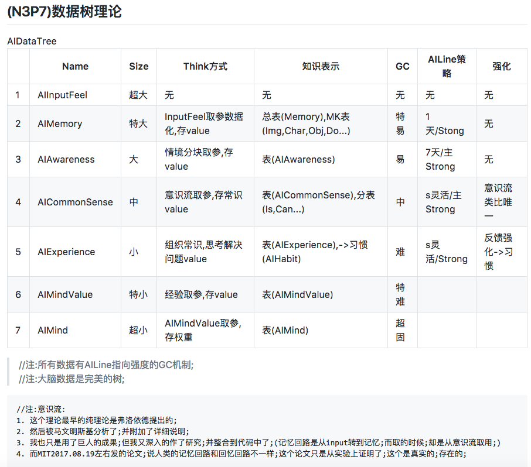

> #### Q:WeaKi  09:17:52
>
> @北京-赤臂生 你说的强人工智能是什么概念？
>
> 增强学习吗
>
> #### A:北京-赤臂生  09:18:09
>
> 我们这套系统是通用的智能系统;
> 不限场景;不止是学习;但你说到学习了;我说下学习方面;

我们是基于小样本数据的分析(类比,归纳和统计)的方式来达到无监督学习的目的的;

然后学习背后有3个模块要重点说一下;

1. 知识表示
2. 神经网络
3. 思维

### 1,知识表示;(关于知识表示的难题;估计大家很多人听过;无论是马文明斯基,罗素,GPS系统cyc这些;在遇到这个问题的时候;要么就是像LISP那种符号派;要么就是直接说尚无公认的解决方式

但我们找到了一个方式;去解决这个问题;
起初我设计了一个7层的树形知识表示结构;给大家看下;[N3P7](../手写笔记/Note3.md)

这个表中..从最外层的输入,到算法或其它函数(神经元)转化后的记忆,再到(经常思维拆分后的)意识流,再到常识,经验,精神影响值,再到权重

在数据量上是递减的;GC遗忘固度是递增的;
其实这个图虽然表示了一个结构;但其实并不实际;有很多缺点;
一会讲到2:神经网络的时候;告诉你们我们怎么解决这些问题的;

第一层Input其实就是我们AI的摄像头;麦克风;包括自我感知;字符串输入等各种数据;

第二层是记忆;就是把第一层的数据通过计算机视觉算法等处理;并能够被AI系统所识别的基数据;

第三层是关键的开始;因为前两层都会快速的遗忘掉(GC回收)
第三层是意识流;就是所有获得到"注意力"的数据;经过AI的思考后,被拆分成意识流元;存储下来;并且意识流是一个指针表;这个指针我们定义为AIPoiner;
所有的数据可以存在各种地址;然后被指向;

> 注:意识流的存在及意义是弗洛依德提出的;而"意识流"这个词是马文明斯基提出的;并且马文对其作了很多解释和研究;
>
> 而意识流还有两个最关键的作用;
>
> 1. 一个是给"意识"提供养料;
> 2. 是激活意识的其中一种方式;

第四层;常识;常识的重要性我想大家都知道;在上世纪包括专家机;cyc;这些系统;在他们研究AI的整个过程中;都是与常识打交道;当然我觉得cyc就是一个笑话;他把所有的常识通过人工的方式去输入;并且用以推理;

常识在我们系统里只是一个词汇;像一个文件夹;他下面有多个表;

起初的设计是"规律表"Law "逻辑表"logic" 还是Value表;存属性等值化的东西或范围化的值;
但后来这个理论已经推翻了;后面讲到2:神经网络的时候再说推翻的原因;
常识的重要意义是推理,对决策和解决问题有重大意义;

>  这里举个例子吧;小例子;
>
> 当你饿了,想吃面条;想到冰箱;去冰箱找面条;结果没有面条;却看到了苹果;结果吃了苹果;解决了饥饿的问题;
>
> 这里面其实有很多问题;都是些几乎不可拆分的问题;(其实这些问题不算难;所以只是几乎不可拆分,后面会有很多不可拆分的问题;像为什么1+1=2之类的问题很多)
>
> 问:你为什么会吃了苹果;
>
> 其实有常识的话;我们可以这么解决;我吃过面条;也吃过苹果;这两个常识就是苹果可以吃,面条可以吃;然后解决了这个问题;
>
> 再来拆分一下;我在吃面条的时候;自我感知到肚子的饥饿度;传给AI;意识流收集到这些数据;
>
> 并作了分析;分析到面条可以吃;这样的常识;
>
> 而这个常识为今后解决问题带来了大大的方便和好处;

常识我有点罗嗦了;我讲下一层吧;

第五层;经验;
我们每天在作的事;解决问题的这些记录;被记在经验层;而经验层直接决定了AI的行事网格;习惯;最终形成的性格;

第六层;AIMindValue;这一层是一个遍布在AI系统里的层;因为我们把Mind精神设计的比较特殊;把精神当成了AI的引擎来设计的;
这个引擎带动的InputOutput;整个运作;

AIMindValue包括了很多类型;像心情;挫折等;还有些扩展的;例如对某事件的影响(如被蛇咬了,怕绳子)等等

AIMindValue是一个人基础情感的层级;

第七层权重层;为什么把权重放最核心呢;权重其实说的是MindValue的影响值;
里面包括审美;偏好;行事原则;思想;价值观;

其实包括的不是这些东西;而是一个值;

这个值;针对不同的事物有一个权重;来影响到最终AIMindValue的输出值;

以上是知识表示部分;其实我为了节约刷屏量;很多东西是省略了的;

> #### 提问:东晋陶渊明独爱菊余独爱莲  09:43:53
>
> 有个问题 你们的常识 是怎么初始化的 人工输入吗？ 还有经验（性格）怎么初始化 ？还有你们的ai是通识ai还是特定场景的ai还是拟人ai
>
> #### 回答:北京-赤臂生  09:44:08
>
> 不是人工;
>
> 比较偏向似人;但其实不是完全似人;整个设计上是参考了人类;但其实是针对机器的优势作了改变的;包括整个系统的原理;也是参考了计算机的很多;
>
> 常识的初始化问题;我会在2神经网络里告诉你;

## 第二部分:2:神经网络;

2:神经网络;起初;我们并没有很在意神经网络的作用;只是认为就是个关联作用;作性能优化的;

但后来我们发现;神经网络远没有想像的那么简单;

它只是看起来简单;但其实它的网络设计非常精美;也有非常非常大的作用;

我们神经网络只设计了三个字段;

1. pointers是其连接的数据地址
2. strong是网络的强度(这个和知识可塑性和强化学习有很大关系)
3. 还有个是type;这个type;里面有Type_Law,Type_IsA,Type_Can,Type_Logic.....多种类型;

> #### Q:Sin-puter  09:48:55
>
> ...你只要说明思想就可以了,不需要说代码的具体实现,毕竟还没实现呢
>
> #### A:北京-赤臂生  09:49:18
>
> @Sin-puter 其实代码上已经实现了20%左右了;每天也在更新代码;在写着;
> 
> 我不想只说纯理论的东西;感觉纯理论的东西;可以为真;也可以为假;
> 
> 我分三个级:1:实验,2:实现;3:现实
> 
> 就是实验过的虽然可信;但不一定;
> 
> 实现代码的;或者实现在某项目中的.因为踩过更多坑;反而更加稳靠;
> 
> 但最终还是用于现实的应用;更完善 ;

> #### Q:Sin-puter  09:52:23
>
> 我觉得AGI的目的是让机器学会人类学习的方式,把人类的成长过程模型化
>
> #### A:北京-赤臂生  09:52:31
>
> @Sin-puter 其实我们这个系统;先天没有任何数据;
> 
> 全是后天学的;
> 
> 简单说;最大的缺点就是像人一样;需要一个成长的过程;

刚才是不是有人问到强化学习的事了; 在strong里会说清楚;

我刚才说过;知识表示里;其实很多常识的东西被推翻了;

原因其实是蝴蝶效应;很多数据在变化的时候;引起太多变化;这些变化不可能同步完成;所以只能在不同步变化的基础上;想一个互相影响的方式;

我说说神经网络吧;神经网络方面的思考还是挺多的;

你刚才问到常识的初始化;我就从这个角度说下先;

我刚才说过了一种思维方式;(类比,归纳,统计)

我们通过strong来作区域点亮;

我刚才讲到说意识流也作了一部分激活意识的工作对吧?

在激活后;先作了意识主线程的判断;如果现在没有在深度思考别的问题;那则会调用到无意识思考;然后这种思考叫浅思考;

> #### Q:Sin-puter  09:55:13
>
> 讲下去,我感觉挺有道理的
>
> #### A:北京-赤臂生  09:55:36
>
> 好

> #### Q:famer  09:59:08
>
> 硬件实现大脑结构?[表情]
>
> #### A:北京-赤臂生  09:59:50
>
> @famer 我们是软件实现;硬件现在技术达不到;或者说技术上更难;
>
> #### 东晋陶渊明独爱菊余独爱莲   10:00:35
>
> 同意...硬件……差太远

@东晋陶渊明独爱菊余独爱莲 我设计了一个人类智能进化游戏;比较完善的表达了一些东西;并且我把那个游戏引入到我们项目后,发现很有意思;

**游戏原型图如下;**

> #### Q:Sin-puter  10:05:13
>
> @北京-赤臂生 你这个游戏我看不懂,是不是类似细胞自动机的东西
>
> #### A:北京-赤臂生  10:06:40
>
> 1. @Sin-puter 这个游戏是这样的机制;
> 2. 一个生物点;从左侧繁殖;1变10;然后往右侧移动到"生存阶段"
> 3. 这个阶段;会有几个步骤;1:观察;2:随机决策;3:行动
> 4. 而这个生存的要求是必须按着数据1与梯子高度1之间匹配;
> 5. 然后每个生物点;都会随机出一个高度跳跃;并且只有很少能生存下来;
> 6. 生存下来的;会记录刚才;自己观察到的1和跳跃的高度1;但此时他依然不知道这两个1都是1;
> 7. 因为在单位上不存在直接换算关系;我只是给大家讲的时候用了1;其实完全可以用1和a 2和b这样讲;
> 8. 然后再繁殖;再生存;
> 9. 活下来的;经验越来越丰富;
> 10. 然后从自己的意识流里分析到自己跳的高度和数字的联系;
> 11. 把这个经验在繁殖的时候;遗传给他的下一代10个生物点;
> 12. 这样就能发现;越往后;这些生物点完成的越好;
> 13. 从刚开始大脑里没有任何概念;到后面;可以很明确的决策;自己该怎么跳;
>
> #### Q:Sin-puter  10:10:30
>
> [表情]很棒,获益匪浅
>
> #### A:北京-赤臂生  10:10:41
>
> 另外:因为我们系统设计的生物点在意识层是不知道自己为什么这么决策的;
>
> 简单说;只知道自己大脑运行后;是这么个结果;但具体的算法及函数过程是不知的;
> 
> 就像你喜欢苹果一样;就是喜欢;原因自己讲不清;其实大脑里是知道为什么的;
> 
> 我们为了让其有更真实的现实体验;又让其不被海量的思维信息所淹没;

当然我对这个游戏没有什么大的兴趣;因为我们的AI系统最终是要应用于现实世界的;

但这个demo游戏其实可以证明很多成果;

继续回答刚才"常识的生成问题"

"然后思考会调用到区域点亮;(区域点亮是指通过能量位的方式点亮某部分数据)

继续:"点亮区域后,会对这些数据作类比"通过类比的方式找到共同抽象或者共同属性(其实我们没有任何一个写死的属性)

看图左侧;

这种类比;最终生成的不止是数据;更重要的是神经网络;

比如说;自我感知数据"充电"与"电量加"在意识流多次先后或同步出现;

这个类比出的会生成一个Law规律数据;

并且通过神经网络关联;

然而这个数据并不是一条数据;而是一条神经网络;

而其只是网络嵌套网络的结构;

我们为什么要用这样的方式来替代一些数据呢;原因其实就是网络的强度是可运算的;

并且是很灵活;且有加强机制和衰减机制的;

这有效的使"知识表示"中不该出现的重复数据消失了;

也使网络更加强大;

我们称这种神经网络为**智能神经网络**;

因为这个网络不仅是关联与强度;

还表达出了更多信息;并且这种信息对思维和智能的动作产生很大的作用;

#### 

常识形成的问题回答完毕;总结一下;其实就是类比出常识后,尽可能的存在神经网络中了;

当然也有些不存在神经网络中的;但这种数据也不是单独存储为有效数据;

而是把数据和神经网络拆分开;

比如说;现在我需要abc与abc2链接;网络中抽象出abc;而有效数据存2;然后网络指向2;abc还是原来的那一条意识流里的abc;只有一份;

> #### 河北--文明人  10:12:29
>
> 大哥
>
> 你好厉害👍
>
> #### 情缘残梦  10:13:20
>
> 感觉高大上，
>
> #### Sin-puter  10:13:24
>
> 真的很棒啊,虽然这个群大部分人都是搞DL的侧重点不一样,你侧重的是输出神经元,他们是侧重输出结果
>
> #### AKAK  10:21:46
>
> 感觉有一种科研人员的疯狂与偏执
>
> #### AKAK  10:21:50
>
> 加油
>
> #### 风信子  10:22:38
>
> 2加油，有思想是好的
>
> #### 风信子  10:24:18
>
> 我已经为了生活没理想了
>
> #### A:北京-赤臂生  10:24:36
>
> 说到思想;我们有个LOP分层编程思想;
>
> 这个编程方式应用在SMG系统里;
>
> #### 苏大-AI学习  10:28:38
>
> 高山仰止，景行行止，虽不能至，而心向往之
>
> #### 浙江，爱好者  10:28:59
>
> 好厉害
>
> #### 苏大-AI学习  10:29:21
>
> 加油吧[表情]万一实现了呢
>
> #### 皎月  10:29:48
>
> 赞赞赞
>
> #### Sin-puter  10:35:18
>
> 加油
>
> #### 浙江，爱好者  13:59:51
>
> 多向你们这些学习
>
> 搞研究就要这样
>
> 忘我
>
> #### 情缘残梦  13:55:33
>
> 中科院少年班的？
>
> #### 北京-赤臂生  13:56:17
>
> .. 不是啊?什么少年班;
>
> #### 情缘残梦  13:56:31
>
> 学生？
>
> #### 浙江，爱好者  13:58:03
>
> 学生这么厉害(ง •̀_•́)ง，浙大的表示佩服
>
> #### 北京-赤臂生  13:58:26
>
> 我不是学生啊?
>
> #### 情缘残梦  13:59:23
>
> 我觉得你还是跟着时代主流走，等上了时代高峰，再搞你的强A I
>
> #### 情缘残梦  13:57:48
>
> 富二代？
>
> #### 北京-赤臂生  13:58:26
>
> 穷二代;
>
> #### 情缘残梦  14:02:50
>
> 那就不要搞你强A I[表情]
> 等条件好了，再搞
>
> #### Sin-puter  14:09:24
>
> @情缘残梦 你不用担心他,他活的比我们成功
>
> #### 情缘残梦  14:09:26
>
> 你这样的人，精神方面的矛盾更大于一般人
>
> #### 北京-赤臂生  14:10:03
>
> @情缘残梦 也许你说的对;其实我遇到过很多矛盾;内心的;不过我都能很简单的度过;
>
> #### Sin-puter  14:11:48
>
> keep real
>
> 随性的好啊,大部分人都达不到这种状态,因为被生活所迫,随性不起来
>
> #### 情缘残梦  14:14:23
>
> 随性是一种浅层思维
>
> 不是深度思维
>
> 想到的太少，输入太少，输出太少，人简单

我参考过上世纪几乎所有的AI项目;其实他们最终没成功的原因;都是可解释的;而今天计算机科学,脑科学,心理学哲学,电脑的性能,编程技术和计算机各种技术的成熟;都已经今非昔比;

图灵1950年发起"会思考的机器"的时候;说放眼不远的将来,我们就有很多工作要做;我们希望今天;我们团队能够接过这一棒;把真正的AI系统做到落地;

AI是我的梦想;

我参考过马文明斯基的研究;麦卡锡;西蒙纽厄尔这些人;其实他们给了我很大帮助;

> #### Q:浙江，爱好者  10:36:29
>
> 有demo吗，你们
>
> #### A:北京-赤臂生  10:36:44
>
> 源码直接免费开源的;
>
> #### Q:浙江，爱好者  10:38:31
>
> 推荐给我的项目组看看,学习学习

> #### 情缘残梦  14:13:19
>
> 能讲讲目前的深度学习吗
>
> #### 北京-赤臂生  14:13:36
>
> 这个说出来会拉仇恨;不讲;
>
> #### 情缘残梦  14:13:53
>
> 看看我们社区里的内容，哪方面都可以
>
> #### 北京-赤臂生  14:15:17
>
> 我看里;tf类的比较多;
>
> 然后有ml的;bigdata的;
>
> 业有专攻;tf dl我肯定是不如各位的;并且现在大家都在dl上;我出来说dl的不好;不太好;
>
> #### 情缘残梦  14:16:10
>
> 你擅长算法，说说目前我们搞得算法的优点和局限
>
> #### 北京-赤臂生  14:16:20
>
> 我不擅长算法啊;
>
> #### 情缘残梦  14:16:32
>
> ，，，，，
>
> #### 北京-赤臂生  14:16:34
>
> 那我说出来了;不好听的话;可不能怪我;
> 我觉得用两个词来描述现在的dl;简单,暴力;
>
> #### Sin-puter  14:17:12
>
> 对
>
> #### Sin-puter  14:17:28
>
> 就是用数据码出来模型
>
> #### 北京-赤臂生  14:19:06
>
> 另外其实dl的一些缺点也是很致使的;像依赖大数据;黑盒子问题;还有模型的单一局限性
>
> #### Sin-puter  14:19:28
>
> 对,超级依赖数据
>
> #### 北京-赤臂生  14:19:38
>
> 其实现在包括deepMind,vicarious公司已经在想办法解决模型单一的问题;
>
> #### 情缘残梦  14:19:38
>
> 人脑就依赖大数据呀
>
> #### 北京-赤臂生  14:19:42
>
> 人脑不一样;
>
> 人脑依赖的是数据的广大;不是同类数据的大;
>
> #### Sin-puter  14:20:08
>
> 人脑依赖的是数据产生的经验
>
> 不是数据
>
> #### 北京-赤臂生  14:20:17
>
> 人脑面临的数据特别广;特别泛化;并且人脑的思维是基于小样本分析的;
>
> #### 情缘残梦  14:20:30
>
> 不承认
>
> #### 北京-赤臂生  14:20:41
>
> 就像去年扎克和今年罗素都在公开场合表达过同样的说法:
>
> 就是说两三岁的孩子;看两眼西红柿或大象就能认识了;
>
> #### 情缘残梦  14:20:49
>
> 谁说人脑基于小数据了
>
> #### Sin-puter  14:20:58
>
> 人脑依赖不了大数据
>
> #### 情缘残梦  14:20:58
>
> 他们都瞎说

> 
> 
>
> #### Sin-puter  14:21:28
>
> 人脑的数据处理能力又没电脑强
>
> #### 北京-赤臂生  14:22:43
>
> 哎;这个解释不清了;
> 情缘残梦  14:22:53
> 你知道两岁，大脑接受了多少数据吗？
>
> #### 北京-赤臂生  14:23:07
>
> 我知道啊;
>
> #### Sin-puter  14:23:12
>
> 我猜想,人脑是经过小数据处理产生经验,再处理相同数据时刺激了原先的经验,然后加强或者更新
>
> #### 北京-赤臂生  14:23:27
>
> 我的重点是;孩子在第一次看到大象的时候;再看两眼;就可以认识了;
>
> 并且扎克当时的例子也是他女儿认西红柿;
>
> #### 情缘残梦  14:24:01
>
> 如果谁说人脑依据小数据，我就怼他
>
> 可以用过活人，小孩去做实验
>
> 荒山野岭里，给予他小数据，看看他怎么学，狼孩子，知道不
>
> #### 北京-赤臂生  14:24:03
>
> @Sin-puter 对;但其实这里有算法;
> 我们说的是算法;但大脑中的技术实现是神经元;
>
> 视觉神经之类的;但计算机也可以;计算机可以通过算法的方式去实现;
>
> #### Sin-puter  14:24:40
>
> DL是比较笨的模型,它依赖大数据,你认为人脑会这么笨?
>
> #### 北京-赤臂生  14:24:55
>
> 其实如果我能把我们现在用的LOP编程思想和你们说下的话;你们就明白;这一切的思维和学习为什么了;
>
> #### 北京-赤臂生  14:25:46
>
> @情缘残梦 我懂你的意思;但其实不可否认的是;你说的对;但是片面;
>
> #### Sin-puter  14:26:13
>
> ...我们说的是聚少成多
>
> 其实可能忽略了一个事实,那就是婴儿的大脑其实是已经训练好的
>
> 而且经过了亿万年的训练
>
> #### 北京-赤臂生  14:26:12
>
> 一个孩子就算是狼孩子;他的大脑依然是聪明的大脑;虽然从未学会语言;未学会人类的智慧和文化;
>
> #### Sin-puter  14:26:49
>
> 对,同意
>
> #### 情缘残梦  14:26:54
>
> 那是你对大数据理解和我不同
>
> 什么是大数据
>
> #### Sin-puter  14:27:22
>
> 你的大数据是bigdata
>
> 他说的是wide
>
> #### 情缘残梦  14:28:10
>
> 什么是大？
>
> #### Sin-puter  14:28:22
>
> big单纯是big
>
> #### Sin-puter  14:28:32
>
> 未加工的未处理的
>
> 大脑接受的不是big
> 是small,然后加工存储
>
> #### 情缘残梦  14:29:05
>
> 你可以说这颗芝麻大，你可说这个星球大，你可以说这个星系大，你可以说这个宇宙大
>
> 如果你理解了这个大，你再理解大数据的大
>
> 然后聚集起来,然后就进步了
>
> #### 情缘残梦  14:29:50
>
> 什么是数据？
>
> #### 北京-赤臂生  14:29:17
>
> 其实这个问题很简单;无须争执;因为我们可以很简单的通过内省的方式;知道自己的大脑怎么认识一个陌生的物件;
>
> #### Sin-puter  14:36:46
>
> 我想表达的意思是,研究强ai不能上来就小数据,因为强ai是从人脑得到了启发,尽管我们把初始模型设的很低(婴儿),但有可能婴儿的大脑其实已经相当完备(从母体DNA直接继承),我们不能忽略了人脑进化(人类进化)过程中积累的更新,最重要的是,这个积累的更新是基于海量的数据的
>
> #### 北京-赤臂生  14:38:43
>
> @Sin-puter [表情]同意;
>
> #### 北京-赤臂生  14:39:03
>
> 所以我才说;我这个系统是先天无数据;全部后天学习的;
> 要很长的学习期;这是其最大的弱点;
>
> #### 北京-赤臂生  14:39:51
>
> 不过这现在只是个美好的愿想;我这两天正在写抽象常识这一块;
>
> 如果他可以抽象常识;就可以抽象各种数据的常识;
>
> #### Sin-puter  14:40:05
>
> 现在有一种思想是模块化
>
> 把各种功能包装成模块,然后组合起来
>
> #### 北京-赤臂生  14:40:32
>
> 明白你的意思;
>
> 其实我有一个LOP的编程思想;里面有一层;里面是包装了各种功能模块的;
>
> #### 北京-赤臂生  14:40:56
>
> 你等下啊;我发你个截图;
>
> 
>
> #### Sin-puter  14:41:01
>
> 但那其实还是弱ai
>
> #### 北京-赤臂生  14:41:37
>
> nono;我有办法让他不只是弱ai;
>
> 你看这个LOP的结构;里面把各种你说的算法啊;功能啊;函数啊;包装到codeLayer层了;
>
> 这一层;其实按现在的理解;确实是弱ai;
>
> #### 北京-赤臂生  14:42:17
>
> 但下面还有两层;别急;
> 如果我们只看人类的视觉神经;只是作了视觉的颜色啊;光亮度啊等;这也算是弱ai了;但其实这后面才是最重要的;
> 视觉神经把这些转化后的数据传到下一层了;
>
> #### 北京-赤臂生  14:43:19
>
> 我今天上午说的数据层级里;第一层是input;第三层就是意识流;
> 其实这些数据都传到大脑;然后思考后传到意识流了;
>
> #### 北京-赤臂生  14:44:06
>
> 昨天MIT有个论文;你听说了没;
>
> #### Sin-puter  14:44:14
>
> 什么   我找找
>
> #### 北京-赤臂生  14:44:19
>
> 说人类的记忆回路和回忆回路不一样;
>
> #### 北京-赤臂生  14:44:31
>
> 在我的系统中也是不一样的;
> 记忆回路是从input转到记忆;而取的时候;却是从意识流取用;
>
> #### 北京-赤臂生  14:44:57
>
> 但这个理论其实不是我提出的;
>
> 1. 这个理论最早的纯理论是弗洛依德提出的;
> 2. 然后被马文明斯基分析了;并附加了详细说明;
> 3. 我也只是用了巨人的成果;但我又深入的作了研究;并整合到代码中了;
> 4. 而MIT这个论文只是从实验上证明了;这个是真实的;存在的;
>
> #### 北京-赤臂生  14:47:26
>
> 我的LOP描述了;代码层;只是函数和算法;包括你说的功能的打包;这些;
>
> 数据层是存数据;存神经网络;让数据尽可能智能起来;没有性能问题;并且利于AI的使用
>
> 而意识层;则感知自己的内心与需求;让数据活起来;有了逻辑;
>
> 其实这就是我这LOP思想的核心;
>
> #### Sin-puter  14:48:46
>
> [拇指]
>
> #### 北京-赤臂生  14:54:39
>
> 可能这个LOP的事;现在没人理我;也没人会理解我的说法;但我们确实是把这样的编程思想用到SMG系统中了;并且似乎为了使其有意识也必须这么作;
>
> #### 北京-赤臂生  14:55:35
>
> 意识只是对于数据的感知;你不知道自己的大脑在想问题的时候;竟然有电信号在传播;也不知道自己的神经元是怎么工作的;也感觉不到自己的神经网络的存在;也不知道自己的大脑是怎么IO操作的;但你却可以感觉到自己的想法;思考;疼痛;情感;
>
> #### 北京-赤臂生  14:55:57
>
> 我按这样的方式设计系统的时候;正是因为必须这么作;不然我不会这么作的;
>
> 
>
> #### Sin-puter  15:11:02
>
> @北京-赤臂生 明年第一代产品发布的时候告诉我啊[表情]
>
> #### 北京-赤臂生  15:17:23
>
> @Sin-puter 明年元旦前@我;免费给你门票;
>
> #### 北京-赤臂生  15:17:38
>
> 捧个人场就行;谢谢了;
>
> #### Sin-puter  15:17:55
>
> 包哪个场子
>
> #### 北京-赤臂生  15:19:31
>
> 后话;
>
> #### 北京-赤臂生  15:20:59
>
> 发布会内容也很简单;就是让他们看到真正的智能;
>
> 真正智能的系统;从各种能够达到的方面去表现;
>
> 让人直呼不可能;这绝对是后台有个真人在指挥; 我就要这种感觉;嘻嘻...

