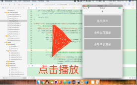

# he4o人工智能系统开发录屏

> ##### he4o是一个已落地的通用人工智能系统，通过本视频，可以了解he4o在迭代开发中的一些问题。

***

##### [《反思祖母时序协作循环图的合理性 & 前后方向的问题》](https://www.bilibili.com/video/av44151203/)
> 发布日期：2019年02月20日  
> 视频时长：78 : 32  
> 所属阶段：规划阶段  

***

##### [《祖母时序协作循环图》](https://www.bilibili.com/video/av44038979/)
> 发布日期：2019年02月19日  
> 视频时长：79 : 50  
> 所属阶段：规划阶段  

***

##### [《祖母时序协作流程 & 祖母的变化问题》](https://www.bilibili.com/video/av43942290/)
> 发布日期：2019年02月18日  
> 视频时长：67 : 09  
> 所属阶段：理论阶段  

***

##### [《写algScheme (未完成) & 祖母回归时序》](https://www.bilibili.com/video/av43879698/)
> 发布日期：2019年02月17日  
> 视频时长：83 : 08  
> 所属阶段：代码阶段  

***

##### [《祖母的实与虚2》](https://www.bilibili.com/video/av43868229/)
> 发布日期：2019年02月17日  
> 视频时长：67 : 32  
> 所属阶段：规划阶段  

***

##### [《祖母的实与虚》](https://www.bilibili.com/video/av43790143/)
> 发布日期：2019年02月16日  
> 视频时长：26 : 20  
> 所属阶段：理论阶段  

***

##### [《整理ThinkOut框架 & 祖母与时序协作的开发计划》](https://www.bilibili.com/video/av43725667/)
> 发布日期：2019年02月16日  
> 视频时长：69 : 23  
> 所属阶段：代码阶段  

***

***

##### [《决策迭代之foScheme 三》](https://www.bilibili.com/video/av43617636/)
> 发布日期：2019年02月15日  
> 视频时长：45 : 38  
> 所属阶段：代码阶段  

***

##### [《决策迭代之foScheme(未完成)二》](https://www.bilibili.com/video/av43498048/)
> 发布日期：2019年02月14日  
> 视频时长：82 : 34  
> 所属阶段：代码阶段  

***

##### [《决策迭代之foScheme (未完成)》](https://www.bilibili.com/video/av43394928/)
> 发布日期：2019年02月13日  
> 视频时长：37 : 38  
> 所属阶段：代码阶段  

***

##### [《决策中的祖母时序化&一些原则&代码整理》](https://www.bilibili.com/video/av42409389/)
> 发布日期：2019年02月02日  
> 视频时长：76 : 50  
> 所属阶段：规划阶段  

***

##### [《决策中祖母与时序的相对与循环》](https://www.bilibili.com/video/av42309196/)
> 发布日期：2019年02月01日  
> 视频时长：92 : 50  
> 所属阶段：规划阶段  

***

##### [《决策中祖母与时序的协作&决策迭代代码步骤规划》](https://www.bilibili.com/video/av42209899/)
> 发布日期：2019年01月31日  
> 视频时长：81 : 43  
> 所属阶段：规划阶段  

***

##### [《整理代码&明日计划》](https://www.bilibili.com/video/av42109726/)
> 发布日期：2019年01月30日  
> 视频时长：85 : 31  
> 所属阶段：规划阶段  

​
***

##### [《规划"决策迭代"的开发步骤》](https://www.bilibili.com/video/av42014250/)
> 发布日期：2019年01月29日  
> 视频时长：71 : 03  
> 所属阶段：规划阶段  

​
***

##### [《ThinkOut代码结构整理》](https://www.bilibili.com/video/av41911722/)
> 发布日期：2019年01月28日  
> 视频时长：68 : 52  
> 所属阶段：代码阶段  

​
***

##### [《ThinkIn代码结构整理》](https://www.bilibili.com/video/av41660055/)
> 发布日期：2019年01月25日  
> 视频时长：82 : 11  
> 所属阶段：代码阶段  

​
***

##### [《封装ThinkIn和ThinkOut》](https://www.bilibili.com/video/av41560126/)
> 发布日期：2019年01月24日  
> 视频时长：22 : 27  
> 所属阶段：代码阶段  

​
***

##### [《重构封装思维控制器》](https://www.bilibili.com/video/av41458847/)
> 发布日期：2019年01月23日  
> 视频时长：74 : 49  
> 所属阶段：代码阶段  

​
***

##### [《继续思考决策的迭代》](https://www.bilibili.com/video/av41372866/)
> 发布日期：2019年01月22日  
> 视频时长：76 : 06  
> 所属阶段：理论阶段  

​
***

##### [《以学习解决决策问题(占位规律)》](https://www.bilibili.com/video/av41282683/)
> 发布日期：2019年01月21日  
> 视频时长：72 : 16  
> 所属阶段：理论阶段  

​
***

##### [《analogySub()方法与分析解决方案中条件判定的步骤》](https://www.bilibili.com/video/av41286498/)
> 发布日期：2019年01月20日  
> 视频时长：72 : 32  
> 所属阶段：规划阶段  

​
***

##### [《"联想的相对"和"决策的迭代"》](https://www.bilibili.com/video/av41202961/)
> 发布日期：2019年01月20日  
> 视频时长：82 : 58  
> 所属阶段：规划阶段  

​
***

##### [《小鸟焦急时扑腾翅膀反射与进一步开发计划》](https://www.bilibili.com/video/av41032830/)

> 发布日期：2019年01月18日  
> 视频时长：87 : 35  
> 所属阶段：代码阶段  

***

##### [《应用开发接口之将outputMood改到应用层》](https://www.bilibili.com/video/av40944043/)

> 发布日期：2019年01月17日  
> 视频时长：79 : 51  
> 所属阶段：代码阶段  

***

##### [《修bug与规划开发计划》](https://www.bilibili.com/video/av40860705/)

> 发布日期：2019年01月16日  
> 视频时长：83 : 33  
> 所属阶段：代码阶段  

***

##### [《小鸟成长期学习飞行》](https://www.bilibili.com/video/av40779926/)

> 发布日期：2019年01月15日  
> 视频时长：82 : 38  
> 所属阶段：代码阶段  

***

##### [《新网络测试与bugfix与细节完善》](https://www.bilibili.com/video/av40439589/)

> 发布日期：2019年01月11日  
> 视频时长：91 : 36  
> 所属阶段：代码阶段  

***

##### [《新版神经网络的"输出祖母节点"与"神经网络可视化迭代"》](https://www.bilibili.com/video/av40367589/)

> 发布日期：2019年01月10日  
> 视频时长：83 : 21  
> 所属阶段：代码阶段  

***

##### [《新版神经网络的output迭代与重构完成》](https://www.bilibili.com/video/av40290756/)

> 发布日期：2019年01月09日  
> 视频时长：80 : 34  
> 所属阶段：代码阶段  

***

##### [《新版神经网络的output相关改动》](https://www.bilibili.com/video/av40210927/)

> 发布日期：2019年01月08日  
> 视频时长：91 : 49  
> 所属阶段：代码阶段  

***

##### [《新版神经网络测试与bugfix》](https://www.bilibili.com/video/av40135353/)

> 发布日期：2019年01月07日  
> 视频时长：61 : 58  
> 所属阶段：代码阶段  

***

##### [《he神经网络迭代之识别中的局部匹配与assData迭代完成》](https://www.bilibili.com/video/av40084610/)

> 发布日期：2019年01月06日  
> 视频时长：94 : 24  
> 所属阶段：代码阶段  

***

##### [《he神经网络迭代之识别中的绝对匹配》](https://www.bilibili.com/video/av40082609/)

> 发布日期：2019年01月05日  
> 视频时长：70 : 33  
> 所属阶段：代码阶段  

***

##### [《he神经网络迭代之迭代类比算法》](https://www.bilibili.com/video/av39956742/)

> 发布日期：2019年01月05日  
> 视频时长：104 : 45  
> 所属阶段：代码阶段  

***

##### [《he神经网络迭代之删掉组微信息absValue》](https://www.bilibili.com/video/av39872404/)

> 发布日期：2019年01月04日  
> 视频时长：61 : 41  
> 所属阶段：代码阶段  

***

##### [《he神经网络迭代之重构引用RefPorts》](https://www.bilibili.com/video/av39799834/)

> 发布日期：2019年01月03日  
> 视频时长：90 : 54  
> 所属阶段：代码阶段  

***

##### [《he神经网络迭代之AlgNode抽具象网络2:从algSames到absAlgNode》](https://www.bilibili.com/video/av39290837/)

> 发布日期：2018年12月29日  
> 视频时长：144 : 44  
> 所属阶段：代码阶段  

***

##### [《he神经网络迭代之AlgNode抽具象网络1:从law到algSames》](https://www.bilibili.com/video/av39198885/)

> 发布日期：2018年12月28日  
> 视频时长：61 : 48  
> 所属阶段：代码阶段  

***

##### [《he神经网络迭代之AlgNode8:替代抽象时序神经元引用序列》](https://www.bilibili.com/video/av39145679/)

> 发布日期：2018年12月27日  
> 视频时长：78 : 59  
> 所属阶段：代码阶段  

***

##### [《he神经网络迭代之AlgNode7:替代时序神经元引用序列》](https://www.bilibili.com/video/av39050416/)

> 发布日期：2018年12月26日  
> 视频时长：91 : 52  
> 所属阶段：代码阶段  

***

##### [《he神经网络迭代之AlgNode6:时序神经元构建改动部分》](https://www.bilibili.com/video/av38984707/)

> 发布日期：2018年12月25日  
> 视频时长：77 : 06  
> 所属阶段：代码阶段  

***

##### [《he神经网络迭代之AlgNode5:替代reference引用序列》](https://www.bilibili.com/video/av38590296/)

> 发布日期：2018年12月20日  
> 视频时长：71 : 25  
> 所属阶段：规划阶段  

***

##### [《he神经网络迭代之AlgNode4:数据联想识别》](https://www.bilibili.com/video/av38507380/)

> 发布日期：2018年12月19日  
> 视频时长：50 : 15  
> 所属阶段：代码阶段  

***

##### [《he神经网络迭代之AlgNode3:实现absAlgNode的去重》](https://www.bilibili.com/video/av38444666/)
> 发布日期：2018年12月18日  
> 视频时长：80 : 10  
> 所属阶段：代码阶段  

***

##### [《he神经网络迭代之AlgNode2》](https://www.bilibili.com/video/av38043356/)
> 发布日期：2018年12月13日  
> 视频时长：81 : 36  
> 所属阶段：代码阶段

***

##### [《he神经网络迭代之AlgNode》](https://www.bilibili.com/video/av37977853/)
> 发布日期：2018年12月12日  
> 视频时长：54 : 43  
> 所属阶段：代码阶段  

***

##### [《加入AlgNode后的神经网络模型代码规划》](https://www.bilibili.com/video/av37924245/)
> 发布日期：2018年12月11日  
> 视频时长：36 : 53  
> 所属阶段：规划阶段

***

##### [《神经网络之算法值类型神经元》](https://www.bilibili.com/video/av37600606)
> 发布日期：2018年12月07日  
> 视频时长：23 : 12  
> 所属阶段：代码阶段

***

##### [《神经网络之非时序组神经元》](https://www.bilibili.com/video/av37525093/)
> 发布日期：2018年12月06日  
> 视频时长：41 : 28  
> 所属阶段：规划阶段  

​

***

##### [《对于视觉算法的大数据量问题处理》](https://www.bilibili.com/video/av37522570/)
> 发布日期：2018年11月29日  
> 视频时长：45 : 08  
> 所属阶段：理论阶段

