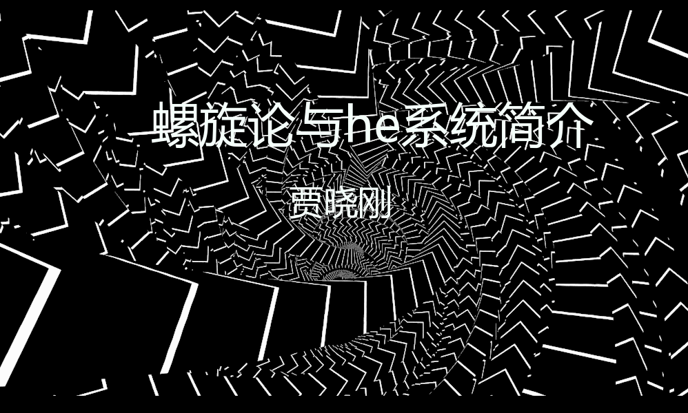

***

#### 1. 项目报告：螺旋论与he系统简介——“he”的理论模型与架构

会议时间：4月2日，周二晚8点30分

报告人：贾晓刚，Founder of he Project

内容提要：“he”是以脑科、心理学、计算机科学、信息科学、哲学等融合而研发的AGI系统，其旨在软件模拟与自然大脑类似的智能系统。本报告将对“he”进行初步介绍，主要包括螺旋论理论、信息熵减机模型及he4o系统架构三方面。具体涉及定义、相对、循环、认知学习抽象过程、决策行为具象过程、网络与思维、情感与数据、GNOP面向动态构建的网络编程思想等内容。

参会方式：Zoom视频会议（会议号：871903145），支持APP和PC。

更多详细信息请访问官网 https://home.x-in-y.com/course/view.php?id=52#section-31

#### 2. 报告资料：

查看报告视频: <https://www.bilibili.com/video/av48141401/>  
点击下载文档: [螺旋论与he系统简介.pptx](https://github.com/jiaxiaogang/HELIX_THEORY/raw/master/Other/32_%E8%9E%BA%E6%97%8B%E8%AE%BA%E4%B8%8Ehe%E7%B3%BB%E7%BB%9F%E7%AE%80%E4%BB%8B.pptx)
