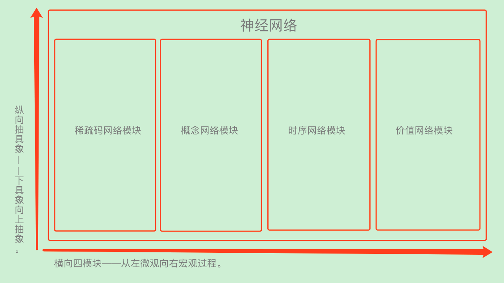

# he神经网络详解:
　　本文主要围绕神经网络展开，讲述he神经网络的构成，各网络模块间的协同工作，神经网络的工作原理等。

　　为方便理解本视频，此处先介绍下神经网络最初的信号输入有哪些，当神经网络的一批批信号输入时，仅能得到（稀疏码信息单元、概念、时序、价值）共四种最基本的明确信息：

| 输入原始信息 | 操作 | 形成网络中的 |
| --- | --- | --- |
| 1. 信息单元 | 形成微信息 | 稀疏码节点 |
| 2. 多个信息一批 | 形成一组 | 概念节点 |
| 3. 两个单批间（两个概念） | 类比找规律 | 抽象概念节点 |
| 4. 多批先后输入 | 形成序列 | 时序节点 |
| 5. 两个批序列间（两个时序） | 类比找规律 | 抽象时序节点 |
| 6. 价值信息 | 特殊的价值信息 | 价值节点 |
| 7. 两个价值信息 | 类比找规律 | 抽象价值节点 |

## [点击查看视频](https://www.ixigua.com/i6717532511657787911/)
