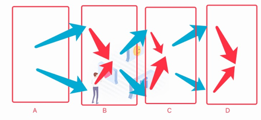

# he神经网络详解:
　　本文主要围绕神经网络展开，讲述he神经网络的构成，各网络模块间的协同工作，神经网络的工作原理等。

　　为方便理解本视频，此处先介绍下神经网络最初的信号输入有哪些，当神经网络的一批批信号输入时，仅能得到（稀疏码信息单元、概念、时序、价值）共四种最基本的明确信息：

| 输入原始信息 | 操作 | 形成网络中的 |
| --- | --- | --- |
| 1. 信息单元 | 形成微信息 | 稀疏码节点 |
| 2. 多个信息一批 | 形成一组 | 概念节点 |
| 3. 两个单批间（两个概念） | 类比找规律 | 抽象概念节点 |
| 4. 多批先后输入 | 形成序列 | 时序节点 |
| 5. 两个批序列间（两个时序） | 类比找规律 | 抽象时序节点 |
| 6. 价值信息 | 特殊的价值信息 | 价值节点 |
| 7. 两个价值信息 | 类比找规律 | 抽象价值节点 |

## [点击查看视频](https://www.ixigua.com/i6717532511657787911/)

### 关于以上网络的应用:
网络工作中的习得与识别方法如下:

**关于识别: (识别是找出更准确的结果集)**
如上图,共有ABCD四个模块 (其实你可以有三个或五个都可以)
1. 值类型: 最左侧A是稀疏码,就是输入点的最基本的值单元;
2. 宏微关系: 然后后面B->C->D越来越宏观; (即B是A的组合,C是B的组合,D是C的组合);
3. 每次A输入后,从A向B索引,因为A可以被B的多个元素包含,所以会索引出更多B结果;(蓝色部分)
4. 然后得到大量的结果,再通过竞争过滤掉尾部大部分,仅保留准确度高的前20%左右 (红色部分);
5. 后面的B->C,C到D都是同理; (我们经历多轮微宏的操作后,识别准确度是越高的);

**关于学习: (习得指建立组分关系和抽具象关系着)**
其中,每一级得到竞争过滤结果后,会与当前输入的protoNode建立抽具象关联 (即识别出的计做抽象节点)

**此文止于**
当然以上只是HE做法的一个简图,里面每个模块叫什么,为什么这个模块是这个,它是这个的原因,信息上的支持它是这个吗?然后每两个模块间的竞争机制是什么,这些等等细节这里先不聊;

**总结:**
上述主要表达: 以上是HE中不经过cv的感官到习得,再到识别的做法,整个过程是自然演化的过程,不含外界算法辅助与无需人工标注;

**代码:**
参考Recognition,AIFilter,AINet下的四个Manager等,如果看不懂不必联系我,我没空;
