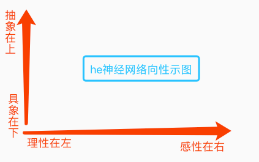
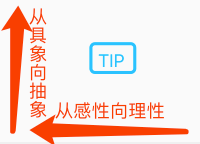
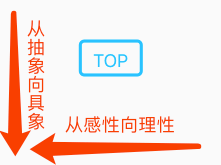
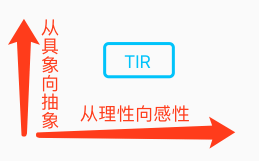

## 1. 提要：向性

　　he的思维控制器，作为网络的操作者，有四个联想（与构建）方向。分别为：
1. 抽象向具象方向
2. 具象向抽象方向
3. 理性向感性方向
4. 感性向理性方向

| 向性示图 >> |
| --- |
|  |

## 2. 分类：思维控制器的四大部分

　　he的思维控制器，按照：纵向的抽象具象和横向的理性感性，分为四个部分，分别为：
1. TIR（理性&抽象）
2. TIP（感性&抽象）
3. TOR（理性&具象）
4. TOP（感性&具象）

## 3. 说明：四大部分的向性

| IN | OUT |
| --- | --- |
|  |  |
|  |  |

## 4. 协作：各部分间的协作关系说明

> 此处暂不展开说明。
