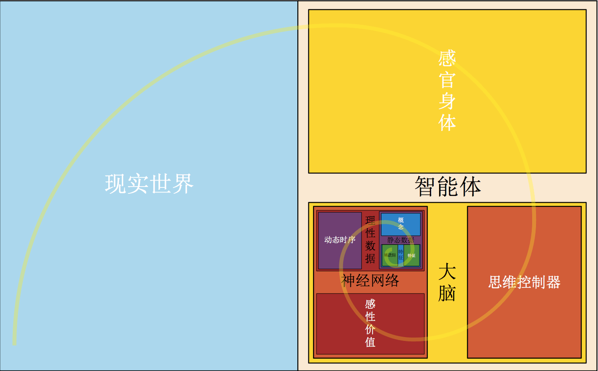

## 1. 简介

> 　　熵减机：比环境熵增速度慢的独立系统，称为熵减机。世界是熵增的，智能体（不限于智能体）是熵减的。智能体靠熵减赢得时间。一个熵增减都足够活跃的世界环境，才能够孕育出足够熵减体。
>
> 　　概念：螺旋熵减机，是以螺旋论为理论基础，在信息系统中展开的螺旋熵减机模型。
>
> 　　作用：对输入的信息进行使用，进行趋向性输出，避免环境向着熵增方向前进，从而达到熵减的目的。
>
> 　　历程：2018年2月螺旋论成熟，螺旋熵减机的模型紧跟着呈现，此后螺旋熵减机模型在不断细化中，直至今日...

## 2. 广义简化模型

| 广义简化模型非常简单: | `入`->`用`->`出` |
| --- | --- |
| 入: | 对信息的感官输入 |
| 用: | 对信息的判断比较 |
| 出: | 对信息的响应输出 |
| 例如: | 智能空调,计算机,蚂蚁,人类; |

## 3. 细化智能模型

|  |
| --- |
| 在细化模型中，螺旋熵减机将信息的“定义”、“相对”和“循环”充分体现。可应对非常活跃的熵增减环境，呈现出类人的智能水平。 |
| 呈现出对后天信息的遗传算法，终身动态构建的神经网络。 |

**图解：**
1. 在智能体主观角度，此图为内动外静。
2. 在现实世界客观角度，此图为内静外动。
3. 图中螺旋为双向，即可由外向内，亦可由内向外。
