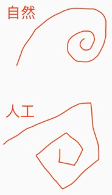

### 1. 简介:

　　he的后天网络，是遗传算法，不过先天的算法是以螺旋论展开的信息熵减机。而做纯粹的先天遗传算法，则会面临大自然的活儿计我们玩不转的情况，本文重点描述遗传算法的一些难点，和重点。

|  |
| --- |
| 图中，大自然所做出的设计，与人工做出的设计，看似相似，实则细节上大自然的更加自然通顺，但这不影响人工系统能够做到足够的效果呈现。 |

### 2. 做遗传算法,最在的困难就两个:

1. 环境;
2. 算力;

### 3. 环境:

从熵的角度:
1. 一个混乱无比的环境,有智能没用;
2. 一个次序无比的环境,用不着智能;

### 4. 算力:

1. 可暂时采用单机,或者分布式做开发;
2. 但成长期,可能使用超算;
3. 成熟期甚至需要殖民星球;
4. 爆发期,甚至需要创世;
