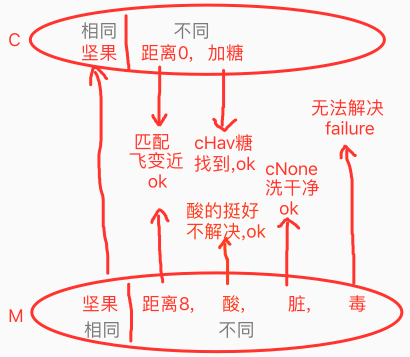
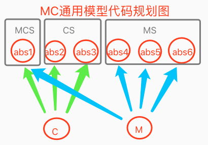

## 1. 简介：
　　在决策行为化中对瞬时记忆的应用时，设此时，我们想要的为curAlg（以下简称C），瞬时记忆可提供的matchAlg（以下简称M）。在MC进行匹配时，会大机率如此只有一部分匹配，因为C偏抽象，而M偏具象。这样的矛盾导致C与M各有其特化信息，我们需要解决这些特化，而什么样的特化需要解决，什么样的不需要解决？这就涉及到反思评价。

## 2. 实例：
　　当我们想吃煎蛋时，有鸡蛋但没火，我们想找加热源，此时C为加热，而与瞬时中所提供的进行匹配，可能会找到M为CPU，或者夏天的油路。

## 3. 实例＋示图：

　　当我们想吃甜蘑菇时，C为甜蘑菇，而现在手头只有脏的酸的且有毒的蘑菇。此时：
* MC的共同信息mcs = (蘑菇)
* C的特化信息cs = (熟)
* M的特化信息ms = (脏,酸,毒)

| 实例示图 |
| --- |
|  |

说明：
1. 由图可见，对于相同的mcs我们不必处理。
2. 但对于cs的加糖等需求，需要满足。
3. 而对于ms脏和毒的需求，我们需要修正掉（图中脏可以洗净，但毒无解）。
4. 但对于ms中酸，却没有产生修正需求（因为反思发现我们喜欢酸的）。

## 4. 模型＋解析：

|  |
| --- |
| MCS: 不处理; |
| CS: MIsC时不处理 / 同级时需满足; |
| MS: 需评价,看是否进行修正; |

　　在决策中，我们的向性是由上至下（抽象向具象），而在MC匹配过程中，需要根据MC的抽象来做评价，即由下至上（具象向抽象），因其截然相反的向性，这个过程称为反思过程。

## 5. 白话：

即：我们本来要吃蘑菇：
1. 但反思一下它不甜，则加点糖。
2. 再反思它脏，则洗一下。
3. 再反思下它酸，但喜欢酸味儿，故不理会。
4. 再反思下它有毒，且解决不了，则放弃食用。

## 6. 代码：

#### 1. MC类比器 (对M和C进行类比，取出mcs,ms,cs)

```objective-c
/**
 *  MARK:--------------------MC类比--------------------
 *  @param complete : return mcs&ms&cs notnull
 *  @desc 缩写说明: m = matchAlg, c = curAlg, mcs = MCSame, ms = MSpecial, cs = CSpecial
 */
+(void) mcAnalogy:(AIAlgNodeBase*)mAlg cAlg:(AIAlgNodeBase*)cAlg complete:(void(^)(NSArray *mcs,NSArray *ms,NSArray *cs))complete{
    //1. 数据准备
    if (!mAlg || !cAlg) {
        return;
    }
    NSMutableArray *mcs = [[NSMutableArray alloc] init];
    NSMutableArray *ms = [[NSMutableArray alloc] init];
    NSMutableArray *cs = [[NSMutableArray alloc] init];

    //2. 收集m_ps & c_ps & mc_ps;
    NSArray *mAbs_ps = [SMGUtils convertPointersFromPorts:mAlg.absPorts];
    NSArray *cAbs_ps = [SMGUtils convertPointersFromPorts:cAlg.absPorts];
    NSMutableArray *mcAbs_ps = [[NSMutableArray alloc] init];
    [mcAbs_ps addObjectsFromArray:mAbs_ps];
    [mcAbs_ps addObjectsFromArray:cAbs_ps];

    //3. 收集mcs & ms & cs;
    for (AIPointer *item_p in mcAbs_ps) {
        BOOL mContains = [SMGUtils containsSub_p:item_p parent_ps:mAbs_ps];
        BOOL cContains = [SMGUtils containsSub_p:item_p parent_ps:cAbs_ps];
        if (mContains && cContains) {
            if (![SMGUtils containsSub_p:item_p parent_ps:mcs]) [mcs addObject:item_p];
        }else if(mContains){
            if (![SMGUtils containsSub_p:item_p parent_ps:ms]) [ms addObject:item_p];
        }else if(cContains){
            if (![SMGUtils containsSub_p:item_p parent_ps:cs]) [cs addObject:item_p];
        }
    }

    //4. 返回_MC进行评价;
    if (complete) complete(mcs,ms,cs);
}
```

#### 2. MC行为化 (对cs,ms分别进行满足与修正)

```objective-c
/**
 *  MARK:--------------------MC匹配行为化--------------------
 *  ********** v1 **********
 *  @desc 伪代码:
 *  1. MC匹配时,判断是否可LSP里氏替换;
 *      2. 可替换,success
 *      3. 不可替换,changeM2C,判断条件为value_p.cLess / value_p.cGreater / alg_p.cHav / alg_p.cNone;
 *          4. alg_p则递归到convert2Out_Single_Alg();
 *          5. value_p则递归到convert2Out_Single_Value();
 *  @desc
 *      1. MC匹配,仅针对cHav做行为化;
 *      2. MC匹配,是对瞬时记忆中的matchAlg做匹配行为化;
 *      3. 当MC匹配转移change条件时,递归到single_Alg或single_Value进行行为化;
 *
 *  @desc
 *      1. xx年xx月xx日: matchAlg优先,都是通过抽具象关联来判断的,而不是直接对比其内容;
 *
 *  @todo
 *      TODO_TEST_HERE: 在alg抽象匹配时,核实下将absAlg去重,为了避免绝对匹配重复导致的联想不以cHav
 *
 *  ********** v2 **********
 *  @desc
 *      1. 运行方式: 分为GLHN四种处理方式; (Greater,Less,Hav,None)
 *      2. 主要改进: 对MC类比得到ms&cs&mcs并各进行精确的评价和行为化;
 *
 *  @desc 理性决策:
 *      1. 进行理性MC,并返回到checkScore进行理性预测评价;
 *      2. GLH为理性,因为必须满足,(其中H随后看是否需要进行评价下,比如苹果不甜,也照样能吃);
 *
 *  @实例: 用几个例子,来跑此处代码,看mAlg应该如何得来?如烤蘑菇的例子,坚果去皮的例子,cpu煎蛋的例子;
 */
-(void) convert2Out_Short_MC_V2:(AIAlgNodeBase*)matchAlg curAlg:(AIAlgNodeBase*)curAlg mcSuccess:(void(^)(NSArray *acts))mcSuccess mcFailure:(void(^)())mcFailure checkScore:(BOOL(^)(AIAlgNodeBase *mAlg))checkScore{
    //0. 数据准备
    __block BOOL failured = false;
    NSMutableArray *allActs = [[NSMutableArray alloc] init];
    NSMutableArray *alreadyGLs = [[NSMutableArray alloc] init];
    if (matchAlg && curAlg) {

        //1. MC匹配之: LSP里氏判断,M是否是C
        BOOL cIsAbs = ISOK(curAlg, AIAbsAlgNode.class);
        NSArray *cConPorts = cIsAbs ? ((AIAbsAlgNode*)curAlg).conPorts : nil;
        BOOL mIsC = [SMGUtils containsSub_p:matchAlg.pointer parentPorts:cConPorts];
        [AIThinkOutAnalogy mcAnalogy:matchAlg cAlg:curAlg complete:^(NSArray *mcs, NSArray *ms, NSArray *cs) {
            //2. 数据准备: (mcs无效且m不抽象自C时 = 则不匹配)
            if (!ARRISOK(mcs) && !mIsC) {
                return;
            }
            NSArray *msAlgs = [SMGUtils searchNodes:ms];

            //2. 当mNotS时,进行cs处理
            if (!mIsC) {
                NSArray *csAlgs = [SMGUtils searchNodes:cs];

                //3. MC抵消GL处理之: 判断长度为1;
                for (AIAlgNodeBase *csAlg in csAlgs) {
                    if (csAlg.content_ps.count == 1) {
                        for (AIAlgNodeBase *msAlg in msAlgs) {
                            if (msAlg.content_ps.count == 1) {

                                //4. MC抵消GL处理之: 判断标识相同
                                AIKVPointer *csValue_p = ARR_INDEX(csAlg.content_ps, 0);
                                AIKVPointer *msValue_p = ARR_INDEX(msAlg.content_ps, 0);
                                if ([csValue_p.identifier isEqualToString:msValue_p.identifier]) {
                                    //5. MC抵消GL处理之: 转移到_Value()
                                    NSNumber *csValue = NUMTOOK([AINetIndex getData:csValue_p]);
                                    NSNumber *msValue = NUMTOOK([AINetIndex getData:msValue_p]);
                                    AnalogyInnerType type = AnalogyInnerType_None;
                                    if (csValue > msValue) {//需增大
                                        type = AnalogyInnerType_Greater;
                                    }else if(csValue < msValue){//需减小
                                        type = AnalogyInnerType_Less;
                                    }else{}//再者一样,不处理;
                                    if (!failured && type != AnalogyInnerType_None) {
                                        [self convert2Out_RelativeValue:msValue_p type:type vSuccess:^(AIFoNodeBase *glFo, NSArray *acts) {
                                            [allActs addObjectsFromArray:acts];
                                        } vFailure:^{
                                            failured = true;
                                        }];
                                    }

                                    //6. MC抵消GL处理之: 标记已处理;
                                    [alreadyGLs addObject:csAlg];
                                    [alreadyGLs addObject:msAlg];
                                    break;
                                }
                            }
                        }
                    }

                    //7. MC未抵消H处理之: 满足csAlg;
                    for (AIAlgNodeBase *csAlg in csAlgs) {
                        if (![alreadyGLs containsObject:csAlg] && !failured) {
                            [self convert2Out_Alg:csAlg.pointer type:AnalogyInnerType_Hav success:^(NSArray *acts) {
                                [allActs addObjectsFromArray:acts];
                            } failure:^{
                                failured = true;
                            } checkScore:checkScore];
                        }
                    }
                }
            }

            //8. MC未抵消N处理之: 修正msAlg;
            for (AIAlgNodeBase *msAlg in msAlgs) {
                if (![alreadyGLs containsObject:msAlg] && !failured) {

                    //9. 对msAlg进行评价,看是否需要修正;
                    BOOL scoreSuccess = checkScore(msAlg);
                    if (!scoreSuccess) {
                        [self convert2Out_Alg:msAlg.pointer type:AnalogyInnerType_None success:^(NSArray *acts) {
                            [allActs addObjectsFromArray:acts];
                        } failure:^{
                            failured = true;
                        } checkScore:checkScore];
                    }
                }
            }
        }];
    }

    //10. 结果
    if (failured) {
        mcFailure();
    }else{
        mcSuccess(allActs);
    }
}
```

#### 3. 反思 (对每一次MC尝试匹配进行反思评价)

```objective-c
__block BOOL successed = false;
[self convert2Out_Alg:curAlg_p type:AnalogyInnerType_Hav success:^(NSArray *actions) {
    //3. 行为化成功,则收集;
    successed = true;
    NSLog(@"行为化成功");
    [result addObjectsFromArray:actions];
} failure:^{
    WLog(@"行为化失败");
} checkScore:^BOOL(AIAlgNodeBase *mAlg) {
    if (mAlg) {
        //5. MC反思: 用curAlg_ps + matchAlg组成rethinkAlg_ps
        NSMutableArray *rethinkAlg_ps = [[NSMutableArray alloc] initWithArray:curFo.content_ps];
        NSInteger replaceIndex = [rethinkAlg_ps indexOfObject:curAlg_p];
        [rethinkAlg_ps replaceObjectAtIndex:replaceIndex withObject:mAlg.pointer];

        //6. MC反思: 回归tir反思,重新识别理性预测时序,预测价值; (预测到鸡蛋变脏,或者cpu损坏) (理性预测影响评价即理性评价)
        AIShortMatchModel *mModel = [self.delegate toAlgScheme_LSPRethink:mAlg rtFoContent_ps:rethinkAlg_ps];

        //7. MC反思: 对mModel进行评价;
        CGFloat mcScore = [ThinkingUtils getScoreForce:mModel.matchFo.cmvNode_p ratio:mModel.matchFoValue];

        //8. 对原fo进行评价
        CGFloat curScore = [ThinkingUtils getScoreForce:curFo.cmvNode_p ratio:1.0f];

        //9. 写评价时所需要,"设定的"的计算算法;

        //10. 对mcScore和curScore返回评价值进行类比 (如宁饿死不吃屎);
        CGFloat validDelta = -3;//阈值为-3;
        return curScore + mcScore > validDelta;
    }
    //11. 默认返回可行;
    return true;
}];
```

## 7. 附注：

1. 以上代码包含很多文中未提及的细节。
2. 以上代码并不全面，只是摘出与文中相关的部分。
3. 源码链接：<https://github.com/jiaxiaogang/he4o/blob/master/SMG_NothingIsAll/AIFoundation/AIThinkingControl/Out/TOAlgScheme.m>
