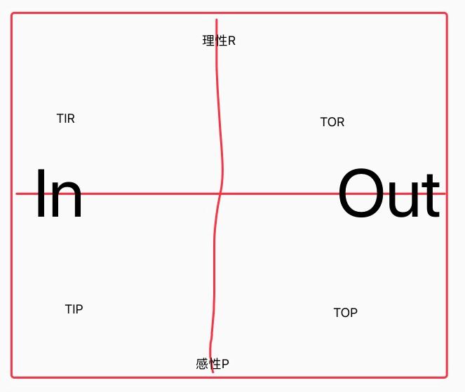
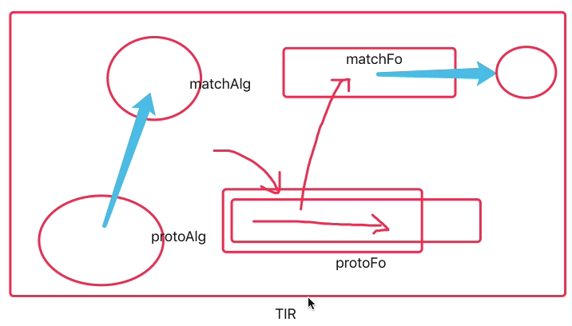
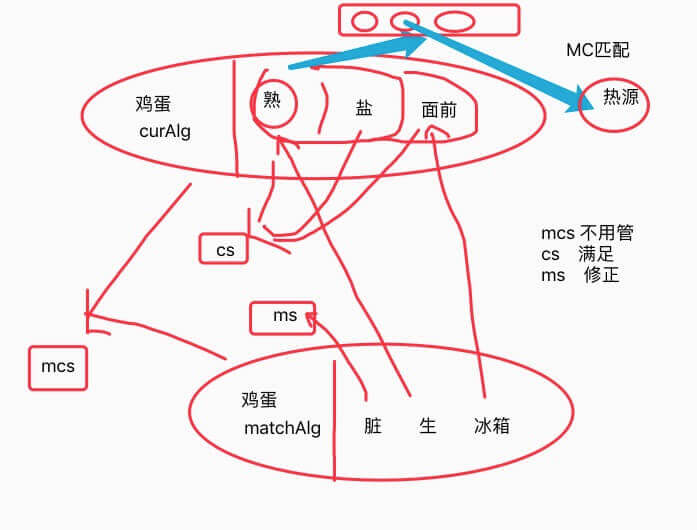

| 标题 | HE的理性决策与反思 |
| --- | --- |
| 简介 | 主要分享HE在理性决策与反思方面的`理论接洽`,`模型细节`,与`代码实现方式`,并通过`套入实例来解释工作流程与原理`; |
| 时间 | 2019年12月31日 周二 晚上20:30-21:30 |
| 录屏 | https://www.bilibili.com/video/av81523553/ |

|  |  |
| --- | --- |
|  |  |
