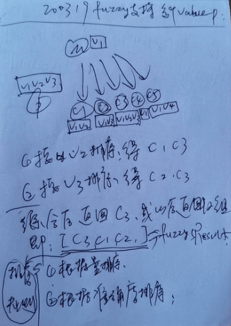
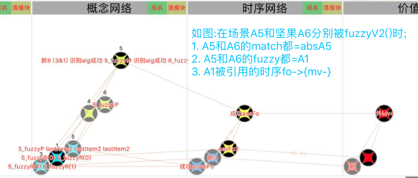

# 稀疏码模糊匹配
`Time 2020.02.20`

### 1. 简介：
　　智能体常遇到各种各样的稀疏码值，但并不能与原先经验一模一样，却指向着同一特征或概念。

### 2. 举例：
　　当智能体看到有些红A1，和更红一些A2，我们会统一识别为红色，但是问题是如果按照红的程度有100种红，难道都要一一经历，才可以识别吗？显然不是的。

### 3. 解决：
　　我们需要一个模糊匹配的设计，以使其稀疏码并非完全一致，只是在相似的情况下，依然可以模糊匹配到结果。

### 4. 模糊匹配切入点：

**其切入点，有三个选择，分别为：**
1. 稀疏码索引阶段。
2. 概念识别阶段。
3. 决策阶段。

### 5. 选定方案：

**最终我选择了2概念识别阶段，先来做排除：**

1. 假如从1稀疏码索引阶段就开始做这样的模糊匹配显然是不可取的，因为稀疏码阶段无法表示宏观意义，比如我们见过8cm和10cm大的苹果，去模糊匹配到11cm的玩具（因为稀疏码索引阶段是无法知晓苹果与玩具的）。而如果我们在索引后，再去补上这样的判断，又会导致性能问题，如下图：

  - 

2. 再假如我们从3决策阶段来做，首先模糊匹配本来就是为了识别，如果放到决策中这是不符的，再有就是决策阶段会无条件的对当前的任务进行行为化去满足所需，那么如果我的苹果比平时吃的更红，难道我就必须想办法让其不那么红，再食用吗？如下图：

  - 

3. 最终选择在概念识别阶段进行模糊匹配，各方面都非常契合，未找到缺点。模型如下图：

  - 

### 6. 多稀疏码模糊匹配：

**大多数情况下，我们都需要多码模糊匹配，并匹配到多个结果（可排序），模型如下图：**

  - 

### 7. 代码实现：

```objective-c
/**
 *  MARK:--------------------对概念识别算法补充模糊匹配功能--------------------
 *  @caller : 由TIR_Alg.partMatching()方法调用;
 *  @参考: 18151
 *  @time 2020.03.06
 *  @version :
 *      v1: 仅支持单个稀疏码不同,并仅返回单个最相似的结果;
 *      v2: 支持多个稀疏码不同,并支持返回多个相似度排序后的结果;
 */
+(NSArray*) matchAlg2FuzzyAlgV2:(AIAlgNodeBase*)protoAlg matchAlg:(AIAlgNodeBase*)matchAlg except_ps:(NSArray*)except_ps{
    //1. 数据准备;
    except_ps = ARRTOOK(except_ps);
    if (!protoAlg || !matchAlg) {
        return nil;
    }

    //2. matchAlg未匹配之处;
    NSArray *pSubMs = [SMGUtils removeSub_ps:matchAlg.content_ps parent_ps:protoAlg.content_ps];

    //3. 取proto同层的sameLevel前20个 (排除(含proto)不算);
    NSArray *sameLevel_ps = [SMGUtils convertPointersFromPorts:[AINetUtils conPorts_All:matchAlg]];
    sameLevel_ps = [SMGUtils removeSub_ps:except_ps parent_ps:sameLevel_ps];
    sameLevel_ps = ARR_SUB(sameLevel_ps, 0, cMCValue_ConAssLimit);

    //4. 逐个稀疏码,找模糊匹配节点数组;
    NSMutableArray *allSortConAlgs = [[NSMutableArray alloc] init];//收集所有排序好的匹配节点数组 (二维数组);
    NSMutableArray *fuzzyAlgs = [[NSMutableArray alloc] init];//收集所有模糊匹配到的同级节点指针;
    for (AIKVPointer *pValue_p in pSubMs) {
        //a. 对result2筛选出包含同标识value值的: result3;
        __block NSMutableArray *validConDatas = [[NSMutableArray alloc] init];
        [ThinkingUtils filterAlg_Ps:sameLevel_ps valueIdentifier:pValue_p.identifier itemValid:^(AIAlgNodeBase *alg, AIKVPointer *value_p) {
            NSNumber *value = [AINetIndex getData:value_p];
            if (alg && value) {
                [validConDatas addObject:@{@"a":alg,@"v":value}];
            }
        }];

        //b. 对result3进行取值value并排序: result4 (根据差的绝对值小的排前面);
        double pValue = [NUMTOOK([AINetIndex getData:pValue_p]) doubleValue];
        NSArray *sortConDatas = [validConDatas sortedArrayUsingComparator:^NSComparisonResult(NSDictionary *obj1, NSDictionary *obj2) {
            double v1 = [NUMTOOK([obj1 objectForKey:@"v"]) doubleValue];
            double v2 = [NUMTOOK([obj2 objectForKey:@"v"]) doubleValue];
            double absV1 = fabs(v1 - pValue);
            double absV2 = fabs(v2 - pValue);
            return absV1 > absV2 ? NSOrderedDescending : absV1 < absV2 ? NSOrderedAscending : NSOrderedSame;
        }];
        NSLog(@"%@_M同层有效:%@ 排序后(基准%f):%@",[NVHeUtil getLightStr:pValue_p],validConDatas,pValue,sortConDatas);

        //c. 转成sortConAlgs & allValidSameLevel_ps
        NSMutableArray *sortConAlgs = [[NSMutableArray alloc] init];
        for (NSDictionary *sortConData in sortConDatas) {
            AIAlgNodeBase *algNode = [sortConData objectForKey:@"a"];
            [sortConAlgs addObject:algNode];
            if (![fuzzyAlgs containsObject:algNode]) {
                [fuzzyAlgs addObject:algNode];
            }
        }

        //d. 收集结果
        [allSortConAlgs addObject:sortConAlgs];
    }

    //5. 对最终结果进行排序;
    NSArray *result = [fuzzyAlgs sortedArrayUsingComparator:^NSComparisonResult(AIAlgNodeBase *a1, AIAlgNodeBase *a2) {
        //a. 数据准备;
        NSInteger a1Count = 0,a2Count = 0,a1IndexSum = 0,a2IndexSum = 0;

        //b. 获取匹配量 (越大越相似);
        for (NSArray *sortConAlgs in allSortConAlgs) {
            for (NSInteger i = 0; i < sortConAlgs.count; i++) {
                AIAlgNodeBase *item = ARR_INDEX(sortConAlgs, i);
                if ([item isEqual:a1]) {
                    a1Count ++;
                    a1IndexSum += i;
                }else if ([item isEqual:a2]) {
                    a2Count ++;
                    a2IndexSum += i;
                }
            }
        }

        //c. 获取相似度 (越小越相似);
        CGFloat a1Similarity = a1Count > 0 ? (float)a1IndexSum / a1Count : 0;
        CGFloat a2Similarity = a2Count > 0 ? (float)a2IndexSum / a2Count : 0;

        //d. 一级对比匹配量 (值大的排前面);
        if (a1Count != a2Count) {
            return a1Count > a2Count ? NSOrderedAscending : NSOrderedDescending;
        }else{
            //3. 二级对比相似度 (值小的排前面);
            return a1Similarity == a2Similarity ? NSOrderedSame : a1Similarity > a2Similarity ? NSOrderedDescending : NSOrderedAscending;
        }
    }];

    [theApp.nvView setNodeData:protoAlg.pointer appendLightStr:STRFORMAT(@"%ld_fuzzyP",protoAlg.pointer.pointerId)];
    [theApp.nvView setNodeData:matchAlg.pointer appendLightStr:STRFORMAT(@"%ld_fuzzyM",protoAlg.pointer.pointerId)];
    for (NSInteger i = 0; i < result.count; i++) {
        AIAlgNodeBase *item = ARR_INDEX(result, i);
        [theApp.nvView setNodeData:item.pointer appendLightStr:STRFORMAT(@"%ld_fuzzyR(%ld)",protoAlg.pointer.pointerId,(long)i)];
    }
    return result;
}
```

***

### 8.　执行结果：



　　结果解析：原来原始节点protoA为坚果，但match进行识别后，其结果absA5因抽象而缺乏细节，比如absA5是没有距离的坚果，那么在决策时，我们将无距离可判定，而再被fuzzy模糊匹配后，得到的A1，却是包含距离的，虽然与protoA的距离56并不一致，但A1的距离为62，是非常相近的，其在决策时，可以帮助到决策去判断想吃到这个坚果就得先解决距离问题。
