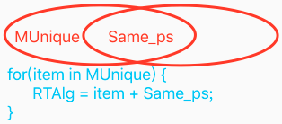

# 理性决策迭代之支持稀疏码反思评价
`CreateTime 2020.03.31`

### 1. 迭代简介

　　在以往的理性决策中，仅支持到价值、时序和概念。也有过局部支持稀疏码，但并未全面支持到稀疏码。这段时间训练小鸟，发现很多稀疏码层面的问题无法被决策时发现。比如坚果概念的距离为20，此时如果单看是否坚果，肯定是可以食用的，并且抽象中，也没有距20的坚果这一抽象概念，导致MC的行为化算法无法发现其中问题所在。

　　在创造力的支持上，以往也仅支持重组RTFo，此次的迭代会支持重组RTAlg，即创造原本不存在的概念。

### 2. 模型调整

　　模型调整，原有MC算法，被拆分成MC_Alg和MC_Value两个算法，先后执行，互不干涉。
1. 其中MC_Alg跑原有的代码，对概念及其抽象进行反思评价。
2. 而现新写的MC_Value算法，会对稀疏码进行对比判断，并重组进行反思评价。

### 3. 算法内容

| RT重组方式 |
| --- |
| RTAlg = itemMUnique + Same_ps; |
|  |
| 其中：Same_ps = M.content_ps & C.content_ps; |
| 其中：MUnique = M.content_ps - C.content_ps; |

### 4. RTAlg反思评价

　　其中RTAlg会重新进行反思识别，再进行反思评价，以下是反思识别部分代码。关于反思评价的方法此处不列出，与此前的RTFo的反思评价方法一致。
```c
/**
 *  MARK:--------------------重新识别rtAlg方法--------------------
 *  @version 20200406 : 由复用fromMem的识别M再Fuzzy(),改为仅识别硬盘MatchAlg,并返回;
 *  @desc 功能说明:
 *      1. result必须包含mUniqueValue;
 *      2. result必须被rtAlg全含 (代码见partMatching_General());
 *      3. result不进行fuzzy模糊匹配 (因为mUniqueValue并非新输入,并且fuzzy会导致多出杂项码(如:m为经26,fuzzyAlg却包含距20));
 */
+(AIAlgNodeBase*) TIR_Alg_FromRethink:(AIAlgNodeBase*)rtAlg mUniqueV_p:(AIKVPointer*)mUniqueV_p{
    //1. 数据检查
    if (!rtAlg || !mUniqueV_p) return nil;
    NSArray *mUniqueRef_ps = [SMGUtils convertPointersFromPorts:[AINetUtils refPorts_All4Value:mUniqueV_p]];
    NSLog(@"---------- TIR_Alg_FromRT START ----------");
    NSLog(@"----> 特码:%@ 被引:%ld个 重组内容:(%@)",[NVHeUtil getLightStr:mUniqueV_p],mUniqueRef_ps.count,[NVHeUtil getLightStr4Ps:rtAlg.content_ps simple:false]);

    //2. 识别
    AIAlgNodeBase *matchAlg = [TIRUtils partMatching_General:rtAlg.content_ps refPortsBlock:^NSArray *(AIKVPointer *item_p) {
        if (item_p) {
            //1> 数据准备 (value_p的refPorts是单独存储的);
            return ARRTOOK([SMGUtils searchObjectForFilePath:item_p.filePath fileName:kFNRefPorts time:cRTReference]);
        }
        return nil;
    } checkBlock:^BOOL(AIPointer *target_p) {
        if (target_p) {
            //2> 自身 && 包含M特有码;
            return ![target_p isEqual:rtAlg.pointer] && [mUniqueRef_ps containsObject:target_p];
        }
        return false;
    }];

    //3. 直接将assAlgNode设置为algNode的抽象; (这样后面TOR理性决策时,才可以直接对当前瞬时实物进行很好的理性评价);
    if (ISOK(matchAlg, AIAlgNodeBase.class)) {
        //4. 识别到时,value.refPorts -> 更新/加强微信息的引用序列
        [AINetUtils insertRefPorts_AllAlgNode:matchAlg.pointer content_ps:matchAlg.content_ps difStrong:1];

        //5. 识别到时,进行抽具象 -> 关联 & 存储 (20200103:测得,algNode为内存节点时,关联也在内存)
        [AINetUtils relateAlgAbs:(AIAbsAlgNode*)matchAlg conNodes:@[rtAlg]];
    }
    NSLog(@"识别Alg_FromRT Finish:(%@)",[NVHeUtil getLightStr4Ps:matchAlg.content_ps simple:false]);
    return matchAlg;
}
```

### 5. 附

1. RTFo反思评价方法：[点击查看](50_理性决策与反思分享.md)
2. 本文手稿：[点击查看](../手写笔记/Note18.md#n18p20-mc行为化-创造力迭代)
3. 本文源码：[点击查看](https://github.com/jiaxiaogang/he4o/blob/master/SMG_NothingIsAll/AIFoundation/AIThinkingControl/Out/TOAlgScheme.m)
