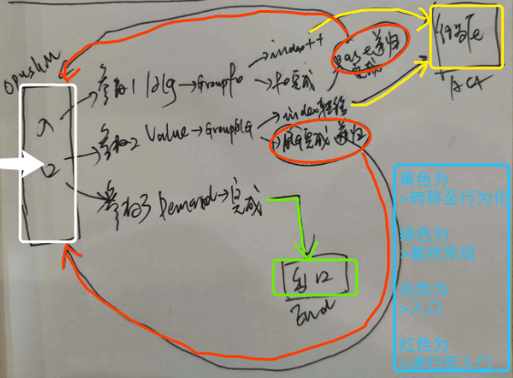

# 决策支持输出期短时记忆
`CreateTime 2020.05.15`

***

## 1. 旧版说明：

　　在以往he的决策系统，输出期短时记忆outModel（原名DemandManager），是仅支持在mvScheme和foScheme中保留价值与时序相关信息，而时序之后的行为化都是一次性决策完成并输出的，这导致外循环与中循环之间的交互数据不够频繁，在v2.0版本测试训练中，尤其是迭代决策更全面支持输入期短时记忆后，outModel的迭代需求越来越明显。所以本文对此次对输出期短时记忆的迭代做了哪些变动做提炼说明。

## 2. 新做法说明：

　　针对以上问题，本次迭代主要做了三点改动：第一是输出期短时记忆支持更全面的数据：`概念`与`稀疏码`。第二是输出期短时记忆支持与外循环更及时的交互，具体体现在每一个小小的行为化结果都要实时输出行为，并实时将所有输入再提进来。第三是写了独立的决策流程控制，因为外循环的缘故，不可能用block这样的回调来解决了，所以设计了决策流程控制方法来协调决策循环。

## 3. 模型：

1. **TOOutModel对概念、稀疏码的支持与协作。** 见下图，图中对价值、时序、概念、稀疏码分别对应了其短时记忆模型，并以结构化方式进行关联着，每一次子集成功，父集则继续推进，而子集失败，则父集跟着失败。比如：我们吃食物，得先得到食物，如果得不到食物，则吃食物就无法实现。


> 附注原则：
> 1. 行为只做两件事,`一是改变负预测`,`二是顺应正预测`;  
> 2. 时序标示出做事方式，概念才标示如何出现。

2. **更及时的外循环交互。** 见下图，图中每一次递归行为化成功，都会直接进行行为输出，并在外循环再输入时，重新回来继续任务进度。比如我饿了，喊妈妈午饭好了吗？然后躺在沙发上等午饭好了冲过去吃。


3. **决策流程控制。** 流程控制方法分为Finish、Failure、Begin三个具体的控制方法协作。见下图，因为流程控制方法并不复杂，所以图比较杂乱未整理。大致说，就是Finish就递归继续推进任务，Failure就递归尝试别的方案，Begin就根据OutModel格式分发到各处进行行为化。




## 5. 代码：

因为代码较多，此处仅列出方法名称，并给出链接，可自行点击查看。

1. **TOOutModel对概念、稀疏码的支持与协作。**
  * <https://github.com/jiaxiaogang/he4o/tree/master/SMG_NothingIsAll/AIFoundation/AIThinkingControl/Out/Model>

2. **更及时的外循环交互。**
  * 行为化成功时，直接输出，相关代码：
    - 源码地址：https://github.com/jiaxiaogang/he4o/blob/master/SMG_NothingIsAll/AIFoundation/AIThinkingControl/Out/AIThinkOutAction.m>

    ```objective-c
    //2. 第1级: 本身即是isOut时,直接行为化返回;
    NSLog(@"\n\n=============================== 行为输出 ===============================\n%@",AlgP2FStr(outModel.content_p));
    outModel.status = TOModelStatus_ActYes;
    [self.delegate toAction_updateEnergy:-0.1f];
    [self.delegate toAction_Output:@[outModel.content_p]];
    return;
    ```
  * 输入回来时，相关代码：
    - 源码地址：https://github.com/jiaxiaogang/he4o/blob/master/SMG_NothingIsAll/AIFoundation/AIThinkingControl/Out/AIThinkOutReason.m

    ```objective-c
    /**
     *  MARK:--------------------"外层输入" 推进 "中层循环" 决策--------------------
     *  @desc
     *      1. 最新一帧,与上轮循环做匹配 (对单帧匹配到任务Finish的,要推动决策跳转下帧);
     *      2. 未输出行为,等待中的,也要进行下轮匹配,比如等开饭,等来开饭了; (等待的status是ActNo还是Runing?)
     *  @todo
     *      1. 此处在for循环中,所以有可能推进多条,比如我有了一只狗,可以拉雪撬,或者送给爷爷陪爷爷 (涉及多任务间的价值自由竞争),暂仅支持一条,后再支持;
     *  @result 返回pushMiddle是否成功,如果推进成功,则不再执行TOP四模式;
     */
    -(BOOL) commitFromOuterPushMiddleLoop:(DemandModel*)demand latestMModel:(AIShortMatchModel*)latestMModel{}
    ```

3. **决策流程控制。**

   * 三个方法：
     - `-(void) singleLoopBackWithFinishModel:(TOModelBase*)finishModel {}`
     - `-(void) singleLoopBackWithFailureModel:(TOModelBase*)failureModel {}`
     - `-(void) singleLoopBackWithBegin:(TOModelBase*)beginModel {}`
     - 源码地址：<https://github.com/jiaxiaogang/he4o/blob/master/SMG_NothingIsAll/AIFoundation/AIThinkingControl/Out/AIThinkOutReason.m>
