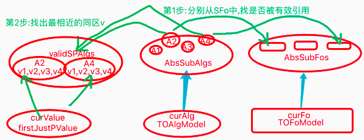

# 反省类比
`CreateTime 2020.08.12`

***

### 简介：
　　分享一下最近我们HE系统在训练中遇到的问题，以及因此而不得不迭代反省类比算法，更深入研究反省，使系统决策能够支持更加理性的评价。详情如下：

### 情境：
　　起因是这样的，前段时间我一直在虚拟场景下训练一只乌鸦（可自行参考朱松纯教授提出的乌鸦挑战），例中有乌鸦吃坚果的训练，我们知道坚果的位置是不会影响到乌鸦吃坚果的，而乌鸦经历很多次吃坚果，当坚果在汽车流动的路面上是不能吃的。

　　如果我们想让乌鸦明确的知道坚果不能吃，是与汽车流动相关，而与坚果的位置无关，我们就不得不使乌鸦从这样的经历中快速习得相关常识，并应用到今后的决策中，这在决策中是一个非常理性的评价要求。

### 本文涉及到的算法介绍：
　　在HE中有一个算法，是负责在智能体输出行为后，再反馈回来时，是否达到了预期效果，然后对效果进行修正（以下称此算法为PM算法）。比如乌鸦想吃坚果，但发现坚果很远，它从这个算法中能够发现，自己想得到的是一个距离为0的能直接吃的坚果，而现实世界输入的是远处的坚果，那么乌鸦需要去解决这个距离问题。

　　可是坚果不止有距离特征，还有别的特征，比如坚果的位置，坚果的色泽，哪些影响到乌鸦吃坚果的任务了，哪些没有影响呢？我们需要一个理性的评价方式，去分析出哪些特征影响任务的执行，比如：苹果有毒不能吃，苹果脏了洗洗可以吃，苹果有点酸不影响吃。

　　PM算法以往的做法，有两种:
1. 第一种是基于以往经历的，比如我因为坚果有皮而吃失败过，所以就知晓有皮的不能吃。或者距离远的坚果，我经历过吃不到。
2. 第二种是基于经历的分析的，比如我距离近的坚果能吃掉，而远的吃不到。二者一对比，则知道因为距离导致我吃不到。

　　这二者听起来都很简单吧？但我们发现，第二种其实是一种反省类比算法，即“预想”与“实际”之间，进行对比（见下图），并发现其中的不同，将其构建成知识经验（本文将反省经验简称为SP)，以供今后使用，比如反省类比得到“P：距离0可吃”与“S：距离>0不可吃”。


　　而第一种其实是存在问题的，因为有些特征，我们不可能经历一模一样的两次，比如距离，有时是138，有时是265，如果我们想进行匹配必须进行模糊匹配，但值得注意的是，我们的经历不是百分百的熵减信息，即在任何位置的坚果都可以吃吗？比如车流中就不能吃，但没有车时又可以吃。当这个位置序列中，共有90％的知识为正确，10％为错误时，无论我们如何模糊匹配，都有可能得到错误的评价结果，导致明明可以，却认为不行，明明不行，却认为可以。见下图：

 

　　综上，我们发现第一种首先是要pass掉的，这种具有一定比例错误性的信息（我一般称其为模糊信息），导致的错误是致命的。而第二种中，反省类比算法带来的SP知识可以帮助我们快速的针对问题的关键点进行理性评价。但以往HE系统中的反省算法其实并不成熟，因为其仅对**预测价值与实际发生价值**为反向的进行了类比（所以以前反省算法的名字叫“反向反馈类比”算法）。

　　重点关注上面提到的“预测价值”与“反向价值”，当价值的影响很直接时，比如乌鸦饿了，饱了，其实本身与此相关的信息就是感性的，但我们需要的SP不是用来做理性评价的吗？如果这么直接的使用“价值影响”为基准信息得出结果，必然会导致其不够理性的问题，（这一点在训练实测中，已经证实），所以本文我将重点介绍如何更加充分，更加理性的对反省类比算法进行迭代。

　　在上面的例子中，一个概念具备N个特征，其实一部分影响到任务推进（如坚果有皮吃不到、或者坚果很远吃不到），也有一部分特征不影响任务推进（如在窝里吃坚果、或者在树下吃坚果），也有一部分有时影响有时不影响（比如在路上吃坚果，有车流不能吃，无车流则可吃）。那么以下部分，我们重点分析如何使用反省的方式来解决这一问题。

　　在HE系统的决策中，任务的解决是以决策递归的方式来运作的（结构化循环），比如饭了先想到吃食物，再想到食物有坚果或者面条，找到坚果时，再分析坚果需要去皮，或者解决距离问题。在每一轮决策循环中，都会有一个时序（即任务计划）的推进，比如我想吃坚果，时序为［0距果，吃］->｛价值饱｝，即先得到0距坚果，再吃即可。但我们得到的实际输入，比如（距23果），往往不符合预期（0距果），那么我们需要触发类比，去分析预期为［0距果，吃掉］，而实际为［距23果，吃不掉］，从中类比得到［距23不是0，导致吃不到］的结果，那么这里其实一共就两个难点。
1. 由谁触发反省类比。
2. 如何触发反省类比。
3. 如何应用反省类比。

　　经分析，不难得到，第一个问题，由谁触发反省类比，自然是由决策行为后的实际输入来触发，或者简单说，决策系统的每轮循环都有权触发。

> 注：有一些触发并不源于实际输入，因为压根没输入，比如我看到妈妈做饭，还有大概五分钟就好了，结果我等了十分钟还没好，我就厨房看一下为什么。这里的触发，并不源于输入，而是源于超过预期时间，时序却还没有继续推进。

　　那么第二个问题也有答案了，即如何触发，其实是有一个生物钟的，比如飞起的我0.3秒内扣杀对方大中锋。但实际此事并未发生，我需要反省一下对方大中锋太牛pi了，还是犯规了，或者只是自己技术退步了。

　　第三个问题，关于反省类比的应用，显然我们做反省是为了防止在今后遇到同样的事情时，不要再一次犯同样的错，所以我们将反省类比的结果应用到PM算法的理性评价中。

### 代码实现：

##### 1. 生物钟触发器:

　　综上，我们在决策每轮循环生成的短时记忆中，都附加一个生物钟触发器。

```objective-c
/**
 *  MARK:--------------------生物钟触发器--------------------
 *  @callers
 *      1. demand.ActYes处 (等待外循环mv抵消);
 *      2. 行为化Hav().HNGL.ActYes处 (等待外循环输入符合HNGL的概念)
 *      3. 行为输出ActYes处 (等待外循环输入推进下一帧概念)
 *  @version
 *      2020.08.14: 支持生物钟触发器;
 *          1. timer计时器触发,取deltaT x 1.3时间;
 *          2. "计时触发"时,对触发者的ActYes状态进行判断,如果还未由外循环实际输入,则"实际触发";
 *          3. 实际触发后,对预想时序fo 与 实际时序fo 进行反省类比;
 *          x. 当outModel中某时序完成时,则追回(销毁)与其对应的触发器 (废弃,不用销毁,改变status状态即可);
 *          x. 直到触发时,还未销毁,则说明实际时序并未完成,此时调用反省类比 (废弃,由commitFromOuterPushMiddleLoop()来做状态改变即可);
 *      2020.08.23: 改为由TOFoModel中setTimeTrigger方法替代;
 *      2020.09.03: 支持不设触发条件时,默认必触发的重载;
 *  _param canTrigger : 触发条件;
 */
+(void) setTimeTrigger:(NSTimeInterval)deltaTime trigger:(void(^)())trigger{
    [self setTimeTrigger:deltaTime canTrigger:nil trigger:trigger];
}
+(void) setTimeTrigger:(NSTimeInterval)deltaTime canTrigger:(BOOL(^)())canTrigger trigger:(void(^)())trigger{
    //1. 数据检查
    if (!trigger) return;

    //2. 用after延迟定时deltaT x 1.3触发;
    CGFloat triggerTime = deltaTime / 1000.0f * 1.3f;
    NSLog(@"---> 生物钟触发器: %f",triggerTime);
    dispatch_after(dispatch_time(DISPATCH_TIME_NOW, (int64_t)(triggerTime * NSEC_PER_SEC)), dispatch_get_main_queue(), ^{
        //3. 触发时,判断是否还是actYes状态 (在OuterPushMiddleLoop()中,会将ActYes且符合,且PM算法成功的,改为Finish);
        if (canTrigger) {
            if (canTrigger()) trigger();
        }else{
            trigger();
        }
    });
}
```

##### 2. 决策流程控制:

　　在决策中，所有输出了行为后，我们将短时记忆中状态设为：ActYes，即等待现实世界返回结果，当生物钟触发器触发时，如果任务还未正常推进，则进行反省类比，代码如下：

```objective-c
/**
 *  MARK:--------------------ActYes的流程控制--------------------
 *  @desc : 当ActYes时,一般等待外循环反馈,而此处构建生物钟触发器,用于超时时触发反省类比;
 *      1. 调用AITime触发器;
 *      2. 当生物钟触发器触发时,如果未输入有效"理性推进" 或 "感性抵消",则对这些期望与实际的差距进行反省类比;
 *  @callers
 *      1. demand.ActYes处
 *      2. 行为化Hav().HNGL.ActYes处
 *      3. 行为输出ActYes处
 *  @todo
 *      2020.08.31: 对isOut触发的,先不做处理,因为一般都能直接行为输出并匹配上,所以暂不处理;
 */
-(void) singleLoopBackWithActYes:(TOModelBase*)actYesModel {
    NSLog(@"\n\n=============================== 流程控制:ActYes ===============================\nModel:%@ %@",actYesModel.class,Pit2FStr(actYesModel.content_p));
    if (ISOK(actYesModel, TOAlgModel.class)) {
        //1. TOAlgModel时;
        TOAlgModel *algModel = (TOAlgModel*)actYesModel;
        TOFoModel *foModel = (TOFoModel*)algModel.baseOrGroup;
        AIFoNodeBase *foNode = [SMGUtils searchNode:foModel.content_p];
        if ([TOUtils isHNGL:actYesModel.content_p]) {
            //2. 如果TOAlgModel为HNGL时,
            NSInteger cutIndex = foNode.content_ps.count - 1;
            int deltaTime = [NUMTOOK(ARR_INDEX(foNode.deltaTimes, cutIndex)) intValue];

            //3. 触发器 (触发条件:未等到实际输入);
            [AITime setTimeTrigger:deltaTime trigger:^{
                AnalogyType type = (algModel.status == TOModelStatus_ActYes) ? ATSub : ATPlus;
                [AIAnalogy analogy_ReasonRethink:foModel cutIndex:cutIndex type:type];
            }];
        }else if(actYesModel.content_p.isOut){
            ////2. 为行为输出时;
            //int algIndex = [foNode.content_ps indexOfObject:algModel.content_p];
            //int deltaTime = [NUMTOOK(ARR_INDEX(foNode.deltaTimes, algIndex)) intValue];
            //
            ////b. 触发器
            //[AITime setTimeTrigger:deltaTime canTrigger:^BOOL{
            //    //c. 触发条件: (未等到实际输入);
            //    return algModel.status == TOModelStatus_ActYes;
            //} trigger:^{
            //    //1. 对已发生的 (< algIndex) 的部分收集sub稀疏码,构建ATSubAlg;
            //    //2. 对上述ATSubAlgs构建成ATSub时序;
            //}];
        }
    }else if(ISOK(actYesModel, TOFoModel.class)){
        //1. TOFoModel时,数据准备
        TOFoModel *foModel = (TOFoModel*)actYesModel;
        AIFoNodeBase *actYesFo = [SMGUtils searchNode:foModel.content_p];
        DemandModel *demand = (DemandModel*)actYesModel.baseOrGroup;

        //2. 触发器 (触发条件:任务未在demandManager中抵消);
        [AITime setTimeTrigger:actYesFo.mvDeltaTime trigger:^{
            AnalogyType type = (demand.status != TOModelStatus_Finish) ? ATSub : ATPlus;
            [AIAnalogy analogy_ReasonRethink:foModel cutIndex:NSIntegerMax type:type];
        }];
    }
}
```

##### 3. 反省类比算法:
　　当触发成功，我们将进行反省类比，即将当前哪些导致了推进成功，计为P。哪些导致了推进失败，计为S。代码如下：
```objective-c
/**
 *  MARK:--------------------反省类比--------------------
 *  @desc
 *      1. 其实并不真正进行类比,而是对决策中未PM修正的部分,直接构建Sub节点;
 *      2. 对已发生的 (cutIndex < algIndex) 的部分每一帧,收集未被PM修正的sub稀疏码,构建ATSubAlg (当前的两个调用者,都是全序列);
 *      3. 对上述ATSubAlgs构建成ATSub时序;
 *      4. 根据ATSubFo,从稀疏码向概念,再向时序索引查找,同样foNode的另外的assSubFo,并进行外类比 (目前仅简单的取时序的ATSub抽象);
 *      5. 外类比构建更确切的S时序,如果已存在,则加强;
 *
 *  @callers
 *      1. ActYes流程控制的HNGL调用时,生物钟触发器触发成功时,理性分析什么导致了未成功 (cutIndex无用,因为全部用);
 *      2. ActYes流程控制的Demand调用时,生物钟触发器触发成功时,理性分析什么导致了未成功 (cutIndex无用,因为全部用);
 *  @version
 *      2020.09.03: 支持ATPlus反省类比;
 */
+(void) analogy_ReasonRethink:(TOFoModel*)foModel cutIndex:(NSInteger)cutIndex type:(AnalogyType)type{
    //1. 数据准备
    if (!foModel || (type != ATSub && type != ATPlus)) return;
    AIFoNodeBase *foNode = [SMGUtils searchNode:foModel.content_p];
    NSMutableArray *spFoContent = [[NSMutableArray alloc] init];
    NSString *spDS = [ThinkingUtils getAnalogyTypeDS:type];
    NSLog(@"\n\n=============================== 反省类比 ===============================\n%ld:时序:%@",(long)type,Fo2FStr(foNode));

    //2. 构建SPAlg (触发反省类比_实际fo数据收集 (不用收集realFo,而是直接对未修正部分构建,参考20205-原则1));
    for (TOAlgModel *toAlgModel in foModel.subModels) {
        if (ISOK(toAlgModel, TOAlgModel.class)) {
            //3. 取到 "未修正稀疏码" (参考20205-原则2);
            NSArray *except_ps = [TOUtils convertPointersFromTOValueModelSValue:toAlgModel.subModels invalidStatus:@[@(TOModelStatus_Finish)]];
            NSArray *notFinish_ps = [SMGUtils removeSub_ps:except_ps parent_ps:toAlgModel.justPValues];

            //4. 未修正部分构建为: "SP概念"
            AIAlgNodeBase *curAlg = [SMGUtils searchNode:toAlgModel.content_p];
            if (!ARRISOK(notFinish_ps)) continue;
            AIAbsAlgNode *spAlg = [theNet createAbsAlg_NoRepeat:notFinish_ps conAlgs:@[curAlg] isMem:false ds:spDS];
            NSLog(@"createAlg: %@",Alg2FStr(spAlg));

            //5. 收集SP概念_用于构建SP时序;
            [spFoContent addObject:spAlg.pointer];
        }else{
            WLog(@"查下此处,为何fo的subModel不是algModel类型,如果2020.10之前未见过此警告,可取消打印此日志;");
        }
    }

    //6. 构建SPFo
    if (ARRISOK(spFoContent)) {
        AINetAbsFoNode *spFo = [theNet createAbsFo_General:@[foNode] content_ps:spFoContent difStrong:1 ds:spDS];
        NSLog(@"createFo: %@",Fo2FStr(spFo));

        //7. 向性左向右,以当前foNode为交集指引,找assSPFo,以进行外类比 (参考20205-原则3);
        NSArray *assSPFos = [SMGUtils convertPointersFromPorts:[AINetUtils absPorts_All:foNode type:type]];
        assSPFos = [SMGUtils removeSub_p:spFo.pointer parent_ps:assSPFos];
        assSPFos = ARR_SUB(assSPFos, 0, cRethinkActBack_AssSPFoLimit);

        //8. 外类比;
        if (spFo && ARRISOK(assSPFos)) {
            for (AIKVPointer *item in assSPFos) {
                AINetAbsFoNode *assSPFo = [SMGUtils searchNode:item];
                [AIAnalogy analogyOutside:spFo assFo:assSPFo canAss:nil updateEnergy:nil type:type];
            }
        }
    }
}
```

##### 4. 应用反省类比:



　　在反省类比中，我们得到了结果SP，现在将SP应用到理性评价中，即避免下次再遇到同样的事情时，犯同样的错。代码如下：

```objective-c
/**
 *  MARK:--------------------理性评价--------------------
 *  @desc
 *      1. 对当前输入帧进行PM理性评价 (稀疏码检查,参考20063);
 *      2. 白话: 当具象要替代抽象时,对其多态性进行检查加工;
 *  @param outModel : 因本文是验证其多态性,所以传入的outModel.cotent即M必须是P的抽象;
 *  @version
 *      2020.07.02: 将outModel的pm相关字段放到方法调用前就处理好 (为了流程控制调用时,已经有完善可用的数据了);
 *      2020.07.14: 支持综合评价totalRefScore,因为不综合评价的话,会出现不稳定的BUG,参考20093;
 *      2020.07.16: 废除综合评价,改为只找出一条 (参考n20p10-todo1);
 *      2020.09.03: v2_将反省类比的SP用于PM理性评价;
 *  @result moveValueSuccess : 转移到稀疏码行为化了;
 *  @bug
 *      2020.07.05: BUG,在用MatchConF.content找交集同区稀疏码肯定找不到,改为用MatchConA后,ok了;
 *      2020.07.06: 此处M.conPorts,即sameLevelAlg_ps为空,明天查下原因 (因为MC以C做M,C有可能本来就是最具象概念);
 *      2020.07.12: PM会加工"经"和"纬"的问题,改为在判断时,仅对指向了mv的fo做判断后修复,参考:20092;
 *      2020.07.13: fuzzyFo有时含多条同区码,导致其价值指向不确定,是否需加工判错,改成只判断单码后fix(如[距34,距0,吃]->{mv+},但显然距34并不能吃);
 */
-(BOOL) reasonScorePM_V2:(TOAlgModel*)outModel{
    //1. 数据准备
    if (!outModel || !outModel.pm_Fo) return false;
    AIAlgNodeBase *M = [SMGUtils searchNode:outModel.content_p];
    AIFoNodeBase *mMaskFo = outModel.pm_Fo;
    if (!M) return false;

    //3. 将理性评价数据存到短时记忆模型;
    NSArray *except_ps = [TOUtils convertPointersFromTOValueModelSValue:outModel.subModels invalidStatus:nil];
    NSArray *validJustPValues = [SMGUtils removeSub_ps:except_ps parent_ps:outModel.justPValues];

    //4. 不用PM评价 (则交由流程控制方法,推动继续决策(跳转下帧/别的);
    if (!ARRISOK(validJustPValues)) return false;
    NSLog(@"\n\n=============================== PM ===============================\nM:%@\nMAtFo:%@",Alg2FStr(M),Fo2FStr(mMaskFo));
    if (Log4PM) NSLog(@"---> P独特码:%@",Pits2FStr(outModel.justPValues));
    if (Log4PM) NSLog(@"---> 不应期:%@",Pits2FStr(except_ps));
    if (Log4PM) NSLog(@"---> P有效独特码:%@",Pits2FStr(validJustPValues));

    //5. 取到首个P独特稀疏码 (判断是否需要行为化);
    AIKVPointer *firstJustPValue = ARR_INDEX(validJustPValues, 0);
    NSArray *sameLevelAlg_ps = [SMGUtils convertPointersFromPorts:[AINetUtils conPorts_All:M]];
    BOOL firstPNeedGL = false;
    if (firstJustPValue) {

        //TODOTOMORROW: 20200903-将SP应用于PM理性评价
        //5. 取得当前帧alg模型 (参考20206-示图) 如: A22(速0,高5,距0,向→,皮0);
        TOAlgModel *curAlgModel = (TOAlgModel*)outModel.baseOrGroup;
        AIAlgNodeBase *curAlg = [SMGUtils searchNode:curAlgModel.content_p];

        //6. 取当前方案fo模型 (参考20206-示图) 如: P+新增一例解决方案: F23[A22(速0,高5,距0,向→,皮0),A1(吃1)]->M7{64};
        TOFoModel *curFoModel = (TOFoModel*)curAlgModel.baseOrGroup;
        AIFoNodeBase *curFo = [SMGUtils searchNode:curFoModel.content_p];

        //7. 根据curFo取抽象SubFo3条,PlusFo3条;
        NSArray *foSs = [SMGUtils convertPointersFromPorts:[AINetUtils absPorts_All:curFo type:ATSub]];
        NSArray *foPs = [SMGUtils convertPointersFromPorts:[AINetUtils absPorts_All:curFo type:ATPlus]];
        foSs = ARR_SUB(foSs, 0, cPM_CheckSPFoLimit);
        foPs = ARR_SUB(foPs, 0, cPM_CheckSPFoLimit);

        //8. 查对应在curAlg上是否长过教训S / 被助攻过P;
        NSArray *algSs = [SMGUtils convertPointersFromPorts:[AINetUtils absPorts_All:curAlg type:ATSub]];
        NSArray *algPs = [SMGUtils convertPointersFromPorts:[AINetUtils absPorts_All:curAlg type:ATPlus]];

        //9. 从algSs中,筛选有效的部分validAlgSs
        NSMutableArray *validAlgSs = [[NSMutableArray alloc] init];
        for (AIKVPointer *item in foSs) {
            AIFoNodeBase *sFo = [SMGUtils searchNode:item];
            NSArray *itemValid = [SMGUtils filterSame_ps:sFo.content_ps parent_ps:algSs];
            [validAlgSs addObjectsFromArray:itemValid];
        }

        //10. 从algPs中,筛选有效的部分validAlgPs
        NSMutableArray *validAlgPs = [[NSMutableArray alloc] init];
        for (AIKVPointer *item in foPs) {
            AIFoNodeBase *pFo = [SMGUtils searchNode:item];
            NSArray *itemValid = [SMGUtils filterSame_ps:pFo.content_ps parent_ps:algPs];
            [validAlgPs addObjectsFromArray:itemValid];
        }

        //11. 从validAlgSs和validAlgPs中,以firstJustPValue同区稀疏码相近排序 (参考20206-步骤图);
        NSMutableArray *allValidSPs = [SMGUtils collectArrA:validAlgSs arrB:validAlgPs];
        NSArray *sortValidSPs = [ThinkingUtils getFuzzySortWithMaskValue:firstJustPValue fromProto_ps:allValidSPs];

        //12. 将最接近的取出,并根据源于S或P作为理性评价结果,判断是否修正;
        AIAlgNodeBase *mostSimilarAlg = ARR_INDEX(sortValidSPs, 0);
        if (Log4PM) NSLog(@"----> firstJustPValue:%@ => S数:%lu P数:%lu 最相近:%@",Pit2FStr(firstJustPValue),validAlgSs.count,validAlgPs.count,Alg2FStr(mostSimilarAlg));
        if ([validAlgSs containsObject:mostSimilarAlg.pointer]) {
            //评价结果为S -> 需要修正
            firstPNeedGL = true;
        }
        if ([validAlgPs containsObject:mostSimilarAlg.pointer]) {
            //评价结果为P -> 无需修正
            firstPNeedGL = false;
        }
    }

    //TODOTOMORROW:
    //1. 修正时,gl值也可以从S中获取;
    //2. 将上面的Ss和Ps的代码进行封装;

    //6. 不需要处理时,直接Finish,转至决策流程控制方法 (注:在TOValueModel构造方法中: proto中的value,就是subValue);
    if (!firstPNeedGL) {
        if (Log4PM) NSLog(@"-> 无需PM,转至流程控制Finish");
        TOValueModel *toValueModel = [TOValueModel newWithSValue:firstJustPValue pValue:nil group:outModel];
        toValueModel.status = TOModelStatus_NoNeedAct;
        [self singleLoopBackWithFinishModel:toValueModel];
        return true;
    }

    //7. 转至_GL行为化->从matchFo.conPorts中找稳定的价值指向;
    NSMutableArray *matchConF_ps = [SMGUtils convertPointersFromPorts:[AINetUtils conPorts_All:mMaskFo]];
    [matchConF_ps addObject:mMaskFo.pointer];//(像MC传过来的,mMaskFo为C所在的时序,有可能本身就是最具象节点,或包含了距0的果);

    //8. 依次判断conPorts是否包含"同区稀疏码" (只需要找到一条相符即可);
    for (AIKVPointer *matchConF_p in matchConF_ps) {
        //9. 找到含同区稀疏码的con时序;
        AIFoNodeBase *matchConF = [SMGUtils searchNode:matchConF_p];

        //9. 找到含同区稀疏码的con概念;
        AIKVPointer *matchConA_p = ARR_INDEX([SMGUtils filterSame_ps:sameLevelAlg_ps parent_ps:matchConF.content_ps], 0);
        AIAlgNodeBase *matchConA = [SMGUtils searchNode:matchConA_p];
        if (!matchConA) continue;

        //9. 找到同区稀疏码的glValue;
        AIKVPointer *glValue4M = [SMGUtils filterSameIdentifier_p:firstJustPValue b_ps:matchConA.content_ps];

        //10. 价值稳定,则转_GL行为化 (找到一条即可,因为此处只管转移,后面的逻辑由流程控制方法负责);
        BOOL sameIdent = [outModel.pm_MVAT isEqualToString:matchConF.cmvNode_p.algsType];
        CGFloat matchConScore = [ThinkingUtils getScoreForce:matchConF.cmvNode_p ratio:1.0f];
        if (glValue4M && sameIdent && matchConScore > 0) {
            if (Log4PM) NSLog(@"-> 操作 Success:(%@->%@)",Pit2FStr(firstJustPValue),Pit2FStr(glValue4M));
            TOValueModel *toValueModel = [TOValueModel newWithSValue:firstJustPValue pValue:glValue4M group:outModel];
            outModel.sp_P = M;
            [self singleLoopBackWithBegin:toValueModel];
            return true;
        }else{
            if (Log4PM) NSLog(@"-> 操作 ItemFailure:(%@->%@) conF:%@ conA:%@",Pit2FStr(firstJustPValue),Pit2FStr(glValue4M),Fo2FStr(matchConF),Alg2FStr(matchConA));
        }
    }

    //11. 未找到GL的目标 (如距离0),直接计为失败;
    if (Log4PM) NSLog(@"-> 未找到GL目标,转至流程控制Failure");
    TOValueModel *toValueModel = [TOValueModel newWithSValue:firstJustPValue pValue:nil group:outModel];
    toValueModel.status = TOModelStatus_ActNo;
    [self singleLoopBackWithFailureModel:toValueModel];
    return true;
}

```
***

### 总结：

　　综上，本文共分两步：

　　第一步：本文通过实际问题出发，分析出问题的原因，并将问题回归到HE的信息熵减机模型中，在循环的角度分析出问题所在。

　　第二步：从理论模型的角度发现问题所在后，我们再回归模型细节，即反省类比。然后再规划到生物钟触发器、决策流程控制、类比算法、PM理性评价，并将规划写成代码。

　　本文的完成并不是真正的结束，后续关于测试和训练结果，有时间我再附至文末。
