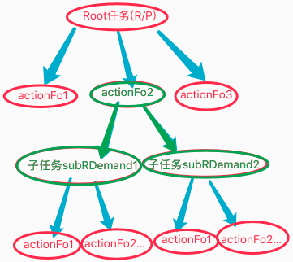
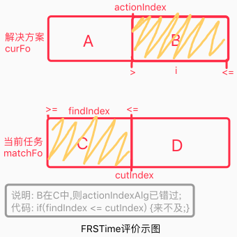
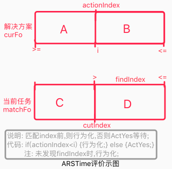

## 理性子任务
`CreateTime 2021.02.23`

在春节前对觅食和防撞训练融合训练时,发现小鸟无法良好完成此任务,要么死活不敢飞到危险地带,要么就有各种别的问题,`参考n22p12&n22p13`,本文将对此问题的解决做总结;

***

### 1. 本文共涉及两方面的改动

　　**R子任务：**以往的反思子任务仅支持感性评价竞争，本文将针对支持理性R子任务，即对觅食主任务时，生成的防撞子任务。<br>
　　**理性反思：**以往的反思子任务仅支持感性评价竞争，本文将支持理性反思，即新增`FRSTime和ARSTime`两个评价器。

***

### 2. 示例

**本文提供一个为例，方便套入后理解：**<br>
在穿越森林前，我们会准备好枪，以防森林里有可能出现的老虎。其中：<br>
* 主任务为穿越森林：`[出门，走过，森林]->{开心}`。
* 子任务为预测到有可能会出现老虎：`[老虎，咬人]->{危险}`。
* 子任务解决方案为：`[带枪，遇到老虎，开枪，吓跑]->{安全}`。

***

### 3. 子任务

* 以往做法：在主任务执行过程中，通过反思发现子任务，预测危险，比如可能有老虎危险。并且对危险进行评价，并决定是否继续决策。
* 现新做法：发现子任务后，将子任务作为R子任务加入到`输出期短时记忆`中，并对其进行理性的决策，解决掉它带来的问题（比如带枪，遇到老虎时吓跑它）。
* 子任务加入到`输出期短时记忆`示图如下：（其中绿色部分为本次涉及改动部分）。



***

### 4. 来的及评价：FRSTime & ARSTime
HE中的决策就是在`决策向性`上对网络进行依次激活，并且评价的过程，所以针对此次新增的反思子任务决策，依然采用评价器方式来评价之，不过它新增了两个评价器，如下：

| FRSTime | 评价器说明 |
| --- | --- |
| 名称 | FRS全称FrontOrderReasonScore即时序理性评价器 |
| 简介 | 本次主要判断是否`来的及`，即已错过的评价为否。 |
| 举例 | 比如已出了门，枪已经忘带了，现在执行`带枪`已经迟了。 |
| 示图 |  |
| 说明 | 图中当解决方案未执行部分B，在当前任务已过去式部分C，中出现时，即表示已错过。 |

| ARSTime | 评价器说明 |
| --- | --- |
| 名称 | ARS全称AlgReasonScore即概念理性评价器 |
| 简介 | 本次主要判断是否`实时行为化`，即无需要现在行动的部分要等待时机再动。 |
| 举例 | 比如出门前带枪是ok的，但此时开枪不对，要等老虎自己出现时再开。 |
| 示图 |  |
| 说明 | 图中当解决方案整体AB，在当前任务未来部分D，中出现时（设出现的位置为i)，那么i之前可实时行为化，i之后要等待其出现（套入例子，i为老虎）。 |

### 5. 代码实现：

1、子任务（调用：反思评分为否时，调用之）
```objective-c
/**
 *  MARK:--------------------子任务接口--------------------
 *  @implement
 *      1. TOFoModel    : 用于挂载子任务们 (比如反思到此举可能有三害,那么就有3个子任务);
 */
@protocol ISubDemandDelegate <NSObject>

-(NSMutableArray*) subDemands;

@end

///////////子任务调用代码//////////
if (outModel.actionIndex == -1 && !ISOK(outModel.baseOrGroup, ReasonDemandModel.class)) {

    //6. MC反思: 回归tir反思,重新识别理性预测时序,预测价值; (预测到鸡蛋变脏,或者cpu损坏) (理性预测影响评价即理性评价)
    AIShortMatchModel *rtInModel = [self.delegate toAction_RethinkInnerFo:curFo];

    //7. 子任务_对反思预测fo尝试转为子任务;
    for (AIMatchFoModel *item in rtInModel.matchFos) {

        //2. 子任务_评分为负时才生成;
        CGFloat score = [AIScore score4MV:item.matchFo.cmvNode_p ratio:item.matchFoValue];
        if (score >= 0) continue;
        ReasonDemandModel *subDemand = [ReasonDemandModel newWithMModel:item inModel:rtInModel baseFo:outModel];

        //3. 子任务_对其决策;
        [self.delegate toAction_SubModelBegin:subDemand];

        //4. 子任务Finish/ActYes时,不return,因为要继续父任务;
        //return;
    }
}
```

2、FRSTime评价器（调用：每次时序行为化，都要先调用之）

```objective-c
/**
 *  MARK:--------------------时序来的及评价--------------------
 *  @desc 对将要决策部分:B 和 已发生部分:C 之间进行mIsC判断 (B<=C=已错过) (参考22197);
 *  @result
 *      true    : 继续行为化 (比如:没错过,正常继续即可);
 *      false   : 已错过即:将任务推进到已发生处 (比如:穿越森林任务出门前带枪,但已经出门了,枪已经忘带);
 */
+(BOOL) FRS_Time:(TOFoModel*)toFo demand:(ReasonDemandModel*)demand{
    //1. 数据检查;
    if (!toFo || !demand) return true;
    AIFoNodeBase *curFo = [SMGUtils searchNode:toFo.content_p];

    //2. 对将要决策部分:B 和 已发生部分:C 之间进行mIsC判断;
    for (NSInteger i = toFo.actionIndex + 1; i < curFo.count; i++) {
        AIKVPointer *alg_p = ARR_INDEX(curFo.content_ps, i);
        NSInteger findIndex = [TOUtils indexOfConOrAbsItem:alg_p atContent:demand.mModel.matchFo.content_ps layerDiff:2 startIndex:0 endIndex:demand.mModel.cutIndex];
        if (findIndex != -1) {
            //3. B < C = 已错过;
            return findIndex <= demand.mModel.cutIndex;
        }
    }
    return true;
}

///////////FRSTime调用代码//////////
-(void) convert2Out_Fo:(TOFoModel*)outModel{
    //4. FRS_Time错过评价;
    BOOL frsTime = [AIScore FRS_Time:outModel demand:(ReasonDemandModel*)outModel.baseOrGroup];
    if (!frsTime) {
        NSLog(@"FRSTime理性评价(错过)-不通过");
        outModel.status = TOModelStatus_ScoreNo;
        [self.delegate toAction_SubModelFailure:outModel];
        return;
    }
}
```

3、ARSTime评价器（调用：在概念的cHav`有`之前，要先调用之）

```objective-c
/**
 *  MARK:--------------------概念来的及评价--------------------
 *  @desc
 *          1. 说明: R子任务来的及评价 (后续考虑支持rootR任务) (参考22194 & 22195 & 22198);
 *          2. 决策时序AB 在 任务未发生部分D 中找mIsC (找到AB中index,index及之后需要等待静默成功,之前的可实行行为化) (参考22198);
 *          3. 必要性: ARSTime来的及评价是针对某帧的,而决策中,外界条件会变化,所以必须每帧都单独评价;
 *  @param dsFo : 当前正在推进的解决方案,其中actionIndex为当前帧;
 *  @param demand : 当前任务;
 *  @result (参考22194示图 & 22198);
 *      true    : 提前可预备部分:返回true以进行_hav实时行为化 (比如:在穿越森林前,在遇到老虎前,我们先带枪);
 *      false   : 来的及返回false则ActYes等待静默成功,并继续推进主任务 (比如:枪已取到,现在先穿越森林,等老虎出现时,再吓跑它);
 */
+(BOOL) ARS_Time:(TOFoModel*)dsFo demand:(ReasonDemandModel*)demand{
    //1. 数据检查;
    if (!dsFo || !demand) return true;
    AIFoNodeBase *curFo = [SMGUtils searchNode:dsFo.content_p];

    //2. 当dsAlg会导致弄巧成拙时,评价为否->ActYes;
    for (NSInteger i = 0; i < curFo.count; i++) {
        AIKVPointer *alg_p = ARR_INDEX(curFo.content_ps, i);
        NSInteger findIndex = [TOUtils indexOfConOrAbsItem:alg_p atContent:demand.mModel.matchFo.content_ps layerDiff:2 startIndex:demand.mModel.cutIndex + 1 endIndex:NSUIntegerMax];
        if (findIndex != -1) {
            //3. ARSTime结果 (参考22194示图 & 22198);
            return dsFo.actionIndex < i;
        }
    }
    return true;
}

///////////ARSTime调用代码//////////
-(void) convert2Out_Hav:(TOAlgModel*)outModel {
  //R-模式理性静默成功迭代: R-模式_Hav首先是为了避免forecastAlg,其次才是为了达成curFo解决方案 (参考22153);
      //1. 判断当前是R-模式,则进行ARS_Time评价;
      if (ISOK(outModel.baseOrGroup.baseOrGroup, ReasonDemandModel.class)) {
          ReasonDemandModel *rDemand = (ReasonDemandModel*)outModel.baseOrGroup.baseOrGroup;
          TOFoModel *dsFo = (TOFoModel*)outModel.baseOrGroup;
          BOOL arsTime = [AIScore ARS_Time:dsFo demand:rDemand];
          if (!arsTime) {
              //2. 评价不通过,则直接ActYes,等待其自然出现 (参考22153-A2);
              outModel.status = TOModelStatus_ActYes;
              [self.delegate toAction_SubModelActYes:outModel];
              return;
          }
      }

      //5. 去掉不应期
      NSArray *except_ps = [TOUtils convertPointersFromTOModels:outModel.actionFoModels];

      //4. 第3级: 数据检查hAlg_根据type和value_p找ATHav
      AIKVPointer *relativeFo_p = [AINetService getInner1Alg:curAlg vAT:outModel.content_p.algsType vDS:outModel.content_p.dataSource type:ATHav except_ps:except_ps];
}
```
