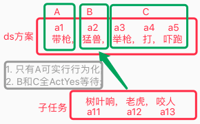

## 嵌套关联
`CreateTime 2021.03.23`

***

　　在才前早前已经有嵌套的设想，但认为较为麻烦，就没做实践。在最近做子任务时，发现做嵌套需求时机成熟，本文将针对嵌套的改动部分做总结。

　　嵌套关联，是继：组分关联与抽具象关联后，HE的第三种关联方式，以往一直在用的HNGL类型，其实也是嵌套，只是当时代码偷懒，用absPorts兼容了这一关联方式。

***

### 1. 反向反馈类比DiffSubPorts(dsPorts)嵌套

　　更理性的R任务决策，要求其S解决方案，必须做来的及评价（参考图1）。

　　而来的及评价又要求S方案具备更理性的关联：包括S经验本身更确切的抽象、以及S经验所处的场景时序在抽象路径上的复用（参考图2）。

　　说明：见图2，具象时序F2[老虎,咬人]，在抽象时序F3[猛兽,伤人]，这样的抽象通路中，其S是可以复用的，所以我们才从F3中找dsPorts经验，并找到F4解决方案。

　　代码变动：在FoNode中，新增了dsPorts端口，用于表征S的嵌套关联。

* 图1：
* 图2：

   

### 2. 变化大小GreaterLessPorts(glPorts)嵌套

　　目前GL的关联工程实践方式不变，仍然采用absPorts + ATType来表征，而不是独立成glPorts。不过在网络结构上要针对做一些调整，使之与dsPorts的经验取用类似（见图3）。说明，如图所示：

| 图3 |  |
| --- | --- |
| 说明 | 如图所示，下方3条说明： |
| 基础 | 首先要加强protoFo与absFo的抽具象关联（参考n23p04）。 |
| 认知期 | 需要在构建时将抽象出的glFo挂载到absFo下（参考内中外类比v4代码）。 |
| 决策期 | 在使用时也需要在场景fo的抽具象通路上分别采用glFo解决方案。 |

   

### 3. 变化有无HavNonePorts(hnPorts)嵌套

一切与gl嵌套都一致，唯一区别是决策时的抽具象通路的向性上：
1. gl是瞬时记忆中的proto起步，向着抽象。即向性：↑。
2. hn是解决方案中的curFo起步，向着具象。即向性：↓。

   

### 4. 实践源码：

本文代码自行参考如下指引：
1. dsPorts嵌套代码：参考AIAnalogy中的Diff反向反馈类比代码，以及R任务取用解决方案处的代码。
2. glPorts嵌套代码：参考AIAnalogy中的内中外类比v4，以及getInnerGL_V3取用解决方案处的代码。
3. hnPorts嵌套代码：参考AIAnalogy中的内中外类比v4，以及getInnerHN_V3取用解决方案处的代码。
