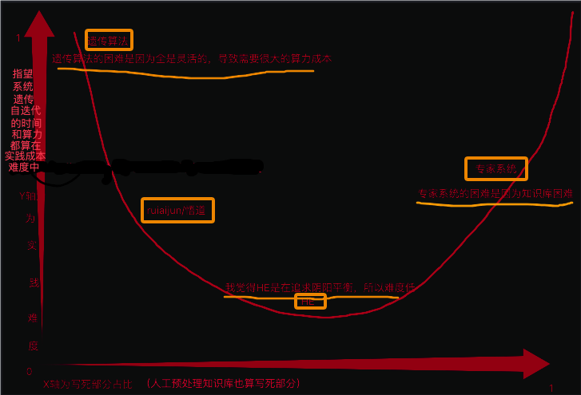

## 对AGI实践路线的分析
`CreateTime 2025.02` `by 赤`

| AGI路线&难度分析 | A组小程序（计算机增删改查等）功能 | B组思维模块（识别，预测，迁移等）功能 | C后天场景知识数据等 | 难度（熵控制成本+人工部分成本） |
| --- | --- | --- | --- | --- |
| 遗传算法 | AGI负责 | AGI负责 | AGI负责 | 极高（注意：是遗传很难升华，遗传算法目前为止除了大自然造人外，我们未发现比较好的落地） |
| ruiaijun/悟道 | 人负责 | AGI负责（通过自组织小程序实现） | AGI负责 | 高 |
| HE | 人负责 | 人负责 | AGI负责 | 中 |
| 专家系统 | 人负责 | 人负责 | 人负责（或人为预处理） | 极高（注意：是人工常识库成本高，不是写符号系统难度高） |

总结：我认为相对来说HE系统在工程实践上应该算简单的，因为HE一直是在不影响通用的情况下，允许代码写死。所以就一直是活和死在博弈一个平衡点。  
1、人负责先天代码过少，会导致代码死控制的部分少，熵增控不住。  
2、人负责后天知识过多，会导致人工死部分太多，熵减太多，人工太多（甚至绝望的人工量），或无法应对变化。  
