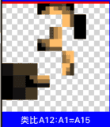

## HE系统的视觉

目录
1. 感官-HSB通道
2. 多粒度切图
3. 组码索引
4. 单特征表征
5. 单特征识别
6. 单特征类比
7. 组特征构建
8. 组特征识别
9. 组特征类比

***

1. 介绍
   - 我叫贾晓刚，8年多来，自己一直在利用业余时间，持续开发一个叫HE的AGI系统，~HE是螺旋helix的前辍，也是中文“和”字的拼音~，
   - 思维控制：HE系统目前已支持从感知、识别、反馈、学习、任务、意向、规划、求解、决断、行为一系列思维功能。
   - 知识表征：也支持从稀疏码表征、特征、概念、时序、价值感一系列知识表征网络。

2. 主题
   - 今天我把HE系统其中的一小块：视觉，拿出来和大家做个分享交流，为什么要分享视觉呢，大家都知道上世纪专家符号系统有知识源问题，而本世纪的深度学习网络又有可解释性问题，两者都指向一个具备可解释的感官输入端。
   - 所以我今天把HE的视觉：从图像的输入到识别，以及可能涉及一些与此相关联的一些代码流程。
   - 我的分享会更加偏向于更具体可运行的工程代码流程，数据结构等。~数据结构处理流程等~。

3. 流程1：图像输入与分割
   - 输入一张图片可能有上万像素，首先分通道(HSB三个通道)。
   - 然后要分割（分形）//输入的必须被结构化，可复用，索引关联。
   - 
   - 对分割区域各个粒度层分别进行拆分九宫，然后计算方向，差值，均值，做为三个索引值（做为一个稀疏码GV）。
   - 
   - 分割有两种粒度方式：一种是固定粒度（快省HDD），一种是自适应粒度（慢耗CPU）。//二者最终会握手进行匹配识别

4. 流程2：稀疏码索引
   - 固定粒度建索引（索引序列）。
   - 单张1000像素的图片，可能建立索引有50个左右的稀疏码GV。

5. 流程3：单特征构建
   - 单张图像最后表征成一个“稀疏码 & 位置范围”的数组（这个指针数组叫单特征节点）。
   - 
   - 所有的图像互相复用稀疏码。

6. 流程4：单特征识别
   - 问：为什么要做自适应粒度？答：固定粒度的间隔过大错位等问题。
   - 发起：自适应粒度识别（各粒度生成GV值）。
   - 切入：所有的图像互相复用稀疏码，我们通过单条稀疏码与之相近的稀疏码，来找到以往有过该码的图像。//比如0的左上角有个上坡斜线。
   - 自举：每个激活的单特征，分别根据下一个码的位置，依次自举它的50个码，（找到对应结果的“位置符合度”，以及“匹配度”）。//比如0和8的左上角匹配上。
   - 过滤：边自举，边批量发现不符，并进行过滤。
   - 
   - 竞争：最终根据：位置符合度、匹配度、健全度，进行竞争。

7. 流程4：特征提取：单特征类比抽象
   - 类比算法：识别完成后，把proto和ass进行类比，把符合度匹配度高的，保留下来，生成抽象特征（比如0和8的左上角）。

8. 流程5：组特征构建
   - 把所有类比结果单特征，组成一个新的节点：组特征（元素是单特征的指针&范围数组）//比如0的左上右上左下右下。

9. 流程6：组特征识别
   - 根据单特征，继续向组特征索引，并判断位置符合度、匹配度、显著度。
   - 步骤与流程4类似。

10. 流程7：特征提取：组特征类比抽象
   - 类比算法：识别完成后，把proto和ass进行类比，把更准确的元素保留下来，生成抽象组特征。//比如0左右两边必须是竖线，8不是0。
   - 
   - 
   - 别的步骤与流程4类似。
   - 示例：
   - 
   - 

11. 总结：整体总结
   - 其实整体流程：就是先分割放开，再利用关联激活拼回。

12. DEMO
   - 多物识别相关的图和说明。

## PPT提示稿
page1：今天我把HE系统其中的一小块，就是感官知识部分，中的视觉，拿出来和大家做个分享交流。
page2：输入上万像素，
