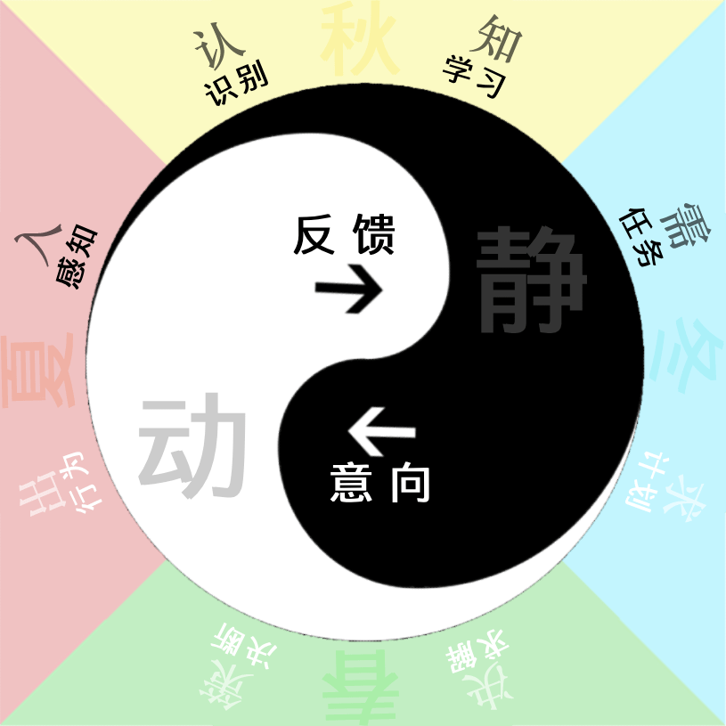

## 四象生克
`CreateTime 2026.04.03`

## 生（相邻）：
- 认知生需求
  - 感到疼痛饥饿预测危险
- 需求生决策
  - 需求有意向性推向求解
- 决策生行感
  - 解需行为改变感受变化
- 行感生认知
  - 对行为及变化的再认知

## 克（相隔）：
- 认知克决策
  - 认知太少，愚昧无解（如收成太少，来年迷不知种什么）
  - 认知太足，不向外求（如收成太多，来年无劳种的必要）
- 需求克行感
  - 需求太少，无欲无为（如没计划好，种少种错自然不长）
  - 需求太足，满欲不应（如啥都想要，啥都很难真正得到）
- 决策克认知
  - 决策太少，无所知之（如种的太少，自然秋天收成就少）
  - 决策太足，无所适从（如种的太多，挤抢空间长不出果）
- 行感克需求
  - 行感太少，挫败无心（如懒睡不动，自然什么都不想要）
  - 行感太多，得意忘形（如感受太多，繁华充沛必忘本心）

## 总结：
1. 本文是四象生克（而非五行），土在中负责持续的推动纵向力（即螺旋论中的“定义”）。
2. 在运转中，升力与纵向推动力相和时，则相邻相生相济。若升力过少过足，都会相隔不生不济。
3. 本文初稿，只是大致讲四象生克，展开的解释与示例多有不足，有时间再改，没时间就懒得改了。
4. 本文之理，介入世间诸事很容易验证与理解，但本文主要还是集中在智能这一面角度。
