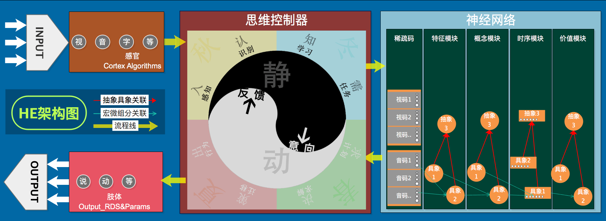

# 螺旋论——一个熵减机理论

***

## 1. 运行环境
**> 对比**：现实世界整体熵增的，而其内的智能体是熵减的。  
**> 交互**：智能体从现实世界中吸取负熵，以解决现实世界整体的熵增带来的需求。  
**> 极端**：无熵增的世界不需要智能体，而无熵减的世界要智能体也无用。  
**> 环境**：熵增减活跃度越高的环境，越容易孕育智能体。  

## 2. 理论三要素

**定义**：定义是从无到有,从模糊到相对确切的过程。
  * 如：`最初对某知识不够掌握，学习中慢慢变得确切些。`

**相对**：定义之间动静相对。
  * 如：`认知与决策相对`、`思维与记忆相对`、`智能体与现实世界相对`。

**循环**：相对之间循环协作。
  * 如：`内层价值循环`、`中层思维与网络循环`、`外层智能体与现实世界循环`。

**螺旋**：定义、相对、循环共同呈现螺旋，生成自然演化的系统。

## 3. 信息熵减机模型：
> 熵减机可用于且不限于构建信息熵减系统。

1. 信息熵减机模型：是熵减机在信息处理系统的模型。
  - 信息熵减机模型可体现出一定的智能，描述如下：
  - 智能：从输入获取规律与其价值，并用于指导输出，将低价规律加工为高价规律的能力。
2. 熵减机物理模型：暂略。

* 注1：上图是客观视角模型图，但系统角度应以智能体主观视角来看。
* 注2：主观视角下的认知与决策双向模型图暂未绘制，可参考代码结构（很简单）。
* 注3：无论是哪种视角下的模型图，其原理形态类似，不影响模型所表达的意思。

## 4. 系统：

HE系统内核：he4o是在熵减机理论模型上实践出来的通用人工智能项目，本理论与he4o互相印证,共同形成;

## 5. 手稿：

| 手写笔记目录 | 描述 |
| --- | --- |
| [Note1](手写笔记/Note1.md) | [流架构](手写笔记/Note1.md) |
| [Note2](手写笔记/Note2.md) | [金字塔架构](手写笔记/Note2.md) |
| [Note3](手写笔记/Note3.md) | [分层抽象](手写笔记/Note3.md) |
| [Note4](手写笔记/Note4.md) | [LOP](手写笔记/Note4.md) |
| [Note5](手写笔记/Note5.md) | [神经网络](手写笔记/Note5.md) |
| [Note6](手写笔记/Note6.md) | [LOP-DataLayer](手写笔记/Note6.md) |
| [Note7](手写笔记/Note7.md) | [神经网络-软件架构设计](手写笔记/Note7.md) |
| [Note8](手写笔记/Note8.md) | [AwarenessLayer-软件架构设计](手写笔记/Note8.md) |
| [Note9](手写笔记/Note9.md) | [思维](手写笔记/Note9.md) |
| [Note10](手写笔记/Note10.md) | [思维与神经网络整合-数据神经网络(归纳结构)的构建](手写笔记/Note10.md) |
| [Note11](手写笔记/Note11.md) | [GNOP之宏微与定义](手写笔记/Note11.md) |
| [Note12](手写笔记/Note12.md) | [GNOP之流程与实践](手写笔记/Note12.md) |
| [Note13](手写笔记/Note13.md) | [相对宏微与循环](手写笔记/Note13.md) |
| [Note14](手写笔记/Note14.md) | [中层循环 & 发布与演示](手写笔记/Note14.md) |
| [Note15](手写笔记/Note15.md) | [小鸟生存演示1-场景/祖母/MIL/MOL/内类比](手写笔记/Note15.md) |
| [Note16](手写笔记/Note16.md) | [小鸟生存演示2-MOL/行为化/迭代输入](手写笔记/Note16.md) |
| [Note17](手写笔记/Note17.md) | [理性思维/向性/理性决策/反思](手写笔记/Note17.md) |
| [Note18](手写笔记/Note18.md) | [测试 & 细节改动 & 训练](手写笔记/Note18.md) |
| [Note19](手写笔记/Note19.md) | [测试 & 细节改动 & 训练](手写笔记/Note19.md) |
| [Note20](手写笔记/Note20.md) | [v2.0版本三测](手写笔记/Note20.md) |
| [Note21](手写笔记/Note21.md) | [v2.0版本四测、五测、六测](手写笔记/Note21.md) |
| [Note22](手写笔记/Note22.md) | [v2.0版本六七八测 & 评价器 & R-模式迭代 & 子任务&ARSTime评价](手写笔记/Note22.md) |
| [Note23](手写笔记/Note23.md) | [v2.0版本九测、十测、十一测](手写笔记/Note23.md) |
| [Note24](手写笔记/Note24.md) | [v2.0版本十二测、思维控制器架构调整](手写笔记/Note24.md) |
| [Note25](手写笔记/Note25.md) | [废弃HN & 分裂:理性反省和感性反省 & 相近匹配 & 强化训练 & 整体兼顾&各线竞争](手写笔记/Note25.md) |
| [Note26](手写笔记/Note26.md) | [逐层宽入窄出 & 快慢思考 & S综合排名 & Analyst](手写笔记/Note26.md) |
| [Note27](手写笔记/Note27.md) | [迭代反思TCRefrection & 思维框架图v4 & 任务失效机制 & 抽象多层多样性 & 不完全时序问题 & 复用相似度与indexDic & canset再类比](手写笔记/Note27.md) |
| [Note28](手写笔记/Note28.md) | [螺旋调教 & TCSolution前段条件满足迭代](手写笔记/Note28.md) |
| [Note29](手写笔记/Note29.md) | [Canset迁移增强](手写笔记/Note29.md) |

## 6. 阶段说明：本手稿共分为两个阶段

###### 第1阶段（2018.11之前）
　　此阶段是最小版本的形成过程,即he4o系统的逐渐成熟过程;手稿越前期,越多错误之处,如遇错误,结合前后描述进行理解;

###### 第2阶段（2018.11至今）
　　此阶段是系统成熟过程，这阶段手稿转向偏实践，且随着越后期，其模型与理论很难从外界获得有益的反馈。系统偏向于成熟化迭代与孤寂的挥刀人。

## 7. 忠告读者与风险警告：
　　在本项目有可能的广为人知之前，不建议读者阅读本项目手稿与源码，因为带来的时间损失风险和掉到这条路的沉坑里来，各位自承担责任。
