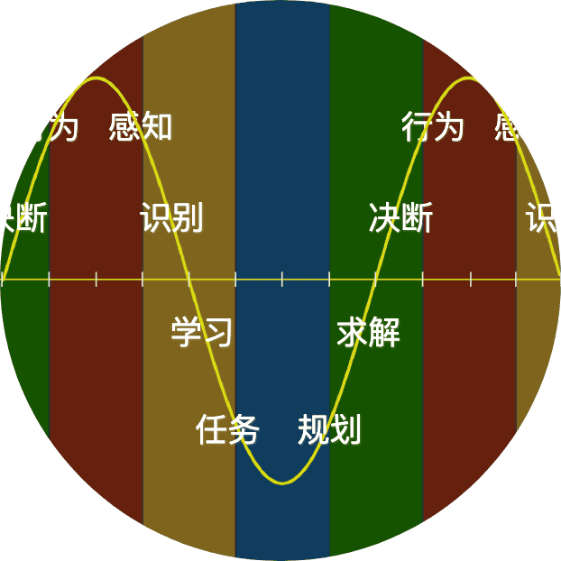
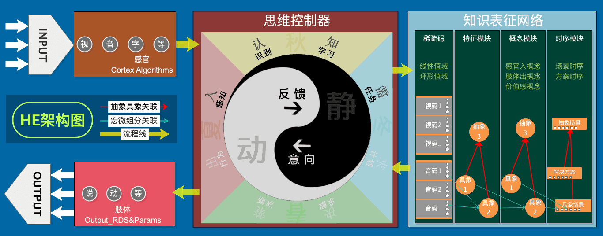

English | [中文](README.md)

# Helix Entropy-Reduction Theory

***

## 1. Entropy-Reduction Theory
**> Definition**: The real world as a whole trends toward entropy increase, while agents within it reduce entropy.  
**> Change**: Agents absorb negative entropy from the real world to address the demands brought by the overall entropy increase of the real world.  
**> Extremes**: A world without entropy increase needs no agents, and a world without entropy reduction has no use for agents even if they existed.  
**> Environment**: The higher the activity of entropy increase/decrease in an environment, the more likely it is to nurture agents.  

## 2. Helix Model: Three Elements

**Definition**: Definition is the process from nothing to something, from fuzzy to relatively exact.  
Example: `Initially lacking mastery of some knowledge, gradually becoming more exact through learning.`

**Relativity**: Definitions are relatively static or dynamic to each other.  
Example: `Cognition and decision are relative`, `Thinking and memory are relative`, `Agent and real world are relative`.

**Cycle**: Relative parts collaborate in cycles.  
Example: `Inner value cycle`, `Middle thinking-network cycle`, `Outer agent-real-world cycle`.

**Helix**: Definition, Relativity, and Cycle together form a helix, producing a naturally evolving system.  
Example: `The three elements above, once running, macroscopically present a helical shape.`

## 3. Application Model: Applied to Information Systems

##### 3.1 Purpose: For ease of understanding, below are brief summaries of what it can do.
To compensate for my weak writing and to help others understand, I wrote four versions from simple to complex:  
**Thinking version**: Cognize patterns, reproduce patterns, achieve goals.  
**Simple version**: Cognize the patterns of "input, use, output", use "output" to reproduce "input and use". (Note: "use" denotes utility)  
**Complex version**: Acquire the patterns of "perception, behavior, and value", use "behavior" to reproduce the ability of "perception and higher value".  
**Explanatory version**: Able to acquire the patterns of three kinds of information — "perception, behavior, and value" — and through using behavior, reproduce the ability of two goals: "perception and higher value".

##### 3.2 Diagram: The figure below depicts the simplified architecture diagram of the entire HE system, and it also shows the approximate relationships among all modules in the system.

* Note 1: The above is an objective-view model diagram, but from the system's perspective it should be viewed from the agent's subjective viewpoint.
* Note 2: The bidirectional cognition-decision model diagram under the subjective view has not yet been drawn; you may refer to the code structure (it is simple).
* Note 3: Regardless of which view's model diagram, the principle form is similar and does not affect the meaning the model conveys.

##### 3.3 Additional notes:
The above only describes its application to information systems, but the Helix Entropy-Reduction Machine is not limited to building information entropy-reduction systems. It can also be applied in physical domains (omitted for now).

## 4. Application System: HE System

HE System kernel: he4o is a general artificial intelligence project practiced on the theoretical model of the Helix Entropy-Reduction Machine. This theory and he4o mutually validate and co-form. Below is the architecture diagram:

## 5. Open Source Statement & Paid Statement
1. Uses the AGPL open source license.  
2. For commercialization, you may contact the author to obtain a commercial license, but commercialization can only obtain commercial authorization for the application layer, etc. (The author reserves the right of final interpretation).  
3. Payment: All or part of this theory, and software applications developed on the basis of the Helix Theory, are free for individuals and paid for commercial use. The commercial payment standard is: 0.1% of the product's listed price.

## 6. Manuscripts:

| Directory | Description |
| --- | --- |
| [Note1](手稿/Note1.md) | [Flow Architecture](手稿/Note1.md) |
| [Note2](手稿/Note2.md) | [Pyramid Architecture](手稿/Note2.md) |
| [Note3](手稿/Note3.md) | [Layered Abstraction](手稿/Note3.md) |
| [Note4](手稿/Note4.md) | [LOP](手稿/Note4.md) |
| [Note5](手稿/Note5.md) | [Neural Network](手稿/Note5.md) |
| [Note6](手稿/Note6.md) | [LOP-DataLayer](手稿/Note6.md) |
| [Note7](手稿/Note7.md) | [Neural Network - Software Architecture Design](手稿/Note7.md) |
| [Note8](手稿/Note8.md) | [AwarenessLayer - Software Architecture Design](手稿/Note8.md) |
| [Note9](手稿/Note9.md) | [Thinking](手稿/Note9.md) |
| [Note10](手稿/Note10.md) | [Integration of Thinking and Neural Network - Construction of Data Neural Network (Inductive Structure)](手稿/Note10.md) |
| [Note11](手稿/Note11.md) | [GNOP: Macro-Micro and Definition](手稿/Note11.md) |
| [Note12](手稿/Note12.md) | [GNOP: Process and Practice](手稿/Note12.md) |
| [Note13](手稿/Note13.md) | [Relative Macro-Micro and Cycle](手稿/Note13.md) |
| [Note14](手稿/Note14.md) | [Middle-Layer Cycle & Release and Demo](手稿/Note14.md) |
| [Note15](手稿/Note15.md) | [Bird Survival Demo 1 - Scene/Grandmother/MIL/MOL/Inner Analogy](手稿/Note15.md) |
| [Note16](手稿/Note16.md) | [Bird Survival Demo 2 - MOL/Behaviorization/Iterative Input](手稿/Note16.md) |
| [Note17](手稿/Note17.md) | [Rational Thinking/Tropism/Rational Decision/Reflection](手稿/Note17.md) |
| [Note18](手稿/Note18.md) | [Testing & Detail Changes & Training](手稿/Note18.md) |
| [Note19](手稿/Note19.md) | [Testing & Detail Changes & Training](手稿/Note19.md) |
| [Note20](手稿/Note20.md) | [v2.0 Version Test 3](手稿/Note20.md) |
| [Note21](手稿/Note21.md) | [v2.0 Version Tests 4, 5, 6](手稿/Note21.md) |
| [Note22](手稿/Note22.md) | [v2.0 Version Tests 6, 7, 8 & Evaluator & R-Mode Iteration & Subtasks & ARSTime Evaluation](手稿/Note22.md) |
| [Note23](手稿/Note23.md) | [v2.0 Version Tests 9, 10, 11](手稿/Note23.md) |
| [Note24](手稿/Note24.md) | [v2.0 Version Test 12 & Thinking Controller Architecture Adjustment](手稿/Note24.md) |
| [Note25](手稿/Note25.md) | [Deprecating HN & Split: Rational Reflection and Emotional Reflection & Similarity Matching & Reinforcement Training & Overall Balance & Line Competition](手稿/Note25.md) |
| [Note26](手稿/Note26.md) | [Layer-by-Layer Wide-In Narrow-Out & Fast/Slow Thinking & S Comprehensive Ranking & Analyst](手稿/Note26.md) |
| [Note27](手稿/Note27.md) | [Iterative Reflection TCRefrection & Thinking Framework Diagram v4 & Task Failure Mechanism & Abstract Multi-Layer Diversity & Incomplete Timing Problem & Reuse Similarity and indexDic & Canset Re-Analogy](手稿/Note27.md) |
| [Note28](手稿/Note28.md) | [Helix Tuning & TCSolution Front-End Condition Satisfaction Iteration](手稿/Note28.md) |
| [Note29](手稿/Note29.md) | [Canset Migration Enhancement](手稿/Note29.md) |
| [Note30](手稿/Note30.md) | [Anti-Collision & Foraging Joint Training & Learning Peeling](手稿/Note30.md) |
| [Note31](手稿/Note31.md) | [Peeling Transport Training & Real-Time Canset Competition](手稿/Note31.md) |
| [Note32](手稿/Note32.md) | [Detail Fixes & Training to Learn Transport and Use Transport](手稿/Note32.md) |
| [Note33](手稿/Note33.md) | [Multi-Directional Continuous Training of (Foraging & Flying-Dodge & Kick-Transport) Three Items, and Three-Item Fusion Training](手稿/Note33.md) |
| [Note34](手稿/Note34.md) | [Multi-Code Features, Fixed-Granularity Vision Support](手稿/Note34.md) |
| [Note35](手稿/Note35.md) | [Adaptive Granularity Vision Iteration](手稿/Note35.md) |
| [Note36](手稿/Note36.md) | [GT Recognition: Inaccuracy Problem & Misalignment Problem & Iterative GT Bootstrapping to GV Slicing](手稿/Note36.md) |
| [Note37](手稿/Note37.md) | [Weighted-Sum Slicing Method & Large-Scale Vision Training & Vision Attention Recursion](手稿/Note37.md) |

## 7. Stage Description: The manuscripts are divided into two phases

###### Phase 1 (After Spring Festival 2017 - 2018.11)
　　This phase is the formation of the theory and the validation of the minimal version system, i.e., the gradual maturation process of the he4o system. The earlier the manuscript, the more errors it contains; if you encounter errors, understand them in conjunction with the surrounding descriptions.

###### Phase 2 (2018.11 - 2025.05)
　　This phase is the system maturation process. Manuscripts in this phase shift toward practice, and as they progress, it becomes increasingly difficult to obtain useful external feedback on the model and theory. The system trends toward mature iteration and the solitary swordsman. During this period, the HE system successfully demonstrated the crow demo in three separate parts, but the fully integrated version has not yet been completed.

###### Phase 3 (2025.03 - Present)
　　This phase is the process of pushing the system toward market application. This phase shifts toward practice aimed at market applicability. A fully interpretable unsupervised learning visual recognition demo has already been successfully demonstrated.
