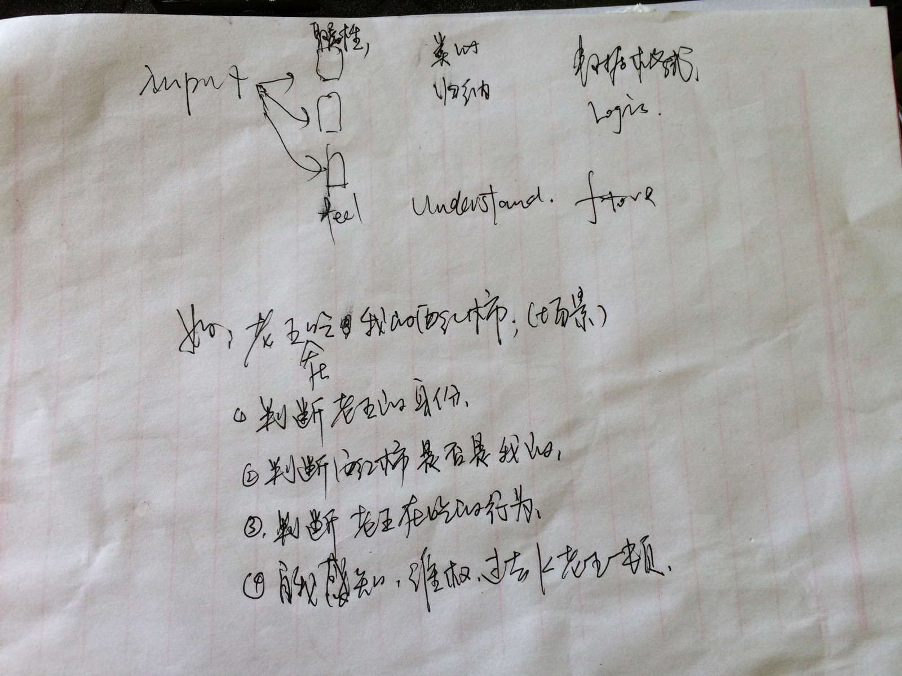

- [ ] 灵活(动态继承,动态属性,动态接口等;)

- [ ] 唯一性：
	- 从可获取到的特征对比;(如夜间,根据声音)
	- 从最显著的特征开始对比;(如杯子的颜色)

 
 
 
 
 
 
 

- [x] 人类存的图像数据整体很磨糊，细节很清晰

- [ ] 视觉从注意点四散越往外像素点越大。GAN时，生成的图像即是反。对比属性时，对比什么就生成什么。
	- 颜色
	- 纹理
		- 透明度
		- 反光度
		- 散光度

- [ ] 联想;
- [ ] 想像力，把图像属性，甚至文本描述GAN成图像演绎;

 
	- 记忆中没有图，只有形状，颜色，尺寸，等信息。材质，
		- 想像力的时候，我们会根据颜色数组的权重和材质的权重，铺到模型上。GAN

	- 怎样知识表示(不同的Logic怎么表示)
		- 归纳
			- 继承关系的灵活变更(即是什么,是可以变化的)

	- 关于相似(例如A取到本地B,则AB都是指针,属性值可从类别取)
	- 关于推理过程(其本质是逻辑的还是非逻辑的)
	- 关于类比结论(怎样保证结论的正确性,或者标记这种可靠程度)
	- 关于计算模型
		- 代码有:顺序,分支和循环,
		- 演绎推理的计算模型有匹配,归约(纳)和代换等基本控制和操作
		- 类比推理的计算模型是否也有通用性的控制结构和基本操作?

- [ ] 数据拆分
	- 记忆:
		- "原始数据"的记忆功能,拖慢了性能;考虑去掉;
		- 理解的部分:(先理解再记忆,Input数据->Understand->记忆)
		- 不理解的部分:(建立理解任务)

	- 逻辑知识:

- [ ] 错误修复(越是新知识;错误的可能越大;这种错误的修复变的至关重要)
	- 遗忘机制
		- 一定时间不用,选择性遗忘;
		- 经常使用,加深记忆
	- 修复机制
		- 信息来源:(兼听则明,分析结果)
		- 例如:老师描述同一件事物的词不同,就很容易去学习老师的用词方式;(浠,说表演)
	- 去掉分词系统后,的一些数据格式;

- [x] 优化架构:
