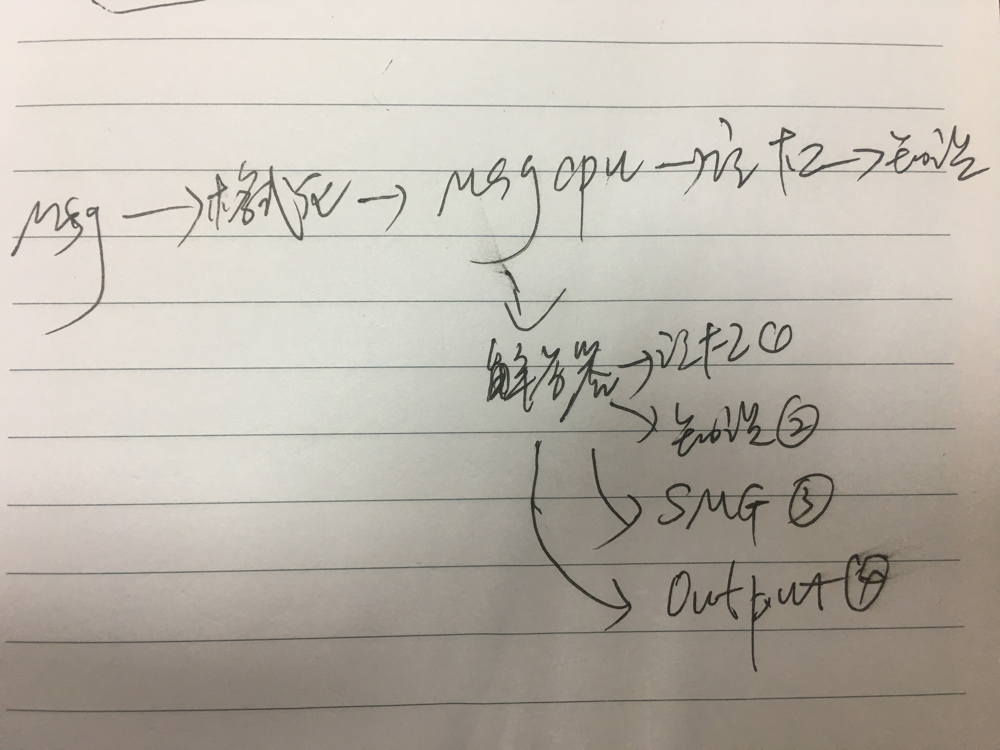
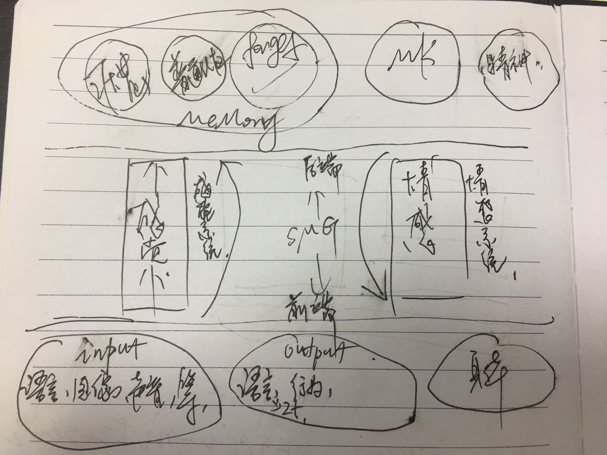

### 架构

***

- IMessage,记忆,知识的金字塔结构
 	- 输入时:
		- Message,信息(交由第三方处理取到接口数据如:分词语义数据)  
由MsgCPU把接口数据提取出记忆数据;
		- 记忆,
把记忆条目插入记忆池,
并由MemoryCPU提取出知识数据,
		- 知识:  
知识插入各数据库

	- 输出时:

		- Message,(外部需求,由第三方处理为接口数据,内部需求自行处理为实现接口)  
			- 由MsgCPU理解需求;  
			- 由解答器确定要查什么,
		- 需要查记忆时,到记忆中查数据;
		- 需要知识时,到知识库查数据;
		- 由解答器来生成响应,交给SMG
		- SMG确定回答的具体内容和回答方式;  
		SMG需要根据提问者身份，来查询权限和回答习惯。

	- #### 注:有些交互,同时需要输入和输出;

***
***
***

### 目前为止较为明朗的架构:

***
