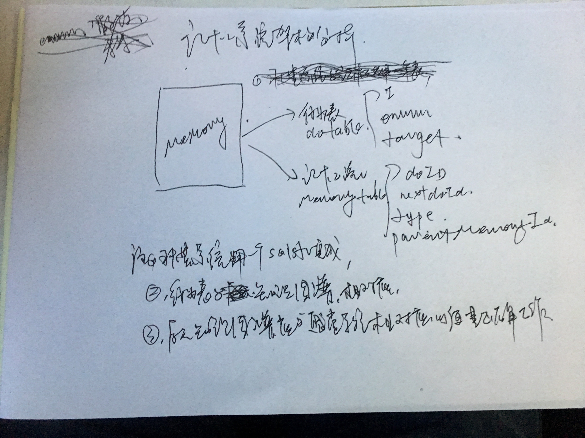

记忆模块  

## 金字塔结构(3个数据库)  
1,习惯  
2,记忆  
       2.1,临时记忆  
       2.2,记忆  
       2.3,深刻记忆(反复的,或者强烈的)  
3,遗忘池  
3.1,索引  
3.2,数据  
注：临时记忆可直接转到遗忘池，遗忘池有关联列，例如时间关联，关键词关联，系统类关联。  

***

## 记忆的数据化的两个部分  
1：物体数据化  
2：经历流程记录  

### 物体数据化  

#### 错觉，  
记忆是去重的，注意力到的东西会先在大脑预加载相似体，相似体会自动作粗略的外观比较，return true则替换，return false则记忆新物体。  

### 经历流程记录  

#### 根据重要性  
1，重要性低的，直接存到遗忘池  
2，  

#### 赌物思事：参与物体，将有索引指向，例如，看到某物体或场景，想起遗忘池的事情。  

***

## 信息可视化:(暂不实现)  
记忆的信息;可视化为图形;output到显示器的功能;方便调试;  

***

## 习惯记忆  
1,习惯记忆按时间段分块;  
2,习惯记忆按专业领域分块;  
注：有临时习惯记忆，如：药有苦有怪味，想过一次，第二次就是这答案，但几天后答案马上变。  

***

## 记忆管理器  
1,自动管理  
2,存储,读取  
3,后台自动处理记忆数据到不同数据库  

注：  

***
## 深度输入记忆提取成知识。  
 
### 可信度高的直接提取成知识。

## 深度输出记忆提取成习惯。

### 有效性高的直接提取成习惯。

***

## 表结构设计

### 物体表（这个归知识图谱）
0(int)_我(string)_是否后天（bool)  

### x行为x（记忆主表）
1，打架type 打人，被打，  
2，行为的包含关系：路过包含了在过哪里  

### 记忆关联表
例如：我在某地看到木墙  
结构：  
       memoryId（我在某地id,我看到木墙id)  
otherMemoryId(与谁的关系)  
parentMemoryId(父记忆Id)  
timeCompareType (记忆时间顺序,之前,之后,同时)  

### 想办法去掉行为定义枚举。由后天生成。
***

## 表结构辅表

### 时间和地点
1,时间和地点都由关联记忆所推理;  
2,在每个记忆上打时间和地点的字段是没必要的;  
3,在某个地点  和  在某个时间  本身就是一条记忆;  

### 行为类型翻译表(这个归自然语言处理部分)
1_2_被打  

***

- 注：知识图谱很难唯一识别的物体是哪个，但有了记忆系统的关联，很容易找到。  
- 像药是什么味道这样的属性，是苦的是知识图谱属性，大多是苦的是习惯记忆，有苦有怪味是多样普通记忆结果。  

***

## 例如：你有没有来过北京？
1. 你到过北京？
2. 提问者应该95%在北京。
### 回答数据准备：
1. 搜索到北京的回忆，
2. 搜索提问者和北京的记忆
### 回答：
1. 去过，你在北京干嘛？

***

## 表数据分解
- 例如:我从家出发,和小赤想跟上班;路上一起打了B;
	1. 我 从 家
	2. 我,小赤 在 路上(事件发生的地址)
	3. 我,小赤 去 上班
	4. 我,小赤 打了 B
- 注:每条主记忆有一条地点和时间;可为null;

***

## 记忆系统的替代与假替代
### 替代”在路上(上例)”;
例如:我从家出发,和小赤想跟上班;路上一起打了B;  
我 去 上班;  
上班由 “公司” 替代;  

### 假替代”在路上(上例)”;
例如:我从家出发,和小赤想跟上班;路上一起打了B;  
我 在 路上;  
路上由 “上班路途随机点,甚至小学上学路上” 来替代;   

***

##描述另一个时间维度
- 如：开会时，提出需求，按钮按下时，颜色变灰。

***

***
