# 情感机器
***

- ### 全新思维方式的产生:
	- 细分工作
	- 类比
	- 尝试和错误
	- 反复学习

- ### 人类精神活动的6个层级

	- 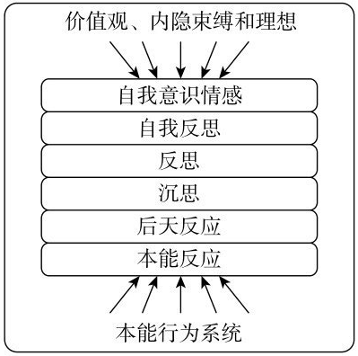

- ### 弗洛伊德三明治

	- 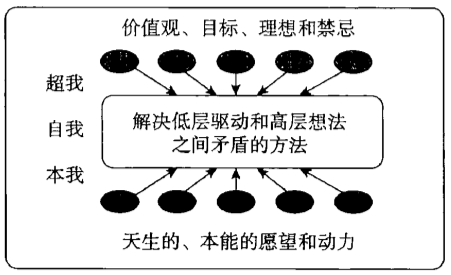

- ### 6个层级和三明治结合

	- 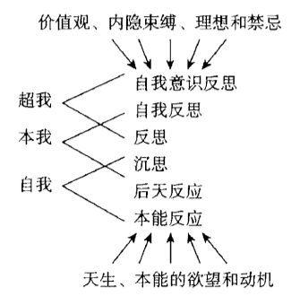

- ### 约束
	- 社会规则和禁忌成为社会道德规范;
		- 观念
		- 文化

- ### 印刻者
	- 对情感的发育成长起到关键的作用;
	- 印刻者思维模型:
		- 生成印刻者模型后,当印刻者不在场;
		- 我们使用"模型"升华目标;
		- 模型升级为"良心","理想","道德规范";
		- 注:([其实就是我的MindValue表(~>框架/Mind.MindValue)](../框架/Mind.md))

- ### 意识:
	- 探测器;(见书图4-5;内在性错觉;)

- ### 内在性错觉:
	- 想象
		- 基于期望(唯一性判断及替代)
	- 想象场景
		- 想象到细节时,精神表征增添更多细节;

- ### 主观体验:
	- 我怎么知道自己在思考;(感觉"自我");
	- 两个部分:
		1. 自我身体
			1. 头，脸，颈，躯干，手臂，双手，双腿，双脚...
		2. 自我思维
			1. 想法，目的，记忆，思想，感情...

	> 参考:(AI/框架/自我感知)

- ### 限制交流量
	- 将脑细胞分区;区内交流很多,但区与区之间很少;(封装)

- ### 不间断意识流
	1. 自己给自己讲故事;
	2. 被记住的事件分布在大脑空间和时间当中;(无序)
	3. 没有唯一明确的意识流,只有不断冲突和修正的内容构成的平行流;(马文眼中的情景记忆)
	4. 顺序是大脑解释的顺序;(不仅思考过去,也思考未来)

- ### 手提箱词汇:(为大脑特定的工作部分指定特定的名称)
	1. 意识
	2. 思维
	3. 情感
	4. 感觉

- ### 思维的整体
	- 学习各个部分，以更好的了解整体；

- ### [需求的持续性(~>框架/Understand.抽象粒度)](../框架/Understand.md)
	1. 需求的持续性，使大的需求分解成无数小的需求；
	2. 这种拆分最初是完全无计划的；随着子目标的完成，父目标也完成；
	3. 但有了经验后，可以提前作好一些计划；
	4. 能够更高效的完成需求；

- ### 精神状态的权重值：
	1. 印刻者值；（抵御外人改变你的需求）
		1. 印刻者夸奖时的感激与自豪
		2. 印刻者的耐心与礼貌与外人的不同；

- ### 疼痛与快乐
	- [主观感觉,无法划分成更小的部分;~>框架/自我.Mood.happyValue(心情)
](../框架/自我.md)
	- ([因为根本无法对那些未经历过这些感觉的人解释~>归纳推理.归纳只是找相...](../框架/归纳推理.md))
	- ([参考~>Mind.MIND工作方式](../框架/Mind.md))

- ### 批评家,奖励家,选择器模型;
- ### A脑和B脑
	- [A脑负责与外界联系~>框架/Input](A脑负责与外界联系)(反应)
	- [B脑负责与A脑互动(沉思)~>Understand.抽象粒度](../框架/Understand.md)
	- [C脑负责监督B脑(反思)~>Mind.MIND工作方式](../框架/Mind.md)
	- 其实不止3个;至少6个层次
		- 本能反应(input,注意力)
		- 后天反应(understand识别注意力细节)
		- 沉思(分析)

		- | 行动链条A 行动链条B 行动链条C | 组合整体优点abc |
|---|---|

		- 反思(decision)
			- 打断的可能
				- 错误的预测
				- 受阻的计划
				- 无法获取的知识
		- 自我反思(分析decision是否合理)(预演未来)
		- 自我意识(问mind是否同意)

> 注：反思对学习的意义重大；让我们作了最正确的选择；而不是失败后才知道；

- ### If->Do模型

- ### If->Then模型

- ### If->Do->Then(情况->行动->结果)

	- [所有严格的逻辑化带来的是无穷的计算量;~>Understand.抽象粒度.不同粒度...](../框架/Understand.md)
	- 常识、经验、规律;
	- 通过Then结果的比较;来权衡预测的结果;
	- 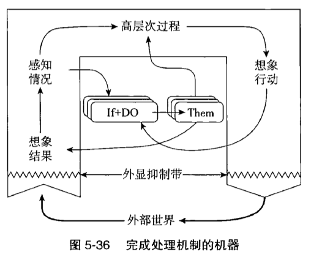

- ## 第六章 常识

	- 显性知识(Knowing What)
		- 可用手势或言语表达
	- 隐性技能(Knowing How)
		- 很难描述

> 注:CYC系统;

- ### 儿童机
	- 原因1:知识表示(研究改进中...)
	- 原因2:无法学习自己无法表达的事情;(只是一个值)
	- 原因3:[加以选择的学习;~>Understand.只有mind->注...](../框架/Understand.md)

- ### Allen Newell和Herbert Simon的General Problem Solver差分机系统

	- 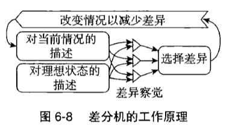
	- 对比椅子与长凳的区别;
		- 注:我觉得是抽象出适合用来坐;这样的目的性的抽象用途;

- ### [类比重要性:~>框架/类比推理](../框架/类比推理.md)

- ### 强化
	1. 副作用
		1. 思维固化

- ## 第七章 思维

- ### 批评家选择器模型，思维跳跃之源
	- 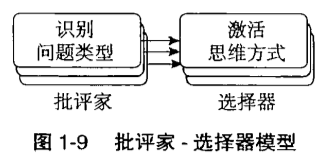

	1. 如果问题相识；则类比decision
	2. 如果陌生，则改变描述方式；
	3. 如果看似难；则拆分；
	4. 如果仍旧难；则用简单的问题代替它；
	5. 如果以上都不行，问别人帮助；

> 我觉得这种解决（思维）方式，也是后天数据的，只是形成了"二维抽象数组"；（1维遇到问题时，找思维方法;2维解决每个subQ)

- ### 多层次选择器->批评家模型;

> 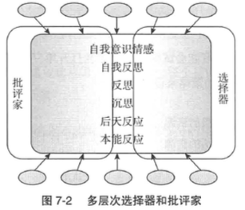

- ### 19大思维方式
	1. 知道解决方式(11对应)
	2. 广泛搜索(暴力搜索)
	3. 类比推理(索引搜索)
	4. 分解攻克法
	5. 改述法
		1. 以不同的口头描述"理解"它;
	6. 规划法
		1. 规划subQ的有效顺序;
	7. 简化法
		1. 简化版问题替代;
	8. 升华法
		1. 问题不明确,则切换到更具体的描述上;
	9. 转移主题法
		1. 散步去,回来再作;
	10. 理想化思维法
	11. 自我反思法
	12. 模仿法
		1. 模仿印刻者或老师
	13. 逻辑矛盾法
		1. 找出问题无解的证据
	14. 逻辑推理法
		1. 演绎推理
	15. 外部表示法
		1. 笔记或画图帮助解决
	16. 想象
		1. 预演未来,避免实际风险;
	17. 求救
	18. 寻求帮助
	19. 放弃

- ### 庞加莱无意识过程的4大阶段；
	1. 准备阶段（特定类型准备资源）（问题提出）
	2. 酝酿阶段（产生许多潜在方案）（求解）
	3. 豁朗阶段（识别一个可行解）（突破）
	4. 验证阶段（证明此解可行性）（成果证明和检验）

- ### 无意识思考：

- ### 创造力，（产生全新思维的能力）

- ### 记忆
	1. 感觉记忆
	2. 情景记忆
	3. 自传记忆
	4. 语义记忆
	5. 陈述性记忆
	6. 程序性记忆

- ### 语境盒（ContextBox)（NoLog层的代码）
	- 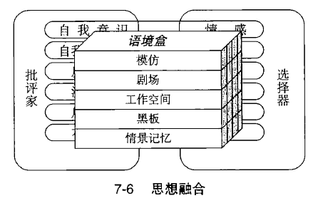

- ## 第8章 智能

- ### 总结:
	1. 第1章:我们天生便拥有各种各样的资源
	2. 第2章:我们向印刻者和朋友们学习
	3. 第3章:我们摒弃不应该做的事情
	4. 第4章:我们反思自己的想法;
	5. 第5章:我们可以预测行动的结果
	6. 第6章:我们使用大量的常识性知识
	7. 第7章:我们可以在不同的思维方式中转换

- ### 平行类比
	- 大脑以平行类比的方式来表征常识性知识的;
	- (大多想法变的模糊,但这是优点而非缺点)

- ### 表征知识的多种方式
	- 延伸阅读
		- <<心智社会>>

	- 表征等级:
		- 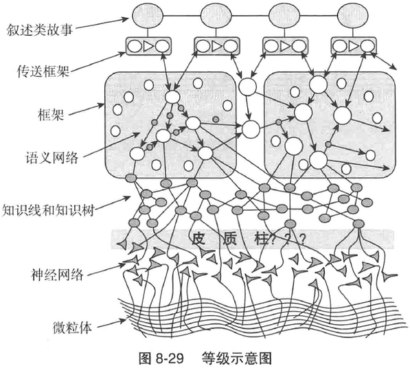

- ### K线
	- 思维方式的记录单元;是一条K线;K线记录了其激活的资源;
	- 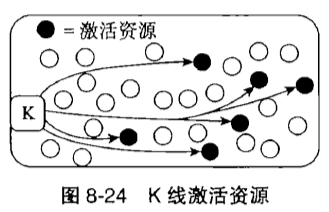

- ### 知识表示的方式
	1. 数学:逻辑
		1. 缺点:
			1. 表征常识太死板
		2. 优点:
			1. 避免自相矛盾
	2. 联结主义:联结网
		1. 缺点
			1. 太僵化,使用数据形式,难转化为抽象概念;
	3. 语言学家:自然语言
		1. 缺点
			1. 模糊
	4. 概念主义:语义网络
		1. 缺点
			1. 太过确定,无法表达不确定性
	5. 统计学:概率
		1. 缺点
			1. 可能自相矛盾

> 参考:1992年的<<因果多样性(Causal Diversity)>>

- ## 第9章 自我

- ### 多样的自我

	- 多种模型;多面性;(无数面性)
	- 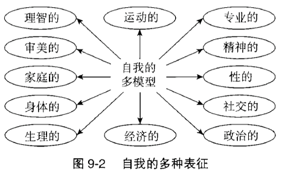

- ### 多重子人格

	- 随着目标不同变换出不同的人格
		- [我觉得是:Data导致了多样的行事风格;~>框架/自我.第3维思维;](../框架/自我.md)

- ### 人格同一性
	-

- ### 快乐
	1. 本质
		1. 是帮助我们更好的学习和记忆；
	2. 分类
		1. 满意（欲望满足）
		2. 探索（探索过程）
		3. 目标压制（压制批评家）
		4. 安心（问题解决的时候）
	3. TheLawOfEffect
		1. 反应后感觉；快乐导致关联变强
		2. 反应后感觉；不适感导致关联变弱（接受逆境）

- ### Input;
	1. 视觉期望；
		1. Input时，只注意到一个模糊的整体和注意力所在的细节；
		2. 大脑却以为看到了眼前一切；

- ### 思维组织方式
	- 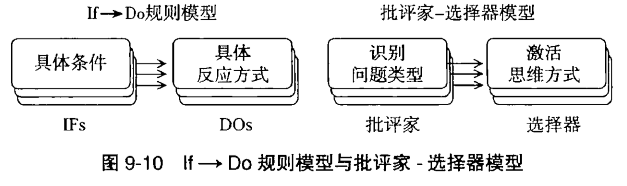

- ### 来自现实的欺骗:
	1. 超凡的抽象能力使我们忽略重要的例外情况;
	2. 我们大容量记忆可能会积累错误,或者产生误导性的信息;
	3. 我们相信印刻者所相信的一切;
	4. 想象力让我们难辨现实与虚幻;
	5. 痴迷于无法企及的目标,展开徒劳的探索;或不愿意接受失败或损失,由此回归过去的生活;

> 大脑的设计也有"AB选";重要性高的PK掉低的;并长久遗传下来;
