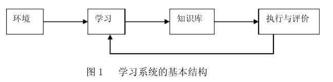
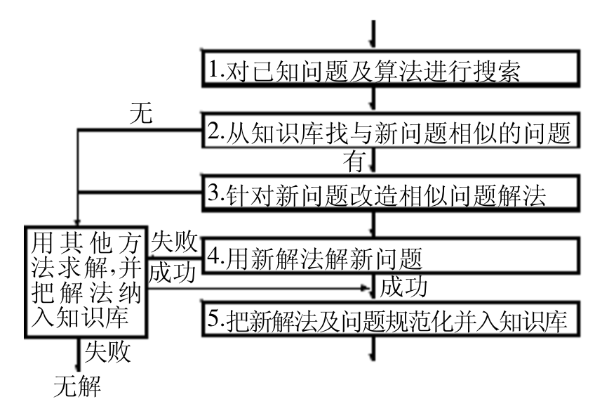
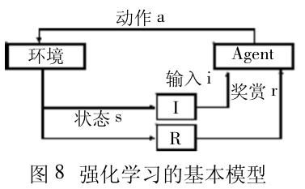

# 机器学习基础
***

- 参考:
- [https://wenku.baidu.com/view/1e86c04848d7c1c709a14515.html](https://wenku.baidu.com/view/1e86c04848d7c1c709a14515.html)
- [https://wenku.baidu.com/view/d993641dc281e53a5802ffc6.html?re=view](https://wenku.baidu.com/view/d993641dc281e53a5802ffc6.html?re=view)

	- 符号学习
	- 非符号学习(连接学习)

- //----------------------------------------

	- 机械学习
	- 指导学习(MYCIN ,DENDRAL)
	- 归纳学习
		- 概念
			- 基于"归纳推理"
			- 从"个别"到"一般"  从"部分"到"整体"
		- 分类
			- 示例学习(有教师)
			- 观察与发现学习(无教师)
		- 特征
			- 无法确保结果为真
	- 类比学习(这点与我当时想法一致)
		- 
		- 概念
			- 对比相似度
		- 分类
			- 属性类比学习
			- 转换类比学习
		- 特征
			- 有Base和Target
		- 事件
			- 1986年,J.G.Carbonell提出派生类比学习(Deriva-tional Analogy)系统,它解决多步任务,同时记录了解法信息和最终算法;
	- 基于解释的学习(EBL)
		- 概念
			- 用领域知识包来理解学习
	- 基于神经网络的学习
		- 概念
			- 非符号
			- 本质上是归纳学习
			- 大量实例反复运行,修改神经元的权重
		- 学习策略
			- 刺激-反应论
			- 认识论(事物间的关系认识的过程,这点与我当时想法一致)
	- 支持向量机(SVM)
	- 基于遗传算法的学习(等强人工智能出现后,可以考虑大规模试用这种方式)
		- 概念
			- 随机迭代和进化
	- 强化学习
		- 反馈机制(可以用来形成习惯系统)
		- 
	- 多Agent学习
		- 自主性
		- 反应性
		- 协作性(社会性)
		- 能动性
		- ..
		- 移动性
		- 自适应性
		- 通信能力(协作和协调)
		- 特性
			- 知识
			- 信念
			- 承诺
			- 意图
			- 义务
		- 哲学特性
			- 信念
			- 愿望
			- 意图

			

