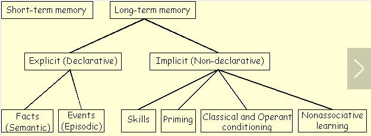
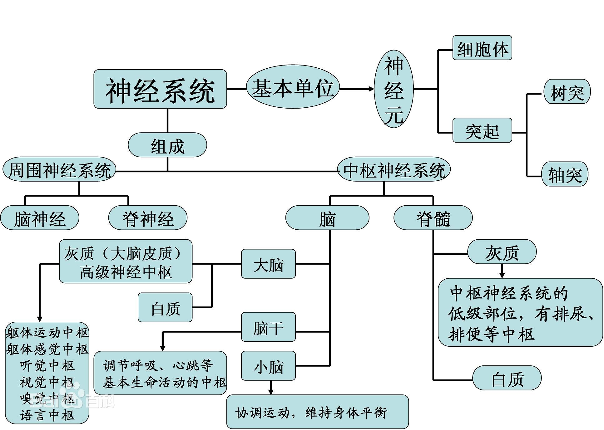
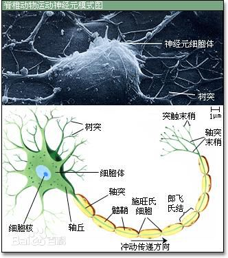
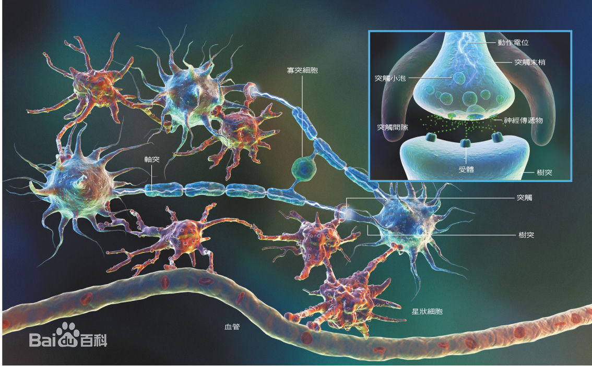

# 生物脑学
***

- ### 脑干->input

- ### 丘脑->feelIn

	- 触觉,听觉,视觉等其它.不过除嗅觉

- ### 海马体->Mem MK

	- 接受来自丘脑的feelIn;
	- 情景记忆(时间,地点,事件)
		- 可关联事件,时间差;(老鼠20秒)
		- 避免不断将不重要的事件进行关联;
	- 自传性记忆

- ### 颞叶(左右侧)->

	- 听觉
	- 听觉言语Wernicke
	- 嗅味觉
	- 精神,情绪皮质
	- 记忆
	- 意识乱,精神乱

- ### 内侧颞叶->陈述性记忆

- ### 记忆:

	- Tulving多重记忆系统:
		- 长期记忆
			- 编码:意码
			- 分类:
				- 内隐记忆
					- 概念:
						- 一种无法在正常意识中表现出来,但通过一些手段可以测量的记忆。对内隐记忆的研究是20世纪90年代的研究热点。
				- 外显记忆
					- 程序性记忆
						- 概念:
							- 关于如何做一件事情的记忆
							- 如果打篮球或者代码;
					- 陈述性记忆-->Law
						- 概念:
							- 关于一些具体的事情和情形的记忆
							- 可以被明确的描述的记忆，经历过的事情的情景记忆;如“昨天晚饭吃了什么”
							- “地球是圆的”这样的关于知识的概念记忆。
						- 分类:(信息性质不同分)
							- 情景性记忆/自传性记忆-->Memory
								– 概念:
									- (个人生活经验上的记忆)
									- (亲生经历事件,时间,地点的记忆)
									- 关于某一个时空中的事件和情景的记忆
								– 有意义的次序事件,关联存到-->Logic
								– 空间位置信息,-->Law
								
							- 语义性记忆-->Law
								– 概念:
									- (事物与抽象符号关联)
									- 关于世界的一般知识和规律的记忆
		- 短期记忆
			- 编码:声码;
			- 巩固(短转长)
				- 善用编码:(因为长期记忆以意码为主)
					- (旧有知识产生挂勾)
					- 联想法 
				- 善用复习:
					- 复习加强
					- 睡眠(优化长期记忆结构)
				
						

> ### 注:

- 长时记忆:
	- 检索指引:(有了检索指引检索效果会好些)
	- 舌尖现象:(音形意三码联结出现暂时障碍)
	- 记忆扭曲:(检索信息与原先不符合的情况,量变的事实简化 & 质变的无中生有)

- 

			
			
			

      			
	
- ### 当记忆中,出现影响了mind的记忆时,将其提取到logic中...

	- 记忆三个层次:
		- 颞叶记忆
		- 海马记忆
		- 间脑记忆:脑干
	- 记忆类型:
		- 浅层
			- 侧头叶
				- 判断、分类、记忆和再生 & 把最重要的传给海马
		- 深层
			- 海马

- ### 左右脑:
	- 左脑:(逻辑思维)
		- 支配右半身的神经和器官
		- 左脑的功能
			- 语言、
			- 分析、
			- 逻辑、
			- 代数的思考、
			- 认识
			- 行为
			- 意识相连
	- 右脑
		- 支配左半身的神经和器官
		- 右脑的功能:
			- 接受音乐的中枢，(欣赏音乐)
			- 负责可视的、(观赏绘画、绘画的思考行为)
			- 综合的、(凭直觉观察事物、纵览全局)
			- 几何的、
			- 记忆
			- 形象思维
			- 创新

- ### 额叶：
	- 行动

- ### 神经元

	- 感觉神经元(input)
		- 作用:
			- 传导感觉冲动的，
		- 胞体位置:
			- 胞体在脑、脊神经节内，
		- 极:
			- 多为假单极神经元。
		- 功能说明:
			- 其突起构成周围神经的传入神经。神经纤维终末在皮肤和肌肉等部位形成感受器。
	- 运动神经元(output)
		- 作用:
			- 传导运动冲动的神经元，
		- 胞体位置:
			- 胞体位于中枢神经系统的灰质和植物神经节内，
		- 极:
			- 多为多极神经元。
		- 功能说明:
			- 其突起构成传出神经纤维。神经纤维终未，分布在肌组织和腺体，形成效应器
	- 中间神经元(联合神经元)
		- 作用:
			- 是神经元之间起联络、整合作用的神经元，
		- 胞体位置:
			- 胞体位于中枢神经系统的灰质内，其突起一般也位于灰质。
		- 极:
			- 是多极神经元，人类神经系统中，最多的神经元，
		- 功能说明:
			- 构成中枢神经系统内的复杂网络。
	- 分类
		1. 感觉功能：感受体内外刺激信息。脑适当的反应，也可将信息转化为记忆.
		2. 效应功能：控制效应器（肌、分泌腺等）活动的功能.
		3. 信息整合功能：强大的信息过滤能力。内外环境的信息很多，经过神经系统的过滤，只对重要的1%信息进行整合、指令并做出反应。
		4. 信息储存功能：重要信息引起直接躯体反应，大多则被大脑储存，参与大脑以后对信息的的筛选、分析和对躯体反应的控制和调节。

	- #### 神经系统除整合感觉、调控机体运动与内脏活动外，还整合脑的高级功能，以实现觉醒与睡眠、学习与记忆，以及思维、意识、情绪等高级神经活动。

	- 
		    
	- 
		    
	- 

- ### 神经纤维

	- 作用:
		- 传导兴奋_把神经元的电信号传出去;