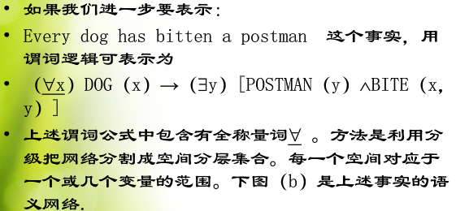
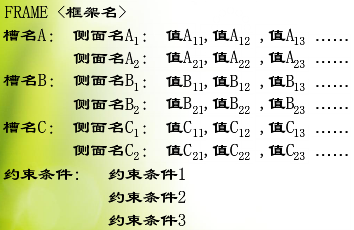

# 知识表示表达方法基础
***

- ###  知识表示法
	1. 状态空间表示法
		1. 一组变量或数组,
		2. 可用三元组(S,O,G)来描述
	2. 与或图表示法
		1. 分解-与树
		2. 变换-或树
	3. 产生式系统
		1. 事实库
		2. 规则集
		3. 控制器
	4. 逻辑表达方式
		1. 公理系统
		2. 演绎(定理证明中较为成功的一种技术
			1. 优点:严格性 通用性 自然性 模块性
			2. 缺点:效率低 灵活性差

- ### AI的知识类型
	1. 叙述型知识:即我的valueModel
		1. 状态
		2. 环境
		3. 条件
		4. 问题概念
		5. 定义和事实
	2. 过程型知识:即我的LogicModel
		1. 状态变化
		2. 问题求解过程
		3. 演算和行动的知识
	3. 控制型知识:即我定义的LawModel
		1. 如何相应操作(如遥控器的使用)
		2. 演算和行动的比较
		3. 判断
		4. 管理
		5. 决策

- ### 知识模型的变换:(不同的知识表达方法,有不同的形式化知识模型)
	1. 同构变换(类比,问题更明确,便于求解,高中几何常用解答方式)
		1. 原始问题oriQ
		2. 同构的问题samQ
		3. samQ的解答等价于oriQ的解答
	2. 同态变换(
		1. 原始问题oriQ
		2. 简化的问题simQ
		3. oriQ有解则simQ有解
		4. oriQ无解则simQ无解
		5. oriQ与simQ是蕴涵关系
	3. 同构同态变换,对原始问题进化转化为清晰简单的问题;有图所示:

- ### 语义网络(联想网络)//(个人觉得垃圾!)
	1. AKO泛化联系(继承)
	2. part-of聚焦联系:(组成)
	3. property属性联系:

- ### 谓词关系语义
	1. 一元
		1. Animal(bird)
	2. 二元
		1. ISA(bird,animal)
	3. 多元
		1. 例如:火箭活塞92:104
		2. 逻辑表示法为:score(火箭,活塞,92:104)
	4. 方法:
		1. 引入Class Obj将多元表示成二元的组合

- ### 连接词在语义网络中的表示方法
	1. 关系
		1. 与,(合取)
			1. give(John,Mary,"战争与和平")^read(Mary,"战争与和平")
		2. 或,(析取)
			
		3. 非,(否定)
			1. ISA,AKO,part-of来标注;
		4. 蕴涵
			1. 如"如果起火,那么用沙灭火"
			2. 一条弧指向前提条件:ANKE(如果起火)
			3. 一条弧指向规则的结论:CONSE(用沙灭火)

- ### 变元和量词在语义网络中的表示方法
	1. 存在量词用ISA
	2. 全称量称用分组网络的分块来表示
	3.  

- ### 框架
	1. 1975由M.Minsky提出;表示客观事物的层次关系

- ### 框架的结构:
	1. 结构如下:(类似:类,属性,属性的侧面数组,说明信息)
	2. 

- ### 概念从属
	1. 概念从属是表示自然语言的语义的一种理论，它的特点是便于根据语句进行推理，而且与语句本身所用的语言无关。概念丛书表示的单元并不对应与语句中的单词，而是对应能组合成词义的概念单元。这个理论是Schank在1973年首先提出的，从那时起，这种表示方法就已经用于阅读和理解自然语言的很多程序中。

- ### 脚本
	1. 脚本用于描述固定的事件序列，它的结构类似于框架。一个脚本由一组槽组成。与框架不同的是，脚本更强调时间之间的因果关系。脚本中描述的时间形成了一个巨大的因果链，链的开始是一组进入条件，它使脚本中的第一个事件得以发生。链的末尾是一组结果，它使后继事件得以发生。一般认为，框架式一种通用的结构，脚本则对某些专门知识更为有效。

- ### Petri网
	1. Petri网是由Petri提出的。由于它能很好地模拟异步并行操作，所以作为模拟用的数学工具在并行处理和分布式计算机领域中应用较多。利用Petri网可以实现逻辑运算、语义网、框架、与或图、状态空间域规则等多种功能，因此也可以作为一种通用的知识表示形式。

- ### 参考: 
	- [https://wenku.baidu.com/view/ccc4c27990c69ec3d5bb75f0.html](https://wenku.baidu.com/view/ccc4c27990c69ec3d5bb75f0.html) 
	- [http://blog.sina.com.cn/s/blog_ad7193cf0102v9yq.html](http://blog.sina.com.cn/s/blog_ad7193cf0102v9yq.html)

