# 思维与神经网络整合-数据神经网络(归纳结构)的构建

<!-- TOC depthFrom:1 depthTo:6 withLinks:1 updateOnSave:1 orderedList:0 -->

- [思维与神经网络整合-数据神经网络(归纳结构)的构建](#思维与神经网络整合-数据神经网络归纳结构的构建)
	- [n10p1 归纳结构1-String](#n10p1-归纳结构1-string)
	- [n10p2 SQL备查整理](#n10p2-sql备查整理)
	- [n10p3 思维的动2](#n10p3-思维的动2)
	- [n10p4 归纳结构2-例子](#n10p4-归纳结构2-例子)
	- [n10p5 归纳结构3-DataType](#n10p5-归纳结构3-datatype)
	- [n10p6 归纳结构4-构建](#n10p6-归纳结构4-构建)
	- [n10p7 规则思想 和 DOP思想总结](#n10p7-规则思想-和-dop思想总结)
	- [n10p8 归纳结构5-LineType](#n10p8-归纳结构5-linetype)
	- [n10p9 ActionControl的增删改查](#n10p9-actioncontrol的增删改查)
	- [n10p10 归纳结构6-抽象节点的形成](#n10p10-归纳结构6-抽象节点的形成)
	- [n10p11 归纳结构7-细节](#n10p11-归纳结构7-细节)
	- [n10p12 归纳结构8-NodeType](#n10p12-归纳结构8-nodetype)
	- [n10p13 DOP](#n10p13-dop)
	- [n10p14 节点](#n10p14-节点)
	- [n10p15 Logic](#n10p15-logic)
	- [n10p16 名到网](#n10p16-名到网)
	- [n10p17 `OOP+构建`与`logic构建`融合](#n10p17-oop构建与logic构建融合)
	- [n10p18 神经网络可视化](#n10p18-神经网络可视化)
	- [n10p19 分维与不分维](#n10p19-分维与不分维)
	- [n10p20 GNOP(Generative Net Oriented Programming)](#n10p20-gnopgenerative-net-oriented-programming)
	- [n10p21 AIValueNode模糊值](#n10p21-aivaluenode模糊值)
	- [n10p22 模糊Abstract关系](#n10p22-模糊abstract关系)
	- [n10p23 数据模型从(input->think->aiModel->aiNode)](#n10p23-数据模型从input-think-aimodel-ainode)
	- [Other](#other)

<!-- /TOC -->

     

## n10p1 归纳结构1-String
`CreateTime 17.12.25`

| 前言 >> |
| --- |

|  |
| --- |
| 将思维与mindValue深度集成,并将先天神经网络删除后,整个神经网络有了很大改变,此节用于整理`字符串`在神经网络中的基本存储结构 |

| 示图 >> |
| --- |

| 简 | 全 |
| --- | --- |
|  |  |

| 注: | `示图全` 为成熟阶段,我们要区分其中: |
| --- | --- |
| 1 | 哪些成份是先天具有的, |
| 2 | 哪些是后天思维轻易且必然形成的, |
| 3 | 哪些是后天思维不一定想到的; |
| 注: | 先天不存在字母、单词、数字的概念; |
| 注: | 先天存在属性与值的概念; |

| 思维方式接入 >> |
| --- |

|  |  |
| --- | --- |
| 类比 | 类比的细腻度依赖与算法等基础,而类比的结果产生归纳及`归纳下的归纳实体` 形成层级归纳结构 |
| 归纳 | `归纳` 在神经网络中体现为独立的`层级结构`,是神经网络中的`索引`,其结构越分层明确且详细,越易于检索; |
| 统计 | 由节点间的关联自动形成与使用,有几条规则决定其变化 |

     

## n10p2 SQL备查整理
`CreateTime 17.12.25`

| 前言 >> |
| --- |

|  |
| --- |
| 神经网络数据库因其结构与以往不同,有强大的关联及索引能力,在sql上也会比以往更加多变强大,此节用于跟随所有开发用到结构需求,在此留下sql记录;`备查及整理于此` |

     

## n10p3 思维的动2
`CreateTime 17.12.26` `参考n9p20`

***

| 复杂的动 >> |
| --- |

|  | 借助数据,有了思维方式 |
| --- | --- |
| 思维`动`的方式 | 如:穷举式帮助`归纳`检索 |

***

| 思维操作 >> |
| --- |

|  |  |
| --- | --- |
| 元操作 | 类比 |
| Result | Law规律 |

***

| 思维数据的神经网络存储 >> |
| --- |

|  |  |
| --- | --- |
| 思维方式 | 不同的`归纳结构`,不同的`MLogic,MCan`等组合,产生不同思维方式 |
| law | 类比发现`规律`,而规律让类比产出结果;(参考:上表) |
| can | 也是`归纳`的一种 |
| logic | 是`can`的实例化形式,即: Logic l = new Can(); |
| isa | 是`归纳` |
| valueIs | 是`属性值` |
| 思维经验 | 似下图 |

| 思维经验示图 >> |
| --- |

| 类似String | Experience |
| --- | --- |
|  |  |

     

## n10p4 归纳结构2-例子
`CreateTime 17.12.27` `参考n10p1 n10p2 n10p3`

| 问题:分析如下内容,如何建立`归纳`结构? >> |
| --- |

| 1 |  |
| --- | --- |
|  | 人能被打 |
|  | 人会疼 |
|  | 人被打会疼 |
|  |  |

| 2 |  |
| --- | --- |
|  | 人能吃 |
|  | 苹果能被吃 |
|  | 人能吃苹果 |

| 3 |  |
| --- | --- |
|  | 人吃面和苹果 |
|  | 猫吃鱼 |
|  |  |

| 注: |  |
| --- | --- |
|  | `能`:输出->指向目标 |
|  | `会`:状态->可变化 |
|  | `能被`:输入->被指向为目标 |

     

## n10p5 归纳结构3-DataType
`CreateTime 17.12.27`

| DataType >> |
| --- |

|  |  |  |
| --- | --- | --- |
| 1 | Int | 基本类型 |
| 2 | Float | 基本类型 |
| 3 | String | 基本类型 |
| 4 | Char | 基本类型 |
| 5 | Obj | 基抽象,所有类型的抽象基类 |
| 6 | Arr | 组类型 |
| 7 | MLogic | Method方法,被调用,记录Logic |
| 8 | MCanOut | Method接口,有目标,输出如:打`对方疼` |
| 9 | MCanIn | Method接口,有目标,输入如:吃`自己饱` |
| 10 | SubObj,SubInt等 | 其中SubX类型,在定义时,并不会知晓X是什么类型;只是Sub而已,`相当于C#中T<Object>` |

| 注 >> |
| --- |

|  |  |
| --- | --- |
| 1 | 所有定义了的自定义对象都用SubX类型,而无权使用Obj;(Obj只有一个,并不可实例化)`X是父节点地址` |
| 2 | Law规律是类比的结果 |
| 3 | 未明确Law用`unLaw关联类型` |
| 3 | 已明确Law用属性,继承,Can等表示 |
| 4 | Logic逻辑用MLogic表示(方法被调用时,某状态的变化) |

***

| 示图 >> |
| --- |

|  |
| --- |

***

     

## n10p6 归纳结构4-构建
`CreateTime 17.12.28 参考n10p5`

| 概述 >> |
| --- |

|  | 懒构建部分 | 先天构建部分 |
| --- | --- | --- |
| 概念 | 思维类比分析到的部分,进行结构化(先天指定的) | 基础dataType定义部分,可先天指定结构构建(Net分维) |
| 优势 | 避免过度抽象问题 | 避免过度耦合的问题,网络分维 |
| 缺点 | 导致某些节点的老结构遗留,导致`思维时`发现结构冲突需要作结构更新;(参考n10p11修正) | 有时维间关联弱导致检索困难 |

***

| 先天的分维 >> | 现阶段不考虑分维,原因如下: |
| --- | --- |
| 1 | audio |
| 2 | video |
| 3 | 其它 |

***

| 示图 >> |
| --- |

|  |
| --- |
| 注:去掉mvRoot，mv只作为构建起因存在，影响关联强度。（避免试图直接分析情感） |
| 注:三层数据结构:inputModel,AIModel,AINet |
| 注:三层数据缓冲,瞬时,短时,长时 |

     

## n10p7 规则思想 和 DOP思想总结
`CreateTime 18.1.3 参考n9p16 n9p19 n9p20`

| RULE表 >> |
| --- |
| 所有的规则都是基于时间制定的 |
| 无论是思维中得以存活到最后的想法,网络中得以存活到最后的数据,胜者书写规则,败者成就胜者 |

| 阶段 | 道德经角度 | 规则思想角度 | 代码角度 | 注意 |
| --- | --- | --- | --- | --- |
| 定义 | 道生一 | mindValue的定义为一; | mv |  |
| 目标 | 一生二 | 欲动为阳,欲静为阴; | mvTarget |  |
| 变化 | 二生三 | 动生变,变化为三; | cmv | 没有严格的0,对比大于正负 |
| 成长 | 三生万 | 变生MLogic,变生数据神经网络 | AINet |  |

| DOP思想总结 >> |  |
| --- | --- |
| 1 | DOP中关键是将OOP改进并以数据的方式表示， |
| 2 | 而这种表示的关键是需要数据神经网络。 |
| 3 | 而神经网络的关键是思维提交的归纳结构构建等操作事务， |
| 4 | 而思维的关键是mindValue规则。 |
| 5 | 而mindValue的关键是数据相生， |
| 6 | 故smg架构的是在 `最简定义规则之上` 进行 `数据相生` 从而 `形成结构化网络`,以　`与真实世界进行智能交互`　的`循环系统。` |
| 注: | 从简至繁,从无到有 |

***

| 白话版介绍 >> |
| --- |

| 1. 神经网络： |
| --- |
| 神经网络的基础组成是：节点Node和关联Line。前端部分神经网络的每个节点指向一个算法，后端部分每个节点指向一条数据（即归纳网络）。其中Node有多种类型，用来表示不同的用途，例如：存储数据、表示不同的NodeType等。 |
| 归纳网络将OOP的结构作改进后，存储于数据神经网络。这么作有很多好处，当数据量特别大的时候，例如我要检索苹果，我会由苹果直接作“区域点亮”操作，即查找苹果相关的信息，而smg学习的过程，就是这样的信息关联的过程。即smg会使用联想的方式，来从海量的数据网络中取到最有效的知识数据。而因为这样的结构是存在抽象的，所以一切AGI解决问题都强依赖于数据，而弱依赖与运算。 |

| 2. 思维： |
| --- |
| 单纯的神经网络与归纳网络是没有意义的，因为数据的构建，数据的使用等等必然需要一个操作者。而这个操作者就是思维，思维的逻辑源于数据，而数据的来源只有两个，一个是input到算法的结果，一个是数据神经网络。可以想像到，如果这样运行，那思维将有无数的数据被处理，无数的运算与垃圾数据注入数据网络。所以思维要想运行起来，有个关键就是其规则。我设计了一个最简规则，除此规则驱动之外，思维不会运行。 |
| 这个规则就是mindValue，mindValue是一个值定义，当思维中有mindValue传入的时候，就会有思维活跃，即类比。类比最重要的功能之一是发现规则Law，然后这个过程就是思维过程，这个过程会被存储于数据网络。 |
| mindValue也有一个规则，mindValue本身是定义为一，这个值会变化为二，而有了变化就有了目标为三，而思维会为mindValue的目标而服务，而这个服务过程就是数据的构建与使用的过程。会产生巨量的结构化数据为万。 |

| 3. 循环： |
| --- |
| smg的架构中，存在很多循环， |
| 第一个就是思维数据循环，数据产生思维，思维产生数据。 |
| 第二个是外界input与smg内部的数据映射。即smg的内部是一个独立的维度，思维运行在此维度，又处理着外来的数据，但思维所理解的来自数据网络，所综从的只是mindValue的驱动，思维的活，smg的独立维度，与input,决策output,这个整体共同形成一个AI系统与真实世界的循环。 |
| 第三个是mindValue的循环，mindValue的规则是极而反。太小了，则想增大，太大了，则反小（mv还有其它衍生规则，此不列）。 |

***

| 通俗举例说明 >> |  |
| --- | --- |
| 技术举例 | 现行开发中: `写代码的过程` 变成 `数据网络的构建过程` |
|  | 构建者,由 `程序员` 变成 `AI系统的思维` |
|  | 业务需求,由`产品需求` 变成 `真实世界对AI系统提需求` |

     

## n10p8 归纳结构5-LineType
`CreateTime 18.1.3 参考n10p3 n10p6`

***

| 关联类型 `AILine.Type` >> |  |
| --- | --- |
|  |  |

|  |  |
| --- | --- |
| 属性property | 方法目标MTarget |
| 值valueIs | 方法结果MResult |
| 继承isA | MCanIn |
|  | MCanOut |
|  | UnLaw(未确定`归纳结构`时,也需要存储) |

***

     

## n10p9 ActionControl的增删改查
`CreateTime 18.1.4`

| 查-全局检索 >> |
| --- |

|  |  |
| --- | --- |
| 矛盾 | 不识别无法检索,不检索无法识别 |
| 拆分多维检索 | 所以在神经元算法结果之处，便有了分维与各维独立优化。拆分多维检索有效提高速度 |

| 全局检索的方式方法 >> | 方式 | 参考 |
| --- | --- | --- |
| 1 | 拆分分维 |  |
| 2 | 从root搜起 |  |
| 3 | 合理利用cacheLong |  |
| 4 | 感觉,抽象意义及多line通路,匹配节点组(轨迹类比),唯一性判断 | node4 n5p11 n5p17 |
| 5 | 能量值控制,超时返回nil;并利用思维分析改良 |  |
| 6 | 后台任务的建立(无意识异步任务) |  |
| 4注 | 每个属性等节点,都是抽象,每个关联都是索引 |  |
| 4例 | 如找jia,输入ji;单独找j和i,再找关联数组(穷举),判断其ji开头相符; |  |
| 7 | 增加结构化;如:汉字3000;搜索王的时候,要先搜其`抽象`(即发音)(接入拼音算法,达到字符串性能优化); |  |

***

| 查-区域点亮 >> |
| --- |

***

| 查-具象检索 >> |
| --- |

|  | 取抽象Node下的子节点太多而检索困难时 |
| --- | --- |
| 1 | 思维方式帮助 |
| 2 | 近期思维log为索引去ActionControl再检索:(代码定义,非常有效) |

***

| 思考 >> |  |
| --- | --- |
| 1 | 思维时,是否设计一个通用model;将网络数据model化使用到代码中... |

***

     

## n10p10 归纳结构6-抽象节点的形成
`CreateTime 18.1.6`

| 实例 >> |
| --- |

|  |  |
| --- | --- |
| 实现: | 懒构建,Line和Node中不必要体现;(继承的规则); |
| 值域: | 是float类型,每个实例都只是其连续范围内一个点; |
| 实例: | 懒构建,Line和Node都只在构建时,动态生成 |
| 颜值: | 变量名:`定义beautifulMindValue`,类型为:`float`,范围:`由beautifulMindValue决定` |
| 值类型: | float,int等值类型并没有单独分维 |

***

| `定义美女Node`形成的过程 >> |
| --- |

|  |  |
| --- | --- |
| 1 | w4被称为`美女` (形成未知"美女"抽象节点,并指向实例w4) |
| 2 | w1被称为`美女` (未知节点下加入w1,并点亮"未知节点" + "w4" + "w1") |
| 3 | Thinking类比到`美女`的Law是`颜值`比较高 |
| 4 | 抽象`美女Node`定义追加`模糊值` 对比结果比值更重要,约 `>= 0.7f` 或 `前30%` |

***

| 思考 >> |
| --- |
| 抽象Node的理解与所包含的信息;参考(n10p11) |

     

## n10p11 归纳结构7-细节
`CreateTime 18.1.6`

| dataType >> |  |
| --- | --- |
| char | 不会有字符串维,思维的拆分,总会把字符串拆分成charArr传递给Net |
| arr | 组合 |
| float,int | `值类型`没有单独分维 |
| Obj | 基 |
| change | 变化 |
| 注: | 没有static,const等概念 |
| 注: | 所有都是public |

***

| lineType >> | 关系 | 注 |
| --- | --- | --- |
| 属性property | 包含关系 |  |
| 值valueIs | 值关系 |  |
| 继承isA / SubX | 继承关系 | 子类(可多继承)(类属性可以有默认值) |
| 接口MBy | 被调用关系 `弱存在` | 被调用`changeArr`;MBy本身就是changeArr; |
| 接口MCan | 实现关系 | 1. MResult(changeArr) 2. MTarget |
| 方法目标MTarget | 逻辑(指向)关系 |  |
| 方法结果MResult | 逻辑(触发)关系 |  |
| 实例Instance | 实例化关系 |  |
| 注: | UnLaw(未确定,也需存),未知关系时,至少有一个关系是已知的;不然Node就不会构建 |  |
| 注: | Method体只是多个change组成,将OOP的方法复杂逻辑最小拆分,避免各种bug与复杂运算; |  |

***

| 归纳结构_Property >> |  |
| --- | --- |
| 定义 | Property的定义是确切的,可继承,可实现,可赋值 |
| 无名 | Property无名,但有创建之初有一个隐性id(FuncName或其它让思维作唯一判断的) |

***

| 概念 >> |  |  |
| --- | --- | --- |
| 无名 | Node最初都是无名的,零散的,它在等待`思维中类比`给其某个或者某组,进行定义 | 参考:定义美女 |
| 修正 | Node的定义从模糊和不确切开始,经过思维后,不断精确修正; |  |
| 继承偏移 | 继承的修正,称为`继承偏移`,修正的过程是体现上移和多态的过程 | 参考美女继承`w1`到`women+颜值>=30%` |

| 思维Model示图 >> |
| --- |
| 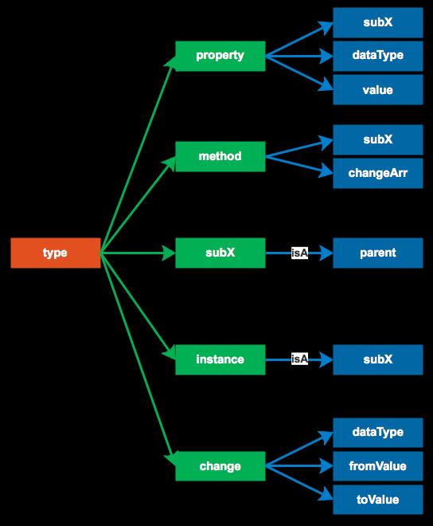 |

     

## n10p12 归纳结构8-NodeType
`CreateTime 18.1.7`

| 前言 >> |  |
| --- | --- |
| 旧 | 以往的multiNode,singleNode,FuncNodet等已经废弃不用 |
| 新 | DataType对于Node的定义是基于DataNode的,但在改进OOP时,此种方式并不够用,所以有本节`NodeType` |
| 原因 | AINode继承自Obj而所有subNode都基于AINode;所以NodeType替代... |

***

| NodeType >> |
| --- |
| 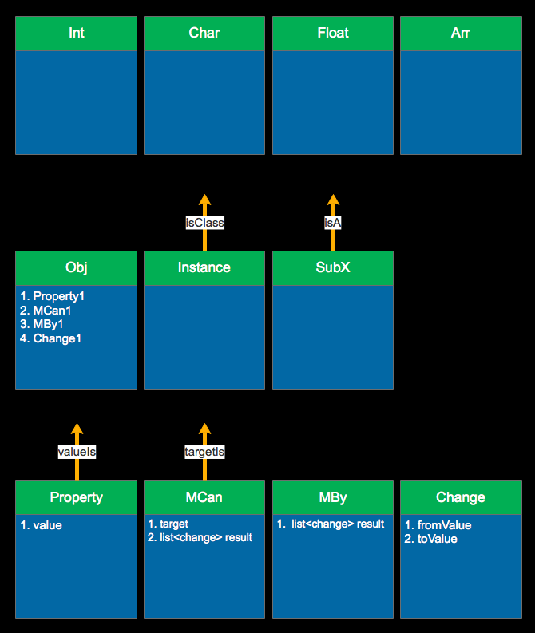 |

| lineType_obj |  |
| --- | --- |
| isA | 继承 |
| isClass | 声明 |
| instanceOf | 实例化 |

     

## n10p13 DOP
`CreateTime 18.1.10`

| DOP结构化规则 >> |  |
| --- | --- |
| Class | 类必须先声明Class再使用 |
| Obj | 所有节点都继承自Obj(包括int,float) |
| Ports | 按lineType分开多个ports |

| 类示图 >> |
| --- |
| 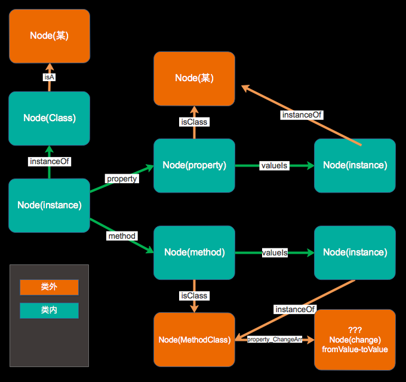 |

     

## n10p14 节点
`CreateTime 18.1.11 参考note4等`

| 数据库层 >> | 每个节点多个文件 |
| --- | --- |
| 1 | 一个文件desc, |
| 2 | 一个base含ports,pointer等基础信息。 |

***

| 指针 >> |
| --- |
| 指针地址只是这个目录地址，File则按规则命名。 |

***

| Method类型 >> |  |
| --- | --- |
| method | method核心是Note与Note的交互， |
| change | change是数组，作为其结果被关联。 |
| 结构化 | method的结构化形成过程与obj的一致 |

***

| 节点层 >> |  |
| --- | --- |
| 基节点 | 每个节点。都有obj那几个ports |
| 子节点 | 而property声明、Instance、method和change则各有其自定ports定义。 |

***

| 示图 >> |
| --- |
| 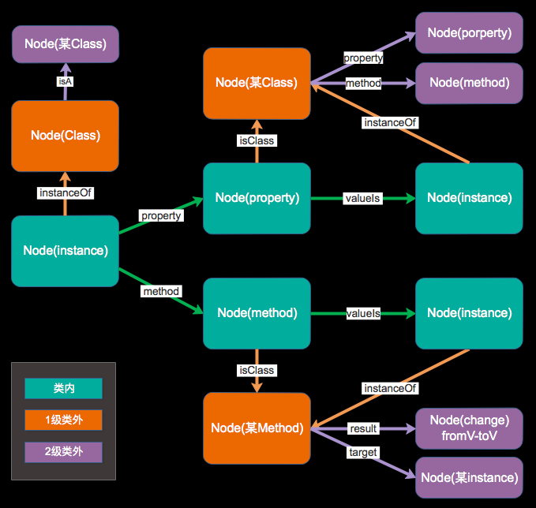 |

     

## n10p15 Logic
`CreateTime 18.1.12`

| 简介 >> |  |
| --- | --- |
| 初阶段特征 | 广撒网,少收鱼,用进废退; |
| 构建过程特征 | 由cacheLong到`数据网络`一级一级确切化,后长时存储 |

***

|  |
| --- |
| cacheShort存AIModel(从Algs传入,待Thinking取用分析)(容量8); |
| cacheLong存AINode(相当于Net的缓存区)(容量10000); |

| logic结构化过程 >> |  |
| --- | --- |
| 概述 | 以cmv为起点,反推起因,logic在cmv时已定义,logic的确切过程,即logic的结构化过程 |
| 1 | cmv时,激活Thinking |
| 2 | Thinking到actionControl查导致cmv的logic |
| 3 | 如找不到,Thinking从cache分析并定义"非确切logic" |
| 4 | 将非确切logic构建到net |
| 5 | 再次发生cmv时,重复1,2 |
| 6 | 找到前面构建的"非确切logic" |
| 7 | 思维类比,将"确切化logic" |
| 8 | update事务,更新net中logic; |

| 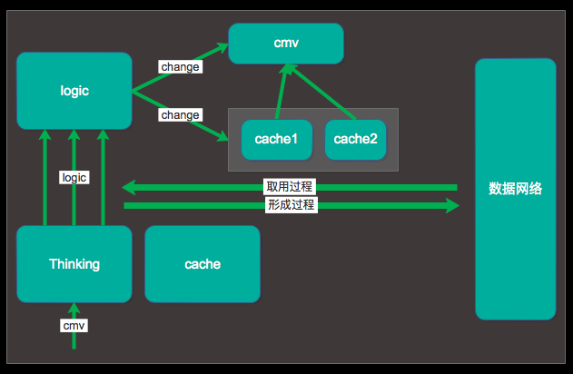 |
| --- |

     

## n10p16 名到网
`CreateTime 18.1.12`

| 名到网 的必然 >> |  |
| --- | --- |
| 静 | 思维类比值化因law产生定义，定义有其特征(属性)，属性再定义,多定义间产生关系(包含等); |
| 动 | 思维因cmv定义logic和change,logic定义方法，方法产生变化，最终生成DOP数据网络。 |

***

|  |
| --- |
| 注:cmv的Change产生Logic; |

     

## n10p17 `OOP+构建`与`logic构建`融合
`CreateTime 18.1.16`

| 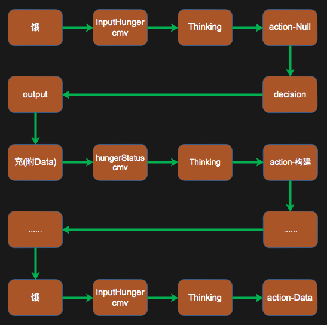 |
| --- |
| 注:此例早前就有,但`归纳结构`一直未完善,今`神经网络,思维,架构3`已近完善,故重拾此例 |
| 注:目的在推动OOP+的构建与logic构建的过程 |

| logic >> |  |
| --- | --- |
| 1 | 解决了问题的Logic就是Experience |
| 2 | 一切logic的索引围绕cmv展开 |

     

## n10p18 神经网络可视化
`CreateTime 18.1.17`

| 可视化 >> | 图式 | 文式 |
| --- | --- | --- |
| 效果 | 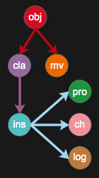 |  |

     

## n10p19 分维与不分维
`CreateTime 2018.01.24`

| 前言 >> |  |
| --- | --- |
| 栗子 | 当饿cmv输入到thinking时,actionControl检索到解决targetType的经验,而非饥饿概念等归纳知识 |
| 白话栗子 | 当你饿了,想到的是想吃什么,而非`饿是人体能量需求传递给大脑的信号`; |
| 质疑 | 就算没有分维,`感觉信息`仍可作为`属性节点`存储,而由`logic构建`打辅助,故分维设计本质上可由type代替,即降低设计复杂度,又作到一体化; |

| 分维概念 >> |  |
| --- | --- |
| 概念 | 分维如分表,其本质是解决`性能问题`与`各维的个性化处理` |
| 注:`性能问题` | 1. 全局检索->单网全局检索 2. 音频等傅利叶变换后的感觉维检索 |
| 注:`各维的个性化处理` | 如`音频感觉`作为独立索引维 |

     

## n10p20 GNOP(Generative Net Oriented Programming)
`CreateTime 2018.01.28`

| 前言 >> |
| --- |
| LOP DOP 命名无法阐述SMG系统的核心编程方式,故更名为GNOP;面向生成式网络编程 |
| 将数据的`有序`与`灵活`,权衡到极致; |

***

| GNOP结构化规则 >> |  |
| --- | --- |
| 1 | 所有节点都继承自AINode |
| 2 | 类定义也是(抽象)类实例 |
| 3 | 类可继承自实例 |
| 4 | 类可多继承 |
| 5 | 类用instancePorts指向自身的所有实例 |
| 6 | 类继承关系随时可变更 |
| 7 | 所有类继承自AINode |
| 8 | `Node类型`和`data类型`是不同的 |
| 9 | Node类型是指:AINode的子定义;如PropertyNode ChangeNode LogicNode等 |
| 10 | Data类型是指:数据输入的类型:如`int`、`String`、`IMV`、`CMV`等 |
| 11 | 类定义的`属性值范围`; |
| 12 | 不存在Instance;只有absPorts和conPorts(疑) |
| 13 | 每个值类型都是一个范围;(如int float) |
| 14 | 信息的上降下沉;同一继承链中,属性在具象部分的值`唯一`;抽象节点值`范围` |
| 15 | `值范围`,其实不仅是范围;还根据关联强度,所以值并不是线性范围,而是有权重的;此初版暂不考虑 |
| 16 | 多继承中,一次事务只串一层abs,而多层,需要多事务与分析;故如:`man:person:animal:obj`的表示方式是:`man:(person,animal,obj)`的多继承 | 

***

| 基本原则 >> |  |
| --- | --- |
| 1 | 只有信息有思维触发,才构建;(复杂的结构定义都不需要,如提前定义父类,同一思维定义两个Node等...) |
| 2 | 定义产生具象,具象间产生关系,关系产生抽象,抽象产生结构化;(不作任何一点多余的设计) |
| 3 | 只有定义(是)、关系(的)（关联类型）和变化(能)三大基础因素； |
| 4 | 关于迁移,最好代码层不进行信息迁移,尽可能自然而然;(不迁移,只在构建中自动生成新的结构,并逐步淘汰错的结构,只有`set和update没有remove`)(注:你无法主动忘掉) |

***

| 收敛设计 >> | node10大多都是在作构建规则,但并不够收敛;所以有此表针对node10的收敛问题作改进; |
| --- | --- |
| 1 | 不区分定义与实例(去掉instance,isA,instanceOf等则abs和con替代) |
| 2 | 不独立定义PropertyNode节点(只根据关联类型,作这些区分,删掉PropertyNode是简化设计,去掉isClass和valueIs) |

***

| instance收敛示图 >> |
| --- |
| 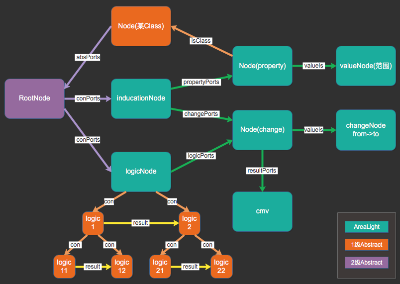 |

| 属性收敛示图 >> |
| --- |
| 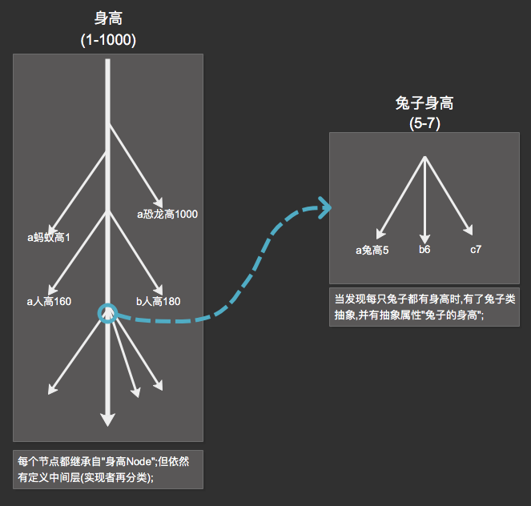 |

     

## n10p21 AIValueNode模糊值
`CreateTime 2018.01.28`

| 前言 >> |
| --- |
| `值化`数据(一般为`某算法`或`某思维方式`的结果); |
| 如:颜色的值 |
| 如:年龄的值 |
| 如:身高的值(某`思维方式`(对某些值进行类比等复合操作)的结果值,的定义) |
| 注:关键不是值,而是值的来源;这个来源才是对AIValueNode的理解; |
| 注:AIValueNode的值各自存储(即int4和4的两次出现,互无关联,但类比到的时候,再抽象等) |

     

## n10p22 模糊Abstract关系
`CreateTime 2018.01.30`

| 前言 >> |  |
| --- | --- |
| abs同类的阶段 |  |
|  | 1. 当A与B在被类比到相同属性X时,Thinking分析并构建ABBase_X(只针对X的absNode); |
|  | 2. 发现A与B越来越多的相同;此时已有ABBase_Y,ABBase_Z等 |
|  | 3. Thinking会将XYZ等直接合成ABBase; |
|  | 4. 此时,如果A有新属性时,会直接以模糊方式将此属性加到Base上; |
| 概念 | 模糊关系是未被确认的关系,或者说;所有的关系都是非确认的(类比过也未必);确认度是相对的; |
| 注 | 模糊关系是Thinking在分析任务中激进的表现,数据没有绝对的正确,适当的试错,帮助智能体解决很多问题 |

| 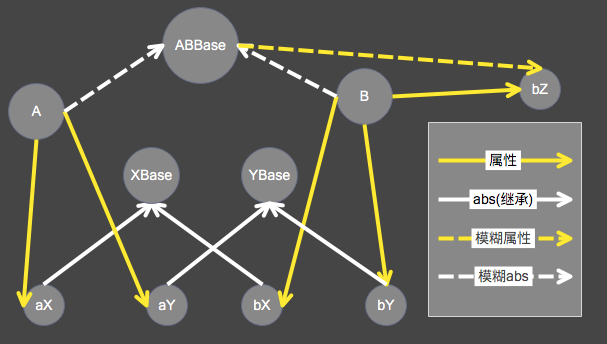 |
| --- |

     

## n10p23 数据模型从(input->think->aiModel->aiNode)
`CreateTime 2018.02.01`

| 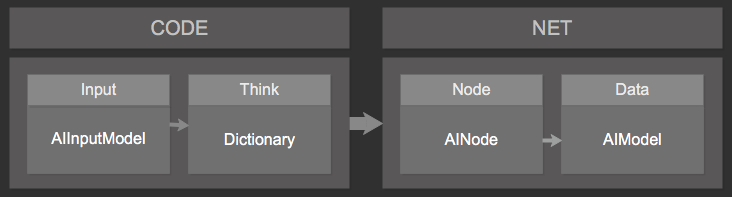 |
| --- |

     

## Other

| toDoList >> |  |
| --- | --- |
| 1 | 分析`饱不知饿` 与 `记忆情绪` 对createMV的产出不同处理; |
| 2 | 作一个`inducation的存取`和`logic的存取` |
| 3 | 作全局检索的实践与优化 |

| 分toDoList >> |  |
| --- | --- |
| 1 | insert时的继承链,到AINode止;`isClass`和`superClass` |

| idea >> |  |
| --- | --- |
| 1 | 使用富文本扩展字符串算法的属性量 |
| 2 | 后天算法 |

          
