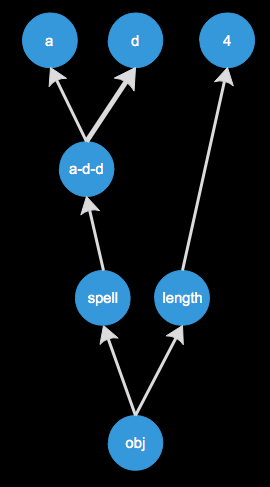
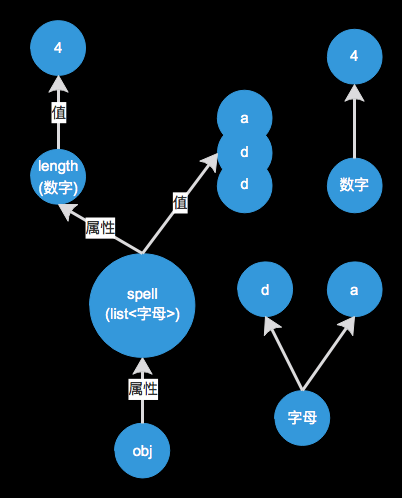
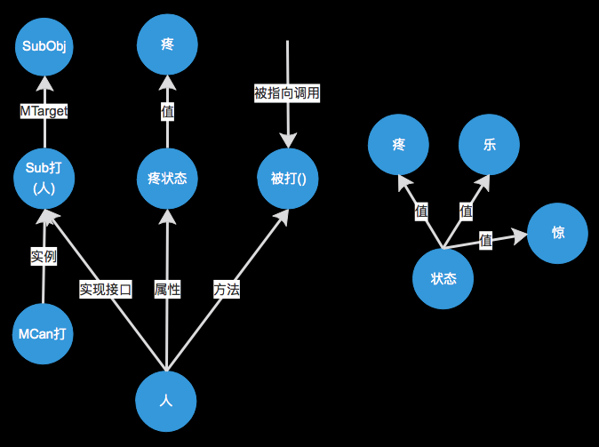
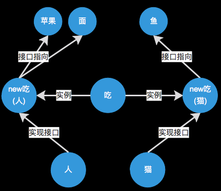
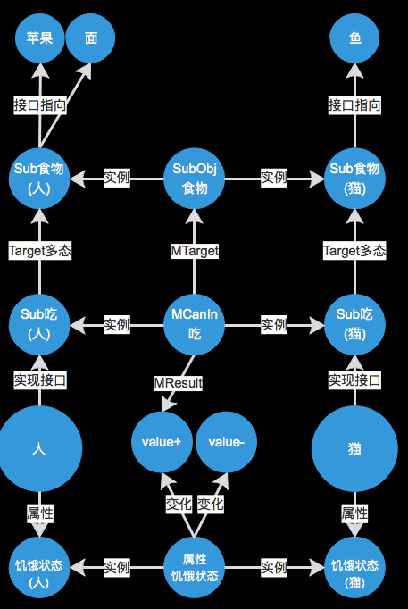
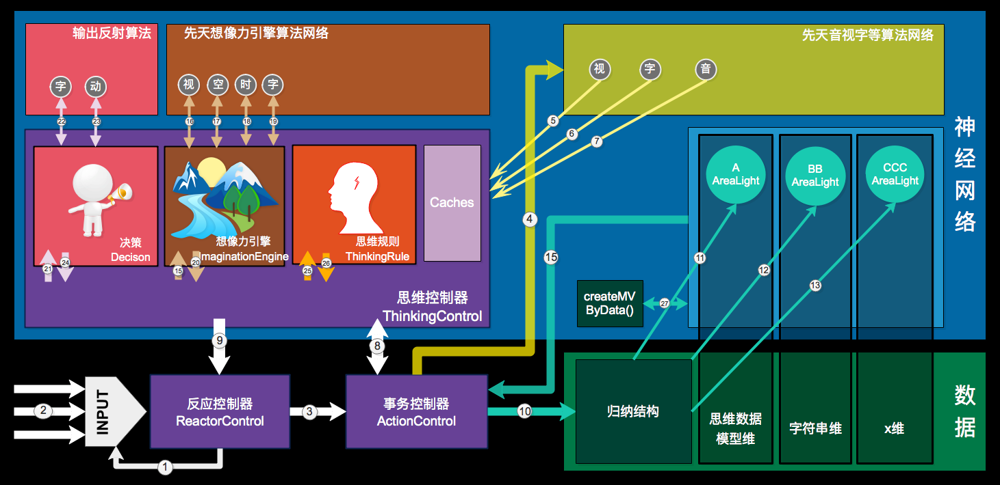
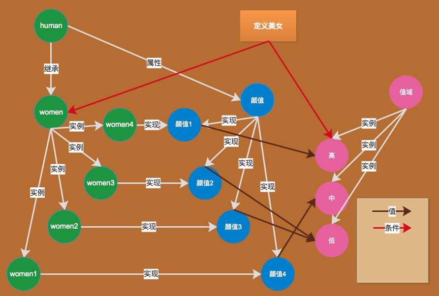

# 思维与神经网络整合-数据神经网络(归纳结构)的构建

<!-- TOC depthFrom:1 depthTo:6 withLinks:1 updateOnSave:1 orderedList:0 -->

- [思维与神经网络整合-数据神经网络(归纳结构)的构建](#思维与神经网络整合-数据神经网络归纳结构的构建)
	- [n10p1 归纳结构1-String](#n10p1-归纳结构1-string)
	- [n10p2 SQL备查整理](#n10p2-sql备查整理)
	- [n10p3 思维的动2](#n10p3-思维的动2)
	- [n10p4 归纳结构2-例子](#n10p4-归纳结构2-例子)
	- [n10p5 归纳结构3-DataType](#n10p5-归纳结构3-datatype)
	- [n10p6 归纳结构4-构建](#n10p6-归纳结构4-构建)
	- [n10p7 规则思想总结](#n10p7-规则思想总结)
	- [n10p8 归纳结构5-LineType](#n10p8-归纳结构5-linetype)
	- [n10p9 ActionControl的增删改查](#n10p9-actioncontrol的增删改查)
	- [n10p10 归纳结构6-抽象节点的形成](#n10p10-归纳结构6-抽象节点的形成)
	- [n10p11 归纳结构7-细节](#n10p11-归纳结构7-细节)

<!-- /TOC -->

     

## n10p1 归纳结构1-String
`CreateTime 17.12.25`

| 前言 >> |
| --- |

|  |
| --- |
| 将思维与mindValue深度集成,并将先天神经网络删除后,整个神经网络有了很大改变,此节用于整理`字符串`在神经网络中的基本存储结构 |

| 示图 >> |
| --- |

| 简 | 全 |
| --- | --- |
|  |  |

| 注: | `示图全` 为成熟阶段,我们要区分其中: |
| --- | --- |
| 1 | 哪些成份是先天具有的, |
| 2 | 哪些是后天思维轻易且必然形成的, |
| 3 | 哪些是后天思维不一定想到的; |
| 注: | 先天不存在字母、单词、数字的概念; |
| 注: | 先天存在属性与值的概念; |

| 思维方式接入 >> |
| --- |

|  |  |
| --- | --- |
| 类比 | 类比的细腻度依赖与算法等基础,而类比的结果产生归纳及`归纳下的归纳实体` 形成层级归纳结构 |
| 归纳 | `归纳` 在神经网络中体现为独立的`层级结构`,是神经网络中的`索引`,其结构越分层明确且详细,越易于检索; |
| 统计 | 由节点间的关联自动形成与使用,有几条规则决定其变化 |

     

## n10p2 SQL备查整理
`CreateTime 17.12.25`

| 前言 >> |
| --- |

|  |
| --- |
| 神经网络数据库因其结构与以往不同,有强大的关联及索引能力,在sql上也会比以往更加多变强大,此节用于跟随所有开发用到结构需求,在此留下sql记录;`备查及整理于此` |

     

## n10p3 思维的动2
`CreateTime 17.12.26` `参考n9p20`

***

| 复杂的动 >> |
| --- |

|  | 借助数据,有了思维方式 |
| --- | --- |
| 思维`动`的方式 | 如:穷举式帮助`归纳`检索 |

***

| 思维操作 >> |
| --- |

|  |  |
| --- | --- |
| 元操作 | 类比 |
| Result | Law规律 |

***

| 思维数据的神经网络存储 >> |
| --- |

|  |  |
| --- | --- |
| 思维方式 | 不同的`归纳结构`,不同的`MLogic,MCan`等组合,产生不同思维方式 |
| law | 类比发现`规律`,而规律让类比产出结果;(参考:上表) |
| can | 也是`归纳`的一种 |
| logic | 是`can`的实例化形式,即: Logic l = new Can(); |
| isa | 是`归纳` |
| valueIs | 是`属性值` |
| 思维经验 | 似下图 |

| 思维经验示图 >> |
| --- |

| 类似String | Experience |
| --- | --- |
|  |  |

     

## n10p4 归纳结构2-例子
`CreateTime 17.12.27` `参考n10p1 n10p2 n10p3`

| 问题:分析如下内容,如何建立`归纳`结构? >> |
| --- |

| 1 |  |
| --- | --- |
|  | 人能被打 |
|  | 人会疼 |
|  | 人被打会疼 |
|  |  |

| 2 |  |
| --- | --- |
|  | 人能吃 |
|  | 苹果能被吃 |
|  | 人能吃苹果 |

| 3 |  |
| --- | --- |
|  | 人吃面和苹果 |
|  | 猫吃鱼 |
|  |  |

| 注: |  |
| --- | --- |
|  | `能`:输出->指向目标 |
|  | `会`:状态->可变化 |
|  | `能被`:输入->被指向为目标 |

     

## n10p5 归纳结构3-DataType
`CreateTime 17.12.27`

| DataType >> |
| --- |

|  |  |  |
| --- | --- | --- |
| 1 | Int | 基本类型 |
| 2 | Float | 基本类型 |
| 3 | String | 基本类型 |
| 4 | Char | 基本类型 |
| 5 | Obj | 基抽象,所有类型的抽象基类 |
| 6 | Arr | 组类型 |
| 7 | MLogic | Method方法,被调用,记录Logic |
| 8 | MCanOut | Method接口,有目标,输出如:打`对方疼` |
| 9 | MCanIn | Method接口,有目标,输入如:吃`自己饱` |
| 10 | SubObj,SubInt等 | 其中SubX类型,在定义时,并不会知晓X是什么类型;只是Sub而已,`相当于C#中T<Object>` |

| 注 >> |
| --- |

|  |  |
| --- | --- |
| 1 | 所有定义了的自定义对象都用SubX类型,而无权使用Obj;(Obj只有一个,并不可实例化)`X是父节点地址` |
| 2 | Law规律是类比的结果 |
| 3 | 未明确Law用`unLaw关联类型` |
| 3 | 已明确Law用属性,继承,Can等表示 |
| 4 | Logic逻辑用MLogic表示(方法被调用时,某状态的变化) |

***

| 示图 >> |
| --- |

|  |
| --- |

***

     

## n10p6 归纳结构4-构建
`CreateTime 17.12.28 参考n10p5`

| 概述 >> |
| --- |

|  | 懒构建部分 | 先天构建部分 |
| --- | --- | --- |
| 概念 | 思维类比分析到的部分,进行结构化(先天指定的) | 基础dataType定义部分,可先天指定结构构建(Net分维) |
| 优势 | 避免过度抽象问题 | 避免过度耦合的问题,网络分维 |
| 缺点 | 导致某些节点的老结构遗留,导致`思维时`发现结构冲突需要作结构更新;(参考n10p11修正) | 有时维间关联弱导致检索困难 |

***

| 先天的分维 >> | 现阶段不考虑分维,原因如下: |
| --- | --- |
| 1 | audio |
| 2 | video |
| 3 | 其它 |

***

| 示图 >> |
| --- |

|  |
| --- |
| 注:去掉mvRoot，mv只作为构建起因存在，影响关联强度。（避免试图直接分析情感） |

     

## n10p7 规则思想总结
`CreateTime 18.1.3 参考n9p16 n9p19 n9p20`

| RULE表 >> |
| --- |

| 阶段 | 道德经角度 | 规则思想角度 | 代码角度 | 注意 |
| --- | --- | --- | --- | --- |
| 定义 | 道生一 | mindValue的定义为一; | mv |  |
| 目标 | 一生二 | 欲动为阳,欲静为阴; | mvTarget |  |
| 变化 | 二生三 | 动生变,变化为三; | cmv | 没有严格的0,对比大于正负 |
| 成长 | 三生万 | 变生MLogic,变生数据神经网络 | AINet |  |

     

## n10p8 归纳结构5-LineType
`CreateTime 18.1.3 参考n10p3 n10p6`

***

| 关联类型 `AILine.Type` >> |
| --- |

|  |  |
| --- | --- |
|  |  |

|  |  |
| --- | --- |
| 属性property | 方法目标MTarget |
| 值valueIs | 方法结果MResult |
| 继承isA | MCanIn |
|  | MCanOut |
|  | UnLaw(未确定`归纳结构`时,也需要存储) |

***

     

## n10p9 ActionControl的增删改查
`CreateTime 18.1.4`

| 查-全局检索 >> |
| --- |

|  |  |
| --- | --- |
| 矛盾 | 不识别无法检索,不检索无法识别 |
| 拆分多维检索 | 所以在神经元算法结果之处，便有了分维与各维独立优化。拆分多维检索有效提高速度 |

***

| 查-区域点亮 >> |
| --- |

***

| 查-具象检索 >> |
| --- |

|  | 取抽象Node下的子节点太多而检索困难时 |
| --- | --- |
| 1 | 思维方式帮助 |
| 2 | 近期思维log为索引去ActionControl再检索:(代码定义,非常有效) |

***

| 思考 >> |  |
| --- | --- |
| 1 | 思维时,是否设计一个通用model;将网络数据model化使用到代码中... |

***

     

## n10p10 归纳结构6-抽象节点的形成
`CreateTime 18.1.6`

| 实例 >> |
| --- |

|  |  |
| --- | --- |
| 实现: | 懒构建,Line和Node中不必要体现;(继承的规则); |
| 值域: | 是float类型,每个实例都只是其连续范围内一个点; |
| 实例: | 懒构建,Line和Node都只在构建时,动态生成 |
| 颜值: | 变量名:`定义beautifulMindValue`,类型为:`float`,范围:`由beautifulMindValue决定` |
| 值类型: | float,int等值类型并没有单独分维 |

***

| `定义美女Node`形成的过程 >> |
| --- |

|  |  |
| --- | --- |
| 1 | w4被称为`美女` (形成未知"美女"抽象节点,并指向实例w4) |
| 2 | w1被称为`美女` (未知节点下加入w1,并点亮"未知节点" + "w4" + "w1") |
| 3 | Thinking类比到`美女`的Law是`颜值`比较高 |
| 4 | 抽象`美女Node`定义追加`模糊值` 对比结果比值更重要,约 `>= 0.7f` 或 `前30%` |

***

| 思考 >> |
| --- |
| 抽象Node的理解与所包含的信息;参考(n10p11) |

     

## n10p11 归纳结构7-细节
`CreateTime 18.1.6`

| 归纳结构_dataType >> |  |
| --- | --- |
| char | 不会有字符串维,思维的拆分,总会把字符串拆分成charArr传递给Net |
| arr | 组合 | 
| property | 包含 |
| float,int | `值类型`没有单独分维 |
| Obj | 基 |
| SubX | 子类(可多继承)(类属性可以有默认值) |
| Instance | 实例 |
| change | 变化 |
| **Method** |  |
|  | 行为:发起人`bool isSelf`; |
|  | 触发Result`changeArr` |
| 注: | 没有static,const等概念 |
| 注: | 所有都是public |
| 注: | Method体只是多个change组成,将OOP的方法复杂逻辑最小拆分,避免各种bug与复杂运算; |

***

| 归纳结构_Property >> |  |
| --- | --- |
| 定义 | Property的定义是确切的,可继承,可实现,可赋值 |

***

| 概念 >> |  |  |
| --- | --- | --- |
| 无名 | Node最初都是无名的,零散的,它在等待`思维中类比`给其某个或者某组,进行定义 | 参考:定义美女 |
| 修正 | Node的定义从模糊和不确切开始,经过思维后,不断精确修正; |  |
| 继承偏移 | 继承的修正,称为`继承偏移`,修正的过程是体现上移和多态的过程 | 参考美女继承`w1`到`women+颜值>=30%` |

     
