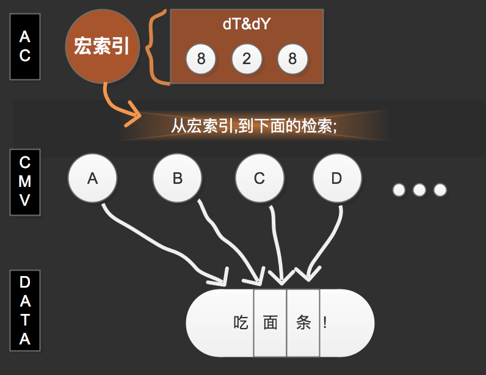
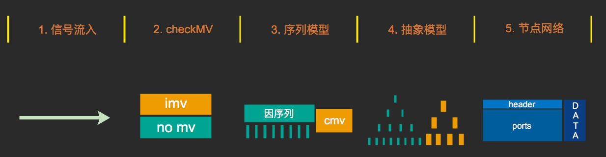
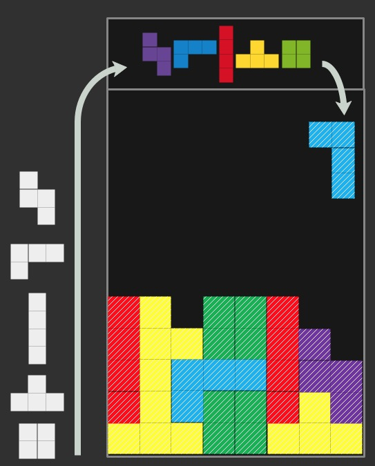

# 流程

> 采用自然而然的信息处理后,关于各方面的重建;

***

<!-- TOC depthFrom:1 depthTo:6 withLinks:1 updateOnSave:1 orderedList:0 -->

- [流程](#流程)
	- [n12p1 怀疑与进取2](#n12p1-怀疑与进取2)
	- [n12p2 流程](#n12p2-流程)
	- [n12p3 内存网络与change](#n12p3-内存网络与change)
	- [n12p4 简化思维控制器 & 思考dataIn的熵增熵减](#n12p4-简化思维控制器-思考datain的熵增熵减)
	- [n12p5 检索中的 设计依赖 和 类比链感觉](#n12p5-检索中的-设计依赖-和-类比链感觉)
	- [n12p6 知识表示](#n12p6-知识表示)
	- [n12p7 cmv生_数据的模型](#n12p7-cmv生数据的模型)
	- [n12p8 net的性能 (索引序列 & node节点优化)](#n12p8-net的性能-索引序列-node节点优化)
	- [n12p9 流程](#n12p9-流程)
	- [n12p10 data索引序列2](#n12p10-data索引序列2)
	- [n12p11 流程2](#n12p11-流程2)
	- [Other](#other)

<!-- /TOC -->

   

## n12p1 怀疑与进取2
`CreateTime 2018.04.09`

| dataIn_检索 >> |
| --- |
| 1. 输入字符串:"bbcd",此时的检索操作,其实就是thinking尝试理解"bbcd"的过程 |
| 2. 检索中缩小范围的方式有很多种,如下: |
| 3. 索引:初次检索时,都是以最小拆分单元为索引的`如b,c,d,xmv` |
| 4. 索引:再次检索时,重复以上步骤,再次缩小范围 |
| 5. 直到解决问题,结束思考事务 |

***

| dataIn_检索中缩小范围的方式 >> |
| --- |
| 1. 不同知识网络中,检索的最佳方式是不同的,例如:当a未获得独立时,以a检索将返回nil |
| 2. 即:获得独立节点时,检索才是有效的,`这是知识面的意义,是供养结构化的养料` |

***

| 类比的怀疑 >> |
| --- |
| 1. 怀疑命题:类比,并非是thinkingControl的元操作,而是actionControl对net的元操作 |
| 2. 并非想到什么存什么,而是想本来就是net操作;思维也是net众操作; |

     

## n12p2 流程
`CreateTime 2018.04.10`

| 简介 >> |
| --- |
| > 结构化对规范流程的要求强烈度呈正比,越大型的网络结构越是需要更加精心设计其流程 |
| > 要作到thinkingControl与net的深度整合,那么思维只是一个流程化的操作者, |
| > thinking只有一个使命,就是让net顺利有序的演进与作用于智能; |

***

| 先天流程_dataIn >> | 用途 | 功能说明 |
| --- | --- | --- |
| 1. dataIn_checkMV | 判断mv | `激活 或 单存cache 或 不存不处理` |
| 2. dataIn_AssociativeData | 信号处理(也判断mv2) | 最普遍的dataIn操作 |
| 3. dataIn_AssociativeExperience | 饿了找瓜 | 后天思维方式(也是抽象结构化网络) |
| 4. dataIn_AnalogyData | 类比 | 类比在Net中 `集成到每一次检索等事务中` |
| 5. dataIn_BuildNet | 想啥存啥 | thinking与net集成后,想与存本就是同一操作 |

***

| 后天流程_思维方式 >> |
| --- |
| 1. 思维在net流窜的历程,也会作为`思维方式`数据存在网络(单独区)中 |
| 2. 后天流程,允许先天流程最简化设计,并成为智能的关键,也是思维与net整合最成熟的方式 |

     

## n12p3 内存网络与change
`CreateTime 2018.04.11`

| 内存网络 >> |
| --- |
| 1. 将原net扩展一个内存存储类,内只放一个字典,然后以N层kv的方式,来无限扩展内容,其存储结构与硬盘网络保持一致 |

***

| change >> |  |
| --- | --- |
| 1. 值持续的变化,其先决条件是,思维在shortCahce中,相同dataType和dataSource下值的变化 | 错 |
| 2. 从0-1也是变化 |  |
| 3. 微观变化不敏感,而对宏观变化敏感,故:`change未必是同一dT&dS下的值` `而是指某个信息域的变化` |  |
| 4. 所以,change只终指向`意识流`,change是一种高级思维反应,最初只对从0-1比较敏感 |  |
| 5. 识别`思维对象判定`,(信息域模糊划分), | 参考n11p21_宏微的怀疑 |

***

| 前额叶_思维方式 >> |
| --- |
| 1. 前额叶的代码实现,必然是一个迭代不断完善的过程; |

     

## n12p4 简化思维控制器 & 思考dataIn的熵增熵减
`CreateTime 2018.04.13`

| 前言 >> |
| --- |
| 1. 决定将思维彻底与net整合,将思维方式等绝大多数体现在网络中,所以需要简化思维控制器 |
| 2. 简化思维控制器,首要问题就是关于dataIn后,初始数据在构建方面的熵增减问题 |
| 3. 解决熵增减最核心的方式就是:`用必进 & 废必退`; |

***

| 举例 >> |
| --- |
| > 例:当思考到1的时候,会感到疼,类似这样`最新的节点关系关联`,过程如下: |
| 1. 当疼的时候,有N种信号,都潜意识被当作索引进行检索操作 |
| 2. 作为索引时,返回nil,但有了隐性关联hR(hiddenRelation) (`思考:1. hR也是数据网络吗?  2. 如何体现出hR与dR(displayRelation)的不同`) |
| 3. 再次潜意识检索时,虽然返回nil,不过因为hR的记录,`1`和`疼`的关联被推向`构建关联` |

| 问题1. hR也是数据网络吗 >> |
| --- |
| 1. log也是网络,也应使用数据网络 |

| 问题2. 如何体现出hR与dR的不同 >> |  |
| --- | --- |
| 两种方式如下: |  |
| 1. 以临时网络的方式存储在单独空间(一般是内存中) | 推荐(解耦,操作方便) |
| 2. 以特殊的关联类型以标识 | 不推荐 |

     

## n12p5 检索中的 设计依赖 和 类比链感觉
`CreateTime 2018.04.14`

| 前言 >> |  |
| --- | --- |
| 介绍: | 在net的检索中，一般以宏观信息为索引。 |
| 难点: | 在`巨量数据`下，`模糊匹配到有效数据`而又`高效`是最大的挑战。 |
| 当前: | 在前面已经设计过各种各样的方式来作全局检索和其它等等. |
| 目标: | 本节在目前的进度基础上,对其进行再次思考,从而捉进此次AINet的改版进程; |

***

| 方法 >> |
| --- |
| 本节通过2种方式,实现目标, |
| 1. 设计依赖 |
| 2. 感觉 |

| 1. 设计依赖 >> |
| --- |
| 例如，人类检索声音和图像的性能优于文字。而皮层有枕叶和颞叶,我们将这种现象称为:`检索的设计依赖` |
| 将algsDic的一些设计保留到net中,是一种最直接的取巧方式,其有以下几种优势: |
| 1. 巨量数据分区 |
| 2. 对各分区进行独立优化 `(只是将算法的优化延迟到net中,或者说算法本身的设计已经在为服务net作设计)` |
| 3. 区内关联分支 `(宏索引可以被拆分,后逐个缩小网络范围)` `例如搜索abs 或 声音:魁武` |

| 2. 感觉 >> |
| --- |
| 类比宏观数据时(或者集)，很难匹配到一致, |
| 此时,`类比链`应运而生,其工作步骤如下: |
| 注: 类比链就是一系列类比结果, |
| 1. 类比链结果是:`上上下下下上下`, |
| 2. 类比链其在aiNet中运作 |
| 3. 类比链`优化了性能`和`实现了模糊` |
| 4. 类比链`降低了准确度` |

***

| 类比链的准确度问题 >> |
| --- |
| 为解决准确度问题,有以下几种方式 |
| 1. 先天方式_net的分区,和各区的独立优化设计,例如:你可以轻易识别音乐或人脸 |
| 2. 后天方式_宏节点的细化,(`ab到a和b`),儿童的识别准确度不如成年人 |

     

## n12p6 知识表示
`CreateTime 2018.04.14`

| 感觉 >> |
| --- |
| 1. 感觉只是对数据经过`类比处理的结果`，以bool链的形式给予判断。 |

| change >> |
| --- |
| 1. `有个问题，出生后才发现世界是变化的，还是...` |
| 2. 一切数据都是静态，无法表示出动态。 |
| 3. 但关联ports是有序的。其可以表示动态，或者逻辑吗？ |
| > 答:跨域关联是有序的,如下步骤: |
| 1. 发现cmv时,才会思考跨域关联 |
| 2. 模糊关联作为changePorts的`序前`关联; |
| 3. |
| > 答：与`静态定义的模糊到确切`一样，`change的模糊到确切`也是由cmv点燃的： |
| 1. 只是在知识的表现格式上，略显不同。 |
| 2. `静可动，动有因`，只要有了cmv，接下来的网络都是一个套路。 |
| 注： change的知识表示是`以cmv`为起点。`静可动，动有因`为最基本模型。终以`网络`为载体的。 |

     

## n12p7 cmv生_数据的模型
`CreateTime 2018.04.15`

| 前言 >> |
| --- |
|  |
| 1. cmv生思维,思维生数据,数据成网络,网络成智能,整体生意识 |
| 2. `cmv生数据`:如果把dataIn的初流程看作是写死的代码部分,那么其实dataIn_CheckMV对数据生成的影响是非常直接的; |

| cmv生数据 >> |
| --- |
| 1. cmv的最大特征就是change,所以无论是静态数据,还是变化(因)数据,都应体现以在cmv的模型为模板创建; |

| 感性与理性 >> |  |
| --- | --- |
| 1. cmv的`模糊因`是感性的,而`类比链`给了`处理模糊感觉`的能力 | 泛化 |
| 2. cmv的`确切因`是理性的,而`数据归纳网络`正好有`自然而然的抽具象`能力 | 深度 |

***

| 动因模型示图 >> |
| --- |
|  |

     

## n12p8 net的性能 (索引序列 & node节点优化)
`CreateTime 2018.04.17`

| 检索优化 >> |
| --- |
| 1. 在 `内存中` 单独维护一个`data指针排序(DataSort)`序列,每插入一条:`找到自己的位置` |
| 2. runtime,要避免一切排序, |
| 3. 避免一切最简单的循环isEqual |
| 4. 避免直接io取data后isEqual |

|  |
| --- |
| 1. `AC为actionControl` `dT&dY 828是索引的具体值域` `ABCD...是各种网络节点` `其中ABCD是有效结果` |
| 2. 宏索引,到下面的检索性能优化,是本图希望解决的问题; |
| 3. 单靠AINetDataSort是不行的,因为就算只是`有效结果ABCD也有无限多`... |
| 4. 所以ABCD的自动抽象,比如ABCD共同的结果是hungerCmv的增涨; |
| 5. 那么此时,dataSort只需要存储hungerCmv的抽象节点即可... |

***

| node节点优化 >> |
| --- |
| 1. 拆分每个node为:`header` `data` `ports` 三个部分 |
| 2. 其中,header中存dT & dS & kvPointer |
| 3. 其中,ports中存conPorts & absPorts & logicPorts等 |
| 4. 其中,data中存AIModel `(所有的AIModel)` |

     

## n12p9 流程
`CreateTime 2018.04.18`

| 构建流程 >> |
| --- |
|  |
| 1. 序列模型,是由thinking输入的最原始的基本模型;(模糊模型) |
| 2. 抽象模型,是序列模型的确切过程;(不断类比,自然的模型演化结果) |
| 3. 节点网络,是最终所呈现出的网络形态,其中ports占用空间最大,数据反而非常小,而port与header一一对应 |

***

| 检索流程 >> |
| --- |
| 1. 索引是`宏数据` (cmv或常规查询), |
| 2. 而检索是根据宏数据的`拆分值与data类比搜索`,(data是输入时有序的,性能优化) |
| 3. 检索的结果此时没有意义,根据data到header找相应节点 |
| 4. header根据ports,点亮对应的网络域; |
| 5. |

     

## n12p10 data索引序列2
`CreateTime 2018.04.19`

| 简介 >> |
| --- |
| 1. dataSort只是完成了,最简单暴力的工作,真正的升华在其到达网络后,其关联呈现出的意义 |
| 2. dataSort先对宏索引进行拆分,后逐个定位,并作连通测试,再返回结果; |
| 3. 疑虑: 这种自动化方式,有其准确度缺点,但保证了thinking始终只接触宏数据; |

***

| 单存流程 >> |
| --- |
| 1. 根据dt&ds&mt找到信息对应区, |
| 2. 存序列,`先有序后存储` |

| 单取流程 >> |
| --- |
| 1. 根据dt&ds&mt定位区 |
| 2. 根据有序,快速定位指针地址 |

| 宏存流程 >> |
| --- |
| 1. 循环根据dt&ds&mt存信息 |

| 宏取流程 >> |
| --- |
| 1. 进行单取 |
| 2. 对各个单取地址,通过`for+isEqual`作连通测试,例如:`查找这句话中,是否存在找和存两个字?` |
| 注: 大脑的连通测试是异步扩散电信号,并响应连通的;其通过异步拟补了运算速度的不足 |

***

| dataSort的相关问题 >> |
| --- |
| 问1: data不仅是有序,也是结构化的吗? |
| 答1: data不存结构化,结构化只体现在下一步,即回归到网络后; |
|  |
| 问2: dataSort是整存的,还是单存的?`如:你好` |
| 答2: `单存的`,两个原因:`1. 越是单存,才能保证性能;` `2. dataSort没有获得整体概念,因为其不在网络` |
|  |
| 问3: 微信息是没有dt&ds的,那么还根据dt&ds分区吗? |
| 答3: 微信息除了dt&ds还有一个标记,就是微信息类型;此处叫mt; |

     

## n12p11 流程2
`CreateTime 2018.04.20`

| 俄罗斯方块示图 >> |
| --- |
|  |
| 1. 颜色: `白色: 信息存储前` `实彩: 存到data区后` `虚彩: 指针使用data` |
| 2. 容器: `顶: data索引序列区` `底: Net网络区` |
| 3. 箭头: `长: dataIn方向` `短: 索引区到构建Net区指向` |
| 4. 各图形间的关系是最重要的信息; |
| 5. 可以快速根据,itemData找到其被调用的nodeList; |

     

## Other

| toDoList >> | task | status |
| --- | --- | --- |
| 1 | 加上能量值 |  |
| 2 | 并且将`port强度`写完善,然后将`ports默认排序` |  |
| 3 | 第二信号的input,第二信号的change |  |
| 4 | 最简单的双词实验:`进来` `出去` |  |
| 5 | 将`三种结构`集成到AINet中 | `1. 存储结构 已完成` `2. 集合关联 已有关联功能` `3. 跨域关联 尝试改进并实现关联功能` |
| 6 | 把dT&dS 从kvPointer中移出 |  |
| 7 | 写AINetDataSort类 |  |

| 肯定表 >> |
| --- |
| 肯定1. hR肯定存在 |
| 原因1. 因为hR是为了更好的过渡到dR,并且除algs外,这是第二次明确的解决熵增减的手段 |

| 理论表 >> |
| --- |
| 理论1. 解决熵增减最核心的方式就是:`用必进 & 废必退`; |
| 原因1. 单纯的增或减都归于破灭或者0,只有用进废退才是灵活的法则 |

     
