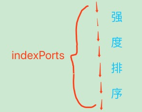
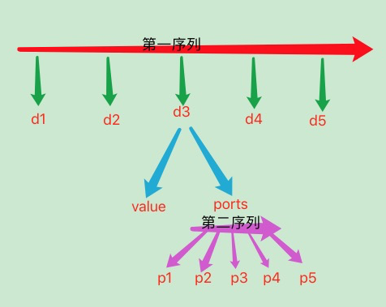
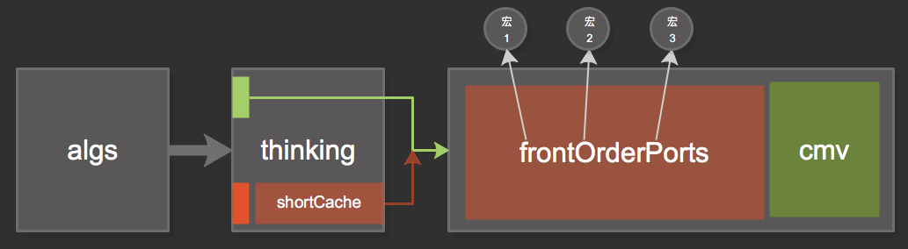
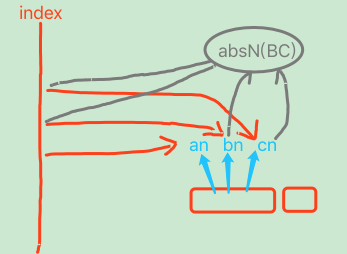
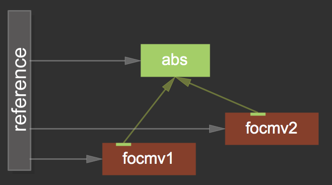
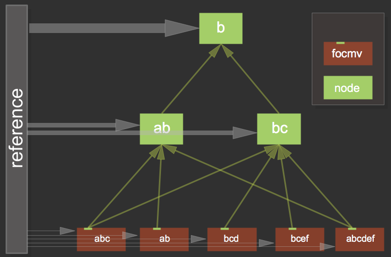
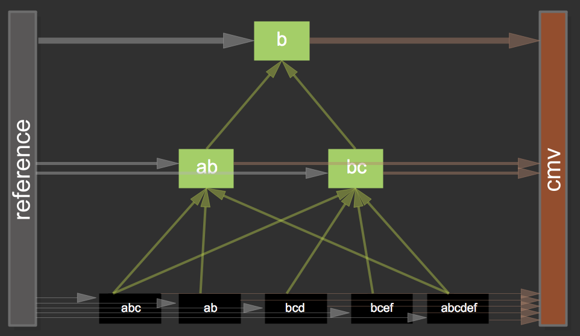

# GNOP之流程与实践

> 采用自然而然的信息处理后,关于各方面的重建;  
> 当你种下种子,参天大树善未长成,但工作已告一段落;  
> 时间是最好的设计师,其数亿年的设计成果值得我们学习;

***

<!-- TOC depthFrom:1 depthTo:6 withLinks:1 updateOnSave:1 orderedList:0 -->

- [流程](#流程)
	- [n12p1 怀疑与进取2](#n12p1-怀疑与进取2)
	- [n12p2 流程](#n12p2-流程)
	- [n12p3 内存网络与change](#n12p3-内存网络与change)
	- [n12p4 简化思维控制器 & 思考dataIn的熵增熵减](#n12p4-简化思维控制器-思考datain的熵增熵减)
	- [n12p5 检索中的 设计依赖 和 类比链感觉](#n12p5-检索中的-设计依赖-和-类比链感觉)
	- [n12p6 知识表示](#n12p6-知识表示)
	- [n12p7 cmv生_数据的模型](#n12p7-cmv生数据的模型)
	- [n12p8 net的性能 (索引序列 & node节点优化)](#n12p8-net的性能-索引序列-node节点优化)
	- [n12p9 流程](#n12p9-流程)
	- [n12p10 第一序列(索引序列2)](#n12p10-第一序列索引序列2)
	- [n12p11 流程2](#n12p11-流程2)
	- [n12p12 第二序列(引用序列)](#n12p12-第二序列引用序列)
	- [n12p13 两个序列的开发](#n12p13-两个序列的开发)
	- [n12p14 从第二序列到联想](#n12p14-从第二序列到联想)
	- [n12p15 不应期](#n12p15-不应期)
	- [n12p16 cmv模型和第三序列](#n12p16-cmv模型和第三序列)
	- [n12p17 零散点想法](#n12p17-零散点想法)
	- [n12p18 数据网络之第四序列 (前言)](#n12p18-数据网络之第四序列-前言)
	- [n12p19 第三序列->第四序列的过渡](#n12p19-第三序列-第四序列的过渡)
	- [n12p20 第四序列的思考](#n12p20-第四序列的思考)
	- [n12p21 cmv模型的改版 & 第四序列的代码实现](#n12p21-cmv模型的改版-第四序列的代码实现)
	- [Other](#other)

<!-- /TOC -->

   

## n12p1 怀疑与进取2
`CreateTime 2018.04.09`

| dataIn_检索 >> |
| --- |
| 1. 输入字符串:"bbcd",此时的检索操作,其实就是thinking尝试理解"bbcd"的过程 |
| 2. 检索中缩小范围的方式有很多种,如下: |
| 3. 索引:初次检索时,都是以最小拆分单元为索引的`如b,c,d,xmv` |
| 4. 索引:再次检索时,重复以上步骤,再次缩小范围 |
| 5. 直到解决问题,结束思考事务 |

***

| dataIn_检索中缩小范围的方式 >> |
| --- |
| 1. 不同知识网络中,检索的最佳方式是不同的,例如:当a未获得独立时,以a检索将返回nil |
| 2. 即:获得独立节点时,检索才是有效的,`这是知识面的意义,是供养结构化的养料` |

***

| 类比的怀疑 >> |
| --- |
| 1. 怀疑命题:类比,并非是thinkingControl的元操作,而是actionControl对net的元操作 |
| 2. 并非想到什么存什么,而是想本来就是net操作;思维也是net众操作; |

***

| 皮层与网络的集成度怀疑 >> |
| --- |
| 1. 大脑的数据是否是实时用神经元演算还原的？ |
| 2. 大脑的关联网络是否大量依赖皮层 |
| 3. 目前这些怀疑不足以影响到SMG现有设计，待挖掘。。。 |

     

## n12p2 流程
`CreateTime 2018.04.10`

| 简介 >> |
| --- |
| > 结构化对规范流程的要求强烈度呈正比,越大型的网络结构越是需要更加精心设计其流程 |
| > 要作到thinkingControl与net的深度整合,那么思维只是一个流程化的操作者, |
| > thinking只有一个使命,就是让net顺利有序的演进与作用于智能; |

***

| 先天流程_dataIn >> | 用途 | 功能说明 |
| --- | --- | --- |
| 1. dataIn_checkMV | 判断mv | `激活 或 单存cache 或 不存不处理` |
| 2. dataIn_AssociativeData | 信号处理(也判断mv2) | 最普遍的dataIn操作 |
| 3. dataIn_AssociativeExperience | 饿了找瓜 | 后天思维方式(也是抽象结构化网络) |
| 4. dataIn_AnalogyData | 类比 | 类比在Net中 `集成到每一次检索等事务中` |
| 5. dataIn_BuildNet | 想啥存啥 | thinking与net集成后,想与存本就是同一操作 |

***

| 后天流程_思维方式 >> |
| --- |
| 1. 思维在net流窜的历程,也会作为`思维方式`数据存在网络(单独区)中 |
| 2. 后天流程,允许先天流程最简化设计,并成为智能的关键,也是思维与net整合最成熟的方式 |

     

## n12p3 内存网络与change
`CreateTime 2018.04.11`

| 内存网络 >> |
| --- |
| 1. 将原net扩展一个内存存储类,内只放一个字典,然后以N层kv的方式,来无限扩展内容,其存储结构与硬盘网络保持一致 |

***

| change >> |  |
| --- | --- |
| 1. 值持续的变化,其先决条件是,思维在shortCahce中,相同dataType和dataSource下值的变化 | 错 |
| 2. 从0-1也是变化 |  |
| 3. 微观变化不敏感,而对宏观变化敏感,故:`change未必是同一dT&dS下的值` `而是指某个信息域的变化` |  |
| 4. 所以,change只终指向`意识流`,change是一种高级思维反应,最初只对从0-1比较敏感 |  |
| 5. 识别`思维对象判定`,(信息域模糊划分), | 参考n11p21_宏微的怀疑 |

***

| 前额叶_思维方式 >> |
| --- |
| 1. 前额叶的代码实现,必然是一个迭代不断完善的过程; |

     

## n12p4 简化思维控制器 & 思考dataIn的熵增熵减
`CreateTime 2018.04.13`

| 前言 >> |
| --- |
| 1. 决定将思维彻底与net整合,将思维方式等绝大多数体现在网络中,所以需要简化思维控制器 |
| 2. 简化思维控制器,首要问题就是关于dataIn后,初始数据在构建方面的熵增减问题 |
| 3. 解决熵增减最核心的方式就是:`用必进 & 废必退`; |

***

| 举例 >> |
| --- |
| > 例:当思考到1的时候,会感到疼,类似这样`最新的节点关系关联`,过程如下: |
| 1. 当疼的时候,有N种信号,都潜意识被当作索引进行检索操作 |
| 2. 作为索引时,返回nil,但有了隐性关联hR(hiddenRelation) (`思考:1. hR也是数据网络吗?  2. 如何体现出hR与dR(displayRelation)的不同`) |
| 3. 再次潜意识检索时,虽然返回nil,不过因为hR的记录,`1`和`疼`的关联被推向`构建关联` |

| 问题1. hR也是数据网络吗 >> |
| --- |
| 1. log也是网络,也应使用数据网络 |

| 问题2. 如何体现出hR与dR的不同 >> |  |
| --- | --- |
| 两种方式如下: |  |
| 1. 以临时网络的方式存储在单独空间(一般是内存中) | 推荐(解耦,操作方便) |
| 2. 以特殊的关联类型以标识 | 不推荐 |

     

## n12p5 检索中的 设计依赖 和 类比链感觉
`CreateTime 2018.04.14`

| 前言 >> |  |
| --- | --- |
| 介绍: | 在net的检索中，一般以宏观信息为索引。 |
| 难点: | 在`巨量数据`下，`模糊匹配到有效数据`而又`高效`是最大的挑战。 |
| 当前: | 在前面已经设计过各种各样的方式来作全局检索和其它等等. |
| 目标: | 本节在目前的进度基础上,对其进行再次思考,从而捉进此次AINet的改版进程; |

***

| 方法 >> |
| --- |
| 本节通过2种方式,实现目标, |
| 1. 设计依赖 |
| 2. 感觉 |

| 1. 设计依赖 >> |
| --- |
| 例如，人类检索声音和图像的性能优于文字。而皮层有枕叶和颞叶,我们将这种现象称为:`检索的设计依赖` |
| 将algsDic的一些设计保留到net中,是一种最直接的取巧方式,其有以下几种优势: |
| 1. 巨量数据分区 |
| 2. 对各分区进行独立优化 `(只是将算法的优化延迟到net中,或者说算法本身的设计已经在为服务net作设计)` |
| 3. 区内关联分支 `(宏索引可以被拆分,后逐个缩小网络范围)` `例如搜索abs 或 声音:魁武` |

| 2. 感觉 >> |
| --- |
| 类比宏观数据时(或者集)，很难匹配到一致, |
| 此时,`类比链`应运而生,其工作步骤如下: |
| 注: 类比链就是一系列类比结果, |
| 1. 类比链结果是:`上上下下下上下`, |
| 2. 类比链其在aiNet中运作 |
| 3. 类比链`优化了性能`和`实现了模糊` |
| 4. 类比链`降低了准确度` |

***

| 类比链的准确度问题 >> |
| --- |
| 为解决准确度问题,有以下几种方式 |
| 1. 先天方式_net的分区,和各区的独立优化设计,例如:你可以轻易识别音乐或人脸 |
| 2. 后天方式_宏节点的细化,(`ab到a和b`),儿童的识别准确度不如成年人 |

     

## n12p6 知识表示
`CreateTime 2018.04.14`

| 感觉 >> |
| --- |
| 1. 感觉只是对数据经过`类比处理的结果`，以bool链的形式给予判断。 |

| change >> |
| --- |
| 1. `有个问题，出生后才发现世界是变化的，还是...` |
| 2. 一切数据都是静态，无法表示出动态。 |
| 3. 但关联ports是有序的。其可以表示动态，或者逻辑吗？ |
| > 答:跨域关联是有序的,如下步骤: |
| 1. 发现cmv时,才会思考跨域关联 |
| 2. 模糊关联作为changePorts的`序前`关联; |
| 3. |
| > 答：与`静态定义的模糊到确切`一样，`change的模糊到确切`也是由cmv点燃的： |
| 1. 只是在知识的表现格式上，略显不同。 |
| 2. `静可动，动有因`，只要有了cmv，接下来的网络都是一个套路。 |
| 注： change的知识表示是`以cmv`为起点。`静可动，动有因`为最基本模型。终以`网络`为载体的。 |

     

## n12p7 cmv生_数据的模型
`CreateTime 2018.04.15`

| 前言 >> |
| --- |
|  |
| 1. cmv生思维,思维生数据,数据成网络,网络成智能,整体生意识 |
| 2. `cmv生数据`:如果把dataIn的初流程看作是写死的代码部分,那么其实dataIn_CheckMV对数据生成的影响是非常直接的; |

| cmv生数据 >> |
| --- |
| 1. cmv的最大特征就是change,所以无论是静态数据,还是变化(因)数据,都应体现以在cmv的模型为模板创建; |

| 感性与理性 >> |  |
| --- | --- |
| 1. cmv的`模糊因`是感性的,而`类比链`给了`处理模糊感觉`的能力 | 泛化 |
| 2. cmv的`确切因`是理性的,而`数据归纳网络`正好有`自然而然的抽具象`能力 | 深度 |

***

| 动因模型示图 >> |
| --- |
|  |

     

## n12p8 net的性能 (索引序列 & node节点优化)
`CreateTime 2018.04.17`

| 检索优化 >> |
| --- |
| 1. 在 `内存中` 单独维护一个`data指针排序(DataSort)`序列,每插入一条:`找到自己的位置` |
| 2. runtime,要避免一切排序, |
| 3. 避免一切最简单的循环isEqual |
| 4. 避免直接io取data后isEqual |

|  |
| --- |
| 1. `AC为actionControl` `dT&dY 828是索引的具体值域` `ABCD...是各种网络节点` `其中ABCD是有效结果` |
| 2. 宏索引,到下面的检索性能优化,是本图希望解决的问题; |
| 3. 单靠AINetDataSort是不行的,因为就算只是`有效结果ABCD也有无限多`... |
| 4. 所以ABCD的自动抽象,比如ABCD共同的结果是hungerCmv的增涨; |
| 5. 那么此时,dataSort只需要存储hungerCmv的抽象节点即可... |

***

| node节点优化 >> |
| --- |
| 1. 拆分每个node为:`header` `data` `ports` 三个部分 |
| 2. 其中,header中存dT & dS & kvPointer |
| 3. 其中,ports中存conPorts & absPorts & logicPorts等 |
| 4. 其中,data中存AIModel `(所有的AIModel)` |

     

## n12p9 流程
`CreateTime 2018.04.18`

| 构建流程 >> |
| --- |
|  |
| 1. 序列模型,是由thinking输入的最原始的基本模型;(模糊模型) |
| 2. 抽象模型,是序列模型的确切过程;(不断类比,自然的模型演化结果) |
| 3. 节点网络,是最终所呈现出的网络形态,其中ports占用空间最大,数据反而非常小,而port与header一一对应 |

***

| 检索流程 >> |
| --- |
| 1. 索引是`宏数据` (cmv或常规查询), |
| 2. 而检索是根据宏数据的`拆分值与data类比搜索`,(data是输入时有序的,性能优化) |
| 3. 检索的结果此时没有意义,根据data到header找相应节点 |
| 4. header根据ports,点亮对应的网络域; |
| 5. |

     

## n12p10 第一序列(索引序列2)
`CreateTime 2018.04.19`

| 简介 >> |
| --- |
| 1. dataSort只是完成了,最简单暴力的工作,真正的升华在其到达网络后,其关联呈现出的意义 |
| 2. dataSort先对宏索引进行拆分,后逐个定位,并作连通测试,再返回结果; |
| 3. 疑虑: 这种自动化方式,有其准确度缺点,但保证了thinking始终只接触宏数据; |

***

| 单存流程 >> |
| --- |
| 1. 根据dt&ds&mt找到信息对应区, |
| 2. 存序列,`先有序后存储` |

| 单取流程 >> |
| --- |
| 1. 根据dt&ds&mt定位区 |
| 2. 根据有序,快速定位指针地址 |

| 宏存流程 >> |
| --- |
| 1. 循环根据dt&ds&mt存信息 |

| 宏取流程 >> |
| --- |
| 1. 进行单取 |
| 2. 对各个单取地址,通过`for+isEqual`作连通测试,例如:`查找这句话中,是否存在找和存两个字?` |
| 注: 大脑的连通测试是异步扩散电信号,并响应连通的;其通过异步拟补了运算速度的不足 |

***

| dataSort的相关问题 >> |
| --- |
| 问1: data不仅是有序,也是结构化的吗? |
| 答1: data不存结构化,结构化只体现在下一步,即回归到网络后; |
|  |
| 问2: dataSort是整存的,还是单存的?`如:你好` |
| 答2: `单存的`,两个原因:`1. 越是单存,才能保证性能;` `2. dataSort没有获得整体概念,因为其不在网络` |
|  |
| 问3: 微信息是没有dt&ds的,那么还根据dt&ds分区吗? |
| 答3: 微信息除了dt&ds还有一个标记,就是微信息类型;此处叫mt; |

     

## n12p11 流程2
`CreateTime 2018.04.20`

| 俄罗斯方块示图 >> |
| --- |
|  |
| 1. 颜色: `白色: 信息存储前` `实彩: 存到data区后` `虚彩: 指针使用data` |
| 2. 容器: `顶: data索引序列区` `底: Net网络区` |
| 3. 箭头: `长: dataIn方向` `短: 索引区到构建Net区指向` |
| 4. 各图形间的关系是最重要的信息; |
| 5. 可以快速根据,itemData找到其被调用的nodeList; |

     

## n12p12 第二序列(引用序列)
`CreateTime 2018.04.23`

| itemData的nodeList >> |
| --- |
| 1. 每个index对应的nodeList根据关联强度排序 |
| 2. 每个index可能有上亿条关联到node |
| 3. 每个宏定义的变化,最终体现在index上,即是另指向;(例如A的长度变化) |

     

## n12p13 两个序列的开发
`CreateTime 2018.04.24`

| 简介 >> |
| --- |
| 信息的意义在于,它明确的指向了某事物; |

***

| 第一个序列_索引AINetIndex >> |
| --- |
| 1. 只存值类型,不转换为AIModel `1. 目前不必要` `2. 只有类比时,才会使用到值` |
| 2. 将mt&dt&ds改为algsType&dataSource `1. 去掉了dataType` `2. mt用at替代` |
| 3. 在dataIn后第一件事,就是先用NetIndex装箱;再去作其它数据处理 |
| 4. 给AIPointer超类,加params字段 `用于分区(在二分查巨量队列,params越细分,越有利性能)` |
| 5. 第一序列,在netIndex只存储pointerId序列; |

***

| 第二序列_关联强度序列->cmv基本模型的建立 >> |
| --- |
| 1. cmv基本模型的建立， |
| 2. 后天网络与杏仁核的基本模型关系 |

|  |
| --- |
| 1. `第二序列` 的使用比 `第一序列` 复杂; |
| 2. 第二序列是联想功能的入口 |

     

## n12p14 从第二序列到联想
`CreateTime 2018.04.27`

| 简介 >> |
| --- |
| 1. 本节,主要是 `从netIndex到netNode区` 相关内容 |

 

| 微联想 >> |
| --- |
| 1. 在微观向宏观过渡的阶段,需要实现较高的匹配度 |
| 2. 而微观不受思维控制,所以要以代码方式自动的类比其匹配度,并将宏信息返回给thinking |

 

| 第二序列的匹配度 >> |
| --- |
| 1. 匹配度是由后天网络关联为依据的;即,第二序列只有强度排序,但需要作`网络连通测试`,才可判定匹配度 |

 

| 两序列示图 >> |
| --- |
|  |
| 1. 两个序列只负责索引及最初的检索 |
| 2. 而知识结构网络,由cmv基本模型展开,与这两序列没直接关系 |

 

| 问题 >> |
| --- |
| 1. 关联最强，不表示最有效问题。 |
| 答: 不应期方式,或者其它方式(再思考); |

     

## n12p15 不应期
`CreateTime 2018.05.02`

| 微序列不应期 >> |
| --- |
| 1. 作用: 用以解决队列 (`强度` `索引`等队列) 与宏信息层面有效性的矛盾,无法绕过的问题。 |
| 2. 因为索引层面没有意义。所以用不应期方式来响应宏信息层传回的标记,以完成宏层面的复杂需求 |

***

| algs皮层不应期 >> |
| --- |
| 1. algs的下一步,向前一步标记不应期 |

***

| 联想不应期 >> |
| --- |
| 1. 同时只解决一条信息流处理,一心不二用 |

     

## n12p16 cmv模型和第三序列
`CreateTime 2018.05.05`

| 前言 >> |
| --- |
| 1. cmv前端的时序列为第三序列(前因序列) |
| 2. 前因的`模糊到确切` 与 定义的`模糊到确切` 是有紧密关系的 (需再深入思考) |
| 3. 第三序列根据 `确切度` 大小排序 |
| 另: node的抽象组,定义的`模型到确切`可能会产生第四序列; |

 

| 代码实现 >> |
| --- |
| 1. 写一个cmvNode(杏仁核神经元)来承载cmv模型。 |
| 2. 写一个序列Node,来表示一个有序微信息集合 |

 

| 第三序列 >> |  |
| --- | --- |
| 1. 由 `前因序列order` 改为 `前因序列的序列oorder` | (废弃) |
| 2. oorder以order的强度排序; | (废弃) |

 

| 示图 & 构建步骤 >> | (废弃) |
| --- | --- |
|  |  |
| 构建步骤 >> | (废弃) |
| 1. thinking传入信息组 |  |
| 2. 非mv分别noMv.convertToNode (shortCache的4组) |  |
| 3. 创建一个orderNode,并指向所有noMv.node; |  |
| 4. 创建oorder,用来存所有orderNode的强度排序; |  |
| 5. 产生orderAbs抽象时,也可以加入到oorder序列中; |  |

 

| 示图变动 >> |
| --- |
|  |
| 变动1. oorder没必要存在, `1. 增加复杂度` `2. cmv的去重在index已有` `3. cmv的强度序在reference已有` |
| 变动2. 宏123的抽象不应影响到cmv基本模型 `因为前因序列中的宏123由thinking识别阶段确定` `抽象成长后,直接作废此处即可` `如:蜻和蜓在形成词后,原先对蜻和蜓单独的喜好,则升级后,废退` |
| 变动3. 序列从algs到thinking的shortCache已经决定,所以在示图模型外加入这俩流程 |

 

| 无经验构建步骤变动 >> |
| --- |
| 1. algs传入信息 |
| 2. thinking处理并分类 `noMv存shortCache` `mv则触发构建cmv模型` |
| 3. 分别构建:frontOrderPorts和cmv的宏Node |
| 4. 生成cmv模型,并指向刚刚构建的Node们 |
| 注: 第三序列无强度属性,即关联强度也不会变化 |
| 注: cmvModel的 `order指向节点` 与 `mv_kvp指向节点` 都可以独立抽象; |
| 问: 是否可以用时序和强度序两个weight? |
| 答: 不行,增加复杂度,抢了第四序列的事儿 |

     

## n12p17 零散点想法
`CreateTime 2018.05.07`

| node & port & pointer关系 >> |
| --- |
| 1. 整理node,port,pointer的关系:`1. port包含pointer` `2. node包含port` `3. pointer可指向node` |
| 2. node有一个port被指,多个ports指出;其中ports可分组为如:orderPorts,absPorts等 |
| 3. ports目前只是带有strong的pointer;而`时序列`和`索引序列`,分别依赖`时序`和`值序`,所以无需ports |

 

| 宏微 >> |
| --- |
| 1. 宏信息由微信息组成 |
| 2. 微信息不具备意义 |
| 3. 微信息可操作性强 |
| 4. 宏信息的意义由微信息规律产生 |
| 5. 微观为体,宏观为用 |

 

| 散点想法 >> |  |
| --- | --- |
| 1. output | 反射调用output / `omv应激反应输出。` |
| 2. 思维方式 | 决策记录，思维记录,后天思维方式的形成。 |
| 3. 抽象形成 | 数据网络的抽象 `源于宏节点间类比` 其结果必然也是 `类比链` |
| 4. 抽象数据 | 抽象Node中,不仅存储 `相交信息域`, 也存储 `类比链` 数据; |
| 5. 抽象之源 | 联想是抽象之源,其将不同数据,读取到thinking中进行数据类比,才有了抽象 |
| 6. 信息细化 | 信息不仅有模糊到确切,还有细化; |
| 7. 排序方式 | 第一序列:`大小` 第二序列:`引用数` 第三序列:`时序` 第四序列:`抽具象序` 第五序列:`强度` |
| 8. 抽象积极 | thinking只要有类比的机会,就会把握一切抽象的可能 |
| 9. 第五序列 | 指`宏节点关联强度序列` |
| 10. 序列说明 | 第12序列一起,3序列独立,45序列一起; |

     

## n12p18 数据网络之第四序列 (前言)
`CreateTime 2018.05.10`

| 简介 >> |
| --- |
| 1. 第四序列,指`抽具象序列` |
| 2. 数据网络:(别名:归纳网络),即在信息类比抽象过程中,形成的宏信息网络 |

| 实现问题 >> |
| --- |
| 1. 什么样的数据,被net返给thinking? |
| 2. 微信息层,thinking有哪些步骤,类比哪些数据? |

| 指示 >> |
| --- |
| 1. 宏之活源于微之死,源于思维与网络不断的循环中; |
| 2. `是水滋生了生命,还是生命需要水;` `是神经触发思维构建了网络,还是网络形成了思维调用了神经;` |

| 代码实现 >> |
| --- |
|  |
| 1. 从cmv模型的类比,开始构建抽象 |
| 2. 宏node由微信息组成; `包括absNode` |

 

| 问题 >> |
| --- |
| 3.1 命题:cmv中的orders_kvp是否保持指向各foNode不变? |
| 3.2 选项:(如果如此,以强度指向抽象node,如不如此,则非连续第三序列的填充问题需要解决) |
| 3.3 解答:比较趋向于,foNode不变,抽象时,采用两种方式:抽象作为新foNode参与cmv模型;或者原foNode与absNode产生强度关联; |
|  |
| 4.1 命题:难题在于,抽象的使用; |
| 4.2 选项:`第一种_以原foNode关联absNode并使用` `第二种_以原foNode到index找到数据,并找到absNode并使用` |
| 4.3 解答:比较趋向于:第一种;因为其足够简单,并且足够有效率; |
| 4.4 解答:选择一二都关联,absNode同时被index和foNode指向; |

     

## n12p19 第三序列->第四序列的过渡
`CreateTime 2018.05.16`

| 前言 > |
| --- |
| 1. 确切度的提升,并不意味着模糊数据的淘汰; |
| 2. 而是体现在抽象节点的关联越来越强 `即找到规律了` |

 

|  |
| --- |
| 1. 每次输入的信息都相对不会变化 |
| 2. 变化的只是网络知识 |
| 3. 网络知识影响认知层次 |
| 4. 也影响网络构建 |

 

| cmv有经验构建步骤 >> |
| --- |
| 1. 先作常规cmv模型构建 |
| 2. 联想经验 |
| 3. 指向absNode |
|  |

     

## n12p20 第四序列的思考
`CreateTime 2018.05.16`

| 几大要素 >> |  |
| --- | --- |
| 1 | 第三,第四序列对微信息的引用,都要向ref报备 |
| 2 | 续1:`前期以ref指向的第三序列最强,而后期,必然是第四序列引用强度最强;` |

 

| 示图 >> |
| --- |
|  |
| 1. ref序列有可能不需要,但先留着,真不需要时,不使用即可 |
| 2. foNode与node是完全不同的 |
| 3. foNode不必要是一个node,而只是个port;(第三索引rootIndex) |
| 4. foNode关联包括 `ref` |
| 5. cmvModel的包括:absPort (其中每个指向absPort中,包含的是foNode的下标) |
| 6. node的每个关联包括 `ref` `conPort` `absPort` |

     

## n12p21 cmv模型的改版 & 第四序列的代码实现
`CreateTime 2018.05.29`

| 示图 >> |
| --- |
|  |
| `黑: foOrders` `棕: cmv` `灰: reference` `绿: absNode` |

 

| 步骤 >> |  |
| --- | --- |
| 1 | 根据传入具象节点,构建absNode,并插上conPorts; |
| 2 | 根据传入微信息组,给absNode指定referencePointers; |
| 3 | 用absNode.delegate进行回调,在具象方向conNode插上absPort; |
| 4 | absNode存储构建; |

 

| 明日提示 >> |  |
| --- | --- |
| 1 | 关于cmvModel的:orders,foNode,cmvNode四者分开,还是哪些到一起? |
| 2 | 写mindValueRule |
| 3 | 写cmvNode的抽象 |
| 4 | omv应激反应输出。 |
| 5 | 思考absPort和conPort的n对n关系; `太过复杂的关系,是否影响其它,或者造成性能问题` `如果要简化为1对n关系,那应该如何优化网络` |

     

## Other

| 明日提示 >> |  |
| --- | --- |
| 1. 写第二序列AINetReference | T |
| 2. 测试第二序列,(需要cmvBaseModel的参与,可以先用假数据来测试) | T |
| 3. 写cmv在net中的基本模型 | T |
| 4. 写一个cmvNode来承载cmv模型。 | T |
| 5. 写一个序列Node,来表示一个有序微信息集合 | (废弃) |
| 6. 将标识algsType&dataSource转换为简单的标识如`1` (在生成指针之前,完成转换) |  |
| 7. 写类比宏信息,并形成抽象节点 | T |
| 8. 测试cmv基本模型的运行,看有没bug | T |
| 9. 写cmv基本模型的抽象 | T |
| 10. 写kv内存存储 | T |
| 11. 写kv内存存储,加上时间;(销毁时间) | T |
| 12. 类比foOrders | T |
| 13. XGRedis在GC时,发送广播 | T |
| 14. 将foNode改成orders; | T |
| 15. 将absNode改版写完善 | T |
| 16. 写absIndex宏信息索引 | T |
| 17. 在reference中将foNode与node分开?或者不分开?(分开,因为不同) | T |
| 18. 写foOdersA和foOrdersB的类比,并抽象出node | T |
| 19. 测试absNode(日志打出有效信息) | T |
| 20. 测试absIndex宏信息索引 | T |
| 21. 测试改版后的absNode(去重) | T |
| 22. 解决:第一次抽象后,第二次再输入,重复抽象的问题 `非每次类比到law,都newAbsNode;因有时已存在过` | T |

 

| toDoList >> | task | status |
| --- | --- | --- |
| 1 | 加上能量值 |  |
| 2 | 并且将`port强度`写完善,然后将`ports默认排序` |  |
| 3 | 第二信号的input,第二信号的change |  |
| 4 | 最简单的双词实验:`进来` `出去` |  |
| 5 | 将`三种结构`集成到AINet中 | `1. 存储结构 已完成` `2. 集合关联 已有关联功能` `3. 跨域关联 尝试改进并实现关联功能` |
| 6 | 把dT&dS 从kvPointer中移出 | 不移出,改版成params |
| 7 | 写AINetDataSort类 | T |
|  | AIStringAlgs等将所有信息打散为 `全部NSNumber类型` | T |
|  | 输入asdf运行,两次,则闪退; | T |

 

| 肯定表 >> |
| --- |
| 肯定1. hR肯定存在 |
| 原因1. 因为hR是为了更好的过渡到dR,并且除algs外,这是第二次明确的解决熵增减的手段 |

 

| 理论表 >> |
| --- |
| 理论1. 解决熵增减最核心的方式就是:`用必进 & 废必退`; |
| 原因1. 单纯的增或减都归于破灭或者0,只有用进废退才是灵活的法则 |

     
