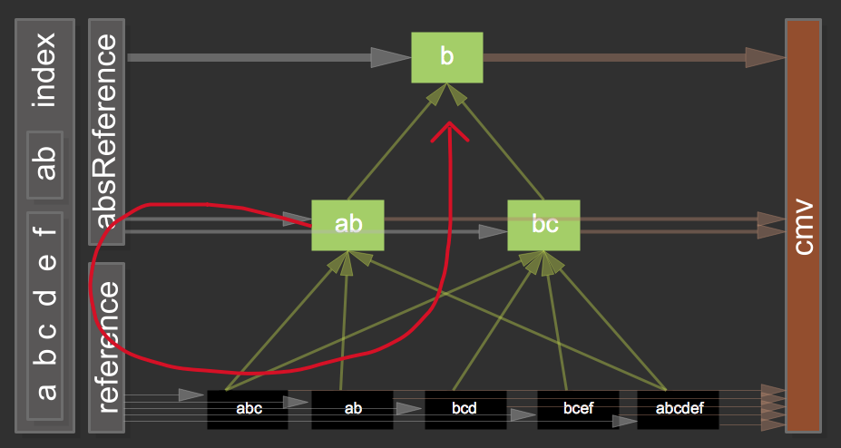
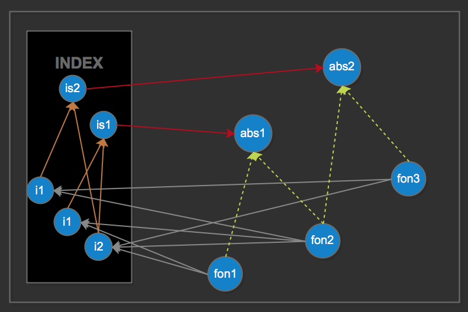
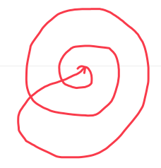
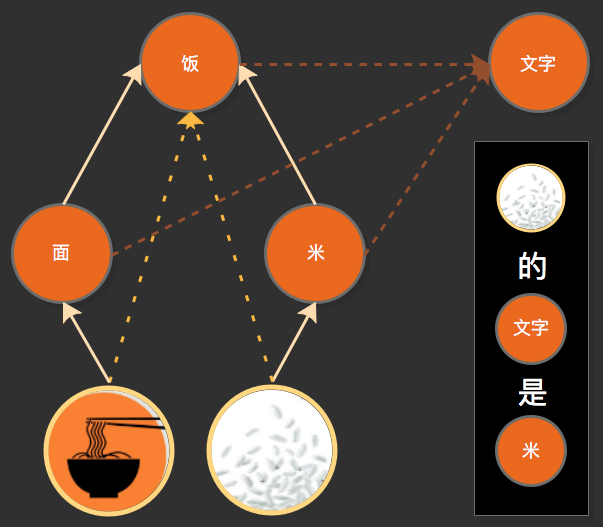
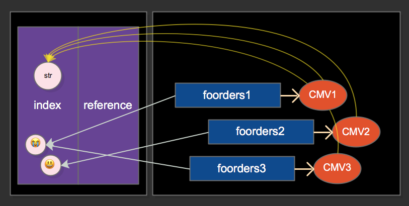

# 相对宏微与循环

> 早在note3时,已有关于后天思维方式(三维架构)的想法,而关于思维方式的思考也未曾断过;
>
> 1. 宏微,看似只有一层,其实没有明确界线,宏微是相对的;
> 2. 并且相对宏微对构建网络,及后天思维有致关重要的作用;
>
> 那么:
> 1. 相对宏微如何影响网络构建呢?
> 2. 如何融入cmv模型?
> 3. 如何被前额叶使用呢?
> 4. 如何与mv融合呢?
> 5. 如何与net融合呢?
> 6. 如何形成后天思维方式呢?
> 7. 思维方式完成后,对smg进行总结与训练;
>
> note13主要面对这些问题而展开;
>
> 注:所有的难题都在"理所当然"中;(所以当以为系统完善时,一定要付诸实践,用现实打破错觉)


***

<!-- TOC depthFrom:1 depthTo:6 withLinks:1 updateOnSave:1 orderedList:0 -->

- [相对宏微与循环](#相对宏微与循环)
	- [n13p1 思考思维方式之相对宏微](#n13p1-思考思维方式之相对宏微)
	- [n13p2 cmvRule](#n13p2-cmvrule)
	- [n13p3 从节点复杂度,思考网络优化](#n13p3-从节点复杂度思考网络优化)
	- [n13p4 output](#n13p4-output)
	- [n13p5 后天思维之thinkFeed](#n13p5-后天思维之thinkfeed)
	- [n13p6 相对宏微之网络改版](#n13p6-相对宏微之网络改版)
	- [n13p7 相对宏微之代码实践](#n13p7-相对宏微之代码实践)
	- [n13p8 smg总结(单流程)](#n13p8-smg总结单流程)
	- [n13p9 output代码实践](#n13p9-output代码实践)
	- [n13p10 mv循环](#n13p10-mv循环)
	- [n13p11 mv循环改版_代码实践](#n13p11-mv循环改版代码实践)
	- [n13p12 下版本_前额叶处理能力](#n13p12-下版本前额叶处理能力)
	- [n13p13 下版本_时序列和cmv基本模型的改版](#n13p13-下版本时序列和cmv基本模型的改版)
	- [n13p14 cmv改版_deltaIndex(+-)](#n13p14-cmv改版deltaindex-)
	- [n13p15 扩展规律](#n13p15-扩展规律)
	- [n13p16 重构思维控制器](#n13p16-重构思维控制器)
	- [n13p17 思维网络循环(中层循环)](#n13p17-思维网络循环中层循环)
	- [n13p18 相对宏微之`先后思`](#n13p18-相对宏微之先后思)
	- [n13p19 思维网络循环(外层循环)](#n13p19-思维网络循环外层循环)
	- [n13p20 下版本_外层循环](#n13p20-下版本外层循环)
	- [Other](#other)

<!-- /TOC -->


<br><br><br><br><br>


## n13p1 思考思维方式之相对宏微
`CreateTime 2018.06.06`

| 思维方式的重要性 >> |
| --- |
| 1. 思维方式是否只是cmv模型,在absNode间的宏观体现 |
| 2. 1种答:如果是则AGI智能体现远超人类,如果否则AGI与人类在同一量级 |
| 3. 2种答:在数据因果复杂度上,可同时分析的信息数是有限的;这个平衡点,制约着智能值; |

<br>

| 宏微界线 >> |
| --- |
| 1. 宏微的界线没有那么明确，每个节点的微信息组,都是微。 |
| 2. 宏微是相对的,(索引与node相对) |
| 3. 宏微是相对的,(类比单位为微，抽象区域为宏。) |

<br>

| 组与分 >> |
| --- |
| 1. 解决集合(组)的问题，而不仅是分。(foOrders为组，absNode为分) |

<br>

| 开发 >> |
| --- |
| 1. shortCache里加上absNode。 |
| 2. shortCache里加上思维log (thinkFeed)。 |

<br>

|  |
| --- |
| 红线:宏信息中的`微信息组`,也作为`微信息`;以指针形式存在absIndex中, |
| 再由,absReference排序其引用强度; |


<br><br><br><br><br>


## n13p2 cmvRule
`CreateTime 2018.06.07`

| 示图 >> |
| --- |
|  |
| `黑: foOrders` `棕: cmv` `灰: reference` `绿: absNode` |

<br>

| 问题 >> |  |
| --- | --- |
| 1 | 充电mv和饥饿状态mv是两个 |
| 2 | 饿了想吃东西,还是想变饱? |
| 3 | 饿状态即urgentValue |

<br>

| 理论 >> |  |
| --- | --- |
| 1 | 一mv两面 (阴阳转化) |
| 2 | 因果 (状态是因,变化是果) |

<br>

| 归纳分类 >> | 痛 | 饿 | 欲 |
| --- | --- | --- | --- |
| urgentValue | 痛感越高越迫切 | 饥饿感越高越迫切 | 越少越迫切 |
| targetType | 消除痛感 | 消除饥饿感 | 变多 |
| 状态 | 疼痛值 | 饥饿值 |  |
| 变化 | 舒服或平静中和痛感 | 充电中和饥饿感 |  |


<br><br><br><br><br>


## n13p3 从节点复杂度,思考网络优化
`CreateTime 2018.06.11`

| 前言 >> |
| --- |
| 1. 集合note12所实践的四序列,思考一下网络结构上有没有可优化简化的地方: |

<br>

|  |
| --- |
| 注: `i=index` `is=indexs` `abs=abstract` `fon=frontOrderNode` |
| 1. foNode: 多对一 `多微信息 对 cmvModel` |
| 2. cmvModel: 一对一 `foNode 对 cmvNode` |
| 3. cmvNode: 一对二 `cmvModel 对 targetType_p和urgentValue_p` |


<br><br><br><br><br>


## n13p4 output
`CreateTime 2018.06.12`

| 行为学习 >> |
| --- |
| 1. 反射输出 |
| 2. 尝试输出 |
| 3. 输出log入网 |
| 4. 运用output网 |

<br>

| 理论步骤 >> |  |  |
| --- | --- | --- |
| 1 | outputAlgs算法层 | 定义了输出算法 |
| 2 | 反射输出 | imv与输出的反射回路 |
| 3 | omv与反射输出入网 |  |
| 4 | 尝试输出 | 决策,上升到后天输出阶段 |
| 5 | 输出入网 | 上升到后天输出的学习阶段 |
| 6 | 运用output网输出 |  |


<br><br><br><br><br>


## n13p5 后天思维之thinkFeed
`CreateTime 2018.06.12`

| 问题 >> |
| --- |
| 1. thinkFeed什么时候被mv带给foNode? |
| 2. 本文思考找到:后天思维的哪部分是规则化,代码化的,流程化的;从而找到思维方式的代码实现方式; |
| 3. 思考是否`组分(相对宏微)`是形成后天思维的先决条件,或唯一条件; |

<br>

| 正文 >> |  |
| --- | --- |
| 1 | thinkFeed只是后天思维的第一步; |
| 2 | 思维解决问题也是构建网络,如 `练题成考神`,`自省使抽象加抽或入cmvModel` |

<br>

| 步骤 >> |  |
| --- | --- |
| 1 | input |
| 2 | noMV |
| 3 | shortCache |
| 4 | assData |
| 5 | thinkFeed |

<br>

| 问题 >> |  |
| --- | --- |
| 1 | thinkFeed应该存哪些指针? 如何分辨抽象知识的整体性? |
|  | 答:在thinking中`新参与类比的`或`新构建的`指针,抽象知识的整体性在网络中; |
| 2 | thinkFeed不应该是序列;而是网络的吗?如何存储使用? |
|  | 答:元素是指针,网络还是在net中; |
| 3 | thinkFeed确定也以cmvModel的方式传输给网络吗?为什么? |
|  | 答:是,因为thinkFeed所指向的absIndex也是微信息,需要与分信息混合传入,以形成自由的组分结构; |
| 4 | 第3如果是,怎么传?与shortCache的区别是什么? |
|  | 答:考虑：1、 shortCache（4-7不区分input和ass） 2、thinkFeed（快速优先检索区） |
| 5 | 感觉缺了些什么,例如:shortCache如果不区分input和ass,那么序列呢?如何排先后; |
|  | 答: shortCache的上升是不需要回头的,其存储的对象向来就是指针,指针指向什么取决于网络;这也符合思维源于网络的特性 (但有个矛盾点是目前的shortCache其实存的是微信息,并非宏信息) |


<br><br><br><br><br>


## n13p6 相对宏微之网络改版
`CreateTime 2018.06.22`

| 简介 >> |
| --- |
| 宏微是相对的,导致原先明确的索引层不再明确;索引必须全面铺开到网络中; |
| 而shortCache的相对宏微,也必然要求shortCache永远只存宏信息; |

<br>

| 正文 >> |  |
| --- | --- |
| 1. 索引改版 | 数据即索引不变,凡网络节点的数据皆索引;无明确的索引层,每层都是其抽象层的索引; |
| 2. shortCache改版 | 关于`识别阶段`与`思维阶段`的shortCache存宏微信息矛盾;将识别阶段也生成宏节点,故shortCache只存宏信息; |

<br>

| 示图 >> |
| --- |
|  |
| 注: 数据索引部分,从分向组方向升级,而升级的依据是网络节点 |
| 注: 网络节点部分,从组向分方向抽象,而抽象的依据是数据规律 |
| 注: 所有的模糊组信息,都由shortCache提供; |

<br>

| 代码实践 >> |  |
| --- | --- |
| 1 | 只需要把shortCache中微信息的装箱操作,再装一步,装到node中; |
| 2 | 索引可还用目前这种,分界还算是特别分明的 |


<br><br><br><br><br>


## n13p7 相对宏微之代码实践
`CreateTime 2018.06.25`

| shortCache >> |  |
| --- | --- |
| 1 | shortCache的所有元素都是微指针 |
| 2 | shortCache的长度是否决定智力 |
| 3 | shortCache决定了cmvModel前因序列的长度,及整个网络的构建过程、结果和复杂度。 |

<br>

| shortCache存哪些微信息 >> |  |
| --- | --- |
| 1 | algsArr_Index; `输入微信息` |
| 2 | absIndex; `抽象微信息` |
| 注 | 所有宏信息的检索,也是构建抽象的过程,或者指向已存在抽象的过程;所以将abs后的absIndex加到shortCache是必然的,以形成螺旋组分; |


<br><br><br><br><br>


## n13p8 smg总结(单流程)
`CreateTime 2018.06.26`

<br>

| 简介 >> |
| --- |
| 1. smg目前的情况,完成相对宏微后,能够实现什么样的智能效果,如何训练及呈现? |
| 2. 本节针对,smg的系统现状,作些训练及智能体现方面的思考; |
| 3. 数据替代运算，抽象数据结构。 |

| 正文 >> |
| --- |
| 1. 设想场景,进行智能训练,如充电; |

<br>

| 进度 >> | 模块 | 完成度(五星) |
| --- | --- | --- |
| 1 | 类比 | `*****` |
| 2 | 宏微 | `*****` |
| 3 | 相对 | `*****` |
| 4 | 规律 | `*****` |
| 5 | 抽象 | `*****` |
| 6 | 网络 | `*****` |
| 7 | mv | `***` |
| 8 | 循环 | `*` |
| 9 | output | `*` |


<br><br><br><br><br>


## n13p9 output代码实践
`CreateTime 2018.06.27`

| 前言 >> |
| --- |
| 1. smg其它部分,已经基本ok; |
| 2. 本节主要针对outputg与output入网的代码实践,而展开 |
| 3. target的解决,依赖于外界; |
| 4. AI必须知道自己能够使用哪些手段与现实交互,例如:`通过字符串调用outputStr算法` `通过显示器显示图片` |

<br>

| 步骤 >> |  |
| --- | --- |
| 1 | 因decision时,没有明确解决方式,导致的挫折感,急切感omv |
| 2 | omv触发反射输出 `表情符` |
| 3 | decision锁定唯一信号时,尝试输出并将输出入网,等待反馈 |
| 注 | 所有输出前,都要入网;以得到反馈与加强 |

<br>

| output入网 >> |
| --- |
| 1. 强化只是 `跑cmv流程时` 导致的自然强化;不需要刻意设计强化反馈流程; |
| 2.  |

<br>

| 问题 >> |  |
| --- | --- |
| 1 | Q:尝试解释,嘴上笑嘻嘻,心里mmp |
|  | A: |
| 2 | Q:决策只是思维对target找到了释放方式? |
|  | A:对 |
| 3 | Q:释放(output)是否需要log到网中; |
|  | A:不仅需要,并且也以类似cmv基本模型的方式进行相对宏微的抽象构建网络; |
| 4 | Q:基础的反射输出 |
|  | A:一切神化的开始 |
| 5 | Q:复杂的输出行为 |
|  | A:对输出行为的相对宏微; |
| 6 | Q:关于decision与output哪个入网? |
|  | A:当时怎么想的不重要,重要的是怎么做的 |
| 7 | Q:除了输入时,inputIndex,是否也有outputIndex呢?哪些能输入,哪些能输出?如何输出? |
|  | A:只有一套Index,输出见收下：必然正确部分 |
| 8 | Q:人类为什么1岁才学会说话呢? |
|  | A: |

<br>

| output入cmvModel必然正确 >> |
| --- |
| 1. 当时调用了某个输出算法 |
| 2. 传了适合输出的某信息 |
| 3. 反射,教会了ai使用某算法; |

<br>

| 思考结果 >> |
| --- |
| 1. output存在cmvModel的时序列里 |
| 2. inputAlgs时是索引微信息, |
| 3. 而outputAlgs时,其索引微信息存的是,`反射算法标识` 和 `输出的信息` |

<br>

| 明日提示 >> | title | desc | status |
| --- | --- | --- | --- |
| 1 | output | omv应激反应输出。 |  |


<br><br><br><br><br>


## n13p10 mv循环
`CreateTime 2018.06.28`

| 简介 >> |
| --- |
| 针对系统的不断完善和变化,本节更新三层循环的代码部分; |
| 数据替代运算，抽象数据结构。 |

<br>

| mv >> | imv | cmv |
| --- | --- | --- |
| 描述 | 状态 | 变化 |
| 功能 | 产生需求 | 构建网络 |
| 形态 | 静 | 动 |
| 变化 | 静生动 | 动生静 |
| 思维 | 激活思维 | 平复思维 |

<br>

| 思考 >> |  |
| --- | --- |
| 1 | 假如,因富足保食,从未饿过,那么还第一次饿的时候,知道要吃东西吗? |
| 2 | 思考:imv状态值,输入如何入网? |
| 3 | 明日提示:写cmvNode的抽象 |

<br>

| 问题 >> |  |
| --- | --- |
| 1 | 写imvCache当前imv状态序列 |
| 2 | 思考:是否可将imvCache与shortCache合为一起? |
|  | 答:目前不需要 `imvCache可以合并到shortCache` |
| 3 | 思考:多个同类型imv,是否需要类比,absImv,然后再只存absImv_p到imvCache? |
|  | 答:需要,是absCmv存cmvCache; |
| 4 | imv是否先入网,指针入imvCache序列? |
|  | 答:imv只是mv的一个状态,另:将imvCache改为cmvCache; |
| 5 | 是否将imv,cmv,omv进入整合,放到cmv基本模型中? |
|  | 答:对,确切说,是将imv和omv整合到cmv中; |
| 注: | 所有cmv只与cacheImv中作匹配 |
| 注: | 所有cmv的匹配,仅对比target和urgent |

<br>

| 仨mv合并 >> |  |
| --- | --- |
| 1 | cmv基本模型需要改进 |
| 2 | 一般感觉(好奇心)作为netRoot时的工作方式 |
| 3 | 假如,在数据网络中,mv与普通节点没有区别,会怎么样? |

<br>

| 必然正确的几个点 >> |
| --- |
| 1. cmv模型中的时序 |
| 2. imv,cmv,omv必然会入网 (imv未必) |
| 3. imv,cmv,omv必然会抽象 (imv可能以抽象去重) |
| 4. imv的target必然与cmv产生对应 |

<br>

| 思考结果 >> |
| --- |
| 1. 只有一个mv,没有imv和omv;(omv只是为了反射平复target), |
| 2. mv模型为: `from a->b` `target b->c` |
| 3. 将absMV_p存到mvCache |
| 4. mvCache的模糊有序,如1.5和1.7同值 `注:随着联想等思维活动,实时更新排序` |


<br><br><br><br><br>


## n13p11 mv循环改版_代码实践
`CreateTime 2018.07.02`

| 步骤 >> |
| --- |
| 1. imv的from和to直接传到thinkingController里去 |
| 2. thinkingController将fromto转成tMv入网并放到mvCache |
| 3. 再次输入imv的fromto时,与mvCache匹配(相顺或相逆); |
| 4. 相顺时(from-to与target一致),转成changeMV,并存cmv基本模型到网络 |
| 5. 相逆时(from-to与target相反),将tMV入网,并合并到mvCache(同需求合并,以最近为主) |
| 注: tMv即urgent和target的mv状态; |
| 注: imv即from和to的mv状态; |
| 注: cmv即在urgent上产生change的mv状态; |

<br>

|  |
| --- |

<br>

| absCmvNode >> |  |
| --- | --- |
| 1 | 问题:什么时候类比并生成delta+-的absCmvNode? |
|  | >> 与类比其它数据一致;同类数据输入类比并抽象;但没有+和-的混处理; |
| 2 | 问题:如何根据一个正值,或负值,来快速的从absIndex中,找到索引地址; |
|  | >> 仍以联想为核心,其它以时序等构建关联;(参考问题6,需实现) |
| 3 | 首次经历充电解决hunger问题,那么smg明确知道delta+和delta-的关系,如何代码表达这种`同异向问题`? |
|  | >> 不表达,这种关系是先天的,只需要根据问题6,解决快速查索引即可; |
| 4 | 还是首次充电,但smg不明确知道充电和没电的关系,怎么解决? |
|  | >> 在cmv基本模型,仅有`充电与delta+` 和 `没电与delta-`的时序关系; |
| 5 | 解决delta+和delta-的对应关系代码表示;(添加到思维控制器同向,或异向处) |
|  | >> 问题有变,见问题6 |
| 6 | 最大的问题是,delta+和delta-到底是先天即知,还是后天关联; |
|  | >> 应该是先天,那么快速的从某个delta变化,来快速从index找到对应信息,成了首要代码实现; |

<br>

| 明日计划 >> | status |
| --- | --- |
| 1. 把fromto改成value和deltaFrom(不过当前不太需要) | T |
| 2. 往checkMV中,加上change的部分,并改cmvNode; | T(已加delta并改了cmvNode) |


<br><br><br><br><br>


## n13p12 下版本_前额叶处理能力
`CreateTime 2018.07.03`

| 时序迭代 >> |
| --- |
| 同理心，可替代其它人或物的mindValue产生cmvModel。 |
| 示例:鸠摩智抓段誉，但乔峰同在时不抓。背后逻辑源于抽象迁移网络。(武力值,六脉神剑等常识和类比) |
| 常识边界:先建立了鸠摩智抓段誉的时序，后才知道原因。但不影响逻辑思考 |


<br><br><br><br><br>


## n13p13 下版本_时序列和cmv基本模型的改版
`CreateTime 2018.07.06`

| 怀疑和猜想 >> |
| --- |
| 1. 猜想:情景记忆是独立的小网络的可能性。 |
| 2. 怀疑:cmv基本模型是否只是时序列;所有cmvNode也应加入到时序列中; |
| 3. 睡眠时:GC工作; |
| 4. 抽象时,对mv和其它微信息,采取完全不同的抽象方式;前者采用`值交集`,后者采用`信息交集` |
| 5. mv输入时,只是状态值;而不是delta和to; |


<br><br><br><br><br>


## n13p14 cmv改版_deltaIndex(+-)
`CreateTime 2018.07.06`

| 前言 >> |  |
| --- | --- |
| 标题 | mv的索引,与微信息的索引是存在不同的 |
| 区别 | 微信息是为了快速找到相对应的信息与节点,而mv则是快速找到与其相关的+-等情况; |
| 目标 | 本节尝试重写mv的索引,并完美与原先代码不冲突的融合; |

<br>

```java
//名词说明:
> 1. mvIndex: 与Index索引序列同级,是mv相关的索引序列 (也是`值范围`索引)
> 2. deltaIndex: 目前不想有太大改动,所以先用deltaIndex来在原先index上,再索引一层delta变化;

```

<br>

| 思考前 >> |
| --- |
| 1. absCmvIndex是+-，以delta抽象，可尝试模糊下。用（区间包含）的规律，例如: |
| > a. 具象方向：+10也是+9及以下。 |
| > b. 抽象方向：+1包含+1以上所有。 |

<br>

| 思考方案1 >> |  |
| --- | --- |
| 介绍 | 先实现+-的需求,与当前的index和reference配合使用,随后版本迭代,再简化设计 |
| 1 | 写个deltaIndex来解决值索引问题; |
| 2 | 每次存index时,判断下是mv的话,自动加到deltaIndex序列中 `(从+到-有序)` |
|  |  |
| 疑问 | mv的delta匹配虽然重要,但附加数据的综合思考也重要; |
| 例如 | 在公司想家里的厨房,是解决不了饥饿问题的;这种缩小范围的能力,非常重要 |

```java
//本节作废:
> 1，从情景出发，找到解决mv的办法。
> 2，即从网络解决一切问题，而不是从索引直接找deltaMv。
> 3，mv只为起点和终点负责，不对过程负责。

```

<br>

```java
//特别注意:
> 1. 只有思维控制器自动化找delta+-时，才使用它。其它的还是使用网络和联想。

```

<br>

| 明日计划 >> | status |
| --- | --- |
| 1. 在thinking中,类比(同向替换,异向抵消)时,生成absCmvNode |  |
| 2. 实现快速根据delta+或-,从index找到相对应的pointer; | 废弃 |
| 3. 根据delta+或-的经历,快速实现absDeltaIndex的最小单位`+-1`构建; | 废弃 |
| 4. 写mindValueRule,配合mvIndex工作; |  |


<br><br><br><br><br>


## n13p15 扩展规律
`CreateTime 2018.07.09`

| 前言 >> |
| --- |
| 类比信息,不仅类比是否相同,还要类比位置;非同位规律->组抽象;同位规律->相等抽象;(相等,同继承,继承) |
| 1. 同信息`组` 2. 同位`占位` 3. 同义不同信息`同义` |

<br>

| 步骤 >> |
| --- |
| 1. 从饥饿与`吃类?` 和 `吃奶?`中抽象到组抽象:`吃`; |
| 2. 从 `吃` 的输出,到解决饥饿问题,网络变为:`吃` 是请求食物 |
| 3. 再从`吃奶` 和 `冲奶` 中抽象到组抽象:`奶`; |
| 4. 从 `奶` 的输出,到解决饥饿问题,网络变为:`奶` 是请求食物 |
| 5. 此时,`吃` 和 `奶` 是同义规律 |
| 6. 再从 `吃面` 和 `吃奶` 中抽象到占位规律:`吃{x}` |
| 7. 此时,`面` 和 `奶` 为同占位:`食物`; |

<br>

| 组规律 | `一` |
| --- | --- |
| 简介 | 指时序列中,类比到sames;并将相同`微信息`进行抽象的方式 |
| 组抽象 | 同类信息发现规律,为组抽象 |
| 例如 | abc,abd抽象即:`ab` |

<br>

| 占位规律 >> | `是` |
| --- | --- |
| 简介 | Ab,Ac,Ad那么bcd出现在同占位的规律，这仨应被抽象为A{x}; |
|  | 不同信息,发现"同占位"规律后,为"是"抽象; |
| 例如 | 吃东西。吃苹果,吃桃;那么`东西`是`苹果`和`桃`的点位; |
|  |  |

<br>

| 同义规律 >> | `同` |
| --- | --- |
| 简介 | 即`意义`相同,但微信息不同;同义不同信息的规律抽象; `苹果,果的` |
| ? | 非同位->组抽象;同位规律->相等抽象;(相等,同继承,继承) |


<br><br><br><br><br>


## n13p16 重构思维控制器
`CreateTime 2018.07.09`

|  | 废弃deltaIndex >> |
| --- | --- |
| 1 | 从网络出发,找出解决hunger问题的最强引用 |
|  | 如:饿了,从抽象层知道,应该找吃的 |
| 2 | 缩小范围,收集当前信息,并以此为索引,找食物 |
|  | 如:从具象层,分析当前情况下(`所属位置如:家`)的食物在哪里找到。 |

<br>

| 疑问 >> |  |
| --- | --- |
| 1 | 到底该不该有absMVNode? |
|  | 如果有,是否仅仅是代码写死的delta+-1; |
|  | 如果没有,那么`时序列`的抽象如何整合到`cmv基本模型`中? |
| 2 | 为了与`时序列`保持,网络结构上的融洽,`mv`是不是也应当有最简单的抽象?如+-1 |
|  | 同意 |
| 3 | +-索引,是不是不需要原先index和reference的设计那么复杂? |
|  | 对,因仅有一个+和-,所以无需引用序列和索引序列,仅需存储一个序列,将所有类型的mv的+和-的节点地址,以有序的方式存入; |
| 4 | 疑问2,是否可以(在时序列抽象后的层,应该脱离cmvNode)? |
|  | 不可以,如下图: |
|  |  |

<br>

| 明日计划 >> | status |
| --- | --- |
| 1. 写directionReference(只有最基本的+-抽象) | T |
| 2. 写CmvIndex | T |
| 3. 写首次输入cmv时,即引用directionReference |  |
| 4. 联想以往解决时,都发生了什么,尝试复现;(决策与解决需求) |  |
| 5. 联想到同样经历的mv时,尝试抽象出absCMVNode;(类比cmv与抽象) |  |
| 6. 去掉所有的absNode和absCmvNode;而只抽象`cmv基本模型`来替代; |  |


<br><br><br><br><br>


## n13p17 思维网络循环(中层循环)
`CreateTime 2018.07.13`

| 简介 >> |
| --- |
| 从mv循环到(mv顺逆向)的处理,单轮中层循环完成; |
| 本节要解决的是多轮循环;而其源动力是cmv.urgentTo; |

<br>

| 正文 >> |
| --- |
| 1. 在thinkingControl中定义energy字段,并动态更新; |
| 2. 决策中,触发一些cmvCache在排序上的变化;(如饿了,去超市买菜还是去饭店的问题)`见n14p2` |
| 3. cmvCache中,未必存的绝对是cmv;很多demand都是复合的(如我6点早餐也许只是习惯,未必是真饿了) |
| 4. cmvCache中,需要一个自定义的model,并且为该序列需要的功能定制; |

<br>

| 明日计划 >> | status |
| --- | --- |
| 1. 将urgentTo转换成能量值; | T |
| 2. 推进多轮循环thinking_Loop方法; | `见n14p2` |
| 3. 写cmvCacheModel替代麻烦且功能支撑不全面的array[@urgentTo,@delta] | T |


<br><br><br><br><br>


## n13p18 相对宏微之`先后思`
`CreateTime 2018.07.16`

| 简介 >> |
| --- |
| 名词. 先天思维=`先思`; 后天思维=`后思` |
| 1. 先思抽象与后思抽象是不同的。先思时序与后思逻辑也是不同的。 |
| 2. 文字或语言等思维方式让动物获得更加复杂的后天抽象。 |
| 3. 属性`是`，和抽象`是`，可以是同一种表示方式。 |

<br>

| 问题 >> |  |
| --- | --- |
| Q1: | 先后思抽象与知识表示的不同与接洽处理。 |
|  |  |
| Q2: | A车是B的，这种属性值关系如何呈现在目前的抽象网络中。 |
|  |  |
| Q3: | 代码与思维:很多不经意间的思维,看似是写死的,但却可以因刻意而改变; |
| A3: | 这是看似思维凌驾于代码之上的假象,思维仅仅只是通过网络定向检索等操作,作了些代码作不到的事 |


<br>

|  |
| --- |
| 1. `这颗的名字是大米` `今天吃的饭是面` 等等"是"抽象;(占位规律) |


<br><br><br><br><br>


## n13p19 思维网络循环(外层循环)
`CreateTime 2018.07.17`

| 前言 >> |
| --- |
| 本节重点思考在thinkingControl中决策与输出的实践与重构; |
| 注:在smg的初版中,仅支持最简单的output,小脑网络型输出在今后版本中完善; |

<br>

| 正文 >> |  |
| --- | --- |
| 1 | 当联想到解决经验时,检查以下两点: |
|  | a. 检查order_p是否是"输出"; |
|  | b. 检查order_p是否可以"被输出"; |
| 2 | 如果以上不成立: |
|  | a. 生成"心急mv",并通过反射输出; |
|  | b. 将反射输出,记录log到foOrders; |
| 3 | 输出也要输入,(输出前都是想法,输出后才是现实) |
|  | a. 那么,我们需要区分"输出与输入"吗? |
|  | b. 那么,思维内存只有`输入`与`思维流`; |
|  | c. 假如没有输出记忆,那么如何知道是某行为导致了某cmv呢? |
| 4 | output不转为input。 |


```
1，简单定义一个outputModel。
2，输出算法outputAlgs
3，函数指针，
4，输出参数。（内容）
//[NSObject invocationMethodName:@"outText:" className:@"Output" withObjects:@[@"😭"]];
```

| 步骤 >> |
| --- |
| 1. "心急"的哭反射输出; |
| 2. "满足"的笑反射输出; |
| 3. 类比到"字符串类型"输出; |

<br>

| `从反射输出到明确输出` & `outputReference` 示图 >> |
| --- |
|  |
| 注: 对于输出的参数类型,`如笑,哭`;默认可抽象出`类型`索引; |
| 注: 如图中的`笑`抽象到`String` |

<br>

| 明日计划 >> | status |
| --- | --- |
| 1. 写outputIndex和outputReference | T |
| 2. 重构OutKVPointer指针 `dataTo算法名` | T |
| 3. bug(indexReference只按指针排序,未按引用强度;) |  |
| 4. bug(directionReference按指针去重,却按引用强度插入,导致去重经常失效) |  |
| 5. 写可输出微信息的判断,和输出微信息; | T |
| 6. 写absMvNode (基于cmv基本模型写...) | T |
| 7. 写commitOutputLog:入网; | T |
| 8. AINetAbsIndex中,不能只存pointerIds;因为abs的分区标识是会变化的 |  |
| 9. >>此处改为抽象整个cmv基本模型,`或简化成absNode对absMVNode` `优先开发` | T |
| 10. 主动取当前饥饿状态;`或:在需求形成时,用状态主动判断有效性;` |  |
| 11. 继续写energy,让思维网络多次循环跑起来; |  |
| 12. >>> HavDemand优先联想到应该是前因序列的强度排序;而非cmvNode |  |
| 13. havDemand中,扩展对out_p的支持; |  |


<br><br><br><br><br>


## n13p20 下版本
`CreateTime 2018.07.23`

| 外层循环_output >> |  |
| --- | --- |
| 可输出判断: | 不能只用dataTo和algsType判断,还应以网络后天抽象节点判断来判断; |
| 不可输出数组: | out是不能以数组处理foNode.orders_p的,下版本改) |

| 思维控制器 >> |  |
| --- | --- |
| 1. 意识流 | "思维流thinkFeedCache" 可以考虑在下一版再开发; |
| 2. 扩展规律 | 按着n13p15的方式给smg扩展规律 |
| 3. 思维活跃度 | cAssDataLimit值的动态变化 |
| 4. 反射反应 | 大声说与怒气的反射。 |
| 5. 好奇心 | 网络中某个节点意义的疑问。 |
| 6. 轻活跃mv | 形成知识的断续获取。(或许不需要) |
| 7. 扩展音频 | 和音频文字不同分区出现信息的规律。 |
| 8. 思维解耦 | dataIn联想后,只加到energy和cmvCache中,energy的活跃自行决定是否执行cmvCache中哪个demand; |
| 9. 思维控制器 | 尝试真正使用网络的方式,来重写思维控制器;(一种更新的编程方式) |
| 10. cmvCache | 扩展长期mv的支持,可以对长期任务作出规划和决策等等思维活动 |
| 11. 决策预测 | 给决策加上预测功能,使loopManager的可变性,更加灵活 |
| 12. 冥想 | dataIn_assData可以产生abs;`条件:必须是两个cmvModel间的类比` |
| 13. 决定干啥 | dataOut_AssConData可以影响到LoopModel.order并实时刷新Demand序列; |
| 14. 同理心 | 可以从观察别人得到某物质,而同理心思考得到物质的方法; |
| 15. 主观决策 | 主观意志,可以影响score,并影响到决策的结果;及expModel数量,决策的整个过程; |
| 16. output_p | absNode中,index中,都要保留outLog标记 |

| 网络可视化项目 >> |
| --- |
| 1. 搜哪显示哪; |
| 2. 显示哪搜哪; |
| 3. 随热点显示; |
| 4. 指定焦点的方向显示; |

<br><br><br><br><br>


## Other

| toDo >> | task | status |
| --- | --- | --- |
| 1 | 删除absNode下的refs_p, | T |
| 2 | 创建absReference | 复用indexReference |
| 3 | 测试absNode的index和reference; | T |
| 4 | 思考absPort和conPort的n对n关系; `太过复杂的关系,是否影响其它,或者造成性能问题` `如果要简化为1对n关系,那应该如何优化网络` `思: n对n关系,说明一个问题,就是要么多了关联,要么少了节点;` | 问题升级,参:n13p3 |
| 5 | 关于cmvModel的:orders,foNode,cmvNode四者分开,还是哪些到一起? | T |
| 6 | 把时序列类比的sames也改成时序的。(避免逻辑混乱) dataIn是流式输入;sames也是基于当前输入信号与shortCache已有信号,可进行组合检索的; |  |
| 7 | 完善thinking中无mv的assData流程; |  |
| 8 | noMV的dataIn流程,在联想后,依然noMV,但联想的结果要入到cacheThinkFeed里; |  |
| 9 | 将pointer,缓存,port,等封装一下,使用时更简单些;代码也更易读些; |  |


<br><br><br><br><br>
