# 小鸟生存演示2-MOL/行为化/迭代输入

***

<!-- TOC -->

- [小鸟生存演示2-MOL/行为化/迭代输入](#%E5%B0%8F%E9%B8%9F%E7%94%9F%E5%AD%98%E6%BC%94%E7%A4%BA2-mol%E8%A1%8C%E4%B8%BA%E5%8C%96%E8%BF%AD%E4%BB%A3%E8%BE%93%E5%85%A5)
  - [n16p1 内类比中mv基本模型的支持](#n16p1-%E5%86%85%E7%B1%BB%E6%AF%94%E4%B8%ADmv%E5%9F%BA%E6%9C%AC%E6%A8%A1%E5%9E%8B%E7%9A%84%E6%94%AF%E6%8C%81)
  - [n16p2 实与虚2](#n16p2-%E5%AE%9E%E4%B8%8E%E8%99%9A2)
  - [n16p3 内类比迭代之祖母的嵌套](#n16p3-%E5%86%85%E7%B1%BB%E6%AF%94%E8%BF%AD%E4%BB%A3%E4%B9%8B%E7%A5%96%E6%AF%8D%E7%9A%84%E5%B5%8C%E5%A5%97)
  - [n16p4 继续写AlgScheme-行为化](#n16p4-%E7%BB%A7%E7%BB%AD%E5%86%99algscheme-%E8%A1%8C%E4%B8%BA%E5%8C%96)
  - [n16p5 继续迭代决策循环](#n16p5-%E7%BB%A7%E7%BB%AD%E8%BF%AD%E4%BB%A3%E5%86%B3%E7%AD%96%E5%BE%AA%E7%8E%AF)
  - [n16p6 场景视觉](#n16p6-%E5%9C%BA%E6%99%AF%E8%A7%86%E8%A7%89)
  - [n16p7 迭代思维控制器支持场景视觉](#n16p7-%E8%BF%AD%E4%BB%A3%E6%80%9D%E7%BB%B4%E6%8E%A7%E5%88%B6%E5%99%A8%E6%94%AF%E6%8C%81%E5%9C%BA%E6%99%AF%E8%A7%86%E8%A7%89)
  - [n16p8 v1.1测试与细节完善](#n16p8-v11%E6%B5%8B%E8%AF%95%E4%B8%8E%E7%BB%86%E8%8A%82%E5%AE%8C%E5%96%84)
  - [n16p9 v1.1性能优化](#n16p9-v11%E6%80%A7%E8%83%BD%E4%BC%98%E5%8C%96)
  - [n16p10 训练](#n16p10-%E8%AE%AD%E7%BB%83)
  - [n16p11 意识流双序列-内存网络](#n16p11-%E6%84%8F%E8%AF%86%E6%B5%81%E5%8F%8C%E5%BA%8F%E5%88%97-%E5%86%85%E5%AD%98%E7%BD%91%E7%BB%9C)
  - [n16p12 内存网络的转移](#n16p12-%E5%86%85%E5%AD%98%E7%BD%91%E7%BB%9C%E7%9A%84%E8%BD%AC%E7%A7%BB)
  - [n16p13 内存网络的使用](#n16p13-%E5%86%85%E5%AD%98%E7%BD%91%E7%BB%9C%E7%9A%84%E4%BD%BF%E7%94%A8)
  - [n16p14 训练2](#n16p14-%E8%AE%AD%E7%BB%832)
  - [n16p15 神经网络可视化v2.0之图形可视化](#n16p15-%E7%A5%9E%E7%BB%8F%E7%BD%91%E7%BB%9C%E5%8F%AF%E8%A7%86%E5%8C%96v20%E4%B9%8B%E5%9B%BE%E5%BD%A2%E5%8F%AF%E8%A7%86%E5%8C%96)
  - [TODOLIST](#todolist)

<!-- /TOC -->

***

## n16p1 内类比中mv基本模型的支持
`CreateTime 2019.03.22`

> 内类比中,所有构建的fo亦需遵守mv基本模型 (`fo<=>mv互指向`);

| mv在he中的流程简图 >> |
| --- |
|  |
| 1. 分布在全网的网络强度为静; |
| 2. 作为指引的mv节点为动; |
| Q: 意识流双序列中,强度序列本由mv的动转静转化而来,那么时间序列是否受mv影响? |
| 注: 关于mv影响关联强度,参考17年10月文:[《he4o神经网络》](https://zhuanlan.zhihu.com/p/30320128) |

| absMv的融合方式 >> |
| --- |
| **值的融合 >>** |
| > `mv中以迫切度和delta数来表示信息,所以可以通过简单的计算来融合;如下两种:` |
| 1. 求和平均 `将采用` |
| 2. 相对取小 `正采用` |
|  |
| **标识的融合 >>** |
| 1. 当conMvArr抽象absMv时,所有具象arr中,标识一致则继用,不一致,则用"mvNone"标识; |

| 求和平均 >> |
| --- |
| 1. 关联强度决定,mv融合时的比重系数; (暂不实现) |
| 2. 采用原因: 因为内类比的联想以"动微信息"为源,所以会导致mv有正有负;取min则容易导致,所有absMv皆为负情绪; |
| 如: (aMv=2 & bMv=1) = 融合后为1.5; |
| 如: (aMv=3 & bMv=0 & a强度=2 b强度=1) = 融合后为2; |
| 注: 关联强度的运算方式: 如aMv将被抽象,他的强度为aMv.conPorts中前3位的strong求平均; |
| 注: 第1条暂不实现原因: 我们目前都以计数器方式在做,改动较大,以后再改; |


<br><br><br><br><br>

## n16p2 实与虚2
`CreateTime 2019.03.26`

| 前言 >> |
| --- |
| 1. 在note15中,我们得到最具象即真实,但有时最具象还未存在,需要去寻找; |
| 2. 此时我们需要借助fo来联想查找之; |

| 简介 >> |
| --- |
| 1. 我们需要让小鸟知道树会掉坚果; (带皮) |

| 得到真实坚果的方法 >> | 选用 |
| --- | --- |
| 方法1. 祖母中,先抽象,后最具象,找到坚果; | 75% |
| 方法2. 先微信息,再局部匹配不同的坚果; | 5% |
| 方法3. 先时序,doChange找到坚果出现的时序; (可解决,最具象需要寻找) | 80% |

> ###### 坚果的发现步骤:
> 1. 对于`坚果祖母`的引用,可以联想到抽象的fo;
> 2. 从此抽象fo中,可以得到`坚果树`->`坚果`的时序;
>
> ###### 饭的发现步骤:
> 1. 对于`饭`的引用,可以联想到抽象的fo;(做饭)
> 2. 从此抽象fo中,可以得到`做`->`饭`的时序;
>
> ###### 问题:
> 1. 有些真实源于寻找或创造(fo),有些源于大脑(alg最具象);
> 2. 我们是否可以脱离了fo而找到真实的祖母?

| 深入思考 >> |  |
| --- | --- |
| 图1 | 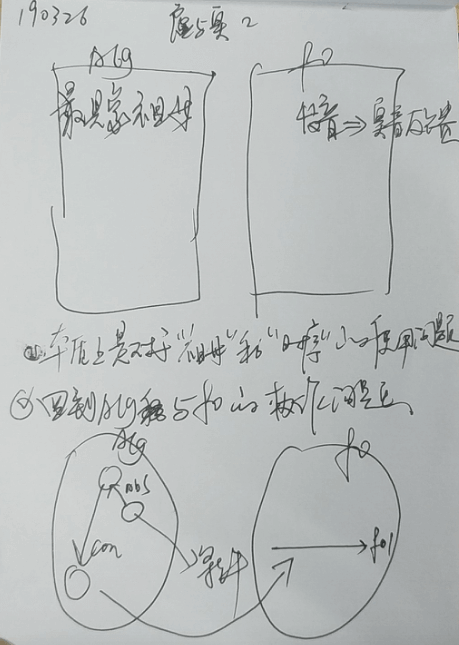 |
| 解析 | 虚实与本质上是祖母与时序的协作问题; |
|  |  |
| 图2 | 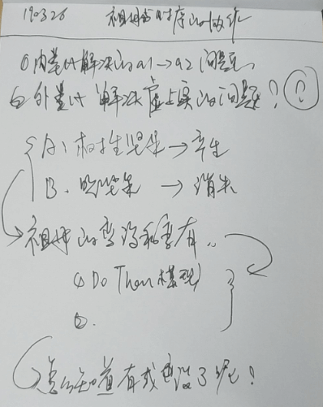 |
| 解析 | 本质上是虚与实的动->祖母的 `产生` 与 `消失` 问题; |
| 解析2 | 在时序中,A->B->C,前面导致后面,B在A后产生,又在C前消失; |
| 解析3 | 所以,产生与消失是伪命题,解决了mv即为实; |
| 例如: | 信宗教的人,念阿弥陀佛解决了心理问题,会认为佛教有用; |
|  |  |
| 矛盾点: | 我们不能吃昨天的饭; (最具象被消费掉) |
| 矛盾解析: | 我们可以固定去工具箱拿剪刀,每次如此,尽管每次都拿走了; |
| 结果 | 结果见下表; |

| 思考结果 >> |  |
| --- | --- |
| TITLE | 虚与实,在于he自己愿意相信它为实,或虚; |
| DESC | 虚与实是伪命题,本质是mv的反馈强化学习,在决策中作用于评价; |
| 新问题 | 为什么在`吃->坚果`中,`吃`没有导致出现`坚果`; |
|  | 而`做->饭`,`做`却导致出现`饭`; |
|  | `吃饭` 和 `做饭` 的区别; |
| 新问题2 | mv的反馈强化能否融入到mv基本模型,是否有什么异同? |
| A2 | 此问题与本题无关; |
| 新问题3 | 是否需要对外类比进行迭代,以更好的支撑决策? |

| 解决方案1 >> | `做饭` 和 `吃饭` 的区别问题 |
| --- | --- |
|  | **祖母的嵌套,比如:空间中有坚果** |
| 1说明 | 此时,在内类比中,子祖母作为微信息的变化; |
| 1分析 | 要想类比,必然有信息可比,饭的子信息是缺失的,那么,找父信息,如何确定父祖母呢? -> 如:`做饭`,`说话` ->`转至n16p3` |
| 结果 | 采用,嵌套本质是信息嵌套,祖母嵌套,与空间无关; |

| 解决方案2 | **`A->B->C`时序,前导致后;** |
| --- | --- |
| 2说明 | 每一个元素都在前一个后`出现`,且在后一个前`消失` |
| 2结果 | 错误,吃饭并没有导致饭出现; |
| 2说明 | 前导致后,但后一直存在; |
| 结果 | 方案2废弃,因为跑题; |

| 解决方案3 | **空壳祖母 & 实壳祖母** |
| --- | --- |
| 3说明 | 0信息,本身也是信息; |
| 3采用问题 | 如果采用了祖母嵌套,那么无需要再采用空壳祖母 |
| 结果 | 方案3废弃,因为有了更加正确的祖母嵌套方案; |

| 解决方案4 | **内类比扩展 + 抽具象实现祖母嵌套** |
| --- | --- |
| 4说明 | 将微信息的不同数扩展为n个,并支持祖母嵌套中,祖母的消失变化; |
| 4Q | 祖母嵌套是否需要支持`主动视觉`呢? |
| A | 如果,可以将坚果与皮识别为嵌套两个祖母;那就不用主动视觉; |
| 4问题 | 是否抽象具象,可以替代祖母嵌套呢? |
| A | 实质上是,具象中的values中,应该不应该以相同的祖母来替换那部分信息量;如:`a3=(a,b,c)`那么`a,b,c,d`节点,用不用改为`a3,d` |
| A | 所以,理论上,这一块应该被替换,采用率90% |
| 结果 | 采用,先祖母嵌套,后内类比扩展进行支持;详情转`n16p3` |

> 问题: 为什么眼见为实?
> * 正向反馈,愿意相信眼见为实;

> 换个方向: `absFo吃饭` 的具象时序 `con1做饭吃`/`con2买饭吃`;
> * 正向反馈,愿意相信,做饭能吃饱;


> #### 方案2: 祖母的嵌套方案 >>
> 原则:
> 1. 我们要尽量将祖母嵌套问题,作为一个系统性的问题,来自然而然的过程;
> 2. 比如: 思维控制器,在构建时,则具有此嵌套结构;
> 3. 要通过几个实例的内省,来互相印证一下,提高此方案的可信度;
> 4. 在认知升级,组分循环中,又有多少微信息可以独当一面呢?几乎都是祖母吧;
> 5. 隐性的场景,***祖母中不注意到的信息;***
> 5. 嵌套非强制,所以此方案***作废***;

| 如何嵌套的确定父信息 >> |
| --- |
| 1. 将`没饭的厨房` 做成 `有饭的厨房`; |
| 2. `祖母的嵌套` 能解决所有的 `虚与实` 的问题吗? |
| 如: `厨房做饭` `公司点外卖` `饭店买饭` `在家吃饭` `等午饭` |
| 白话描述: 在 `xx` 出现了 `xx` |
| 如:在`周围`出现了声音,在`厨房`做出了饭,在`那儿`掉下了坚果; |

> #### 4. 内类比扩展
> 1. 坚果 + 皮 = 2个祖母嵌套;
> 2. 当汽车给坚果去皮 -> 内类比,发现 `皮` 消失;


<br><br><br><br><br>


## n16p3 内类比迭代之祖母的嵌套
`CreateTime 2019.03.29`

> 1. 描述：实与虚的问题,最终变成了祖母嵌套的问题;
> 2. 本质：其实本质上是类比构建`祖母的有和无`;
> 3. 白话：说白了,是物质欲望的问题;
> 4. 实践：此处通过网络结构与mv基本模型,来表达出了物质欲望的成因与作用;

| 内类比迭代之祖母的嵌套 >> |
| --- |
| 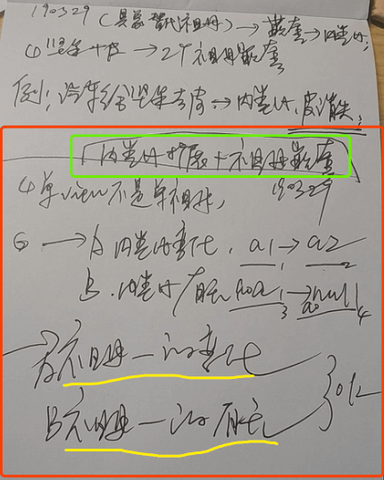 |
| 1. 原本内类比仅支持是祖母的变化,而有了祖母嵌套,可支持`祖母的有无`; |
| 2. 变化公式为:`a1->a2` 得出 `1-2变大` |
| 3. 有无公式为:`algA(a0a1)->algB(a0null)` 得出 `a1消失` |
| 有无白话描述：一个由坚果肉和皮组成的祖母,当变为无皮坚果时,我们会认为皮不见了; |

| 祖母嵌套所导致的问题 >> |
| --- |
| 1. 视觉惯性与思维固化; |
| 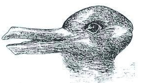 |
| 解释1: 当从类似上图上,我们看到兔子时,下次会再惯性看到兔子; |
| 解释2: 类似,其它视觉之外的思维,也是如此; |

| 代码步骤 >> |  |
| --- | --- |
| 1 | 构建抽象祖母时,将absAlg的pointer替换到conA和conB中的相应values处; |
| 2 | 内类比中,扩展支持values中,abs_p类型的类比(即有和无) |
| 3 | 构建相关的:`有无祖母`,`导致有无的时序`等,参考下表 |

| 有无祖母构建表 >> |
| --- |
| 1. 将`有无祖母`的值,采用cLess表示无,cGreater表示有; |
| tips: 尝试将`有无祖母`与`变化祖母`使用同一处理方式; |
| TODO: 去代码中,检查alg采用的标识,(建议采用自增唯一标识符); |

> **变化:** 使用同一标识下,值的变化,来类比;  
> **有无:** 使用(祖母标识)下,关于类比时的,标识判定问题?是否需要标识相同?  

* Q1: 内类比有无时,需要标识一致吗?  
  - A1: 不限于标识,对其values进行类比; (限values中微信息的标识);


* Q2: 祖母嵌套的根,根是什么?这个模糊的根需要做什么处理吗?不会影响各正常功能吧?
  - A2: 从模糊的根部,其实我们也得不到抽象之外什么有效的东西;所以,不必处理,不会影响;


* Q3: 为什么抽象祖母时,abs_p要替换到conA的相应values处?
  - A3: 因为思维必然要构建,要么就采用此方案,要么构建一个`v1v2a3`这样的中间祖母,上抽象指向`a3`,下具象指向`v1v2v3`;


* Q4: `有无祖母`如何知识表示?
  - A4: 可以由cHav和cNone来表示有和无;

| 有无的构建和知识表示 >> |
| --- |
| 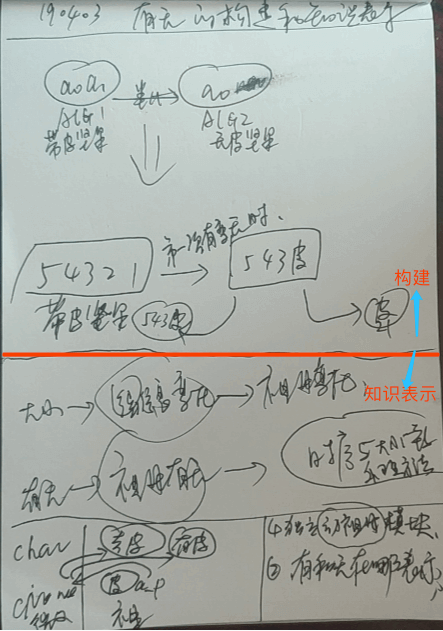 |
| 1. 构建部分,暂放一放,因为依赖知识表示部分的解决; |
| 2. 知识表示: |
| > 知识表示难点: `有`和`无`在哪表示; |
| >> 难点解决解决: 采用与`cLessGreater同样的方法`: 当我们联想到algA,找他的cHav问题时,想根据algA_p和cHav找到微信息,然后找引用祖母,此时,此祖母就是algA为实的祖母;然后此cHavAlgA与algA抽具象关联着; |
| > 知识表示方案: 独立`动祖母`模块; |
| >> 此方案,在以后版本中,再使用,此时虽正确,但时机不够成熟; |

| 有无的知识表示与构建步骤示图 >> |
| --- |
| 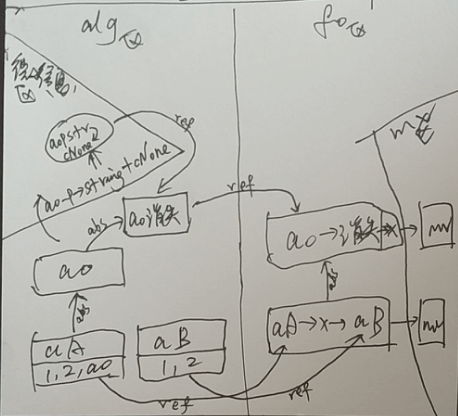 |
| 说明: 四个区: `微信息区`,`分为alg区`,`fo区`,`mv区`; |
| 1. aA祖母中,a0抽象时的嵌套,即将a0_p替换到aA的values中; |
| 2. 构建流程从`aA->x->aB`的内类比发现`a0消失`开始; |
| 3. 微信息中,以a0的指针转字符串: `a0_p.str为标识` + `cNone为值`; |
| 注: 图中abs为抽象关联,ref为引用关联; |

| QA >> |
| --- |
| **Q1: 在内类比中,支持多个微信息的不同;** |
| A1: 目前不需要; |
| **Q2: 非连续微信息的嵌套问题,如`a,b,c,d,e,f,g`类比`a,b,w,d,e`;** |
| A2:目前祖母外类比,仅支持非连续的单一sames结果,所以不存在多个的问题,absAlg(abef),conAlgA(abef,w)和conAlgB(abef,c,d,g); |
| **Q3: 是否可废弃祖母嵌套?** |
| A3:99%否; |
| **Q4: 因为...所以...的嵌套问题** |
| A4:用时序解决; |


```java
//内类比中祖母的无 >>
1. 时序(Alg1 Alg2 Alg3)
2. Alg1(1,2,3,Alg4)
3. Alg3(1,2,3)

>> 结果: 在时序中,从Alg1到Alg3中,Alg2导致了Alg4的消失)
```

| 祖母A变成祖母B示图 >> |
| --- |
| 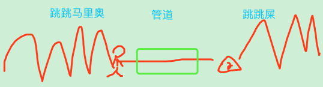 |
| 1. 马里奥进入管道,后变成一坨屎; |
| 2. 我们通过时序内类比,发现了马里奥变屎,并抽象; |
| 3. 抽象信息方面:`我们会认为这坨屎成为玩家;` |
| 4. 具象信息方面:`这坨屎会跳的话,我们不会奇怪;` |


<br><br><br><br><br>


## n16p4 继续写AlgScheme-行为化
`CreateTime 2019.04.11`

> 以上已解决`大`,`小`,`有`,`无`的问题,所以此处回归到决策循环,继续从algScheme来解决祖母的判定,和最终输出到actionScheme行为;

| 代码步骤 >> | (发现->距离->飞行) |
| --- | --- |
| 1. | 找到坚果,由有无时序来解决"有无"问题; `cNone,cHav` (有无) |
| 2. | 找到的坚果与fo中进行类比; `找出距离不同,或带皮的不同` `cLess,cGreater` (变化) |
| 3. | 将距离与带皮转化成行为,条件的行为化; `如飞行,或去皮` `actionScheme` (行为) |

| FoT模型 >> |
| --- |
| 简介: fo时序模型已不足以支撑所有时序的情况,也不够简单 (微观最简时序); |
| 1. 新模型: FromOrderTo (FoT时序变化模型); |
| 2. 含`变化模型`,`有无模型`,`mv基本模型`,都可以由此模型兼容; |
| 3. 公式为: `cFront->order->cTo`; |
| 4. FoT模型由fo模型/DoChange模型演化而来; |
| 5. 目前仅支持rangeOrder.size() == 1,的使用; (随后再放开更多) |
| 6. 新模型用来兼容所有从类比中,发现的各种时序; |
| TODO: 考虑将mv基本模型,统一为:`cHav->orders->cNone`的模型; |
| PS: 其中中间的orders为rangeOrders; |

| 祖母行为化示图 >> |
| --- |
| 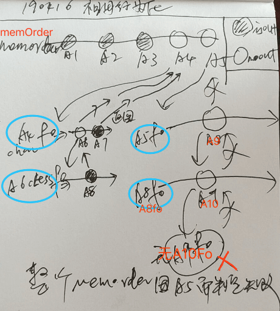 |
| 1. 以memOrder为起点,其中A4,A5为需行为化的两个祖母; |
| 2. A4找到A4fo,由`A6->A7`实现,且A7是isOut类型; |
| 3. A6找到A6fo,由A8实现,此时将A8返回给A4fo; |
| 4. A4fo将`A8->A7`返回给memOrder; |
| 5. 此时memOrder为`A1,A2,A3,A8,A7,A5(未实现)`,然后开始实现A5; |
| 6. 此时找到A5fo,由A9实现; |
| 7. 找到A9fo,由A10实现; |
| 8. 找不到A10fo,返回A8fo失败,再返回A5fo失败,再返回memOrder; |
| 9. 最终整个memOrder因A5而导致判定失败; |

| 单个条件祖母行为化 >> |
| --- |
| 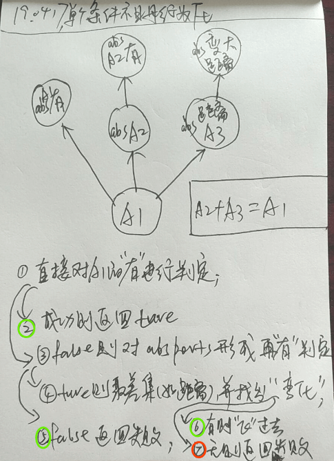 |
| 1. 题中,A1为条件祖母; |
| 2. 先直接对条件祖母判断cHavA1; |
| 3. 否则检查其absPorts,并找出可cHav的: `absA1`; |
| 4. 对absA1中的value_ps进行取差集: `absDistance`; |
| 5. 找出absDistance的cLess,并行为化; |
| 注: 红色为最终判定失败; 绿色为最终判定成功; |

| 祖母嵌套在行为化中的作用 >> |
| --- |
| 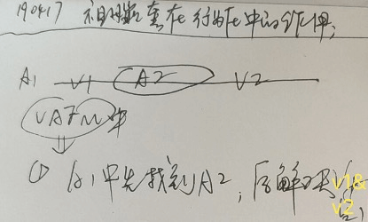 |
| 1. 在条件祖母A1中,有微信息v1、嵌套祖母a2、微信息v2; |
| 2. A1中先找到A2的cHav,后解决v1&v2的变化; |

| 标题 | 预测信息 <=> 诉求信息 |
| --- | --- |
| 简介 | 行为化中的`有无与变化` |
| 1 | cHav `得到坚果` |
| 2 | cNone `去掉皮` |
| 3 | cLess `吃到坚果` |
| 4 | cGreater `躲避汽车` |
| 结果 | 将`预测`与`诉求`信息进行类比,并得出是`cHav/cNone`与`cGreater/cLess` |

| algScheme中subValue行为化方案 >> |
| --- |
| **1. 简单暴力方案: 5%采用** |
| //此处还未发现具象坚果,所以只需先判定,subValue的cGreater和cLess是可以被变化的,即可; |
| **2. 精细靠谱方案: 95%采用** |
| //1. 我们从subAlgFo中,读取到我们所得到的结果,便是 "预测信息"; |
| //2. 将 "预测信息" 中的对应标识的"预测subValue",与 "诉求信息" subValue进行对比; |
| //3. 将此两者信息进行类比,得出一个cGreater/cLess,后判定其行为化可行与否; |

| subValue行为化示图 >> |
| --- |
|  |
| 1. 以蓝圈subValue开始; |
| 2. 以红圈查找cLess结束; |
| `诉求信息`: 为距离为`0`; |
| `预测信息`: 为每一次得到坚果时的一些距离,此处有`5,8,10`等; |
| //进一步思考: 如果`fo1/2/3`得到了带皮坚果,那将需要`皮的cNone`来去皮; |

| subValue行为化代码步骤 >> |
| --- |
| 前提: 相伴的subAlg已经找到了其行为化: `subHavAlg`,此处仅对subValue行为化; |
| 1. 从subHavAlg联想其"引用序列"的时序:subHavFo; |
| 2. 从subHavFo联想其"具象序列":conSubHavFo; |
| 3. 从conSubHavFo中,找到与conSubHavFo.subValue作为预测信息; |
| 4. 将诉求信息:subValue与预测信息:conSubHavFo.subValue进行类比,并得出cLess/cGreater; |
| 结果: 说白了,就是分析到: "`坚果会掉到树下`,`我们可以飞过去吃`;" |


<br><br><br><br><br>


## n16p5 继续迭代决策循环
`CreateTime 2019.04.26`

> 从抽象层到具象层依次为: mv需求->mv节点->fo节点<->祖母节点->微信息

| NUM | 关于决策循环一些描述 |
| --- | --- |
| 1 | 不应期要由具象至抽象的回归,越具象层越易被不应期;而越抽象层越不易被不应期; |
| 2 | 不应期是针对node还是port? |
|  | A: 不应期改为port,比如:做饭与懒冲突,但解决了饥饿问题; |
| 3 | 每一层,都递归到总入口: data_Out() |
| 4 | 每一层模型,都要有自己的score分; |
| 5 | 每一层模型,都有一个有序序列,实时有序,元素为下一具象级模型; |
| 6 | 抽象层取score时,取具象每层第一个,并求和; |

| 决策循环架构示图 >> |
| --- |
| 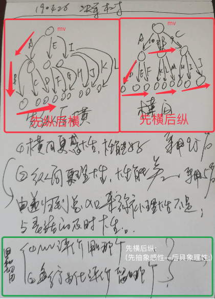 |
| 1. 最终选择右边,先横后纵; |
| 2. 因为越(先)抽象mv越偏向感性评价,越(后)具象偏向理性评价; |
| 说明: |
| > 1. 红框为两个方案; |
| > 2. 绿框为选定方案的总结; |
| > 3. 中间为分析; |

| 总结 >> |  |
| --- | --- |
| 1 | 将ThinkOut中所有TOModel整理顺,都继承自TOModelBase; |
| 2 | TOAlgScheme中暂不支持TOModel,单纯简单的行为化不影响v1.1运行; |
| 3 | TOAlgScheme中暂不支持energy,以精确控制其运作; |


<br><br><br><br><br>


## n16p6 场景视觉
`CreateTime 2019.04.28`


| 场景视觉的必要性分析 >> |
| --- |
|  |
| 如图: |
| > 1. 上面,我们会认为A变成了B; |
| > 2. 中间,我们会认为A的基础上又出现了B; |
| > 3. 下面,我们会认为由A一个变成了BC两个; |
| 结果: |
| 为了内类比更好的工作,我们有必要做整体场景视觉; |

| 场景视觉中的`视觉个体`区分 >> |
| --- |
| 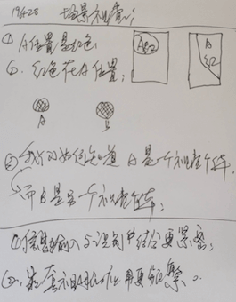 |
| 1. "信息输入"与"识别"更紧密的配合; |
| 2. 嵌套祖母更全面的应用; |

| 伪代码步骤 >> |
| --- |
| 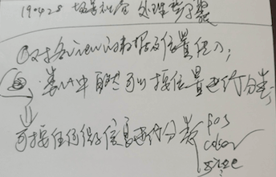 |
| 1. 对各view的数据及位置传入;->类比中自然可以按位置进行分类; |
| 2. 可按任何微信息进行分类,如:`pos,color,size`; |

| 算法层 >> |
| --- |
| 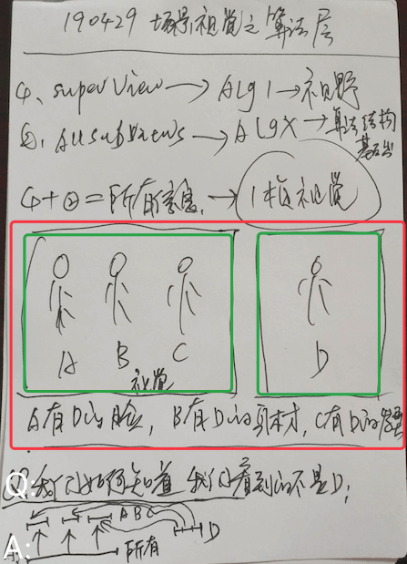 |
| **上部分:** |
| > 1. superView->alg1->视野 |
| > 2. allSubView->algX->算法"结构化数据"输入 |
| > 结果: 算法`结构化数据`的结构源于`微信息对所有数据的分类`; |
| **中部分:** |
| > 前提1. 视觉中有ABC三个小人; |
| > 前提2. 网络中有D小人; |
| > 前提3. A有D的脸,B有D的身材,C有D的发型; |
| **下部分:** |
| > Q: 我们如何知道我们看到的不是D? |
| > A: 把算法`结构化数据`输入到网络中,作为`祖母嵌套`,此时ABC都仅有部分与D相同,即说明我们看到的不是D; |

| 结构化Result的来源 >> |
| --- |
| > 结构化Result, 如: `abcdabeabdeabc` 与 `abcd,abe,abde,abc` |
| 方案1. 先天, `简单,1%采用` |
| 方案2. 后天, `需类比抽具象来分类,99%采用` |
| 思考: 位置的颜色,颜色的位置等,微信息需要传达给我们的东西,让我们做作分类的依据 |
| 思考: 谁和谁类比,比了后的结果是什么? 如`A与B类比,然后C是跟着A还是B;` |
|  |
| **> 方案1与2融合: 批次标识** |
| 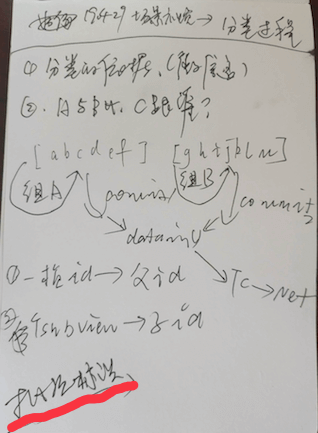 |
| 1. 由算法处理批次,来标识当前算法结果; |
| 2. "批次标识"含1个父标识 + 1个子标识; |
| 3. "父标识"为当前桢,"子标识"为当前算法运行轮次; |

| 场景视觉流程示图 >> |
| --- |
| 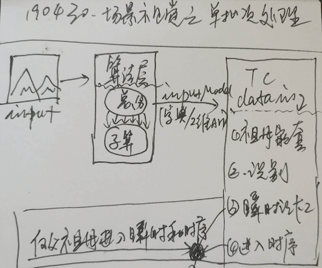 |
| 1. Input一桢图像; |
| 2. 算法层,以`总分配` 到 `子运算`; |
| 3. 将收集到的inputModel (字典/二维数组),传给思维控制器; |
| 4. 思维控制器中,进行`1构建祖母嵌套` `2识别` `3加入瞬时记忆` `4构建到时序`; |
| 注: 其中仅`父祖母`进入瞬时记忆和构建时序; |


<br><br><br><br><br>


## n16p7 迭代思维控制器支持场景视觉
`CreateTime 2019.05.05`

| 连续的瞬时记忆 >> |
| --- |
| > Q:是否需要一个连续的瞬时记忆,而不是总清空; |
| > A:目前先不改,`时机未成熟`; |

| TC迭代代码步骤 >> |  |
| --- | --- |
| 1. 构建祖母嵌套 | 所有view构建为subAlg,parentAlg中嵌套所有这些subAlg |
| 2. 识别 | 对所有subAlg进行识别,并将`view抽象关联到recognitionAlg 5%`或`类比 95%`; |
| 3. 加入瞬时记忆 | 仅将parentAlg添加到瞬时记忆; |
| 4. 构建时序 | 时序很具象,但类比时,可深入到祖母; |
| 注: | 此处parentAlg为具象祖母,subAlg为抽象祖母; |

| 场景视觉分类 >> |  |
| --- | --- |
| Q: | 视觉中,红色的部分,可以含多个祖母,此部分应作为抽象还是具象节点? |
| A1 | 类比各祖母抽象出此节点; 5%选用 |
| A2 | 具象此节点,并嵌套各抽象祖母; 95%选用 |
| 注: | `需求时机不成熟`,先不做 |
| 参考: | 下表,祖母内类比 |

| 祖母内类比 >> |
| --- |
| 简介: 目前默认为按边缘(ios.view层级)分组; |
| 说明: 通过祖母的内类比,来扩展别的维度分组,如按颜色分组,按边缘分组; |
| 注: `时机未成熟`,目前仅靠边缘即可,以后时机成熟再扩展内类比; |

| 识别后类比 >> |
| --- |
| 简介: 识别后,对alg与recognitionAlg进行类比操作,并构建网络关联; |
| 作用: 可使新的输入与旧的知识体系产生关联; |
| 注: 非常有必要,但是需求`时机暂未成熟`; |


<br><br><br><br><br>


## n16p8 v1.1测试与细节完善
`CreateTime 2019.05.07`

> 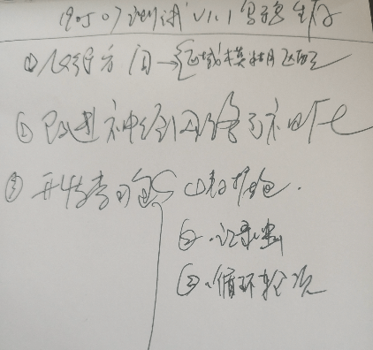

| 1. 飞行方向 >> |
| --- |
| 区域模糊匹配 |

| 2. 改进神经网络可视化 >> |
| --- |
|  |

| 3. 开发学习包 >> |
| --- |
| 1. 数据包 |
| 2. 记忆虫 |
| 3. 循环轮次 |
| > 可以使用反射来做; |
| > 每次执行,产生一个训练日志,记录了,每一步时间消耗 & 检查学习成果等; |

| 学习包设计 >> |
| --- |
| 1. LearnBag.start(RecordMode); //初始化为记录模式; |
| 2. LearnBag.add(); //记录一步; |
| 3. LearnBag.end(); //打包; |
| 注: RecordMode模式下,记录我们的每一步操作,来生成学习包; |
|  |
| 1. LearnBag.start(LearnMode); //初始化为学习模式; |
| 注: 此模式下,所有LearnBag.add()直接return; |
| 注: LearnMode模式下,对包中每一步,进行自动执行,且记录日志; |
|  |
| 可打包: `飞行包` `吃食包` `生存场景观察包` 等等; |


<br><br><br><br><br>


## n16p9 v1.1性能优化
`CreateTime 2019.05.08`

| 异步持久化 >> |
| --- |
| 写XGWedis,异步且在子线程持久化; |

| 整存微信息 >> |
| --- |
| 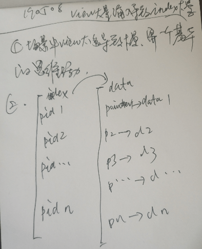 |
| 问题: 微信息取value频繁导致卡; |
| 解决: 将data存为整体,以优化读取性能; |

| refPorts频繁 >> |
| --- |
| 问题: 非常频繁的取refPorts来做关联; |
| 解决: 采用区间整存的方式,合适划分为一块块的; |
| 尝试: 尝试使用`意识流双序列`来解决此问题; |


<br><br><br><br><br>


## n16p10 训练
`CreateTime 2019.05.09`

>   
> 小鸟的基本行为事件: `1吃` `2踢` `3飞` `4撞`

| 飞行训练 >> |
| --- |
| 1. 飞行8方向 x 坚果8方向 = 64向映射; |

| 世界规则 >> |
| --- |
| 1. 距离<=10 可吃,以饱 |
| 2. 距离<=10 可踢,以移动坚果 |
| 3. 距离<=0 可撞,以疼 |


<br><br><br><br><br>


## n16p11 意识流双序列-内存网络
`CreateTime 2019.05.09`

> ##### 简介:  
> 　　意识流双序列,又称:内存时间序列,是在disk中强度序列之外,另有一个内存中存的时间序列;  
> ##### 作用:
> 1. 与强度序列相对,让现实刚刚输入的东西,更及时的帮助到智能体解决问题;(如看到坚果) (越抽象越依赖强度,越具象越依赖近期可解决)
> 2. 性能优化,不必每一次具象输入都访问硬盘,省容量,写入执行快,读取结果也更实际;

| 意识流双序列 (内存时间序列) >> |
| --- |
| 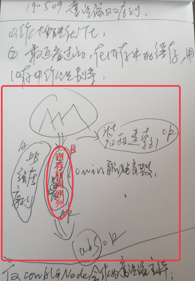 |
| 1. 原图处理后的装箱建索引,是可持久化的; |
| 2. 内存时间序列用来构建临时内存网络,是不可持久化的; |
| 3. 进行类比后,抽象节点,不在此序列中; |
| 原则: 仅`conAlg,conFo,conMv`会做为意识流主体; |

| 意识流双序列的边界 >> |  |
| --- | --- |
| 简介 | 意识流处理范围有哪些? |
| 原则 | `conAlg,conFo,conMv`及其相关的ports都放到意识流; |
| 1,conNode | 意识流主体,直接用XGRedis存,而不进行持久化; |
| 2,memRefPorts | 微信息引用序列,写memRefPorts; |
| 3,memConPorts | 其抽象节点absNode的conPorts,写memConPorts; |

| 相对 >> | DESC |
| --- | --- |
| 1. memNet为动->hdNet为静 | 有相对,有转移; |
| 2. tc为动->皮层为静 | 疑不算相对,因为不循环; |
| 3. 小脑是固化脑->大脑是思维脑; | 小脑对于输出的固化网络 |


<br><br><br><br><br>


## n16p12 内存网络的转移
`CreateTime 2019.05.17`

| 内存网络的使用入口 (下节开用) >> |
| --- |
| `1. memRefPorts`,`2. memAbsPorts`,`3. memConPorts` |

| 具体要做的事 >> |
| --- |
| 1. 代码中要避免memNode持久化,`会导致无法过期` `需解决判断是否属于memNet的问题`; (演化为问题,见下表) |
| 2. 要让memPorts中,过期的移除; |
| 3. 要将saveDB集成到AIPointer中; (完成) |

| memNet使用中的问题 >> |
| --- |
| 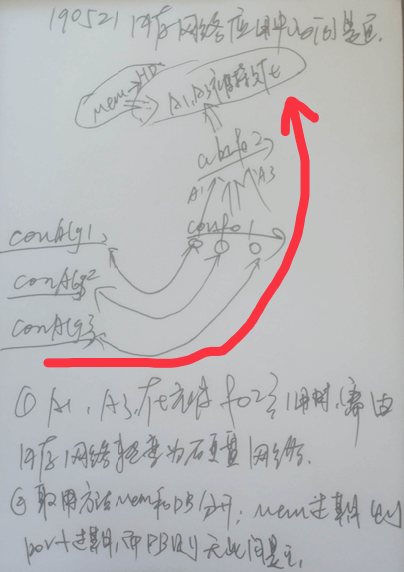 |
| 1. 前提: 内存中,a1,a2,a3在被f1引用着; |
| 2. 变化: f1被抽象为f2; |
| 3. 情况: 此时f2引用了a1和a3; |
| 4. 需求: a1和a3此时需要被转变到hdNet中; |
| 5. 问题: memNet到hdNet的转变过程是怎样的? |

| memNet到hdNet转移的过程 >> |
| --- |
| 1. ref和memRef用两份,node和memNode也用两份; |
| 2. memNode转为hdNode时,如果已存在则strong+1,如果不存在改isMem=false并直接转存hdNet; |
| 注. 文件名区分: `ports使用memPorts`,`node使用memNode`; |

| TITLE | memNet->hdNet的转移代码实现 |
| --- | --- |
| 示图 | 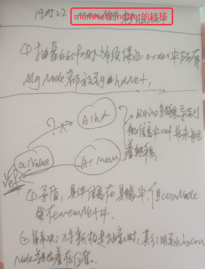 |
| 说明 | 构建新的需持久化的抽象时,必须把`所有相关信息`都转移到hdNet; |
| 释词 | 所有相关信息包含:`本信息和引用信息`; |
| 举例 | foNode转移时,需要连带其orders中algNode,以及algNode.refPorts,以algNode.content_ps中value.refPorts; |
| 时机 | 一定是新构建抽象时,才会触发转移; |
| 代码 | 将转移代码单独封装成方法,供调用; |
| 原则 | 我们仅在abs抽象时,对所需的祖母进行转移,而fo和mv不必进行转移; |


<br><br><br><br><br>


## n16p13 内存网络的使用
`CreateTime 2019.05.23`

| 使用入口 >> |
| --- |
| 1. memRefPorts |
| 2. memAbsPorts |
| 3. memConPorts |

| 具体工作 >> | STATUS |
| --- | --- |
| 1. 识别时取memRefPorts优先识别; | T |
| 2. 一切取ports的都优先取memPorts; | 在MIL&MOL等TC代码中; |
| 3. 构建抽象时,去重,优先取memPorts; | T |
| 4. 对ThinkIn代码检查支持内存网络; | T |
| 5. 对ThinkOut代码检查支持内存网络; | T |
| 6. 对ThinkControl代码检查支持内存网络; | T |
| 7. Output & ThinkingUtils & NVUtils & AINet & AINetUtils | T |
| 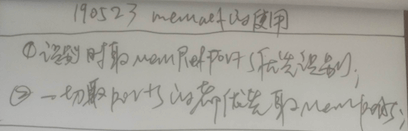 |  |


<br><br><br><br><br>


## n16p14 训练2
`CreateTime 2019.06.03`

> 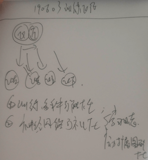

| 点 | 描述 | 解释 |
| --- | --- | --- |
| 1 | 训练多种可能性 | 包括8方向各自独立学习到网络 |
| 2 | 神经网络可视化 | 学习日志 / 动态扩张可视化 |


<br><br><br><br><br>


## n16p15 神经网络可视化v2.0之图形可视化
`CreateTime 2019.06.06`

> 为了调试训练,图形化可视化变的越来越重要,原有的v1.0版本看着让人头疼,极其影响效率;

| 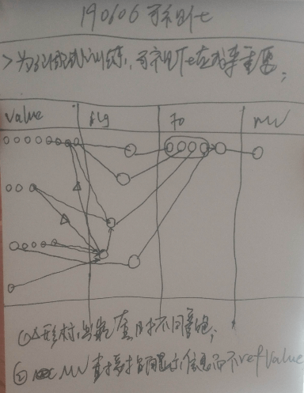 |
| --- |
| 1. 整体一个scrollView |
| 2. 一个数据序列nodeArr,内含所有node |
| 3. 从左至右,分别为value,alg,fo,mv四部分; |
| 4. 用节点信息反视图显示节点,默认为白色圆点; |
| 5. 指向(按住)节点时,显示微信息值; |
| 6. 指向(按住)关联时,显示强度等信息; |
| 7. 对抽具象关联与引用关联采用不同颜色线; |
| 8. 对嵌套引用和直接引用微信息,采用不同颜色线; |

| 代码设计 >> |  |
| --- | --- |
| 1. 封装 | NodeView单独分层，使可自定义，可默认 |
| 2. 性能 | 硬盘网络异步，内存网络可实时加载 |
| 3. 数据 | 1个nodeArr,1个refPorts等; |
| 4. 架构 | baseView -> value_alg_fo_mv |

| 接口设计 >> |  |
| --- | --- |
| 1. 模块id | 如`value` `alg` `fo` `mv` |
| 2. refPorts | 引用与被引用关联 |
| 3. absConPorts | 抽具象关联 |
| 4. nodeView | 可默认白圆,或指定nodeView |
| 5. lineColor | 默认灰色,或指定颜色; |
| 6. tipsDesc | 指向节点或线时,显示的内容; |

| 排版算法 >> |
| --- |
| 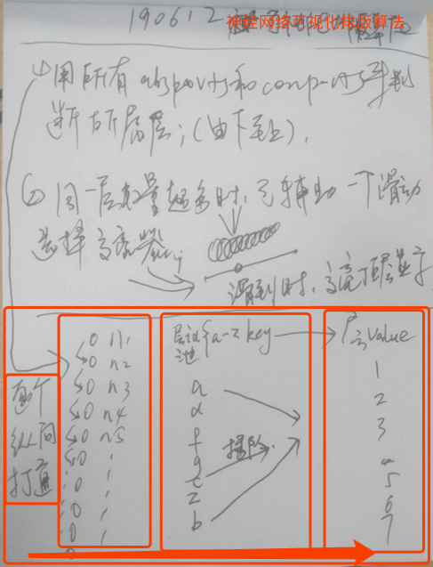 |
| **1. 层编号算法** |
| 1. 对所有节点数据,逐个纵向打通,来做层级判断; |
| 2. 中间放`layerId池`(如a-z最多26层); |
| 3. 此时,逐个取layerId,并编层号; |
| 4. 中间,如果有插队的,则将layerId对应的layerValue更正,+1或-1 |
| 5. 最终得到正确的layerMap<layerId,layerValue>; |
|  |
| **2. 同层节点选择器** |
| 1. 当同层节点过多时,会有互相覆盖的情况; |
| 2. 此时,可以做一个选择器,来帮助选择高亮目标节点; |


<br><br><br><br><br>


## TODOLIST

| TODO (优先) | DESC | STATUS |
| --- | --- | --- |
| 1 | 做意识流双序列; |  |
| 2 | 关于精度的范围匹配问题,应该在祖母层后天完成;但不影响小鸟核心智能演示,所以可暂使用一些算法层实现 (如`方向精度为10`/`小鸟仅能飞上下左右四方向`); |  |

| TODO >> | DESC | STATUS |
| --- | --- | --- |
| 1 | 标识映射,(解析和反解析的map,可以采用36进制的字符串;) |  |
| 2 | 性能优化_设计节点收集器,总操作完成后,由丘脑统一持久化; |  |
| 4 | 代码结构优化_将不应期,使用字典实现; |  |
| 5 | 代码中检查alg采用的标识,(建议采用自增唯一标识符); |  |
| 6 | cLess,cGreater,cHav,cNone有可能后天导致溢出碰撞,所以,要采用别的设计来避免此问题; |  |
| 8 | 考虑ThinkOut在fo或mv之上的层,才会回归到dataIn来总循环,而更下层,则仅在适应局部层数间循环; |  |
| 9 | 将AlgNode.refPorts改为单文件方式; |  |
| 10 | 将except_ps不应期,中的node改为port; |  |
| 11 | 将energy集成到TOAlgScheme行为化评价器中; |  |
| 12 | 将XGRedis和XGWedis的存储空间整合,以节约内存; |  |
| 13 | 用pointer.isMem替代saveDB (因为saveDB参数难以持续追踪) | T |
| 14 | IndexRefrence和AINetUtil.insertPointer微信息部分有重复,重构之; `仅mv和abcMv在调用,可尝试删掉IndexRefresh并替换到NetUtils方式;` |  |


| BUG | DESC | STATUS |
| --- | --- | --- |
| 1 | 当祖母嵌套时,content_ps的内容就变了,此时因此content_ps而产生的md5的header也匹配不上了; |  |
| 2 | setNodePointerToDirectionReference()在二分查pointerArr,却用portArr存; |  |

```
//TIME:20190226
/////1. TODOTOMORROW:做意识流双序列;

//1. 首先是要解决强度序列之外的再加时间序列的问题; (其实不是时间序列,仅是一个激活节点的内存缓存)
//2. 使用XGRedis来做10分钟自动销毁;
//3. 事务需求:
//4. 比如我们需要搜索硬盘节点中,哪个port指向的节点在redis中;
//5. 再比如: 我们需要搜索到哪个redis中的node具有某微信息; (性能优化,建内存索引)
```


<br><br><br><br><br>
