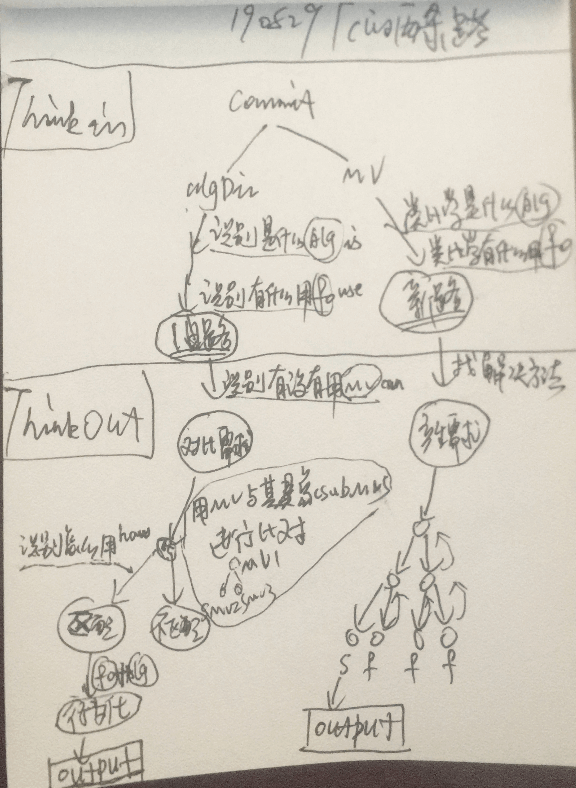

# V2.0的测试/训练/细节完善

***

<!-- TOC -->

- [V2.0的测试/训练/细节完善](#v20%E7%9A%84%E6%B5%8B%E8%AF%95%E8%AE%AD%E7%BB%83%E7%BB%86%E8%8A%82%E5%AE%8C%E5%96%84)
  - [n17p1 思维控制器的`理性流程`与`感性流程`](#n17p1-%E6%80%9D%E7%BB%B4%E6%8E%A7%E5%88%B6%E5%99%A8%E7%9A%84%E7%90%86%E6%80%A7%E6%B5%81%E7%A8%8B%E4%B8%8E%E6%84%9F%E6%80%A7%E6%B5%81%E7%A8%8B)
  - [TODOLIST](#todolist)

<!-- /TOC -->

***

## n17p1 思维控制器的`理性流程`与`感性流程`
`CreateTime 2019.08.29`

> 在飞行训练时,发现思维控制器 "看到坚果" 的"理性之路"未走通,占整个思维控制器的25%,如下:
> 1. 做了的部分:
>   * 感性流程整体完成;
>   * 理性流程的ThinkIn部分（`是什么(is)`和`有什么用(use)`）;
> 2. 没做的部分:
>   * 理性流程的ThinkOut部分（`有没有用(can)`和`怎么用(how)`）;

| 两条路示图 >> |
| --- |
|  |
| A. 左侧为`理性路`,输入`algDic`信号,类比联想旧知识,后对比即有需求,行为向外循环达到目标(比如一步步飞行坚果); |
| B. 右侧为`感性路`,输入`mv`信号,类比构建新知识,后产生新需求,内心递归展开(比如内心找到解决方案并实施); |
| 1. 本文重点关注左侧的`理性路`; |
| 2. 本文重点规划左侧下方`ThinkOut部分`的代码实现; |

| TODO >> | STATUS |
| --- | --- |
| 1. 本文中断了飞行训练,等本文完成时继续: |  |

     

## TODOLIST

| TODO >> | STATUS |
| --- | --- |
| 1. "嵌套概念"取消了,决策时行为化的代码逻辑,也得相应着改下; |  |
