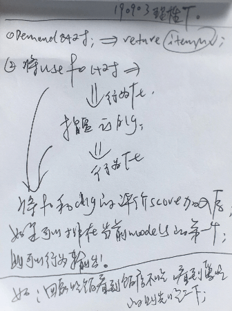
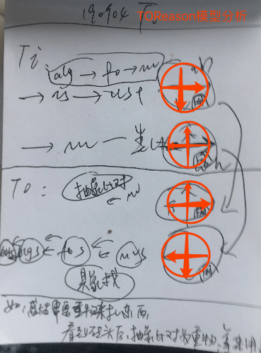
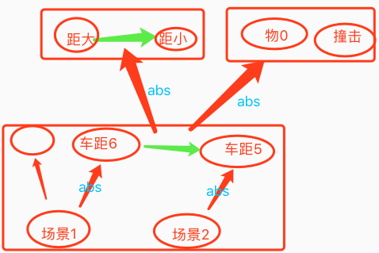
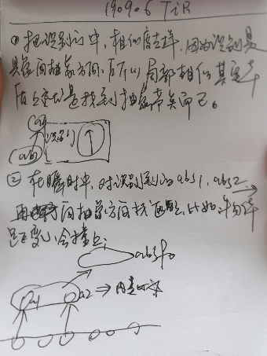
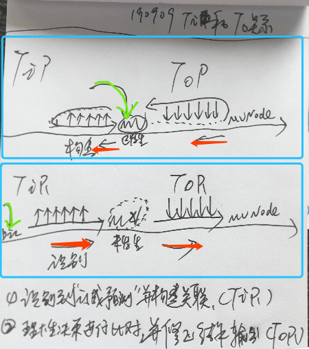

# V2.0的测试/训练/细节完善/理性思维

***

<!-- TOC -->

- [V2.0的测试/训练/细节完善/理性思维](#v20%E7%9A%84%E6%B5%8B%E8%AF%95%E8%AE%AD%E7%BB%83%E7%BB%86%E8%8A%82%E5%AE%8C%E5%96%84%E7%90%86%E6%80%A7%E6%80%9D%E7%BB%B4)
  - [n17p1 思维控制器的`理性流程`与`感性流程`](#n17p1-%E6%80%9D%E7%BB%B4%E6%8E%A7%E5%88%B6%E5%99%A8%E7%9A%84%E7%90%86%E6%80%A7%E6%B5%81%E7%A8%8B%E4%B8%8E%E6%84%9F%E6%80%A7%E6%B5%81%E7%A8%8B)
  - [n17p2 TOR(ThinkOutReason)-理性决策](#n17p2-torthinkoutreason-%E7%90%86%E6%80%A7%E5%86%B3%E7%AD%96)
  - [n17p3 TIR(ThinkInReason)-理性识别预测](#n17p3-tirthinkinreason-%E7%90%86%E6%80%A7%E8%AF%86%E5%88%AB%E9%A2%84%E6%B5%8B)
  - [n17p4 TIR&TOR-理性思维汇总](#n17p4-tirtor-%E7%90%86%E6%80%A7%E6%80%9D%E7%BB%B4%E6%B1%87%E6%80%BB)
  - [TODOLIST](#todolist)

<!-- /TOC -->

***

## n17p1 思维控制器的`理性流程`与`感性流程`
`CreateTime 2019.08.29`

> 在飞行训练时,发现思维控制器 "看到坚果" 的"理性之路"未走通,占整个思维控制器的25%,如下:
> 1. 做了的部分:
>   * 感性流程整体完成;
>   * 理性流程的ThinkIn部分（`是什么(is)`和`有什么用(use)`）;
> 2. 没做的部分:
>   * 理性流程的ThinkOut部分（`有没有用(can)`和`怎么用(how)`）;

| 两条路示图 >> |
| --- |
|  |
| A. 左侧为`理性路`,输入`algDic`信号,类比联想旧知识,后对比即有需求,行为向外循环达到目标(比如一步步飞行坚果); |
| B. 右侧为`感性路`,输入`mv`信号,类比构建新知识,后产生新需求,内心递归展开(比如内心找到解决方案并实施); |
| 1. 本文重点关注左侧的`理性路`; |
| 2. 本文重点规划左侧下方`ThinkOut部分`的代码实现; |

| TOReason流程分析 |
| --- |
|  |
| 1. 比对流程分析,方向为:从下向上,从左向右; |
| > 从下向上: 向抽具象比对,即当前识别的概念节点,是否可抽象解决当前的需求;(如砖头是重物,草也是食物) |
| > 从左向右: `algScheme_Is,foScheme_Use,mvScheme_Can,actionScheme_How` |

| TOReason模型分析 >> |
| --- |
|  |
| 1. TIR: → 理性向感性,根据index索引识别`is,use,mv`,并对energy影响;(如喜欢红色喜庆) |
| 1. TIR: ↓ 识别具象;(如识别砖头) |
| 2. TIP: ← 感性向理性,根据mv索引共同经历;(如曾风声导致吃饱) |
| 2. TIP: ↑ 具象向抽象,类比规律认知学习;(如铃声导致食物) |
| 3. TOR: → 理性向感性,比对当前信息,能否应用于当前的需求任务;(如草也能吃) |
| 3. TOR: ↑ 具象向抽象,比对当前信息,是否抽象对当前需求任务有用;(如砖头是重物) |
| 4. TOP: ← 感性向理性,根据价值找解决方案,递归找方法;(如饿了需要吃食物) |
| 4. TOP: ↓ 抽象向具象,找到更具体的解决方案;(如吃面,而不是吃食) |
| 注错误: 上图中,TIR应该是↑而不是↓; TOR应该是↓而不是↑; |

| TODO >> | STATUS |
| --- | --- |
| 1. 本文中断了飞行训练,等本文完成时继续: |  |

     

## n17p2 TOR(ThinkOutReason)-理性决策
`CreateTime 2019.09.05`
> 注:
> * `I`=`Input`
> * `O`=`Output`
> * `→`=`理性出发`
> * `←`=`感性出发`
> * `↑`=`从具象到抽象`
> * `↓`=`从抽象到具象`

| 思维控制器的四大部分 >> |  |
| --- | --- |
| 1. TIP认知 `学习` `I` `←` `↑` | 不解释 |
| 2. TIR识别 `预测` `I` `→` `↑` | 从具象识别为抽象,分为概念识别和时序识别; |
| 3. TOP决策 `行为` `O` `←` `↓` | 不解释 |
| 4. TOR比对 `修改` `O` `→` `↓` | 从抽象向具象修正,来达成或避免某价值变化; |

| 第二部分 >> |
| --- |
| 1. 识别概念: 如这是一辆汽车 `car1 is car` (汽车是抽象概念); |
| 2. 识别时序: 如预测这车马上会撞到我 `car距6 -> car距5` `距0 -> 疼` (抽象时序); |

| 第四部分 >> |
| --- |
| 1. 当具有饥饿需求时,修正坚果的位置,能吃到坚果,解决饥饿问题; |
| 2. 当预测撞车时,修改自己的位置,以避免被车撞到疼痛; |

| TODO >> | STATUS |
| --- | --- |
| 1. 识别加上瞬时记忆中的时序预测; |  |

     

## n17p3 TIR(ThinkInReason)-理性识别预测
`CreateTime 2019.09.06`

> 　　**概念：** TIR(ThinkInReason)的理性预测,本质上就是识别时序。从而提前预知即将到来的价值影响罢了。  
> 　　**后续支持：** 从而支撑TOR阶段进行一些提前的行为调整,以使价值MindValue正向;

| TIR预测流程图 >> |
| --- |
|  |
| 注: 小鸟的知识前提:`是经历过学习飞行时,多次左摇右撞,知道撞击的条件和撞击的后果;` |

| TIR模型草图 >> |  |
| --- | --- |
|  |  |
| 1. 从场景中,识别is出车; | 1. 向抽象方向匹配抽象概念; |
| 2. 从场景中,内类比,发现距离变化; | 2. 向抽象方向匹配抽象时序; |
|  |  |
| 3. 抽象匹配到,物体距离0时,距离为0时的撞击; |  |
| 4. 从而预测出,汽车为0时,会产生撞击; |  |

| 代码规划 >> |
| --- |
| 目标1: 小鸟看到坚果时,可以飞过去; |
| 目标2: 小鸟看到汽车时,可以躲避,与不作死; |
| 1. 每一桢输入的识别is; |
| 2. 由TIR触发shortMemory的内类比; |
| 3. 识别is+内类比一起运作,向抽象方向,匹配到符合当前`概念`与`时序`的预测结果; |

     

## n17p4 TIR&TOR-理性思维汇总
`CreateTime 2019.09.09`

| 思维模型 & 理性思维总结 >> |
| --- |
|  |
| 1. 绿色箭头为信息输入口; |
| 2. 红色为对网络模块的横向操作方向; (理性思维向感性,感性思维向理性) |
| 3. 理性思维的代码规划: |
| > TIR: 识别"概念与时序",并构建纵向关联; |
| > TOR: 类比决策,并修正结果输出; |

     

## TODOLIST

| TODO >> | STATUS |
| --- | --- |
| 1. "嵌套概念"取消了,决策时行为化的代码逻辑,也得相应着改下; |  |
