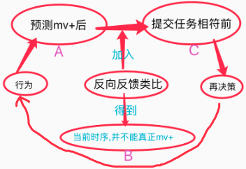
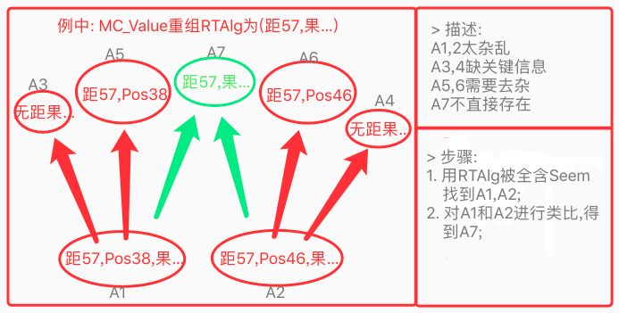
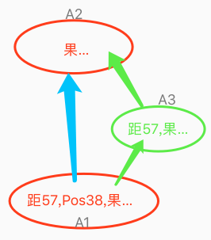
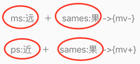
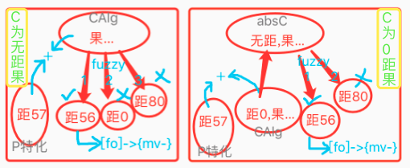

# 测试 & 细节改动 & 训练

<!-- TOC -->

- [测试 & 细节改动 & 训练](#%E6%B5%8B%E8%AF%95--%E7%BB%86%E8%8A%82%E6%94%B9%E5%8A%A8--%E8%AE%AD%E7%BB%83)
  - [n19p1 规划性训练2](#n19p1-%E8%A7%84%E5%88%92%E6%80%A7%E8%AE%AD%E7%BB%832)
  - [n19p2 TIR_Alg_FromRT算法迭代](#n19p2-tir_alg_fromrt%E7%AE%97%E6%B3%95%E8%BF%AD%E4%BB%A3)
  - [n19p3 反向反馈类比](#n19p3-%E5%8F%8D%E5%90%91%E5%8F%8D%E9%A6%88%E7%B1%BB%E6%AF%94)
  - [n19p4 外类比迭代: 正向反馈类比](#n19p4-%E5%A4%96%E7%B1%BB%E6%AF%94%E8%BF%AD%E4%BB%A3-%E6%AD%A3%E5%90%91%E5%8F%8D%E9%A6%88%E7%B1%BB%E6%AF%94)
  - [n19p5 规划性训练3](#n19p5-%E8%A7%84%E5%88%92%E6%80%A7%E8%AE%AD%E7%BB%833)
  - [n19p6 扩展识别算法支持: MatchType_Seem](#n19p6-%E6%89%A9%E5%B1%95%E8%AF%86%E5%88%AB%E7%AE%97%E6%B3%95%E6%94%AF%E6%8C%81-matchtype_seem)
  - [n19p7 RTAlg反思:全面性迭代](#n19p7-rtalg%E5%8F%8D%E6%80%9D%E5%85%A8%E9%9D%A2%E6%80%A7%E8%BF%AD%E4%BB%A3)
  - [n19p8 结合`MC_Value`和`反向类比`分析决策失败的问题](#n19p8-%E7%BB%93%E5%90%88mc_value%E5%92%8C%E5%8F%8D%E5%90%91%E7%B1%BB%E6%AF%94%E5%88%86%E6%9E%90%E5%86%B3%E7%AD%96%E5%A4%B1%E8%B4%A5%E7%9A%84%E9%97%AE%E9%A2%98)
  - [n19p9 用"V+A"来解决反向类比与MC_Value的协作问题](#n19p9-%E7%94%A8va%E6%9D%A5%E8%A7%A3%E5%86%B3%E5%8F%8D%E5%90%91%E7%B1%BB%E6%AF%94%E4%B8%8Emc_value%E7%9A%84%E5%8D%8F%E4%BD%9C%E9%97%AE%E9%A2%98)
  - [n19p10 MC_Alg算法迭代V3](#n19p10-mc_alg%E7%AE%97%E6%B3%95%E8%BF%AD%E4%BB%A3v3)
  - [n19p11 双向任务在TO的不同处理;](#n19p11-%E5%8F%8C%E5%90%91%E4%BB%BB%E5%8A%A1%E5%9C%A8to%E7%9A%84%E4%B8%8D%E5%90%8C%E5%A4%84%E7%90%86)

<!-- /TOC -->

### n19p1 规划性训练2
`CreateTime 2020.04.06`

> 说明: 继续note18的训练进度;

| 19011 | 训练步骤细节分析版: | STATUS |
| --- | --- | --- |
| **A组** | 目标: `果可吃` | 独立可训 |
| A1,2 | **直投,直投** | T |
| A3 | **重启,移动,并直投** | T |
| **B组** | 目标: `远果不能吃+模糊识别` | 独立可训 |
| B4,5 | **重启,远投,马上饿,马上饿** | T |
| B6 | **重启,远投(投向与A6不同的方向),马上饿** | T |
| B7 | **返回,重进成长演示页,远投** | T |
| **C组** | 目标: `学习飞行,可解决距离的常识+内类比` | 独立可训 |
| C8 | **重启,远投上,摸翅膀上** | T |
| C9 | **再摸...(从各种飞行角度,发现与距离的变化的映射)** | 暂略 |
| **D组** | 目标: `决策,并输出飞行离坚果更近` |  |
| D10 | **重启,远投上,马上饿** | 依赖ABC组 |
|  | =>行为化输出吃,而不是飞,应该从`远果,吃`中学习到,远果不能吃 `BUG_1`; |  |
|  | =>MC_Value到RelativeValue行为化 `BUG_2` |  |
| D11 |  |  |

| BUG | STATUS |
| --- | --- |
| 1. 远投后,MC行为化结果为`吃`,而不是`飞`的问题; |  |
| 2. 下投坚果,行为化为`飞上`,导致更飞远了; |  |
| > 分析: 小鸟只经历过飞上,离上坚果更近,所以这里要加入对方向的判断,抽象出不同方向坚果进行不同方向飞行的知识; |  |

<br><br><br><br>

### n19p2 TIR_Alg_FromRT算法迭代
`CreateTime 2020.04.06`
> 因为在精训D10时,发现M特化值:`经266`,在TIR_Alg_FromRT()时,重组[经266,高5],识别后,得到[距20,经266,高5],其中杂质`距20`导致评价失败;所以本节对TIR_Alg_FromRT算法进行迭代;

> **缩写说明:**
> 1. mModel : 全称AIShortMatchModel

| 19021 | 算法变动说明 |
| --- | --- |
| 1 | 去除fuzzy模糊匹配,仅将match返回; |
| 2 | 返回结果必须包含mUniqueValue特化值; |

| 19022 | 改动后,测试与BUG |
| --- | --- |
| **BUG** | 当mUniqueValue=`距20`,same_ps=`w5,h5,g1`时,rtAlg=`w5,h5,g1,距20`,执行新版识别后,发现根本找不到距20的,全含的坚果,因为在抽象时,距20早已被去除; |
|  | 分析: 此问题关键在于,识别无法成功,我们需要更多抽象的常识,我们可以通过以下两种途径来获取: |
|  | 途径1: 认知阶段,更多确切的常识 (依赖更多经历,进行外类比); |
|  | 途径2: 决策反馈,更多的对确切信息的价值指向; |
| **向性分析** | 综上,我们需要整个系统的角度来分析此问题的解 |
|  | 1. 决策,向性下,从具象中找方案; |
|  | 2. 反思,向性上,从抽象中找评价; |
| **总结** | 本bug最大的原因,是反思时,无法从抽象中,匹配到确切的价值指向,导致评价失败; |
| **疑难点** | 而`距20`这种很具体的信息,在外类比抽象时,又极易被丢失掉,这个矛盾导致bug; |
| **解决** | 那么只要我们可以对导致反价值的信息进行直接抽象,即可解决此问题,故我们可以采取将预测与反馈之间进行类比,来实现此需求,`转至19023`; |

| 19023 | 从系统TO角度,分析抽象不足的问题; |
| --- | --- |
| 决策与反思示图 |  |
| 说明 | 绿色: 根据MModel识别与预测,进行反思评价; |

| 19024 | 从系统TI角度,分析抽象不足的问题; |
| --- | --- |
| 认知与反馈示图 |  |
| 说明 | 绿色: 根据MModel识别与预测,进行反馈认知; |
| 说明2 | 反馈imv与预测mModel.mv,根据同反向,产生同向和反向两种反馈类比; |
| 说明3 | 因同向反馈类比与现有的analogy_Outside()类似,故现在我们只写Feedback_Diff(); `转至n19p3` |

<br><br><br><br>

### n19p3 反向反馈类比
`CreateTime 2020.04.06`

**1. 简介:**   
　　在TIP时,假如反馈的imv与mModel的预测不符,会触发反向反馈类比(以下简称反向类比),以快速获取非常确切的抽象常识;本节从此出发,设计此类比算法;  

**2. 曾用名:**
1. 占位规律,参考:n13p15;
2. 找不同,参考:n15p15, n15p17;

| 19031 | 不相符的原因,归咎于两种: |
| --- | --- |
| **第1种** | 该出现的(`概念`/`稀疏码`)未出现; |
| 举例 | 一直能赢,今天乔丹没来,所以输了; |
| 结果 | 乔丹对胜利很重要 `[乔丹]->{mv+}`; |
| **第2种** | 不该出现的(`概念`/`稀疏码`)出现; |
| 举例 | 一直能赢,今天尼古拉赵四加入,我们输了; |
| 结果 | 赵四对失败有责任 `[赵四]->{mv-}`; |

```objective-c
//19032 伪代码;
+(void) analogy_Feedback_Diff:(AIFoNodeBase*)mFo p:(AIFoNodeBase*)pFo{
    if(不符合预测){ //指mMv和pMv同类型不同向 (一正一负);
        /** 第1级: 类比fo.content_ps;
          *  M:[abcd]->{mmv+}
          *  P:[a3bcxyz]->{pmv-}
          *  ms:[d]->{mmv+/4}; (价值影响权重=ms数/M数);
          *  ps:[3xyz]->{pmv-*4/7}; (价值影响权重=ps数/P数);
          */

        /** 第2级: 类比alg.content_ps;
          * M:[(w1),(d5,h6)]->{mmv+};
          * P:[a,(w1,b2),(d5,h3)]->{pmv-};
          * ms:[(h6)]->{mmv+/2};    //说明h6很重要
          * ps:[a,(b2),(h3)]->{pmv-*3/3} //说明a,b2,h3很多余
          */

        //3. 构建: 概念,时序和MV;
    }
}
```
***

| 19033 | TODO | STATUS |
| --- | --- | --- |
| 1 | 瞬时记忆中放match而不是proto (放了matchCache和protoCache两种); | T |
| 2 | 为Feedback算法的结果,制定新的时序类型 (同时新类型的refPorts) (可考虑先由ds/at来做类型,不改refPorts,取指定类型的refPorts时可由指针标识进行类型筛选); |  |
| 3 | 将反向类比构建器中,ms导致pmv改为mmv; | T |

| 19034 | 测试 |
| --- | --- |
| 关键问题 | 因反向类比的调用频率太低`参考19041`,故不能单靠此来解决的抽象不足问题`参考19022`; |
| 解决方式 | 对正向类比迭代 `转n19p4` |

<br><br><br><br>

### n19p4 外类比迭代: 正向反馈类比
`CreateTime 2020.04.10`

**简介:**   
　　因反向类比,并不能单独支撑起抽象不足的问题`参考19034`,所以本节将对正向反馈类比(以下简称:反向类比)进行迭代;

| 19041反馈类比对比 | 数据全面性 | 确切化速度 | 调用频率 | 抽象确切度 |
| --- | --- | --- | --- | --- |
| 正向反馈类比 | 好 | 慢 | 经常 | 常模糊 |
| 反向反馈类比 | 差 | 快 | 很少 | 常确切 |

| 19042 | 迭代分析 |
| --- | --- |
| 1 | 瞬时记忆新增一份matchAlg序列,并以此构建mProtoFo; |
| 2 | 用mProtoFo替代正向类比中的protoFo; |
| 3 | 用shortMatchModel替代正向类比中的assFo; |
| 注: | 原有瞬时序列和protoFo不变,只是新增matchAlg瞬时序列和mProtoFo; |

| 19043 | 训练计划 | 解说 |
| --- | --- | --- |
|  | A1(向3,距20,位8)->{mv-} |  |
|  | A2(向3,距20,位7)->{mv-} | 位置最善变 |
| A1:A2 | absA3(向3,距20)->{mv-} |  |
|  | A4(向1,距50)->{mv-} | 方向也易变 |
|  | A5(向1,距20)->{mv-} |  |
| A3:A5 | absA6(距20)->{mv-} | 距20不能吃 |
| A4:A5 | absA7(向1)->{mv-} | 向1不能吃(共经历2次) |
|  | A8(向1,距0)->{mv+} |  |
| A7:A8 | absA9(距0)->{mv+} | 反向类比,距0可吃 |

<br><br><br><br>

### n19p5 规划性训练3
`CreateTime 2020.04.10`
> 最近迭代了正反向反馈类比,本节重新规划规划性训练步骤,并逐步训练;

| 19051 | A组 | 目标:果可吃 `内类比,概念绝对匹配,时序识别,正向类比` |
| --- | --- | --- |
| A1 | 直投,直投 | absA1[pos38,dis0...]->{mv+} |
| A3 | 重启,移动,直投 | absA2[dis0...]->{mv+} |

**A组BUG:**
  1. 测试shortMatchFo生成后,影响到了原来的外类比,因为原有外类比,的assFo全部联想成了matchFo,分前进和后退两个解决方法:
    * **前进方法:** 即原有的外类比已经不重要,直接去掉,到后面能成功识别时,再反过来训练正向反馈类比;
    * **后退方法:** 想办法使shortMatchFo不要影响到旧有外类比方法;
    * **解决:** 选择前进,不走回头路,如下三条改动;
      - 更及时的持久化: 只要TIP即持久化生成fo和mvNode;
      - 识别更早就工作: TIR_Alg和TIR_Fo在第二次输入时,即开始工作;
      - 停掉原有外类比: 彻底停掉旧有的外类比调用;
  2. 空场景输入,导致mModel.matchAlg和matchFo变没,进尔导致外类比无法执行;
    * **分析:** 现在瞬时序列不清空,所以并不需要空场景输入;
    * **解决:** 因为不存在绝对的空场景输入,空场景也无法识别成,故不对空场景识别;
  3. A3移动直投后,生成时序为[飞,果],而联想到时序为[果,吃],二者无法全含匹配,因为此时lastItem为果,没有(吃),所以时序识别失败,导致外类比也无法进行,从而也无法类比出[dis0...]->{mv+};
    * **分析:** 因输出行为(吃)时,没有进行时序预测,我们视觉看到坚果时,无法预测变饱,但输出行为吃的时候,是可以预测的;
    * **解决:** 在输出行为时,也进行时序预测;
  4. 时序识别,因概念未去重,导致概念识别时用绝对匹配得到的结果,到时序匹配时却无法匹配上,有以下两种解决方法:
    * **方案1:** 在时序匹配时,checkAlgValid中,将alg用md5判断类比结果;
    * **方案2:** 三大改动:
      1. 对所有概念采用去重; T
      2. 只构建抽象概念,废弃具象; T
      3. 将概念识别绝对匹配去掉(因全局去重,变无意义); T

**A组改动:**
  1. 新的正向反馈类比,需要第一次输入的概念在TIP时就持久化; T
  2. 新正向反馈类比,需要第二次输入时,识别就开始工作; T
  3. 瞬时记忆中不仅放parent,也要放subAlg (parent是具象节点,无法被识别); T
  4. 在TIR_Alg_FromMem的checkItemValid中,不需要处理parent层了; T
  5. 不对空场景parentAlg进行识别,因其会导致A组BUG2问题; T
  6. 将瞬时记忆中的parent去掉; `暂不做`
  7. 支持多条ShortMatchModel的保留,以及反馈类比学习; T

| 19052 | B组 | 目标:远果不能吃 `反向类比,概念局部匹配,模糊匹配` |
| --- | --- | --- |
| B4 | 重启,投右,马上饿 | absA8[pos19,dis7...]->{mv-} |
| B6 | 重启,投左,马上饿 | absA10[...]->{mv-} |
| B7 | 返回,重进成长演示页,远投 | 识别matchA10(g255,size5),fuzzyA11 |

**B组BUG:**
  1. 右扔马上饿,左扔马上饿,概念无法局部匹配,因为`局部匹配`需要`全含抽象节点`,但`抽象`需要`反馈类比`,`反馈类比`又依赖`概念局部匹配`,形成死循环,无法切入;
    * **分析:**
      - 找切入循环的点,打破死循环,建议从类比切入;
      - 反馈类比,依赖TIP和识别预测,故尝试向微观一级;
    - **解决方案:** 在TIR中,写不依赖TIP的概念类比算法,步骤如下;
      - 第1步: 在TIR_Alg中,识别非全含但与inputAlg最相似的SeemAlg;
      - 第2步: 在TIR_Fo中,识别非全含但与inputFo最相似的SeemFo;
      - 第3步: TIP输入imv与SeemFo.mv同向时,调用正向反馈类比;
      - 第4步: 对inputFo和seemFo类比,并抽象absAlg;
      - 第5步: absAlg可作为今后的全含matchAlg概念识别结果;
      - 转至`n19p6`
  2. B4,测得外层死循环BUG,饿了输出行为`吃`,`吃`被识别预测为`mv+`,`mv+`又与当前任务相符,又转到`dataOut决策`,再输出行为`吃`,如此形成死循环;
    * **分析示图:** 
    * **示图说明:** 如图,在A-C之间,我们加入B,而B的执行结果,会影响到C之后的再决策,从而影响循环行为,从而中断死循环;
    * **例如:** 当我在用我每天都用的钥匙开门开不了的时候,行为如下:
      1. 第一种,我会再试一遍,看能不能开;
      2. 第二种,我不再试,因为被反思评价否掉了;
    * **转折:** 上图及解决方案为臆想,经打断点,并不会再次决策,而是直接输出上轮循环的actions,因为actions没清空导致;
    * **解决:** 将上一轮输出的actions及时清空,即可;
  3. 决策不记教训的问题: 接上BUG2,虽然清空了actions,并且每轮都会行为化,但还是在死循环,因为每次决策结果都是`吃`,然后再外层下轮转回来后,还是决策`吃`;
    * **分析:** 见BUG2_244示图,在第二轮行为化中,依据反向反馈类比的结果,可以通过评价方式知道远果无法吃,从而改变决策结果;
    * **实测日志:** B4投右,马上饿,在决策中发现MC_Value的M是Seem识别的0距果,导致MC直接就是一致的,所以直接决策行为`吃`了,但此时其实是远果,此问题有以下两个解决方案:
      * 方案一: MC_Value要针对protoAlg做,而不是matchAlg `30%,因为protoAlg杂信息太多`;
      * 方案二: 1.输出`吃`后, 2.下轮循环如果更饿了, 3.要先反向反馈类比(proto远距果 和 识别的0距果), 4.并发现远距导致吃不到, 5.进尔在下次识别远果时,不能再Seem识别为0距果; `70%,需迭代更多维度识别`;
    * **方案2分析:** 问题的核心在于,反向反馈类比的结果,并没有帮助到识别;
    * **比如:** 我在反向反馈类比时,已经知道距50,会导致{mv-},但还是直接Seem识别为0距果,导致决策时,不记教训;
    * **解决:** 从`反向类比`与`下轮识别`的协作上分析此问题的解;
    * **质疑:** 有些细微的特征(反向类比取得),并不被关注(下轮识别),而在决策时才会关注起来(RTAlg反思);`比如: 有点疤的苹果,用来打球踢时谁也不在乎有没有这个疤,但只要自己吃,才会去反思关注这疤痕`;
    * **反质疑:** 虽不被特别关注,但识别依然是首先的,只是我们需要扩展更全面的识别,并帮助决策;
    * **总结:** 本BUG是因为缺乏健全的反思 `转至n19p7`;

**B组变动:**
  1. MC_Value中RTAlg的反思识别,要支持Self方式;

| 19053 | C组 | 目标:学习飞行 `内类比` |
| --- | --- | --- |
| C8 | 重启,投上,飞上 | F1[飞上,距小] |
| C9 | 再摸... | 暂略 |

| 19054 | D组 | 目标:飞行行为 `决策,时序反思,概念反思` |
| --- | --- | --- |
| D10 | 重启,远投上,马上饿 |  |

| 19055 | 训练成功标志 |
| --- | --- |
| A1 | 识别概念: `----> 识别Alg success:A2(速0,宽5,高5,形2.5,经207,纬368,距0,向→,红0,绿255,蓝0,皮0)` |
| A1 | 时序识别: `时序识别: SUCCESS >>> matchValue:0.333333 F3[(速0,宽5,高5,形2.5,经207,纬368,距0,向→,红0,绿255,蓝0,皮0),吃1,]->M1{64}` |
| A1 | 内类比: `--------------内类比 (有无) 前: [(速0,宽5,高5,形2.5,经207,纬368,距0,向→,红0,绿255,蓝0,皮0)] -> [吃1]` `-> 内类比构建稀疏码: (变 -> 无)` |
| A1 | 正向类比: `~~~>> 构建时序:[(速0,宽5,高5,形2.5,经207,纬368,距0,向→,红0,绿255,蓝0,皮0),吃1]->{64}` |
| A3 | 正向类比: `~~~>> 构建时序:F27[A26(速0,宽5,高5,形2.5,距0,向→,红0,绿255,蓝0,皮0),A1(吃1)]->M14{64}` |
| B4 | 反向类比: `~~~~> 反向反馈类比 CreateFo内容:F25[A9(距0),A1(吃1)]->M15{64}` `~~~~> 反向反馈类比 CreateFo内容:F26[A24(距44,经205,纬501)]->M18{-51}` |

<br><br><br><br>

### n19p6 扩展识别算法支持: MatchType_Seem
`CreateTime 2020.04.13`

> 简介: 原有`局部匹配A`要求`全含的抽象节点B`,而B又依赖`正向反馈类比C`得到,C又依赖A匹配的结果,所以形成死循环,`参考n1905-B组Bug1`,而此死循环必须找到一个切入点,来解决,本节重点从识别算法扩展相似度来解决此问题,以此形成死循环前的小循环,执行后,再切入死循环(以盘活),呈现出螺旋上升的信息处理过程;
> ##### MatchType共有四种,匹配度从低到高分别为:
> 1. Seem `仅相似`
> 2. Abs `抽象全含`
> 3. Fuzzy `模糊匹配`
> 4. Self `本身`

| 19061 | 方案简介 |
| --- | --- |
| 1 | TIR_Alg当self,fuzzy,abs都失败时,取相似seemAlg功能; |
| 2 | 并将其作为matchAlg返回,存到瞬时记忆的matchCache序列; |
| 注 | 当matchAlg组成的时序,预测价值与TIP真实发生相符时,会进行外类比; |

| 19062 | 使用范围说明 |
| --- | --- |
| 1 | 本文中SeemAlg仅供正向反馈类比使用; |
| 2 | 本文前MatckAlg&MatchFo继续供TIP(正向反馈类比)和TOR(MC)使用; |
| 优先级 | 概念匹配的优先级排序为:self > fuzzy > abs > seem; |
| 综述 | seemFo取每桢最优先概念进行构建,并用于正向反馈类比; |

```c
//19063 概念识别算法(相似版)伪代码;
TIR_Alg(){
    //1. ----Self
    //a. 自身是旧有节点,则匹配;
    //b. 逻辑说明: `不对结果建立抽具象关联` `要求是旧节点`

    //2. ----Fuzzy
    //a. 当abs有效时,可向具象找fuzzy结果,进行匹配;
    //b. 逻辑说明: `不对结果建立抽具象关联`

    //3. ----Abs
    //a. 全局找全含,最相似且全含的返回;
    //b. 逻辑说明: `相似计数并排序` `判断必须全含` `对结果进行抽具象关联`

    //4. ----Seem
    //a. 如果abs全含失败,则直接将最相似的返回;
    //b. 逻辑说明: `不要求全含` `不对结果建立抽具象关联` `不对结果进行fuzzy模糊匹配`
}
TIR_Fo_改动(protoFo){
    //protoFo参数的构建;
    //1. 原来是对瞬时记忆中protoCache构建protoFo进行识别;
    //2. 现改为对瞬时记忆中matchCache构建protoFo进行识别;
}
```

<br><br><br><br>

### n19p7 RTAlg反思:全面性迭代
`CreateTime 2020.04.17`

　　在规训3-B组BUG3中描述了因概念反思不够全面，导致一直在傻傻的输出`吃`这一行为，本文将围绕概念反思识别进行展开，对概念反思有更全面的支持，从而改善决策。
> **简写说明:**
> 1. M: MatchAlg
> 2. P: ProtoAlg

> #### 19071. 理性按照系统运转,从粗略至细繁结构化展开,分为三步,见以下表格:

| 理性三步 | 简述 | 算法 |
| --- | --- | --- |
| TIR识别 | 简单识别成功 | TIR_Alg_Mem |
| TOR决策 | 用识别的M和原Proto,在M和P间取各自优势; | MC_Alg&MC_Value |
| TIR反思 | 更加全面的反思识别RTAlg,并使决策更准确; | TIR_Alg_RT |

> #### 19072. 理性三步特性各有不同;

| 三者特性表 | 向性 | 数据量 | 涉及数据广度 | 作用(错误) | 数据(错误) |
| --- | --- | --- | --- | --- | --- |
| TIR识别 | 上 | 多 | 小 | 简单预测其用 | M |
| TOR决策 | 下 | 中 | 中 | 照顾所有信息 | M+P |
| TIR反思 | 上 | 少 | 广 | 全面反思评价 | 全面M |

> #### 19073. 原则分析:
1. **输入识别算法，向上注定丢失细节，原则为收束，粗略识别并预测。**
2. **反思识别算法，向下注定要照顾细节，原则为展开,是对原有粗略的见解进行详尽的展开和评价。**
3. **决策反思,可以模糊匹配,但不能无中生有;**  

　　决策中可以对稀疏码进行模糊匹配并评价，但绝对不能有任何一条稀疏码是无中生有的，如n19p2中的问题。

　　在此原则上，TIR_Alg_RT算法中的Fuzzy只能模糊匹配那些同区不同值的，而完全不同区不同值的要剔除掉。而Seem就更是无法支持（虽蛇咬十年怕绳，但我们明确知道绳子不咬人）。

　　而这个原则对确切单码（单特征）概念的要求更高，如：`(距0，经55)->{mv+}`，此处提出两种方式来对此抽象知识进行再确切，即得到：`(距0)->{mv+}`。
  1. 在输入TI反馈，反向反馈类比后，进行外类比抽象 `5%`。
  2. 在输出TO反思，做反思学习功能，进行外类比抽象 `95%`。

　　最终选择方案2，因为输入时要求收束和简单，输出反思时可以展开细节处理（见原则1和2）。

> #### 19074. 反思学习方案:
　　反思重组的RTAlg往往并不能绝对Self匹配，以下两个方案：

1. 方案1:
2. 方案2:
3. 总结:这两个方案都略复杂，首先A1A2可能只存在一个（虽然目前可能会有大于1个的情况），但下版本应用于现实世界时，可能只存在一个，而MC_Value中的C在图中，可能就是A3，此时其实是A3向下用模糊匹配找M特化值（距57），而不是从A57找A1和A2（方案1示图），因为P作为新节点，在网络中关联很少，如果我们把角度变一变，重新回到以C做索引上来，那么根据A3向下找到A1和A2（A3和A4因防重是同一节点），那么此时：具象的A1A2有杂乱信息（图中为Pos）干扰评价（比如Pos57在汽车前面，不能吃有危险），而抽象的A3又缺乏关键信息（图中为距57）。而在这二者之间缺乏一个即包含距57，又没有杂乱信息的节点，如下图：
4. 
5. 至此，本节的全面性不应推给TIR,反而应该在MC_Value中解决,`转至n19p8`;

| TODO | STATUS |
| --- | --- |
| 1. MC_Value,需要操作(类比与反思)P并反思P的所有稀疏码; |  |
| 2. 如MC_Value操作P,那么TIR_Alg_RT,就需支持模糊匹配,否则很难反思成功; |  |
| 3. TIR_Alg_RT应该支持`Self`,`Fuzzy`,`全面的Match`,`Seem`四种识别(但不能无中生有,参考19073-原则3); |  |


<br><br><br><br>

### n19p8 结合`MC_Value`和`反向类比`分析决策失败的问题
`CreateTime 2020.04.18`

　　本文主要围绕MC_Value的运作，来分析决策失败的问题，并将问题的解决延伸到反向类比构建器中。说白了，就是使用者(TOR)发现问题，并向构建者(TIR)请求支持。

| 19081 | 反向反馈类比构建器迭代 (废弃,因反向类比成果未完整保留,参考n19p9) |
| --- | --- |
| 简介 | 在247图中，可知缺乏一个中间节点（图中绿色A3），此节点由反向类比支持。 |
| 示图 |  |
| 解读 | 原来只是构建`ms->{mmv}`和`ps->{pmv}`,现在加入了sames而已。 |

| 19082 | TIR_Alg_RT迭代 |
| --- | --- |
| 简介 | 重组RTAlg的反思识别，围绕CAlg展开，`参考19074-回到以C做索引...`。 |
| 示图 |  |
| 解读 | 如图RTAlg的重组分为两种,一种是加入C,一种是替换C中同区不同值的稀疏码; |
| 联想 | 第一种直接向具象fuzzy匹配,第二种需先抽象再具象fuzzy匹配; |
| 废弃 | 未使用好反向反馈的成果,比如反向反馈已经发现距离很重要,这里还在尝试重组,尝试找出距离到底是否重要,在TIR的成果未被TOR合理利用,这是无法容忍的,参考n19p9; |

| 19083 | 规划本文改动后的训练计划 | 获取方式 |
| --- | --- | --- |
| 1. 直投,直投 | [A1(距0,pos38,果...),吃]->{mv+} | 正比 |
| 2. 移动,直投 | [A2(距0,果...),吃]->{mv+} | 与A1正比 |
| 3. 远投,饿 | [A3(距57,果...),吃]->{mv-} | 与A2反比 |
| 4. 远投,饿 | 到MC_Value中,RTAlg=(P特化:距68 + C:A2)=(距68,果...),反思识别为A3; | 参考:19082 |
| 废弃 | 第3步已说明A2的0距非常重要,第4步却要重新发掘其重要性,破坏了一体一用的原则; | 参考n19p9 |


<br><br><br><br>

### n19p9 用"V+A"来解决反向类比与MC_Value的协作问题
`CreateTime 2020.04.18`  

　　在n19p8的解决方式中，发现对于TIR的反向反馈类比的构建改动会破坏其成果，且并没有被TOR的MC_Value很好的使用上。本节重点使用的方式来解决此问题。  

**概念说明:** V+A: 指一个稀疏码加一个概念，比如：红苹果。  


| 19091 | 代码规划 |
| --- | --- |
| 1 | 使用类似内类比`有无大小`的方式来给A做抽象（红、距57等等）。 |
| 2 | 写AINetUtils.absPorts_All(analogyType)方法，用来筛选取`有无大小`或者`反馈mv+,反馈mv-`或`普通抽象`。 |
| 3 | 以往只能从左索引向右取`有无大小`,现需支持从下向上取`analogyType`各类型的抽象 (可用datsSource来标识类型`源头`); |

| 19092 | analogyType枚举 | 子种类 |
| --- | --- | --- |
| 1. 正向类比抽象 | 即正向反馈类比构建的抽象。 | 1种 |
| 2. 反向类比抽象 | 即反向反馈类比构建的抽象 | 2种：价值+P、价值-S |
| 3. 内类比抽象 | 即内类比构建的抽象 | 4种：有H、无N、大G、小L |

| TODO | STATUS |
| --- | --- |
| 1. 支持用dataSource做当analogyType用; | T |
| 2. 内类比构建器中,用"有无大小"的值,来做dataSource; | T |
| 3. 反向类比支持"cPlus和cSub"的值,来做dataSource; | T |
| 4. 在AINetUtils中,支持根据type取不同的抽象pors; | T |
| 5. 在MC_Value中,不对所有稀疏码进行遍历处理,而是只对absPorts中,影响了价值正负的部分进行处理; | 转n19p10 |


<br><br><br><br>

### n19p10 MC_Alg算法迭代V3
`CreateTime 2020.04.20`

**略写概念说明:**
1. cP: 指cPlus,是AnalogyType_DiffPlus枚举值,表示反向类比导致mv+的节点;
2. cS: 指cSub,是AnalogyType_DiffSub枚举值,表示反向类比导致mv-的节点;
3. AF: alg&fo;

| 19101 | MC_Alg迭代v3分析 |
| --- | --- |
| 1 | 将原有M的cP/cS进行判断,并与C.cP协作,与CFo.cP协作; |
| 2 | 去掉M的RTAlg重组,反思直接由M的cP/cS来替代; |
| 3 | 重组RTFo反思识别时序,并取MatchRTFo的cS来判断M的cS是否需要修正(AF同时cS时,需要修正); |
| 4 | 反思评价中,cP/cS需同时在checkAlg和checkFo存在,才有效; |
| 5 | cP/cS的反思至少支持两层(当前+抽象一层),比如:我不能吃冷的,当雪糕冷,就不吃雪糕,不是雪糕不好吃,而是因为雪糕冷导致不能吃; |
| 6 | cP/cS需要分别对C和M进行反思 (但只对C满足,只对M修正); |
| 7 | 一切反思评价,都只是在引导M到C的加工; |
| 8 | cP/cS只是引个方向,真正要行为化的是其对应的概念或稀疏码; |

| 19102 | MC_Alg迭代v3伪代码步骤: `MC行为化算法包含两个功能` |
| --- | --- |
| 一 | **M到C的加工功能-第一部分** |
|  | 1. 反思评价前:判断有效性:`MC相同`或`mIsC`或`M.abs与C.con有交集`; |
| 二 | **M与C的反思评价功能** |
|  | 1. 对C的cP,进行满足 (需要在M中确认其缺失); |
|  | 2. 对M的cS,进行修正 (需要在CA/CF/MatchRTFo中确认也需要); |
| 三 | **M到C的加工功能-第二部分** |
|  | 1. 反思评价后:对C需满足的,M需修正的,进行行为化,比如消毒,洗干净,烤熟; |
| 注: | 1. MC行为化判断条件极简单(因为只单轮,复杂的交给递归); |

| 19103 | TOR三原则 |
| --- | --- |
| 原则1 | 决策主体为用非体,故不重组识别,更不进行学习 (不重组概念或时序); |
| 原则2 | 用法一:向性左下,决策只顺着向`具象与理性`关联找实现; |
| 原则3 | 用法二:向性右上,反思只顺着向`抽象与感性`关联找评价; |

| 19104 | 实例分析:`套用飞行距离的实例,来解析决策循环与MC行为化的工作`; |
| --- | --- |
| Q | 距0果,距57果,距43果,三者均无抽具象关联,那么我们就无法评价距离是好是坏,更无法做57->0的行为化; |
| A | 用决策递归解决,发现距0果无法匹配,则到时序中,发现距0果的cHav来自距10果,距10来自18,再29,再57 (虽然无法一轮成功,但智能体能够知道一直飞就到了); |
| > 注 | 因为内类比是对protoFo做,而protoFo中其实是放matchAlg,所以会有10,18,29,57这样的距离标志性值; |
| > 测试要求 | 需要测试内类比,看cHav有没有构建出[(距15,果...),飞,(距0,果...)]; |
| > 训练要求1 | 用飞的方式,两次吃到远果,并抽象出:[(距15),飞,(距0)]; |
| > 训练要求2 | 在决策飞时,可以飞,虽然距离是从43变成43,但仍可以决策为继续飞; |

| 19105 | MC_V3确定部分分析; |
| --- | --- |
| 准入条件 | mIsC的条件不变; |
| 满足C | C匹配上就加工M,匹配不上就转移C,转移失败就整体行为化失败; |
| 修正M | 完全是为了C,所以是否行为化稀疏码,行为化哪些稀疏码,都以C为基准; |

<br><br><br><br>

### n19p11 双向任务在TO的不同处理;
`CreateTime 2020.04.21`

| 19111 | 双向任务 |
| --- | --- |
| 1. 左向任务 | **从内而外,比如饿了,想吃食物;** |
|  | 来源: 源自imv; |
|  | 解决: 有安全需求时,可以寻求安慰或者庇护所; |
|  | 算法: TOR_FromTOP() {//围绕MAlg满足CAlg;} |
| 2. 右向任务 | **从外而内,比如车快撞上我,我得躲开;** |
|  | 来源: 源自TIR的价值预测; |
|  | 解决: 在将被撞上时,应该躲避汽车; |
|  | 算法: TOR_FromTIR() {//围绕修正预测MatchFo;} |


<br><br><br><br>


| TODOLIST |  |
| --- | --- |
| 20200414 | 将ShortMemory与ShortMatchManager合并; |
| 20200415 | TOP对MModel的使用1: TOP_FromTIR()时,mModel.matchFo预测可解决需求,不要直接抵消,而是推进matchFo的完成,直至TIP输入mv+,正式完成任务; |
|  | 例:预测将吃到饭,但并没有吃到,直接抵消并不明智,我们需要看时序后面会发生什么,比如我需要去盛饭,或者什么都不用做,等着即可,但就算是等着,也不能抵消掉任务,而是此任务的决策模型中已有在完成中... |
|  | 注:此任务代码有可能本来就是这样做的,需要回溯以往代码; |
| 20200415 | TOP对MModel的使用2: TOP_FromTIP()时,要结合mModel来做fo解决方案的选择; |
|  | 例:石头将砸到自己,是优先考虑躲避当前的石头,而不是回想上次为了安全躲到防空洞,这种不相关的解决方案; |
|  | 注:此任务代码有可能本来就是这样做的,需要回溯以往代码; |
