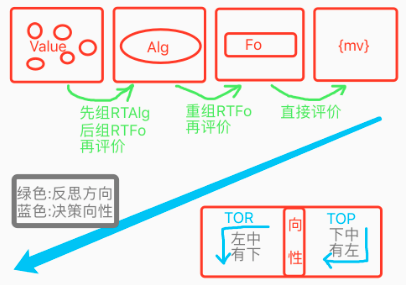
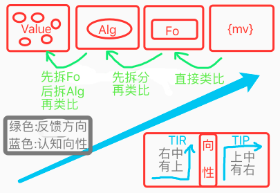

# 测试 & 细节改动 & 训练

<!-- TOC -->

- [测试 & 细节改动 & 训练](#%E6%B5%8B%E8%AF%95--%E7%BB%86%E8%8A%82%E6%94%B9%E5%8A%A8--%E8%AE%AD%E7%BB%83)
  - [n19p1 规划性训练2](#n19p1-%E7%B2%BE%E7%BB%86%E5%8C%96%E8%AE%AD%E7%BB%832)
  - [n19p2 TIR_Alg_FromRT算法迭代](#n19p2-tir_alg_fromrt%E7%AE%97%E6%B3%95%E8%BF%AD%E4%BB%A3)
  - [n19p3 反向反馈类比](#n19p3-%E5%8F%8D%E5%90%91%E5%8F%8D%E9%A6%88%E7%B1%BB%E6%AF%94)
  - [n19p4 外类比迭代: 正向反馈类比](#n19p4-%E5%A4%96%E7%B1%BB%E6%AF%94%E8%BF%AD%E4%BB%A3-%E6%AD%A3%E5%90%91%E5%8F%8D%E9%A6%88%E7%B1%BB%E6%AF%94)
  - [n19p5 规划性训练3](#n19p5-%E7%B2%BE%E7%BB%86%E5%8C%96%E8%AE%AD%E7%BB%833)

<!-- /TOC -->

***

### n19p1 规划性训练2
`CreateTime 2020.04.06`

> 说明: 继续note18的训练进度;

| 19011 | 训练步骤细节分析版: | STATUS |
| --- | --- | --- |
| **A组** | 目标: `果可吃` | 独立可训 |
| A1,2 | **直投,直投** | T |
| A3 | **重启,移动,并直投** | T |
| **B组** | 目标: `远果不能吃+模糊识别` | 独立可训 |
| B4,5 | **重启,远投,马上饿,马上饿** | T |
| B6 | **重启,远投(投向与A6不同的方向),马上饿** | T |
| B7 | **返回,重进成长演示页,远投** | T |
| **C组** | 目标: `学习飞行,可解决距离的常识+内类比` | 独立可训 |
| C8 | **重启,远投上,摸翅膀上** | T |
| C9 | **再摸...(从各种飞行角度,发现与距离的变化的映射)** | 暂略 |
| **D组** | 目标: `决策,并输出飞行离坚果更近` |  |
| D10 | **重启,远投上,马上饿** | 依赖ABC组 |
|  | =>行为化输出吃,而不是飞,应该从`远果,吃`中学习到,远果不能吃 `BUG_1`; |  |
|  | =>MC_Value到RelativeValue行为化 `BUG_2` |  |
| D11 |  |  |

| BUG | STATUS |
| --- | --- |
| 1. 远投后,MC行为化结果为`吃`,而不是`飞`的问题; |  |
| 2. 下投坚果,行为化为`飞上`,导致更飞远了; |  |
| > 分析: 小鸟只经历过飞上,离上坚果更近,所以这里要加入对方向的判断,抽象出不同方向坚果进行不同方向飞行的知识; |  |

<br><br><br><br>

### n19p2 TIR_Alg_FromRT算法迭代
`CreateTime 2020.04.06`
> 因为在精训D10时,发现M特化值:`经266`,在TIR_Alg_FromRT()时,重组[经266,高5],识别后,得到[距20,经266,高5],其中杂质`距20`导致评价失败;所以本节对TIR_Alg_FromRT算法进行迭代;

| 19021 | 算法变动说明 |
| --- | --- |
| 1 | 去除fuzzy模糊匹配,仅将match返回; |
| 2 | 返回结果必须包含mUniqueValue特化值; |

| 19022 | 改动后,测试与BUG |
| --- | --- |
| **BUG** | 当mUniqueValue=`距20`,same_ps=`w5,h5,g1`时,rtAlg=`w5,h5,g1,距20`,执行新版识别后,发现根本找不到距20的,全含的坚果,因为在抽象时,距20早已被去除; |
|  | 分析: 此问题关键在于,识别无法成功,我们需要更多抽象的常识,我们可以通过以下两种途径来获取: |
|  | 途径1: 认知阶段,更多确切的常识 (依赖更多经历,进行外类比); |
|  | 途径2: 决策反馈,更多的对确切信息的价值指向; |
| **向性分析** | 综上,我们需要整个系统的角度来分析此问题的解 |
|  | 1. 决策,向性下,从具象中找方案; |
|  | 2. 反思,向性上,从抽象中找评价; |
| **总结** | 本bug最大的原因,是反思时,无法从抽象中,匹配到确切的价值指向,导致评价失败; |
| **疑难点** | 而`距20`这种很具体的信息,在外类比抽象时,又极易被丢失掉,这个矛盾导致bug; |
| **解决** | 那么只要我们可以对导致反价值的信息进行直接抽象,即可解决此问题,故我们可以采取将预测与反馈之间进行类比,来实现此需求,`转至19023`; |

| 19023 | 从系统TO角度,分析抽象不足的问题; |
| --- | --- |
| 决策与反思示图 |  |
| 说明 | 绿色: 根据MModel识别与预测,进行反思评价; |

| 19024 | 从系统TI角度,分析抽象不足的问题; |
| --- | --- |
| 认知与反馈示图 |  |
| 说明 | 绿色: 根据MModel识别与预测,进行反馈认知; |
| 说明2 | 反馈imv与预测mModel.mv,根据同反向,产生同向和反向两种反馈类比; |
| 说明3 | 因同向反馈类比与现有的analogy_Outside()类似,故现在我们只写Feedback_Diff(); `转至n19p3` |

<br><br><br><br>

### n19p3 反向反馈类比
`CreateTime 2020.04.06`

**1. 简介:**   
　　在TIP时,假如反馈的imv与mModel的预测不符,会触发反向反馈类比(以下简称反向类比),以快速获取非常确切的抽象常识;本节从此出发,设计此类比算法;  

**2. 曾用名:**
1. 占位规律,参考:n13p15;
2. 找不同,参考:n15p15, n15p17;

| 19031 | 不相符的原因,归咎于两种: |
| --- | --- |
| **第1种** | 该出现的(`概念`/`稀疏码`)未出现; |
| 举例 | 玩成语接龙,以张三时未接上; |
| **第2种** | 不该出现的(`概念`/`稀疏码`)出现; |
| 举例 | 一直能赢,今天李四加入,我们输了; |

```objective-c
//19032 伪代码;
+(void) analogy_Feedback_Diff:(AIFoNodeBase*)mFo p:(AIFoNodeBase*)pFo{
    if(不符合预测){ //指mMv和pMv同类型不同向 (一正一负);
        /** 第1级: 类比fo.content_ps;
          *  M:[abcd]->{mv+}
          *  P:[a3bcxyz]->{mv-}
          *  ms:[d]->{mv-/4}; (价值影响权重=ms数/M数);
          *  ps:[3xyz]->{mv-*4/7}; (价值影响权重=ps数/P数);
          */

        /** 第2级: 类比alg.content_ps;
          * M:[(w1),(d5,h6)]->{mv+};
          * P:[a,(w1,b2),(d5,h3)]->{mv-};
          * ms:[(h6)]->{mv-/2};
          * ps:[a,(b2),(h3)]->{mv-*3/3}
          */

        //3. 构建: 概念,时序和MV;
    }
}
```
***

| 19033 | TODO | STATUS |
| --- | --- | --- |
| 1 | 瞬时记忆中放match而不是proto; |  |
| 2 | 为Feedback算法的结果,制定新的时序类型 (同时新类型的refPorts) (可考虑先由ds/at来做类型,不改refPorts,取指定类型的refPorts时可由指针标识进行类型筛选); |  |

| 19034 | 测试 |
| --- | --- |
| 关键问题 | 因反向类比的调用频率太低`参考19041`,故不能单靠此来解决的抽象不足问题`参考19022`; |
| 解决方式 | 对正向类比迭代 `转n19p4` |

<br><br><br><br>

### n19p4 外类比迭代: 正向反馈类比
`CreateTime 2020.04.10`

**简介:**   
　　因反向类比,并不能单独支撑起抽象不足的问题`参考19034`,所以本节将对正向反馈类比(以下简称:反向类比)进行迭代;

| 19041反馈类比对比 | 数据全面性 | 确切化速度 | 调用频率 | 抽象确切度 |
| --- | --- | --- | --- | --- |
| 正向反馈类比 | 好 | 慢 | 经常 | 常模糊 |
| 反向反馈类比 | 差 | 快 | 很少 | 常确切 |

| 19042 | 迭代分析 |
| --- | --- |
| 1 | 瞬时记忆新增一份matchAlg序列,并以此构建mProtoFo; |
| 2 | 用mProtoFo替代正向类比中的protoFo; |
| 3 | 用shortMatchModel替代正向类比中的assFo; |
| 注: | 原有瞬时序列和protoFo不变,只是新增matchAlg瞬时序列和mProtoFo; |

| 19043 | 训练计划 | 解说 |
| --- | --- | --- |
|  | A1(向3,距20,位8)->{mv-} |  |
|  | A2(向3,距20,位7)->{mv-} | 位置最善变 |
| A1:A2 | absA3(向3,距20)->{mv-} |  |
|  | A4(向1,距50)->{mv-} | 方向也易变 |
|  | A5(向1,距20)->{mv-} |  |
| A3:A5 | absA6(距20)->{mv-} | 距20不能吃 |
| A4:A5 | absA7(向1)->{mv-} | 向1不能吃(共经历2次) |
|  | A8(向1,距0)->{mv+} |  |
| A7:A8 | absA9(距0)->{mv+} | 反向类比,距0可吃 |

<br><br><br><br>

### n19p5 规划性训练3
`CreateTime 2020.04.10`
> 最近迭代了正反向反馈类比,本节重新规划规划性训练步骤,并逐步训练;

| 19051 | A组 | 目标:果可吃 `内类比,概念绝对匹配,时序识别,正向类比` |
| --- | --- | --- |
| A1 | 直投,直投 | absA1[pos38,dis0...]->{mv+},`识别概念,识别时序,正向类比` |
| A3 | 重启,移动,并直投 | absA2[dis0...]->{mv+} |

**A组BUG:**
  1. 测试shortMatchFo生成后,影响到了原来的外类比,因为原有外类比,的assFo全部联想成了matchFo,分前进和后退两个解决方法:
    * **前进方法:** 即原有的外类比已经不重要,直接去掉,到后面能成功识别时,再反过来训练正向反馈类比;
    * **后退方法:** 想办法使shortMatchFo不要影响到旧有外类比方法;
    * **解决:** 选择前进,不走回头路,如下三条改动;
      - 更及时的持久化: 只要TIP即持久化生成fo和mvNode;
      - 识别更早就工作: TIR_Alg和TIR_Fo在第二次输入时,即开始工作;
      - 停掉原有外类比: 彻底停掉旧有的外类比调用;
  2. 空场景输入,导致mModel.matchAlg和matchFo变没,进尔导致外类比无法执行;
    * **分析:** 现在瞬时序列不清空,所以并不需要空场景输入;
    * **解决:** 因为不存在绝对的空场景输入,空场景也无法识别成,故不对空场景识别;

**A组改动:**
  1. 新的正向反馈类比,需要第一次输入的概念在TIP时就持久化; T
  2. 新正向反馈类比,需要第二次输入时,识别就开始工作; T
  3. 瞬时记忆中不仅放parent,也要放subAlg (parent是具象节点,无法被识别); T
  4. 在TIR_Alg_FromMem的checkItemValid中,不需要处理parent层了; T
  5. 不对空场景parentAlg进行识别,因其会导致A组BUG2问题; T
  6. 将瞬时记忆中的parent去掉; `暂不做`
  7. 支持多条ShortMatchModel的保留,以及反馈类比学习; T

| 19052 | B组 | 目标:远果不能吃 `反向类比,概念局部匹配,模糊匹配` |
| --- | --- | --- |
| B4 | 重启,投右,马上饿 | absA8[pos19,dis7...]->{mv-} |
| B6 | 重启,投左,马上饿 | absA10[...]->{mv-} |
| B7 | 返回,重进成长演示页,远投 | 识别matchA10(g255,size5),fuzzyA11 |

**B组BUG:**
  1. 右扔马上饿,左扔马上饿,概念无法局部匹配,因为`局部匹配`需要`全含抽象节点`,但`抽象`需要`反馈类比`,`反馈类比`又依赖`概念局部匹配`,形成死循环,无法切入;
    * **分析:**
      - 找切入循环的点,打破死循环,建议从类比切入;
      - 反馈类比,依赖TIP和识别预测,故尝试向微观一级;
    - **解决方案1:** 在TIR中,写不依赖TIP的概念类比算法,步骤如下;
      - 第1步: 在TIR中,识别非全含但与inputAlg最相似的概念assAlg;
      - 第2步: 对inputAlg和assAlg类比,并抽象absAlg;
      - 第3步: 将absAlg作为matchAlg概念识别结果返回;
      - **质疑:** 此时的matchAlg未指向时序和价值,故依然无法用于反馈类比,有点太空洞;
    - **解决方案2:** 从TIP切入,此时知道`方案1`中,matchAlg的时序和价值了;

| 19053 | C组 | 目标:学习飞行 `内类比` |
| --- | --- | --- |
| C8 | 重启,投上,飞上 | F1[飞上,距小] |
| C9 | 再摸... | 暂略 |

| 19054 | D组 | 目标:飞行行为 `决策,时序反思,概念反思` |
| --- | --- | --- |
| D10 | 重启,远投上,马上饿 |  |

<br>
