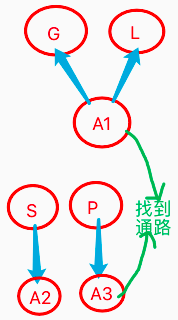

# v2.0版本三测
　　本章对v2.0进行第三轮测试训练，此前一测为2019年5月，二测为2019年12月，本轮改进主要是在上轮二测后，改进了以下几个方面:
  1. 反向反馈类比，更快更全面的抽象。
  2. 以及决策期对网络更全面的使用（主要是SP方面）。
  3. 对短时记忆更全面的支持。
  4. 以及对外循环更好的支持完善。

　　所以本次三测，或有望成为发布v2.0前的最后一轮测试，且在上轮二测中已经基本测通了认知期的代码，以及测了大多数决策期的代码。

***

<!-- TOC -->

- [v2.0版本三测](#v20版本三测)
  - [n20p1 三测: 规划训练1](#n20p1-三测-规划训练1)
  - [n20p2 三测: 规划训练2](#n20p2-三测-规划训练2)
  - [n20p3 三测: 耗时BUG](#n20p3-三测-耗时bug)

<!-- /TOC -->

***

### n20p1 三测: 规划训练1
`CreateTime 2020.06.06`

| 20011 | 训练步骤细节分析版: | STATUS |
| --- | --- | --- |
| A | 果可吃 | T |
|  | **1. 直投,飞右上,直投** | T |
| B | 远果不能吃 | T |
|  | **1. 重启,远投右,饿** | T |
|  | **2. 重进成长页,远投右** | T |
| C | 学飞 |  |
|  | **1. 重启,远投右,飞右** |  |
| D | 用飞 |  |
|  | **重启,远投上,马上饿** |  |

**20012完成标记**

* A组: 果可吃
  - 直投,飞右上,直投
    ```c
    //类比出无经纬果可吃;
    //1. 正向类比-抽象时序
    STEPKEY------------------------ 正向反馈类比 START ------------------------
    F8[A4(),A5(速0,宽5,高5,形2.5,距0,向→,红0,绿255,蓝0,皮0,经199,纬375),A1(吃1),A6()]->M3{64}
    F3[A1(速0,宽5,高5,形2.5,经207,纬368,距0,向→,红0,绿255,蓝0,皮0),A1(吃1),A2()]->M1{64}
    STEPKEY--->> 构建时序:F11[A10(速0,宽5,高5,形2.5,距0,向→,红0,绿255,蓝0,皮0),A1(吃1)]->M7{64}
    //2. 正向类比-抽象概念
    STEPKEY—> 构建概念:A10(速0,宽5,高5,形2.5,距0,向→,红0,绿255,蓝0,皮0)
    STEPKEY具象1:A5(速0,宽5,高5,形2.5,距0,向→,红0,绿255,蓝0,皮0,经199,纬375)
    STEPKEY具象2:A1(速0,宽5,高5,形2.5,经207,纬368,距0,向→,红0,绿255,蓝0,皮0)
    ```
* B组: 远果不能吃
  - 远投右
    ```c
    //B1-远投 (预测吃可饱);
    STEPKEY时序识别: SUCCESS >>> matchValue:0.500000 F11[A10(速0,宽5,高5,形2.5,距0,向→,红0,绿255,蓝0,皮0),A1(吃1)]->M7{64}
    //B1-饿 (真实为饿)
    STEPKEY------------------------ 反向反馈类比 START ------------------------
    STEPKEY----> 反向反馈类比 CreateFo内容:F2[A1(距0),A1(吃1)]->M10{64}
    STEPKEY----> 反向反馈类比 CreateFo内容:F2[A1(距46,经202,纬508)]->M13{-51}
    //B1-进R+,输出吃,但并不能解决问题;
    -> SP_Hav_isOut为TRUE: A1(吃1)

    //B2-远投右 (预测更饿)
    STEPKEY时序识别: SUCCESS >>> matchValue:1.000000 F13[A7(速0,宽5,高5,形2.5,向→,红0,绿255,蓝0,皮0,距54,经191,纬531)]->M8{-51}
    //B2-进R- (进入SP行为化,得到了GLDic,但失败了,因为此时的行为应该是飞近,但没学过飞)
    ------SP_GL行为化:距37 -> 距0
    //B2-进R+ (循环前两帧,一帧越界`参考bug7`,一帧输出吃`同B1`)
    <警告> 行为化概念无效
    -> SP_Hav_isOut为TRUE: A1(吃1)
    ```
* C组: 学飞
  - 远投右,飞右
    ```c
    //C1-飞右 (进入SP-GL行为化)
    ------SP_GL行为化:距52 -> 距0
    //BUG-发现GL找不以索引glAlg,导致行为化失败;
    ```


| 20013_BUG | STATUS |
| --- | --- |
| 1. 活跃度消耗在决策每轮循环调用之前,导致决策循环完未消耗活跃度; | T |
| 2. demand.fo不应期不工作,导致每轮循环联想同一解决方案; | T |
| 3. 训练到C时,远投右,预测时序为mv-,应该进TOP.R-,但却进了P+; | T |
| 4. 训练到B1点击饿时,进了R+,而不是R- (预测为正,实际为负); | T |
| > 正常的,因为预测为正,所以会R+输出`吃` (虽然并吃不到); | T |
| 5. 当决策完成时,是否主动观察自身价值状态 (比如输出吃,观察饥饿状态是否变化); | T |
| > 暂不,因为尽量让imv自然发生,像吃时不会马上饱,而是有味觉吸引着继续; | T |
| 6. TOR.R-中indexOfAbsItem方法得到-1失败的bug | T |
| 7. 有outModel.actionIndex>fo.content.count的问题,导致"行为化概念无效"; | T |
| > 因为B组共三帧,最近一帧右投预测不能吃,R-行为化失败,因为不会飞; | T |
| > 倒数二帧,是B1的马上饿,输出吃,预测可饱,R+行为化失败,因为`吃`已输出,所以越界; | T |
| 8. C1训练右飞两次后,为何还是找不到距离变小索引; |  |
| > 分析原因: 因为在用pAlg索引找,未经历过飞至距0,所以无法找到; |  |
| > 修复方案: 改为由sAlg索引,找s出发,变小接近p; |  |
| > 经查,修改为sAlg依然没有glAlg,所以查内类比是否根本没构建`距变小`节点; |  |
| 9. C1飞右后一帧,被识别为距0果,导致前后内类比成了`距71->0`,这显然不对; |  |
| > 经查因为飞后一帧的速度!=0,所以无法全含,只能纯相似匹配,导致识别为距0果; |  |
| > 修复方案1: 飞到0,吃掉坚果->{mv+} |  |
| > 修复方案2: 训练不同方向飞 (速度也不同),从而抽象出无速度坚果; |  |
| > 执行: 将C1改为向各种方向飞,先抽象出无速坚果,再专注训练飞变近; |  |


<br/><br/><br/><br/><br/>


### n20p2 三测: 规划训练2
`CreateTime 2020.06.18`

> 上节中,因BUG8和9导致速>0的问题,本节调整训练方式,尝试找出更少步骤的新版训练步骤;

* **20021 >> A组-构建无速果,远果不能吃**
  - A1右投
    - `A1(速0,高5,经217,纬536,距56,向→,皮0)` `下简称A1`
  - A2饿
  - A3右飞
    - `A2(高5,经217,纬536,距56,向→,皮0,速-0.000002)`
    - matchA_Seem:`A1`
    - `F4[A1]`
    - matchF:`F2[A1]->M1{-51}`
    - `A3(高5,经217,纬536,向→,皮0,距52,速-9.980625)`
    - `F6[A1,A1]`
    - matchF:`F2`
  - A4右上飞
    - `A4(速0,高5,经217,纬536,向→,皮0,距52)`
    - `A5(高5,经217,纬536,向→,皮0,距50,速-6.417388)`
  - A5饿
    - 正向类比:`F2[A1]->M1{-51}`
    - 正向类比:`F10[A3,A4,A2(飞↗),A5]->M3{-51}`
    - 构建概念:`A12(高5,经217,纬536,向→,皮0)`
    - 构建时序:`F13[A12(高5,经217,纬536,向→,皮0)]->M7{-51}`
* **20022 >> B组-果可吃**
  - B1重启,直投
    - `A6(速0,高5,向→,皮0,经207,纬368,距0)` `下简称A6`
    - matchA_Seem:`A1`
    - `F14[A1]`
    - matchF:`F2[A1]->M1{-51}`
    - 反向类比:`F2[A1]->M1{-51}`
    - 反向类比:`F16[A6(速0,高5,向→,皮0,经207,纬368,距0),A1(吃1),A7()]->M8{64}`
    - 构建S:`F2[A1(经217,纬536,距56)]->M10{-51}`
    - 构建P:`F2[A1(经207,纬368,距0),A1(吃1),A7()]->M13{64}`
  - B2飞右上
    - `A2(飞↗)`
    - `F19[A1,A2(飞↗)]`
  - B3直投
    - `A10(速0,高5,向→,皮0,经199,纬375,距0)`
    - matchA_Seem:`A6`
    - `F20[A1,A2(飞↗),A6]`
    - matchF:`F16[A6,A1(吃1),A7()]->M8{64}`
    - 内类比:`F20[A1(速0,高5,经217,纬536,距56,向→,皮0),A2(飞↗),A6(速0,高5,向→,皮0,经207,纬368,距0)]`
      - 内类比 (大小) 前: 纬536 -> 纬368
      - 内类比 (大小) 前: 距56 -> 距0
      - 内类比 (大小) 前: 经217 -> 经207
    - 正向类比:
      - Con1`F16[A6(速0,高5,向→,皮0,经207,纬368,距0),A1(吃1),A7()]->M8{64}`
      - Con2`F22[A9(),A10(速0,高5,向→,皮0,经199,纬375,距0),A1(吃1),A11()]->M14{64}`
      - Abs:`F25[A24(速0,高5,向→,皮0,距0),A1(吃1)]->M16{64}`
    - B4,重启,右投,饿; `避免让小鸟以为右投就能饱`
    - B5,重启,右投,饿; `避免让小鸟以为右投就能饱`
* **20023 >> C组-训练飞**
  - C1:重启,远投右
    - `A12(速0,高5,纬536,距56,向→,皮0,经211)`
    - matchA_Fuzzy:`A1(速0,高5,经217,纬536,距56,向→,皮0)`
    - `F26[A1(速0,高5,经217,纬536,距56,向→,皮0)]`
    - matchF:`F23[A1,A2(飞↗),A6,A1(吃1)]->M15{64}` //此处BUG,应该预测远果不能吃才对;
  - C2:飞右
    - `A13(速0,高5,纬536,距56,向→,皮0,经211)`
    - matchA_Fuzzy:`A1(速0,高5,经217,纬536,距56,向→,皮0)`
    - `F27[A1(速0,高5,经217,纬536,距56,向→,皮0),A1(速0,高5,经217,纬536,距56,向→,皮0)]`
    - matchF:`F11[A1,A1,A1,A1]->M4{-51}`
    - 行为化topV2_R+:`-> SP_Hav_isOut为TRUE: A2(飞↗)`
  - C3:重启,右投一飞距离;
  - C4:右飞;

| BUG | STATUS |
| --- | --- |
| 2. 查下C1为何未预测到远果不能吃; |  |
| 3. 在B3时,对F20[]进行内类比,得到距大到距0,变小,查下这里为什么会有距50,因为B组都是直投; |  |
| > `F20[A1(速0,高5,经211,纬518,距50,向→,皮0),A2(飞↗),A6(速0,高5,向→,皮0,经207,纬368,距0)]->F2[A2(飞↗),A1(纬小)]` |  |
| > 查下,F20何来,或者说A1为什么会出现在此处; |  |
| 4. 在C2时,行为化先输出了`飞右上`,后输出了`吃`,查下为什么飞右上后,直接就输出吃了?因为飞右上,并没有直接让坚果的距离为0,此时是吃不到坚果的; |  |
| 5. 输出飞右上行为后,并没有解决Demand,却中止的问题; `转至todo2` | T |
| 6. 在B组之后,需要插入右投马上饿,否则会将C1的远果预测为mv+,查下为什么? |  |
| 7. 在C4飞到距离0时,为什么反而识别成了距7果? |  |

| TODO | STATUS |
| --- | --- |
| 1. 用于描述外观的:`红绿蓝角宽高`,调试时看着眼累,可保留`高`,其它去掉,不影响且直观; | T |
| 2. DemandModel.status完成,只会发生在两种情况下,1是任务被抵消(如饱腹感),2是活跃度为0(如想不到方法了); |  |
| 3. 对飞行8个方向的调试,要支持根据坚果方向,飞向不同方向,以保证飞近; |  |
| 4. 测试_GL行为化,找不到glAlg的BUG,是否ok了; |  |
| > 经测,依然无法联想到glAlg,测试方式为将B组后,插入,远投右,马上饿,重启三步; |  |
| 5. 对决策系统,写打印日志,进行测试; |  |
| 6. 测试任务未完即断的问题 (已修复bug,但还没测); |  |


<br/><br/><br/><br/><br/>


### n20p3 三测: 耗时BUG
`CreateTime 2020.06.24`

| 20031 | 找不到glAlgBUG; |
| --- | --- |
| 简介 | 无法联想到glAlg的bug,因为`SP构建线`和`GL构建线`本来就不同,所以找不到glAlg; |
| 示图 |  |
| 图解 | 1. GL和SP的构建并非同时,但从理性考虑,其越相似,GL也同时可对P有效; |
|  | 2. 用A3找A1,优先从纵向`找抽具象有关系`的,其次用`相似度匹配`个有相似的; |


<br/><br/><br/><br/><br/>
