# v2.0版本四测、五测

> 注:
> 1. 本文seem表示part局部匹配;
> 2. FC表示决策流程控制缩写;

***

<!-- TOC -->

- [v2.0版本四测、五测](#v20版本四测五测)
  - [n21p1 四测: 规划训练](#n21p1-四测-规划训练)
  - [n21p2 反省类比测试-前(deltaTimes记录,触发器,ActYes流程控制等)](#n21p2-反省类比测试-前deltatimes记录触发器actyes流程控制等)
  - [n21p3 特征模块迭代计划](#n21p3-特征模块迭代计划)
  - [n21p4 反省类比测试-后(生成SP,抽象SP,与PM应用SP)](#n21p4-反省类比测试-后生成sp抽象sp与pm应用sp)
  - [n21p5 四测:规划训练2](#n21p5-四测规划训练2)
  - [n21p6 反省递归](#n21p6-反省递归)
  - [n21p7 特征模块迭代计划2](#n21p7-特征模块迭代计划2)
  - [n21p8 四测:规划训练3](#n21p8-四测规划训练3)
  - [n21p9 迭代TIR_Alg](#n21p9-迭代tir_alg)
  - [n21p10 迭代getInner1Alg](#n21p10-迭代getinner1alg)
  - [n21p11 迭代内中外类比](#n21p11-迭代内中外类比)
  - [n21p12 神经网络迭代计划](#n21p12-神经网络迭代计划)
  - [n21p13 好奇心](#n21p13-好奇心)
  - [n21p14 五测:规划训练](#n21p14-五测规划训练)
  - [n21p15 规划决策](#n21p15-规划决策)
  - [n21p16 流程控制-整理递归方式](#n21p16-流程控制-整理递归方式)
  - [n21p17 继续五测](#n21p17-继续五测)
  - [TODOLIST](#todolist)

<!-- /TOC -->

***

## n21p1 四测: 规划训练
`CreateTime 2020.09.01`

| 21011 | 简化训练步骤 |
| --- | --- |
| 1 | `直投,右下飞,直投,边吃边飞至右上` |
| 2 | `重启,右投,飞至坚果,吃掉` |
| 3 | `重启,右投,马上饿` (小鸟自行飞到坚果并吃掉); |

| 21012 | 简化训练步骤-多向版 |
| --- | --- |
| 1 | `直投,右下飞,直投,边吃边飞至右上` |
| 2 | `重启,右投,飞至坚果,吃掉`,`右上投,飞至吃`,`左下投,飞至吃`... |
| 3 | `重启,右上投,马上饿` (小鸟自行飞到坚果并吃掉); |

<br><br><br>

## n21p2 反省类比测试-前(deltaTimes记录,触发器,ActYes流程控制等)
`CreateTime 2020.09.01`

| 21021 | BUG |
| --- | --- |
| 1 | ATHav时序的,deltaTimes和mvDeltaTime为0的BUG (参考21022); |
| 2 | 将训练第3步右投果识别为M有向果,所以MC时失败,因为C为无距无向果; |
| 3 | 第3步改成左投,成功识别为`无距无向果`,但马上饿找到-mv解决方案 (转21024); |

| 21022 | BUG1-deltaTime为0; T |
| --- | --- |
| 示图 | 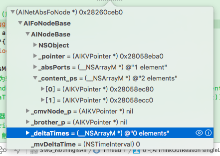 |
| 总结 | 修复getDeltaTimes()中多个BUG,现仍为0的情况参考fo.deltaTimes注释 |

| 21023 | BUG2-MC中mIsC失败; |
| --- | --- |
| 示图 | 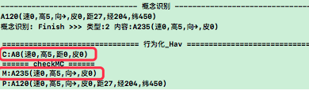 |
| 方案1 | **将M识别为无向果M[速0,高5,皮0],即可;** |
|  | 方案1解析: 参考20172-方案2 ↓↓↓↓↓; |
| 结果 | **将第3步改成左投,可成功识别为`无距无向果`;** |
| 方案2 | **MC中不判断mIsC,而是判断MC二者的absPorts前三条,有交集;** |
|  | 方案2解析: M和C未必是抽具象上下层关系,可能是同级关系,因为后面要执行PM,所以应该广入口,窄修正,所以选择方案2,实例如下: |
|  | 实例: 奶奶听到孙女给同学打电话,说想吃`治愈系水果`,所以拿一根香蕉给孙女; |
|  | 1. 孙女:"我不要吃香蕉"; |
|  | 2. 奶奶:"你不是要吃水果吗?" |
|  | 3. 孙女:"是治愈系水果,香蕉不是" |
|  | 4. 奶奶:"什么是`至于是水果`?" |
|  | 5. 孙女:"就是甜的" |
|  | 6. 奶奶:"把香蕉切开,拌了点白糖,然后递给孙女;" |
| 解析 | 1. 例中,`治愈系水果是C`,那根`实际的香蕉是P`,`香蕉是M`,`水果是S` |
|  | 2. 显然,MC非抽具象关系,但奶奶认为M和C都是S,所以就拿给孙女; |
|  | 3. 当孙女反馈后,奶奶又在PM中,对香蕉进行特征修正,加了白糖 ↓↓↓↓↓; |
| 实测 | **实测显示,MC是同级,但并不是有共同抽象,而是有共同具象;** |
| 复现 | 按着21012训练,第3步改为右投,即可复现; |

| 21024 | BUG3-P+的解决方案为负价值; |
| --- | --- |
| 示图 | 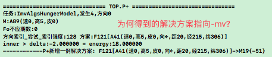 |

| 21025 | 最后一帧isOut=true,导致反省类比未触发的BUG; T |
| --- | --- |
| 日志 | 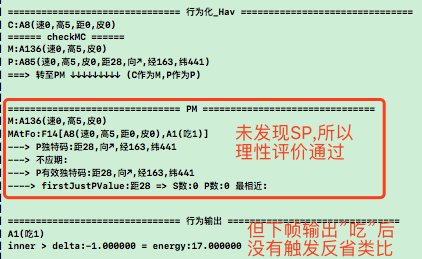 |
| 说明 | 在21012训练后,第三步没飞过去,而是直接原地空吃; |
| 分析 | PM未发现SP,所以理性评价通过,未飞是正常的; |
| 问题 | 但下帧输出(即空吃)后,却没有触发反省类比; |
| 原因 | 经查,行为输出时isOut=true未触发ActYes,也没触发Finish; |
| 解决 | 使行为输出时,触发Finish,从而递归至base,即demand时可以触发ActYes; |
| 复现 | 按着21012训练,即可复现; |
| 总结 | 将流程控制fo.finish直接转至fo.actYes后解决 (参考流程控制Finish方法的注释version-20200916); |

| 21026 | ActYes时,决策系统还在继续P+模式继续递归着; T |
| --- | --- |
| 日志 | 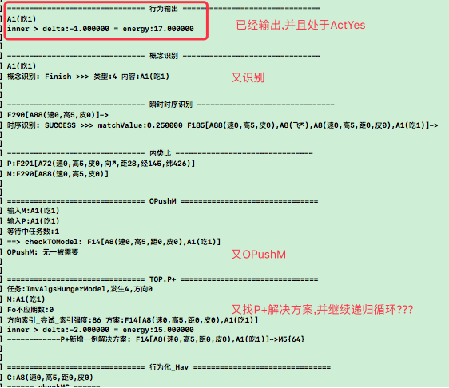 |
| 说明 | 在21012训练后,ActYes时,当前任务还在反复思考F14方案; |
| 分析 | 估计是流程控制问题,新输入又尝试解当前任务,未判断其ActYes状态; |
| 解决 | 在ActYes中的解决方案(如F14),继续等待,而不是反复决策; |
| 结果 | 将isOut=true时的情况,先改为ActYes,等输出行为后,再改为Finish即可; |

| 21027 | 反省类比算法中,明明PM有四个特有码,却取到0个; T |
| --- | --- |
| 问题 | 经查,取fo.subAlg.justPValues是没有码的; |
| 解决 | 经查,短时记忆取fo.subAlg.subAlg.justPValues才可以; |

<br><br><br>

## n21p3 特征模块迭代计划
`CreateTime 2020.09.10`

　　在v3.0版本时，我们将支持多码特征，从而对特征的类比抽象有所支持，本节提前进行些记录，特征的类比，不仅包含特征间纵向类比，也包含稀疏码间的横向类比，从而形成更多样的特征。而感官算法上只需像以往所述，将稀疏码集输入即可。

　　前段时间有个新闻，是说把视觉接到听觉脑区，照样工作，但需要一定的时间来慢慢形成。

　　这里其实显示出皮层的可塑性，说明视觉算法输入时我们只提供稀疏码信息，然后通过组合方式得出模糊特征，再通过互相类比得到抽象特征。以此得到外形等特征信息（组分）。

　　这与当下的概念和时序模块非常类似。但目前代码上还是仅支持单码特征，在3.0版本时，面向现实世界的迭代中，再对特征模块进行多码支持与完善。所以本节暂止，v3.0时再续。

我语音中只是举例说明,比如说咱们两个有个算法,得出稀疏码仅为:"灰度值",

* 示例: 解释下图中我们如何认知飞机特征,以及识别飞机头;
  - 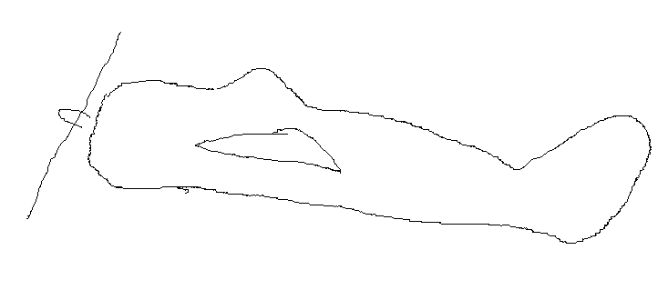
  - 注: 本问题和图来自`@张仙_用友`提问;

```
* 假设:现感官视觉算法中:
  1. 灰度0-1表示白到黑;
  2. xy表示坐标;

* 第一次看到飞机得到最初的稀疏码可能为:
x0,y1,灰1
x2,y1,灰0
x1,y1,灰1
x2,y2,灰0
x2,y3,灰0
x1,y2,灰1
x2,y3,灰1
x2,y4,灰1
...

* 通过色值类比发现:
x0,y1,灰1
x1,y1,灰1
x1,y2,灰1
x2,y3,灰1
x2,y4,灰1

* 通过坐标类比发现 (外形):
灰1路径为: 原点-> 右1 -> 上1 -> 右上1.4 -> 上1

* 当第二次,再发现飞机时,可能有所变化,比如:
飞机2的灰1路径为: 原点-> 右1 -> 上1 -> 右上2 -> 上1

* 两个外形,再进行类比,发现,抽象飞机3的路径为:
原点-> 右1 -> 上1 -> 右上1.4/2 -> 上1

* 当描述飞机头时,发现,路径为:
原点-> 右1 -> 上1

* 注:
  1. 当然,你也可以在此基础上,支持RGB,支持模糊匹配,支持亮度,等;
  2. 就是这种,最最基础的视觉算法,通过类比后,发现各种各样多样的特征;
  3. 以上多个稀疏码组成一个字典,多个字典的数组,为一帧输入;
```

<br><br><br>

## n21p4 反省类比测试-后(生成SP,抽象SP,与PM应用SP)
`CreateTime 2020.09.18`

| 21041 | SP的抽象,往往是方向而不是距离 `未构成BUG` T |
| --- | --- |
| 分析 | 因为只有8种方向,却有数百种距离,导致方向较容易抽象; |
| 待办 | 1. 实测下,是否果真如此,即方向更易被抽象,而距离不行; |
|  | 2. 分析下,此问题如何解决? |
| 分析 | 在SP中,无非是S或P有明确的,也有模糊的,各举一例如下: |
|  | 1. S更明确例: S为:`pos5,6,7` P为:`pos0,1,2,3,4,8,9,10` |
|  | 2. P更明确例: S为:`dis7,8,12,29,311` P为:`dis0` |
|  | 3. SP一样例: S为:`dir1,2,3,4,5,6,7,8` P为:`dir1,2,3,4,5,6,7,8` |
|  | 说明1: 只有S中fuzzy匹配到结果,才会到P中尝试找出较近的目标值进行修正; |
|  | 说明2: 所以S与P是明确还是模糊不再重要,因为说明1的运行,不受其影响; |
| 总结 | 问题中,距离与方向是否更容易抽象,并不重要,因为无论是否抽象,都在考虑范围,并且抽象强度也不那么重要,因为最终匹配时,是以fuzzy理性的模糊匹配的,这导致更接近的值排最前面,而不是强度最强的; |

| 21042 | BUG_同一fo执行多次触发,并反省类比 T |
| --- | --- |
| 说明 | 在测试中,发现同一个时序,进行了多次触发,并反省类比; |
| 如图 | 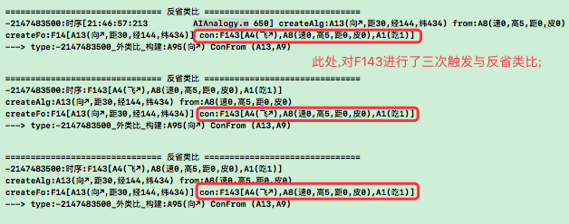 |
| 修复 | 经查共有两个地方会导致重复触发反省类比,改动如下; |
|  | 1. 为OPushM多次触发导致,对OPushM防止第二次触发即可; |
|  | 2. 行为输出调用Finish,推进流程控制也会触发反省类比所致,取消调用即可; |
| 总结 | 最终,改为仅由OPushM中,调用一次推进流程控制与反省类比; |

| 21043 | BUG_demand取到重复解决方案 T |
| --- | --- |
| 如图 | 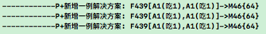 |
| 解决 | 共有4处,修改了3处; |
|  | 1. demand转移时,仅执行一次,而不是原来的一帧瞬时一次; T |
|  | 2. 新解决方案后,直接返回true中止,因为流程控制会接管此后流程; T |
|  | 3. ActYes的解决方案,加入到不应期,避免重复行为化; T |
|  | 4. ActYes的demand不再尝试新解决方案; `暂不改,如饭快好了,也先吃些零食` |


<br><br><br>

## n21p5 四测:规划训练2
`CreateTime 2020.09.21`

| 21051 | 因得不到P,PM测试受阻 `T` |
| --- | --- |
| 示图 | 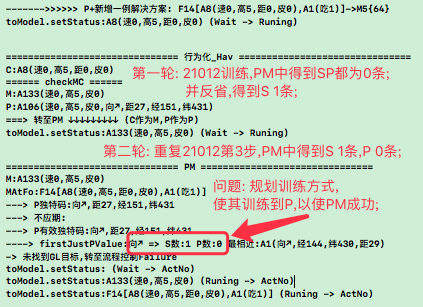 |
| 说明 | 在21012的训练方式中,发现只反省类比出S,而没有P,所以需改进训练方式; |
| 分析 | 因为21012训练的第1,2步中,正价值都是反射反应触发的,并无主动行为输出; |
|  | 所以,从未以mv+触发反省类比,所以也就未生成P; |
|  | 这形成了没P就没法成功,没成功过就不会生成P的死循环; |
| 解决 | 方案1: 在训练第2步时,尝试点击马上饿吃掉0距果,而不是摸嘴触发吸吮反射; |
|  | 方案2: 在正向反馈类比中,构建P; `需分析理论模型支撑,不能轻率这么做` |
| 结果 | 暂采用方案1,规划出21052的训练方案,见下表,方案2等待后续需求明确再说; |

| 21052 | 新规划训练步骤 |
| --- | --- |
| 1 | `直投,右下飞,直投,边吃边飞至右上` |
| 2 | `重启,右投,飞至坚果,马上饿`,`右上投,马上饿`,`左下投,马上饿`... |
| 3 | `重启,右上投,马上饿` (小鸟自行飞到坚果并吃掉); |

| 21053 | BUG-反省类比SP触发类型BUG和决策循环未停止的BUG `T` |
| --- | --- |
| 示图 | 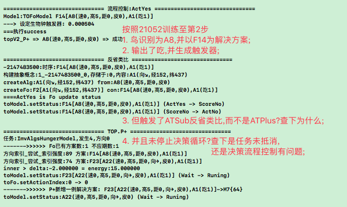 |
| 说明 | 1. 明明吃到坚果了,却反省类比S,而不是P的问题; |
|  | 2. 明明吃到坚果了,却没有抵消demand,也没有中止决策循环的问题; |
| 结果 | 经查,deltaTime单位为s,但在生成触发器时却当做ms来计算了,修改后好了; |
| 结果 | 关于决策循环未停止的问题,确是按ms算触发时任务善未抵消导致,修后好了; |

| 21054 | 反省类比P中出现`距6`的BUG `T` |
| --- | --- |
| 示图 | 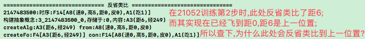 |
| 说明 | 如图所示,距6是上一位置,当前位置是距0,但反省类比P却在以距6处理; |
| 分析 | 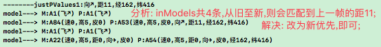 |
| 结果 | 如上图,将_Hav中改为`新帧优先`即可 (参考_Hav.200928注释); |

| 21055 | 反省类比P的内容经常为空的BUG `T` |
| --- | --- |
| 示图 | 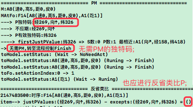 |
| 说明 | 经测反省类比中,常常因justPValues都被不应期掉,导致反省类比放空炮; |
| 复现 | 依21052训练至第二步,第二小轮,点击马上饿时,即可复现; |
| 分析 | 在PM中,发现三个独特码,都在`无需PM`时转为Finish,致其为不应期状态; |
| 示图 | 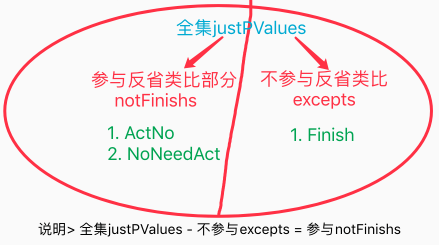 |
| 解决 | 代码中取excepts取错了,错成了左边的部分,所以导致反省的内容经常为空; |

| 21056 | 在PM中,取AIKVPointer.pointer导致闪退 `T` |
| --- | --- |
| 示图 | 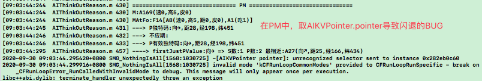 |
| 总结 | PM中,Alg与Pointer类型错乱导致,修复后ok; |

| 21057 | 第3步训练时,进入死循环的BUG |
| --- | --- |
| 示图 | 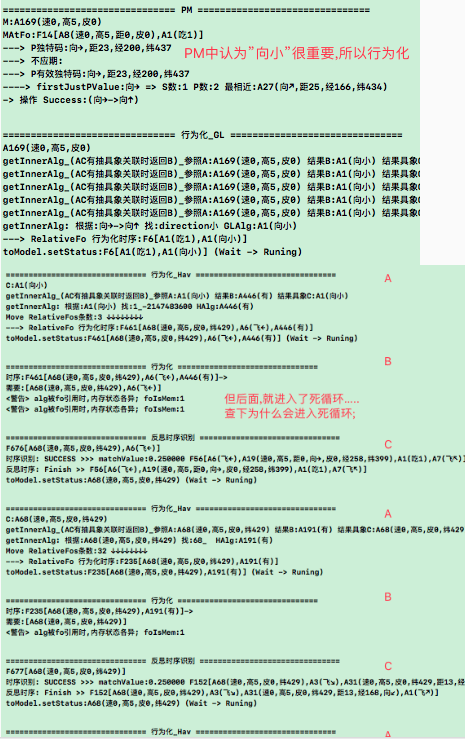 |
| 分析 | 1. `向小`并不重要,可能是PM经历太少导致 (因为P只有2条); |
|  | 2. 查下为什么会进入死循环 (训练至第3步,可复现); |
|  | 3. 似乎_GL太容易转到_Hav了,导致明明该是PM修正的问题,却变成了各种_Hav后乱飞 (猜测未实证); |

| 21058 | P中有距21的BUG |
| --- | --- |
| 示图 | 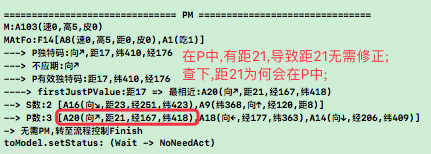 |
| 说明 | 如图,在P中有`距21`,导致距21无需修正,事实上距21显然不能直接吃; |
| 分析 | P在反省类比中构建,所以需通过`反省类比`,分析`距21`的P是从何而来的; |

| 21059 | PM独特码不在P中的BUG `T` |
| --- | --- |
| 示图 |  |
| 说明 | 如图,因为mIsC时,隔了层,所以M和MAtFo并非同层,导致"距0"要从M具象找; |
| 结构图 | 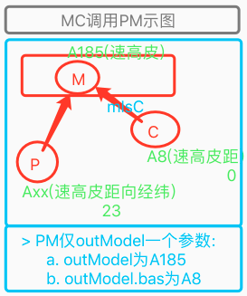 |
| 结果 | 优先从C中找距0,即解决; |

| 2105a | 同一解决方案的重试问题 `暂绕过问题` |
| --- | --- |
| 说明 | 同一解决方案,首次PM时无SP,但反省类比后有了SP,却未能及时重新PM |
| 示图 | 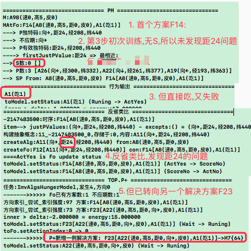 |
| 分析 | 解决方案1: 可以通过反省结果SP与`justPValues独特码`比较,如有同区,则说明发现了问题,则重置现执行中解决方案(从demand.sub删掉即可,只要不在不应期,自然会再次被取到,重执行),而不是使其失败; |
|  | 绕行方案2: 直接重启之,重训练第3步,相当于下次遇到任务时SP再生效; |
| 结果 | 方案1彻底但麻烦,先不做,执行方案2; |

| 2105b | PM中独特码方向_转移GL问题 |
| --- | --- |
| 示图 | 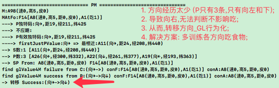 |
| 分析 | 多进行各方向吃食物的训练,即可使乌鸦知道,方向右不影响吃; |
| 方案 | 1. 训练第2步,多训练一些方向,尤其"右"; |
|  | 2. 使P有了各方向后,再训练第3步,看是否可以依各方向飞过去吃掉坚果; |
|  | 结果: 似乎训练后,并没有得到`右`; |

| 2105c | PM修正距离飞错方向的问题 `转至21081` |
| --- | --- |
| 示图 | 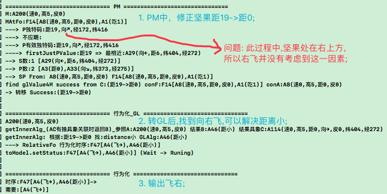 |
| 分析 | 调试下,在PM转移GL后,是否将`方向右上`的概念节点,传进去参与联想glFo; |
| 方案 | 将protoAlg传递到getInner1Alg()中,用于以下用途; |
|  | 1. 以使其筛选出合适的glAlg(如右上果,变近的经验); |
|  | 2. 帮其筛选合适的fo(如右上飞近右上果); |
| 实施 | 以上两条,需要实测得出答案 `转至21081`; |

| 2105d | 发现内类比时序中_总是缺了最新一帧数据 `T` |
| --- | --- |
| 说明 | 内类比缺最后一帧如:`P:F698[A178(向↙,距22..),A1(飞↙)]` |
| 分析 | mModel在赋值protoA和matchA后及时存至mModelManager中; |
| 总结 | 修后正常`P:F698[A178(向↙,距22..),A1(飞↙),A179(向↙,距13...)]` |


<br><br><br>

## n21p6 反省递归
`CreateTime 2020.09.24`

| 21061 | 思考支持结构化循环-反省递归 |
| --- | --- |
| 示例 | 1. 战败,反省敌方机枪手太厉害 |
|  | 2. 因为我方狙击手未干掉对方机枪手 |
|  | 3. 想到前两天,狙击手打篮球手受伤了 |
|  | 4. 通知狙击班长将篮球框拆掉; |
| 说明 | 例中,类似决策循环,做了反省循环,并最终找到原因; |
| 分析 | 广义上说,找出原因,是一个任务,其实这就是在做决策循环而已; |
|  | 但确实可以在下次打战前昔,通知狙击手不允许打篮球,即SP起作用; |

<br><br><br>

## n21p7 特征模块迭代计划2
`CreateTime 2020.09.28`

　　本节记录，源于群友@陈国冬 交流话题：关于“线”是否是先天算法。

| 21071 | 我的回答 |
| --- | --- |
| 主张 | 我并不反对先天“线”的作法，只是我一贯主张**感官算法越简单通用越好**。 |
| 回答 | 以`点`为单位，通过色值和点间相对位置来解决线的问题。 |
| 说明 | 关于这一点主张，我从17年一开始就是如此主张，至今未变。不仅线，如果我们现在认为“外形”是一个不可拆分的感官算法，那么外形算法也是可以被接入的。 |
| 优缺分析 | 只是越复合度高的感官算法，其通用性就越受限，这种受限越来越明显时，我们自然会去想办法迭代之，使之更通用。 |
| v2.0做法说明 | 当下认为什么是Ok的，就先这么写，只要理论上原则定了，模型的方向定了，其实后面大几率也就是这么个路子去迭代。 |
| 现有接口设计 | 但是我要说明的一点是，HE的内核在模型设计的接口上，已经具备了支撑现在做法，以及下版本做法。即：**HE的感官算法，只有一个要求，即转为稀疏码格式。** |
| 例1 | 如果我们将味觉算法，中的甜和咸的分区标识，都定为a23b，那么HE理论上就无法分辨甜和咸，因为二者的分区标识是一致的。 |
| 例2 | HE的听觉算法，假如只能够转换20000hz以下的声音，那么理论上，超过这个频率的声音，HE是听不到的。 |
| 例3 | HE的听觉算法，假如只能分辨出细粒度为10的声音，那么10005hz和10008hz对于HE而言就是一致的。 |
| v3.0做法计划 | 一组稀疏码输入为模糊,后以类比抽象来确切化,与`概念与时序`一致 |


<br><br><br>


## n21p8 四测:规划训练3
`CreateTime 2020.10.19`

| 21081 | getInner1Alg支持多向飞行问题 `转至21082` |
| --- | --- |
| 示图 | 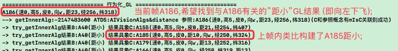 |
| 说明 | 在getInner1Alg中,判断A185与A186间mIsC关系显然不成立; |
| 分析 | 1. 因内类比仅针对protoFo,导致内类比的结果都太具象; |
|  | 2. 不够抽象所以mIsC失败,而构建抽象后,如`Fx[左下果,向左下飞]`,即可; |
| 方案1 | 构建GL抽象时,判断protoAlg的抽象matchAlg是否符合,符合也关联到GL; |
| 方案2 | 考虑增加多识别结果 (暂不增加尝试解决); |
| 结果 | 选定方案1,并转至`21082`处理; |

| 21082 | 内类比GL太具象问题 `以下至21115都围绕此问题进行迭代,已解决` |
| --- | --- |
| 示图 |  |
| 说明 | 构建GL抽象时,判断protoAlg的抽象matchAlg是否符合,符合也关联到GL; |
| 分析 | 即使改成A185向抽象找matchAlg,共同指向GL`距小`,依然不行; |
|  | 因现在matchAlg=`A8(速高皮)`,A8太抽象,必须先类比A185和A186得到Anew; |
| 方案 | Anew介于抽象和具象间,先TIR_Alg.Seem到A185,后外类比解决; |
| 暂停 | 暂停此处内类比迭代,转至n21p9做Seem识别迭代,并触发外类比得到ANew; |
| 问题 | 可否不建立Anew和GL的关联,而从Anew.conPorts中分析其是否`GL稳定`? |
|  | 答:不行,太麻烦,直接以Anew抽象指向GL的方式更好,即提前归纳学习好; |
| 代码 | 综上问题,所以我们对内类比GL时,将GL延伸到protoAlg.abs中; |


<br><br><br>


## n21p9 迭代TIR_Alg
`CreateTime 2020.10.21`

在21082中,发现必须先做TIR_Alg.Seem迭代,才可以产出`不过于抽象或具象`的Anew节点,所以本节以此需求对TIR_Alg迭代;

| 21091 | 需求分析与代码规划 `T` |
| --- | --- |
| 示图 | 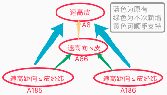 |
| 主说明 | 每次识别,改为产出两个结果:`1最大全含`,`2最模糊相似`; |
| 次说明 | 黄色的支持,对随后MC中判断mIsC有用; |
| 步骤 | 1. 根据A186识别,TIR_Alg.Seem,取到A185; |
|  | 2. 外类比`A186&A185`,得到A66; |
|  | 3. 再下次A187时,`最大全含`就成了A66,而非A8; |
| 关联 | 1. 对于`全含`的,直接进行抽具象关联; |
|  | 2. 对于`相似`的,先类比A1A2,再使A1A2关联至absA3; |

| 21092 | TODO:识别迭代计划`MutilMatchResult:多识别结果` |
| --- | --- |
| 1 | 无论是TIR_Alg还是TIR_Fo,只要将相似的seems(相似度排序)前limit条返回即可,全含的会排在最前面,非全含的也会在相对后面一些,然后都进行外类比,从而即保证旧抽象的加强,也保证新抽象随时浮现; |
| 结果 | TIR_Alg已完成,TIR_Fo以后再说; |

<br><br><br>


## n21p10 迭代getInner1Alg
`CreateTime 2020.10.21`

> TIPS: 当网络中某信息不知道应该延伸到哪些节点时,那么类比的结果就是其边界;

| 21101 | 迭代分析 `T` |
| --- | --- |
| 示图 | 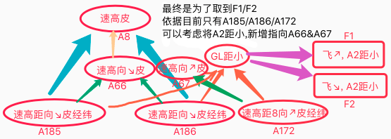 |
| 说明 | 问题1: 是否构建A2和A66&A67的关联; |
|  | 问题2: 如何最终输出F1/F2; |
| 分析 | getInner1Alg仅输出alg,且输出后会relateFos尝试跳转,故无法仅输出f1/f2 |
| 回答 | 第1步,可以`将A2与A66&A67关联`; |
|  | 并构建`A66&A67被fo引用关联`,以下用A66举例说明步骤: |
|  | 第2步,使A66有fo接收 `如F6[A66,飞↘,A66]`; |
|  | 第3步,使F6与GL时序关联 `如F3[A66,飞↘,A2距小]`; |
| 代码 | 1. 先到内类比中写第1步,再分析第2,3步 `转至21102`; |

| 21102 | 尝试用内中外类比,解决21101第2,3步问题 `转至21115` |
| --- | --- |
| 说明 | 在21101中第2,3步缺fo,根据时序识别找到seemFo,然后内中外类比可解决; |
|  | 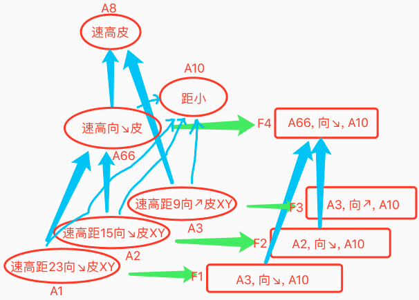 |
| 步骤 | 1. `A1:A2=>A66`以及`A8和A66的关联`由TIR_Alg完成; |
|  | 2. `F1:F2=>F4`由内中外类比完成; |
| 使用 | 3. getInner1Alg中,A66和A8判断mIsC成功,取回A66; |
|  | 4. 返回_GL后,取A66.refPorts,得到F4,无太抽具象问题; |
|  | 5. 返回_GL后,判断F4.GL抽象中,只有距小,没有距大,稳定性佳; |

| 21103 | GL节点具象指向太多 `T` |
| --- | --- |
| 说明 | 比如,各种方向飞行的具象都有,非常混乱; |
| 分析 | 因为GL节点去重了,所以导致具象指向太多; |
| 方案 | 在`方案1:GL时序首位,增加A66`,或者`方案2:GL节点不去重`; |
| 解决 | 选择方案1,在GL时序首位,增加A66; |
| 总结 | 已完成,由`TIR_Alg`和`内中外类比`分别完成了,类比构建A66,且加到GL中; |

<br><br><br>


## n21p11 迭代内中外类比
`CreateTime 2020.10.28`

> 在21102中,我们尝试使用内中外类比,来解决GL太抽/具象的问题,本节将围绕此问题展开,重点与HE现有做法相结合,分析怎样迭代比较好;

| 21111 | 内中外类比网络结构分析 `转至21113` |
| --- | --- |
| 现状 | 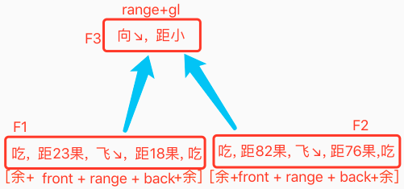 |
| 说明 | 1. 旧有内中外类比,其实是在类比F3 `仅针对range进行类比(缺fb)`; |
|  | 2. 如果改为F1:F2,则会多余出前后辍; |
| 方案1 | 改为F1:F2方式,步骤如下: |
|  | 1. 剔除当前时序(如F1),`前后辍多余`部分; |
|  | 2. 根据剩下的content_ps,分别索引找到refPorts: R集合 |
|  | 3. 根据F3取conPorts: C集合; |
|  | 4. 对R和C集合取交集,并按照稀疏码命中数,计数; |
|  | 5. 按命中数排序,取出mostSeem最相似的,做为F2; |
|  | 6. 对F1:F2剔除前后辍后的部分,做类比,并得出结果absF4; |
|  | 7. 将F4的range+GL,构建成F5 (GL抽象时序),与F4关联; |
| 说明 | 1. 此方案其实是重新执行了TIR_Fo,只是有GL的限定条件; |
|  | 2. 此方案能够有效得到F4,即不太抽具象的时序,并且,F4应该会包含A66; |
| 注 | 取seem类比时,可以延伸到概念->稀疏码中做相似判断; |
| 方案2 | 以当前GL具象指向的protoAlg为索引,进行assFo查找,转至`21113`; |

| 21112 | `已发与未发分裂模型` & `评价器与类比器的关系` |
| --- | --- |
| 已发与未发 | 1. 未发生的时序,识别后,用来做评价 (向性:左下) (如反思); |
|  | 2. 已发生的时序,识别后,用来做类比 (向性:右上) (如正向反馈类比); |
| 评价与类比 | 二者共同点是都是bool对比; |
|  | 二者不同点是类比是找规律,评价则是判断是否继续; |

| 21113 | 内中外类比迭代方案2 `T` |
| --- | --- |
| 简介 | 以当前GL具象指向的protoAlg为索引,向seemAlgs逐个进行assFo查找; |
| 旧做法 |  |
| 说明 | 对range倒序逐个取refPorts与GL.refPorts取交集,作为assFo外类比; |
| 新做法 | 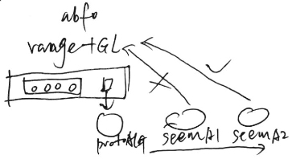 |
| 说明 | 对protoAlg的seemAlgs逐个尝试与GL.conPorts取交集,有效则取其fo作为assFo外类比; |
| 步骤 | 1. 将TIR_Alg中,seemAlgs返回成数组 (所有局部匹配排序后的结果); T |
|  | 2. 将内中外类比,改为新做法; T |
|  | 3. 将内中外类比中protoAlg与seemAlg的抽象absA,指向glAlg`转向21114`; |

| 21114 | 内中外类比迭代之_将BackConAlg集成到innerFo中 `转移21115`; |
| --- | --- |
| 简介 | 在21113中,已将内中外类比迭代至v2,但步骤3中,仍有些尾活,由本表来做; |
| 示图 |  |
| 说明 | 如图,用glFo:assFo外类比,有以下问题: |
|  | 1. glFo中不包含backConAlg,所以需单独做backConAlg:protoAlg=absA3; |
|  | 2. absA3所在时序,也需单独处理 (其实根本就缺这个fo); |
| 方案 | 1. 将backConAlg放到glFo中,即`range+backConAlg+glAlg`; |
|  | 2. 1.根据glAlg向glFo联想; 2.再向下分别与backConAlg.refPorts和seemAlg.refPorts取交,取得两个conFo; 3.再分别截出range+backAlg部分; 4.并进行类比,得出absFo; 5.再抽象指向glFo; |
|  | 3. 将内类比构建中,加一个`range+backConAlg`的中间fo,并标记为GL类型; |
|  | 4. 将glFo改为`range+backConAlg` (即方案3的中间fo直接替代glFo); |
| 分析 | `方案1改动较大,但一劳永逸 30%`; |
|  | `方案2太麻烦,且第1步性能就不好 0%`; |
|  | `方案3无性能问题,且改动也不大,但无法区分中间fo和glFo的区别 20%` |
|  | `方案4改动中等(有改有简化),无性能问题,可以考虑 50%` (选定,转至21115); |

| 21115 | 内中外类比迭代之_将BackConAlg集成到innerFo中 `T` |
| --- | --- |
| 简介 | 上表选定方案4,本表对此`画示图模型`与`代码规划`; |
| 示图 |  |
| 说明 | 如图,GLAlg仅负责始索引,其余部分全由backConAlg自行关联 (更理性); |
| 构建 | 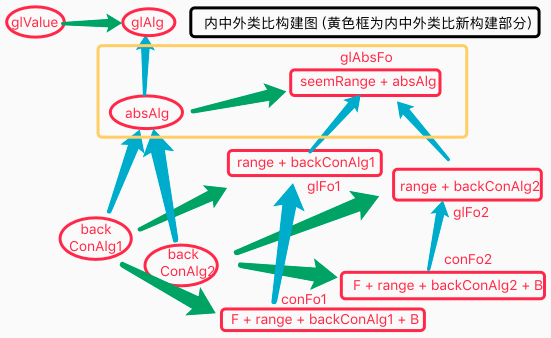 |
| 说明 | 图中黄框内,构建了gl类型的absFo,及末位类比构建absAlg,且指向glAlg; |


<br><br><br>

## n21p12 神经网络迭代计划
`CreateTime 2020.11.05`

在以往的Net设计中,分为横向五模块,纵向抽具象,但是这种分模块的方式,其实是为了前期方便开发的方式,之前我们也有过`概念嵌套`或者`时序概念化`的迭代想法,其实都是在尝试去除模块分隔,本节针对此展开进行迭代计划,但v2.0中,暂不做真实的代码实施;

| 21121 | Net迭代计划 |
| --- | --- |
| 1 | 根据hebb理论,同时输入的(新),可直接打成组,`即横向组分`; |
| 2 | 根据hebb理论,同时识别的(旧),类比后打成组,`即纵向抽象`; |
| 模块 | 此表中,将完全抛弃网络模块,来分析网络的两种关联关系动态构建网络; |
| 模块 | 此网不限模块数,可支持概念再组合概念(概念嵌套),如:`香蕉有果肉和皮`; |
| 过滤 | hebb像一个天然的过滤器,一层层的过滤着网络产生抽象组合; |
| 混合 | 此网可不严格区分fo和alg,在混合中只是对元素间`生物钟间隔有否`区分; |
| 控制 | 此网络更简单,而非更复杂,因为只需要更简单的控制器来控制; |
| 向性 | 此网络仅有两个向性; |
| 概念 | 据以往笔记`概念嵌套`其实也是一对多的关系,即香蕉抽象为:"果肉,果皮",即香蕉的再组合用absPorts实现 (当不区分横纵向后,这非常自然) `如下图:`; |
|  | 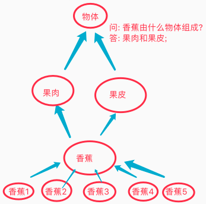 |
| 界线 | 模块间界线模糊了,即同时AFVP混合存在,`如[A我,F画出,V更红的,P红色]`; |
| 特性 | 模块各自的特性:`P特征是同区码组`,`A概念是特征组`,`F时序是先后`; |
| 组分 | 最自然的组分(时间):`P同区`,`A同时`,`F不同时`; |
| 抽具 | 最自然的抽具象(空间):`用类比对信息间筛出共同点,并抽象`; |

<br><br><br>

## n21p13 好奇心
`CreateTime 2020.11.07`

以往多次记录好奇心,今天群友@1815628171刘伟 问到好奇心的工作原理,所以更新一下;

| 刘伟 | 人类好奇的机制是什么？ |
| --- | --- |
| 我 | 好奇是想找到"未知"的答案,而其驱动力,就是对找答案的价值追求,与找到答案后的价值变化; |
| 我 | 而往往这种未知,都依赖外界由感观输入新的认知来完成,所以向外界去探索就成了解决好奇的惯用方法; |
| 我 | 说白了,`由价值驱动决策,由决策驱动行为` (好奇心驱动); |
| 我 | 好奇和AI系统本身的运行,是同一套东西,只是出发点不同,价值迫切度不同,导致我们对其意义不明确,才会对它疑问很大; |

<br><br><br>

## n21p14 五测:规划训练
`CreateTime 2020.11.07`

多向飞行训练,内类比GL太具象问题,导致飞行方向杂乱问题已经解决,所以本节再次回归到测试训练中,因为本次改动了`TIR_Alg()`,`内类比构建器`,`内中外类比`,`getInner1Alg()`等,改动中等,不过会影响到诸多流程,所以另起进行第五轮测试;

| 21141 | 新规划训练步骤4 |
| --- | --- |
| 1 | `直投,右下飞,直投,边吃边飞至右上` |
| 2 | `重启,右投,飞至坚果,马上饿` `右上投,飞至坚果,马上饿`... |
| 3 | `重启,右上投,马上饿` (小鸟自行飞到坚果并吃掉); |

| 21142 | 坚果在手,吃完还右飞BUG `T` |
| --- | --- |
| 说明 | 训练至第2步,点击马上饿后,还会右飞一下; |
| 分析 | 解决方案为:`F145[A1(吃1),A3(飞→),A1(吃1)]`,所以吃完,还会右飞; |
| 解决 | TIR_Alg识别matchAlg在21091改为仅全含,而没有seem,导致常为空,而TIR_Fo时有判断这个非空的逻辑,所以导致未执行外类比,直接将判断非空的代码去掉即解决; |

| 21143 | 0距果马上饿不直接吃的BUG `T` |
| --- | --- |
| 说明 | 训练至第2步,点击马上饿时,发现决策未成功执行`吃`; |
| 示图 | 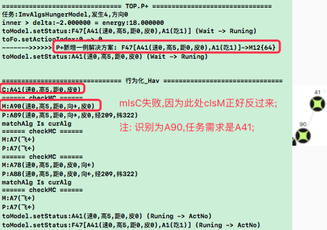 |
| 分析 | 如图,在_Hav中,mIsC判断失败,导致F47直接失败; |
| 解决 | 将mIsC中,兼容cIsM,即可; |

| 21144 | 价值预测不工作BUG `T` |
| --- | --- |
| 示图 | 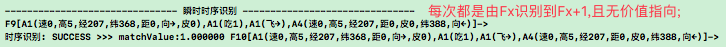 |
| 说明 | 训练第1步,TIR_Fo总由Fx识别到Fx+1->{noMv},使正向反馈类比工作异常; |
| 分析 | 猜测是识别到`内存中某新时序`或`内类比生成的时序`?需调试`Fx+1`来源; |
| 解决 | 1. Fx是MatchAFo,Fx+1是ProtoF,将二者不应期掉,不能互相识别自己; |
|  | 2. MatchAFo构建时,未兼容partA_ps,导致末位是protoAlg而不是partAlg,而末位在时序识别中作为索引,所以导致识别失败,使之兼容partA_ps后恢复; |
| 结果 | 已可正常识别时序,并外类比,构建出`F14[A8,吃]->{mv+}`; |

| 21145 | 0距果马上饿不直接吃的BUG-mIsC不稳定 `T` |
| --- | --- |
| 说明 | 与`21143`类似,不过此处是在第2步,已有几个方向是正常的,到左投时才不行; |
| 示图 | 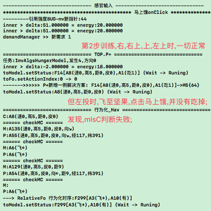 |
| 调试 | 经调试,有时A8:A135为同级有共同抽象,有时为A8:A413有共同具象; |
| 分析 | 抽象度的多样性`如A133(速高皮),A8(速高距皮)`,导致很难精准对应mIsC; |
| 分析 | 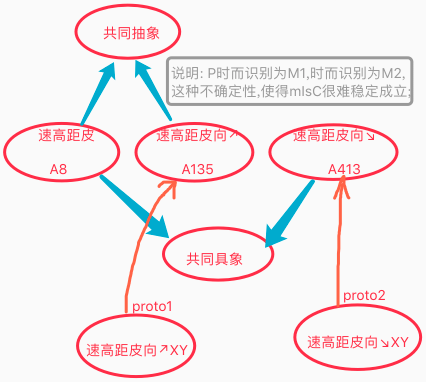 |
| 方案1 | 采取多全含识别; `T` |
|  | 分析: 虽然全面改掉问题,但改动较大,不过迟早要支持,改动如下: |
|  | 1. 在多全含识别后,要分别支持与protoAlg进行抽具象关联; `T` |
|  | 2. 也要用多个mAlg构建多个mFo吗? `暂不予支持` |
|  | 3. 在_Hav中,支持分别对matchAlgs判断mIsC通过; `T` |
| 方案2 | 在mIsC时,M支持partAlg_ps而不止是matchAlg; |
|  | 分析: partAlg_ps涉及太广,带来不确定性,与熵减原则相背; |
|  | 优点: 此种方式改动小; |
|  | 缺点: partAlg_ps非常长,导致mIsC通过率太高,尝试面感觉太宽; |
| 综合 | 先选方案1,不过仅做改动1和3,暂不支持2; |

| 21146 | BUG_PM修正不必修正的码 |
| --- | --- |
| 示图 | 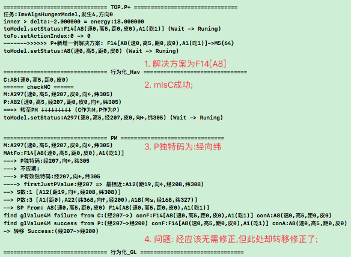 |
| 说明 | 如图: 在PM中,对`经207`进行修正,其实是不需要修正的; |
| 分析 | 1. 从图中可见,S数1,P数3,两者中,都有`经`,所以得出修正`经`是正常的; |
|  | 2. 所以导致此BUG的原因在于S和P不够抽象,即经历太少; |
| 方案 | 1. 制定更多训练步骤,使S和P在外类比中变的更加抽象; |

| 21147 | BUG_PM修正GL失败时,会直接否掉当前解决方案 `T` |
| --- | --- |
| 说明 | 在PM修正单条GL失败时,会直接取下一个解决方案,导致当前方案没怎么试就弃疗了; |
| 分析 | PM修正GL失败时,其实可以再尝试relativeFos获取alg,而不是直接整个否掉; |
| 方案 | 在PM修正GL失败时,使_Hav继续relativeFos获取alg.cHav; |
| 代码 | 对PM返回bool改成三个回调:`failure,success,notNeedPM`,来应对不同逻辑; |

| 21148 | BUG_ATPlus数总为0的BUG `T`; |
| --- | --- |
| 示图 |  |
| 说明 | 无论怎么训练,P数总为0; |
| 分析 | 以前训练时是有P的,但具体以前什么时候训练的,什么情况都忘了; |
| 方案1 | 查以前代码分支,找出P非0的情况下的代码逻辑; |
| 方案2 | 查现在的架构,查出为什么没生成P; |
| 方案3 | 训练决策行为吃,解决饥饿问题,以使之触发正向反省类比,生成P `T`; |
|  | 规划: 先测试到getInner1Alg中找到relativeFos,飞到坚果吃掉,从而生成P; |
|  | 训练记录: `顺着第2步,远投飞过去后,发现识别为A8,马上饿,直接吃掉,并反省类比P,看起来一切正常;` |
|  | 结果: 按着上述步骤训练,发现正常构建了P; |
| 方案4 | 将`正向反馈类比`与`正向反省类比`统一,使之更多的被执行; |
| 结果 | 通过方案3暂已修正P数为0的问题,此问题暂止; |

| 21149 | PM修正不必修正的码2 |
| --- | --- |
| 示图 | 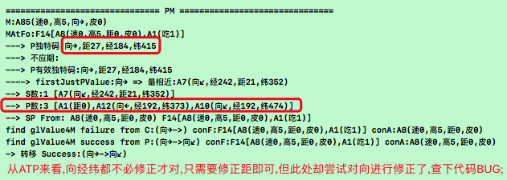 |
| 说明 | 该BUG与21146一致,但这次有复现方式,可调试性更高; |
| 复现 | 根据21148的方案3训练记录过程进行训练,并观察第二步飞至坚果后的,坚果方向,设为DirectionX,然后第3步`DirectionX投,马上饿`,应该可以复现 (如此操作后,未复现); |

| 2114A | PM该修正的未修正 `T,不算BUG` |
| --- | --- |
| 示图 | 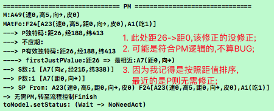 |

| 2114B | energy足够时的决策循环中断BUG `T` |
| --- | --- |
| 示图 | 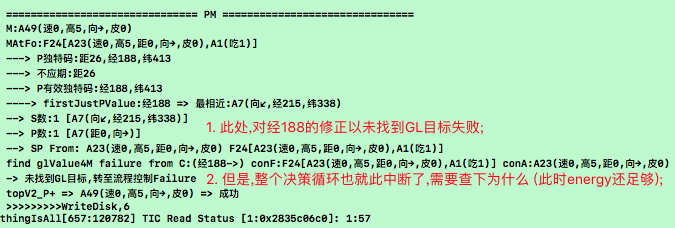 |
| 调试 | 当第1条value.finish成功时,再调用第2条valuePM转移失败时,未继续流程导致; |
| 解决 | 将failure回调后流程补齐 (补成AlgModel永不言败,一直传给_Hav,直至其自报失败); |
| 代码 | 1. `将AlgModel改为永不言败流程`; 2. `将_Hav中加上不应期处理,防止死循环`; |
| 流程 |  |
| 说明 | 从A开始做PM处理,`除了本次涉及改动部分外,其它说明直接看图即可`; |
|  | 1. 本次改动仅在最终失败时,即图E1,`失败时总会到E1`,`并且E1添加了不应期功能`; |
|  | 2. 本改动主要使E1到A之间完成循环,不至于决策循环中断; |

| 2114C | 反省类比S后决策循环中断BUG `T` |
| --- | --- |
| 说明 | 训练复现步骤说明: |
|  | 1. 21141第2步中,马上饿,此时`S=空 & P=空`,导致无需修正; |
|  | > 输出`吃`掉,触发`正向反省类比`,得到`P(向,距0,经,纬)` |
|  | 2. 21141第3步中,马上饿,此时`S=空 & P=(向,距0,经,纬)`,导致无需修正; |
|  | > 输出`吃`,空吃吃不到,触发`反向反省类比`,得到`S(向,距27,经,纬)` |
| 问题 | 3. 此时发现,反省类比S后,未能继续决策循环,而是另起了一个解决方案; |
| 调试 | 经查,反省类比S后,调用了FC-Failure(Alg),所以另起了解决方案; |
| 结果 | 将反省类比S后,改为递归调用FC-Begin(Alg)即可继续递归Alg (参考21161); |
| 追加 | 经测并未修复,因为整个fo已完成,所以只是用demand调用了`反省类比S`(根本没法调用到同级Alg递归),此时无论是同级或上级递归,都无法回溯到subValueModel,不必纠结于此,转N21P17继续训练; |

<br><br><br>

## n21p15 规划决策
`CreateTime 2020.11.26`

| 说明 | 规划决策是指,先对任务进行计划,再付出行动; `T` |
| --- | --- |
| 曾经 | 原本老版本的决策系统,本来就是半规划性的,即将决策递归完,才会付出行动; |
| 现在 | 但后来改成了实时外循环方式,即现在的方式; |
| 规划 | 支持完全的规划决策,即对输出改为挂起到某场景下,进行计划性输出; |
| 举例 | 比如1: 回家路过小卖部买醋; (其中情景为:`回家路过小卖部`,计划为:`买醋`); |
|  | 比如2: 打篮球,拍一下,等球弹回来,再继续 |
|  | 比如3: 饿了,午饭快好了,躺在沙发上等待一开饭,就冲过去吃; |
| 分析 | 广义来看: 其实我们每一次决策,都有规划的影子; |
|  | 分析前提: 一般情况下,规划决策发生在当前条件不满足,而条件在未来会满足的情况下; |
|  | 分析结尾: 即我们在ActYes状态下,等待条件满足时,再继续推进任务; |
| 结论 | 从三个例子来看,HE目前本来就是支持规划决策 (ActYes) 的,所以不需要迭代; |


<br><br><br>

## n21p16 流程控制-整理递归方式
`CreateTime 2020.11.28` `参考2114B,2114C,TOR类注释-递归说明`

| 21161 | 本节用于整理FC递归方式 |
| --- | --- |
| 源由 | 源于2114B和2114C两个BUG,本节对递归方式进行整理; |
| 正文 | 将递归分为`同级递归`和`上级递归`: |
| 示图 | 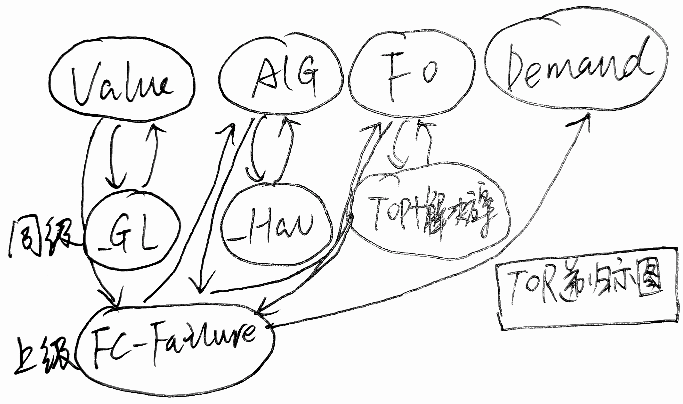 |
| 同级 | **当单轮评价失败时,先向同级递归;** |
|  | > 即调用`_Hav`或`_GL`或`TOP+新解决方案`,用不应期再取下条; |
| 上级 | **当同级全失败时,再向上级递归;** |
|  | > 即调用FC-Failure: `V递归到A`,`A递归到F`,`F递归到Demand`; |

<br><br><br>

## n21p17 继续五测
`CreateTime 2020.11.28`

| 21171 | 新规划训练步骤5 |
| --- | --- |
| 1 | `直投,右下飞,直投,边吃边飞至右上` |
| 2 | `重启,右投,飞至坚果,马上饿` `右上投,飞至坚果,马上饿`... |
| 3 | `重启,右投,马上饿` (没有S,所以原地空吃); |
| 4 | `重启,DirectionX投,马上饿` (其中X为,小鸟习得P中的方向) |

| 21172 | 找不到GL飞行经验的BUG; |
| --- | --- |
| 示图 | 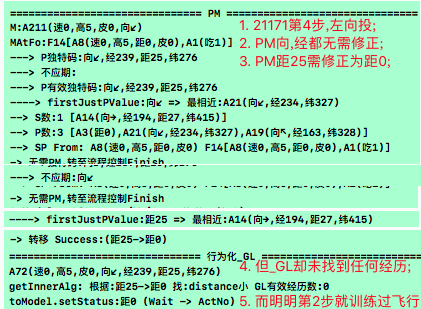 |
| 说明 | 如图,训练第4步时,发现明明训练过飞,但却找不到任何GL经验; |
| 调试 | 1. 经调试getInner1Alg方法,发现传入的参考pAlg确实是`向→`节点; |
|  | 2. 查联想到的try_getInnerAlg结果,却并未将`向→`排在前在 `参考21115`; |
|  | 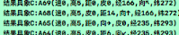 |
| 方案 | 建议从识别开始解决gl无法找到问题,即能够达到的最抽象优先,进行GL启发联想; |
|  | 比如: 将右果识别为:(速,高,向→,皮)果,而不是(速,高,皮); |
| 问题 | 如何判断稳定性,比如飞行,其实与方向较稳定相关,但我们为何要根据`方向`启发呢? |
|  | 答: 肯定是从"抽象"找稳定性,右果右飞变近,被抽象了,即为稳定; |
|  | 答: 根据`右果右飞变近`来重新设计训练方式,以使之稳定,再改此BUG; |


<br><br><br><br><br>


## TODOLIST

| TODO | STATUS |
| --- | --- |
| 1. 在生物钟触发器触发时,判断下outModel是否有根(在demandManager下) | T |
| 2. SPAlg节点中的稀疏码是否应有序?比如,距离显然帮助解决问题强度要>方向 (参考21149,暂时不考虑先测着); |  |
