# v2.0版本六测 & 评价器 & R-模式迭代 & 七测-防撞训练

> 注:
> 1. 六测在n21p20已经开始->本章继续;
> 2. V评价迭代在n21p21已经开始->本章继续;

***

<!-- TOC -->

- [v2.0版本六测 & 评价器 & R-模式迭代 & 七测-防撞训练](#v20版本六测--评价器--r-模式迭代--七测-防撞训练)
  - [n22p1 评价器整理](#n22p1-评价器整理)
  - [n22p2 值域求和2-VRS](#n22p2-值域求和2-vrs)
  - [n22p3 六测2-VRS测试](#n22p3-六测2-vrs测试)
  - [n22p4 防撞训练](#n22p4-防撞训练)
  - [n22p5 反向反馈类比迭代-In反省类比](#n22p5-反向反馈类比迭代-in反省类比)
  - [n22p6 应用In反省类比: R-模式迭代](#n22p6-应用in反省类比-r-模式迭代)
  - [n22p7 七测-防撞训练2](#n22p7-七测-防撞训练2)
  - [n22p8 `R-对比R+` 与 `预测与预期触发器整理`](#n22p8-r-对比r-与-预测与预期触发器整理)
  - [n22p9 防撞训练3](#n22p9-防撞训练3)
  - [n22p10 R-模式V3迭代: 决策四模式兼容分析-deltaMv迭代](#n22p10-r-模式v3迭代-决策四模式兼容分析-deltamv迭代)
  - [n22p11 七测-防撞训练4](#n22p11-七测-防撞训练4)
  - [n22p12 时间规划1-deltaTime评价](#n22p12-时间规划1-deltatime评价)
  - [n22p13 时间规划2-嵌套子需求](#n22p13-时间规划2-嵌套子需求)
  - [n22p14 回归七测-防撞训练5](#n22p14-回归七测-防撞训练5)
  - [n22p15 R-模式更理性迭代:静默成功](#n22p15-r-模式更理性迭代静默成功)
  - [n22p16 八测](#n22p16-八测)
  - [TODOLIST](#todolist)

<!-- /TOC -->

## n22p1 评价器整理
`CreateTime 2021.01.05`

在Note21中对`时序支持空S评价`和`稀疏码评价迭代支持值域求和`,所以现在整个评价器体系更加完善,本节对这些进行整理;

| 22011 | 评价器体系整理 |
| --- | --- |
| 评价器 | 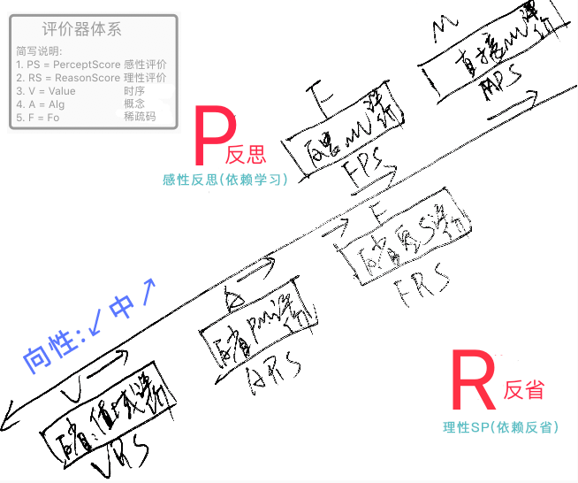 |
| 说明 | 如图: 当前的评价体系较为完善,但代码比较混乱,不像类比器代码的那么条理; |
| 说明 | 感性评价以mv和fo为主,理性评价以alg和value为主; |
| 代码 | 考虑写个AIScore类,将所有评价器整理进来; |

| 22012 | 支持APS评价 |
| --- | --- |
| 说明 | 以前原本支持替换Alg并反思fo,后来弃用了?代码找不到 `暂不支持`; |

| 22013 | FRS受基fo.mv影响迭代 |
| --- | --- |
| 说明 | 对SP的conFo.mv做评分判断; |
| 评价通过 | `正价值且P` 或 `负价值且S`; |
| 评价不通过 | `正价值且S` 或 `负价值且P`; |

   

## n22p2 值域求和2-VRS
`CreateTime 2021.01.05`

本节针对训练中,偶发性S导致评价为否的问题,对值域求和进行迭代,支持更合理的VRS评价;

| 22021 | 偶发性S导致评价为否的问题2 |
| --- | --- |
| 示图 | 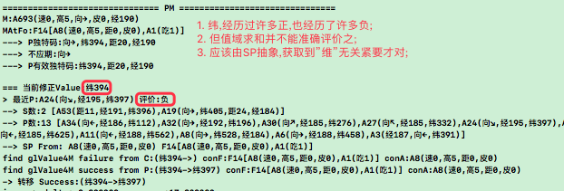 |
| 说明 | 转自2120A-方案4,本表重点依据SP抽象,进行值域求和评价迭代; |
| 分析 | 在`避免偶发性`问题的同时,面临`思维固化(偏见)`对理性评价的影响; |
| 方案1 | 根据抽象: 对SP外类比再抽象优先评价,其次具象评价; |
| 方案2 | 根据强度: 对SP的强度>30,优先评价,其次再对>10评价,再次>0; |
| 方案3 | 迁移为主,强化为辅,即: 方案1为主,方案2为辅,进行综合VRS评价; |
| 调试 | 经调试,反省外类比工作正常,可以构建SP节点的再抽象SP节点; |
| 分析 | 经分析因为V已经是最微观,不确定性只能通过值域来解决,所以联想方式不能通过像GLHN那样的getInnerAlg()方式完成,只能通过SP.absSP()来做了; |

| 22022 | 反省外类比迭代分析-SP抽象 |
| --- | --- |
| 偏见 | 1. `偏见/第一印象`,有责任的多担责,即抽象经验对于新输入的起到偏见作用; |
|  | 2. 或者通过积累,这种更加自由竞争的方式来实现 `转至22023-代码3`; |
| 原则 | SP的原则就是明确责任 (类比找不同) `T本就支持`; |
| 实践 | SP抽象在明确责任的实践方式上,就是类比差值,即:`找不同` `T本就支持`; |

| 22023 | 值域求和v2迭代计划 |
| --- | --- |
| 迭代 | S和P各自生成一条值域,在评价时,将二者求和,得出结果; |
| 代码 | 1. 需要对每个码单独成域 (现在值域求和本来就支持) `T`; |
| 代码 | 2. 需要兼容求差 (本来反省类比已支持) `T`; |
|  | 分析: 1,2本来就支持 |
| 代码 | 3. 对S和P:`先单独形成曲线,再求和`,而不是现做法:`先求和,再做曲线`; |
|  | 分析: 3是本次的重点改动,这么做可以有效防止偶发性S问题; |
| 代码 | 4. 对抽象做思考,即SP的absSP,看是否压根不需要absSP; |
|  | 分析: 4从稀疏码的多变性来看,似乎很难抽象absSP,但可以在此处形成曲线; |
| 综合 | 在4反省类比时生成曲线SumModels `转22024`; |
|  | 在3做VRS时再求和做评价; |

| 22024 | 值域求和v2曲线算法分析 |
| --- | --- |
| 说明 | 在反省类比时,针对每种码,形成各自的S或P曲线; |
| 分析 | 每个值对周边的影响范围大小不太好取定,比如距离50,影响旁边10范围还是2; |
| 方案1 | 所有稀疏码归一化,影响范围为0.05; |
|  | 分析: 可行性高且简单,但缺点是如智能体只关注区间,如0-0.2,支撑不友好; |
| 方案2 | 反省类比中,仅存所有稀疏码值values,到评价前一刻,再形成曲线; |
|  | 分析: 此方案看具体情况可行即做,但现在的核心问题是`影响范围问题`; |
| 方案3 | 根据经验,决定影响范围,粗略输入影响大范围,精细输入影响小范围; |
|  | 分析: 此方案可行,此处的`粗略/精细`由当前总视角决定,即场景下值域总范围; |
| 选择 | 选定方案3: 曲线生成`转至22025`,取值范围`转至22026`; |

| 22025 | 值域求和v2曲线算法分析A: 曲线生成方案 |
| --- | --- |
| 说明 | 本表主要根据`22024-方案3`,分析曲线生成方案; |
| 原则 | A. 使之能够顺利工作; |
|  | B. 避免偶发性 (不确定性),带来的问题; |
| 方案1 | 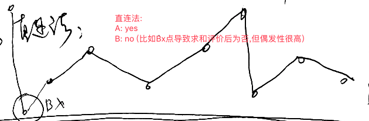 |
| 方案2 |  |
| 方案3 | 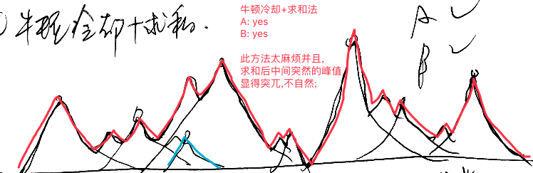 |
| 方案4 | 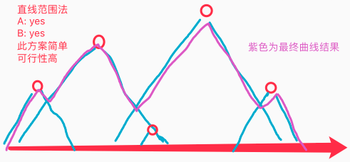 |
| 方案5 | 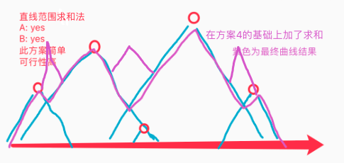 |
| 分析1 | 未累计方案,B全为no,因为当输入值全不同强度全是1,不求和就全靠命了; |
| 分析2 | 累计为防止偶发性带来了可能性,但不彻底,可以设定一个容错值,如<-2才评价为否; |
| 最终 | 累计的只有方案3和5,为了简单暂选方案5; |
| 评分图 | 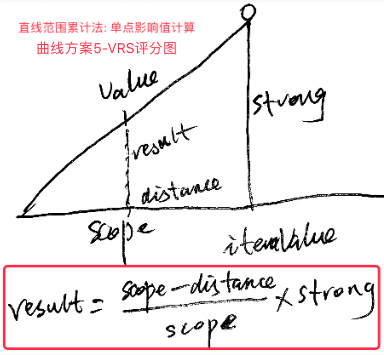 |

| 22026 | 值域求和v2曲线算法分析B: 取值范围方案 |
| --- | --- |
| 说明 | 本表主要根据`22024-方案3`,分析取值范围问题; |
| 分析 | 22024-方案3,已暂定由`当前总视角`,即`当前场景值域总范围`来决定; |
| 方案 | 暂定以`值域总范围(max-min) * 33%`得出影响范围; |
| 重点 | 1. 不怕错误,只要错误在多经历两次能够立马意识到修正; |
|  | 2. 确立更具象的当前场景很重要,F14只是个大场景; |
| 原则 | 范围由场景决定,而场景由时序决定的,所以当前代码并无问题; |
| 解决 | 从当前fo中取S/P的值max-min范围,并以此为据,作为本表问题的解; |

| 22027 | 值域求和v2代码规划 | STATUS |
| --- | --- | --- |
| 1 | 曲线计算采用22025-方案5:`直线范围累计法`; | T |
| 2 | 评价<-2才评价为否; | T |
| 3 | 算出(max-min)*0.33为影响范围; | T |
| 4 | 使反向反馈类比也触发反省类比构建SP; | 本就支持 |

   

## n22p3 六测2-VRS测试
`CreateTime 2021.01.10`

| 22031 | VRS迭代测试 | STATUS |
| --- | --- | --- |
| 1 | 测试VRS评价是否正常工作; | T |
| 2 | 测试反向反馈类比能否正常工作构建SP节点; |  |

| 22032 | 评价时负2的容错区间不生效BUG `T` |
| --- | --- |
| 示图 | 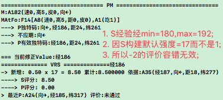 |
| 分析 | 在构建SP时,difStrong=具象最大的强度,而不是1,导致此BUG |
| 最终 | 在relateGeneralAbs()中,将SP时difStrong设为1; |

| 22033 | 有效glFo被FRS评价为否的问题 `T未复现` |
| --- | --- |
| 示图 | 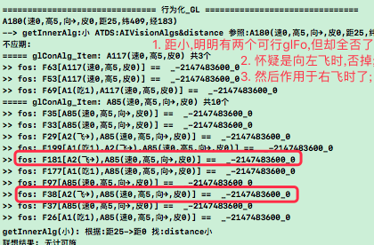 |
| 调试 | 调试:`A85(速高向→皮)`主导右飞经验,`A168(速高皮向←)`主导左向; |
| 分析 | `A85只在右飞时` 且 `A168也只在左飞时`联想到,所以不会被对方评价为否; |
| 结果 | 修复中被22034BUG打断,并先修复之,之后此BUG复现不了了,再发现再说; |
| 方案 | 将反省SP挂到当前场景下,在FRS的空S评价时,也仅使其作用于当前场景下,不过似乎目前就是挂在当前matchFo场景下的,唯一的不同在于其protoFo不同,所以理应将matchFo和protoFo都与SFo进行关联; |

| 22034 | VRS对于稀有值无法评价的问题 `T` |
| --- | --- |
| 示图 |  |
| 问题 | 如图,v2版VRS很难评价此种情况: |
|  | 1. 不在min->max区间; |
|  | 2. 距9999几乎不可能突破-2容错区 (参考22027-todo2); |
| 解答 | 分析可得,主要线索在于9999!=0; |
|  | 所以,可以将默认评价为是,改为默认为否,除非证实9999例外; |
| 分析 | 1. 当value在alg无同区码时,则默认评价为true; |
|  | > 体现为: 在S取评为0分时 (比如经9999,从未经历过),则应给出S负分; |
|  | 2. 当value在alg有同区码时,则默认评价为false; |
|  | > 体现为: 在P取评为0分时 (比如不是距0,从未经历过),则应给出P负分; |
| 代码 | 1. 对当前码justValue与MC.CAlg进行同区判定; |
|  | 2. `有同区码`->`默认评价false`->`P-S>2则true`; |
|  | 3. `无同区码`->`默认评价true`->`S-P>2则false`; |
| 结果 | 按照代码规划修改后,经测BUG已修复; |
| 方案 | 可以在构建SP时,将对应的信息,保留到节点中 (比如当前为:左飞/或飞); |

| 22035 | 六测训练最终步骤 |
| --- | --- |
| 说明 | 至此训练多向飞行结束,左和右飞可正常完成,且仅需如下步骤: |
| 1 | `直投,右下飞,直投`, `边直投边飞至右上`xn |
| 2 | `重启,右投,飞至坚果,马上饿`x3 `左投,飞至坚果,马上饿`x3 |
| 3 | `重启,右投,马上饿` (会原地空吃,发现不行再飞至坚果吃) `左投,马上饿`; |

| 22036 | 多向飞行训练20210124版 |
| --- | --- |
| 说明 | 在`多时序迭代`,`DisY真实距离`,`FRS空S评价`等改动后训练失败,查明改掉后,步骤如下: |
| 1 | `直投,右下飞,直投`, `边直投边飞至右上` |
| 2 | `重启,右投,飞至坚果,马上饿`x3 `左投,飞至坚果,马上饿`x3 |
| 3 | `重启,右投,马上饿` (原地空吃,发现不行才飞至坚果吃); |
|  | `左投,马上饿` (有可能还在右飞,并且Out反省未触发,所以一直右飞); |
| 4 | `重启,左投,马上饿`,`右投马上饿`; |

| TODO | STATUS |
| --- | --- |
| 1. 20210114早9点40分闪退一次,查原因为:`R-中获取经验为nil时未判空` | T |
| 2. 测试反向反馈类比构建SP的代码运行是否正常 `转至n22p4-防撞训练`; | T |

   

## n22p4 防撞训练
`CreateTime 2021.01.15`

在n22p3中,已训练多向(左右)飞行成功,本节针对更新的训练规划,并制定训练步骤;
1. 木棒形态:方形蓝色大小5;
2. n22p2-todo2暂不测试,本节扔木棒训练中,会更频繁的触发,再测之;

| 22041 | 新训练规划-防撞训练 |
| --- | --- |
| 计划1 | `有皮果不能吃`,`可搬运坚果`,`可被压破壳` |
| 计划2 | `撞了会疼`,`躲避被撞` |
| 最终 | 计划1需要车,而计划2是防止被撞的前提,所以我们先训练计划2; |

| 22042 | 防撞训练步骤 |
| --- | --- |
| 1 | 木棒准投乌鸦 `视觉看到石子,触发疼`; |
| 2 | 木棒偏投乌鸦 `视觉看到石子,预测疼,但未触发疼,所以触发反省类比`; |

| 22043 | 预测是否撞到无法区分问题 `T` |
| --- | --- |
| 示图 |  |
| 解释 | 如图: 无论是否能被撞到,获取到的视觉信息是一致的; |
| 方案1 | 将8向,改成无数向; |
|  | > 可从方向上发现垂直角度变大,则撞不到 `改动大,麻烦,会影响原有8向设计` |
| 方案2 | 看到自己的位置; |
|  | > 可从自己所在位置判断是否会撞到 `改动大,麻烦,需重做原训练确定无问题` |
| 方案3 | 对Y间距进行感知; |
|  | > 可根据Y间距,判断是否会被撞到 `改动小,简单,对原训练不会产生影响` |
| 分析 | 方案2彻底,棒道距离可通过类比自行得出; 方案3简单,可暂选训练; |
| 最终 | 暂选方案3; |

| TODO | STATUS |
| --- | --- |
| 1. 测试点_测试能否触发反向反馈类比构建SP `很少触发,转n22p5`; | T |
| 2. 测试点_测试在P-中,能否找到SP兄弟节点,并开始行为化; |  |

   

## n22p5 反向反馈类比迭代-In反省类比
`CreateTime 2021.01.17`

22042训练至第2步后,没有触发反向反馈类比,以发现没撞到的原因,经核查,反向反馈类比,仅在条件符合mv+和mv-时才执行,并且仅在FindMV时才触发,导致其运行的机率极低,无法起到原有的作用,本节针对此问题进行迭代;

在n20p18已经迭代反向反馈类比为Out反省类比,本节是再另外支持In反省类比;

| 22051 | 迭代分析 |
| --- | --- |
| 理性示例 | 当看到汽车越来越近,但下秒却没变近; |
| 感性示例 | 当看到木棒扔过来,但下秒却没有疼; |
| 运行条件 | 当期望与实际不符时,即运行,而非必须mv+和mv-; |
| 触发机制 | 当不符合预测时,即触发,而非仅FindMV时才触发; |

| 22052 | 代码规划 |
| --- | --- |
| 1 | 输入当前帧matchFo到末位的,改变状态为Wait,并增加生物钟触发器; T |
|  | a. 在TIR_FoFromShortMem中,对HNGL和Normal两种情况单独判断; T |
| 2 | OPushM时,对Wait中的进行匹配判断,并做状态改变为OutBack; T |
| 3 | 对生物钟触发器触发时,未OutBack的,进行反向反馈类比,构建SP; T |
| 改1 | TIR_Fo中,对于HNGL的返回,暂没什么用且性能差,可暂不支持,先关掉; |
| 注2 | 因为TIR_Fo把HNGL关掉了,所以In反省类比关于HNGL的触发与类比无效; |

   

## n22p6 应用In反省类比: R-模式迭代
`CreateTime 2021.01.21`

原有R-模式是建立在SP兄弟节点的基础上的,而兄弟节点已在n22p5中被废弃,所以R-模式应该随着In反省类比的迭代而变化;

本节将R-模式整合到原有AIAction和流程控制中;

| 22061 | R-迭代代码规划 |
| --- | --- |
| 1 | 决策前_评价foModel; |
|  | > 有空S指向,则失败 (尝试下一方案); |
| 2 | 决策时_评价foModel (S已错过,则失败); |
|  | > 评价否掉的,直接demand.failure()进行递归 (尝试下一方案); |
| 3 | 决策时_评价foModel (S未错过,则通过,并提交Action._Fo逐个满足S); |
|  | > 从cutIndex开始进行循环,判断是否被M.itemAlg抽象指向; |
| 4 | 被M抽象指向时,则对S加工,想办法满足demand.protoAlg变成S; |
|  | > 生成TOAlgModel,并交给PM进行满足修正; |
| 5 | 不被M抽象指向时,则到cHav看能否得到; |
|  | > 生成TOAlgModel,并交给Action._Hav进行满足; |
| 6 | 决策流程控制是否满足至末位?->否则failure失败; |
|  | > 失败时,则递归到demand.failure (尝试下一方案); |
| 7 | 决策流程控制是否满足至末位?->是则finish成功; |
|  | > 设为ActYes,以`当前index至mv时间之和`生物钟触发,等待OPushM; |
| 8 | 能不躲了mv-? 未避开,(OPushM有mv-),则status=OutBack; |
|  | > 不是ActYes,触发S反省标记S,且设为failure,递归任务 (尝试下一方案); |
| 9 | 能不躲了mv-? 避开,(OPushM无mv-),则最终demand成功,任务完成; |
|  | > 还是ActYes,触发P反省标记P,且设为finish,并移除任务; |
| 注1 | 第8步S的S改为,使此foModel强度减弱不易取用 (废弃,参考改4,5); |
| 注2 | 第9步S的P改为,使此foModel强度增强更易取用 (废弃,参考改4,5); |
| 注3 | 第1步改为取消空S评价,而是由注1注2自由强度竞争 (废弃,参考改4,5); |
| 改4 | 融合PM: SFo并非全需要满足,而是仅满足VRS评价需要的部分; |
| 改5 | Out反省: SFo也可以再Out反省时,再指向SP,使之决策越来越稳定准确; |

| 22062 | P-对比R- | P- | R- |
| --- | --- | --- | --- |
| 1 | 解决方案 | 正Fo | 负Fo |
| 2 | 解决方案源 | 正向类比(交集) | 反向类比(差集) |
| 3 | Finish条件 | 触发mv+ | 不完成Fo |
| 4 | Failure条件 | 不完成Fo | 触发mv- |
| 5 | PM | 修正S | 满足S |

| 22063 | R-模式短时记忆模型图 |
| --- | --- |
| 示图 | 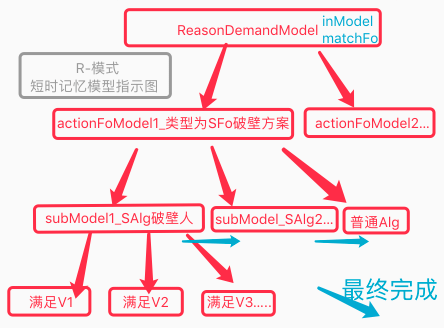 |

   

## n22p7 七测-防撞训练2
`CreateTime 2021.01.23`

| 22071 | 防撞训练步骤 |
| --- | --- |
| 1 | 木棒准投乌鸦 `视觉看到石子,触发疼`; |
| 2 | 木棒偏投乌鸦 `视觉看到石子,预测疼,但未触发疼,所以触发反省类比`; |

| 22072 | 时序总是识别到HNGL导致危险预测不灵敏 |
| --- | --- |
| 示图 | 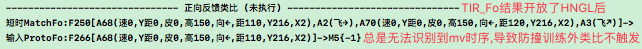 |
| 分析 | 有时候也能识别到指向mv的matchFo,只是较少,大数还是识别到HNGLFo; |
| 方案 | 使TIR_Fo支持多识别,以使识别的结果更全面,不受这混乱率影响 `转22073`; |
| 方案 | TIR_Fo中的未指向mv的也会导致此BUG,所以将其过滤掉; |

| 22073 | 多时序识别迭代 |
| --- | --- |
| todo1 | 参考22072,本表进行多时序识别迭代支持 T; |
| todo2 | matchFos应用到: 反思结果的FPS评价,进行更多元评价 T; |
| todo3 | matchFos应用到: In反省类比触发器,以更全面的In反省 T; |
| todo4 | matchFos应用到: 外类比,以使之更全面的类比抽象 T; |
| todo5 | matchFos应用到: tip_OPushM,使之更全面改变status状态 T; |
| todo6 | matchFos应用到: tir_OPushM,使之更全面改变status状态 T; |
| todo7 | 在决策中,暂不应用多时序,但需将默认matchFo改为含mv且最迫切那条 T; |

| 22074 | 测得3BUG_SFo没有Y距_0条方案_时序识别重复 |
| --- | --- |
| 示图 | 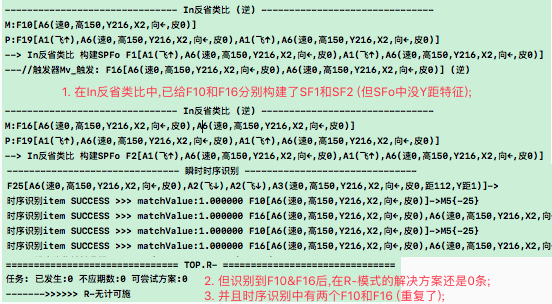 |
| 分析 | BUG1,因为In反省时使用了matchAFo而不是protoFo导致,改后ok `T`; |
| 分析 | BUG3,多时序识别未去重,去重后ok `T`; |
| 分析 | BUG2,分析如下: |
|  | 1. ReasonDemand上次R-任务,再来一条时,未抵消更新为新的F10/F16; |
|  | 2. F10的具象Fo没有R-经验,但F10有,考虑迁移使用? |
|  | 3. 对多个R-任务间的抵消和迁移做分析,以解决此问题; |
| BUG2 | 1. R-新任务不以mv去重,而是以matchFo除旧迎新; T |
|  | 2. 所有R-任务在预测时,无论是否末位都生物钟触发器; T `转22076` |
|  | 3. demands任务排序,以迫切度越高靠前为一级,时间越新靠前为二级; T |

| 22075 | 防撞训练步骤2 |
| --- | --- |
| 1 | `投木棒`,`上飞`x3 (学在各位置会被撞或撞不到); |
| 2 | `重启`,`右飞`,`投木棒` (乌鸦预测了危险,并且快速上飞来躲避); |

   

## n22p8 `R-对比R+` 与 `预测与预期触发器整理`
`CreateTime 2021.01.28`

| 22081 | 预测触发器与预期触发器 |
| --- | --- |
| IT预测 | 预测触发器,用于触发In反省,从tir_Forecast时就构建,并开始倒计时; |
| OT预期 | 预期触发器,用于触发Out反省,从tor_ActYes行为后构建,并开始倒计时; |
| todo1 | OT:新的matchFo抵消后(root失效),即使旧的触发也不做反省 T; |
| todo2 | OT:破壁失败时,则S反省,并移出任务池(过期一切晚了) T; |
| todo3 | OT:破壁成功时,则P反省,并移出任务池(破壁成功偶耶) T; |
| 分析 | IT:被破壁,会致反省得出更多空S,可考虑是否做处理 `转todo20210128`; |

| 22082 | InOut反省 |
| --- | --- |
| 1 | 无论是R+还是R-都要从加入任务池时,便直接开始触发器,触发后作In反省; |
| In反省 | **是指protoFo与matchFo之间进行取差反省;** |
| > R+ | 一直很好玩,但这次不好玩 (In反省); |
| > R- | 一直有危险,但这次没问题 (In反省); |
| Out反省 | **是指justPValus与outModel之间进行取差反省;** |
| > R+ | 因为没好玩,间接触发delta<0任务,R+找到P行为化ActYes后 (Out反省); |
| > R- | 因为危险,直接触发任务,R-找到S行为化ActYes后 (Out反省); |

| 22083 | R+对比R- | R+ | R- |
| --- | --- | --- | --- |
| 1 | 迫切度 | 为负,无迫切度 | 为正,有迫切度 |
| 2 | IN触发器P基于 | 输入mv+为P | 输入mv-为P |
| 3 | IN触发器S基于 | 未输入mv+为S | 未输入mv-为S |
| 4 | 形成任务时机 | 间接形成任务 | 直接形成任务 |
| 5 | 形成任务条件 | 不顺利时 (delta<0) | 无需条件 |
| 6 | 判断顺利的条件 | 触发器触发前输入mv+ | 触发器触发前输入mv- |

   

## n22p9 防撞训练3
`CreateTime 2021.01.29`

| 22091 | R-方案中距离VRS评价不通过 |
| --- | --- |
| 示图 | 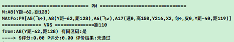 |
| 分析 | 1. 调整训练步骤,使之先疼下,再多学下哪安全 (参考22092); |
|  | 2. 安全的见识多了,自然就知道`距128`不会影响到自身安全; |
|  | 3. 对SP的外类比再抽象,改为构建到同层而非抽象层 (默认强度为两具象之和); |

| 22092 | 防撞训练步骤 |
| --- | --- |
| 1 | `木棒准投乌鸦` (先疼一两次); |
| 2 | `木棒偏投乌鸦` x N (左右上下都飞飞,全面发现哪安全); |
| 3 | `木棒准投乌鸦` (向着安全处躲避); |

| 22093 | R-模式的现做法致命问题 |
| --- | --- |
| 简介 | 本表源于:22091-分析3,考虑S再抽象,但`是否`再抽象都有问题,如下: |
| 是 | 优点: S需要再抽象,使之更确切 `比如:Y距才重要`; |
|  | 缺点: 再抽象并取做为破壁方案时,会导致: 丢失细节 `比如:防弹不穿防弹衣`; |
| 否 | 优点: 用做破壁方案时,更全面,不会丢失细节 `比如:穿好防弹衣再防弹`; |
|  | 缺点: 不进行再抽象,会导致太具体,排除不了杂质 `参考22091`; |
| 分析 | 根据以上分析,二者在确切性和稳定性上,无法两全; |
| 解决 | 要想解决之,必须做嵌套,但S再嵌套S会使网络复杂度变高,实不可取; |
| 结果 | 所以,决定对R-模式进行迭代 `转n22p10`; |
| 关键 | 关键在于S用做解决方案,其定义有违,S本来非正常时序,导致整个网络乱套; |

   

## n22p10 R-模式V3迭代: 决策四模式兼容分析-deltaMv迭代
`CreateTime 2021.01.30`

转自22093,本节对决策四模式兼容分析为切入,以对R-模式进行迭代,以往是将R+和P+暂时关闭掉的,但从模型上来看,其实是需要支持的,所以在分析此问题是将二者分析入内,可以帮助解题,且更加全面;

| 22101 | 用matchFos中mv之间的求差,得出deltaMv来替代S破壁经验-原因 |
| --- | --- |
| 原因 | 无论是理性还是感性层面,In反省都很难全面触发,所以S很难全面,如下: |
| 1 | 理性层面: 如果从未躲避过树枝,那么就不会触发In反省 `参考22103`; |
| 2 | 感性层面: 如果是挑更好吃的,不会触发In反省 `因为二者全是mv+` |
| 分析 | 识别预测是最全面的,不受限于是否可触发In反省; |

| 22102 | 采用matchFos之间求差deltaMv来兼容四个模式-示例 |
| --- | --- |
| 说明 | 本表,针对在mFo1和mFo2之间比较deltaMv,各举一例; |
| P+ | 挑更好吃的,如:烤红薯更好吃; |
|  | 将红薯加工成烤红薯 (差集为红薯变烤红薯); |
| R+ | 吃了还想吃,如:从盘一个个取草莓吃,没了开始找冰箱还有没; |
|  | 解决盘中没草莓的问题 (差集为无草莓变有草莓); |
| R- | 防撞避免疼痛,如:车撞过来,躲避开; |
|  | 解决Y距问题 (差集为会撞到的车变为撞不到的车); |
| P- | 无mFo,默认当前mv评分为0; |

| 22103 | 迭代后防撞训练步骤 |
| --- | --- |
| 1 | `学会上下飞改变Y距` |
| 2 | `学会在哪撞不到` x N |
| 3 | `学会在哪撞的到` x N |

| 22104 | 训练步骤-细致过程解析 |
| --- | --- |
| 1 | 多次经历被撞xFo: protoFo时,抽象出zFo1: matchFo->{mv-} |
| 2 | 多次经历不被撞yFo: protoFoY时,抽象出zFo2: matchFo->{mv0} |
| 3 | 下次要被撞时,根据xFo识别到zFo1和zFo2; |
| 4 | 根据zFo2和xFo求差得出deltaMv,并设为解决方案; |
| 5 | 发现zFo2什么都不用做,直接ActYes,并构建生物钟触发器; |
| 6 | 依然被撞到了,触发Out反省,发现并构建S节点:`Y距0`; |
| 7 | 重复3,4步骤,到5时,发现需要修正`Y距0` `参考现在的PM算法`; |

| 22105 | R-兼容V3迭代示图 |
| --- | --- |
| 示图 | 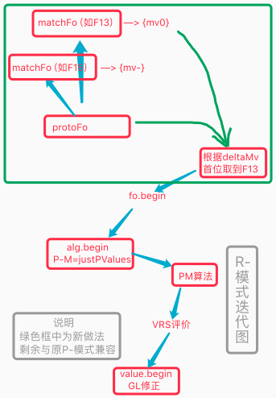 |
| 说明 | 如图,本次迭代很有必要,在兼容四模式的情况下,还会简化决策流程复杂度; |
| 结果 | 已迭代完毕,并发现matchFos中无法满足 `转22107` |

| 22106 | 代码细节规划 |
| --- | --- |
| 1 | 任何决策模式找解决方案都以:`matchFo优先,matchAlg其次,最后mv索引`; |
| 2 | 时序的过期判断,分为两种,即`cutIndex过期`与`deltaTime错失`判断; |
|  | cutIndex如: 看到木棒飞来时,有躲避机会,现在已经被撞,再躲也没用了; |
|  | deltaTime如: 看到木棒时还有1s飞来,现在已经过去10s,再去接之已迟; |
|  | 即: 以当前解决方案fo,在应用MC.curAlg时的时间有效评价; |
|  | 注: FRS_Miss过期判断是后天习得的,如下图: |
|  | 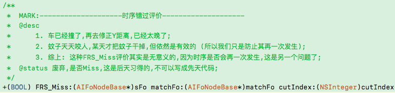 |

| 22107 | 反向反馈外类比 `T` |
| --- | --- |
| 起因 | 测试发现从matchFos中,很难精准找到解决方案,甚至找不到解决方案; |
| 比如 | 看到车撞过来,识别f1`撞疼`,同时也识别到f2`汽车可以冲刺`,如果我们把f2当解决方案显然是可笑的 (不准确的); |
| 再如 | 看到车撞过来,识别到f1`撞疼`,没别的识别结果,此时是无解决方案的; |
| 分析 | 本质在于`不被撞`的时序,没有被熵减的机会; |
|  | 因为识别时序的结果本来就是不确定过滤所得,而非明确的类比抽象得出; |
| 方案 | 对真实与预测不符的情况(反向反馈),构建`虚mv`时序,并进行外类比; |
| 示图 | 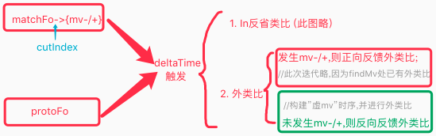 |
| 代码 | 1. 预测mv与真实mv之间求deltaMv,即使真实mv=0,deltaMv也!=0; |
|  | 2. 虚mv时序: 是指预测mv-真实mv,得出的mv,其迫切度可以为0,但delta!=0; |
| 应用 | 将反向反馈外类比的结果,应用到R-模式做解决方案; |
|  | 改: 无需做matchFo或matchAlg的mIsC场景关联判断,因为在行为化中会判断的; |
|  | 注: 取解决方案时,优先matchFos,其次才根据mvRefs取`虚mv.fo`; |
| 改 | 已改为取消matchFos优先,R-仅从`以虚mv索引`来找解决方案 `参考22114` |

| 22108 | In反省类比兼容虚mv |
| --- | --- |
| 说明 | In反省最大功能就是更快找出SP,以帮助决策时更快修正(越来越准); |
|  | > 如果In反省类比,仅作用于实mv,那么仅对P-模式获取SP有助益; |
|  | > 但不作用于虚mv的话,则对R-模式无任何助益了,所以本表使之支持; |
| 预测实mv | 1. tip_OPushM反馈同向,则为OutBackSameDelta = ATPlus |
|  | 2. tip_OPushM未反馈同向,则为LastWait = ATSub |
| 预测虚mv | 1. tip_OPushM反馈反向,则为OutBackDiffDelta = ATSub; |
|  | 2. tip_OPushM未反馈反向,则为LastWait = ATPlus; |

| TODO | STATUS |
| --- | --- |
| 1. 非同区同向mv,fo内容相同也不去重,否则其目标不明确,致其SP也不明确; |  |
| > 本来absFo指向的mv就是综合求均所得,fo不去重会导致混乱,先训练再说; |  |
| 2. R-模式优先以matchFos中找解决方案 `已废弃,用反向反馈外类比代替之`; | T |

   

## n22p11 七测-防撞训练4
`CreateTime 2021.01.31`

| 22111 | 迭代后防撞训练步骤 |
| --- | --- |
| 1 | `学会在哪撞的到` x N |
| 2 | `学会在哪撞不到` x N |
| 3 | `学会上下飞改变Y距` |

| 22112 | 识别时序失败的问题 `T` |
| --- | --- |
| 示图 | 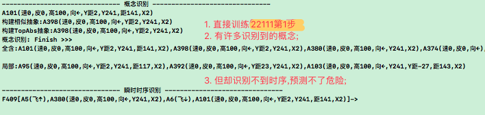 |
| 结果 | 后替代了R-模式V3,此问题早已无法复现,自然解决; |

| 22113 | 反向反馈外类比抽象时序无价值指向问题 `T` |
| --- | --- |
| 示图 | 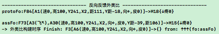 |
| 说明 | 如图,protoFo和assFo都有虚mv指向,但抽象时序却没有; |
| 结果 | 因为外类比构建方法中,仅对ATSame构建了mv,改为对ATDiff也构建后OK; |

| 22114 | 躲避方向老是最近的具体经验的问题 `T` |
| --- | --- |
| 说明 | 因为R-会优先从matchFos中找经验,而matchFos中有许多刚经历的经验 |
|  | 比如,`刚下飞没撞着,再扔木棒时,会下飞`,`刚右飞没撞着,也亦然`; |
| 分析 | 考虑下是否将matchFos优先废弃掉; |
|  | 因为`解决方案`往往起指导作用,而太具体的matchFos会使指导也太具体; |
| 结果 | 将优先从matchFos取解决方案,废弃掉了; |

| 22115 | R-越挫评价越通过的BUG `T` |
| --- | --- |
| 示图 | 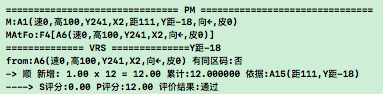 |
| 说明 | 多次训练撞到小鸟,但它的ReasonDemand在Out反省中SP反了导致顺分更高 |
| 分析 | 虚mv反馈同区反向,则为S,未反馈则为P `参考22108`; |
| 结果 | 将top_OPushM中,R-任务的反馈评价由`同区同向`改为`同区反向`即可; |

| 22116 | R-模式决策停不下来的BUG `T` |
| --- | --- |
| 示图 | 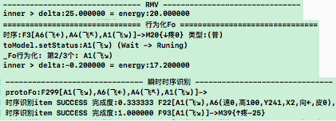 |
| 说明 | 如图,边决策边识别,又再一次触发新的预测和R任务,导致思维活跃度下不来; |
| 方案 | 将新R任务与以往同区R任务,进行迫切度求差,并仅将差值,累加到活跃度; |

| 22117 | 多次行为叠在一起的BUG `T` |
| --- | --- |
| 简介 | 行为输出时,广播输出,并没有等行为完成,就继续决策再次行为叠在一起了; |
| 方案 | 可暂把广播加上`用时`反馈,Demo端把`用时`反馈回Output后,再继续; |
| 结果 | 输出改成`action(行为输出)`和`result(世界更新,感官变化,触发价值)`两步; |

| 22118 | R-模式v3模式影响到了多向飞行 |
| --- | --- |
| 简介 | 经训练,发现多向飞行训练不顺利了,当把RMV()注掉时,则ok; |
| 分析 | 将多向飞行训练第二步改为摸嘴吃,通过训练调整使二者不冲突; |
| 暂停 | 暂停,先做n22p12问题,后续再改为`摸嘴吃`来训练此处; |

| 22119 | 小鸟不敢再到可能被撞的位置的问题,看到坚果也不敢去吃 `T` |
| --- | --- |
| 简介 | 按22111训练,第2步后,反射反应拉下来,立马就逃上去,乌鸦死活不愿下来; |
| 方案1 | 应该让乌鸦通过观察红绿灯,预测汽车会开过来的时机; |
| 方案2 | 应该让乌鸦了解到,自己飞下去,看到木棒再躲避也来的及,敢于下去吃坚果; |
| 结果 | 选择方案2,并`转n22p12`; |

   

## n22p12 时间规划1-deltaTime评价
`CreateTime 2021.02.23`

在22119中,测得小鸟不敢再飞到危险地带的问题(既使有食物也不敢),本文通过时间规划分析,来解决此问题;  

注:以往的决策就是`规划决策`,而决策细分为两个部分:
1. 规划改为:`评价`;
2. 决策改为:`实时行为化`;

| 22121 | 分析解决方案 |
| --- | --- |
| 1 | 将行为化中ActYes的等待视为:规划 (前面笔记中有); |
| 2 | 新增deltaTime评价器,做是否`来的及`的评价; |

| 22122 | 训练计划 |
| --- | --- |
| 训练 | 改动完成后,扔坚果到危险地带,让小鸟自己规划吃掉并躲开危险; |

| 22123 | 规划决策 |
| --- | --- |
| 简介 | 在2019年之前的版本中,HE本来就是规划型决策 |
| 说明 | 规划决策可以使之提前进行评价,找出可行性方案; |
| 优点 | 其补足了实时决策的两大缺点: |
|  | 1. 实时决策浪费等待时间(ActYes),如果等了半天却发现不可行则白白等待; |
|  | 2. 实时决策浪费输出精力(ActOut),如果做了一堆事却发现后面根本行不通; |

| 22124 | 规划决策-代码规划 |
| --- | --- |
| 新增状态 | 使规划的决策所得路径处于激活状态(status=PlanActive) |
| 两种模式 | 使决策系统有两种工作模式:`规划决策`和`实时决策`; |
| 协作方式 | 待实时决策时,优先选择激活状态作为行为方案; |
| 状态切换 | 当ActYes时,转入`规划`状态,当OutBack时,再转回继续`实时`状态; |
| 待分析 | 完成,和失败状态处理; |
| 待分析 | deltaTime评价,以及套入规划决策中如何工作; |
| 结果 | 暂停规划决策,因为与deltaTime评价衔接不良 `转至n22p13`; |

   

## n22p13 时间规划2-嵌套子需求
`CreateTime 2021.02.24`

1. 接上节,继续分析解决:`不敢到危险地带吃坚果`的问题;
2. 子需求生成时机: 所有感性评价不通过的都生成子需求,并决策,可解则评价不通过无效;

| 22131 | 分析解决方案B |
| --- | --- |
| 方案1 | deltaTime评价用于规划决策,时机判断:飞到危险地带未必就会被撞`5%`; |
|  | 说明: 其实deltaTime时机判断太过于复杂,并不建议此方案; |
| 方案2 | deltaTime评价,其实是一种新的时序预测,所以对于无法精准预测的情况,我们只需要增加可供分析的线索 `50%,引出子需求方案5`; |
|  | 如A: `车近来不及`或`有车危险`或`红灯危险` |
|  | 如B: `车远来的及`或`没车不危险`或`绿灯不危险` |
| 方案3 | 在多识别结果中:`稳定性,以更具象为准`,`可行性,以更抽象为准`; |
|  | 比如: 打有时不疼,用狼牙棒打总是疼的 `20%,引出方案5`; |
| 方案4 | 预测撞击和`下飞`无关,而是和看到木棒扔过来有关 `90%,绕开此问题`; |
|  | 如果在`下飞`时,看不到`在扔之中的木棒`,即可; |
| 方案5 | 生成子需求,并对其进行决策,理性决定`评价结果` `90%`; |
| 结果 | `方案4可绕开当前问题,属于保守够用方案`; |
|  | `方案5更彻底,可使乌鸦主动等待木棒飞走后,再行动(且为本节重点)`; |
|  | 根据够用即可的原则,暂选方案4,作为解决方案 `转至n22p14`; |

| 22132 | 从训练步骤分析-决策递归任务嵌套方式 |
| --- | --- |
| 1 | 在危险地带扔一坚果; |
| 2 | 想去吃,并对飞过去后进行预测; |
| 3 | 预测到木棒会打中自己 (反思评价为否:`感性`); |
| 4 | 根据木棒扔出的时间,预测击中自己的时间; |
| 5 | 找躲避经验,看能否来的及躲避; |
| 6 | 来的及,则 (反思评价为否无效:`理性`); |
| 7 | 来不及,则 (反思评价为否有效:`理性`); |

| 22133 | 代码规划 |
| --- | --- |
| 1 | 反思评价为否时,toSubModel产生子需求; |
| 2 | 子需求用deltaTime评价通过时(来的及),则不妨碍父需求继续行为化; |
| 3 | 待父需求完成时,子需求如果还存在,则自然会另起产生转为父需求,并决策解决之; |

| 22134 | 实践前验证 |
| --- | --- |
| 说明 | 实践前,先训练验证下以上分析和规划是否相符 |
| 目标 | `飞行与被撞无关` & `躲避与不被撞到有关`; |
| 1 | `边直投边飞至右上角`xN; |
| 2 | `上扔,飞至,摸嘴吃`x3、`下扔,飞至,摸嘴吃`x3 |
| 3 | `下扔,马上饿` (自行飞至并吃掉) |
| 4 | `训练被木棒击中`x8向、`训练不被木棒击中`x8向; |
| 结果 | 暂停本节内容,不进行实践,参考22131-方案4,转至n22p14; |

   

## n22p14 回归七测-防撞训练5
`CreateTime 2021.02.28`

在22131-方案4中,制定了从训练出发,解决不敢飞往危险地带的BUG问题,本节将针对此方案展开进行规划训练;

| 22141 | 训练规划 |
| --- | --- |
| 1 | 增加视觉帧,看到扔出的木棒 (暂不需要,因为目前只有扔出时才会看到); |
| 2 | 训练习得,每次看到扔出的木棒时,才有可能被击中; |
| 3 | 训练习得,看到扔偏的木棒时,无法被击中; |
| 4 | `飞下来,扔木棒`,看会不会躲; |

| 22142 | 训练22141第4步时死循环飞行 `T` |
| --- | --- |
| 示图 | 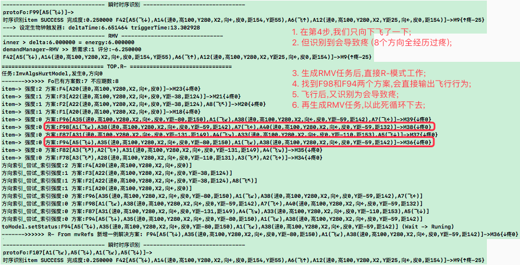 |
| 分析 | 1. 如图所示F42预测太具象了; |
| 分析 | 2. 在RMV新任务时,去重没做好导致; |
| 结果 | 到RMV中,将抵销和去重改掉后,问题解决; |

| 22143 | 训练22141第4步每次飞下都识别为负mv `T,转22144` |
| --- | --- |
| 示图 | 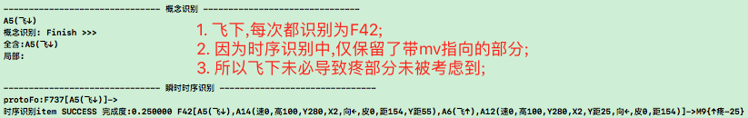 |
| 说明 | 如图,时序预测太片面; |
| 分析 | 如果扩展考虑疼的必要条件是扔来木棒,即可; |
| 分析 | 下飞预测疼,直接决策看是否有`扔木棒`,如果没,则直接判定决策完成且成功; |
| 方案 | 在`下飞`的下帧: `deltaTime后->未出现扔木棒`,则安全 `转22144`; |
| 结果 | `飞下`预测到疼并没有问题,问题在于此需求的决策,支持静默成功; |

| 22144 | 分析22143每次飞下都预测负mv问题 |
| --- | --- |
| 说明 | 当`飞下`,却没有看到`扔木棒`时,是不需要害怕的; |
| 分析 | 即,在时序`扔木棒`帧未发生时,R-任务`静默成功` `转至n22p15`; |

| 22145 | 训练步骤调整 |
| --- | --- |
| 1 | `直扔木棒`x8向=>习得`F18[A8(无距棒)]->{mv-}` |
| 2 | `偏扔木棒,边右飞边扔`xN=>习得不被撞的经验`Fx->{mv0}` |

   

## n22p15 R-模式更理性迭代:静默成功
`CreateTime 2021.03.03`

在上节中,每次`飞下`都预测危险,但其实甚至连木棒都没见有(参考22144),本节重点针对此问题展开,对R-模式进行迭代;

因为R-任务的alg帧,未必都要进行实现,避免`弄巧成拙`反将虎放出,所以对`虎`帧,进行静默成功,不进行主动行为实现 (参考22153);

| 22151 | R-需求的静默成功:`R-模式理性反省` |
| --- | --- |
| 说明 | 在时序的某帧未自然发生时,R-任务应自然完成,并反省类比; |
| 分析 | 现在对R-模式仅支持,最终的mv是否触发反省,不支持理性每帧; |
| 实践 | 1. R-决策中,每帧的推进,得先有indexAlg,再修正之; |
|  | 2. 并且等待indexDeltaTime后未自然出现,则直接静默成功; |
|  | 3. 每帧都要做生物钟触发器触发ActYes等待; |
|  | 4. OutBack成功时:`继续进行决策`,失败时:`则任务静默成功`; |
|  | 5. 如果_Hav()在瞬时记忆中未找到mIsC通过的curAlg; |
|  | 6. R-在_Hav中,不贸然进行第3级cHav,避免弄巧成拙,反放虎出`转22152`; |

| 22152 | Action._Hav()迭代 `转至22153` |
| --- | --- |
| 示图 |  |
| 1 | 当A1发生,预测F1,找到F2解决方案; |
| 2 | B2进行_Hav时,从F1中找mIsC的A2? |
|  | a. 如找不到,则正常进行cHav; |
|  | b. 如找到,则从瞬时中,找是否有A2B2的mIsC匹配概念? |
|  | > b1. 如找到,则修正之,满足B2; |
|  | > b2. 如找不到,则不进行cHav,F2决策失败,并等待生物钟触发静默成功; |

| 22153 | R-模式迭代计划 `T` |
| --- | --- |
| 简介 | 准备好笼子,等老虎出现时,扣住它,而不是直接把老虎放出来; |
| 正文 | 要以避免forecastAlg为主`避免老虎出现`,达成curFo为辅`笼子扣住`; |
| A | 即:判断forecastFo中,cutIndex之后,是否有与curAlg有抽具象关联的alg; |
| A1 | 无关联,则正常进行cHav实现 (如找到笼子); |
| A2 | 有关联,则直接ActYes,等待其OutBack自然出现 (后面index暂停); |
| A21 | OutBack有返回,则R-方案当前帧阻止失败; |
|  | > 先: OPushM调用PM进行修正处理; |
|  | > 后: R-的curFo决策继续; |
| A22 | OutBack无返回,则静默成功 (无虎可扣); |
| 补充 | 疑惑,比如主动视觉: 想知道附近有没危险,要主动去探看 |
|  | 可细分拆解,通过探看行为,以推进`[附近是否有危险]`的时序 `暂停,后再说`; |
| 结果 | 完成迭代,转至n22p16进行八测; |

| TODOLIST | STATUS |
| --- | --- |
| 1. R-不要联想太具象的解决方案,不解决问题,还混乱 |  |

   

## n22p16 八测
`CreateTime 2021.03.12`

已完成R-模式更理性迭代 (参考22153),本节重点回测此次迭代,对每次下飞都预测危险的后续决策进行训练测试,使乌鸦敢于无木棒时飞到危险地带吃坚果;

| 22161 | 训练步骤调整 (参考22145) |
| --- | --- |
| 1 | `直扔木棒`x8向=>习得`F18[A8(无距棒)]->{mv-}` |
| 2 | `偏扔木棒,边右飞边扔`xN=>习得不被撞的经验`Fx->{mv0}` |

   

## TODOLIST

| TODO | STATUS |
| --- | --- |
| 20210126. 因为PM逻辑复杂,所以将其拆分并融入到流程控制中,代码:`废弃P独特码,直接_Hav循环每条V调用_GL,并进行稀疏码评价,不属于独特码的本来已实现,评价为true而已`; |  |
| 20210128. 预测反省时,protofo不可能补全再和matchfo类比,所以这种不全面性,考虑将In反省构建的SP重新定义为ISIP,并记录cutIndex; |  |
