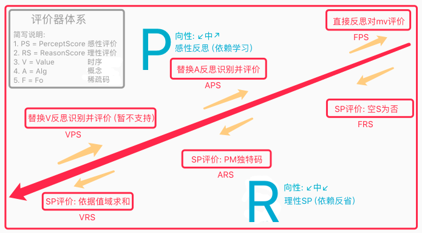

# v2.0版本六测 & 评价器

> 注:
> 1. 六测在n21p20已经开始->本章继续;
> 2. V评价迭代在n21p21已经开始->本章继续;

***

<!-- TOC -->

- [v2.0版本六测 & 评价器](#v20版本六测--评价器)
  - [n22p1 评价器整理](#n22p1-评价器整理)
  - [n22p2 值域求和2](#n22p2-值域求和2)

<!-- /TOC -->

## n22p1 评价器整理
`CreateTime 2021.01.05`

在Note21中对`时序支持空S评价`和`稀疏码评价迭代支持值域求和`,所以现在整个评价器体系更加完善,本节对这些进行整理;

| 22011 | 评价器体系整理 |
| --- | --- |
| 评价器 |  |
| 说明 | 如图: 当前的评价体系较为完善,但代码比较混乱,不像类比器代码的那么条理; |
| 说明 | 感性评价以mv和fo为主,理性评价以alg和value为主; |
| 代码 | 考虑写个AIScore类,将所有评价器整理进来; |

| 22012 | 支持APS评价 |
| --- | --- |
| 说明 | 以前原本支持替换Alg并反思fo,后来弃用了?代码找不到; |

   

## n22p2 值域求和2
`CreateTime 2021.01.05`

本节针对训练中,偶发性S导致评价为否的问题,对值域求和进行迭代,支持更合理的VRS评价;

| 22021 | 偶发性S导致评价为否的问题2 |
| --- | --- |
| 示图 |  |
| 说明 | 转自2120A-方案4,本表重点依据SP抽象,进行值域求和评价迭代; |
| 分析 | 在`避免偶发性`问题的同时,面临`思维固化(偏见)`对理性评价的影响; |
| 方案1 | 根据抽象: 对SP外类比再抽象优先评价,其次具象评价; |
| 方案2 | 根据强度: 对SP的强度>30,优先评价,其次再对>10评价,再次>0; |
| 方案3 | 迁移为主,强化为辅,即: 方案1为主,方案2为辅,进行综合VRS评价; |

   
