# 九测(融合训练)

> 注:
> 1. 融合训练在八测中已经开始->本章继续;

> 名词解析:
> 1. toFC: 决策流程控制;
> 2. 实概念: 来自inModel中的概念;
> 3. 虚概念: 来自TO解决方案中的概念;
> 4. RFo: 无mv指向的fo;
> 5. IRT: InRethink的简写;

***

<!-- TOC -->

- [九测(融合训练)](#九测融合训练)
  - [n23p01 九测-觅食训练 (getInnerV3回测)](#n23p01-九测-觅食训练-getinnerv3回测)
  - [n23p02 网络可视化迭代](#n23p02-网络可视化迭代)
  - [n23p03 getInnerHN拆分](#n23p03-getinnerhn拆分)
  - [n23p04 加强RFo抽具象关联](#n23p04-加强rfo抽具象关联)
  - [n23p05 九测2-觅食训练 (内中外类比v4 & getInnerV3回测)](#n23p05-九测2-觅食训练-内中外类比v4--getinnerv3回测)
  - [n23p06 反省更理性迭代](#n23p06-反省更理性迭代)
  - [n23p07 九测3-觅食训练 (VRS评价不稳定回测)](#n23p07-九测3-觅食训练-vrs评价不稳定回测)

<!-- /TOC -->

## n23p01 九测-觅食训练 (getInnerV3回测)
`CreateTime 2021.04.11`

在上节中,对理性子任务做了迭代,本节再次对觅食和防撞融合训练,测试之;

| 23011 | 觅食训练最终步骤 (参考22035) |
| --- | --- |
| 1 | `直投,右下飞,直投`, `边直投边飞至右上`x N |
| 2 | `重启,右投,飞至坚果,马上饿`x3 `左投,飞至坚果,马上饿`x3 |
| 3 | `重启,右投,马上饿` (会原地空吃,发现不行再飞至坚果吃) `左投,马上饿`; |

| 23012 | 防撞训练步骤 (参考22161) |
| --- | --- |
| 1 | `直扔木棒`x8向=>习得`F18[A8(无距棒)]->{mv-}` |
| 2 | `偏扔木棒,边右飞边扔`xN=>习得不被撞的经验`Fx->{mv0}` |

| 23013 | getInnerV3()在HN时,传入maskFo为Alg类型错误的BUG `T` |
| --- | --- |
| 调试 | 经调试,错误出现在,当MC转PM进行GL修正失败后,递归回到_Hav找ATHav坚果 |
| 数据 | 此时输出短时结构从父到子为:cFo->cAlg->mAlg->mcValue; |
| 说明 | 即mcValue修正码的父级是实概念(matchAlg),而不是虚概念(curAlg); |
| 分析 | 解决方案的虚概念才需要ATHav,而inModel中的实概念是不需要ATHav的; |
| 治标 | 在传入到getInnerV3的参数做检查,base不是fo类型时,则取base.baseFo; |
| 治本 | toFC中value失败时,如base是replaceAlg跳过,对base.baseAlg做begin; |
| 结果 | 问题本质是`实Alg无需进行ATHav`,治标治本两方案全改掉后ok; |

| 23014 | 无GL距小经验的BUG |
| --- | --- |
| 示图 | 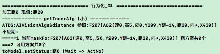 |
| 说明 | 在23011第2步中,已经训练右飞变近,但在第3步时,还是未找到GL经验; |
| 调试 | 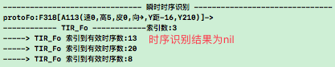 |
|  | 说明:如图TIRFo失败,即当前场景都认识不清,何淡在getInnerV3中应用; |
| TODO | 1. 将TIRFo的结果中,不指向mv的放开 (并处理可能导致的副作用) `T`; |
|  | --> 但仅是放开normal部分,而不放开HNGL和虚mv的部分; |
|  | --> 将不指向mv的命名为matchRFos,原指向的改为matchPFos; |
| TODO | 2. 将TIRFo时,识别目标由matchAFo改为protoAlg (并处理副作用) `T`; |
|  | --> 因为:如图现在matchAFo.A113与inModel.matchAlgs是同层,结构操作乱; |
|  | --> 会导致判断全含时,A113特征不全导致失败; |
|  | --> 并且A113当前向抽象取的assIndexes也不全; |
| TODO | 3. 将TIRFo方法中的assIndexes,改为直接使用inModel.matchAlgs `T`; |
|  | --> 因为TIRAlg不限层,所以无论是matchAlgs或absPorts,都算支持多层; |
|  | --> 结果: 先不改,因为fromRethink时无matchAlgs,但absPorts更通用支持; |

| 23015 | 23014分析2改为protoFo后无法构建F14的问题 `T` |
| --- | --- |
| 简介 | 改为protoFo后,发现最初还没抽象时,仅相似的两个fo无法识别并外类比; |
| 问题 | 无法外类比`A`就无法抽象`B`,无法抽象就无法识别`C`(识别就是识别抽象); |
| 分析 | 以上ABC三模块形成死循环,所以必须在起初留下一个切入口来解决之; |
| 分析 | 改动前无问题,因为matchAFo在构建时没有mAlg就会用partAlg,算切入口; |
| 方案 | 将tirFo的fo参数改为:识别到matchAlg时才用protoFo,否则还用matchAFo; |

| 23016 | 23014分析1放开matchRFos后,应用总结 `T` |
| --- | --- |
| 1 | 原matchFos改为matchPFos后,原调用全不变默认为matchPFos; |
| 2 | 现matchRFos由以下几处调用: |
|  | a. analogyInner_Outside_V3()中联想assFo处改为用matchRFos; |
| TODO | 将有mv指向的fo.ds和无mv指向的fo.ds改为ATPercept和ATReason; |

| 23017 | 回测23014无GL经验BUG `T` |
| --- | --- |
| 日志 | 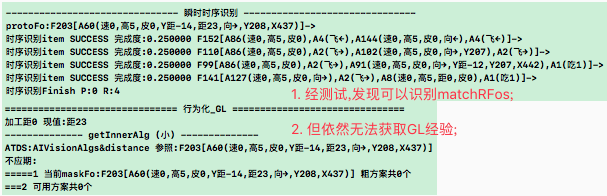 |
| 说明 | 如图,当前maskFo仅有protoFo:F203一条,看来并未取到matchFos; |
| 分析 | 1. 在TIRFo识别后,protoFo并非结束,所以并不会与matchFos抽具象关联 |
|  | 2. 现在getInnerV3中取absPorts是取不到matchFos的; |
| 方案 | 直接将protoFo所在的inModel.matchFos传入getInnerV3取GL经验; |
| 延伸 | HN时,没有inModel参数可传,并且似乎与GL时联想路径也不同 `转n23p03`; |
| 结果 | 按着方案,改代码后,依然无法获取GL经验,转23018; |

| 23018 | 取不到GL经验的BUG `转至n23p04` |
| --- | --- |
| 调试 | 调试发现,在内中外类比期就未对matchRFos形成嵌套GL,所以用时取不到; |
| 调试 | 1. 内类比是对protoFo,每次protoFo都不同,无法互相识别为matchRFos; |
|  | 2. 内中外类比是根据matchRFos来联想assFo,从而形成matchRFos的GL; |
|  | 3. 如上死循环,所以protoFo之间的嵌套GL,永远无法互相"内中外类比"; |
|  | 4. 所以matchRFos永远不会指向GL; |
| 分析 | 类似TIR_Fo时使用matchAFo,此处也可以做"激活期"; |
| 方案 | 将相似的protoFo,指向的GL作为assFo与abFo激活类比; |
|  | 注: 因此处partAlg并未做时序识别,故此处相似protoFo由matchRFos向具象取; |
|  | 问题: matchRFos向具象取不到,因为protoFo和matchRFos之间无关联; |
| 结果 | 其本质为matchRFos与protoFo之间无抽具象关联 `转至n23p04`; |

   

## n23p02 网络可视化迭代
`CreateTime 2021.04.11`

说明: 前段时间支持了dsPorts,所以本次将对嵌套迭代;

| 23021 | 嵌套迭代 |
| --- | --- |
| 1 | 将dsPorts支持为嵌套方式展示; |
| 2 | 将hngl支持为嵌套方式展示; |
| UI | 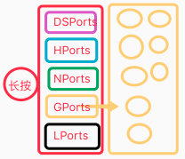 |
| 说明 | UI:将嵌套支持为点击节点时,在周围展开显示,不同类型采用不同颜色; |

| 23022 | 快捷添加节点迭代 |
| --- | --- |
| 1 | 将addNode窗口的参数,改为指定格式的字符串拼接; |

   

## n23p03 getInnerHN拆分
`CreateTime 2021.04.16`

在getInnerV3迭代后,发现GL和HN的联想是不同路径的(参考23017),本节将针对HN的独立做笔记;

| 23031 | 示例说明:`获取HN经验`的`联想路径` |
| --- | --- |
| 比如 | P-解决方案,想吃桃,步骤如下: |
| 1 | getInnerHN取得: [超市,买得到桃],返给决策; |
| 2 | 又需要找到超市,再到getInnerHN取得:[出发点,去超市],返给决策; |
| 3 | 出发点在inModels中发现自己在家,找到具象时序:[家出发,去,X路A辉超市]; |
| 说明 | 由例可见,二者在联想路径的向性上完全相反; |
|  | 1. GL的路径向性为:下右向上左 (从时序向着抽象的概念的联想); |
|  | 2. HN的路径向性为:左上向右下 (从概念向着时序的具象的联想); |
| 代码 | 独立写getInnerHN方法,并传入cAlg来联想; |

   

## n23p04 加强RFo抽具象关联
`CreateTime 2021.04.21`

1. 在23018中,决策期取不到GL经验的问题,想通过类比期内中外类比解决;
2. 而内中外类比又找不到assFo,因为无"激活期",导致matchRFos的抽象无GL指向;
3. 本质为RFo抽具象太弱,本节重点针对此问题展开,加强RFo的抽具象关联;

| 23041 | 增强RFo抽具象关联-方案1-代码规划 `90%,选用` |
| --- | --- |
| 示图 | 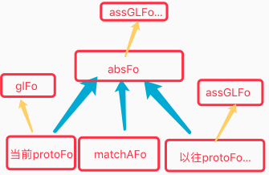 |
| TODO1 | **激活期** (初步建立RFo抽具象关联) `T` |
|  | 1. 在TIRFo后,对matchRFos和当前protoFo分别外类比抽象,以增强抽具象; |
| TODO2 | **内中外类比期** (内中外类比v4迭代-改进assFo联想方式) `T` |
|  | 2. 内中外类比先取absFo.assGLFo,将结果absGLFo嵌套在absFo下; |
|  | 3. 再后以absFo向具象取以往protoFo.assGLFo,将结果嵌套在absFo下; |
|  | 注: 关于嵌套在absFo下,参考反向反馈外类比代码 |

| 23042 | 增强RFo抽具象关联-方案2 `5%,不选用` |
| --- | --- |
| 说明 | 直接用protoFo指向matchRFo,然后在absPort中,指定matchIndex; |
| 问题 | 这样虽然看起来网络更简单,但操作复杂度更高; |
| 弃用 | 毕竟现在实现方式并不是并行过滤器,所以此方案在代码操作上麻烦,故弃用; |

   

## n23p05 九测2-觅食训练 (内中外类比v4 & getInnerV3回测)
`CreateTime 2021.04.23`

| 23051 | 获取不到GL问题回测 `不复现` |
| --- | --- |
| 问题 | 测得,PM评价`向→不通过`,明天再重新训练觅食,试下能否复现; |

| 23052 | 右GL正常_左GL无经验的BUG |
| --- | --- |
| 示图 | 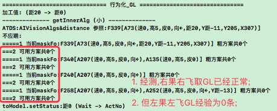 |

| 23053 | 左果误取右飞GL经验的BUG `T` |
| --- | --- |
| 示图 | 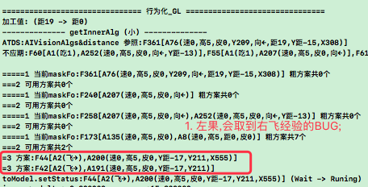 |
| 分析 | 因为A135和A8是过度抽象的,所以误取很正常,并非BUG; |
| 结果 | 当这些过度抽象之下的所有GL解决方案全被空S评价为否时自然就ok了; |

| 23054 | 左果无GL经验的BUG |
| --- | --- |
| 示图 | 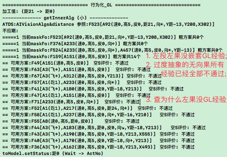 |
| 分析 | 重点查左果在内中外类比v4处,能否给左果嵌套到GL经验; |
| 调试 | 经初步调试,在觅食第2步中,并未内中外类比给`左果`构建GL经验; |
| 疑点 | 1. 时序未去重,导致右果组成同样的时序,有可能有多个; |
|  | > 在ThinkingUtils有过Fo去重方法,后来注掉了,原因忘了; |
|  | > 此问题未必与时序未去重有影响,因为大致只有那一两个同内容重复的时序; |
| 调试 | 按23055训练后,右果有嵌套GL经验,左果仍没有,如下图所示: |
|  | 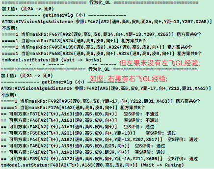 |

| 23055 | 觅食训练步骤 |
| --- | --- |
| 1 | `直投,右下飞,直投`, `边直投边飞至右上`x N |
| 2 | `重启,右投很远,飞至坚果` `重启,左投很远,飞至坚果` |
| 3 | `重启,右投,马上饿` `重启,左投,马上饿`; |

| 23056 | 觅食训练步骤调整 |
| --- | --- |
| 1 | `边直投边飞至左下`, `边直投边飞至右上` |
| 2 | `重启,左投,飞至坚果,摸嘴吃`x3 `重启,右投,飞至坚果,摸嘴吃`x3 |
| 3 | `重启,右投,马上饿` `重启,左投,马上饿`; |

| 23057 | 不稳定嵌套GL空S评价未记录为否的BUG `T` |
| --- | --- |
| 示图 | 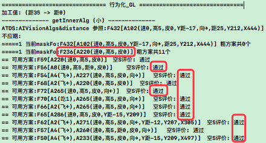 |
| 说明 | F236的GL是不稳定的,但是左扔,右扔训练多次后,发现空S评价还是全通过; |
| 调试 | 经调试,在analogy_OutRethink中,空S时,构建的时序为nil,导致此BUG; |
| 原因 | 前两天打开fo防重,当content_ps为nil时,会不构建fo,导致空S时序返回空 |
| 方案 | 将fo.create_NoRepeat()改为content_ps为空时,构建新节点,回测ok; |

| 23058 | 右果嵌套GL为0的问题 `T` |
| --- | --- |
| 示图 | 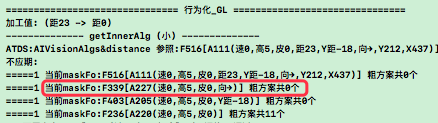 |
| 说明 | 训练多次,右果的GL嵌套仍为0条; |
| 分析 | 到内中外类比v4中,调试查`右果`的构建情况,如下: |
| 调试 | absFo很多,但只类比5条,有些absFo压根没类比故没有gl,右果就在此列; |
| 方案 | 调整配置参数,限制每个absFo下assFo数,使每个absFo都有机会类比到gl; |
| 结果 | 修改absFo.con取3条,再取glhnPorts取2条,类比数从5改为20,回测ok; |

| 23059 | 无关稀疏码通不过VRS评价的问题 `转至n23p06` |
| --- | --- |
| 示图 | 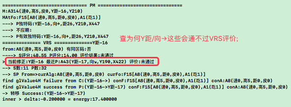 |
| 说明 | 按着23056训练至第3步后,发现PM中,会对`距→`,`Y距`这些评价不通过; |
| 分析 | 最初第三步评价还通过,重复第三步,则可能不通过; |
| 问题 | 所以怀疑是不稳定的VRS评价导致 (易受SP影响) `转至n23p06`; |

   

## n23p06 反省更理性迭代
`CreateTime 2021.04.30`

在23059中,发现VRS易受SP影响,从而使不需要加工的稀疏码在PM中VRS评价不通过,本节将针对此问题,对IO两个反省做理性迭代,使之更明确责任,避免被偶然的S误伤到无辜的稀疏码;

| 23061 | SP导致VRS评价不稳定-解决方案分析 |
| --- | --- |
| 调试 | 经调试,S的主要来源是InRethink; |
| 方案1 | 生成由合适的fromto范围表征的alg来解决,使值域稳定沉淀; |
|  | 扩展思考:from-to可变吗? |
| 方案2 | 更理性反省: 使反省时责任分担更明确,从而避免影响VRS不稳定; |
|  | > Out时,距离没解决时,反省时只有距离做S(100%责任),`向,Y距`等码无责; |
|  | > In时,责任分摊与承担力正相关,如原距离导致90%,那么现也承担90%的责任; |
| 方案3 | 原则: 抽象指导性，评价稳定性。 |
|  | > 先查现抽象构建与评价结果代码,尽量围绕以上两点原则制定方案改动; |

| 23062 | VRS评价的spPorts有重复的问题 `T` |
| --- | --- |
| 示图 | 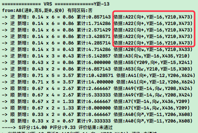 |
| 说明 | 重复评分会影响到VRS评价结果,所以先改了这个后,再看用不用迭代更理性SP; |
| 结果 | 重复的BUG已修复,但回测VRS评价不稳定问题仍然存在; |

| 23063 | SP导致VRS评价不稳定-方案2-取消IRT方案 |
| --- | --- |
| 分析 | InRethink并没有下探到V层次，所以应取消IRT构建SP; |
| 改为 | IRT触发器在取消构建SP后,应改为触发S时吸引注意力,吸引注意力后的操作: |
| 1 | 力度更大的识别,预测到R-任务 (比如动物疯叫预测地震); |
|  | > 力度未必更大,没必要,`所以此条可能不必做任何迭代`; |
| 2 | S则产生纯理性疑问任务 (新任务类型); |
|  | > 疑问任务被解决: 如停车场的某车灯突然灭,其实也没啥不正常; |
|  | > 疑问任务未能解决: 如苹果掉向天上,这事思来考去也不正常; |
|  | > `此条暂不必支持`,等以后需要支持时再来翻看此处; |
| 3 | 关掉IRT `T`; |

| 23064 | SP的再抽象未作用于VRS评价 `T` |
| --- | --- |
| 简介 | 根据23061方案3查代码,发现SP再抽象未作用于VRS评价; |
| 方案 | 将absSP嵌套在protoFo下,以使其作用于VRS评价,以及作用于今后外类比; |
| 示图 | 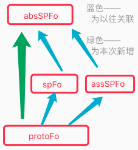 |
| 结果 | 代码已改动,不过此改动并不能根治VRS评价不稳定问题,需搭配`定责`; |
| 回测 | 发现VRS评价不稳定问题不复现了,因为absSP对VRS影响太强了; |

| 23065 | SP导致VRS评价不稳定-方案2-ORT定责 `暂停` |
| --- | --- |
| 简介 | 在ORT中,定责给gl修正失败的V,而非所有未finish的V; |
| 分析 | 修复23064后,不复现,待再测看能否复现; |
| 结果 | 在修复23064后,发现VRS不稳定的问题无法复现了,所以`定责暂停`不改; |

   

## n23p07 九测3-觅食训练 (VRS评价不稳定回测)
`CreateTime 2021.04.23`

| 23071 | getInner没有不应期导致重复飞错方向的问题 `T` |
| --- | --- |
| 示图 | 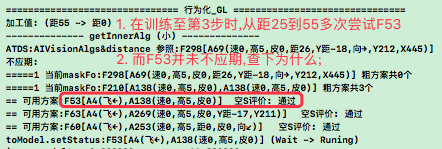 |
| 分析 | 当飞错方向时,距离一变,ToValueModel也变了,所以原不应期不再生效; |
|  | 而此时,反省类比还在异步中未执行到,所以空S评价也还没生效; |
| 方案1 | 当ToValueModel变化时,旧ToValueModel的不应期依然有效; |
|  | `5%采用`,因为一米外和千米外可能使用不同的解决方案; |
| 方案2 | 无论是OPushM还是ActYes的触发器,只要其中一个反馈则触发反省; |
|  | `95%采用`,比如车顶前行反后退,我们能立马意识到,不需要等生物钟触发器; |
| 结果 | 根据方案2改掉后,回测问题已解决; |

| 23072 | 飞至坚果飞超了的问题 `不复现` |
| --- | --- |
| 示图 | 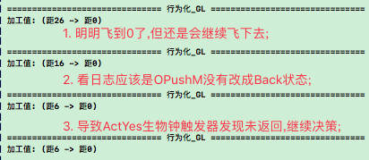 |
| 说明 | 如图,明明飞到坚果了,却没有吃,飞超了,执行了多次`距6->0`; |
| 分析 | 经调试,在tor_OPushM中,未能对已距0的坚果匹配到反馈,致`6->0`重复; |
| 结果 | 打了调试日志,但不复现,等复现时再看日志分析吧; |

| 23073 | 上果上飞GL经验被空S否掉的问题 |
| --- | --- |
| 示图 | 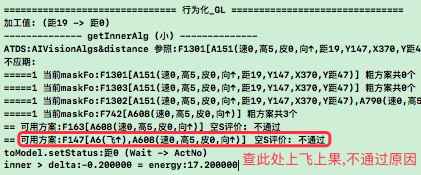 |
| 说明 | 原本已训练好上觅食,但下觅食老失败 |
|  | 多次训练下觅食成功后,发现上觅食GL经验被否 |
| 假想 | 原因: 会不会是因为在4条瞬时长度内,经历了上飞和下飞两个经历; |
|  | 问题: 导致在内类比中,一条空S这么偶然发生了; |
|  | 如假想成立: 那此处关键在于`偶然的一次空S`不应彻底杀掉当前经验; |
|  | 解决方案: 对SP经验,记录sStrong和pStrong,二者自由竞争; |

| 23074 | 变向觅食训练 |
| --- | --- |
| 训练 | 对8个方向都做训练,坚果扔到任何地方都可以自行调整方向飞过去吃掉; |

| 23075 | 变向失败的问题 |
| --- | --- |
| 示图 | 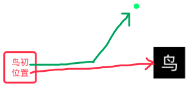 |
| 说明 | 已对8个单方向觅食训练ok,但在变向训练中,发现没能变向; |
| 调试 | 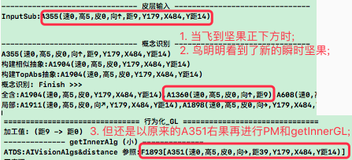 |

   
