# 九测(融合训练)

> 注:
> 1. 融合训练在八测中已经开始->本章继续;

> 名词解析:
> 1. toFC: 决策流程控制;
> 2. 实概念: 来自inModel中的概念;
> 3. 虚概念: 来自TO解决方案中的概念;
> 4. RFo: 无mv指向的fo;
> 5. IRT: InRethink的简写;

***

<!-- TOC -->

- [九测(融合训练)](#九测融合训练)
  - [n23p01 九测-觅食训练 (getInnerV3回测)](#n23p01-九测-觅食训练-getinnerv3回测)
  - [n23p02 网络可视化迭代](#n23p02-网络可视化迭代)
  - [n23p03 getInnerHN拆分](#n23p03-getinnerhn拆分)
  - [n23p04 加强RFo抽具象关联](#n23p04-加强rfo抽具象关联)
  - [n23p05 九测2-觅食训练 (内中外类比v4 & getInnerV3回测)](#n23p05-九测2-觅食训练-内中外类比v4--getinnerv3回测)
  - [n23p06 反省更理性迭代](#n23p06-反省更理性迭代)
  - [n23p07 九测3-觅食训练 (VRS评价不稳定回测)](#n23p07-九测3-觅食训练-vrs评价不稳定回测)
  - [n23p08 九测4-GL误杀回测 & 变向觅食训练](#n23p08-九测4-gl误杀回测--变向觅食训练)
  - [n23p09 十测-防撞训练&防撞觅食融合训练-子任务测试](#n23p09-十测-防撞训练防撞觅食融合训练-子任务测试)
  - [n23p10 子任务协同迭代v2](#n23p10-子任务协同迭代v2)
  - [n23p11 FRS空S评价迭代-改为自由竞争](#n23p11-frs空s评价迭代-改为自由竞争)
  - [n23p12 十测2-子任务测试](#n23p12-十测2-子任务测试)
  - [n23p13 父子任务防重](#n23p13-父子任务防重)
  - [n23p14 dsFo的全树不应期](#n23p14-dsfo的全树不应期)
  - [n23p15 十测3-子任务测试](#n23p15-十测3-子任务测试)
  - [n23p16 同级多任务协作](#n23p16-同级多任务协作)
  - [n23p17 十一测-子任务测试](#n23p17-十一测-子任务测试)
  - [n23p18 FRSTime更理性迭代](#n23p18-frstime更理性迭代)
  - [n23p19 十一测-子任务测试2](#n23p19-十一测-子任务测试2)
  - [n23p20 IRT打开后_SP迭代分析](#n23p20-irt打开后_sp迭代分析)
  - [n23p21 测试dsFo的反省SP](#n23p21-测试dsfo的反省sp)
  - [n23p22 十一测:继续训练dsFo与SP相关问题](#n23p22-十一测继续训练dsfo与sp相关问题)

<!-- /TOC -->

## n23p01 九测-觅食训练 (getInnerV3回测)
`CreateTime 2021.04.11`

在上节中,对理性子任务做了迭代,本节再次对觅食和防撞融合训练,测试之;

| 23011 | 觅食训练最终步骤 (参考22035) |
| --- | --- |
| 1 | `直投,右下飞,直投`, `边直投边飞至右上`x N |
| 2 | `重启,右投,飞至坚果,马上饿`x3 `左投,飞至坚果,马上饿`x3 |
| 3 | `重启,右投,马上饿` (会原地空吃,发现不行再飞至坚果吃) `左投,马上饿`; |

| 23012 | 防撞训练步骤 (参考22161) |
| --- | --- |
| 1 | `直扔木棒`x8向=>习得`F18[A8(无距棒)]->{mv-}` |
| 2 | `偏扔木棒,边右飞边扔`xN=>习得不被撞的经验`Fx->{mv0}` |

| 23013 | getInnerV3()在HN时,传入maskFo为Alg类型错误的BUG `T` |
| --- | --- |
| 调试 | 经调试,错误出现在,当MC转PM进行GL修正失败后,递归回到_Hav找ATHav坚果 |
| 数据 | 此时输出短时结构从父到子为:cFo->cAlg->mAlg->mcValue; |
| 说明 | 即mcValue修正码的父级是实概念(matchAlg),而不是虚概念(curAlg); |
| 分析 | 解决方案的虚概念才需要ATHav,而inModel中的实概念是不需要ATHav的; |
| 治标 | 在传入到getInnerV3的参数做检查,base不是fo类型时,则取base.baseFo; |
| 治本 | toFC中value失败时,如base是replaceAlg跳过,对base.baseAlg做begin; |
| 结果 | 问题本质是`实Alg无需进行ATHav`,治标治本两方案全改掉后ok; |

| 23014 | 无GL距小经验的BUG |
| --- | --- |
| 示图 |  |
| 说明 | 在23011第2步中,已经训练右飞变近,但在第3步时,还是未找到GL经验; |
| 调试 |  |
|  | 说明:如图TIRFo失败,即当前场景都认识不清,何淡在getInnerV3中应用; |
| TODO | 1. 将TIRFo的结果中,不指向mv的放开 (并处理可能导致的副作用) `T`; |
|  | --> 但仅是放开normal部分,而不放开HNGL和虚mv的部分; |
|  | --> 将不指向mv的命名为matchRFos,原指向的改为matchPFos; |
| TODO | 2. 将TIRFo时,识别目标由matchAFo改为protoAlg (并处理副作用) `T`; |
|  | --> 因为:如图现在matchAFo.A113与inModel.matchAlgs是同层,结构操作乱; |
|  | --> 会导致判断全含时,A113特征不全导致失败; |
|  | --> 并且A113当前向抽象取的assIndexes也不全; |
| TODO | 3. 将TIRFo方法中的assIndexes,改为直接使用inModel.matchAlgs `T`; |
|  | --> 因为TIRAlg不限层,所以无论是matchAlgs或absPorts,都算支持多层; |
|  | --> 结果: 先不改,因为fromRethink时无matchAlgs,但absPorts更通用支持; |

| 23015 | 23014分析2改为protoFo后无法构建F14的问题 `T` |
| --- | --- |
| 简介 | 改为protoFo后,发现最初还没抽象时,仅相似的两个fo无法识别并外类比; |
| 问题 | 无法外类比`A`就无法抽象`B`,无法抽象就无法识别`C`(识别就是识别抽象); |
| 分析 | 以上ABC三模块形成死循环,所以必须在起初留下一个切入口来解决之; |
| 分析 | 改动前无问题,因为matchAFo在构建时没有mAlg就会用partAlg,算切入口; |
| 方案 | 将tirFo的fo参数改为:识别到matchAlg时才用protoFo,否则还用matchAFo; |

| 23016 | 23014分析1放开matchRFos后,应用总结 `T` |
| --- | --- |
| 1 | 原matchFos改为matchPFos后,原调用全不变默认为matchPFos; |
| 2 | 现matchRFos由以下几处调用: |
|  | a. analogyInner_Outside_V3()中联想assFo处改为用matchRFos; |
| TODO | 将有mv指向的fo.ds和无mv指向的fo.ds改为ATPercept和ATReason; |

| 23017 | 回测23014无GL经验BUG `T` |
| --- | --- |
| 日志 |  |
| 说明 | 如图,当前maskFo仅有protoFo:F203一条,看来并未取到matchFos; |
| 分析 | 1. 在TIRFo识别后,protoFo并非结束,所以并不会与matchFos抽具象关联 |
|  | 2. 现在getInnerV3中取absPorts是取不到matchFos的; |
| 方案 | 直接将protoFo所在的inModel.matchFos传入getInnerV3取GL经验; |
| 延伸 | HN时,没有inModel参数可传,并且似乎与GL时联想路径也不同 `转n23p03`; |
| 结果 | 按着方案,改代码后,依然无法获取GL经验,转23018; |

| 23018 | 取不到GL经验的BUG `转至n23p04` |
| --- | --- |
| 调试 | 调试发现,在内中外类比期就未对matchRFos形成嵌套GL,所以用时取不到; |
| 调试 | 1. 内类比是对protoFo,每次protoFo都不同,无法互相识别为matchRFos; |
|  | 2. 内中外类比是根据matchRFos来联想assFo,从而形成matchRFos的GL; |
|  | 3. 如上死循环,所以protoFo之间的嵌套GL,永远无法互相"内中外类比"; |
|  | 4. 所以matchRFos永远不会指向GL; |
| 分析 | 类似TIR_Fo时使用matchAFo,此处也可以做"激活期"; |
| 方案 | 将相似的protoFo,指向的GL作为assFo与abFo激活类比; |
|  | 注: 因此处partAlg并未做时序识别,故此处相似protoFo由matchRFos向具象取; |
|  | 问题: matchRFos向具象取不到,因为protoFo和matchRFos之间无关联; |
| 结果 | 其本质为matchRFos与protoFo之间无抽具象关联 `转至n23p04`; |

   

## n23p02 网络可视化迭代
`CreateTime 2021.04.11`

说明: 前段时间支持了dsPorts,所以本次将对嵌套迭代;

| 23021 | 嵌套迭代 |
| --- | --- |
| 1 | 将dsPorts支持为嵌套方式展示; |
| 2 | 将hngl支持为嵌套方式展示; |
| UI |  |
| 说明 | UI:将嵌套支持为点击节点时,在周围展开显示,不同类型采用不同颜色; |

| 23022 | 快捷添加节点迭代 |
| --- | --- |
| 1 | 将addNode窗口的参数,改为指定格式的字符串拼接; |

   

## n23p03 getInnerHN拆分
`CreateTime 2021.04.16`

在getInnerV3迭代后,发现GL和HN的联想是不同路径的(参考23017),本节将针对HN的独立做笔记;

| 23031 | 示例说明:`获取HN经验`的`联想路径` |
| --- | --- |
| 比如 | P-解决方案,想吃桃,步骤如下: |
| 1 | getInnerHN取得: [超市,买得到桃],返给决策; |
| 2 | 又需要找到超市,再到getInnerHN取得:[出发点,去超市],返给决策; |
| 3 | 出发点在inModels中发现自己在家,找到具象时序:[家出发,去,X路A辉超市]; |
| 说明 | 由例可见,二者在联想路径的向性上完全相反; |
|  | 1. GL的路径向性为:下右向上左 (从时序向着抽象的概念的联想); |
|  | 2. HN的路径向性为:左上向右下 (从概念向着时序的具象的联想); |
| 代码 | 独立写getInnerHN方法,并传入cAlg来联想; |

   

## n23p04 加强RFo抽具象关联
`CreateTime 2021.04.21`

1. 在23018中,决策期取不到GL经验的问题,想通过类比期内中外类比解决;
2. 而内中外类比又找不到assFo,因为无"激活期",导致matchRFos的抽象无GL指向;
3. 本质为RFo抽具象太弱,本节重点针对此问题展开,加强RFo的抽具象关联;

| 23041 | 增强RFo抽具象关联-方案1-代码规划 `90%,选用` |
| --- | --- |
| 示图 |  |
| TODO1 | **激活期** (初步建立RFo抽具象关联) `T` |
|  | 1. 在TIRFo后,对matchRFos和当前protoFo分别外类比抽象,以增强抽具象; |
| TODO2 | **内中外类比期** (内中外类比v4迭代-改进assFo联想方式) `T` |
|  | 2. 内中外类比先取absFo.assGLFo,将结果absGLFo嵌套在absFo下; |
|  | 3. 再后以absFo向具象取以往protoFo.assGLFo,将结果嵌套在absFo下; |
|  | 注: 关于嵌套在absFo下,参考反向反馈外类比代码 |

| 23042 | 增强RFo抽具象关联-方案2 `5%,不选用` |
| --- | --- |
| 说明 | 直接用protoFo指向matchRFo,然后在absPort中,指定matchIndex; |
| 问题 | 这样虽然看起来网络更简单,但操作复杂度更高; |
| 弃用 | 毕竟现在实现方式并不是并行过滤器,所以此方案在代码操作上麻烦,故弃用; |

   

## n23p05 九测2-觅食训练 (内中外类比v4 & getInnerV3回测)
`CreateTime 2021.04.23`

| 23051 | 获取不到GL问题回测 `不复现` |
| --- | --- |
| 问题 | 测得,PM评价`向→不通过`,明天再重新训练觅食,试下能否复现; |

| 23052 | 右GL正常_左GL无经验的BUG |
| --- | --- |
| 示图 |  |

| 23053 | 左果误取右飞GL经验的BUG `T` |
| --- | --- |
| 示图 |  |
| 分析 | 因为A135和A8是过度抽象的,所以误取很正常,并非BUG; |
| 结果 | 当这些过度抽象之下的所有GL解决方案全被空S评价为否时自然就ok了; |

| 23054 | 左果无GL经验的BUG |
| --- | --- |
| 示图 |  |
| 分析 | 重点查左果在内中外类比v4处,能否给左果嵌套到GL经验; |
| 调试 | 经初步调试,在觅食第2步中,并未内中外类比给`左果`构建GL经验; |
| 疑点 | 1. 时序未去重,导致右果组成同样的时序,有可能有多个; |
|  | > 在ThinkingUtils有过Fo去重方法,后来注掉了,原因忘了; |
|  | > 此问题未必与时序未去重有影响,因为大致只有那一两个同内容重复的时序; |
| 调试 | 按23055训练后,右果有嵌套GL经验,左果仍没有,如下图所示: |
|  |  |

| 23055 | 觅食训练步骤 |
| --- | --- |
| 1 | `直投,右下飞,直投`, `边直投边飞至右上`x N |
| 2 | `重启,右投很远,飞至坚果` `重启,左投很远,飞至坚果` |
| 3 | `重启,右投,马上饿` `重启,左投,马上饿`; |

| 23056 | 觅食训练步骤调整 |
| --- | --- |
| 1 | `边直投边飞至左下`, `边直投边飞至右上` |
| 2 | `重启,左投,飞至坚果,摸嘴吃`x3 `重启,右投,飞至坚果,摸嘴吃`x3 |
| 3 | `重启,右投,马上饿` `重启,左投,马上饿`; |

| 23057 | 不稳定嵌套GL空S评价未记录为否的BUG `T` |
| --- | --- |
| 示图 |  |
| 说明 | F236的GL是不稳定的,但是左扔,右扔训练多次后,发现空S评价还是全通过; |
| 调试 | 经调试,在analogy_OutRethink中,空S时,构建的时序为nil,导致此BUG; |
| 原因 | 前两天打开fo防重,当content_ps为nil时,会不构建fo,导致空S时序返回空 |
| 方案 | 将fo.create_NoRepeat()改为content_ps为空时,构建新节点,回测ok; |

| 23058 | 右果嵌套GL为0的问题 `T` |
| --- | --- |
| 示图 |  |
| 说明 | 训练多次,右果的GL嵌套仍为0条; |
| 分析 | 到内中外类比v4中,调试查`右果`的构建情况,如下: |
| 调试 | absFo很多,但只类比5条,有些absFo压根没类比故没有gl,右果就在此列; |
| 方案 | 调整配置参数,限制每个absFo下assFo数,使每个absFo都有机会类比到gl; |
| 结果 | 修改absFo.con取3条,再取glhnPorts取2条,类比数从5改为20,回测ok; |

| 23059 | 无关稀疏码通不过VRS评价的问题 `转至n23p06` |
| --- | --- |
| 示图 |  |
| 说明 | 按着23056训练至第3步后,发现PM中,会对`距→`,`Y距`这些评价不通过; |
| 分析 | 最初第三步评价还通过,重复第三步,则可能不通过; |
| 问题 | 所以怀疑是不稳定的VRS评价导致 (易受SP影响) `转至n23p06`; |

   

## n23p06 反省更理性迭代
`CreateTime 2021.04.30`

在23059中,发现VRS易受SP影响,从而使不需要加工的稀疏码在PM中VRS评价不通过,本节将针对此问题,对IO两个反省做理性迭代,使之更明确责任,避免被偶然的S误伤到无辜的稀疏码;

| 23061 | SP导致VRS评价不稳定-解决方案分析 |
| --- | --- |
| 调试 | 经调试,S的主要来源是InRethink; |
| 方案1 | 生成由合适的fromto范围表征的alg来解决,使值域稳定沉淀`太复杂5%`; |
|  | 扩展思考:from-to可变吗? |
|  | 总结: 此方案太复杂,VRS已经对值有了自由竞争,而节点中内容不会变化; |
| 方案2 | 更理性反省: 使反省时责任分担更明确,从而避免影响VRS不稳定`5%太复杂`; |
|  | > Out时,距离没解决时,反省时只有距离做S(100%责任),`向,Y距`等码无责; |
|  | > In时,责任分摊与承担力正相关,如原距离导致90%,那么现也承担90%的责任; |
|  | 总结: 此方案太复杂,并且定责的方式,与自由竞争网络功效重复; |
| 方案3 | 原则: 抽象指导性，评价稳定性`95%`。 |
|  | > 先查现抽象构建与评价结果代码,尽量围绕以上两点原则制定方案改动; |
| 方案4 | 参考23063,简单粗暴的关掉IRT即可 `5%`; |
|  | > 自欺欺人,仅通过经历不能认识到车撞来危险么?先抽象,后稳定才是正途; |

| 23062 | VRS评价的spPorts有重复的问题 `T` |
| --- | --- |
| 示图 |  |
| 说明 | 重复评分会影响到VRS评价结果,所以先改了这个后,再看用不用迭代更理性SP; |
| 结果 | 重复的BUG已修复,但回测VRS评价不稳定问题仍然存在; |

| 23063 | SP导致VRS评价不稳定-方案2-取消IRT方案 `T` |
| --- | --- |
| 分析 | InRethink并没有下探到V层次，所以应取消IRT构建SP; |
| 改为 | IRT触发器在取消构建SP后,应改为触发S时吸引注意力,吸引注意力后的操作: |
| 1 | 力度更大的识别,预测到R-任务 (比如动物疯叫预测地震); |
|  | > 力度未必更大,没必要,`所以此条可能不必做任何迭代`; |
| 2 | S则产生纯理性疑问任务 (新任务类型); |
|  | > 疑问任务被解决: 如停车场的某车灯突然灭,其实也没啥不正常; |
|  | > 疑问任务未能解决: 如苹果掉向天上,这事思来考去也不正常; |
|  | > `此条暂不必支持`,等以后需要支持时再来翻看此处; |
| 3 | 关掉IRT `T`; |
| 更新 | 在23196防撞训练中,又测得关闭IRT的话,无法习得sPorts,所以重新打开; |

| 23064 | SP的再抽象未作用于VRS评价 `T` |
| --- | --- |
| 简介 | 根据23061方案3查代码,发现SP再抽象未作用于VRS评价; |
| 方案 | 将absSP嵌套在protoFo下,以使其作用于VRS评价,以及作用于今后外类比; |
| 示图 |  |
| 结果 | 代码已改动,不过此改动并不能根治VRS评价不稳定问题,需搭配`定责`; |
| 回测 | 发现VRS评价不稳定问题不复现了,因为absSP对VRS影响太强了; |

| 23065 | SP导致VRS评价不稳定-方案2-ORT定责 `修了部分,剩余转至23066` |
| --- | --- |
| 简介 | 在ORT中,定责给gl修正失败的V,而非所有未finish的V; |
| 分析 | 修复23064后,不复现,待再测看能否复现; |
| 结果 | 在修复23064后,发现VRS不稳定的问题无法复现了,所以`定责暂停`不改; |
| 复现 | 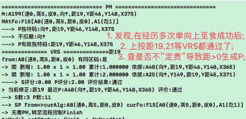 |
| 调试 | 在ORT中,将距>0的P打出来,然后将非距的S也打出来,并从中分析问题; |
|  | 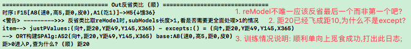 |
| TODO | 1. reModel改成最后一个 `T` |
|  | 2. 距20修正ok后改成finish (距>0的P问题修复,因为进入except了) `T` |
|  | 3. S时定责规则改动 `转至23066` |

| 23066 | ORT定责 |
| --- | --- |
| 注 | 未修正部分 = justPValues - 已修正; |
| P定赏 | A:`未修正部分均分赏` 当前做法为A; |
| S定罚 | A:`未修正部分均分责` 或 B:`当前加工失败的那一条全责` 当前做法为A; |
|  | 结果: B改动随后再说,目前不影响训练先不改; |

| 23067 | 本节时间线记录 |
| --- | --- |
| 20210509 | 1. 本节`方案4`在23063关掉IRT,BUG不复现,这么简单粗暴的解决; |
|  | 2. 本节`方案2`定责功能太复杂,暂没做,后再说; |
|  | 3. 本节`方案3`新增absSP作于用VRS评价; |
| 20210723 | 在23196中测得,因为IRT关闭,导致防撞训练的sPorts经验数总是0条; |
|  | 重新打开IRT,转至23197; |

   

## n23p07 九测3-觅食训练 (VRS评价不稳定回测)
`CreateTime 2021.05.09`

| 23071 | getInner没有不应期导致重复飞错方向的问题 `T` |
| --- | --- |
| 示图 |  |
| 分析 | 当飞错方向时,距离一变,ToValueModel也变了,所以原不应期不再生效; |
|  | 而此时,反省类比还在异步中未执行到,所以空S评价也还没生效; |
| 方案1 | 当ToValueModel变化时,旧ToValueModel的不应期依然有效; |
|  | `5%采用`,因为一米外和千米外可能使用不同的解决方案; |
| 方案2 | 无论是OPushM还是ActYes的触发器,只要其中一个反馈则触发反省; |
|  | `95%采用`,比如车顶前行反后退,我们能立马意识到,不需要等生物钟触发器; |
| 结果 | 根据方案2改掉后,回测问题已解决; |

| 23072 | 飞至坚果飞超了的问题 `不复现` |
| --- | --- |
| 示图 |  |
| 说明 | 如图,明明飞到坚果了,却没有吃,飞超了,执行了多次`距6->0`; |
| 分析 | 经调试,在tor_OPushM中,未能对已距0的坚果匹配到反馈,致`6->0`重复; |
| 结果 | 打了调试日志,但不复现,等复现时再看日志分析吧; |

| 23073 | 上果上飞GL经验被空S否掉的问题 `假想2:T` |
| --- | --- |
| 示图 |  |
| 说明 | 原本已训练好上觅食,但下觅食老失败 |
|  | 多次训练下觅食成功后,发现上觅食GL经验被否 |
| 假想 | 原因: 会不会是因为在4条瞬时长度内,经历了上飞和下飞两个经历; |
|  | 问题: 导致在内类比中,一条空S这么偶然发生了; |
|  | 如假想成立: 那此处关键在于`偶然的一次空S`不应彻底杀掉当前经验; |
|  | 解决方案: 对SP经验,记录sStrong和pStrong,二者自由竞争; |
|  | 结果: 同时发生两个,也不会都是actYes状态,所以此假想不成立; `T` |
| 假想2 | 情况: 距21在飞错方向变成距31后,再飞对方向,飞回21; |
|  | 错误: 在tor_OPushM中,还是和距21在比较,导致21=21反省S; |
|  | 解决方案: 在距31后,即将距21改成actNo状态,避免继续wait等待; |
| 假想3 | 因spFo是防重的,所以在无向果和右果下,会同时嵌套F40[右飞,距近]; |
|  | 当`无向果`的F40否掉后,`右果`下的F40也被否了,转至2307b; |

| 23074 | 变向觅食训练 |
| --- | --- |
| 训练 | 对8个方向都做训练,坚果扔到任何地方都可以自行调整方向飞过去吃掉; |

| 23075 | 变向失败的问题 `T` |
| --- | --- |
| 示图 |  |
| 说明 | 已对8个单方向觅食训练ok,但在变向训练中,发现没能变向; |
| 调试 |  |
| 分析 | 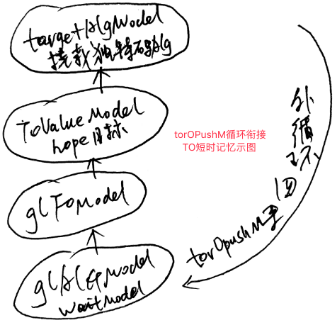 |
|  | 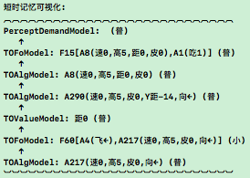 |
| 如图 | 当前问题为: 外循环后,衔接尾部还是头部的问题; |
|  | > 原做法为: 从尾部衔接,更新target的独特码,并继续PM; |
|  | > 现需求为: 从头部衔接,将target直接替换掉,并继续决策流程控制; |
| 注: | 其实都是从尾部衔接,只是现需求找更base一层,并交给决策FC来自动分配; |
| 方案 | 在tor_OPushM中不转PM,直接对target.baseAlg再次调用begin决策流程; |
|  | target.base.begin()会自己找到latestProtoA,并继续决策行为化; |

| 23076 | _Hav的不应期太抽象导致常切断决策流程 `T` |
| --- | --- |
| 示图 | 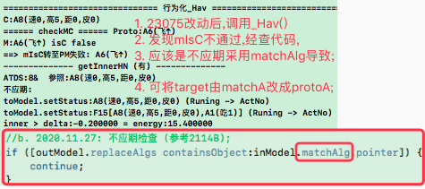 |
| 方案 | 将_Hav()中构建reModel时,把matchA改成protoA; |
| 防错 | 查代码,看所有调用reModel的地方,是否会有别的错误发生; |
| 结果 | 将reModel挂载改成protoA,并将torOPushM调用处改为仅判断pIsM; |

| 23077 | 偶尔距>0通过VRS评价的问题 |
| --- | --- |
| 示图 | 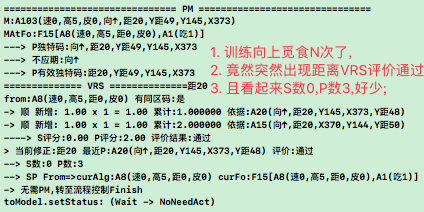 |
| 分析 | 同样是对A8进行评价,为何这么少经验,另外还`不复现`; |

| 23078 | 偶尔很熟的觅食GL找不到经验的问题 `T` |
| --- | --- |
| 示图 | 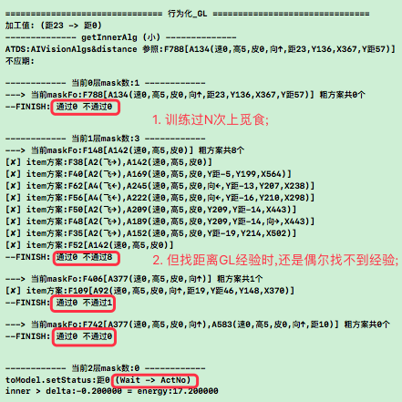 |
| 分析 | 经查,用protoFo向抽象联想太不靠谱了,有带mv的fo等等干扰; |
| 调试 | 而tirFo已抽象出absRFo,且内中外类比中将GL嵌套其下,所以: |
| 方案 | 将getInnerGL中的mask参数改为:protoFo+inModel.absRFos后,实测ok; |

| 23079 | 飞错方向再飞回来的protoA会被_GL()不应期掉的问题 `T` |
| --- | --- |
| 示图 |  |
| 问题 | 因为alg是防重的,如果飞错方向再飞回来,那么protoAlg会已进入不应期; |
|  | 导致飞回来的protoA不能作为GL加工参考 (如:距20飞错距30再飞回距20); |
| 方案 | 在tor_OPushM中将成功的replaceAlg设置为finish或actNo; |
|  | 然后在_GL()中,仅对actNo的做不应期,finish的不做; |

| 2307a | GL总是优先从protoF取经验但它常常太具象偶然 `T` |
| --- | --- |
| 示图 | 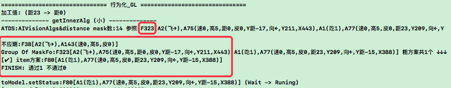 |
| 说明 | 图中显示了protoF的GL经验太具体,指导性弱; |
|  | 另外在变向觅食中因方向多变,上帧经验下帧就不适用了,故其稳定性也差; |
| 分析 | protoF未经先上后下(先指导性后稳定性)的洗礼,必然不确定性大; |
| 结果 | 因protoF的GL不确定性大,改为不从protoF取GL经验 `T`; |

| 2307b | spFo防重导致跨场景误杀 (参考23073) `T方案3已完成` |
| --- | --- |
| 示图 | 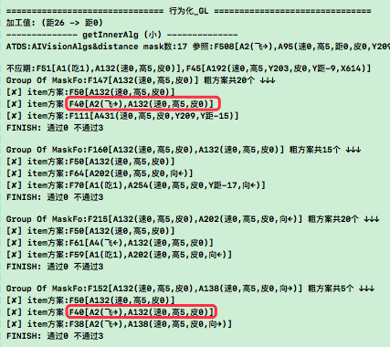 |
| 说明 | 如图,F40在无向果下被否,那么在右向果下则被跨界杀; |
| 方案1 | glFo仅对同场景下防重 `5%`; |
|  | 不同场景下的`[拿,来]`显然描述的是相同意思,所以此方案不选择; |
| 方案2 | spFo在构建时,将当前场景标记其中 `20%`; |
|  | 将pointer下加场景标记:baseFoId,在构建fo时,baseFoId做防重判断; |
|  | 分析: 此方案能解决问题,但与方案3效果一样,实现却更复杂; |
| 方案3 | SP仅对同场景下防重 `95%` |
|  | 分析: 本来SP就是嵌套的,而非全局的,所以仅对同场景下防重才是ok的; |
|  | 分析: 可对防重代码,指定防重域valid_ps (比如:当前场景.spPorts); |

   

## n23p08 九测4-GL误杀回测 & 变向觅食训练
`CreateTime 2021.05.23`

| 23081 | SP场景去重后回测还是有误杀情况 `T` |
| --- | --- |
| 示图 | 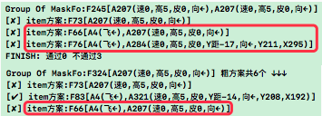 |
| 说明 | 如上图如示,按照2307b-方案3修改后,还是有误杀情况; |
| 调试 | 觅食训练中,将左右果的SP构建情况打印出来,查原因; |
| 分析 | 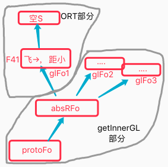 |
| 说明 | 如图如示,GL被跨场景复用了,所以S场景防重无效,GL场景防重才有效; |
| 结果 | 在createFo_NoRepeat()中,对GL类型也支持场景防重; |

| 23082 | 变向觅食训练步骤 |
| --- | --- |
| 1 | `边直投边飞至右上角`,`路径为:↘ → ↗ → ↗ → ↗ → ↗ → ↗` |
| 2 | `右投,右飞至坚果,摸嘴吃`x3 |
| 3 | `重启,右投,马上饿`,(自行飞至食之) |
| 4 | 换个方向,重复3,4步骤; |
| 5 | 变向训练:(坚果投至需要变向,马上饿,自行飞至食之); |
| 结果 | 至此,变向觅食训练成功; |
|  | 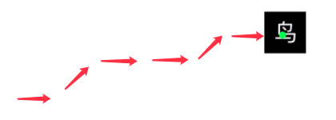 |

| 23083 | 飞至不食BUG `T` |
| --- | --- |
| 示图 | 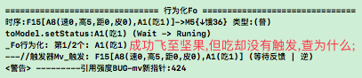 |
| 结果 | 经查,是因为`inner > delta:-0.2 = energy:0.0`,耗尽活跃度导致; |

   

## n23p09 十测-防撞训练&防撞觅食融合训练-子任务测试
`CreateTime 2021.05.24`

　　在n23p08中，变向觅食训练已经ok，本节将再次进行防撞训练，并且在防撞训练ok后，尝试进行防撞觅食融合训练。

　　在3月底已经写了子任务,但后面因为别的细节问题所阻,一直没测,本节将对子任务进行测试,并修复bug;

| 23091-防撞训练步骤 | 习得 (参考22202) |
| --- | --- |
| 1. `直扔木棒`x8向 | `Same经验: Fx[Ax(无距棒)]->{mv-}` |
| 2. `偏扔木棒`x8向 | `Diff经验: Fx->{mv0}` `P经验` |
| 3. `直扔木棒`x8向 | `S经验` |
| 4. `飞到危险地带,直扔` | R任务决策流程-应预测到危险并躲至安全地方 |

| 23092 | 反思子任务死循环 `T` |
| --- | --- |
| 示图 | 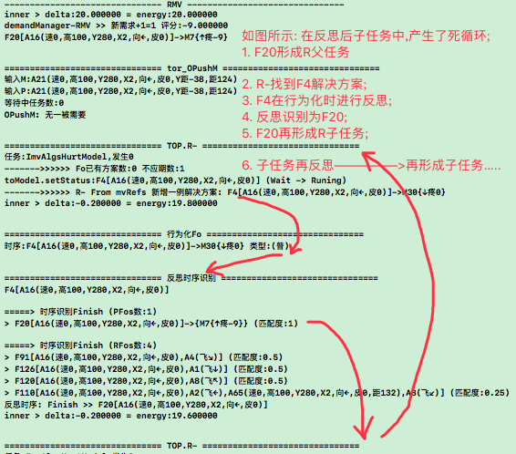 |
| 分析 | 如图,问题在于反思子任务死循环,只要使F4不反思到F20自己即可打破循环; |
| 代码 | 1. 在Fo行为化中,对父级`根任务和子任务`有任何重复的不生成子任务 `T`; |
|  | 2. 在反思评价中,对父级`根任务和子任务`有任务重复的不计入评分 `T`; |
| 结果 | 改代码后,回测ok; |

| 23093 | 防撞Y距VRS评价有误BUG |
| --- | --- |
| 示图 | 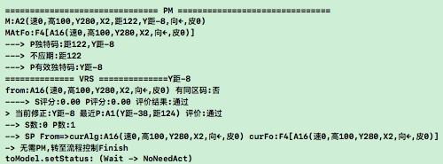 |
| 说明 | 如图,在第1步训练中,已被撞过数次,但在第3步训练中,Y距评价有误导致不躲; |
| 分析 | P数有为1也有为4,但S数一直是0; |
| 怀疑 | 1. 前段时间将IRT取消掉了,导致SP不够? |
| 调试 | 2. 在第2步训练中,也形成了防撞R任务,只是第2步本来就是偏扔,所以形成P; |
| 方案 | 在训练第1,2步后,再反过来训练第1步,看能否形成S; |
| 结果 | 根据方案对训练步骤进行调整; |

| 23094 | 反思子任务死循环2 `T` |
| --- | --- |
| 示图 | 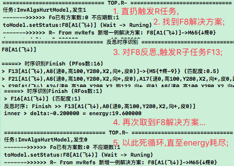 |
| 说明 | R子任务时,没把base挂在baseOrGroup下,导致23092收集防重链中断 |
| 结果 | 把R子任务base挂到baseOrGroup下后,防重全了,问题解决; |

| 23095 | 无计可施的R子任务未不应期掉 `T` |
| --- | --- |
| 示图 | 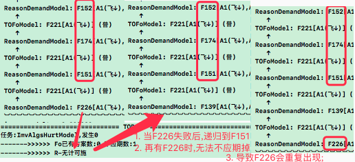 |
| 方案 | 将决策短时记忆树中,所有failure的R任务加入到不应期,避免重复尝试; |
| 结果 | 将R任务"无计可施"时,设为actNo状态,并在子任务时加入不应期,回测ok; |

| 23096 | 同质子任务 `转至n23p10` |
| --- | --- |
| 说明 | 防撞训练至第4步,下飞,反思预测到多条PFo->{mv-},都生成子任务太繁; |

   

## n23p10 子任务协同迭代v2
`CreateTime 2021.06.05`

　　在23096中,反思多条同质预测都生成了子任务,导致几乎一致的子任务,一次次进行R行为化,白白耗尽思维活跃度,本节将针对此问题,将子任务迭代至v2,对同质子任务之间的协同进行分析解决;

| 23101 | 同质子任务来源说明 `参考23096` |
| --- | --- |
| 示图 | 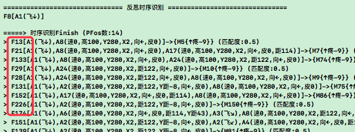 |
| 说明 | 只是一个小小的飞下动作,反思了一堆非常相似的结果,且都生成了子任务; |

| 23102 | 同质子任务的协同举例分析 |
| --- | --- |
| 举例 | 一只`催饿火神虫`飞过来,多条预测mv如下: |
|  | 预测mv: `1. 有东西害我不爽`,`2.会饿`,`3.会伤`,`4.烧伤`,`5.咬伤`; |
|  | 预测分析: `1最抽象`,`23略抽象`,`45最具象`; |
| 分析 | 1. 抽具象不重要,重要的是共同的ds,所以12345各自形成R子任务不变; |
|  | 2. 当任何一条子任务的解决方案行为化成功时,尝试协同作用于别的任务; |
|  | >> 如子任务2,干掉催饿火神虫后,子任务3自然就ok了; |
|  | >> 关键在于前面子任务的ds经验,同时也是后面别的子任务的ds解决方案; |
| 方案 | 新增子任务不应期: 解决了任何子任务的ds方案的场景fos全加入不应期; |

| 23103 | 子任务协同示图 `T` |
| --- | --- |
| 示图 | 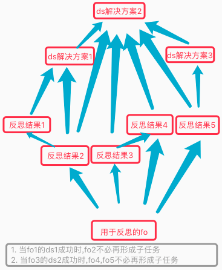 |
| 说明 | 如上图,套入23102实例; |
|  | ds1表示解决`会饿`,例如叼一块面包 |
|  | ds2表示解决`有东西害我不爽`,例如干掉`催饿火神虫`; |
|  | 全程为,叼一块面包冲出去干掉催饿火神虫,全部子任务完成; |

   

## n23p11 FRS空S评价迭代-改为自由竞争
`CreateTime 2021.06.05`

　　因为评价的结果不稳定,空S评价为否的一刀切方式显得非常武断,现实世界非常的多变,所以智能体也不可能尽取所有信息,此时网络的首和尾采用竞争,中部保持理性迁移是较好的协作方式;

| 23111 | 以往做法回顾 |
| --- | --- |
| 起点 | 在稀疏码层,HE采用了竞争方式 (束波求和); |
| 中段 | 在中间部分,HE采用了迁移方式,只有100%和0%,没有中间态; |
| 终点 | 在评价部分,HE采用了竞争方式,但不够彻底 `见23112-理感`; |

| 23112 | 终点: 评价竞争回顾 |
| --- | --- |
| 终感 | 其中感性评价: mv部分是自由竞争的; |
|  | > 感感: 价值的迫切度竞争; |
|  | > 感理: 解决方案的强度竞争; |
| 终理 | 但理性评价: 不全; |
|  | > 理感: SP部分,尤其是空S评价,显得非常武断,本节重要改进之; |
|  | > 理理: 对特征,概念,时序三者是否满足只有100%和0%,二值评价; |

| 23113 | FRS空S评价的自由竞争迭代 |
| --- | --- |
| 分析 | 见23112,空S评价中应该带有一些感性的方式,即类似稀疏码VRS自由竞争; |
| TODO | 1. SP仍然改回全局防重 (参考2307b-方案3); |
|  | 2. 对指向SP节点的场景fo.spPort,将sp发生的次数,计为spPort的强度; |
|  | 3. 将空S评价,改为由当前场景的sPort和pPort的强度进行竞争; |
| 疑问 | VRS和FRS都通过SP来实现竞争,但V有值,F却无值; |
| 解答 | 能否通过率来排序? S和P各自有自己的可行率, 然后通过率作为强度; |
| 暂停 | 在变向飞行训练中,此问题也有所体现,但目前主要在做n23p10,`此处暂停`; |

   

## n23p12 十测2-子任务测试
`CreateTime 2021.06.06`

两个多月前,已经写完了子任务ARSTime评价 (见n22p12),现在才真正测到此处,当时写的已经快忘光了,需要先复习下,再测试;

| 23121 | 回顾子任务当时的设计与测试规划 |
| --- | --- |
| 测试1 | 记得子任务的actYes不太一样,回顾下怎么测 `静默actYes测试通过`; |
|  | 体现为`下飞`并不会立马就害怕,如果有吃的,应该能规划先吃,看到木棒再躲; |
| 测试2 | 来的及评价,回顾下代码并测试 `已测ok`; |
| 测试3 | 测试发现Y距的问题,而不是单纯的乱飞; |

| 23122 | 子任务actYes不应期,要照顾到所有subOutModels `T` |
| --- | --- |
| 示图 | 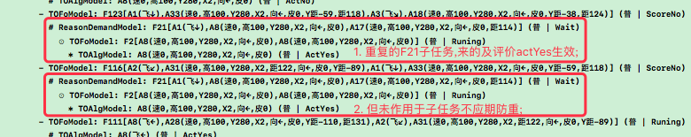 |
| 方案 | 子任务协作中,也要对dsFo(即F2)下subAlg判断是否处于actYes状态; |

| 23123 | 子任务流程未正常进入ActYes状态的问题1 |
| --- | --- |
| 示图 | 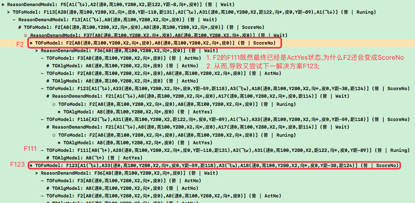 |

| 23124 | 子任务流程未正常进入ActYes状态的问题2 |
| --- | --- |
| 示图 | 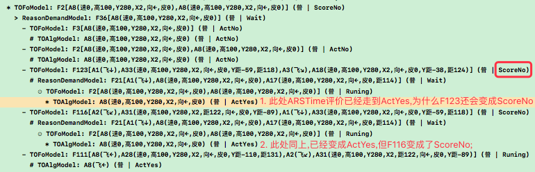 |
| 复现 | 防撞训练前两步,重启后,下飞即可复现; |

| 23125 | 来的及评价后的ActYes反省触发器不执行问题 `T` |
| --- | --- |
| 调试 | 发现,在静默成功的actYes流程控制中,取findIndex和deltaTime一直失败; |
| 分析 | 1. 取findIndex方法不对,应该根据ARSTime方式取下标才能取到; |
|  | 2. 应以rDemand.matchFo计算deltaTime,因为静默成功本来就是在等它; |
| 结果 | 改了`取findIndex方式`和`deltaTime计算方式`,后ok; |

| 23126 | 父子任务往复循环BUG |
| --- | --- |
| 示图 | 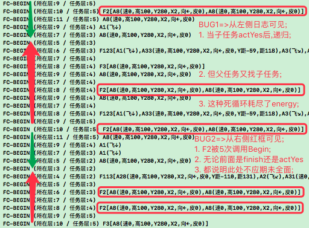 |
| 说明 | 如图中BUG1所示,父反思到子任务,子任务完成再递归到父,然后再子,再父; |
| 经测 | 子任务actYes后,继续父任务且失败了,再取下一ds方案,再子任务,形成循环; |
| 分析 | 1. 表面看是子任务消耗energy太多,导致很快耗尽 |
|  | 解决: energy消耗: `begin改为低消耗` & `行为输出高消耗`; |
| 分析 | 2. 预测有撞击风险时,父任务中也应该静默等待木棒出现; |
|  | 解决: 调试代码,看继续父任务时为什么会失败; |

| 23127 | 同ds方案被反复尝试BUG (见23126中示图) |
| --- | --- |
| 说明 | 如图示,首个红框F2已被解决为ActYes静默状态,但是后面还是一再的尝试; |

| 23128 | 多层嵌套子任务中ds重复问题 `T` |
| --- | --- |
| 示图 | 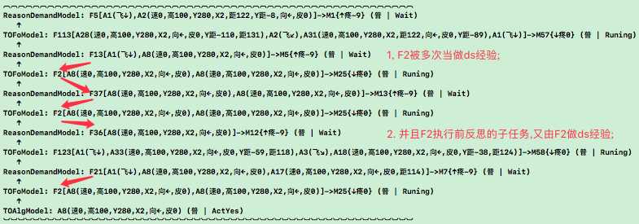 |
| 例子 | a. 主任务为吃饭,ds为过马路饭店吃; |
|  | b. 子任务为防止闯红灯被撞,ds为绿灯再过; |
|  | c. 子子任务为防止有车闯红灯撞来,ds为观察左右没车辆再继续过; |
|  | d. 子子子任务为防止有车闯红灯撞来,ds为观察左右没车辆再继续过; |
| 说明 | 如上图中F2重复 & 如上例中c和d的ds重复; |
| 分析 | 这问题未必是问题,就像打游戏,有怪就开枪,不断有怪不断开枪; |
| 结果 | 先解决23129问题,解决掉后,也许此问题不解也不影响什么; |
| 结果 | 其实就是dsFo重复的问题 `转至n23p14`; |

| 23129 | 父任务来的及评价和生成子任务之间逻辑调整 `T` |
| --- | --- |
| 说明 | 参考23128中例子,得出如下分析1和方案1; |
| 分析1 | 在c和d中,有一个截点,即来的及评价index,此后发生,可静默不生成子任务; |
|  | 即,先过马路,并在通过过程中观察左右,有车等等,没车继续过; |
| 方案1 | 把`父ds来的及评价A`,放在`反思生成子任务B`之前,如果A静默,则B不生成; |
| 结果1 | 方案1只是初步分析,不能给出清晰的修复指导,所以继续分析`转至23131`; |
| 结果 | 来的及评价在行为化中做,生成子任务不受其影响 `参考23132-方案1&问题3` |

   

## n23p13 父子任务防重
`CreateTime 2021.06.18`

在n23p12十测中,最终子任务有不断递归循环多层的BUG,本节将针对此BUG进行进一步分析,并且修复之;

| 23131 | 继续分析子任务嵌套太多问题-例2 `T` |
| --- | --- |
| 例子2 | 1. 预测:`X[有可能出现车撞过来]->{有危险}`; |
|  | 2. dsFo为:`A(做好准备)`,`B(真有车撞过来时)`,`C(闪躲到一旁)`; |
| 分析2 | 1. 其中B不能再用于反思预测危险,因为它是被动事件; |
|  | 2. 现在有重复A的BUG (即小鸟多次下飞,做防撞准备) (虽有效但太早); |
| 问题 | 现在的问题有两个:`1.B反思并生成了子任务;`,`2.A有可能多次发生;` |
|  | 问题1解决掉,问题2自然就不存在了; |
| 方案2 | B是ActYes,若它真发生,应该推进X,而不是反思子任务; |
|  | 1. 考虑将反思放到每一帧_Hav来执行,当前帧为B时回归X,非B时生成子任务; |
|  | 2. 或直接对当前的反思时序进行ARSTime评价,含静默Alg则不生成子任务; |
|  | 3. 说白了,就是在生成子任务前,先与父级Fo进行一轮ARSTime评价; |
|  | 4. 如果被父级静默,则不生成子任务; |
|  | 5. 如果未被父级静默,则生成子任务; |
| 结果 | 对当前问题套入新例子,进行再分析 `转23132`; |
| 结果 | 本例中,所示的`有车撞过来`,其实是父子任务防重,这个本来代码中就有支持; |

| 23132 | 继续分析子任务嵌套太多问题-例3 |
| --- | --- |
| 例3 | 延用,穿越森林可能遇虎,出门前带枪,如遇虎开枪吓跑它; |
| 示图 | 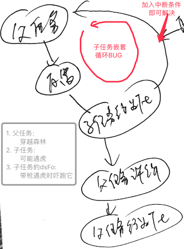 |
| 说明 | 如图,子任务反思没有中断条件,直接进行再反思,导致子任务层层累积; |
| 分析 | 其中子任务dsFo,反思为: |
|  | 1. 带枪违非法枪支携带法 (遇虎前) |
|  | 2. 出门可能遇老虎有危险 (遇虎时) |
|  | 3. 打虎违野生动物保护法 (遇虎后) |
| 方案1 | `遇虎前`和`遇虎后`都应生成子任务 `ds为:改为发声假枪 & 仅吓跑`; |
|  | > 经查代码,遇虎前后生成子任务ok; |
| 方案2 | `遇虎时`与父任务本来就是同一个任务,不应再生成为子任务; |
|  | > 经查代码,遇虎时与父任务去重也ok; |
| 问题3 | 是否判断ARSTime的cutIndex,以仅>cutIndex的做父子同任务防重? |
|  | A:在生成子任务后的行为化中,会判断ARSTime,此处不用; |

结果: 本节的父子防重,在代码上本来就是支持的,而n23p12中的重复并非父子未去重导致,所以本节废弃,转至n23p14;

   

## n23p14 dsFo的全树不应期
`CreateTime 2021.06.22`

在决策中,许多子任务中有重复的情况,而它们的解决方案其实是同样或者类似的,本节将针对此情况做支持,以使决策更高效;

| 23141 | TOM中的重复 `转至23142` |
| --- | --- |
| 示图 | 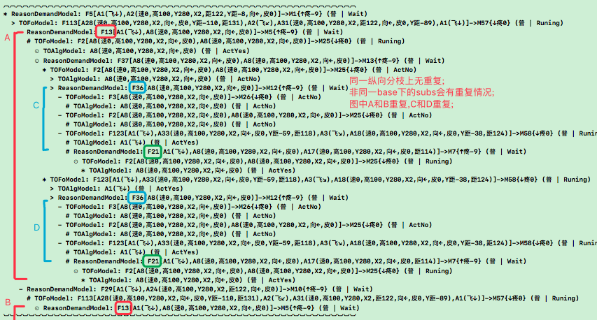 |
| 说明 | 如图示,在决策TOM树中,有许多重复的区块,我们应该考虑如何复用它们; |
| 结果 | 在updateSubDemand()的不应期代码已经支持,只是仅支持同层,而非全树; |

| 23142 | TOM重复的复用分析 `T` |
| --- | --- |
| 例1 | 用锤子钉十根钉子,只需准备一个锤子,分别钉入即可; |
|  | > Q:为什么只准备了一个锤子?为什么钉了十次? |
|  | > A:准备锤子被复用了,而钉的行为分别进行; |
| 例2 | 做十人量的饭; |
|  | > Q:为什么做了一锅饭?但即是十人量的?并且分别盛了十碗? |
|  | > A:做饭行为复用了,饭量直接调用了`十人量`这个固有值,盛饭没复用; |
| 例3 | 火神虫,可能烧我、咬我、让我饿，但我干掉它,这些就全解决了; |
|  | > A:dsFo[干掉它],可同时适用于这三个子任务; |
| 分析 | 1. 三个例子中可见,本质还是对于dsFo的复用 (用于不应期防生成同质任务); |
|  | 2. 以往已经有dsFo做不应期的任务防重机制了 (参考23102 & 23103); |
| 制定 | 任务生成与是否已发生或未来发生无关,所以这些子任务全会尝试生成; |
|  | 全树dsFo可适用任务全加入复用机制,如打死火神虫用于三个子任务; |
|  | 由不应期来实现复用更简单,即不需复用,而是直接不应期掉的子任务不生成; |
| 方案 | 对TOM全树的已actYes的dsFo进行复用; |
| 代码 | 旧代码已支持同层子任务下dsFo的不应期,本次迭代为支持全树; |

| 23143 | 扩展小问题 `T` |
| --- | --- |
| 问题 | 在钉钉子的例子中(参考23142),如何复用部分dsFo?有以下两种情况: |
|  | > 1.一个任务钉多个钉子; |
|  | > 2.每个钉子一个任务各跑各的(锤子在瞬时中自然会被重用); |
| 结果 | 综上,无需对`部分复用`专门写代码处理,它可兼容于现有决策机制来支持; |

   

## n23p15 十测3-子任务测试
`CreateTime 2021.06.25`

缩略词: `cutIndex=>已发生截点`,`actionIndex=>行为化进度截点`,`fromTIM=>瞬时记忆时序识别`;

| 23151 | dsFo经验太具象的问题 `T` |
| --- | --- |
| 示图 | 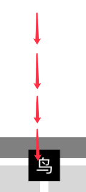 |
| 说明 | 如图,只是下飞,预测到危险,还没有真正看到射出的木棒,就连续的下飞四次; |
| 调试 | 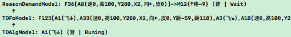 |
| 说明 | 如图调试中,因为ds经验F123太过于具象 (有不必要的`下飞`准备动作); |
| 分析 | 因为具象,导致即使没看到射出的木棒,也会先做下飞这个不必要的准备动作; |
|  | 查dsFo的外类比抽象代码是否正常工作,为何经验太具象原因; |
| 调试 | 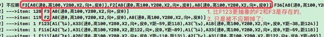 |
|  | 说明: 如图示,更抽象的dsFo是存在的,只是被不应期掉了 `转至23152`; |

| 23152 | 抽象dsFo被不应期掉的原因 `因demand已发生截点有误,转至23153` |
| --- | --- |
| 说明 | F2,F3这些dsFo的A8应该静默等待才对,但却走了cHav代码,并最终失败; |
| 疑问 | 查为什么A8在ARS_Time评价中通过了,而不是走向静默等待ActYes; |
| 调试 | 经查,发现反思的已发生cutIndex定义不清晰,导致ARSTime评价失准; |
| 说明 | 1. fo.actionIndex没所谓,即使错了在行为化中也会自行更正; |
|  | 2. 但demand.cutIndex(已发生截点)必须正确,不然就会影响`来的及评价`; |
| 分析 | 应将反思时的lastMatchIndex匹配截点,与cutIndex已发生截点,分开表示; |
| 方案 | fromShortMem时,cutIndex = lastMatchIndex; |
|  | fromRT反思时,cutIndex需从父任务中做判断 (默认为-1) `转至23153`; |

| 23153 | 反思时TOM的cutIndex取值-方案制定 |
| --- | --- |
| 简介 | 本表主要针对反思的cutIndex取值源进行分析并撸码; |
| 方案1 | 从反思的baseFo的actionIndex取值 `5%`; |
|  | 分析: 仅actionIndex=-1时,才进行反思,所以此方案会全返-1; |
|  | 问题: 这么做会导致ARS_Time评价结果,全变成来的及,静默等待; |
|  | 例如: 即使父任务中已出现老虎,子任务还要等待老虎出现,显然是不理性的; |
|  | 解释: cutIndex本身就是ARS_Time判断的标杆,是不容错误的; |
|  | 解释: 不像actionIndex允许错,在ARS_Time评价后,再自行修正; |
| 方案2 | 逐级从父级R任务继承传递cutIndex `95%`; |
|  | 父级: 从dsFo.baseRDemand的cutIndex继承,来判断当前cutIndex; |
|  | 根级: 最终rootRDemand.cutIndex来自TIR_Fo.fromTIM的cutIndex; |
|  | 示图: 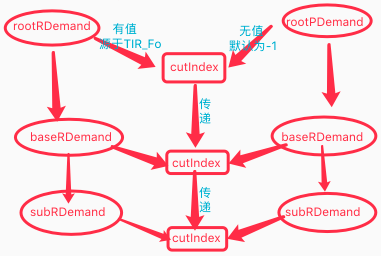 |
| 结果 | 方案2太过复杂,无法照顾变数(虎现又消失),并且base和cur可能完全没关系; |
|  | 所以采用方案1,后在行为化中再根据MC匹配来判断是否有虎,`转至n23p16`; |

| 23154 | 反思时TOM的cutIndex取值-代码规划 |
| --- | --- |
| 代码 | 从base的`0-cutIndex`,在cur中匹配lastIndex,作为当前的cutIndex; |
| 疑问1 | 是否仅判断matchFo中的0-lastMatchIndex部分? |
|  | A: 是的,因为lastMatchIndex之后部分,只是预测,不可能已发生; |
| 疑问2 | 找cutIndex时,是对matchFo进行全含判断,还是仅判断匹配lastIndex; |
|  | A: 全含,因为baseDemand的已发生部分,也是全发生了; |
| 代码 | 对cur的0-lastMatchIndex部分与base的0-cutIndex部分做全含判断; |
| 问题 | cur和base之间大几率没有任何共同点,这导致这种判断几乎无法成立; |
|  | 况且,即使mIsC成立了,在cur的行为化中,还需要进行PM修正; |
| 解答 | 所以,放弃对做cutIndex的继承传递,反思时cutIndex全为-1,转至n23p16; |

| 23155 | 反思时TOM的cutIndex取值-示例分析 |
| --- | --- |
| 示例1 | 当直接`扔木棒`预测到危险时,木棒已投出,在子任务中cutIndex = 0; |
|  | > rootRDemand: 扔木棒,有撞的->危险 `cutIndex = 0` |
|  | ——> dsFo: 避开撞来的木棒 |
|  | ——> rtFo: 木棒,有危险 |
|  | ——> subDemand: 木棒,有危险 `cutIndex = 0` |
|  | 行为化: 在MC中,发现已有木棒,进行PM修正以躲避危险即可; |
| 示例2 | 当`下飞`预测到危险时,木棒未投出,在子任务中cutIndex = -1; |
|  | > rootRDemand: 飞下,有被木棒,撞的->危险 `cutIndex = 0` |
|  | ——> dsFo: 避开撞来的木棒 |
|  | ——> rtFo: 木棒,有危险 |
|  | ——> subDemand: 木棒,有危险 `cutIndex = -1` |
|  | 行为化: 在MC中,未发现木棒,进行静默等待,有危险时再说; |
| 解释1 | 两个例子的:`解决方案dsFo`,`反思rtFo`,`子任务subDemand`都一样; |
|  | 但rootDemand.cutIndex不同,所以subDemand继承的cutIndex也不同; |
| 解释2 | 第二种解释,是行为化中自然表现出的不同,与cutIndex无关; |
| 结果 | 导致例1要及时的行为化躲避,但例2却可以静默等待; |

| 23156 | 废弃父子任务cutIndex的继承传递 |
| --- | --- |
| 说明 | 放弃传递后,反思时cutIndex全=-1,正思时全=TIRFo的lastMatchIndex; |
|  | 剩下的全在行为化中自行处理即可 (参考23155-两个示例的行为化;) |

原本想对父任务和子任务间cutIndex做继承传递 (参考23153-方案2),但这样太复杂,并且父子任务间本来就只是父子嵌套,可能完全没任何共同点,在这种情况下cutIndex也没法有效继承到,故废弃此方式 (见23156);

   

## n23p16 同级多任务协作
`CreateTime 2021.07.07`

本节将用更多例子来分析任务间的协作,共分两种:`父子任务协作`,`同级多任务协作`;

| 23161 | 父子多任务示例 |
| --- | --- |
| 1. 主任务 | 快乐 |
|  | dsFo: 穿越森林 |
|  | 反思: 有可能遇虎,有危险 (已发生源于反思假想); |
| 2. 子任务 | 解决危险; |
|  | dsFoX: 用枪打虎 (在行为化中,枪会提前准备好,因为不会弄巧成拙); |
|  | cutIndex: 现在还没老虎出现 (静默等待); |
| 3. 老虎出现 | 真正遇虎OPushM反馈,继续推进dsFo; |

| 23162 | 同级多任务示例 |
| --- | --- |
| 1. 主任务 | 快乐 |
|  | dsFo: 穿越森林 |
| 2. 副任务 | 看到前边有老虎,有危险 (已发生源于识别预测); |
|  | dsFoY: 转头就跑 |
|  | dsFoZ: 捡石头吓跑它 |
|  | cutIndex: 现在已有老虎出现; |
| 问题 | 遇到老虎时,dsFoY跑掉了,主任务怎么办?`转至23163` |

| 23163 | 同级多任务协作分析 |
| --- | --- |
| 简介 | 我们按着23162的同级多任务示例来进行推导步骤分析如下: |
| 第1步 | 接23162例,如果采用dsFoY,那么副任务解决,主任务再激活; |
| 第2步 | 此时,主任务要继续可以反思到前面有老虎,即从23162转为23161继续; |
| 第3步 | 23161会发现dsFoX拿枪已错过,于是找到dsFoZ解决方案; |
| 第4步 | 23161执行dsFoZ提前准备好石头,并在静默等待中继续穿越森林; |
| 第5步 | 23161真实看到老虎时,用石头吓跑它,危险解除,并最终穿越森林成功; |

| 23164 | 总结 |
| --- | --- |
| 说明 | 根据以上23163分析,我们无需对同级多任务做任何代码改动,现本就支持的; |

   

## n23p17 十一测-子任务测试
`CreateTime 2021.07.08`

| 23171 | FRSTime评价BUG `T` |
| --- | --- |
| 说明 | 下飞时,预测到撞击:`F5[A1(飞↓),A2(木棒)]->M1{↑疼}` |
|  | R-找到dsFo:`F113[A28(木棒),A2(飞↙),A31(木棒),A1(飞↓)]` |
| 问题 | F113的飞下已发生,但FRSTime未评价为错过; |
| 结果 | 查FRSTime的评价结果返回反了,改正后,F113就正确评价为错过了; |

| 23172 | 下飞预测撞击的dsFo解决经验太少的问题 `T` |
| --- | --- |
| 示图 | 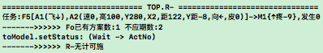 |
| 说明 | 如图所示,当F5把F113评价为false后,递归竟然已经没下一条经验了; |
| 调试 |  |
| 说明 | 仅根据F5生成了R任务,而F5又仅有一条dsFo; |
| 方案 | 其实最抽象的是F13,所以生成R任务也应该是F13才对; |
| 查明 | 经查F5,F13都会生成RMV新任务,只是任务池优先级是迫切度+initTime |
|  | 而matchPFos的排序是以强度排序的,导致强度越弱initTime越大(优先决策); |
| 结果 | 改RMV中,matchPFo生成新任务的循环反过来,即可使F13更优先决策; |
| 结果 | 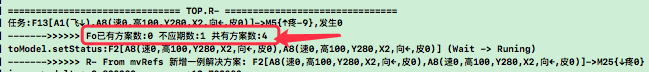 |
|  | 同样,dsFo经验太少的问题,也跟着自然而解; |

| 23173 | 抽象dsFo被不应期掉的原因 `转自23152` `T` |
| --- | --- |
| 说明 | 回测下F2,F3这些dsFo的A8是否静默等待了,并测后续代码跑的是否正常; |
| 回测 | 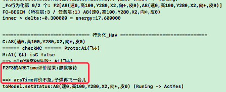 |
| 结果 | 经测,F13任务的F2解决方案可以被正常静默等待(接23172下飞测得此结果); |

| 23174 | 所有dsFo全FRSTime失败问题 `转至n23p18` |
| --- | --- |
| 复现 | 载入FZ2,先下飞,后扔木棒,即可复现; |
| 示图 | 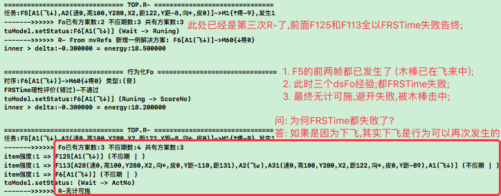 |
| 说明 | 如图,先确认下三个dsFo被ARSTime失败的原因是否因为`飞↓`; |
| 经测 | FRSTime确实只要发现已发生的mIsC,立马就评价为否(错过),不够理性; |
| 方案 | 而FRSTime的更理性必然由展开F来实现,即到_Hav()或ARSTime实现; |
| 结果 | 关于FRSTime的废弃与代替它的方法(可更理性),转至n23p18; |

   

## n23p18 FRSTime更理性迭代
`CreateTime 2021.07.16`

在23174中,测得因偶然或重复发生的帧,导致FRSTime评价总失败的问题,示例如下:
1. 偶然发生示例: dsFo中是通过下飞躲避撞击,而此前已经进行过一次下飞;
2. 重复发生示例: dsFo是通过避开木棒来躲避撞击,而此前投木棒时已经看到过木棒,所以mIsC成立,且已发生,导致FRSTime评价已错过躲避时间;

而本节重点针对此问题,对FRSTime进行迭代,或直接废弃它,用更微观一层行为化_Hav()来更理性的实现替代它的作用;

| 23181 | 分析FRSTime发生`偶然或重复`的原因 (导致不理性) |
| --- | --- |
| 简介 | 因为FRSTime中是对toFo和demand.matchFo进行对比判断是否已发生; |
|  | 而demand.matchFo是基于瞬时刚发生的事儿的,故偶然性极高(重复同理); |

| 23182 | 通过扔木棒示例分析FRSTime的废弃以及对原有决策的影响 |
| --- | --- |
| 示例 | 截入FZ2,下飞,投木棒,预测将被撞,R找到其中一条dsFo是F113如下: |
| 分析 | `F113[木棒,飞↙,木棒,飞↓]`废弃FRSTime后,将继续行为化如下: |
|  | A: F113最后一帧为安全地带,用PM加工Y距避开木棒即可; |
|  | B: F113别的下飞等帧,都是太具象的元素,应在dsFo外类比中抽象掉它; |
| 结果 | 废弃FRSTime并不影响后续决策; |

| 23183 | 通过穿越森林示例分析FRSTime的废弃以及对原有决策的影响 |
| --- | --- |
| 示例 | 穿越森林,有可能遇到老虎,出门前带好枪; |
| 分析 | FRSTime用于判断是否已出门错过带枪,但其实即使出了门,也可以返回带枪; |
| 结果 | 所以FRSTime直接判定错误是不够理性的,应该由_Hav(枪),来解决带枪问题; |
| 总结 | FRSTime废弃并不影响后续决策; |

   

## n23p19 十一测-子任务测试2
`CreateTime 2021.07.17`

在上节中,废弃了FRSTime,本节回归测试;

| 23191 | 多轮反思导致嵌套多层相似R任务的问题 `T` |
| --- | --- |
| 示图 | 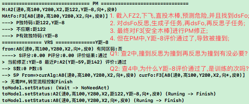 |
| 说明 | 如图,思考下是否应对此种情况去重; |
| 方案 | 不去重,对同一条dsFo同时作用于多个相似任务 `采用,现即此做法`; |
| 示例1 | 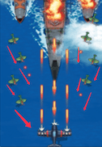每个子弹和飞机都飞来; |
| 示例2 | 旧例: 过红绿灯时,车随时可能会冲出,多次多种可能; |
| 分析 | 如上两例,每个子任务都相似,需对各子任务都处理,危险预测,马上解决; |
| 结果 | 综上例,其实以前就思考过这问题,子任务不必去重,dsFo可复用(现就支持); |
| 结果 | 转`23216,23217,23218`,补全了防重机制; |

| 23192 | 危险Y距在PM评价中通过的问题 |
| --- | --- |
| 说明 | 如23191示图中描述,查下是否因为训练被撞的经历不足所致; |
| 方案 | 重新训练,多训练几次被撞,使之能够对Y距准确评价; |
| 结果 | 确实是因为sPorts为0条所致,最后在23212才解决掉的; |

| 23193 | 防撞训练步骤 |
| --- | --- |
| UI调整 | 将扔木棒移至屏幕Y轴正中,以方便进行防撞训练; |
| 1 | `直扔木棒`x危险地带全覆盖 + `偏扔木棒`x安全地带全覆盖 |
| 2 | `重启,直扔木棒`->查是否抽象出安全地带木棒,并PM修正飞行躲避; |
| FZ3快照 | 对第1步训练,得到FZ3记忆快照; |

| 23194 | 测试FZ3的问题 |
| --- | --- |
| 简介 | 转至23195,和FZ4放在一起总结解决了; |

| 23194 | 重新训练FZ4 |
| --- | --- |
| 1 | `直投木棒`x危险地带全覆盖,范围大些,训练大概12次左右; |
| 2 | `偏投木棒`x多试几次,不管鸟怎么自己飞,都飞回来偏投几次; |
| 3 | 训练`偏投木棒`,同时观察dsFo的外类比抽象关联强度变化,使抽象的dsFo更强; |
| 4 | 再次在危险地带,`直投木棒`多次,因为训练一次就会飞走,每次都重启下; |
| 说明 | 第2步生成FZ4,第3步生成FZ4B,第4步生成FZ4C |

| 23195 | 快照基础上进行训练测试发现BUG |
| --- | --- |
| FZ3测图 | 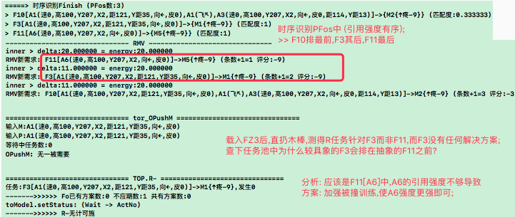 |
| FZ3-实测1 | `直投木棒,右下飞,再直投,重启,右下飞,再直投`->`飞速右下角躲` |
|  | 问题: 并未通过PM修正进行右下躲,而是通过时序的右下飞来蒙对了? |
| FZ3-实测2 | `下右飞`->`飞速右下角躲避` |
|  | 问题: 还没扔出来木棒,为啥提前躲了? |
| FZ4B-实测3 | `左上飞`->`飞速左上角躲避` |
|  | 问题: 同23194-实测2; |
| FZ4B-实测4 | `右下飞,直投木棒`->`鸟躲出屏幕` |
|  | 说明: 更抽象的fo被识别,并在被R取到dsFo方案; |
|  | 问题: 但在PM修正中,Y距评价通过了,查下为什么; |
|  | 调试: 经测,是撞到后,才躲避的,并不是预测到危险后就躲避; |

| 23196 | FZ4B实测4_PM中评价Y距通过的问题 |
| --- | --- |
| 示图 | 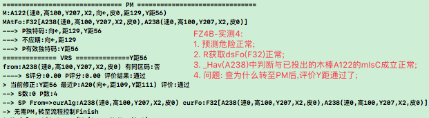 |
| 调试 | 发现Y距的sPorts为0条,然后训练23194第4步,结果还是0条; |
| 分析 | 查S的构建代码,有可能是S未生成导致; |
| 原因 | 因为IRT关闭,在23059中发现VRS受IRT影响不稳定,本来要对IRT定责; |
|  | 而后仅在23063关了IRT,这样觅食训练VRS稳定了,但防撞训练中S学不会了; |
| 结果 | 后面发现是mvDeltaTime被重写为0导致反省太早没生成S (参考23212); |

| 23197 | 重新打开IRT `参考23196 & 23067` |
| --- | --- |
| 回测 | 1. 重新打开IRT,重测23059的BUG是否会重现; `转至23201` |
|  | 2. 如不复现,测试下absSP的指导性和稳定性能否良好工作? `转至23201` |

   

## n23p20 IRT打开后_SP迭代分析
`CreateTime 2021.07.29`

在23197中,需要重新打开IRT,以解决23196中无法在经历中习得sPorts的问题,但是打开IRT后,在23067中SP太不稳定易受影响的问题应该又会出现,所以本节,对此问题进行测试,二者进行权衡,看如何在打开IRT后,又能够有更好的方案,使之适应所有情况;

| 23201 | SP的指导性与稳定性分析 |
| --- | --- |
| 简介 | AF仅能体现出指导性,而真正的稳定性,几乎都会涉及到多V竞争的VRS评价 |
| 示图 | 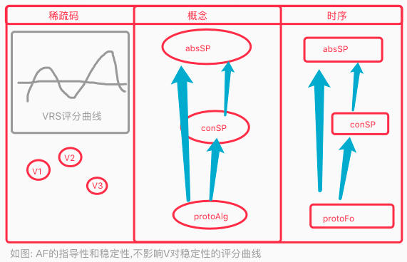 |
| 说明 | 如图示,现网络结构应该是ok的,但还是应实测23067和23196两个示例试下; |

| 23202 | 对指导性与稳定性,举三个示例分析 `T本就支持,无需改动` |
| --- | --- |
| 指导F | `F1[AB,C(8-10),D(0-5)]` |
| 中间F | `F2[ABC,D(0-8)]`,`F3[ABD,C(6-7)]` |
| 稳定F | `F4[ABCD]` |
| 分析 | 1原则: 指导性与稳定性的自由竞争(博弈); |
|  | 2模型: 以指导性优先,逐一进行评价,直至达到稳定性为止; |
|  | 3代码: 指导性主要靠AF,而稳定性靠V,所以PM是以AF找到SP做VRS评价; |
| 总结 | 现在代码本来就是这样的,所以本表并不涉及代码改动; |

| 23203 | 对SP加cutIndex标识分析 `需求成熟后再做` |
| --- | --- |
| 示图 | 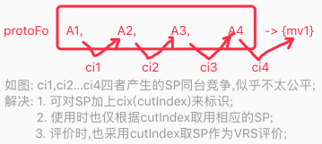 |
| 结果 | 暂不做,与当下主要问题无关,待后面需求明确时,再继续做这个; |

| 23204 | 打开IRT制定迭代方案-重训防撞觅食之防撞部分 |
| --- | --- |
| 防撞回训 | 训练源: 根据23194(1,2步)防撞训练两次,分别得到FZ5,FZ6; |
|  | 测试: 当`FZ5,右上飞,直投木棒` 或 `FZ6,右上飞,直投木棒`时; |
|  | 说明: 能预测到危险,并找到解决方案,但Y距评价仍然通过,且sPorts为0条; |
|  | 问题: tir打开了,但sPorts还是0条,查下为什么? |
|  | 调试: 搜索所有训练过程中的`IRT构建SPFo`日志; |
|  | 分析: 发现取sPorts的curFo嵌套sp太少,而curAlg嵌套sp数量正常 |
|  | 怀疑: 因为curFo本身已经非常抽象了,所以它指向的sp较少; |
| 调试 | 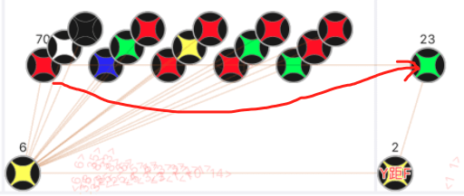 |
|  | 问题1: 经可视化查,curAlg指向sp较多,而curFo指向只有P没有S `转23206`; |
|  | 问题2: F指向P而A却指向S,应该A70和F23类型一致才对 `转23205`; |

| 23205 | F和A指向的SP不一致的问题 `T` |
| --- | --- |
| 说明 | 参考23204示图,F和A指向的SP不一致; |
| 修复 | 改AIAlgNodeManager.createAbsAlg_NoRepeat中支持ds防重; |
| 重训 | 依23194(1,2步)训练得`FZ7,左上飞,直投木棒`,`FZ8,右上飞,直投木棒`; |
| 结果 | 改后bug不再现,说明已经好了,此BUG修复完成; |

| 23206 | R解决方案在PM中指向0条sPorts的问题 `T` |
| --- | --- |
| 分析 | 在训练FZ7和FZ8中发现,好像这个curFo是在加载FZ8后最后两步才生成的; |
| 方案 | 所以从更进一步设计训练步骤入手,来解决此问题 `转至23207`; |
| 结果 | 见23207结果,失败,明天还是重新训练把所有日志记录下来分析看吧; |
| 结果 | R解决方案是dsFo,而IRT与ORT都不支持dsFo `参考22195,转至23211`; |
| 结果 | R-的dsFo进行ORT反省中可对dsFo生成SP,只是有BUG罢了 (参考23212); |

| 23207 | 新防撞训练步骤 |
| --- | --- |
| 1 | 直击xN训练 `学会怎样会撞到`; |
| 2 | 偏击xN训练 `学会了撞不到的虚mv经验,使R任务有解决方案`; |
| 3 | 直击xN训练 `学会为S的特征,如Y距,使PM修正SP有依据`; |
| 结果 | 得到`FZ9,左下飞,直击`,发现sPorts还是0条,修复失败; |

   

## n23p21 测试dsFo的反省SP
`CreateTime 2021.08.08`

简介: 上面在查0条sPorts的问题,最终竟发现dsFo本来就不支持SP`参考22195`,本节将重点分析dsFo不支持SP的问题,并使其迭代支持;

| 23211 | dsFo支持SP问题分析之IRT `暂停` |
| --- | --- |
| 说明 | 查TIRFo识别结果是否支持dsFo,然后看IRT是否对其反思到SP; |
| 调试 | 经查代码,TIRFo将dsFo从识别结果中过滤掉了,所以当下没有dsFo识别结果; |
| 分析 | 识别dsFo(当下安全)意义不大,只要识别到PFo任务,在决策中判断当前安全即可(静默解决); |
| 结果 | 暂不做支持,先从ORT进行SP看不够用再说 `暂停`; |

| 23212 | dsFo支持SP分析之ORT (因为mvDeltaTime为0,导致反省时还没S) `T` |
| --- | --- |
| 说明 | 查R任务的dsFo是否进行actYes,然后对其ORT反思到SP; |
| 调试 | 训练`FZ9,左下飞,直击`,分析日志得到下图; |
| 分析 | 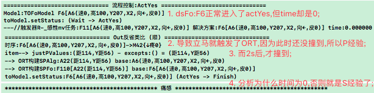 |
| 问题1 | 对analogy_Feedback_Diff()中dsFo的mvDeltaTime赋值; |
|  | 回测: 此方案代码后,重新23207训练,得到`FZ10,右上飞,直击`; |
|  | 结果: dsFo有mvDeltaTime了,但此方案不采用,因为应该用matchFo的时间; |
|  | 例子: 不让车撞到,不是我躲安全地带多久,而是取决于当前撞来的车有多快; |
| 问题2 | 查为什么actYes中matchFo:F11的mvDeltaTime为0; |
|  | 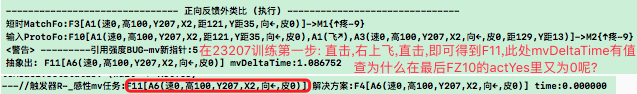 |
|  | 问题: 在RFos再抽象时,防重抽象为F11,而fo和assFo全是0,所以重赋值了0; |
|  | 结果: 改为从fo,assFo,absFo中取最大mvDeltaTime即可 (参考外类比器); |
|  | 重训: 按23207训练得`FZ11,左上飞,直击`,测得mvDeltaTime不为0了; |
| 转至 | mvDeltaTime为0问题已修复,ORT反省也正常为逆生成了S经验,如下图: |
|  | 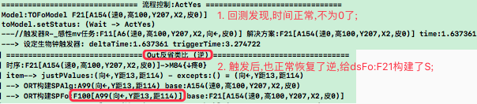 |
| 结果 | `FZ11,左上飞,直击`已可正常生成S,继续防撞训练 `转至23213` |

| 23213 | dsFo有S后训练-有S评分也为0的问题 |
| --- | --- |
| 问题 | 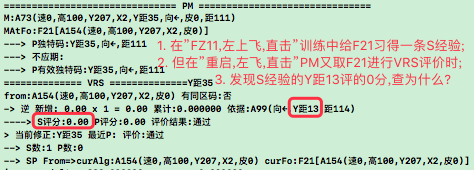 |
| 说明 | 如图,dsFo有S了,但评分却为0,调试下VRS评分算法,看为什么评了0分; |
| 分析 | 经调试代码,单条S时,VRS评分里的min和max一样,所以全评为0分; |
| 方案 | 需要更多的S,然后才能使束波求和曲线更好的工作 `做更多的S训练`; |
| 训练 | 更多S训练计划...,刚开始训练并测得23214BUG先改BUG,再回来继续; |
| 结果 | 修复23214,并按它的复现训练后,有了两个S,评分也不再是0; |

| 23214 | R任务首条失败别的没执行问题 `方案1完成,方案2暂不做` |
| --- | --- |
| 示图 | 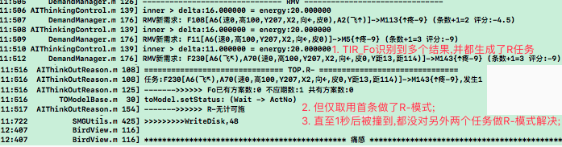 |
| 复现 | A`FZ11,左上飞,直击`, B`重启,右飞,直击`, C`重启,左上飞,直击`; |
| 说明 | A识别为旧有时序F11,而A和C类似,所以C时会优先识别到A,其次才是F11; |
| 分析 | C识别为A生成的R任务必然失败(因为A很新),而F11又未被R-模式执行; |
| 调试 | 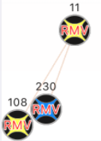 |
| 方案1 | R-模式支持从抽象找dsFo解决方案 `T` |
|  | 说明: 如图F11是另俩任务的抽象,当F230失败时可尝试从抽象F11找dsFo; |
|  | 问题: 采用抽象的普适性,就必然面对更差的稳定性,代入示例分析下此问题; |
|  | 示例: 乌鸦躲过木棒,躲过车,但尝试用来躲追它的愤怒小鸟结果失败了; |
|  | 分析: 此例中,采用通用躲避方式总比不躲强,多练反省也能躲好愤怒小鸟; |
|  | 解决: 稳定性差是难免的,但只能先采用,后通过反省再增强稳定性; |
|  | 注意1: 反省结果只作用于dsFo,比如躲的是飞机等速度特征很快的; |
|  | 注意2: 愤怒小鸟也要习得dsFo,不用新写代码,以往diff类比方式自然会构建; |
| 方案2 | 当F230彻底失败后,是否考虑先执行别的任务,即F230在进入不应期; |
|  | 代码: 调用aiTOR_MoveForDemand()看看能否实现继续下一条R任务; |
|  | 方案1足以解决当下F230无计可施的问题,所以方案2先不做 `暂不做` |
| 结果 | 方案2暂不做,方案1已完成且回测有效,可顺利取到F11的dsFo方案执行; |

| 23215 | PM不通过时修正无目标的问题 |
| --- | --- |
| 问题 | 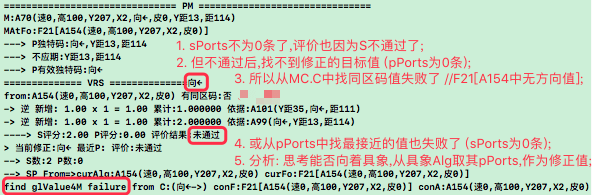 |
| 复现 | `FZ11,左上飞,直击`,`重启,右飞,直击`得到`FZ12,左上飞,直击`; |
| 说明 | 如图,在23214后,PM有了S经验,并评价不通过,但却没有S修正目标值; |
| 方案1 | 见图5,分析可否从具象取更多sPorts依据做为修正目标值; |
|  | 调试: 可视化发现具象中也没sPorts,所以此方案在方案2执行后再考虑采用; |
| 方案2 | 分析是否训练太少,导致还未学会足够有修正值的情况; |
|  | 分析: 规划直击偏击交叉训练期,并打出sp构建日志,使生成足够多sp; |
|  | 方案: 训练步骤重新规划 (目的: 得到更多SP); |
|  | 规划1-步骤1: `飞至左下,然后边飞边扔木棒,至右上`; |
|  | 规划1-步骤2: `在下,中,上三个地带,分别各种地方扔木棒`,得到FZ13; |
|  | 规划2-步骤1: `截入FZ11,在下中上三个地带,分别各种地方扔木棒`; |
|  | 问题: 发现在重新训练中,总是有嵌套多个相似R任务导致日志刷许多的问题; |
|  | 转至: 先解决嵌套多个相似R子任务的问题 (更全面防重) `转至23216`; |
| 回归 | 本BUG完成后,进行防撞考试,看能否PM避开; |
| 结果 | 转至23219重新进行训练,并测缺少PM修正无目标的问题; |

| 23216 | 反思相似R子任务嵌套太多问题 (4种18条) `T` |
| --- | --- |
| 说明 | 转自23191,在23215-方案2中,重新训练遇此问题所阻,故应先解之; |
| 方案 | 生成子任务时,抽象的任务,可对其具象的进行防重 (吃过饭,有面也不吃了); |
| 复现 | `FZ13,右下飞`,可见多个相似R任务嵌套生成; |
| 结果 | 改后,原来生成4种18个子任务,变成了2种13个,即抽具象确实防重了; |
| 新问题 | 虽然变成2种了,但还是有多达13条子任务,转至23217; |

| 23217 | 反思相似R任务嵌套太多问题 (2种13条) `T` |
| --- | --- |
| 问题 | 上表中做了抽象防重后,种类已经成了无抽具象关系的2种,但条数仍很多; |
| 复现 | `FZ13,右下飞`,可复现问题,通过分析日志,分析当前问题原因; |
| 分析 | 反思在行为化之前,即还未actYes,就已反思嵌套生成多个子任务; |
| 方案 | 所以子任务单对actYes的dsFo防重是不够的,可见runing的也加入支持; |
| 结果 | 改后回测,成了1种4条,即子任务没有任何重复了只剩1个 `T`; |
| 另外 | 结果中4条说明,转23218; |

| 23218 | 反思相似R任务嵌套太多问题 (1种4条) `暂不用改` |
| --- | --- |
| 简介 | 4条是各自不同的rootDemand,暂不对root层做防重; |
| 原则 | 因为四只蚊子打四次,root层应该更多互相竞争与"抵消,更新"等来实现变化; |
| 结果 | 暂不对root做防重,后续测试中,如果有问题再说; |
| 回归 | 重新进行23215-方案2防撞训练,以及23207训练 `转至23219`; |

| 23219 | 回测重新训练,并重测`PM修正无目标问题`; |
| --- | --- |
| 训练1 | 1. 按23215方案2规划1训练:`飞到左下,边飞边直击到右上`->得到FZ14; |
|  | 2. 重启,直击; |
|  | 3. 可正常预测PFos:F100[A71(速高YX,皮0,向←)]->{↑疼-9} |
|  | 4. 可在PM中对Y距评价不通过,并找到修正目标值; |
|  | 5. 但最终又反思到子任务,后一直没递归回来,导致PM对Y距修正没跑完; |
|  | 问题: 分析为什么反思到子任务一直没递归回来,如何才能保证PM修正完成; |
| 训练2 | 1. 按照23207训练: 直击,偏击,直击各n次->得FZ15; |
|  | 2. 重启,直击; |
|  | 3. 可正常预测PFos:F11[A6(速高YX,向←,皮0)]->{↑疼-9} |
|  | 4. PM中对Y距评价通过了(S8条,P2条),导致不进行修正; |
|  | 问题: 查为什么在有SP的情况下,Y距依然评价通过了; |

   

## n23p22 十一测:继续训练dsFo与SP相关问题
`CreateTime 2021.08.19`

在上节中,修复了R任务嵌套太多问题,然后在23219中,重新进行训练,并发现许多新的BUG,本节将围绕此改BUG,继续推进训练;

| 23221 | 23219训练1-FZ14中dsFo不够抽象的问题 |
| --- | --- |
| 说明 | `FZ14,直击`,识别为F100(抽象),然后R模式从F100找dsFo(3条都不够抽象); |
| 分析 | 在不够抽象的dsFo基础上反思,并最终各种嵌套没回来; |
| 方案 | 先继续加料训练,将F100的dsFo搞抽象了,再回测各种嵌套问题应该自解; |
| 加训 | `FZ14,下飞,下飞,左下飞,直击`,测得两个BUG; |
| BUG1 | 明明撞到了,却没有触发`疼痛`; |
|  | 分析: 因为是飞回危险地带的,所以撞到了Demo的UI却没触发; |
| BUG2 | dsFo的外类比,不够抽象因为外类比算法出了错,如下图: |
|  | 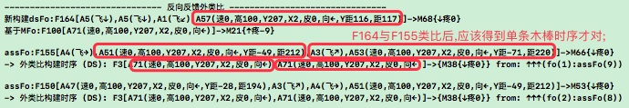 |
|  | 调试: 调试外类比代码,看为什么会这样; |

   
