# 防撞训练 & TC新螺旋架构

> 注:
> 1. 在n23中,已经由子任务测试到GL了,但GL还没完全跑顺当;

> 名词解析:
> 1. OVM : ToValueModel
> 2. 稳定性: 是指经验的效用,有效率;

***

<!-- TOC -->

- [防撞训练 & TC新螺旋架构](#防撞训练--tc新螺旋架构)
  - [n24p01 GL行为化迭代](#n24p01-gl行为化迭代)
  - [n24p02 AIKVPointer集成type迭代](#n24p02-aikvpointer集成type迭代)
  - [n24p03 单元测试-自检告警机制](#n24p03-单元测试-自检告警机制)
  - [n24p04 子任务迭代](#n24p04-子任务迭代)
  - [n24p05 十二测:继续进行GL相关测试训练](#n24p05-十二测继续进行gl相关测试训练)
  - [n24p06 IRT的理性失效](#n24p06-irt的理性失效)
  - [n24p07 PM迭代V4-稳定性判断 (理性迭代)](#n24p07-pm迭代v4-稳定性判断-理性迭代)
  - [n24p08 PMV4-稳定性迭代2](#n24p08-pmv4-稳定性迭代2)
  - [n24p09 废弃dsFo](#n24p09-废弃dsfo)
  - [n24p10 `PMV4稳定性迭代` 与 `废弃dsFo`-代码实践](#n24p10-pmv4稳定性迭代-与-废弃dsfo-代码实践)
  - [n24p11 回测PM修正目标](#n24p11-回测pm修正目标)
  - [n24p12 面向场景的稳定性评价](#n24p12-面向场景的稳定性评价)
  - [n24p13 迭代R决策模式-废弃GL](#n24p13-迭代r决策模式-废弃gl)
  - [n24p14 R决策构架分析调整](#n24p14-r决策构架分析调整)
  - [n24p15 迭代R决策代码实践](#n24p15-迭代r决策代码实践)
  - [n24p16 `思维控制器`整体架构调整](#n24p16-思维控制器整体架构调整)
  - [n24p17 `思维控制器`架构调整-代码实践](#n24p17-思维控制器架构调整-代码实践)
  - [n24p18 螺旋架构-流程控制](#n24p18-螺旋架构-流程控制)

<!-- /TOC -->

## n24p01 GL行为化迭代
`CreateTime 2021.09.09`

本节针对GL行为化与PM中关于GL相关进行不应期迭代;

| 24011 | 迭代项 |
| --- | --- |
| 迭代1 | 对PM生成toValueModel做防重,以防止一模一样的OVM多次GL行为化; |
| 迭代2 | 对PM中找修正GL的目标:`glValue4M`,做不应期,比如G不行就L试下; |

| 24012 | GL体用协作问题 `参考:23229-方案3` |
| --- | --- |
| 问题 | 1. 表现为在FZ22重新训练中,很难抽象出[飞方向,木棒]的节点; |
|  | 2. 内类比生成了许多Y距GL经验,但在getGL中却取不到一条适合修正用的; |
| 分析 | 分析当前代码做法: |
| 1. 体 | 内中外类比现在的assFo是以取absRFos与其具象得出; |
|  | > 具象混乱(因为它可能与当前protoFo无关系) & 抽象失真(absRFo太抽象); |
|  | > 导致很难抽象出[飞方向,木棒],且识别时也没法识别到[飞方向,木棒]; |
|  | 原则: 认知期,抽象优先`absRFos`,照顾具象`matchRFos`; |
| 2. 用 | getGL现在的curMasks是仅取absRFos来得出; |
|  | > 问题: absRFos太抽象,而gl又少又抽象,稳定性极差; |
|  | > 考虑改为matchRFos与其抽象取GL经验 (从稳定找普适); |
|  | 原则: 决策期,具象优先`matchRFos`,延展抽象`matchRFos.absPorts`; |
|  | 延展: matchRFos有匹配度,如有问题可考虑加入cutIndex实现精准控制; |
| 实践 | 通过前面分析1,2中的原则,来制定代码迭代; |
| 1. 体 | 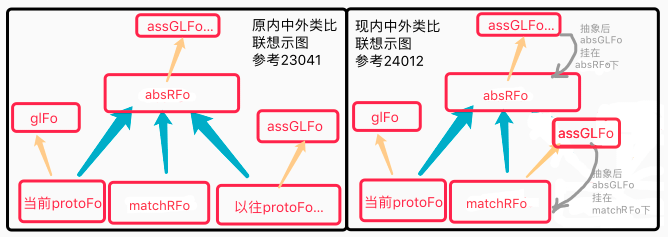 |
| 2. 用 | 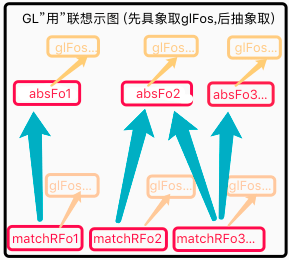 |
| 结果 | 将`体`改为absRFos+matchRFos后,发现永远取不到assGLFo `转至24013` |

| 24013 | GL到absGL未冷启问题 `T` |
| --- | --- |
| 问题 | 见24012结果,gl一直停留在最具象,没有向抽象寸进,导致assGLFo总为0条; |
| 分析 | 1. 在构建absRFos时,没有做任何GL抽象操作; |
|  | 2. 在内中外类比v5中,absRFos和matchRFos也都是抽象的,全没GL嵌套; |
| 方案1 | 内中外类比中,应对首条seemFo(相似非全含fo)做支持,完成gl抽象起步; |
|  | 内中外类比中,应对首条seemFo进行外类比; |
| 方案2 | 或直接用matchRFos.conPorts作为seemFo `即回滚到原v4代码` |
|  | 此时seemFo外类比就不用了,因为matchRFos就是它们的外类比抽象结果; |
| 选定 | 因为方案2比方案1更适用于内中外类比的`起步`,且与原v4一致,故选用; |
| 示图 | 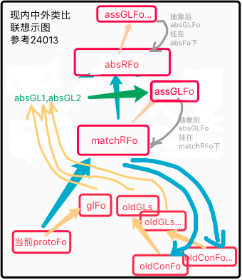 |
| 结果 | 如图,代码回滚到v4,且改为支持absRFos,后回测生成absGL正常了; |

| 24014 | 重训GL的体与用 | 步骤+结果 |
| --- | --- | --- |
| 1 | 重新进行`x向飞,直击`xN次; | 24015第1,2步,正常 |
| 2 | 看生成[x向,木棒]时序是否正常; | 24015第1,2步,正常 |
| 3 | 看[x向,木棒]下,能否正常构建嵌套gl; | FZ23-2日志,正常 |
| 4 | 看getInnerGL中,能否正常取到gl经验 | 非Y距取到了,Y距还没测 |

| 24015 | 训练步骤整理 | 训练目标 |
| --- | --- | --- |
| FZ23-1 | 边直击边飞至左下 | 被撞和不被撞经验,GL经验 |
| FZ23-2 | 边直击边飞至右上 | 被撞和不被撞经验,GL经验 |
| FZ23-3 | 在安全地带各处偏击10次 (危险地带下方) | 加训P经验 |
| FZ23-4 | 在危险地带各处直击10次 | 加训S经验 |

| 24016 | 抽象GL经验太少问题 `T` |
| --- | --- |
| 说明 | 在训练24015前两步时,发现抽象GL极少执行; |
| 方案 | 可尝试,将内中外类比的配置limit调高 (要广放少收); |
| 结果 | 把limit从3和2调整为5和5时,训练第2步抽象GL经验从1条变成6条,有效; |

| 24017 | 训练FZ23并测问题 |
| --- | --- |
| 复现 | 按24015训练得到FZ23,然后`FZ23,右下飞,直投`; |
| 问题1 | 全是`PM评价速0不通过,修正(速0->速233)`; |
|  | 分析: 其实速不重要,下帧会飞到哪才重要; |
|  | 方案1: 退方案,把速从视觉中去掉,速不重要,因为HE视觉本来就是离散的; |
|  | 方案2: 进方案,让HE认识到速不重要 `速并不需要修正,但每条P经验又都有` |
|  | > 所以每次P评价都有速,必须加工,但又其实没办法行为化解决它; |
|  | 结果: 先采用方案1,方案2提到的问题以后还会遇到,到时再说; |
| 问题2 | 性能问题,发现FZ23在训练中太卡了,内类比慢; |
|  | 分析: 内中外类比里的limit5,5,20三个参数再调下试试; |
|  | 重训1: 调整内中外类比Limit为:6,2,10,重训为FZ24 `略好些` `最终选定`; |
|  | 重训2: 调整内中外类比Limit为:2,2,10,重训为FZ25 `又好些`; |
|  | 结果: 调整值不能根本解决问题,卡是从GL学全开始的,即决策系统在卡; |
|  | 跟进: 分析决策系统卡的问题 (后再测,先改24018问题); |

| 24018 | 训练FZ24,FZ25并测问题 |
| --- | --- |
| 训练 | 按24017问题2重训`1,2`,得到`FZ24,FZ25` |
| 问题 | FZ24-2和FZ25-4,发现取GL时,绝大多数经验已被评过否; |
| 线索1 | 查最初空S构建日志`FZ24-2`,得出OPushM中mIsC可能失败,如下图: |
|  | 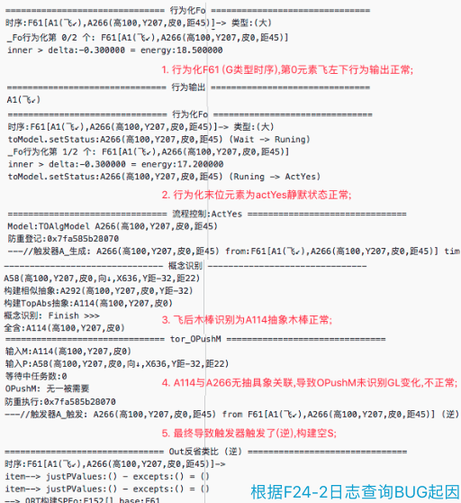 |
|  | 如图,A114与A266判定mIsC失败,导致OPushM失败,进一步NV查它俩关系; |
|  | 调试: 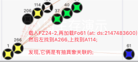 |
|  | 说明: 示图有关联,打日志时没关联,可能是日志后很久又联上的; |
|  | 分析1: A114是刚构建TopAbs出来的,所以与旧有A266还没关联也正常; |
|  | 分析2: 示图说明后来也关联上了,当时还没学确切有此问题正常; |
|  | 分析3: 只是可惜这条GL经验被空S干掉了,比较冤枉; |
|  | 影响面: 此问题仅出现在未学习确切情况下,影响面不大; |
|  | 结果: 当时无关联正常,GL被冤枉干掉,不过影响面不大,以后再改吧; |
|  | TODO: 看来单条空S评否不合理,后改进之; |
| 线索2 | 查`FZ24-4`,得出GL可能取混乱,如下图: |
|  | 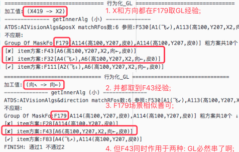 |
|  | 如图,可视化GL中的maskFo,看是否会混,为何会混; |
|  | 调试: `FZ24,右下,直击,右上,直击`,能取到F179,且X与Y距时,共同的F132; |
|  |  |
|  | 如图,F179有许多GL经验,任一条,就测得其glConAlg竟同时是4个glAlg的具象; |
|  | 问题: 这样的话F119就可以用于解决`向大,X大,距小,Y距大`,互相空S掉; |
|  | 方案: 将atType集成到AIKVPointer中,并作用于alg防重,可以避免它混乱; |

| 24019 | glFo&glAlg防重不全面,导致空S混乱问题代码实践 |
| --- | --- |
| 说明 | 防重不全面,是因为未全面根据type和distanceY `转至n24p02`; |

   

## n24p02 AIKVPointer集成type迭代
`CreateTime 2021.09.19`

| 24021 | glFo&glAlg防重不全面,导致空S混乱问题代码实践 |
| --- | --- |
| 各类示图 | 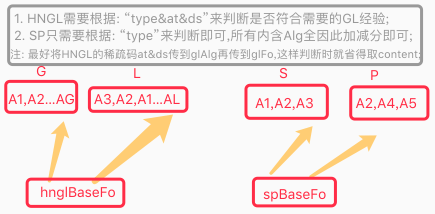 |
| 示图改1 | `GL下探在V,需要at&ds&type判别`,`而HNSPD仅在AF,type即可判别`; |
| 实践简介 | 需要将视觉属性名如`distanceY`和type如`G`集成到glConAlg中; |
| 套用实例 | 1. 将glConAlg赋值pointer.type & 并将distanceY赋值到ds; |
|  | 2. 将glFo赋值pointer.type & 并将distanceY赋值到ds; |
|  | 3. 仅GL时,需将`distanceY`赋值传递到A和F的ds下 (参考:示图改1); |
|  | 结果: 这样话,F179就会有四个不同的F119,分别各自被空S,避免彼此误伤; |
| 概念部分 | 1. 将所有的createAbsAlg_NoRepeat()新增type节点; `T` |
|  | 2. 将Same类型全改成ATDefault类型; `T` |
|  | 3. 构建glAlg时,将`distanceY`这些传递赋值到ds `T`; |
|  | 4. 构建glAlg时,将`FLY_RDS`这些传递赋值到at (因为有时没ds) `T`; |
| 时序部分 | 1. 将所有的createAbsFo_NoRepeat()新增type节点 `T`; |
|  | 2. 构建glFo时,将`distanceY`这些传递赋值到ds `T`; |
|  | 3. 构建glFo时,将`FLY_RDS`这些传递赋值到at (因为有时没ds) `T`; |
| 使用部分 | 1. 废弃dataSource和type互转,及所有调用代码 `T`; |
|  | 2. 废弃getHNGLConAlg_ps(),以及glConAlgs的包含判断代码; `T`; |
|  | > 联想GL经验路径早改为场景联想,现又改了vDS==fo.ds匹配判断; |
|  | 3. 在AINetUtils中取ports的众多方法中,用ds筛选改成用type筛选 `T`; |
|  | 4. 把所有生成AIKVPointer的方法,加上type参数 `T`; |

| 24022 | 迭代完回归测试 |
| --- | --- |
| BUG1 | glFo内中外类比,非末位alg类比构建absAlg时,使用Type=GL的问题 `T`; |
| BUG2 | 构建SFo时,at&ds竟有值,经查是从conNodes中取的,改为仅GL时才取 `T`; |
| BUG3 | 有时外类比构建absAlg时,两个conAlg不是同一类型,触发自检6 `T`; |
|  | > 原因1是构建SPFo时,收集的shortAlg为Default类型,而非SP类型导致; |
|  | > 原因2是alg构建器中,从conAlgs中防重没判断at&sp&type导致错乱; |
| BUG4 | FZ26-1训练中,发现H类型Fo中有S类型的Alg,触发自检6 `T`; |
|  | > 原因是在TIR_Alg识别中,取refPorts时没有筛选normal类型; |
| BUG5 | 因为ATSame和ATDiff导致TIR_Fo识别到Fos结果很少 `T`; |
|  | > 在TIR_Fo中,仅取normal结果,所以没包含ATSame和ATDiff; |
|  | > 将这俩type外类比时改为Default,因为这俩只是描述mv实虚并非fo类型; |
| BUG6 | 有时R取到dsFo解决方案,却又指向实mv `T`; |
|  | > 查应该是BUG5不区分Diff和Same,导致原本虚Fo防重无效,重赋值成实fo; |
|  | > 方案: 将BUG5改成不区分ATSame,但区分ATDiff; |

| 24023 | 训练步骤整理 | 训练目标 |
| --- | --- | --- |
| FZ26-1 | 边直击边飞至左下 | 被撞和不被撞经验,GL经验 |
| FZ26-2 | 边直击边飞至右上 | 被撞和不被撞经验,GL经验 |
| FZ26-3 | 在安全地带各处偏击10次 (危险地带下方) | 加训P经验 |
| FZ26-4 | 在危险地带各处直击10次 | 加训S经验 |
| 结果 | 训练得到FZ26 |  |

   

## n24p03 单元测试-自检告警机制
`CreateTime 2021.09.24`

在HE的测试中,经常因为改了一小点代码,导致其影响的部分,只有后天训练时,才可能看到bug,编译期和执行前期都不会有任何问题,所以有必要在其可能影响到的代码处,或者系统运行的关键且可能出错处,做一些自检告警机制,使我们可以在出问题的时候,更及时快速的定位问题;

| 24031 | AIKVPointer集成type迭代后->告警目录 |
| --- | --- |
| 自检1 | 测下getHN经验时vDS匹配判断代码是否多余,多余告警; |
| 自检2 | 测生成GL的AIKVPointer时的ds是否正常赋值,因为它影响node防重; |
| 自检3 | 测生成非GL的AIKVPointer时的ds是否为" ",因为它影响node防重; |
| 自检4 | 行为飞稀疏码的isOut为false的问题; |
| 自检5 | 测生成GL的AIKVPointer时的at是否正常赋值,因为它影响node防重; |
| 自检6 | 测从conNodes取at&ds&type应唯一,否则查为何不同的node会类比抽象; |
| 自检7 | 测构建SPFo时,元素有两种类型的原因(参考24022BUG3) |
| 自检8 | 测构建Fo时,有不匹配type的元素原因(参考24022BUG4) |
| 自检9 | 测构建了Y距35的P节点原因(参考24057&24058) |

   

## n24p04 子任务迭代
`CreateTime 2021.09.28`

本节针对两个问题展开:
1. 主任务怕疼,子任务又预测到疼,父子同质 (父子同质问题,参考24041);
2. 即使喝自来水不是很干净,为了解渴我也喝了 (pk池迭代,参考24042);

| 24041 | 子任务与父任务同质mv问题 |
| --- | --- |
| 示图 | 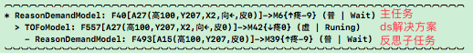 |
| 说明 | 如图,主任务和子任务都是疼任务,而这样的繁琐嵌套许多许多次发生; |
| 复现 | `FZ26,右上飞,直击` |
| 举例 | 累了`{累-9}`想喝水,买水跑路也很累`{累-5}`; |
| 方案1 | status新增pk`竞争状态`,反思流程`转至24042`; |
|  | 分析: 示图套入24042流程,F493子任务仍会形成并行为化,并不解决此问题; |
| 方案2 | 跑路累就考虑是否可解决,比如让外面朋友帮忙稍回来一瓶; |
|  | 分析: 此条本来就是现在的做法,无需要代码改动; |
| 结果 | 方案1无效,方案2认为当前本来就没问题,采纳方案2,不用改; |

**24042-子任务决策流程: pk池迭代计划**
1. 反思评分>=0时,直接继续行为化 (即以往的反思通过);
2. 反思评分<0时,形成子任务 (即以往子任务);
   - 当limit条全<0时,形成子任务,并尝试`规划决策`;
     - 第1条为去买水累`{-5}`;
       - 能不能避免跑路买水?答案不能,还是-5,加入pk池;
     - 第2条为喝自来水`{-10}`;
       - 能不能自来水变干净,答案能,烧开即可好许多,变成-1,加入pk池;
     - 第3条为喝过期水`{-20}`;
       - 能不能过期水加工?答案不能,还是-20;
     - 第4条为喝冰箱可乐会肚子痛`{-25}`;
       - 能不能加热,答案能,烧开即可,变成0,直接执行;
   - 对子任务`规划决策`后,有如下几种可能:
     - `评分 < 0 && 评分 > 主任务-9`,则加入pk池 (如第1,2条);
     - `评分 < 0 && 评分 <= 主任务-9`,则直接失败 (如第3条);
     - `评分 >= 0`,则直接执行 (如第4条);
   - 当没有`第4条`时,则对第1,2条进行pk排序,排序后,第2条为-1,优先执行;
3. 结果: 对于目前的乌鸦训练来说,pk池需求并不迫切;
   - 因为目前R任务的ds解决方案只有mv0,不可能变成-1这种值,所以此迭代`暂停`;

   

## n24p05 十二测:继续进行GL相关测试训练
`CreateTime 2021.09.29`

在十一测中,最后在getGL经验上有了互相空S掉的混乱BUG,在n24p02中进行了节点类型大排查后,重新训练了FZ26,现在回归测试,进行十二测;

| 24051 | FZ26回测-危险地带Y距在PM中评价通过的问题 |
| --- | --- |
| 复现 | `FZ26,直击` |
| 说明 | 发现日志中,Y距的S要么是0条,要么即使不是0条也没有P评分大,导致通过; |
| 分析 | 从FZ26-4日志可见,在危险地带有多次被乌鸦躲开没撞到,导致S经验不足; |
| 方案 | 尝试对FZ26-4进行加训,危险地带多撞几次,习得更多S经验; |
| 结果 | 危险地带多撞失败,它每次都躲飞到下方安全地带,改为重训FZ27,转24052; |

| 24052 | 训练步骤整理 | 训练目标 |
| --- | --- | --- |
| FZ26-1 | 边直击边飞至左下 | 被撞和不被撞经验,GL经验 |
| FZ26-2 | 边直击边飞至右上 | 被撞和不被撞经验,GL经验 |
| FZ27-3 | 在危险地带各处直击10次 | 加训S经验 |
| FZ27-4 | 在安全地带各处偏击10次 (危险地带下方) | 加训P经验 |
| 结果 | 训练得到FZ27 |  |

| 24053 | FZ27回测-危险地带Y距在PM中评价通过的问题2 |
| --- | --- |
| 简写 | `1.rMatchFo=R任务预测源`,`2.前期=指IRT时期`,`3.后期=指ORT时期`; |
| 复现 | `FZ27,直击` |
| 回测 | 问题依旧,S经验不足,但可以顺利加训S了,但加训后,S依然不足; |
| 分析 | 怀疑dsFo进入PM时,毕竟dsFo本就是解决方案,自然P(顺)多S(逆)少; |
| 分析 | 尝试将rMatchFo.SP加入PM分析中,因为它预测生成任务,自然S多P少; |
| 调试 | 1.代码: 从生成SP代码处,分析SP的baseFo来源; |
|  | > IRT从matchPFos预测而来,即从指向了mv的Normal节点; |
|  | > ORT从actYes反省而来,即hngl和dsFo和p+模式的Fo三种都有可能触发; |
|  | 结果1: dsFo的SP依赖后期,因为ORT的第2种是它,而IRT没它; |
|  | 结果2: rMatchFo的SP依赖前期,因为IRT有它,而ORT中没它(因它指向-mv); |
|  | 结果3: pMatchFo的SP前后期都有,IRT有它,ORT也有(因它指向+mv); |
| 调试 | 2.数据: 调试rMatchFo的SP数,看是否与预期相符,前期有较多SP; |
|  | 结果1: 发现rMatchFo的SP虽然不少,但没一条是与当前评价稀疏码同区的; |
|  | 继续查: IRT的SP由protoFo-matchFo得来,应该有同区码才对; |
| 白话 | dsFo.SP表示: 当前解决,方案内,怎样较好; |
|  | 例如: 这个变向,需要更快速度,使变向动作`本身得到更好效果`; |
|  | rMatchFo.SP表示: 当前场景,方案外,怎样较好; |
|  | 例如: 这个变向,需要更大幅度,使变身动作`能够闪开面前大壮`; |
| 原因 | 现R任务对dsFo进行PM时,它是后期SP,所以很难取到足够的SP供评价; |
| 求解 | 所以在PM中,仅靠dsFo.SP是不够的,想办法将IRT也加入进来很重要; |
| 方案 | 发R模式将dsFo传入PM时,补充将rMatchFo.SP也作用于评价; |
| 实践 | 1. pm_GetValidSPAlg_ps()取rMatchFo的SP(直接absPorts取即可) T |
|  | 2. AIScore.VRS()中,支持demand传入,并对rMatchFo进行评分; T |
|  | 3. AIScore.score4Value()中,兼容支持rMatchFo时的评分; T |
|  | 4. 在AIScore.VRS()中,支持将rMatchFo的评分作用于评价; T |
|  | 5. 在PM()中,支持从rMatchFo.SP取最近的p做修正目标; T |
| TODO | 1. 对P模式的matchFo的SP也要作用于评价 `随后重回觅食训练时,再支持`; |
|  | > 因为P模式也有导致任务的matchFo,只是它现在没保留到pDemand中; |
|  | 2. 考虑将PM中P最近的mostSimilarAlg废弃掉,而转为采用强度最强的; |
|  | > 因为直接取mostSimilar与自由竞争相违背,不改先,后有时间再改; |
|  | 3. 为避免VRS束波求和SP数多者占优,考虑将平均作用力也作用其中; |
|  | > tips:加入平均作用力是否有新的不公呢? `考虑明白后再实践` |
| 结果 | 实践5条全完成,按FZ27的步骤重训得到FZ29 (回测转24057); |

| 24054 | 24053改动回测-SP定义混乱 |
| --- | --- |
| BUG | Y距35明明在危险地带,它的P强度却为12,导致Y距35被VRS误评价为通过; |
| 复现 | FZ27,直击 `baseFo:F278[A277(Y距35)]` |
| 怀疑 | 在学时,顺逆与好坏不匹配,导致BUG,查FZ27日志如下; |
|  | 1. 在ORT中,所有的顺逆与好坏是匹配的 (顺时好,逆时坏); |
|  | 2. 在IRT中,顺逆和好坏有时是不匹配的 (预测坏,结果坏,这很顺但坏); |
|  | 本质: 本问题本质在于,SP表示的是顺逆,还是好坏; |
| 方案1 | 从代码定义清晰原则(理性数据的顺逆不表示好坏),应定义为`顺逆`; |
|  | > 顺逆则学简用繁 (学时只判断是否顺利,用时判断好坏再评分); |
| 方案2 | 从SP数据的作用: 直观,易理解,且方便使用则应定为`好坏` |
|  | > 好坏则学繁用简 (学时需判断是好是坏,用时直接取出即评分); |
| 选择 | 此次bug即因SP定义为顺逆,但VRS评价中当好坏来用了,所以选方案2; |
| 实践 | 将SP定义为好坏,并在IRT的反省触发处,改为好坏判断; |
| 回测 | 重训FZ27得FZ28,然后`FZ28,直击`,发现Y距35评价为不通过ok; |

| 24055 | 24053改动回测-PM行为修正过期后还构建SP |
| --- | --- |
| 说明 | 此BUG只是因24054的BUG,而怀疑有,但未证实; |
| 导致 | 它会导致Y距35被VRS误评价为通过; |
| 怀疑 | 明明已躲开,Y距35已失效,还按Y距35反省为P,应以最新Y距为准; |
| 结果 | 已证实24054怀疑成立,先改24054,此处暂停,后有问题再继续; |

| 24056 | 24053&24054实践全完成回训 | 训练目标 |
| --- | --- | --- |
| 1 | 边直击边飞至左下 | 被撞和不被撞经验,GL经验 |
| 2 | 边直击边飞至右上 | 被撞和不被撞经验,GL经验 |
| 3 | 在危险地带各处直击5次 | 加训S经验 |
| 4 | 在安全地带各处偏击5次 (危险地带下方) | 加训P经验 |
| 结果 | 训练得到FZ29 |  |

| 24057 | FZ29回测-Y距35有P经验问题-主客观时间线不统一导致认知偏差 |
| --- | --- |
| 原则1 | 不要试图像主客观世界时间线统一,人类忙时也对外界感知弱,导致认知偏差; |
| 原则2 | 因时间认知偏差,难免会无法或错认某事,在竞争中消除影响即可 (误会); |
| BUG | `FZ29,直击`发现24054的BUG还是存在 |
| 示图 | 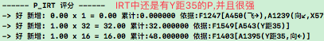 |
| 调试 | 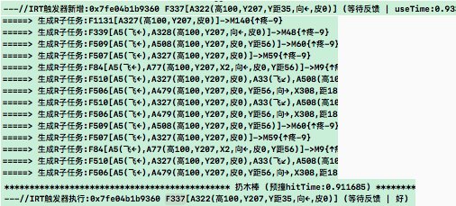 |
| 说明 | 1. 如图,`FZ29-2,直击`后,先形成了IRT触发器预测 (0.93s); |
|  | 2. 然后R任务一直卡着嵌套子任务 (用时2s); |
|  | 3. 当不卡后,UI反应过来扔出木棒时,IRT触发器已经触发了; |
| 问题 | 子任务反思循环卡着,导致触发器触发不准时,导致误判为P; |
| 方案1 | **当主线程卡住时,使触发器触发时间顺延 `5%` `废弃`;** |
|  | 说明: 简单偷懒方案: 主线程卡住时,触发器时间顺延等待,卡的时间不算数; |
|  | 否掉: 卡住状态是没法精确判断的,所以这种顺延没法实现; |
| 方案2 | **现实世界不等人,使思维控制不应占用UI线程 `可行` `T`;** |
|  | 分析: 此方案需结合方案3,不然TC还卡着,UI却撞死乌鸦了; |
|  | 结果: TOR决策模式异步时,与主线程训练日志打的比较乱,暂先关掉; |
| 方案3 | **非紧急情况才反思,避免UI紧急TC却卡着 `可行` `T`** |
|  | 情况1: 紧急=>例如为躲糜鹿,车撞护栏 |
|  | --> 在行为输出前,来不急思考过多,导致撞护栏,没来的及反思; |
|  | 情况2: 非紧急=>例如前方地上有塑料袋,变道前,看有没后车; |
|  | --> 在行为输出前,即意识到变道危险,所以是反思无疑; |
|  | 综上: 反思与否,应看情况紧急程度,现实世界可不等人; |
|  | 实践: 暂定为,当预测发生时间<30s时,不进行反思子任务; |
| 方案4 | **避免太多反思子任务循环 `5%` `废弃`;** |
|  | 分析: 以往已经做过子任务不应期防重等,强行限制循环数不可取 `废弃`; |
| 方案5 | **原则2错误SP难免,抽象时初始强度改为1,而非继承具象 `95%` `T`** |
|  | 分析: 无论此问题是否解决,此方案执行后,一定程度有效防止VRS误评价; |
| 分析 | 分析后:14方案不可取`5%`,23方案可实践试下`50%`,5方案必执行`95%`; |
| 结果 | 235方案改完(2关,35开),方案2治标不治本,且目前使TC不卡不太可能; |
| 转移 | 当前Demo和内核在同一项目跑,一卡就会互相有所影响,此无解,转24058 |

| 24058 | 主客观时间不统一之: 同项目下主客观互卡问题 |
| --- | --- |
| 问题1 | 智能体`紧急状态`导致对外界信息`不及多想` (已ok,参考24057-方案3) |
| 问题2 | 智能体`卡顿走神`导致对外界信息`没注意到` (目前会迟或早,但全能收到) |
| 简介 | 问题1在24057已ok,本表重点解决问题2,即外界信息时迟时早的问题; |
| 示图 | 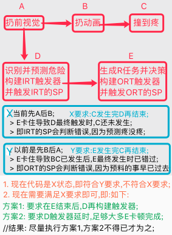 |
| 如图 | 主客观互卡无解,但可先整理下UI触发时机,使TC可顺利跑先; |
| 结果 | 方案1执行完成,重新训练FZ30,仅训练到第2步发现BUG,转24059; |

| 24059 | 被撞前飞行为导致多次预测的情况分析 |
| --- | --- |
| 复现 | `FZ30-1,直击`,发现在撞到前,小鸟多次行为化自行飞行输出; |
| 问题 | 每次飞导致小鸟再次看到木棒,预测同样的危险,并且重新构建IRT触发器; |
| 问题 | 同时,因为多次飞R决策不断卡住,导致IRT触发有误,Y距35触发了P; |
| 示例 | 当车追车鸟撞,鸟边逃边回头看车3次,识别预测构建IRT触发器各3次,那么: |
| 方案1 | 3次看,当前场景F不变,位置Y距35变了,旧帧的IRT触发器应失效; |
|  | 分析: IRT需加上理性失效,如:Y距35被加工成Y距38,原本的触发器应失效; |
| 方案2 | 3次看,3个IRT都是独立的,即使最终S撞到了,前面的IRT也已熬到P结束了; |
|  | > 如果这条ok,那么当前的多次IRT,前面熬到产生P的Y距35是正常的,但:↓ |
|  | > 反例: 车撞来总能躲开(P),终导致VRS评价Y距35通过,从而放弃躲避; |
|  | > 结果: 有能力解决问题,不表示问题不存在,`此条否掉`; |
| 结果 | 选用方案1,实践`转n24p06`; |

   

## n24p06 IRT的理性失效
`CreateTime 2021.10.17`

| 24061 | IRT的理性失效代码实践 |
| --- | --- |
| 起因 | 参考24059-原预测等待中的IRT,可能新帧会对场景推进变化,导致它应失效 |
| 方案1 | 只会失效一部分V,而非整个F,所以到IRT类比时再判断哪些V失效; |
|  | > 此方案脱离场景F,有违原则,所以`否掉`; |
| 方案2 | 到OPushM来实现,新增TIModel的理性判断,并更新status `T`; |
|  | > 在tir_OPushM对新protoFo与等待IRT的fo间判断mIsC,符合则等待失效; |
| 结果 | 方案2已执行,重新训练得FZ31; |

| 24062 | 回测FZ31问题1 |
| --- | --- |
| 问题 | tirOPushM新增的protoFo与waitFo判断mIsC很难成立; |
| 分析 | 随着飞行行为,时序的变化很大,看是否改为局部(时序前面的alg)mIsC匹配 |

| 24063 | 回测FZ31问题2 |
| --- | --- |
| 问题 | 左飞时刚好撞到木棒,后才识别左飞,导致认为左飞后没疼,反省为P; |
| 分析 | `FZ31-1,直投`,发现第二次自行左飞时,刚好撞到木棒,流程图分析如下: |

| 24064 | 回测FZ31问题3->PM中修正目标与原值一致问题 |
| --- | --- |
| 问题 | `FZ31,直击`,PM中Y距35评价不通过正常,但修正目标一样导致不行为化; |
| 如图 | 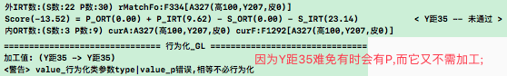 |
| 分析 | 1. Y距35难免会有P,比如已经飞过去的,在这个位置没危险: |
|  | 2. 但取Y距35为修正目标有错,此BUG关键:修正目标取值太广不理性; |
| 出路 | 要么预测当前没危险,不进行反省 (广入原则,所以必须进行反省) `否掉`; |
| 结果 | 修正目标太广不理性,这个就要涉及到大的迭代了 `转n24p07`; |

   

## n24p07 PM迭代V4-稳定性判断 (理性迭代)
`CreateTime 2021.10.19`

转自24064,原问题为:在PM中Y距35修正目标也是Y距35,导致不必修正,而Y距35难免会有P(比如,右侧已飞过的木棒不危险,从而反省出P),而PM又是针对所有pPorts取最近的P为修正目标的,那么此取值方式太广不够理性,本节将针对这一问题进行PM更理性迭代;

在以往的做法中,指导性做的到位,但稳定性做的不到位,导致`指导性和稳定性`这两个兄弟协作的不是很好,本次迭代主要针对稳定性判断迭代之,使之理加理性,结果更好;

| 24071 | PM迭代V4: 更理性 |
| --- | --- |
| 线索 | 稳定时序为:`[Y距35,左向木棒]->{危险}`,所以从稳定性分析出发,如下图: |
|  |  |
| 如图 | PM从F1出发,向性下找到稳定P的F为止 (左侧以F6为止,右侧以F3为止); |
| 分析 | 1. 当V为Y距时,它多变,具象很多:如F4F5F6F7F8等,它们可能同层多个稳定; |
|  | 2. 当V为向时,它值少,具象很少:如F2F3,它们可能同层很少个稳定(F3); |
|  | 结论: 无论V变化多少,此处工作方式,都是向性下,找出稳定节点; |
| 扩展 | 1. 左右向木棒,识别为两个不同场景; |
|  | 答: 可行,即取到的F1本就更稳定些,但依然得向下找稳定F; |
|  | 2. 从F1出发,找Y距稳定时,会不会找到F3并中止? |
|  | 答: 所以当F3不包含Y距同区码时,需要判断它是否包含在rFos&pFos中; |
|  | 即: 仅从rFos&pFos的最具象出发,避免分支F3与protoFo无抽具象关系; |
| 结果 | 关键在于稳定性上的迭代,以及稳定性与指导性的协作上; |

| 24072 | 代码实践: 分析改什么不改什么 |
| --- | --- |
| 多独特码 | PM对独特码逐一评价,失败时,继续尝试下一条,全失败时才失败; |
|  | 多条码应当共同做稳定性判断,而非逐一评价 `参考24075`; |
| 单码评分 | 1. 取消束波求和,因为SP不再描述具体稀疏码值,束波求和不需要了; |
|  | 2. VRS评价不再依赖束波求和,而是依赖F下的`SP强度`做稳定性判断; |
|  | 结果: 参考SP表征结果,SP的具体码描述不可取消,束波求和也无法废弃; |
| 多码协同 | 如果一个码几乎不重复,那么SPStrong就永远只有1或0,怎么评价? |
|  | 方案1: 采用from-to,缺点是无法表达各点强度,范围太广时评价不准确; |
|  | 方案2: 采用束波求和,对最终SP及其强度进行计算得出结果; |
|  | > 束波求和,有各种各样的不稳定情况造成最终误判或修正目标错误; |
|  | 方案3: 取`稳定性`的P部分,然后按照强度排序,将最强的设为修正目标; |
|  | > 此为本次迭代重点,如P内容为:[Y距88,左棒] |
| SP表征 | 1. IRT表征感性SPPerceptStrong,而ORT表征理性SPReasonStrong; |
|  | > SP仅对自己打分,即仅在fo中表征`感理性spStrong`四个值即可; |
|  | > 将sp两个Strong封装新的AIMvPort,fo指向mvPorts使用 (暂不做); |
|  | > SP仅描述`好坏`两个强度值,不再描述具体的稀疏码值; |
|  | > 抽象F的SP不再具体描述它不包含的V值; |
|  | > 比如:F1就仅描述自己SP,F2也是仅描述左向SP,不描述Y距的; |
|  | 结果: 当SP仅针对节点中一部分元素呢?所以不描述具体的码不可行; |
| 初始强度 | 具象SP初始为1,抽象SP初始强度为具象之和; |
|  | 结果: 刚改成抽象SP初始强度为1 `参考24057-方案5`; |
| 应用联想 | 从所有rFos&pFos出发(含自身),向具象找稳定SP; |
|  | 问: 如何防止找到F3这种叉枝,做为"稳定"结果? |
|  | 答: 从`准确性`判断,解决这种错叉枝导致失准问题:`即rFos&pFos包含判断`; |
|  | 结果1: 从`指导性`负责准确,`稳定性`负责评价,协作做出正确解; |
| 空S评价 | 是否废弃空S评价`长教训`,因为抽象切入只负责指导性,不负责稳定性; |
|  | 答1: normal类型F不负责稳定性,可以废除空S评价; |
|  | 答2: S类型的更应废弃,使PM继续,在反省中让SP自由竞争; |
| 多步修正 | 往往需要飞多步修正到达目地地; |
|  | 答1: 一条GL能ActYes时,剩余独特码不继续修正,待重新决策回来; |
|  | 答2: 一条GL成功ActYes时,待OPushM调用PM继续修正; |
|  | 结果: 目前第2种暂且够用,且性能更好,所以先不改; |

| 24073 | 代码实践: PM步骤规划与实践条目 |
| --- | --- |
| 示图 |  |
| 1 | 从所有rFos&pFos出发,负责指导性 (准确性,如当前是F2还是F3); |
| 2 | 不同的rFos&pFos出发点,它的独特码也不相同; |
| 3 | PM对多独特码同时向具象筛选稳定P `参考24075`; |
| 4 | 结合网络可视化,看SP怎样判断稳定性 (交集 或 content包含) `参考24075`; |
| 5 | 并对稳定的pPorts结果进行强度排序,取得修正目标; |
| 6 | 对稳定性结果指出的修正目标,做逐一返回做GL修正 (并支持不应期); |
| 7 | 对修正failure时,继续递归尝试; |
| 8 | 对修正actYes时,其它独特码全过期,重新进入本表第3步PM稳定性评价; |
| 9 | 对修正finish成功时,继续下一条独特码的修正; |
| 10 | 全部`finish完成`或`无需修正`时,PM返回成功; |
| 其它1 | 废弃原`束波求和评分和VRS评价`,改为稳定性评价; |
| 其它2 | 废弃空S评价 `参考24072-空S评价`; |
| 结果 | 后面对`稳定性判断`的分析又有些新的进展,所以转至`24101` |

| 24074 | `时序概念化 & 空节点` 分析 |
| --- | --- |
| 概念1 | 空节点,并非content为空,而是conPorts为空; |
| 概念2 | 时序概念化,并非真的F变A,而是A的具象为空,需通过时序来帮忙解释; |
| 问题 | SP的稳定性部分,是否成组构建成新节点?是否构建空节点?或时序概念化? |
| 白话 | 例如苹果在手边,什么距离算手边?这样的空概念如何形成? |
| 方案1 | F1:`[A1伸手,可及]`的映射,即老早以前提过的时序的概念化 `5%`; |
|  | > F1不包含距离,它仅表征伸手动作可得到的结果,它的具象fo才有距离; |
| 方案2 | 每次A1`手边`,都要先联想F1[取桌上苹果],再用F1解释A1; |
|  | > 因为A1没有具象,而F1有许许多具象,P稳定的即为手可及的那些具象F; |
| 解答 | SP的稳定性部分,不用成组,不用构建空节点,不用时序概念化; |
| 结果 | 时序概念化太复杂,而方案2形成稳定的P是更好的方案 `即不用改代码`; |

| 24075 | 多条独特码值多变时,如何取到全部稳定的解 |
| --- | --- |
| 原则 | 稳定性是以指导性为基工作的,如果稳定性是从路上寻宝,那么指导性就是路; |
|  | 实例: 如24076示图,需先形成F2和F3,VRS才能够工作,形成前无法顺利工作; |
| 问题 | 当`方向`和`Y距`全多变时,一条条VRS评价很难兼顾,怎么办? |
| 示例 | 只有`左侧木棒`且`在危险地带`时,才真正稳定危险; |
| 解答 | 1. 只要多条独特码同时做稳定性判断 (即对多个稳定pPorts取交集); |
|  | 2. 因为P类型Fo自带内容,所以只需对content做判断包含同区码即可; |
|  | 3. 多码分别自行修正 (如加工出红3圆8的结果 `可能创造出新事物`) |
| 方案1 | 两个码同时束波求和,见24076图,如果双码就是三维波,n码即n+1维波; |
|  | 优点:`快速见效`; 缺点:`算力复杂性能差`; 结果:`不采用` |
| 方案2 | 上一码的VRS结果pPorts做为下一码VRS的参数pPorts,漏斗越来越小; |
|  | 缺点:`可靠性差:多码互无影响时,取交集太片面,甚至漏斗断层`; 结果:`不采用` |
| 方案3 | 只对单码VRS,多码冲突的解决建立在某一码先形成更完善的场景分支; |
|  | 优点:`性能好,简单`; 缺点:`需要很久才能认知到甚至认知不到`; 结果:`采用` |
| 方案4 | 结合pFos场景对单码做评价,面向场景找最稳定性 `参考24081-实测1`; |
|  | 说明: 对场景VRS评价后逐条修正独特码,多码本就同场景,不会冲突; |
|  | 优点:`性能好,简单`; 缺点:`暂无`; 结果:`采用` |
| 结果旧 | 经分析,方案3更符合原则,且综合最优,即不对多码共同评价,而是逐一VRS; |
| 结果新 | 经24081稳定性分析,方案4更符合原则,且最优,即结合场景对单码评价; |

| 24076 | VRS稳定性评价 |
| --- | --- |
| 示图 | 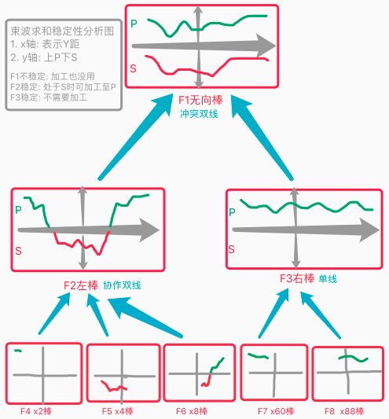 |
| 说明 | 1. 上方束波由下方束波共同合成; |
|  | 2. 太抽象的`F1`一般不够稳定,向下找到稳定`F2/F3`为止; |
| 问题 | F1和F2其实两种曲线可交换,只是画法不同罢了 `转24081`; |

   

## n24p08 PMV4-稳定性迭代2
`CreateTime 2021.10.26`

| 24081 | VRS稳定性判断分析 |
| --- | --- |
| 问题 | 如图,F1可以表示为A或B,但A不稳定B稳定; |
| 示图 | 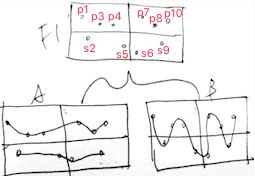 |
| 分析 | 判断稳定性,不应以AB曲线画法来决定,而是以p或s点的`相临强度和`来决定; |
| 举例 | 如图中强度:p1=2,s2=1,p3p4=2,s5s6=4.5,p7p8=3,p9=1.5,p10=2; |
| 分析 | 从上面分析可知,完全是束波求和的自由竞争,与原V3版本一致不用改; |
| 结果 | 即原束波求和部分完全不用改,仅需要直接从rFos&pFos中取最具象; |
|  | 然后以最具象来获取SP束波求和曲线,即可; |
| 实测1 | 回测24064-问题,测下它的rFos&pFos中最具象的束波结果是什么? |
|  | 1. rFos不中用,几乎没啥SP (毕竟IRT就是pFos触发的); |
|  | 2. pFos最具象虽然稳定,但它指导性太差,往往content有多余概念; |
|  | 3. pFos最抽象确实指导性强,但不稳定; |
|  | 4. 抽具象多层级上,稳定性值非常多变,如从上到下为:`0.1,0.6,0.5,0.8` |
|  | 结果: 将rFos不包含Y距35的分别进行束波求和,得出pScore-sScore评分; |
|  | 结果: 绝对值越大的越稳定,依次将更稳定的递归返回作为结果; |
| 实测2 | 回测24064-问题,观察下当时出问题前的视觉木棒是左还是右棒? |
|  | 结果: 经查FZ31-2日志,飞后视觉木棒在右测,当时已是被撞后; |

   

## n24p09 废弃dsFo
`CreateTime 2021.10.28`

在上节VRS稳定性分析中,发现在PM中,curFo是dsFo,但却需要从rDemand.pFos中分析SP,而dsFo和pFos.SP是有隔阂的,但似乎又有些共同之处,所以本文重点分析能否废弃dsFo,完全由SP来替代之;

| 24091 | 废弃dsFo |
| --- | --- |
| 起因 | dsFo与P没啥区别,然后dsFo还没P理性; |
| 弃后 | 1. pFos的同类型mv生成同一R任务,因为它们在PM中要协作解决它; |
|  | 2. 废弃R模式取dsFo,它不再需要特定解决方案,pPorts就是它的解决方案; |
|  | 3. R任务不用反思了,因为没有dsFo,它本身就仅是按P修正自己来解决任务; |
|  | 4. R行为化在_Fo和_Alg走走过场,重点在调用PM中根据pPorts修正特征; |
|  | 5. 原ORT.SP嵌在dsFo下,现也相应改到rMatchFo下,与IRT.SP在一起了; |
| 疑问 | 吓跑老虎可以防止危险,那么`吓`这种`独立概念`怎么行为化呢? |
|  | 分析: `吓`并非P的独立概念,对P当前场景而言,重要的是`老虎的距离特征`; |
| 解答 | 即`吓`是为了解决老虎的距离GL的解决方案之一,它不在P中; |

   

## n24p10 `PMV4稳定性迭代` 与 `废弃dsFo`-代码实践
`CreateTime 2021.10.29`

| 24101 | 代码实践: PMV4与废弃dsFo代码实践 |
| --- | --- |
| 第1阶段 | R决策模式PM_V4迭代 `T` |
| 1 | 从所有`不含当前码`的pFos,做束波求和评分,然后根据`稳定性排出序列` `T`; |
| 2 | 对修正failure时,继续递归尝试 `废弃,GL失败,所有方案都一样`; |
| 3 | 支持不应期,不应期的元素为pFo的指针 `废弃,GL失败,所有方案都一样`; |
| 第2阶段 | P决策模式PM_V4迭代 `转24104` |
| 1 | P决策模式的PM没有pFos,先不改,等再觅食训练时再说 `TODO暂不改`; |
| 2 | 迭代空S评价,现空S评价容易`一杆子打死`,改成稳定性竞争 `参考24072`; |
| 第3阶段 | 废弃dsFo |
| 1 | 生成R任务时,同mv标识只生成一个任务 `转24105-24107`; |
| 2 | R模式从pFos抽具象排序,从抽象开始取做解决方案; |
|  | > 改为抽具象路径稳定性竞争 `转24107-4` |
| 3 | 在行为化中不需要再反思,_Fo和_Alg走走过场 `转24125`; |
| 4 | 然后直接PM,用protoFo-pFo得出独特码 `转第1阶段-1`; |
| 5 | PM修正GL任一条失败,则不应期当前pFo解决方案,并ORT增强S `原本如此`; |
| 6 | PM修正GL全部都成功,则当前R任务成功,并ORT增强P `原本如此`; |

| 24102 | 24101第一阶段回测-无关码的判定 |
| --- | --- |
| 前提 | 已经写了VRSReason对pFos做稳定性竞争,并`FZ31,直击`回测; |
| 问题 | 木棒X2码在VRSReason评价中不通过,本表分析这种`无关码`的判定; |
| 相关性 | 各码与危险与否的相关性判定; |
|  | 1. `与X2无关`: X2与是否撞疼无关 (X2不变); |
|  | 2. `与尺寸无关`: 车和木棒都会撞疼与尺寸无关 (尺寸可变), |
|  | 3. `与方向有关`: 左棒有时(危险地带时)危险,右棒明确安全; |
|  | 4. `与Y距有关`: 危险地带有时(左棒时)危险,安全地带明确安全; |
| 思路1 | 木棒全是X2,全被同区码排除掉,则对指导性打击太大,成了纯稳定性pk; |
|  | > 改成不排除同区码,即全参与稳定性竞争; |
| 思路2 | 明确安全的某场景下有X2,并不能说明它就在所有场景安全; |
|  | > 通过流程控制,即failure时,继续下一码修正; |
|  | > 否掉,因为这思路超出了当前场景,有更多不确定性; |
| 思路3 | X2是否无关:由当前场景的SP评价决定,X2是否修正:由pPorts中X值决定; |
|  | > 即X2可因S经历多而评为S,但是在pPorts取到的仍是X2无需修正; |
| 方案 | 结合思路1和3,思路3以往就是这样的,所以只需要改思路1即可; |
| 结果 | X2改后ok了,不过却导致Y距35在VRS不通过后`相等不必行为化`了,转24103; |

| 24103 | 24101第一阶段回测-Y距35不必修正问题 |
| --- | --- |
| 示图 |  |
| 原则 | 1. 评价时,从更全面找出哪个最稳定 (不论好坏); |
|  | 2. 修正时,找出最稳定的峰值P实现横向场景跃迁 (也是从束波中找); |
|  | 3. 修正时,不可脱离场景,即只限定在sFos中的SP找修正目标; |
| BUG1 | **示图-3:用P-S评价对稳定性不公平,因为越抽象的经历越多,差值也越大;** |
| 改排序 | 一级排序因子为:稳定性 (参考VRSReasonResultModel.stablity), |
|  | 二级排序因子A方案:`场景的强度` (即pFos越靠前越抽象,越优先); |
|  | 二级排序因子B方案:`P/(SUM(S)+SUM(P))` (弃:不能因为错过多,就排后); |
|  | 注: score评分公式,参考VRSReasonResultModel.score函数; |
| BUG2 | **示图-4:Y距35并非最佳修正目标,它应该是pPorts中束波评分最高的;** |
| 举例 | 当想要又大又红的苹果时,就去加工,即使又大又红的苹果从未存在; |
| 说明 | 每个独特码单独修正,创造出自己想要的P峰值结果 (拼接创造); |
| 分析 | F335的pPorts仅一条,所以改为评价不通过时,需排除同区码pFos; |
| 分析 | 评`左果Y距35`否时,应先从`左果`取修正Y距值,而不是更抽象的无向果; |
| 分析 | 即使修正目标score<0分,只要它是max,也可做为修正目标; |
|  | 比如:筛子扔中6点的几率只有1/6,score为负,但依然尝试扔出来; |
| 改动 | 1. 先将pFos排除同区码部分; |
|  | 2. 从评否的F335向抽象一级(F335.abs)与pFos的取交集(按sFos有序); |
|  | 3. 从每个pFo的SP,并从中取出同区码的值; |
|  | 4. 对每个同区码值,分别在sFo.pPorts和sPorts做score4Value()评分`; |
|  | 5. 评分结果生成VRSReasonResultModel,并将score最大的作为修正目标; |
| TODO1 | BUG1-改变最稳定排序方法; |
| 结果 | 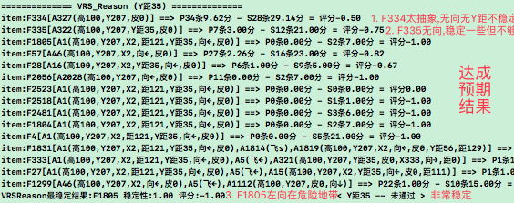 |
| TODO2 | BUG2-写取修正值的方法; |

| 24104 | P模式迭代PMV4计划 `待后回测P模式再来迭代` |
| --- | --- |
| 说明 | 目前P模式先不迭代,所以只把当前即有少有的线索留此,以随迭代时翻查; |
| 1 | 在_Alg行为化中,有MC对比,此处有inModel,所以此处可提供pFos; |
| 2 | P是偏感性的,而PM是特别理性的修正,所以P模式的PM应该比R模式更难; |
| 3 | 在PM层面上,最好能将P和R模式融合,当然也有它们的不同; |
|  | > 比如: pFos应该就不同,P模式的其实源于解决方案的抽具象fo树; |
|  | > 一样的是,将瞬时中的Alg,加工成内心中的SP修正目标; |
|  | > 如: 我想在餐桌吃饭解决饥饿问题,把厨房的饭端到餐桌上SP修正位置; |

| 24105 | RMV生成机制迭代 `转自24101-第3阶段-1`; |
| --- | --- |
| 分析 | 单个时序:[催饿火神虫],可以生成三个R任务; |
|  | 多个时序:[左石子撞来],[石子撞来],[物体撞来],却仅生成一个R任务; |
| 示图 | 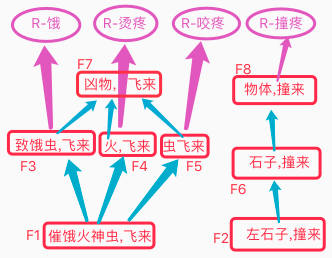 |
| 代码 | 1. 图左半侧:生成R任务 `转24106`; |
|  | 2. 图右侧:防重时,以生成R时的mModels,做为防重判断(交集>0条即重复); |
|  | 3. 图右侧:防重后,同时将新的mModels并入到旧的mModels中; |

| 24106 | R决策任务池 |
| --- | --- |
| 方案1 | 每条抽具象路径都生成单独的R任务,如图左侧生成三个任务,右侧为一个; |
|  | > 当F7里虫子被干掉后,三个任务因与F7在同一抽具象路径都完成了; |
|  | 缺点: 所以多任务间协同变的复杂,不建议每路径分成一个任务 `转方案3`; |
| 方案2 | 每种mv标识下的mModels为一组,并生成一条R任务; |
|  | > 此方案F4和F5只会生成一个任务,但不怕咬未必不怕火,这样不对 `否掉` |
| 方案3 | 单帧inModel生成一整个R任务; |
|  | > 其内的每个mModel子任务完成时,它的具象路径全算完成 `参考方案4示图`; |
|  | 优点: 此方案在RMV时,不必对单帧inModel进行拆分; |
|  | 缺点1: 多帧较为麻烦,如新帧更新旧帧同场景任务; |
|  | 缺点2: 单帧中有完成某任务时,要协同到别的帧做完成的判断; |
|  | 结果: 这些缺点其实是有解的,不必这么麻烦 `否掉,参考方案4`; |
| 方案4 | R任务池为树状网形,多帧间补充此树而非现在的数组池; |
|  | 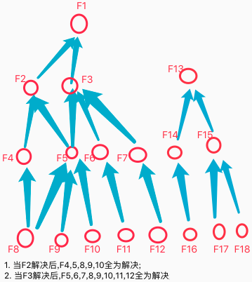 |
|  | > 任务池数据结构: RDemandManager中池子为多树形; |
|  | > 任务池排序权值 = mv迫切度 x matchValue匹配度 |
|  | > 首要R决策任务 = 排在最前的fo及其抽具象路径fo组成mModels; |
|  | > 行为化: 从mModels场景中,找出最稳定的进行p修正; |

| 24107 | R决策任务池代码实践 |
| --- | --- |
| 1 | 继续将R任务树中的所有itemFo存在DemandManager.loopCache `不动`; |
| 2 | loopCache排序因子新定义demandUrgentTo (R任务用迫切度*匹配度) `T`; |
| 3 | DemandManager写可根据单条R任务,取得其所有抽具象路径R任务组 `T`; |
| 4 | 剩下的行为化RAction和决策流程控制 `转n24p12`; |

   

## n24p11 回测PM修正目标
`CreateTime 2021.11.03`

在24103BUG2写了修正目标方法,此处回测,回测差不多后,再做24101-第3阶段,废弃dsFo;

| 24111 | 回测VRSTarget |
| --- | --- |
| 过程 | 1. `F31,直击`,X2在稳定性评价中,有+0.73,也有(左向棒)-1; |
|  | 2. +0.73说明x2还是有较稳定的P的,而-1说明它的S最稳定,即评价不通过; |
|  | 3. 评否后,修正目标取到X738,在右侧所以每次都安全,导致修正目标总是它; |
|  | 4. 生成GL,且有一条GL解决方案,后否掉,没方案了,全是无计可施; |
|  | 5. 无计可施,就转failure到_Hav,然后又再次PM; |
|  | 6. 再次循环第1步,形成死循环; |
| BUG1 | **以上X2的修正目标是X738,事实上X不重要,不应加工;** |
| 原则 | X2评为X738没问题,只是它无解而已; |
| 例1 | 某游戏可将快撞来的车瞬移至隔过你的前方,故`X是可加工的,无计罢了`; |
| 例2 | 即使现在没有瞬移技能,以后学会了呢?故`X是该加工的,先不论成败`; |
| 结果 | 不用改,因为加工X是正常的,可加工,且该加工; |
| BUG2 | **X2失败,不意味着PM整体失败,继续加工Y距还是可以躲避木棒的;** |
| 方案 | X2.GL无计可施时,要继续尝试pm修正下条独特码 `95%`; |
| 补充 | 方案1执行的同时,应要求接下来的修正场景中,包含X2(如F1805); |
|  | > 无需要求包含X2,因为只要F1805稳定,就不关别的码的事儿; |
| BUG3 | **打破过程6中的死循环问题;** |
| 分析 | _Hav已判断mIsC并进行PM,GL失败后,再来_Hav,又mIsC,又PM,死循环; |
| 线索1 | 查_Hav不应期是否未生效:瞬时protoAlg在_Hav中只判断一次mIsC才对; |
| 线索2 | BUG2方案会继续尝试别的独特码,即不会再进行过程5和6; |

| 24112 | BUG2代码实践分析 |
| --- | --- |
| 分析 | X2独特码,靠IRT的SP结果是评不出所以然的,明明很危险,但你还没法加工; |
|  | 只有PM知道它不可加工,并先尝试别的独特码,并反省逐步发现X2不重要; |
| 方案 | 对决策流程控制改动,使PM单码失败时继续别的码; |
| 1 | PM中有一项GL无计可施时,就废弃了整个reModel; |
| 2 | 应改为所有justPValues全失败时,才算reModel失败; |
| 3 | 即GL失败时,不应直接调用_Hav(base.base),而应该调用PM(base); |
| 4 | 而在PM中,所有独特码失败时,再调用_Hav(reModel.base); |
| 结果 | `暂停`,因为n24p12要大改,废弃dsFo,新写ReasonAction(PM集成其内); |

| 24113 | PM_Percept迭代计划 |
| --- | --- |
| 分析 | 最近迭代PMReason,但PMPercept缺参数(如pFos),本表分析它的迭代; |
| 方案 | 将PMPercept参数与PMReason参数对比分析,看能否有类似参数; |
|  | 1. 可以将解决方案的: curAlg看做matchAlg; |
|  | 2. 而reModel设为protoAlg;此时,curFo解决方案就是pFos; |
|  | 3. 将_Hav中的mIsC判断,改为inModel.matchAlgs中是否包含curAlg; |
| 结果 | 当前主要改R模式中,至于P模式后说 `暂停,转n24p12`; |

   

## n24p12 面向场景的稳定性评价
`CreateTime 2021.11.04`

PM有可能只需要改动多码中的一部分后,即可符合非常稳定的PlusFo结果了,本文从此切入,对场景做最稳定评价;  

**原则：迁移（指导性）为主，强化（稳定性）为辅。**

| 24121 | 面向场景稳定性评价 |
| --- | --- |
| 举例 | (v1,v2,v3)中,可能v1和v3是P,而v1和v2是S,v1自身也是P |
| 问题 | 此时面向单或多个v进行评价全不稳定,只有面向它们组合所在的场景才ok; |
| 分析 | 不是对多V组合评价,而是直接对Fo场景评价,它自然就是一组V; |
| 原则 | V根本不需要单独进行评价,只需要顺着场景进行修正即可; |

| 24122 | 实践分析1 |
| --- | --- |
| 分析 | 1. 仅对fo场景评稳定性,并竞争出修正目标场景Fo; |
|  | 2. 而A和V的行为化,只是为了加工成"稳定性Fo"; |
| 实践 | 1. 仅先迭代R模式的 (独立写行为化ReasonAction类) `T`; |
|  | 2. 至于PerceptAction随后也单写,后再重构复用; |
|  | 3. PM集成到ReasonAction中,并起新名字; |
|  | 4. FRS评价器理性迭代 `转24123`; |
|  | 5. 改IRT触发机制 `转24124`; |

| 24123 | FRS评价器理性迭代 |
| --- | --- |
| 说明 | 原FRS为空S评价器,即单条S,则全否掉,误杀率奇高,本表理性迭代之; |
| 整 | 整个fo的SP评价器 (即将sPorts和pPorts的强度和,计算为得分); |
| 分 | 在VRS中,以最稳定fo为目标,分别对单码进行评分修正目标; |

| 24124 | 改IRT触发机制 |
| --- | --- |
| 说明 | 时序识别matchFo,只有局部匹配时不进行IRT反省; |
| 代码 | IRT中,matchValue<1的不做反省; |
| 思考 | IRT中,已发生部分担P责?未发生部分担S责? |
| 结果 | `暂停`,后续看matchValue<1进行反省对FRS评价器的影响是否严重,再定; |

| 24125 | RAction代码实践前问题分析2 |
| --- | --- |
| 1 | RAction中,写多R稳定性竞争方法:FRS; |
|  | 问题: FRS的范围就只有`任务池的抽具象路径`吗? |
|  | 分析: 例如:正mv的Fo,还有识别到的RFos,是否也要参与稳定性竞争呢? |
|  | 结果: 转24126 |
| 2 | RAction中,不需要再反思,_Fo和_Alg走走过场; |
|  | 注意: 只是一级R解决方案不需要反思,后续跳转后fo还是需要反思的 `采用`; |
|  | 比如: 开关坏了,一级SP为拆开开关弄好即可; |
|  | > 但跳转二级[拆开关]可反思可能拆废,产生子任务进行复原; |
| 3 | RAction中,要不脱离场景,就废弃VRS评价和修正; |
|  | 问题: Y距这种常变V怎么办,它无法形成概念,获得直接的场景指导; |
|  | 分析: 比如虎在`身后`,坏开关切到`嘎一下`状态,即可顺利,都内含独立概念; |
|  | > 而Y距很难内含独立概念,如鸟躲汽车,但它依然得工作 `转n24p13`; |
| 4 | 当一条rDemand完成时,它的整个抽具象路径全设为完成状态; |
| 5 | 当一条rDemand失败时,仅它自己失败,别的可继续决策 `不动`; |

| 24126 | 废弃dsFo后-R任务解决方案源问题 |
| --- | --- |
| 1 | **IRT和ORT的SP统一** |
|  | 本来RDemand.matchFo,它来源于inModel.pFos,它的SP源于IRT; |
|  | 如果,此时废弃dsFo,直接用RDemand.matchFo做决策解决方案; |
|  | 那么ORT也会嵌在RDemand.matchFo下,与IRT的SP倒是同归了; |
| 2 | **从同层场景取解决方案** |
| 举例 | 坏开关,切至60%时可开灯,但这个60%很难学会; |
| R方案 | 而60%时,开关会嘎一下,此时序为:`Fo1[切开关,嘎一下]->{mv+}` |
| 分析 | Fo1并不在识别的rFos&pFos中,而在当前任务rDemand.matchFo的具象下 |
| 结果 | R任务取解决方案,可以从conPorts中取同层 (以进行修正加工); |
| 3 | **优先从哪取解决方案** |
| 从哪 | 在抽具象路径上 (不可从抽具象路径之外的场景取解决方案,会脱离场景): |
| 方案1 | 具象优先,缺点:`SP经验少`,优点:`贴合场景:比如开关嘎一下时即可好`; |
| 方案2 | 抽象优先,优点:`SP经验多`,缺点:`可能脱离场景:比如破坏开关`; |
| 结果 | 综上: 先方案1切入,贴合场景,找不到稳定P经验时,再转向方案2抽象尝试; |

| 24127 | 废弃dsFo后-R任务解决方案示图 |
| --- | --- |
| 示图 | 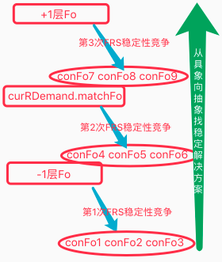 |
| 步骤 | 1. 取出与RDemand同标识同向mv指向的conFos,作为解决方案候选集; |
|  | 2. 对conFos进行稳定性竞争,得出P得分最高的conFo作为解决方案; |
|  | 3. 当此层conFos全失败时,再向抽象取上一层conFos重复步骤1,2; |
|  | 改: conFos不从下向上取,而是所有层全取出前3条,一并做FRS稳定性竞争; |

| 24128 | 迭代R决策模式-废弃旧行为化类 |
| --- | --- |
| 简介 | 以往的旧行为化类,用到后来发现有几大问题; |
|  | 1. GL脱离场景片面; |
|  | 2. _Alg越来越复杂,PM越来越复杂且与行为化割裂; |
|  | 3. 子任务嵌套太多 (与短时树统一调度不够和谐); |
|  | 4. 反思太过于简陋,集成在_Fo下很憋屈; |
| 结果 | 所以,决策独立写RAction,迭代R决策模式,并重新调整模型架构; |
| 结果 | 后整体重构TC架构,而RAction拆分其内实现,此处顺废 (参考24164); |

   

## n24p13 迭代R决策模式-废弃GL
`CreateTime 2021.11.14`

在24125-3中,要不脱离场景,就得废弃VRS,但废弃VRS后,Y距怎么加工呢?本节将针对解决此问题;

| 24131 | VRS矛盾分析与制定方案 |
| --- | --- |
| 矛 | 用VRS,会导致脱离场景,导致GL无论怎样都可能不对 `参考24121`; |
| 盾 | 弃VRS,会导致Y距无法加工,因Y距多变无法形成稳定概念 `参考24125-3`; |
| 分析 | 如上矛盾,废弃VRS的话,整个GL也得一并废弃,但根据`矛`,必须废弃; |
| 方案1 | 形成独立概念 |
|  | > 使鸟视觉看到公路形成危险地带概念:`Fo[危险地带,车撞]->{疼mv-}`; |
|  | > 且完全依赖时序来完成躲避危险地带:`Fo[危险地带,上飞,安全地带]` |
|  | 结果: 当前选用此方案,来废弃VRS和GL; |
| 方案2 | 形成空概念 |
|  | > 鸟不必看到危险地带,向具象回忆得出模糊预测:这一地带应该会有危险; |
|  | > 采用躲避危险地带,与形成独立概念时一致; |
|  | > 看到汽车时,匹配汽车行进方向即为危险地带,本质上还是有独立概念`汽车`; |
|  | 结果: 时序的概念化,或者形成空概念,这个`暂停,后面必需时再说`; |

| 24132 | R决策迭代-行为化分析 (取得解决方案后) |
| --- | --- |
| 举例 | R任务:`F1[A1危险地带,A3木棒飞来]`,解决方案:`F2[A2安全地带,A3木棒飞来]`; |
| 行为化 | **行为化步骤规划如下** |
|  | 1. 将F1加工成F2即可完成任务; |
|  | 2. 转_Hav()将A1加工成A2,取到`F3[A1危险地带,A4飞上,A2安全地带]`; |
|  | 3. 转_Fo()进行F3反思,反思通过后执行_Hav()飞上; |
|  | 4. 飞上后,发现还没飞到,仍在危险地带,重复第2步,继续飞; |
| 问题1 | 如第4步飞后未抵达`安全地带`,难道一直死循环第2-4步么? `转24133` |
|  | 分析: 飞到安全地带,这个应该本身包含多步而非一步到位; |
|  | 结果: 第4步未抵达时,改为递归至_Demand()行为化 `参考24133-流程2`; |
| 问题2 | 一步未到位时,不应该触发反省S `转24133`; |
|  | 分析: 大致当前距离,可以预测到一步飞不到安全地带; |
|  | 结果: 一步未到位时,该触发反省S `参考24133-原则1`; |
| 结果 | 先写行为化代码,问题1&2转至24133; |

| 24133 | RAction._Demand()单步失败或未完成时 |
| --- | --- |
| 说明 | 参考一步未飞到安全地带时,后面怎么继续决策 (参考24132-问题1&2); |
| 例1 | 掷筛子,掷出未掷中时,则继续采用上次用过的方案,掷失败时,则不应期; |
| 例2 | 飞路边,飞出未抵达时,则继续采用上次用过的方案,飞不动时,则不应期; |
| 分析 | `F1[危险地带,飞上,安全地带]`在行为化中的三种情况各自分析: |
| 1 | 飞失败,即飞后,预测匹配不到任何时序; |
|  | 问: 当连续尝试好几次飞失败时,计入不应期,它的机制是怎样的? |
|  | 答: 它可能是挫败感,或者懒得继续导致,所以应由反思评价实现 `转24134`; |
| 2 | 飞单步成功(未飞完),此时匹配到另外时序`F2[危险地带,飞上,危险地带]` |
| 3 | 飞完成(抵达安全地带),此时匹配到`F1[危险地带,飞上,安全地带]`; |
| 原则1 | 每次成功都P反省,失败都S反省,本来掷筛子统计再多也越是1/6; |
| 流程2 | 每次失败后循环应重新FRS_PK评价,有可能A方案就pk不过B方案了; |

| 24134 | R解决方案的`反思`与`不应期` |
| --- | --- |
| 示图 | 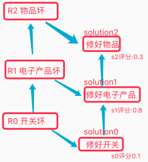 |
| 白话 | 张三:`修一下?`,李四:`哪有修开关的?`,张三:`也是`; |
| 方案1 | 竞争s1最优,但s0最具象,有抽具象关系时:以s0为准 `5%`; |
|  | 缺点:`麻烦-需要抽具象判定`,`片面-当前为钻石开关时无法照顾物价问题` |
| 方案2 | 基于反思实现不应期 `95%`; |
|  | 实践: 重组`fo[修好,钻石开关]`并反思,优点:`全面,各价值综合评价`; |
| 步骤 | `反思`->`反思子任务`->`不应期`; |

| 24135 | _Demand()的不应期来源 |
| --- | --- |
| 1 | 源于自身行为化失败; |
| 2 | 源于反思不通过,且反思子任务行为化失败; |

| 24136 | 废弃GL后对SP的影响分析 |
| --- | --- |
| 问题 | GL都废弃了,SP里表征的V值是否没必要了? |
| 分析 | 在SP中,如果只考虑场景的SP稳定性,那么HN是否可以创造出新的最稳定? |
| 比如 | 张三是菜逼,那把张三干掉,湖人队是不是就可以夺冠了? |
| 结果 | 暂不将SP细节转为强度值,虽然V不用了,但A可能还用的着; |

总结: 本节完成了RAction.convert2Out_Demand()部分,至于_Fo()部分,转至n24p14继续;

   

## n24p14 R决策构架分析调整
`CreateTime 2021.11.17`

上节完成了Demand行为化,本节重点完成Fo行为化部分,其中重点对反思与子任务进行深入分析迭代;

2021.11.18: 本节重点由Fo行为化转向整个R决策模式的架构调整;

原则:
1. 规划决策: 是应对预测中未发生的事(> cutIndex),设为actYes状态;

| 24141 | 实例分析 |
| --- | --- |
| A例 | 鸟吃防撞: 想吃危险地带的坚果,车撞来,子任务防撞,解决为等红灯; |
|  | 只有[绿灯 & 看到车 & 到危险地带],才会害怕被撞到; |
|  | 因为它`稳定性 x mv迫切度 > 父任务评分`? |
| B例 | 森林防虎: 出门穿越森林,可能遇虎,子任务安全,所以出门前带上枪; |
|  | 遇虎并不稳定,但危险mv迫切度特别高; |
| C例 | 侧门被堵: 常走的侧门关着时,开门继续走,被堵死时,改道走正门; |
|  | 1. 门关时,转子任务,解决方案为:将门打开; |
|  | 2. 门堵时,转子任务,无解决方案,递归找别的路(正门); |

| 24142 | 问题分析 |
| --- | --- |
| 防重 | 针对非同标识mv进行防重吗? |
|  | 实例: 我为了防止被旺财咬,想打跑旺财,但反思发现可能导致旺财更咬我; |
|  | 分析: 此时主任务防疼,反思结果也是疼,但确形成子任务; |
|  | 结果: 防重应针对整个任务短时记忆树TOModelTree; |
| 等待 | ActYes状态,用于规划决策,可参考以往:防止弄巧成拙相关代码; |
|  | B例: 还没遇到虎,就提前先带了枪,但没有开枪 (来的及评价); |
|  | 问题: 是否>cutIndex的部分,全是ActYes状态? |
| 挂起 | 是否对多个子任务挂起到池子,等待后续pk `先不作,后面再说`; |

| 24143 | 决策模型分析 |
| --- | --- |
| 示图 | 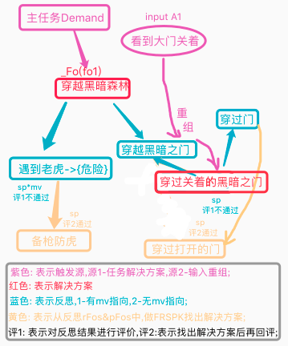 |
| 原则1 | 虚实结合,抽具结合,构建决策之树; |
|  | a. 向具象找解决方案,向抽象反思验证可行; |
|  | b. 任务为始偏虚,瞬时为终偏实; |
|  | 结果: 抽具,虚实,从神经网络中探索能走通的路; |
| 说明 | 1. 图中,无论如何反思,都是充实整个任务树; |
|  | 2. 以往的MC到PM已经融入其中,并且用重组反思的方式,使其不脱离场景; |
|  | 3. 当评1有mv时: 评分=mv迫切度*sp稳定性; |
|  | 4. 当评1无mv时: 评分=baseFo.mv迫切度*sp稳定性; |

| 24144 | 双向四操作-虚抽具实 |
| --- | --- |
| 抽 | 评价: 比如为了穿越森林丢性命不值,放弃穿越森林; |
| 具 | 子任务: 比如反思发现穿越森林有可能遇虎,所以提前备枪; |
| 虚 | 整干向分枝跳转,找出解决方案; |
| 实 | 及时应对外界变化，做出决策调整 (即以前的MC到PM)。 |

| 24145 | 纵横双向转化 |
| --- | --- |
| 示图 | 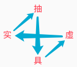 |
| 横转纵 | 先虚后实,二者重组后,立马转向纵向反思; |
| 纵转横 | 先抽后具,发现方案后,立马转由横向实践; |

| 24146 | 代码实践分析1 |
| --- | --- |
| 架构 | 架构改成:抽具虚实四个方法; |
| 触发 | 只要进入Fo行为化方法的时序,都进行反思; |
| 重组 | 对新输入的概念与行为化中的fo中的元素进行mIsC判定,并进行重组; |
| 防重 | 针对整个任务树防重 (参考24142); |

| 24147 | R决策系统-模型架构图 |
| --- | --- |
| 示图 | 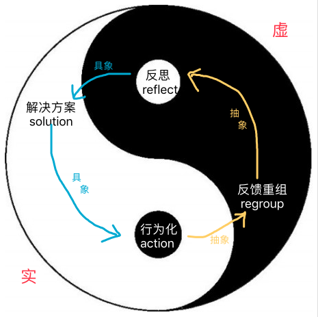 |
| 说明 | 以上为理想化架构,即A-G每一步都顺当时,呈现出的流程图; |
| 补充 | P模式: 与蓝色实并排类似,只是没有B和C部分,直接由A转D产生P任务; |
| 结果 | 此处后续迭代整个2021版TC架构,所以此处顺废 (参考24164); |

   

## n24p15 迭代R决策代码实践
`CreateTime 2021.11.18`

概念说明:
* 行为化: 是指将一切转为行为输出,以得到输入目标;
* feedback: 指以往的OPushM;

| 24151 | 代码实践分析2 |
| --- | --- |
| 整理1 | feedback,regroup,inReflect,subDemand |
| 整理2 | solution,outReflect,action |
| 防重 | 针对整个任务树防重,补充,更新等 (参考24142); |
| 运行 | 这些方法分为一入一出双向,螺旋运行,递归父循环或构建子循环; |

| 24152 | 新架构流程控制 |
| --- | --- |
| 说明 | 本表对: A-G任意部分出现各种分支时,应当跳转到哪里分析; |
| 性能 | 如太多分支,可能长成非常畸形的树,为此可限制分支层数等方式; |
| 绿A | 1. 失败时,actYes无反馈,触发反省,并递归到上轮E尝试下一解决方案; |
|  | 2. 成功时,如图所示继续; |
| 绿C | 1. 评价通过时,递归到上轮G继续行为化; |
|  | 2. 评价失败时,如图所示继续; |
| 黑E | 1. 无解决方案时,递归到上轮E,尝试下一解决方案 (如做了菜超难吃改外卖); |
|  | 2. 有解决方案时,如图所示继续; |
| 黑F | 1. 评价失败时,递归到E尝试下一解决方案; |
|  | 2. 评价通过时,如图所示继续; |
| 黑G | 1. isOut输出成功时,如图所示输出后,继续绿A; |
|  | 2. !isOut输出失败时,如图所示找cHav,继续红A; |
|  | 3. !isOut && 跳转失败时,递归到黑E尝试下一解决方案; |
| 总结 | 大多情况下,要么递归到E,要么继续下一步 `参考24154整体模型图`; |

| 24153 | 新旧架构对比 |
| --- | --- |
| 旧说明 | 原架构是针对各宏微层级行为化 + 流程控制实现递归决策; |
| 新说明 | 现架构是针对各功能操作 + 流程控制实现递归决策; |
| 旧缺点 | 微观上脱离场景,且各功能太耦合,比如_Fo中即包含反思又包含子任务等; |
| 新优点 | 不脱离场景,功能拆解各自实现,缺点就是得重新整理整理流程控制; |
| 对比 | 1. 系统架构对比: 旧螺旋主要体现在三层循环和相对,新架构全是螺旋; |
|  | 2. TC架构对比: 原架构为分裂,新架构为螺旋; |
|  | 3. TO架构对比: 原决策为宏微+递归流程控制,现决策融于螺旋中; |
| 总结 | 旧: 旧TC用分裂来探索出各模块,旧TO也更聚焦于当时具备的宏微等; |
|  | 新: 而新架构是对以上探索的收获,并对螺旋架构进行完善; |

| 24153B | 宏微架构和螺旋架构的区别是什么?共同点是什么? |
| --- | --- |
| 宏微 | 体现出 "顺利时显螺旋" 和 "不顺时显树形"; |
|  | 在代码实践上也不复杂,而数据是结构化网,导致二者整合后,变的较为复杂, |
|  | a. 在宏观微观的跳转上较为生硬; |
|  | b. 各种功能没形成流程,导致各宏观微观都可以调用各种功能,较为混乱; |
|  | c. 并且尤其是微观时脱离场景严重; |
| 螺旋 | 单流程循环->多循环螺旋->不顺时递归->时顺时不顺时树形; |
|  | 在代码上只需做单流程更简单,而数据是结构化网,二者组合成任何别的; |

| 24154 | R决策模型图2 |
| --- | --- |
| 整体 | 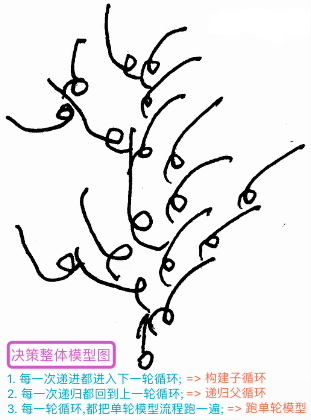 |
|  | 说明: 一轮轮运行,最终形成树形短时记忆; |
|  | 过程: `先输入`->`发现任务即生根`->`循环出繁茂树枝`; |
| 单轮 | 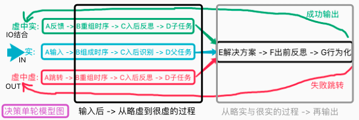 |
|  | 说明: 新的决策架构,左侧为认知,右侧为决策,整体在认知与决策形成螺旋形; |

| 24155 | 代码实践分析3 |
| --- | --- |
| 命名 | feedback,regroup,solution,demand,ioReflect,action |
| 说明 | 大多已有类似代码实现,有些并不在决策中:`如绿A,蓝ABC`,整理来继续用 |

   

## n24p16 `思维控制器`整体架构调整
`CreateTime 2021.11.25`

本次TC新架构,主要更新了更好的螺旋,改正决策上的错误,补足认知上的简陋:
1. 加强了决策与认知的螺旋融合;
2. 加深短时记忆树形结构的全局感;
3. 简化决策系统 (废弃原微观脱离场景部分);
4. 迭代认知系统 (将原决策系统的多种路径迁到认知中来);
5. 认知与决策更深入的协作 (认知更新推进树,决策构建成长树);
6. 输入输出期短时记忆融合;
7. 将P任务和R任务融合一体,原行为化更一致,短时记忆里也更一致;

| 24161 | 思维控制器架构调整 |
| --- | --- |
| 决策 | 单轮模型图右侧部分由决策完成:solution(),outReflect(),action(); |
| 认知 | 单轮模型图左侧部分由认知完成:`绿,蓝,红`三条路径全部由TI完成; |

| 24162 | 决策结果的多路径 |
| --- | --- |
| 说明 | TO结果并非单条,有`actYes,isOut输出,跳转`多条路径如下: |
| 动静 | actYes->feedback:`普通Fo末帧结束 & H末帧结束 & 静默等待`; |
| 动 | isOut->input:`isOut=true进行输出后`; |
| 静 | cHav->jump:`isOut=false转cHav跳转后`; |

| 24163 | 思维控制器架构图V2 |
| --- | --- |
| 示图 | 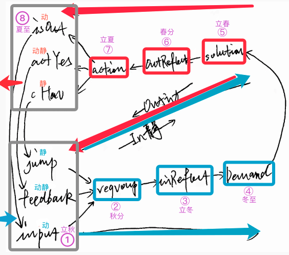 |
| 说明 | 四季标注纯方便理解,如不懂四季可无视; |

| 24164 | 思维控制器架构图V3 |
| --- | --- |
| 问题 | inReflect和outReflect是否同一个? |
|  | 分析: TO期不该有反思,循环到TI期进行也完全来的及; |
|  | 举例: 出发前不会反思路经侧门不通,`走行为`后才反思到它不通; |
|  | 结果: 所以将outReflect废除掉,并调整架构图如下: |
| 示图 | 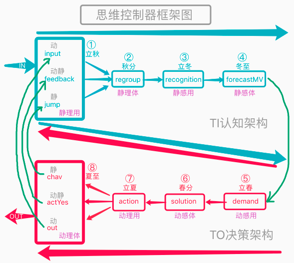 |

| 24165 | PRH三种Demand分析 |
| --- | --- |
| 说明 | 对于percept,reason,cHav三种任务,分别有三种Demand,路径也各不同; |
| P路径 | input->直接转forecastMV->生成PDemand; |
| R路径 | input->regroup->recognition->forecastMV->RDemand; |
| H路径 | jump->直接生成HDemand; |

   

## n24p17 `思维控制器`架构调整-代码实践
`CreateTime 2021.11.27`

| 24171 | 实践TODO |
| --- | --- |
| 1 | PDemand考虑将p解决方案做为matchFo(它的cutIndex=-1罢了); |
| 2 | 迭代getInner_HN()支持从短时的延续来找,其次再单纯取cHav; |
|  | 如: 现`短时记忆树cutIndex已发生部分`有带皮果,在它基础上扔路上去皮即可; |
|  | 注: 去皮并非去掉皮特征,而是通过怎样的场景加工,能够使之变成去皮果; |
| 3 | 后面废弃HN节点,目前先不废弃; |
| 4 | 写TI.jump(); |
| 5 | 写TI.regroup(); |
| 6 | 废弃PM,用`重组,反思,产生子任务`,来替代它的作用; |
| 7 | `紧急情况`迭代为`解决方案所需时间 > 父任务能给的时间`时,情况紧急; |
|  | 代码: 在action中,判断solution所需时间和父任务剩余时间对比; |
| 8 | 写HDemand类型 `T`; |
| 9 | feedbackTOR流程为:`先输入,概念识别,反馈TOR,时序重组,时序识别`; |
|  | a. 将feedbackTOR由原时序识别后调用,改到概念识别后就调用 `T`; |
|  | b. feedbackTOR中,改为对所有waitModel都参与反馈重组识别 `T`; |
|  | c. 将新输入的protoAlg替换到原fo中,并重组成新时序,进行识别; |
|  | d. 所有识别结果pFos(含mv+和-)做为反思结果生成子任务挂载到fo下; |
|  | e. 可能产生一堆子任务,但此处不触发决策,由solution自行判断决策哪个; |
| 10 | 为了综合评分,mv正负全加入任务树,比如:我做饭爱吃mv+,但麻烦mv-; |
| 11 | TCSolution.solution()自行综合评分,判断当前该决策哪个; |

   

## n24p18 螺旋架构-流程控制
`CreateTime 2021.12.03`

| 24181 | 螺旋架构的流程控制-初步分析 |
| --- | --- |
| 简述 | 旧架构流程控制依托于宏微行为化,新架构依托于螺旋架构本身; |
| 详述 | 螺旋架构跑出来短时记忆树,然后逐层找最优方案进行行为化输出; |
| 分析1 | 任何枝点无解决方案时,停止继续向后螺旋,并递归; |
|  | 如: 穿越森林,今天森林不开放且无解,则不再计划进林后的事,并递归; |
| 分析2 | 任何枝点评分太低导致综合为负时,停止继续向后螺旋,并递归; |
|  | 如: 为了吃零食要走好远去买,跑好远评分太低,宁不吃也不去; |
|  | 注: 子任务并未失败,只是评分低,此时如果有顺风车带你去,会复活此任务; |
| 分析3 | solution无子任务时,则直接采用; |
| TODO | 1. solution失败时,取下一解决方案 (限制limit); |
|  | 2. demand无解失败时,demand评分>base带来价值时,demand枝失败; |
|  | 3. feedback时,失败的demand可复活,继续向下决策; |
|  | 4. 子任务的失败会向父任务传染, |

| 24182 | 枝点方案池PK |
| --- | --- |
| 步骤1 | 先进行理性淘汰 (如来不及的 或 不可行的); |
|  | 来不及如: 石头三秒内砸到自己,现在回家拿头盔来不及; |
|  | 不可行如: 穿越森林,今天森林不开放,所以不可行; |
| 步骤2 | 再进行感性综合评分淘汰 (综合评分为负的),如此时饿度评分5; |
|  | 外卖:省事+8分,卫生-6分,味道-12分 = -10分 `综合+3=-7分`->宁饿不吃; |
| 步骤3 | 再进行感性综合排序 (综合评分PK),如此时饿度评分5; |
|  | 做饭:省事-8分,卫生+8分,味道0分 = 0分 `综合+3=3分`->PK失败; |
|  | 馆子:省事+8分,卫生-8分,味道+10分 = 10分 `综合+3=13分`->PK胜出; |
| 注 | 综合评分,是需要对枝点下所有子分枝进行综合评分求和; |

| 24183 | 螺旋架构-流程控制示图 |
| --- | --- |
| 示图 | 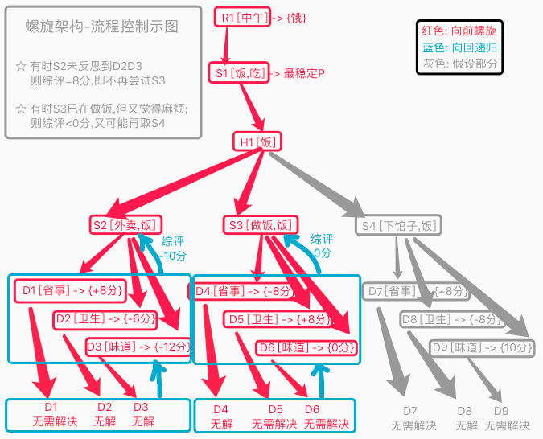 |
| 略写 | R:`ReasonDemand`,S:`Solution`,H:`HDemand`,D:`Demand` |
| S流程 | `TRUE`: S综评有一条非负时,直接选用; |
|  | `FALSE`: S综评负分时,则尝试下一解决方案; |
| 方案PK | 所有S综评都为负时,进行`方案池PK` (参考24182); |
| 1 | `来不及和不可行`,参考24182,在行为化时就已判定了这两种状态; |
| 2 | `非常饿`: 当R1饥饿度>10分时,与`S2-10分`求和为正,则饿到外卖也吃; |
| 3 | `不太饿`: 当R1饥饿度<10分时,与`S2-10分`求和为负,则宁饿不吃外卖; |

     
