# 乌鸦挑战-整体训练

> 注:
> 1. 在n25中，做了相近匹配,强化学习训练器,并且整理了TC数据流,本文在此基础上回归训练,并做乌鸦挑战的整体训练;

***

<!-- TOC -->

- [乌鸦挑战-整体训练](#乌鸦挑战-整体训练)
  - [n26p01 十七测-回测飞错方向的问题](#n26p01-十七测-回测飞错方向的问题)
  - [n26p02 相近匹配pFo: 微观新增mv指向标记,优化识别](#n26p02-相近匹配pfo-微观新增mv指向标记优化识别)
  - [n26p03 加强强化训练-优化卡顿问题](#n26p03-加强强化训练-优化卡顿问题)
  - [n26p04 迭代DemandModel-单任务对应多pFo](#n26p04-迭代demandmodel-单任务对应多pfo)
  - [n26p05 废弃ARSTime评价器](#n26p05-废弃arstime评价器)
  - [n26p06 十八测](#n26p06-十八测)
  - [n26p07 TC数据流2-逐层宽入窄出](#n26p07-tc数据流2-逐层宽入窄出)
  - [n26p08 十八测2](#n26p08-十八测2)
  - [n26p09 TC数据流3-S有效率](#n26p09-tc数据流3-s有效率)
  - [n26p10 十八测3](#n26p10-十八测3)
  - [n26p11 TC数据流4-整体观](#n26p11-tc数据流4-整体观)
  - [n26p12 TC数据流4-迭代TCSolution思考过程](#n26p12-tc数据流4-迭代tcsolution思考过程)

<!-- /TOC -->

## n26p01 十七测-回测飞错方向的问题
`CreateTime 2022.05.04`

上节修复了躲错方向的问题,本节用强化学习继续训练,并回测此问题;

| 26011 | 回测-FZ42训练步骤 | 备注 |
| --- | --- | --- |
| 1 | 随机飞,扔木棒,循环5次 x 10轮 | 每轮重启 |

| 26012 | 强化训练中,前一步没完成,下一步就跑了 |
| --- | --- |
| 方案 | 加上训练单步`完成判断`,只有完成时,才能开始训练下一步; |
| 结果 | 加上invoked()方法,用来标记当前步骤训练结束 `T`; |

| 26013 | 训练FZ42 & 回测躲错方向问题 |
| --- | --- |
| 说明 | 按26011步骤,训练FZ42,并回测是否识别并正确应用'偏上,偏下'; |
| 方式 | 回测方式:`FZ42,飞下(如自行飞走,可拉回到偏下路边),直击`,看日志; |
| 准备 | 在回测躲错方向问题前,做些准备; |
|  | 1. 写代码判断偏上偏下的程度。 `T` |
|  | 2. 识别结果日志里，打出偏上偏下。 `T` |
|  | 3. 生成任务日志里，打出偏上偏下。 `T` |
|  | 4. 思维可视化的节点显示：显示偏上偏下。 `T` |
| 步骤 | 整理正确的执行步骤,如下: |
|  | `V相近`->`A相近识别`->`F相近识别pFos`->`R任务`->`S解决方案` |
| 一测 | 到第3步时,发现没有识别到相近的pFo,只有许多rFo,即虚概念识别不顺; |
|  | 问题: 没pFo结果,导致在偏路边,却没有偏路边的任务,但别谈解决方案; |
|  | 分析: 查TC数据流,看是否前面收太窄了,导致后面没pFo结果; |
| 方案1 | 查TC数据流,调试出不合理的配置,并调整; |
|  | 调试: 到TIR_Alg中,调试一下refPorts有pFo指向的; |
|  | 经查: 并不是配置不合理,本来pFo的指向就很分散,见下示图及说明 `废弃`; |
| 示图 | 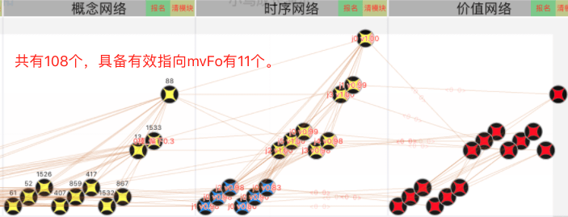 |
| 说明 | 如图,pFo是存在的,只是太过分散,因为refPorts是强度有序,不是mv有序; |
| 方案2 | 加上mv有序; |
|  | 分析: cpu性能其实还好,这里不需要加序列这种空间换时间,此方案 `废弃`; |
| 方案3 | 给refPorts加上mv指向标记; |
|  | 分析: 此方案即标记了mv指向,又没加序列,是折中适合当前的方案 `采用`; |
| 结果 | 在一测测到问题,选定方案3,代码执行转`26021`; |

| 26014 | 工具优化 |
| --- | --- |
| 一 | 可视化工具优化 |
| 1 | 思维可视化支持手势缩放 `T` |
| 2 | 思维可视化支持状态显示 `T` |
| 3 | 网络可视化更方便追加节点 `T` |
| 二 | 更长的强化训练支持 (为了训练更长时间,需要支持模拟重启和复位) |
| 4 | 强化训练器支持模拟重启 `T` |
| 5 | 强化训练器支持退回MainPage `T` |

***

## n26p02 相近匹配pFo: 微观新增mv指向标记,优化识别
`CreateTime 2022.05.11`

说明: 在上节中,测试`偏上偏下`流程(参考26013-步骤),结果发现了相近很难最终匹配到pFo的问题,数个模块间,都是一对多关系,如果单纯的过滤出pFo,非常耗性能,所以需要提前在微观中标记下是否宏观有mv指向,以此来优化识别时的性能 (参考26013-方案3);

| 26021 | refPorts新增mv指向标记-代码规划 |
| --- | --- |
| 分析 | V.refPorts需要对每个port做标记,如`A1Port有`,`A2Port无` |
|  | A.refPorts需要对每个port做标记,如`F1Port有`,`F2Port无`,`F3Port有` |
| 结果 | 只要宏观一级有一条有mv,则微观一级的port标为有; |

| 26022 | refPorts新增mv指向标记-代码实践 |
| --- | --- |
| 1 | AIPort加一个标记字段 `T`; |
| 2 | 在有mv输入时,回溯它的content_ps,然后更新标记 `T`; |
| 3 | 在识别算法中,直接判断标记,以此优化性能 `T`; |
| 4 | 根据`26011`训练FZ43 `T`; |
| 5 | 并在FZ43上回测`虚概念识别`与`飞错方向`问题 `转FZ44去测`; |

| 26023 | FZ43的refPorts有重复的问题 `T` |
| --- | --- |
| 说明 | 26022-2更新mv标记后,将db+mem的全存到db中了,导致ref有重复; |
| 结果 | 将取AINetUtils.refPorts()中做防重处理; |

| 26024 | 弃用partAlgs `T` |
| --- | --- |
| 说明 | partAlgs的作用是还没全含时过渡用的,但有了相近匹配后,不用它过渡了; |
| 结果 | 现在partAlgs除了可能识别片面且错误,啥用没有,先弃用掉; |

| 26025 | 重训FZ44 & FZ45 |
| --- | --- |
| FZ44 | 在改了26023和26024后,按照26011步骤重训FZ44; |
|  | 待查1: FZ44的S数全是0,P数正常 `在26026-BUG2修复后好了`; |
|  | 回测: `偏上偏下飞错方向`问题,发现FZ44的偏上偏下被击中经验不足; |
|  | 所以,重新训练FZ45,尽量让它在'偏上偏下'位置上多几条被击中经验,如下: |
| FZ45 | 在`危险地带各向飞后直击`,和`安全地带各向飞后偏击`,得到FZ45; |

| 26026 | 多线竞争不合理问题-SP评分不合理 |
| --- | --- |
| 问题 | 在rSolution取得方案不合理,经分析因SP评分问题,导致方案竞争不合理; |
| 示图 | 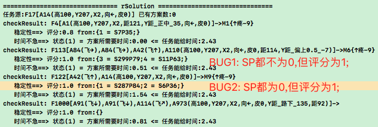 |
| 复现 | FZ45,直击,然后看日志即可; |
| 说明 | SP评分有许多不合理之处; |
| BUG1 | SP全不为0,SP评分应该是一个0-1之间的率,但却是1.0分; |
|  | 解决: 打印错了,把0.95以上的全打印成1.0了 `T`; |
| BUG2 | SP都是0(白户),却评1.0分,比老道解决方案评分还高; |
|  | 解决: 当SP全为0时,相当于S与P一致,即评分为0.5 (暂定) `T`; |
| 结果 | BUG2已修复,用26011步骤重训FZ46 (S全为0的问题已消失); |

| 26027 | 乱飞好久才停 |
| --- | --- |
| 复现 | FZ45,直击,发现各种方向飞,然后近8k行日志才停下; |
| 分析 | 婴儿期,不断预测任务,并执行各种方案,导致乱动是正常现象; |
| 结果 | 在这些乱动中,随着SP反馈工作,SP稳定下来,自然就好了,`转26029`; |

| 26028 | 回测偏上偏下流程: 偏上偏下无法识别到pFo结果的BUG |
| --- | --- |
| 复现 | FZ45,直击=>可以看到如下图,识别不到`偏上偏下`的pFo结果; |
| 示图 | 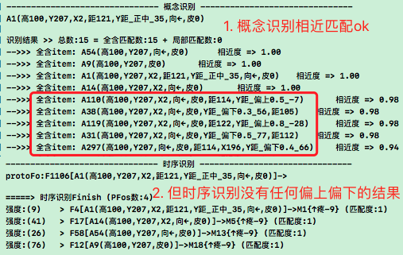 |
| 分析 | 偏上偏下都非常具象,一般都是类似`[↖,棒]`这样的时序; |
| 线索 | 而直击后的时序:`[木棒]`,与带`飞方向前辍的时序`,无法全含匹配; |
| 方案1 | 追加训练能否习得在不飞时,又在`偏上偏下`位置被撞到的经验`转方案2`; |
|  | 追加训练也不会无方向前辍,因为初始位置正中不飞就不可能`偏上偏下`; |
| 方案2 | 加上`改变小鸟初始位置`的功能 `T`; |
|  | 采纳,改后,不用再担心匹配不到`偏上偏下`的pFo; |
| 方案3 | 先飞下再直击,使之可以识别到`偏上偏下`的pFo `不用改立马见效`; |
|  | 分析: 此方案自欺欺人,所以还是采纳方案2; |
| 结果 | 选定方案2改了,重训(随便直接直击几下),即可测试到识别pFo成功; |
| 新问题 | 方案3可见效:`FZ46,↖飞,拉回偏上位置,直击`,但测得新问题如下图: |
|  | 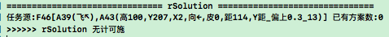 |
|  | 虽然有效,但找不到解决方案,需要多多训练:`转26029`; |

| 26029 | 加长版强化加训 |
| --- | --- |
| 问题 | 参考26027-乱动不停 & 26028-无计可施,所以此表做大量强化训练 |
| 准备 | 准备工作: 写noLog模式,在训练中,不打印HeLog,NSLog,TVFrame `T`; |
| 训练 | noLog模式一样卡,查下日志看卡的时候,到底在跑什么要这么久; |
| 结果 | 这里应该和26027的卡顿是同一问题,建议先优化卡顿,`转26033`; |

| 2602a | 鸟在偏下位置,明明撞到,却显示未撞到 `T` |
| --- | --- |
| 结果 | 经调试,发现minXY和maxXY计算有错; |

***

## n26p03 加强强化训练-优化卡顿问题
`CreateTime 2022.05.17`

参考26029,本文优化下训练效率(卡顿问题),并且重新规划下强化训练步骤;

| 26031 | 训练步骤规划 | 目标 |
| --- | --- | --- |
| 1 | `随机出生位置,扔木棒,重启` x 50轮 | 可识别到`偏上下`pFo |
| 2 | `飞或直击x5,重启` x 50轮 | 学会正确方向躲 |

| 26032 | 先按照26031步骤训练FZ47,复现卡顿问题 |
| --- | --- |
| 训1 | **根据26031训练至第2步,第20来轮有些卡,35轮左右时非常卡;** |
|  | 记忆: 保存`FZ4702_非常卡版`,当`FZ4702,直击`时,可复现卡好久; |
|  | 回测: 但`彻底卡死`即使复现了,也没法改问题,因为一直卡着 (半小时以上); |
| 训2 | **重新训练第2步,只训练20轮,然后保存`FZ4702_20轮版`;** |
|  | 回测: 当`FZ4702,直击`时,可复现卡5分钟左右,如下图; |
|  | 示图:  |
|  | 原因1: 如图,非常多的root,然后还很具象 (主要责任); |
|  | 原因2: 如图,每颗树都非常茂盛 (次责近于无责); |
|  | 方案: 卡的原因主要是root多,建议pFo识别后仅第1条转为root任务; |
| 结果 | 制定方案成功,代码改动与回测,转26034; |

| 26033 | 强化训练过程中卡顿问题V2 `参考26027` |
| --- | --- |
| 说明 | 26027想躲过性能优化不易,因为在26029加长强训时,性能卡跑太慢; |
| 方案1 | 婴儿阶段学走路本来就难且需要时间,强训太慢忍会就好; |
|  | 分析: 问题是现在不想忍,所以此方案 `废弃`; |
| 方案2 | 看看root数是否能控制下 (不断循环中,可能不断有新的root); |
|  | 分析: 可以先调试下root到底有多少,是否需限制 (测训参考26032-训2); |
| 方案3 | 看是否把energy功能再打开 (现在采用的是energy无限,限制层数); |
|  | 思路1: 每个Demand,针对它的子S个数,要不同对待; |
|  | 思路2: 串联水管要以最细的为准,逐级父级中有一个energy不足即停取S; |
|  | 暂停: 经26032测2所示,本方案无责,以后有需求再做 `暂停`; |
| 结果 | 经26032测2中训练调试,方案2负主要责任,代码实践 `转26034`; |

| 26034 | 卡顿优化-限制root生成数 (参考26032训2方案) |
| --- | --- |
| 方案 | 识别pFos后,仅相近度(价值评分)最高的且同AT的pFo转为R任务; |
| 结果 | 加了价值评分排序 & 同区AT防重,经重测卡顿问题已解决; |

***

## n26p04 迭代DemandModel-单任务对应多pFo
`CreateTime 2022.05.18`

在26034中,取首条pFo生成任务,但这样就导致生成任务的pFo太过单一,也太过抽象,错过许多细节等问题,本节主要针对此问题展开解决,并迭代任务demandModel模型;

| 26041 | 首条pFo生成任务不妥 |
| --- | --- |
| 问题 | 直接取首条显然不合适,因为指导性最高的,容易排前面,会导致片面; |
| 示图 | 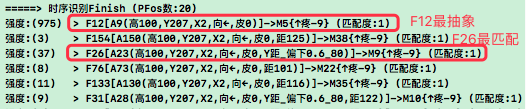 |
| 说明 | 如图,最后生成任务的只有F12,太抽象了,而F26这些带Y距的压根没机会; |
| 分析 | 此时正在I与O间的过渡,如果只取一个很难取到合理的solution; |
| 原则 | I与O过渡,正处在指导性与稳定性的`交接处`,应该`广握手,窄纳用`; |
| 方案1 | 将相近度计入pFos排序因子中 (如图中F12缺Y距匹配度应该<1); |
|  | 分析: 相近度影响到fo的匹配度确实看似有效,但缺点有二: |
|  | 缺点1: 微观相近度不应延伸到太宏观的fo上,微观太具体可变不可控性高; |
|  | 缺点2: 这并不能解决根本问题,未实现`广握手,窄纳用`; |
| 方案2 | 将一组同标识pFos共同构建一个demand `95%选用`; |
|  | 分析: 此方案即照顾了所有pFos,也照顾到solution竞争,与性能等; |
| 结果 | 选择方案2,代码实践 `转26042`; |

| 26042 | 多pFos构建单个任务-代码实践 (参考26035-方案2); |
| --- | --- |
| TODO1 | 对识别pFos按照AT分组,每组生成一个demandModel `T`; |
| TODO2 | 迭代DemandModel改为: 空壳demand + 下辖pFos `T`; |
| TODO3 | 将TCSolution()改成多个pFos下的解决方案进行竞争 `T`; |
| TODO4 | DemandModel的评分共享下辖pFos中的最高分 `T`; |
| TODO5 | solution解决方案共享,共用三条limit `T`; |
| TODO6 | 在arsTime取deltaTime时,取pFos中maxDeltaTime为准 `转26051`; |
| TODO7 | solution成果共享,即demand的状态共享 `不用改代码,T`; |

***

## n26p05 废弃ARSTime评价器
`CreateTime 2022.05.19`

在26042-TODO6中,ARSTime评价器`下标不急(弄巧成拙)`需要对当前解决方案solutionFo和任务源pFo之间做下标判断,而现在改成了多个pFo,这判断改着麻烦,所以想着要不直接把这个评价器废弃了吧,本文针对此问题做分析思考;

| 26051 | 废弃原因 |
| --- | --- |
| 说明 | ARSTime本就是旧架构下补丁式刻意设计的产物,在新螺旋架构下显无用; |
| 示例 | pFo下可能有各种各样的solutionFo,比如任务:[有老虎危险]; |
|  | 两个解决方案如: S1找到老虎打屎它, S2遇到老虎时打屎它; |
| 推陈 | 按现在下标不急评价器,会不允许找老虎,S1会强行中断而失败; |
|  | 即: `下标不急`评价器有逻辑漏洞,无法照顾所有情况 (比如S1无法执行); |
| 出新 | 那么`找老虎`和`遇老虎`的本质区别是什么? |
|  | 1. 老虎H任务是否有hSolution解决方案的区别; |
|  | 2. 找老虎会反思出新的子任务的区别; |
|  | 即: `下标不急`所体现的功能,可交由螺旋思维来接管; |
| 结果 | 根据以上推陈出新的两个观点,下标不急可废弃,由螺旋思维接代之; |

| 26052 | 实践分析 |
| --- | --- |
| TODO | 先注掉ARSTime代码不删,等回测彻底无用时,再彻底删除 `T`; |

***

## n26p06 十八测
`CreateTime 2022.05.19`

把上面几节中的改动,全回测下,包括:
* 回测Demand多pFos模型
* 偏上下飞错方向问题
* 加长强化训练
* 废弃ARSTime评价器回测

| 26061 | 训练步骤规划 | 目标 |
| --- | --- | --- |
| 1 | `随机出生位置,扔木棒,重启` x 50轮 | 可识别到`偏上下`pFo |
| 2 | `飞或直击x5,重启` x 20轮 | 学会正确方向躲 |

| 26062 | 参考26061步骤重训FZ48-测得生成root循环卡顿问题 |
| --- | --- |
| 重训 | 第1步正常,但第2步到中途时非常卡; |
| 复现 | `4802,直击`可以复现非常卡的情况; |
| 示图 |  |
| 说明 | 如图所示,root太多,建议由此展开分析; |
| 分析 | 应该是root1解决过程中,又识别到类似的root2,以此类推... |
| 示例 | 就像一直玩停不下来的小游戏,怎么才能停下来? |
| 思路1 | root1的pFos和root2的pFos之间,是否应该做个防重抵消什么的? |
|  | 分析: 即root2的起因是为了解决root1,那么root之间是否应该做防重? |
|  | 结果: root1和root2应该各自独立工作,不冲突,也不用防重 `否掉`; |
| 思路2 | 分析下怎么打破这种循环,比如飞到屏边缘是否pFos应该预测没啥危险了; |
|  | **方案1: 对比root法: 当飞屏边时应预测到危险,应小于,屏中的危险度;** |
|  | 分析: 否掉,root1与root2应各自工作,不对比,只竞争; |
|  | **方案2: 识别准确法: 飞屏边缘预测到没啥危险 `采用`;** |
|  | 调试1: 路中时: 预测到`偏上,偏下`等多个pFo; |
|  | 调试2: 屏边时: 预测到`偏下`多个pFo; |
|  | 分析: 识别不准,屏边时,没有无危险的结果,却有一堆偏下的危险pFo; |
|  | 问题: 识别不准的问题,需要提高识别准确性; |
|  | 解决: 识别准确性提升的方法为: 从微到宏,逐层宽入窄出 `转n26p07`; |
| 思路3 | firstPFo太片面,容易被不准的pFo影响,就会排前面决策继续循环; |
|  | 分析: 使用firstPFo评分,是偏感性不理性的做法; |
|  | 解决: 把demand评分改成综合计算,而不是firstPFo `采用,转n26p07`; |

| 26063 | rSolution应过滤掉负价值方案 `T` |
| --- | --- |
| 示图 | 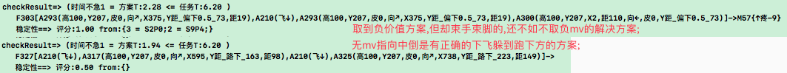 |
| 说明 | 负价值方案,首先是指向负,其次才是SP稳定性,即使再不稳定,那也是负; |
| 分析 | 一开始目标为负,再不稳定也不应该推进,所以最好一开始就过滤掉它们; |
| 重训 | 加了过滤后,依26061步骤重训FZ49,在第2步第1轮就复测出了卡顿问题; |
| 结果 | 已加过滤,`FZ4902,直击`可复现卡顿问题,回去`继续改26062`; |

***

## n26p07 TC数据流2-逐层宽入窄出
`CreateTime 2022.05.20`

回顾: 在n25p23中,针对TC数据流,做了`整体兼顾&各线竞争`,本节则针对`逐层宽入窄出`再做调整整理;

简介: 参考26062的问题,以及思路2和思路3,本文主要对TC的数据流继续进行调整,使微到宏逐层宽入窄出,然后将窄出的成果更理性的用起来 (原来firstPFo评分方式太感性片面);

* 本节目标: 能够使识别到最后生成任务时,更准确判断rootDemand的综合评分;
* 附带目标: 因为新的root未必抢占主线任务,所以可以防止多root循环跑卡顿;
* 附带目标: 识别准确度提升;

| 26071 | 逐层宽入窄出-模型图 |
| --- | --- |
| 示图 | 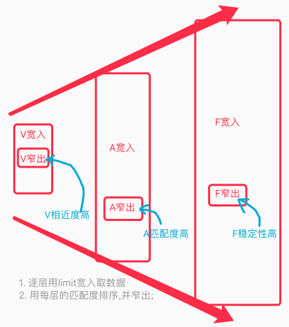 |
| 说明 | 如图所示,逐层limit宽入,匹配度窄出,即可; |
| 原则 | 强度负责广入,匹配度负责窄出; |
| 排序 | 每个模块排序依据不同: |
|  | `V相近度`,`A匹配度`,`F稳定性`,`D价值分`,`S有效率`; |

| 26072 | 逐层宽入窄出-问题分析 |
| --- | --- |
| 问题1 | 该放宽时却收窄 (比如概念识别只有有mv指向的部分); |
| 问题2 | 该收窄时未收窄 (比如pFos多达二十条); |

| 26073 | 逐层宽入窄出-代码实践 |
| --- | --- |
| TODO1 | 在V识别,仅取相近的前10条 `T`; |
| TODO2 | 在A识别,取匹配度窄出前5条 `T`; |
| TODO3 | 把A识别的匹配度公式改下: (匹配度=相近度总和/proto长度) `T`; |
| TODO4 | A识别改匹配公式后没全含了,废弃partAlgs,结果全放matchAlgs中 `T` |
| TODO5 | 在A识别,为了识别准确性,废弃仅识别有mv指向的 `T`; |
| TODO6 | 在F识别,仅取相近的前5条 `T`; |
| TODO7 | 在F识别,为了识别准确性,废弃仅识别有mv指向的 `T`; |
| TODO8 | 在F识别,排序方式以SP稳定性为准 `T`; |
| TODO9 | 在F识别,RFos排序不受`被引用强度`影响 `参考26071原则 T`; |
| TODO10 | fos4Demand()分组方式要将RFos结果也加入其中 `与RFo无关不用加`; |
| TODO11 | fos4Demand()排序方式,改成以价值综评分为准 `T`; |
| TODO12 | rootDemands竞争,由firstPFos改为综合评分 `T`; |
| TODO13 | solution窄出排序改为: 效用分 = 方案稳定性 x pFo价值分 `T`; |
| TODO14 | solution窄出条数取前3条 `本就如此 T`; |

| 26074 | 时序识别结果的排序方式 |
| --- | --- |
| 方案1 | 元素的匹配度 (到这里其实微观上的匹配度没那么重要,此方案`否掉`) |
| 方案2 | SP稳定性 (此方案较适合当前的情况 `采用`); |
| 方案3 | 价值综合评分 (这里还是识别期,最重要的是识别准确度,此方案`否掉`); |
| 结果 | 方案1太晚,方案1太早,只有方案2正合适 `采用,实践转26073-TODO8`; |

| 26075 | 边写代码实践边测试: 测得V不能太窄出的问题 |
| --- | --- |
| 问题 | V不能太窄出,一开始就过窄,会导致视觉7个码的refPorts都没交集了; |
| 分析 | 7个只有6个有交集,导致概念识别的相近度低且片面`因为有一个码没判断`; |
| 方案 | 将V的限制10,改成1000,问题解决; |
| 结果 | 改了后,概念识别相近度从大都是0.8以下,全成了0.95以上,问题解决 `T`; |

| 26076 | 分析demandModel的评分方式 `实践转26073-TODO12` |
| --- | --- |
| 说明 | demandModel改为多个pFos后,以firstPFo为准片面,需要改下; |
| 分析 | 五马分尸与一马不一样,千蚁啃咬与一只也不一样; |
| 方案 | 对demand.pFos价值评分求和,作为demand综合评分; |

| 26077 | 分析solution()窄出方式 `实践转26073-TODO13` |
| --- | --- |
| 说明 | 任务下有些pFo不太可能发生,有些保准发生; |
| 问题 | 原先仅对solution候选方案进行稳定性排序,显得不准确不公平; |
| 方案 | 候选方案评分改为: `效用分 = 候选方案稳定性 x 所在pFo价值评分`; |
| 追加 | 上述方案,导致全成了`无计可施`,改回到用单纯`稳定性`竞争 `T`; |

***

## n26p08 十八测2
`CreateTime 2022.05.21`

说明: 在上节理顺了宽入窄出后,本节回测上节的改动;

| 26081 | 训练步骤规划 | 目标 |
| --- | --- | --- |
| 1 | 随机出生位置: `扔木棒,重启` x 200轮 | 识别`偏上下`pFo |
| 2 | 随机偏中出生位置: `木,随机飞x3,木,重启` x 100轮 | 学飞躲 |

| 26082 | 按照26081的步骤-回测以下三项 |
| --- | --- |
| 测项1 | 识别准度提升: `偏上偏下`认知部分测试; |
|  | 结果: 在训练到1步后,测试通过; |
| 测项2 | 重训下看root循环卡顿的问题是否还有; |
|  | 结果: 没了,暂未复现,应该已经解决; |
| 测项3 | `偏上偏下`正确躲避方向,决策部分测试,决策过程并不顺利,分析如下; |
|  | 方案1: 需要规划新的训练步骤等 `转26083`; |
|  | 方案2: 查不顺利的原因 `转26084`; |

| 26083 | 训练步骤分析调整 `无用,转26084` |
| --- | --- |
| 方案1 | `边直击边飞` x 5格 (上,下,左上,左下,右上,右下)6向各一次); |
|  | 目标1: 习得[危险地,上飞,安全地]的经验; |
|  | 目标2: 并能够在Solution()中,准确的取得这条经验 `取不到,失败`; |
| 方案2 | `直击,飞,飞,飞,直击` x 训练100轮; |
| 结果 | 方案12都试了下没啥用,全是无计可施 `转26084`; |

| 26084 | TCSolution窄出过严的问题 `T` |
| --- | --- |
| 示图 | 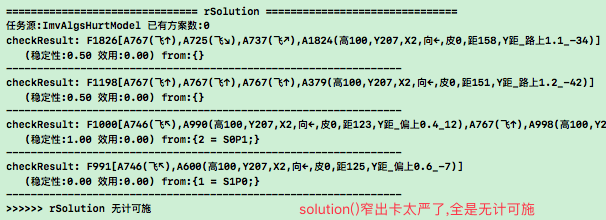 |
| 说明 | 如图,几乎全是`无计可施`,过严了,查下原因; |
| 原则 | 上一步的窄出就是下一步的宽入,如果上步卡死,那么后续决策就全没了; |
| 所以 | 只有拿出S尝试用,并且让后续决策,行为化,SP反馈等活跃的工作起来; |
| 思路1 | 或者画模型,把决策期的TC数据流整理下 `否掉`; |
|  | 结果: 就是solution()的问题,与后面决策流程无关,所以没必要画模型了; |
| 思路2 | 查下pFo下面是不是缺具象连接,导致没解决方案; |
|  | 调试: 网络可视化了几个pFo,确实没啥具象; |
|  | 分析: `无计可施`的原因就两种可能; |
| 原因1 | pFo没有具象关联 (原先FZ49代码分支时是有抽具象连接的); |
| 原因2 | TCSolution窄出太严 (先试下改这条,因为原因1最近没改啥相关代码); |
| 方案 | 将排序改回由`稳定性`排序 (参考26077-追加) `T`; |
| 回测 | 依26081步骤训练FZ50; |
| 结果 | pFo有了具象关联,TCSolution也有了解决方案S,但S没用好 `转n26p09`; |

***

## n26p09 TC数据流3-S有效率
`CreateTime 2022.05.21`

上节中,回测VAFD流程都ok,但S流程,出现过窄问题,后来修复后,有效的解决方案S也没有被有效用起来,导致决策过程不顺利,本节主要针对此问题进行解决;

| 26091 | 有效S未被用起来-问题说明 |
| --- | --- |
| 示图 | 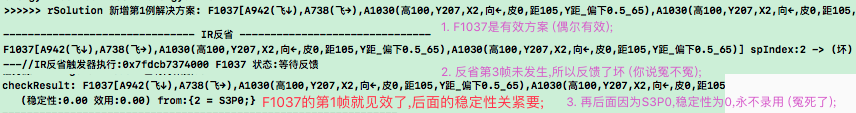 |
| 说明 | F1037是有效解决方案(首帧就有效,后面无关紧要),但却没被有效用起来; |
| 问题1 | 因为第3帧没发生,F1037连续三次反馈了S; |
| 问题2 | 连续3次S,导致TCSolution中它稳定性评分为0,永不录用; |

| 26092 | 有效S未被用起来-本节目标 |
| --- | --- |
| 解决 | 要制定方案间自由竞争的调整 (每个S都有机会成长起来); |
| 线索 | `有效率`和`稳定性`还是有区别的 `对比转26093`; |

| 26093 | 对比项 | 稳定性 | 有效率 |
| --- | --- | --- | --- |
| 1 | 触发 | forecast和actYes | demand和`未知,可能是tcOut吧` |
| 2 | 说明 | `此后发生每帧`稳定率 | `当前帧解决任务`有效率 |
| 3 | 功能 | 判断目标帧`未来是否发生` | 判断当前帧`即刻能否见效` |
| 4 | 代码 | TCRethink | TCEffect |

| 26094 | 有效率-模型分析 |
| --- | --- |
| 模型 | 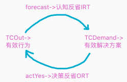 |
| 说明 | 图示,IRT和ORT部分是本来有的,此次主要涉及DemandEffect; |
| 疑问 | 但OutEffect还定不了,不过现在的行为偏简单都能成功,先不做; |
| 数据 |  |

| 26095 | 有效率-代码规划 |
| --- | --- |
| 1 | R解决方案倒计时触发器,判断是否发生负价值,得出有效性 `T`; |
| 2 | R解决方案给所有任务源pFos有效或无效计分到effectDic `T`; |
| 3 | R任务在feedbackTOP中,做effectStatus反馈状态更新 `T`; |
| 4 | H解决方案倒计时触发器,判断是否得到H目标,得出有效性 `T`; |
| 5 | H解决方案有效或无效计分到effectDic `T`; |
| 6 | H任务在feedbackTOR中,做effectStatus反馈状态更新 `T`; |
| 7 | 任务源fo中加effectDic,并写effectStrong模型 `T`; |
| 8 | 写effectScore()有效率计算方法 `T`; |
| 9 | TCSolution中以有效率排序 `T`; |

| 26096 | 改完26095后,按照26081步骤训练回测 |
| --- | --- |
| 简介 | 本表与本节问题关系不大,下面3个bug全是与飞方向有关的识别相关 |
| 复现 | 以下4个bug全是在训练第2步中卡顿中止后测得的; |
| BUG1 | **稳定性是0,但却被时序识别排在前面,从而识别到 `T`;** |
| 调试 | `[上飞,木棒]->{疼}`,木棒的S200P0,所以稳定性是0; |
| 原因 | 稳定性是0,但时序窄出排序用的是`SP好坏分`,它是从0坏到1好的值; |
| 修复 | 将时序排序改成`稳定性`排序 `T`; |
| BUG2 | **训练第2步中途,roots循环卡顿问题 `自然解决了,不复现`** |
| 调试 |  |
| 结果 | 修复BUG1,3,5,6后,重训26081步骤未复现; |
| BUG3 | **飞方向概念识别不准,如下图,上飞识别到除下三向之外的5个方向 `T`;** |
| 示图 | 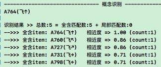 |
| 方案1 | 改下稀疏码相近序列的窄出条数 (最多10%条,最少1条) `弃掉`; |
|  | 结果: 10%条,会导致交集没结果的新问题 (参考26075); |
| 方案2 | 将概念识别匹配度85%以下的过滤掉,此方案ok采用 `T`; |
| BUG4 | **时序识别有稳定性奇低(有0.03甚至0.01)的结果 `T`** |
| 示图 | 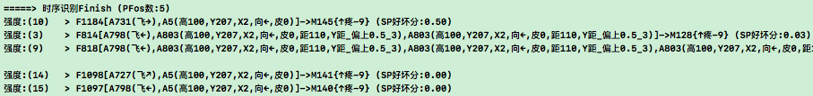 |
| 修复 | 将稳定性<0.4的识别结果过滤掉 `T`; |
| BUG5 | **测得getIndex_ps()得到的索引序列并不是相近度有序的 `T`;** |
| 修复 | 独立封装`稀疏码识别`方法,将相近度排序含其内 `T`; |
| BUG6 | **反思时时序识别的`全含判断`总失败 `T`** |
| 分析 | 4月30号优化`时序识别`时,将mIsC改成瞬时记忆的match+partAlgs来做; |
| 修复 | 但反思时当前时序和瞬时记忆无关,所以反思时改回旧方式判断mIsC `T`; |

***

## n26p10 十八测3
`CreateTime 2022.05.23`

| 26101 | 用26081步骤重训FZ51 |
| --- | --- |
| 说明 | 根据26081两步来重训FZ51,并测试`有效率`是否正常工作; |

| 26102 | effectDic计数BUG |
| --- | --- |
| 示图 | 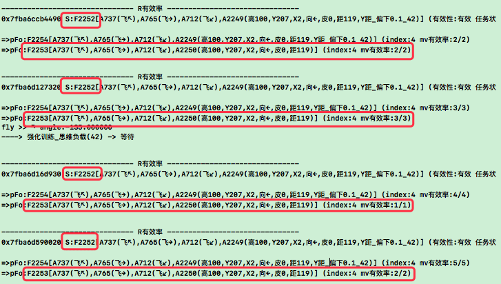 |
| 说明 | 同样是PFo2253下的S2252,明明前面已经有了3和4,后面又变成了1和2; |
| 怀疑 | 可以调试下,看S2252是不是四个触发器,4个实例未复用effectDic导致; |

| 26103 | 思维流程跑通率太低问题1: 概念识别部分 `T` |
| --- | --- |
| 问题 | FZ51-第2步训练过程中自主飞行次数极少 |
| 分析 | 从认知到决策整个思维过程中,发现全程跑通的很少,导致行为输出就少; |
| 调试 | 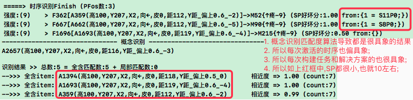 |
| 线索 | 如上图,认知期没抽象(太具象),决策期就很散,没法将整个TC流程凝聚起来; |
| 原则 | 向性原则: 认知期向性右上(宏感与抽象),决策期向性左下(微理与具象); |
| 方案 | 放开认知期的抽象,再观察整个TC数据流程,该调整调整,但向性原则不变; |
| 代码 | 将概念识别的匹配度公式改回`(相近度和/特征匹配个数)` `T`; |
| 回测 | 修复后,概念识别有抽象结果了; |
| 追加 | 打开抽象后,又在安全地带也会预测到[absFo]->危险; |
| 转移 | 可见,无论是打开抽象,还是关闭抽象,都不能片面处理 `转n26p11`; |

| 26104 | 思维流程跑通率太低问题2: 时序识别部分 `T` |
| --- | --- |
| 问题 | 抽象结果排偏后问题,如图F11排在F687和F435的后面; |
| 示图 | 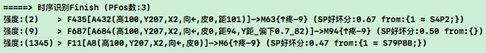 |
| 分析 | 如图,按照纯稳定性排序,F11(S79P88)的稳定性小于F678(S0P0); |
| 方案 | 加衰减功能,S+P越小衰减越快,反之越慢,像F687衰减快,F11则会慢许多; |
| 结果 | 写了衰减功能(根据时序新旧衰减而不是时间) & 并调整窄出配置为10 `T`; |

| 26105 | 思维流程跑通率太低问题2: 解决方案部分 |
| --- | --- |
| 简介 | FZ51-第2步训练过程中自主飞行次数极少; |
| 问题1 | S与pFo没抽具象关系: pFo与S候选集之间的抽具象关联哪里来? |
| > 答: | protoFo[飞,棒],识别到抽象pFo[棒],然后在外类比就有关联了; |
| 问题2 | 识别到很具象的pFo,取它的conPorts取不到Solution候选集; |
| > 答: | 取S时,是从所有pFos下取的,具象的取不到,就会先从抽象的取; |
| 问题3 | 可是最有效的S需要从具象pFo下取,因为具象pFo才最符合当前情况; |
| 答: | 抽象取S后,会更新所有pFos的effectDic,下回就可以从具象pFo取了 |
| 旧架构 | 以前的做法是: 具象A向着具象B加工修正; |
| 旧原则 | 生成任务的:`抽象指导性`,解决方案的: `具象稳定性`; |
| 新架构 | 现在的实际是: 执行的是S而不是直接执行具象,而识别来的也有许多具象; |
| 新原则 | 以SP为标准做初始候选集,再以`有效率`做此后的竞争; |
| 差异性 | 新架构与抽具象关系无关 (完全不需要A向B加工了); |
| 步骤1 | 那些价值综评排在最后的pFo,从具象看看它们什么情况下是安全的; |
|  | > 那么这些安全的情况,可以做为第一批Solution候选集; |
|  | > 即: 从SP价值分更好的pFo.conPorts取得S候选集 |
|  | > 结果: 从所有的pFos下尝试取S候选集,`现在本来就是这样的`; |
| 步骤2 | 然后,再对这些S候选集,进行`有效率`竞争; |
|  | > 即: TCSolution窄出排序因子,`现在代码就是这样`; |
| 综合 | spScore取初始S & 后期effect竞争 `现在代码就是这样`; |
| 方案 | 在26103&26104修复后,此BUG有可能已经变化或不复现,先重训下; |
| TODO | 重跑下FZ51训练,然后调试下第2步代码,为什么不自主飞躲; |
| 结果 | 本节中,无论是概念识别,时序识别,还是解决方案部分都是片面的; |
| 转移 | 应该站在更加整体的角度下,来看待TC跑通率低的问题 `转n26p11`; |

| 26106 | 回测TODO |
| --- | --- |
| TODO1 | 查下,effectDic是否正常工作; |
| TODO2 | rSolution()是否能够复用"有效率"更高的解决方案; |

***

## n26p11 TC数据流4-整体观
`CreateTime 2022.05.25`

上节在解决`TC跑通率低问题`的过程中,发现从单个模块角度,改来改去,其实都是片面的,本节站在更加整体观的角度去审视这一问题,并解决跑通率低的问题;

| 26111 | 优劣分析 | 抽象 | 具象 |
| --- | --- | --- | --- |
| 1 | 特性 | 照顾广度 | 照顾准度 |
| 2 | 缺点 | 丢细节,常不稳 (S83P84) | 成长性差,偶发性强 (S1P0) |
| 3 | 优点 | 稳定性和有效率的质变手段 | 准确识别预测生成任务 |

| 26112 | 尝试整体观-偏模型分析 |
| --- | --- |
| 具象部分 | 从conPFo中培养稳定的 (吃面前的苹果能饱); |
| 中间部分 | 看能否从absPFo中找到稳定的? |
| 1. | 稳定性低: 从具象找S候选集 (打人未必哭); |
|  | > 例如: 无法抽象的,多变的,像英语多练多读; |
| 2. | 稳定性高: 从抽象找S候选集 (吃饭肯定饱); |
|  | > 例如: 容易抽象的,稳定性,像数学懂了就行; |
| 抽象部分 | 无论absPFos能不能找着稳定的,`有效率`都以它为主计算; |

* **26113-尝试整体观-偏工程分析**
> 分析: 结合二者的优点,各负责各的优势,中间部分依情况判断该谁负责;
1. 具象部分: 即从具象做识别预测生成任务;
   - 即用具象部分的spDic做为准确性具体性负责;
2. 中间部分: 即absPFos部分;
   - 该谁负责判断: 判断absPFos的稳定性;
     - 稳定性高: 则交由absPFos的effectDic中取S解决方案的候选集;
     - 稳定性低: 则交由conPFos的effectDic中取S解决方案的候选集;
3. 抽象部分: 然后抽象负责质变升华指导;
   - 即以absPFos的effectDic中取`effectScore有效率值`;

| 26114 | 整体观-代码规划 |
| --- | --- |
| 1 | 识别具象: 识别时以识别具象为主; |
| 2 | absPFos的来源: 将识别后的外类比结果,收集成absPFos; |
| 3 | 可考虑将 (base`稳定性` x sub`有效率`) 作为S排序因子; |

| 26115 | absPFo稳定性低时,从conPFo一般也取不到好的解决方案 |
| --- | --- |
| 比如 | 有一个位置附近都没有向下躲开过,抽象无Y距时序又不稳定; |
|  | 而又有多次`偏路下`向下躲开过的经历 (注:没有路偏下的抽象时序); |
| 问题 | 此时,抽象不稳定,具象又没S候选集,那么就无解了? |
| 方案1 | 除非`有效率`,可以直接影响到时序识别,这样pFo就绝对有S候选集; |
|  | 这个肯定性能不行,首先会要求概念识别的结果巨量收窄不了 `弃掉`; |
| 方案2 | 从absPFo.conFos取同级具象fos,与conPFo做相近与匹配度判断; |
|  | 此方案有趣些,可采纳尝试深入分析 `转n26p12`; |

***

## n26p12 TC数据流4-迭代TCSolution思考过程
`CreateTime 2022.05.25`

在上节中,取S候选集的算法始终没有解决好,但提出一个好的方案,即对认知期录取的结果,再进行出题考试 `参考26115-方案2`,本节针对这一方案深入分析迭代下TCSolution算法;

| 25121 | 初步分析 |
| --- | --- |
| 简介 | 此方案相当于逆向思维,回想以前怎么解决过这问题 |
| 说明 | 可以按照以下流程逆向思考来逐级过滤; |
| 逆向 | `稳定性`->`全含判断`->`匹配度`->`相近度`; |
| 示图 | 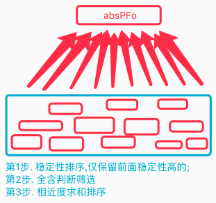 |
| 分析 | 如果是逆向思考的话,那么`全含和匹配度`就不能以原来的mIsC来判断; |
|  | 而是需要新写算法,比如仅需要判断稀疏码同区即可; |

     
