# 乌鸦挑战-整体训练

> 注:
> 1. 在n25中，做了相近匹配,强化学习训练器,并且整理了TC数据流,本文在此基础上回归训练,并做乌鸦挑战的整体训练;

***

<!-- TOC -->

- [乌鸦挑战-整体训练](#乌鸦挑战-整体训练)
  - [n26p01 十七测-回测飞错方向的问题](#n26p01-十七测-回测飞错方向的问题)
  - [n26p02 相近匹配pFo: 微观新增mv指向标记,优化识别](#n26p02-相近匹配pfo-微观新增mv指向标记优化识别)
  - [n26p03 加强强化训练-优化卡顿问题](#n26p03-加强强化训练-优化卡顿问题)
  - [n26p04 迭代DemandModel-单任务对应多pFo](#n26p04-迭代demandmodel-单任务对应多pfo)
  - [n26p05 废弃ARSTime评价器](#n26p05-废弃arstime评价器)
  - [n26p06 十八测](#n26p06-十八测)
  - [n26p07 TC数据流2-逐层宽入窄出](#n26p07-tc数据流2-逐层宽入窄出)
  - [n26p08 十八测2](#n26p08-十八测2)
  - [n26p09 TC数据流3-S有效率](#n26p09-tc数据流3-s有效率)
  - [n26p10 十八测3](#n26p10-十八测3)
  - [n26p11 TC数据流4-整体观](#n26p11-tc数据流4-整体观)
  - [n26p12 TC数据流4-慢思考](#n26p12-tc数据流4-慢思考)
  - [n26p13 十八测4-FRSTime推迟帧 & 迭代ActYes每帧O反省](#n26p13-十八测4-frstime推迟帧--迭代actyes每帧o反省)
  - [n26p14 十八测5-快思考](#n26p14-十八测5-快思考)
  - [n26p15 废弃反思子任务和H任务](#n26p15-废弃反思子任务和h任务)
  - [n26p16 迭代hSolution快慢思考](#n26p16-迭代hsolution快慢思考)
  - [n26p17 思维可视化V3迭代](#n26p17-思维可视化v3迭代)
  - [n26p18 十八测6-回测快慢思考 & 连续飞躲](#n26p18-十八测6-回测快慢思考--连续飞躲)
  - [n26p19 十八测7-回测快慢思考 & 连续飞躲](#n26p19-十八测7-回测快慢思考--连续飞躲)
  - [n26p20 识别性能优化-连续时序链](#n26p20-识别性能优化-连续时序链)
  - [n26p21 预测验证](#n26p21-预测验证)
  - [n26p22 决策期概率竞争-S综合排名](#n26p22-决策期概率竞争-s综合排名)

<!-- /TOC -->


## n26p01 十七测-回测飞错方向的问题
`CreateTime 2022.05.04`

上节修复了躲错方向的问题,本节用强化学习继续训练,并回测此问题;

| 26011 | 回测-FZ42训练步骤 | 备注 |
| --- | --- | --- |
| 1 | 随机飞,扔木棒,循环5次 x 10轮 | 每轮重启 |

| 26012 | 强化训练中,前一步没完成,下一步就跑了 |
| --- | --- |
| 方案 | 加上训练单步`完成判断`,只有完成时,才能开始训练下一步; |
| 结果 | 加上invoked()方法,用来标记当前步骤训练结束 `T`; |

| 26013 | 训练FZ42 & 回测躲错方向问题 |
| --- | --- |
| 说明 | 按26011步骤,训练FZ42,并回测是否识别并正确应用'偏上,偏下'; |
| 方式 | 回测方式:`FZ42,飞下(如自行飞走,可拉回到偏下路边),直击`,看日志; |
| 准备 | 在回测躲错方向问题前,做些准备; |
|  | 1. 写代码判断偏上偏下的程度。 `T` |
|  | 2. 识别结果日志里，打出偏上偏下。 `T` |
|  | 3. 生成任务日志里，打出偏上偏下。 `T` |
|  | 4. 思维可视化的节点显示：显示偏上偏下。 `T` |
| 步骤 | 整理正确的执行步骤,如下: |
|  | `V相近`->`A相近识别`->`F相近识别pFos`->`R任务`->`S解决方案` |
| 一测 | 到第3步时,发现没有识别到相近的pFo,只有许多rFo,即虚概念识别不顺; |
|  | 问题: 没pFo结果,导致在偏路边,却没有偏路边的任务,但别谈解决方案; |
|  | 分析: 查TC数据流,看是否前面收太窄了,导致后面没pFo结果; |
| 方案1 | 查TC数据流,调试出不合理的配置,并调整; |
|  | 调试: 到TIR_Alg中,调试一下refPorts有pFo指向的; |
|  | 经查: 并不是配置不合理,本来pFo的指向就很分散,见下示图及说明 `废弃`; |
| 示图 |  |
| 说明 | 如图,pFo是存在的,只是太过分散,因为refPorts是强度有序,不是mv有序; |
| 方案2 | 加上mv有序; |
|  | 分析: cpu性能其实还好,这里不需要加序列这种空间换时间,此方案 `废弃`; |
| 方案3 | 给refPorts加上mv指向标记; |
|  | 分析: 此方案即标记了mv指向,又没加序列,是折中适合当前的方案 `采用`; |
| 结果 | 在一测测到问题,选定方案3,代码执行转`26021`; |

| 26014 | 工具优化 |
| --- | --- |
| 一 | 可视化工具优化 |
| 1 | 思维可视化支持手势缩放 `T` |
| 2 | 思维可视化支持状态显示 `T` |
| 3 | 网络可视化更方便追加节点 `T` |
| 二 | 更长的强化训练支持 (为了训练更长时间,需要支持模拟重启和复位) |
| 4 | 强化训练器支持模拟重启 `T` |
| 5 | 强化训练器支持退回MainPage `T` |

***

## n26p02 相近匹配pFo: 微观新增mv指向标记,优化识别
`CreateTime 2022.05.11`

说明: 在上节中,测试`偏上偏下`流程(参考26013-步骤),结果发现了相近很难最终匹配到pFo的问题,数个模块间,都是一对多关系,如果单纯的过滤出pFo,非常耗性能,所以需要提前在微观中标记下是否宏观有mv指向,以此来优化识别时的性能 (参考26013-方案3);

| 26021 | refPorts新增mv指向标记-代码规划 |
| --- | --- |
| 分析 | V.refPorts需要对每个port做标记,如`A1Port有`,`A2Port无` |
|  | A.refPorts需要对每个port做标记,如`F1Port有`,`F2Port无`,`F3Port有` |
| 结果 | 只要宏观一级有一条有mv,则微观一级的port标为有; |

| 26022 | refPorts新增mv指向标记-代码实践 |
| --- | --- |
| 1 | AIPort加一个标记字段 `T`; |
| 2 | 在有mv输入时,回溯它的content_ps,然后更新标记 `T`; |
| 3 | 在识别算法中,直接判断标记,以此优化性能 `T`; |
| 4 | 根据`26011`训练FZ43 `T`; |
| 5 | 并在FZ43上回测`虚概念识别`与`飞错方向`问题 `转FZ44去测`; |

| 26023 | FZ43的refPorts有重复的问题 `T` |
| --- | --- |
| 说明 | 26022-2更新mv标记后,将db+mem的全存到db中了,导致ref有重复; |
| 结果 | 将取AINetUtils.refPorts()中做防重处理; |

| 26024 | 弃用partAlgs `T` |
| --- | --- |
| 说明 | partAlgs的作用是还没全含时过渡用的,但有了相近匹配后,不用它过渡了; |
| 结果 | 现在partAlgs除了可能识别片面且错误,啥用没有,先弃用掉; |

| 26025 | 重训FZ44 & FZ45 |
| --- | --- |
| FZ44 | 在改了26023和26024后,按照26011步骤重训FZ44; |
|  | 待查1: FZ44的S数全是0,P数正常 `在26026-BUG2修复后好了`; |
|  | 回测: `偏上偏下飞错方向`问题,发现FZ44的偏上偏下被击中经验不足; |
|  | 所以,重新训练FZ45,尽量让它在'偏上偏下'位置上多几条被击中经验,如下: |
| FZ45 | 在`危险地带各向飞后直击`,和`安全地带各向飞后偏击`,得到FZ45; |

| 26026 | 多线竞争不合理问题-SP评分不合理 |
| --- | --- |
| 问题 | 在rSolution取得方案不合理,经分析因SP评分问题,导致方案竞争不合理; |
| 示图 |  |
| 复现 | FZ45,直击,然后看日志即可; |
| 说明 | SP评分有许多不合理之处; |
| BUG1 | SP全不为0,SP评分应该是一个0-1之间的率,但却是1.0分; |
|  | 解决: 打印错了,把0.95以上的全打印成1.0了 `T`; |
| BUG2 | SP都是0(白户),却评1.0分,比老道解决方案评分还高; |
|  | 解决: 当SP全为0时,相当于S与P一致,即评分为0.5 (暂定) `T`; |
| 结果 | BUG2已修复,用26011步骤重训FZ46 (S全为0的问题已消失); |

| 26027 | 乱飞好久才停 |
| --- | --- |
| 复现 | FZ45,直击,发现各种方向飞,然后近8k行日志才停下; |
| 分析 | 婴儿期,不断预测任务,并执行各种方案,导致乱动是正常现象; |
| 结果 | 在这些乱动中,随着SP反馈工作,SP稳定下来,自然就好了,`转26029`; |

| 26028 | 回测偏上偏下流程: 偏上偏下无法识别到pFo结果的BUG |
| --- | --- |
| 复现 | FZ45,直击=>可以看到如下图,识别不到`偏上偏下`的pFo结果; |
| 示图 |  |
| 分析 | 偏上偏下都非常具象,一般都是类似`[↖,棒]`这样的时序; |
| 线索 | 而直击后的时序:`[木棒]`,与带`飞方向前辍的时序`,无法全含匹配; |
| 方案1 | 追加训练能否习得在不飞时,又在`偏上偏下`位置被撞到的经验`转方案2`; |
|  | 追加训练也不会无方向前辍,因为初始位置正中不飞就不可能`偏上偏下`; |
| 方案2 | 加上`改变小鸟初始位置`的功能 `T`; |
|  | 采纳,改后,不用再担心匹配不到`偏上偏下`的pFo; |
| 方案3 | 先飞下再直击,使之可以识别到`偏上偏下`的pFo `不用改立马见效`; |
|  | 分析: 此方案自欺欺人,所以还是采纳方案2; |
| 结果 | 选定方案2改了,重训(随便直接直击几下),即可测试到识别pFo成功; |
| 新问题 | 方案3可见效:`FZ46,↖飞,拉回偏上位置,直击`,但测得新问题如下图: |
|  |  |
|  | 虽然有效,但找不到解决方案,需要多多训练:`转26029`; |

| 26029 | 加长版强化加训 |
| --- | --- |
| 问题 | 参考26027-乱动不停 & 26028-无计可施,所以此表做大量强化训练 |
| 准备 | 准备工作: 写noLog模式,在训练中,不打印HeLog,NSLog,TVFrame `T`; |
| 训练 | noLog模式一样卡,查下日志看卡的时候,到底在跑什么要这么久; |
| 结果 | 这里应该和26027的卡顿是同一问题,建议先优化卡顿,`转26033`; |

| 2602a | 鸟在偏下位置,明明撞到,却显示未撞到 `T` |
| --- | --- |
| 结果 | 经调试,发现minXY和maxXY计算有错; |

***

## n26p03 加强强化训练-优化卡顿问题
`CreateTime 2022.05.17`

参考26029,本文优化下训练效率(卡顿问题),并且重新规划下强化训练步骤;

| 26031 | 训练步骤规划 | 目标 |
| --- | --- | --- |
| 1 | `随机出生位置,扔木棒,重启` x 50轮 | 可识别到`偏上下`pFo |
| 2 | `飞或直击x5,重启` x 50轮 | 学会正确方向躲 |

| 26032 | 先按照26031步骤训练FZ47,复现卡顿问题 |
| --- | --- |
| 训1 | **根据26031训练至第2步,第20来轮有些卡,35轮左右时非常卡;** |
|  | 记忆: 保存`FZ4702_非常卡版`,当`FZ4702,直击`时,可复现卡好久; |
|  | 回测: 但`彻底卡死`即使复现了,也没法改问题,因为一直卡着 (半小时以上); |
| 训2 | **重新训练第2步,只训练20轮,然后保存`FZ4702_20轮版`;** |
|  | 回测: 当`FZ4702,直击`时,可复现卡5分钟左右,如下图; |
|  | 示图:  |
|  | 原因1: 如图,非常多的root,然后还很具象 (主要责任); |
|  | 原因2: 如图,每颗树都非常茂盛 (次责近于无责); |
|  | 方案: 卡的原因主要是root多,建议pFo识别后仅第1条转为root任务; |
| 结果 | 制定方案成功,代码改动与回测,转26034; |

| 26033 | 强化训练过程中卡顿问题V2 `参考26027` |
| --- | --- |
| 说明 | 26027想躲过性能优化不易,因为在26029加长强训时,性能卡跑太慢; |
| 方案1 | 婴儿阶段学走路本来就难且需要时间,强训太慢忍会就好; |
|  | 分析: 问题是现在不想忍,所以此方案 `废弃`; |
| 方案2 | 看看root数是否能控制下 (不断循环中,可能不断有新的root); |
|  | 分析: 可以先调试下root到底有多少,是否需限制 (测训参考26032-训2); |
| 方案3 | 看是否把energy功能再打开 (现在采用的是energy无限,限制层数); |
|  | 思路1: 每个Demand,针对它的子S个数,要不同对待; |
|  | 思路2: 串联水管要以最细的为准,逐级父级中有一个energy不足即停取S; |
|  | 暂停: 经26032测2所示,本方案无责,以后有需求再做 `暂停`; |
| 结果 | 经26032测2中训练调试,方案2负主要责任,代码实践 `转26034`; |

| 26034 | 卡顿优化-限制root生成数 (参考26032训2方案) |
| --- | --- |
| 方案 | 识别pFos后,仅相近度(价值评分)最高的且同AT的pFo转为R任务; |
| 结果 | 加了价值评分排序 & 同区AT防重,经重测卡顿问题已解决; |

***

## n26p04 迭代DemandModel-单任务对应多pFo
`CreateTime 2022.05.18`

在26034中,取首条pFo生成任务,但这样就导致生成任务的pFo太过单一,也太过抽象,错过许多细节等问题,本节主要针对此问题展开解决,并迭代任务demandModel模型;

| 26041 | 首条pFo生成任务不妥 |
| --- | --- |
| 问题 | 直接取首条显然不合适,因为指导性最高的,容易排前面,会导致片面; |
| 示图 |  |
| 说明 | 如图,最后生成任务的只有F12,太抽象了,而F26这些带Y距的压根没机会; |
| 分析 | 此时正在I与O间的过渡,如果只取一个很难取到合理的solution; |
| 原则 | I与O过渡,正处在指导性与稳定性的`交接处`,应该`广握手,窄纳用`; |
| 方案1 | 将相近度计入pFos排序因子中 (如图中F12缺Y距匹配度应该<1); |
|  | 分析: 相近度影响到fo的匹配度确实看似有效,但缺点有二: |
|  | 缺点1: 微观相近度不应延伸到太宏观的fo上,微观太具体可变不可控性高; |
|  | 缺点2: 这并不能解决根本问题,未实现`广握手,窄纳用`; |
| 方案2 | 将一组同标识pFos共同构建一个demand `95%选用`; |
|  | 分析: 此方案即照顾了所有pFos,也照顾到solution竞争,与性能等; |
| 结果 | 选择方案2,代码实践 `转26042`; |

| 26042 | 多pFos构建单个任务-代码实践 (参考26035-方案2); |
| --- | --- |
| TODO1 | 对识别pFos按照AT分组,每组生成一个demandModel `T`; |
| TODO2 | 迭代DemandModel改为: 空壳demand + 下辖pFos `T`; |
| TODO3 | 将TCSolution()改成多个pFos下的解决方案进行竞争 `T`; |
| TODO4 | DemandModel的评分共享下辖pFos中的最高分 `T`; |
| TODO5 | solution解决方案共享,共用三条limit `T`; |
| TODO6 | 在arsTime取deltaTime时,取pFos中maxDeltaTime为准 `转26051`; |
| TODO7 | solution成果共享,即demand的状态共享 `不用改代码,T`; |

***

## n26p05 废弃ARSTime评价器
`CreateTime 2022.05.19`

在26042-TODO6中,ARSTime评价器`下标不急(弄巧成拙)`需要对当前解决方案solutionFo和任务源pFo之间做下标判断,而现在改成了多个pFo,这判断改着麻烦,所以想着要不直接把这个评价器废弃了吧,本文针对此问题做分析思考;

| 26051 | 废弃原因 |
| --- | --- |
| 说明 | ARSTime本就是旧架构下补丁式刻意设计的产物,在新螺旋架构下显无用; |
| 示例 | pFo下可能有各种各样的solutionFo,比如任务:[有老虎危险]; |
|  | 两个解决方案如: S1找到老虎打屎它, S2遇到老虎时打屎它; |
| 推陈 | 按现在下标不急评价器,会不允许找老虎,S1会强行中断而失败; |
|  | 即: `下标不急`评价器有逻辑漏洞,无法照顾所有情况 (比如S1无法执行); |
| 出新 | 那么`找老虎`和`遇老虎`的本质区别是什么? |
|  | 1. 老虎H任务是否有hSolution解决方案的区别; |
|  | 2. 找老虎会反思出新的子任务的区别; |
|  | 即: `下标不急`所体现的功能,可交由螺旋思维来接管; |
| 结果 | 根据以上推陈出新的两个观点,下标不急可废弃,由螺旋思维接代之; |

| 26052 | 实践分析 |
| --- | --- |
| TODO | 先注掉ARSTime代码不删,等回测彻底无用时,再彻底删除 `T`; |

***

## n26p06 十八测
`CreateTime 2022.05.19`

把上面几节中的改动,全回测下,包括:
* 回测Demand多pFos模型
* 偏上下飞错方向问题
* 加长强化训练
* 废弃ARSTime评价器回测

| 26061 | 训练步骤规划 | 目标 |
| --- | --- | --- |
| 1 | `随机出生位置,扔木棒,重启` x 50轮 | 可识别到`偏上下`pFo |
| 2 | `飞或直击x5,重启` x 20轮 | 学会正确方向躲 |

| 26062 | 参考26061步骤重训FZ48-测得生成root循环卡顿问题 |
| --- | --- |
| 重训 | 第1步正常,但第2步到中途时非常卡; |
| 复现 | `4802,直击`可以复现非常卡的情况; |
| 示图 |  |
| 说明 | 如图所示,root太多,建议由此展开分析; |
| 分析 | 应该是root1解决过程中,又识别到类似的root2,以此类推... |
| 示例 | 就像一直玩停不下来的小游戏,怎么才能停下来? |
| 思路1 | root1的pFos和root2的pFos之间,是否应该做个防重抵消什么的? |
|  | 分析: 即root2的起因是为了解决root1,那么root之间是否应该做防重? |
|  | 结果: root1和root2应该各自独立工作,不冲突,也不用防重 `否掉`; |
| 思路2 | 分析下怎么打破这种循环,比如飞到屏边缘是否pFos应该预测没啥危险了; |
|  | **方案1: 对比root法: 当飞屏边时应预测到危险,应小于,屏中的危险度;** |
|  | 分析: 否掉,root1与root2应各自工作,不对比,只竞争; |
|  | **方案2: 识别准确法: 飞屏边缘预测到没啥危险 `采用`;** |
|  | 调试1: 路中时: 预测到`偏上,偏下`等多个pFo; |
|  | 调试2: 屏边时: 预测到`偏下`多个pFo; |
|  | 分析: 识别不准,屏边时,没有无危险的结果,却有一堆偏下的危险pFo; |
|  | 问题: 识别不准的问题,需要提高识别准确性; |
|  | 解决: 识别准确性提升的方法为: 从微到宏,逐层宽入窄出 `转n26p07`; |
| 思路3 | firstPFo太片面,容易被不准的pFo影响,就会排前面决策继续循环; |
|  | 分析: 使用firstPFo评分,是偏感性不理性的做法; |
|  | 解决: 把demand评分改成综合计算,而不是firstPFo `采用,转n26p07`; |

| 26063 | rSolution应过滤掉负价值方案 `T` |
| --- | --- |
| 示图 |  |
| 说明 | 负价值方案,首先是指向负,其次才是SP稳定性,即使再不稳定,那也是负; |
| 分析 | 一开始目标为负,再不稳定也不应该推进,所以最好一开始就过滤掉它们; |
| 重训 | 加了过滤后,依26061步骤重训FZ49,在第2步第1轮就复测出了卡顿问题; |
| 结果 | 已加过滤,`FZ4902,直击`可复现卡顿问题,回去`继续改26062`; |

***

## n26p07 TC数据流2-逐层宽入窄出
`CreateTime 2022.05.20`

回顾: 在n25p23中,针对TC数据流,做了`整体兼顾&各线竞争`,本节则针对`逐层宽入窄出`再做调整整理;

简介: 参考26062的问题,以及思路2和思路3,本文主要对TC的数据流继续进行调整,使微到宏逐层宽入窄出,然后将窄出的成果更理性的用起来 (原来firstPFo评分方式太感性片面);

* 本节目标: 能够使识别到最后生成任务时,更准确判断rootDemand的综合评分;
* 附带目标: 因为新的root未必抢占主线任务,所以可以防止多root循环跑卡顿;
* 附带目标: 识别准确度提升;

| 26071 | 逐层宽入窄出-模型图 |
| --- | --- |
| 示图 |  |
| 说明 | 如图所示,逐层limit宽入,匹配度窄出,即可; |
| 原则 | 强度负责广入,匹配度负责窄出; |
| 排序 | 每个模块排序依据不同: |
|  | `V相近度`,`A匹配度`,`F稳定性`,`D价值分`,`S有效率`; |

| 26072 | 逐层宽入窄出-问题分析 |
| --- | --- |
| 问题1 | 该放宽时却收窄 (比如概念识别只有有mv指向的部分); |
| 问题2 | 该收窄时未收窄 (比如pFos多达二十条); |

| 26073 | 逐层宽入窄出-代码实践 |
| --- | --- |
| TODO1 | 在V识别,仅取相近的前10条 `T`; |
| TODO2 | 在A识别,取匹配度窄出前5条 `T`; |
| TODO3 | 把A识别的匹配度公式改下: (匹配度=相近度总和/proto长度) `T`; |
| TODO4 | A识别改匹配公式后没全含了,废弃partAlgs,结果全放matchAlgs中 `T` |
| TODO5 | 在A识别,为了识别准确性,废弃仅识别有mv指向的 `T`; |
| TODO6 | 在F识别,仅取相近的前5条 `T`; |
| TODO7 | 在F识别,为了识别准确性,废弃仅识别有mv指向的 `T`; |
| TODO8 | 在F识别,排序方式以SP稳定性为准 `T`; |
| TODO9 | 在F识别,RFos排序不受`被引用强度`影响 `参考26071原则 T`; |
| TODO10 | fos4Demand()分组方式要将RFos结果也加入其中 `与RFo无关不用加`; |
| TODO11 | fos4Demand()排序方式,改成以价值综评分为准 `T`; |
| TODO12 | rootDemands竞争,由firstPFos改为综合评分 `T`; |
| TODO13 | solution窄出排序改为: 效用分 = 方案稳定性 x pFo价值分 `T`; |
| TODO14 | solution窄出条数取前3条 `本就如此 T`; |

| 26074 | 时序识别结果的排序方式 |
| --- | --- |
| 方案1 | 元素的匹配度 (到这里其实微观上的匹配度没那么重要,此方案`否掉`) |
| 方案2 | SP稳定性 (此方案较适合当前的情况 `采用`); |
| 方案3 | 价值综合评分 (这里还是识别期,最重要的是识别准确度,此方案`否掉`); |
| 结果 | 方案1太晚,方案1太早,只有方案2正合适 `采用,实践转26073-TODO8`; |

| 26075 | 边写代码实践边测试: 测得V不能太窄出的问题 |
| --- | --- |
| 问题 | V不能太窄出,一开始就过窄,会导致视觉7个码的refPorts都没交集了; |
| 分析 | 7个只有6个有交集,导致概念识别的相近度低且片面`因为有一个码没判断`; |
| 方案 | 将V的限制10,改成1000,问题解决; |
| 结果 | 改了后,概念识别相近度从大都是0.8以下,全成了0.95以上,问题解决 `T`; |

| 26076 | 分析demandModel的评分方式 `实践转26073-TODO12` |
| --- | --- |
| 说明 | demandModel改为多个pFos后,以firstPFo为准片面,需要改下; |
| 分析 | 五马分尸与一马不一样,千蚁啃咬与一只也不一样; |
| 方案 | 对demand.pFos价值评分求和,作为demand综合评分; |

| 26077 | 分析solution()窄出方式 `实践转26073-TODO13` |
| --- | --- |
| 说明 | 任务下有些pFo不太可能发生,有些保准发生; |
| 问题 | 原先仅对solution候选方案进行稳定性排序,显得不准确不公平; |
| 方案 | 候选方案评分改为: `效用分 = 候选方案稳定性 x 所在pFo价值评分`; |
| 追加 | 上述方案,导致全成了`无计可施`,改回到用单纯`稳定性`竞争 `T`; |

***

## n26p08 十八测2
`CreateTime 2022.05.21`

说明: 在上节理顺了宽入窄出后,本节回测上节的改动;

| 26081 | 训练步骤规划 | 目标 |
| --- | --- | --- |
| 1 | 随机出生位置: `扔木棒,重启` x 200轮 | 识别`偏上下`pFo |
| 2 | 随机偏中出生位置: `木,随机飞x3,木,重启` x 100轮 | 学飞躲 |

| 26082 | 按照26081的步骤-回测以下三项 |
| --- | --- |
| 测项1 | 识别准度提升: `偏上偏下`认知部分测试; |
|  | 结果: 在训练到1步后,测试通过; |
| 测项2 | 重训下看root循环卡顿的问题是否还有; |
|  | 结果: 没了,暂未复现,应该已经解决; |
| 测项3 | `偏上偏下`正确躲避方向,决策部分测试,决策过程并不顺利,分析如下; |
|  | 方案1: 需要规划新的训练步骤等 `转26083`; |
|  | 方案2: 查不顺利的原因 `转26084`; |

| 26083 | 训练步骤分析调整 `无用,转26084` |
| --- | --- |
| 方案1 | `边直击边飞` x 5格 (上,下,左上,左下,右上,右下)6向各一次); |
|  | 目标1: 习得[危险地,上飞,安全地]的经验; |
|  | 目标2: 并能够在Solution()中,准确的取得这条经验 `取不到,失败`; |
| 方案2 | `直击,飞,飞,飞,直击` x 训练100轮; |
| 结果 | 方案12都试了下没啥用,全是无计可施 `转26084`; |

| 26084 | TCSolution窄出过严的问题 `T` |
| --- | --- |
| 示图 |  |
| 说明 | 如图,几乎全是`无计可施`,过严了,查下原因; |
| 原则 | 上一步的窄出就是下一步的宽入,如果上步卡死,那么后续决策就全没了; |
| 所以 | 只有拿出S尝试用,并且让后续决策,行为化,SP反馈等活跃的工作起来; |
| 思路1 | 或者画模型,把决策期的TC数据流整理下 `否掉`; |
|  | 结果: 就是solution()的问题,与后面决策流程无关,所以没必要画模型了; |
| 思路2 | 查下pFo下面是不是缺具象连接,导致没解决方案; |
|  | 调试: 网络可视化了几个pFo,确实没啥具象; |
|  | 分析: `无计可施`的原因就两种可能; |
| 原因1 | pFo没有具象关联 (原先FZ49代码分支时是有抽具象连接的); |
| 原因2 | TCSolution窄出太严 (先试下改这条,因为原因1最近没改啥相关代码); |
| 方案 | 将排序改回由`稳定性`排序 (参考26077-追加) `T`; |
| 回测 | 依26081步骤训练FZ50; |
| 结果 | pFo有了具象关联,TCSolution也有了解决方案S,但S没用好 `转n26p09`; |

***

## n26p09 TC数据流3-S有效率
`CreateTime 2022.05.21`

上节中,回测VAFD流程都ok,但S流程,出现过窄问题,后来修复后,有效的解决方案S也没有被有效用起来,导致决策过程不顺利,本节主要针对此问题进行解决;

| 26091 | 有效S未被用起来-问题说明 |
| --- | --- |
| 示图 |  |
| 说明 | F1037是有效解决方案(首帧就有效,后面无关紧要),但却没被有效用起来; |
| 问题1 | 因为第3帧没发生,F1037连续三次反馈了S; |
| 问题2 | 连续3次S,导致TCSolution中它稳定性评分为0,永不录用; |

| 26092 | 有效S未被用起来-本节目标 |
| --- | --- |
| 解决 | 要制定方案间自由竞争的调整 (每个S都有机会成长起来); |
| 线索 | `有效率`和`稳定性`还是有区别的 `对比转26093`; |

| 26093 | 对比项 | 稳定性 | 有效率 |
| --- | --- | --- | --- |
| 1 | 触发 | forecast和actYes | demand和`未知,可能是tcOut吧` |
| 2 | 说明 | `此后发生每帧`稳定率 | `当前帧解决任务`有效率 |
| 3 | 功能 | 判断目标帧`未来是否发生` | 判断当前帧`即刻能否见效` |
| 4 | 代码 | TCRethink | TCEffect |

| 26094 | 有效率-模型分析 |
| --- | --- |
| 模型 |  |
| 说明 | 图示,IRT和ORT部分是本来有的,此次主要涉及DemandEffect; |
| 疑问 | 但OutEffect还定不了,不过现在的行为偏简单都能成功,先不做; |
| 数据 |  |

| 26095 | 有效率-代码规划 |
| --- | --- |
| 1 | R解决方案倒计时触发器,判断是否发生负价值,得出有效性 `T`; |
| 2 | R解决方案给所有任务源pFos有效或无效计分到effectDic `T`; |
| 3 | R任务在feedbackTOP中,做effectStatus反馈状态更新 `T`; |
| 4 | H解决方案倒计时触发器,判断是否得到H目标,得出有效性 `T`; |
| 5 | H解决方案有效或无效计分到effectDic `T`; |
| 6 | H任务在feedbackTOR中,做effectStatus反馈状态更新 `T`; |
| 7 | 任务源fo中加effectDic,并写effectStrong模型 `T`; |
| 8 | 写effectScore()有效率计算方法 `T`; |
| 9 | TCSolution中以有效率排序 `T`; |

| 26096 | 改完26095后,按照26081步骤训练回测 |
| --- | --- |
| 简介 | 本表与本节问题关系不大,下面3个bug全是与飞方向有关的识别相关 |
| 复现 | 以下4个bug全是在训练第2步中卡顿中止后测得的; |
| BUG1 | **稳定性是0,但却被时序识别排在前面,从而识别到 `T`;** |
| 调试 | `[上飞,木棒]->{疼}`,木棒的S200P0,所以稳定性是0; |
| 原因 | 稳定性是0,但时序窄出排序用的是`SP好坏分`,它是从0坏到1好的值; |
| 修复 | 将时序排序改成`稳定性`排序 `T`; |
| BUG2 | **训练第2步中途,roots循环卡顿问题 `自然解决了,不复现`** |
| 调试 |  |
| 结果 | 修复BUG1,3,5,6后,重训26081步骤未复现; |
| BUG3 | **飞方向概念识别不准,如下图,上飞识别到除下三向之外的5个方向 `T`;** |
| 示图 |  |
| 方案1 | 改下稀疏码相近序列的窄出条数 (最多10%条,最少1条) `弃掉`; |
|  | 结果: 10%条,会导致交集没结果的新问题 (参考26075); |
| 方案2 | 将概念识别匹配度85%以下的过滤掉,此方案ok采用 `T`; |
| BUG4 | **时序识别有稳定性奇低(有0.03甚至0.01)的结果 `T`** |
| 示图 |  |
| 修复 | 将稳定性<0.4的识别结果过滤掉 `T`; |
| BUG5 | **测得getIndex_ps()得到的索引序列并不是相近度有序的 `T`;** |
| 修复 | 独立封装`稀疏码识别`方法,将相近度排序含其内 `T`; |
| BUG6 | **反思时时序识别的`全含判断`总失败 `T`** |
| 分析 | 4月30号优化`时序识别`时,将mIsC改成瞬时记忆的match+partAlgs来做; |
| 修复 | 但反思时当前时序和瞬时记忆无关,所以反思时改回旧方式判断mIsC `T`; |

***

## n26p10 十八测3
`CreateTime 2022.05.23`

| 26101 | 用26081步骤重训FZ51 |
| --- | --- |
| 说明 | 根据26081两步来重训FZ51,并测试`有效率`是否正常工作; |

| 26102 | effectDic计数BUG |
| --- | --- |
| 示图 |  |
| 说明 | 同样是PFo2253下的S2252,明明前面已经有了3和4,后面又变成了1和2; |
| 怀疑 | 可以调试下,看S2252是不是四个触发器,4个实例未复用effectDic导致; |

| 26103 | 思维流程跑通率太低问题1: 概念识别部分 `T` |
| --- | --- |
| 问题 | FZ51-第2步训练过程中自主飞行次数极少 |
| 分析 | 从认知到决策整个思维过程中,发现全程跑通的很少,导致行为输出就少; |
| 调试 |  |
| 线索 | 如上图,认知期没抽象(太具象),决策期就很散,没法将整个TC流程凝聚起来; |
| 原则 | 向性原则: 认知期向性右上(宏感与抽象),决策期向性左下(微理与具象); |
| 方案 | 放开认知期的抽象,再观察整个TC数据流程,该调整调整,但向性原则不变; |
| 代码 | 将概念识别的匹配度公式改回`(相近度和/特征匹配个数)` `T`; |
| 回测 | 修复后,概念识别有抽象结果了; |
| 追加 | 打开抽象后,又在安全地带也会预测到[absFo]->危险; |
| 转移 | 可见,无论是打开抽象,还是关闭抽象,都不能片面处理 `转n26p11`; |

| 26104 | 思维流程跑通率太低问题2: 时序识别部分 `T` |
| --- | --- |
| 问题 | 抽象结果排偏后问题,如图F11排在F687和F435的后面; |
| 示图 |  |
| 分析 | 如图,按照纯稳定性排序,F11(S79P88)的稳定性小于F678(S0P0); |
| 方案 | 加衰减功能,S+P越小衰减越快,反之越慢,像F687衰减快,F11则会慢许多; |
| 结果 | 写了衰减功能(根据时序新旧衰减而不是时间) & 并调整窄出配置为10 `T`; |

| 26105 | 思维流程跑通率太低问题2: 解决方案部分 |
| --- | --- |
| 简介 | FZ51-第2步训练过程中自主飞行次数极少; |
| 问题1 | S与pFo没抽具象关系: pFo与S候选集之间的抽具象关联哪里来? |
| > 答: | protoFo[飞,棒],识别到抽象pFo[棒],然后在外类比就有关联了; |
| 问题2 | 识别到很具象的pFo,取它的conPorts取不到Solution候选集; |
| > 答: | 取S时,是从所有pFos下取的,具象的取不到,就会先从抽象的取; |
| 问题3 | 可是最有效的S需要从具象pFo下取,因为具象pFo才最符合当前情况; |
| 答: | 抽象取S后,会更新所有pFos的effectDic,下回就可以从具象pFo取了 |
| 旧架构 | 以前的做法是: 具象A向着具象B加工修正; |
| 旧原则 | 生成任务的:`抽象指导性`,解决方案的: `具象稳定性`; |
| 新架构 | 现在的实际是: 执行的是S而不是直接执行具象,而识别来的也有许多具象; |
| 新原则 | 以SP为标准做初始候选集,再以`有效率`做此后的竞争; |
| 差异性 | 新架构与抽具象关系无关 (完全不需要A向B加工了); |
| 步骤1 | 那些价值综评排在最后的pFo,从具象看看它们什么情况下是安全的; |
|  | > 那么这些安全的情况,可以做为第一批Solution候选集; |
|  | > 即: 从SP价值分更好的pFo.conPorts取得S候选集 |
|  | > 结果: 从所有的pFos下尝试取S候选集,`现在本来就是这样的`; |
| 步骤2 | 然后,再对这些S候选集,进行`有效率`竞争; |
|  | > 即: TCSolution窄出排序因子,`现在代码就是这样`; |
| 综合 | spScore取初始S & 后期effect竞争 `现在代码就是这样`; |
| 方案 | 在26103&26104修复后,此BUG有可能已经变化或不复现,先重训下; |
| TODO | 重跑下FZ51训练,然后调试下第2步代码,为什么不自主飞躲; |
| 结果 | 本节中,无论是概念识别,时序识别,还是解决方案部分都是片面的; |
| 转移 | 应该站在更加整体的角度下,来看待TC跑通率低的问题 `转n26p11`; |

| 26106 | 回测TODO |
| --- | --- |
| TODO1 | 查下,effectDic是否正常工作; |
| TODO2 | rSolution()是否能够复用"有效率"更高的解决方案; |

***

## n26p11 TC数据流4-整体观
`CreateTime 2022.05.25`

上节在解决`TC跑通率低问题`的过程中,发现从单个模块角度,改来改去,其实都是片面的,本节站在更加整体观的角度去审视这一问题,并解决跑通率低的问题;

| 26111 | 优劣分析 | 抽象 | 具象 |
| --- | --- | --- | --- |
| 1 | 特性 | 照顾广度 | 照顾准度 |
| 2 | 缺点 | 丢细节,常不稳 (S83P84) | 成长性差,偶发性强 (S1P0) |
| 3 | 优点 | 稳定性和有效率的质变手段 | 准确识别预测生成任务 |

| 26112 | 尝试整体观-偏模型分析 |
| --- | --- |
| 具象部分 | 从conPFo中培养稳定的 (吃面前的苹果能饱); |
| 中间部分 | 看能否从absPFo中找到稳定的? |
| 1. | 稳定性低: 从具象找S候选集 (打人未必哭); |
|  | > 例如: 无法抽象的,多变的,像英语多练多读; |
| 2. | 稳定性高: 从抽象找S候选集 (吃饭肯定饱); |
|  | > 例如: 容易抽象的,稳定性,像数学懂了就行; |
| 抽象部分 | 无论absPFos能不能找着稳定的,`有效率`都以它为主计算; |

* **26113-尝试整体观-偏工程分析**
> 分析: 结合二者的优点,各负责各的优势,中间部分依情况判断该谁负责;
1. 具象部分: 即从具象做识别预测生成任务;
   - 即用具象部分的spDic做为准确性具体性负责;
2. 中间部分: 即absPFos部分;
   - 该谁负责判断: 判断absPFos的稳定性;
     - 稳定性高: 则交由absPFos的effectDic中取S解决方案的候选集;
     - 稳定性低: 则交由conPFos的effectDic中取S解决方案的候选集;
3. 抽象部分: 然后抽象负责质变升华指导;
   - 即以absPFos的effectDic中取`effectScore有效率值`;

| 26114 | 整体观-代码规划 |
| --- | --- |
| 1 | 识别具象: 识别时以识别具象为主 `T`; |
| 2 | absPFos的来源: 将识别后的外类比结果,收集成absPFos `不用收集`; |
|  | > 不需要收集,直接在TCSolution里取pFo.absPorts即可; |
| 3 | 可考虑将 (base`稳定性` x sub`有效率`) 作为S排序因子; |
|  | > 现问题是base的稳定性低,所以有效率再高也不够理性,比如会躲错方向; |
|  | > 所以先转n26p12迭代`TCSolution思考过程`,然后再考虑用这个做竞争; |

| 26115 | absPFo稳定性低时,从conPFo一般也取不到好的解决方案 |
| --- | --- |
| 比如 | 有一个位置附近都没有向下躲开过,抽象无Y距时序又不稳定; |
|  | 而又有多次`偏路下`向下躲开过的经历 (注:没有路偏下的抽象时序); |
| 问题 | 此时,抽象不稳定,具象又没S候选集,那么就无解了? |
| 方案1 | 除非`有效率`,可以直接影响到时序识别,这样pFo就绝对有S候选集; |
|  | 这个肯定性能不行,首先会要求概念识别的结果巨量收窄不了 `弃掉`; |
| 方案2 | 从absPFo.conFos取同级具象fos,与conPFo做相近与匹配度判断; |
|  | 此方案有趣些,可采纳尝试深入分析 `转n26p12`; |

***

## n26p12 TC数据流4-慢思考
`CreateTime 2022.05.25`

在上节中,取S候选集的算法始终没有解决好,但提出一个好的方案,即对认知期录取的结果,再进行出题考试 `参考26115-方案2`,本节针对这一方案深入分析迭代下TCSolution算法 (迭代S慢思考过程);

名词解释-慢思考: 即本文方案2中,时序场景对比找出解决方案的算法;

| 26121 | 方案1-初步分析 |
| --- | --- |
| 简介 | 此方案相当于逆向思维,回想以前怎么解决过这问题 |
| 说明 | 可以按照以下流程逆向思考来逐级过滤; |
| 逆向 | `有效率`->`稳定性`->`全含判断`->`匹配度`->`相近度`; |
| 示图 |  |
| 分析 | 如果是逆向思考的话,那么`全含和匹配度`就不能以原来的mIsC来判断; |
|  | 而是需要新写算法,比如仅需要判断稀疏码同区即可; |

| 26122 | 方案1-代码规划 |
| --- | --- |
| 第1步 | 用pFo取抽象absPFos,再用absPFos取具象sameLayerPFos `T`; |
| 第2步 | 将pFos+absPFos+sameLayerPFos收集为allPFos `T`; |
| 第3步 | 过滤掉allPFos中无mv指向的 `T`; |
| 第4步 | 过滤出allPFos中有效率排名前100 且 >0.2的; |
| 第5步 | 依次取itemPFo与原本的protoFo对比全含匹配度等; |
| 第6步 | 对itemPFo和protoFo计算它俩相近度,匹配度,判断>70%; |
| 第7步 | 根据`稀疏码标识`找出lastIndex; |
| 第8步 | 计算稳定性,判断>80% (多训练第1步,就能获得高SP稳定性); |
| 第9步 | 判断全含 (没想好,可能和第7步一块儿,后再改); |

| 26123 | 制定方案1,并代码验证可行性 |
| --- | --- |
| 起因 | 方案起因: 抽象不稳定,需先找出稳定且与当前类似的场景,参考它的方案; |
| 方案 | 在allPFos(pFo+absPFo+sameLayerPfo)上找effDic有效的做S想选集; |
| 验证 | 在实践前,先用写验证代码,可视化和打日志等方式,查方案可行性如下: |
| 示图 | 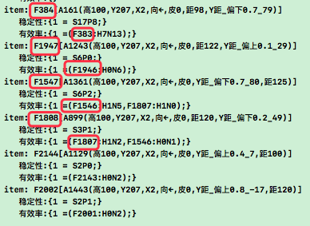 |
| 说明 | 图中F383,1946,1546,2143,2001全是无效方案,好在它们有效率低; |
|  | 图中`F1807[↘,↙,←,A899(Y距_偏下0.2_49)]`有效,但它太杂乱; |
| 问题 | 红框中F384和383内容一致,其它类似,其实这它俩本来就是先后生成的; |
| 重点 | 找到与proto类似的F384,再从它找S是行不通的,因为383太具象了; |
| 例外 | 图中1808看似有效,但原本和384的结构一致 |
|  | > 只是运气好又碰巧到了一模一样的1807,才为自己追加了条有效的S; |
| 所以 | 此方案否掉,因为从太具象的相似场景,几乎肯定挂载不到新的S; |

| 26124 | 制定方案2 & 模型,步骤,附加问题分析 |
| --- | --- |
| 起因 | 方案起因: 参考旧架构中的加工机制,即分析什么情况下,该发生的没发生; |
| 原则 | 白话: HE的决策是将低价值预测加工成高价值实现,以赚取价值差的过程; |
| 方案 | 找不稳定的抽象场景,然后从它的具象找到更高价值S,并加工实现,图如下: |
| 模型 | 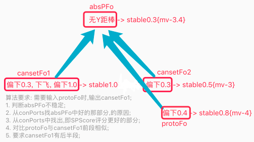 |
| 说明 | 如图,此方案共有三大步骤,如下; |
| 步骤 | 1. 用absPFo乘它具象的SPScore=综合好坏分,筛选比pFo更好的部分; |
|  | 2. 对比protoFo的末尾与cansetFo的前段相似且匹配; |
|  | 3. 判断cansetFo有后半段; |
| 问题 | 方案2的三个附加问题与解答; |
| 问1 | 起步问题: 即最开始会不会没方案,怎么起步? |
|  | 答1: 只要前面有一点相似,有后半段,且`SP经历过好`,就可做为起步方案; |
| 问2 | 自由竞争: 即这些解决方案候选集能不能达成自由竞争; |
|  | 答2: SP本就是自由竞争的; |
| 问3 | 方案抽象: 即解决方案间怎么实现再抽象 (如: 饿了就吃); |
|  | 答3: 在认知期应该已有解决,如测时真有这问题再来继续 `暂停`; |

```c
26125-工作流程 与 抽象S流程 (注: 空想流程,非代码跑出)
第1次输入F1. [路偏上0.1,上]->安全;
第2次输入F2. [路偏上0.2,右上,上]->安全;
	> 识别F1, 抽象出F3: [无Y距棒,上]->安全;

第3次输入: F4 [路偏上0.3]->危险
	> 识别F1, 抽象出F5: [无Y距棒]->危险 (S1P1)

第4次输入: F6 [路偏上0.4]
	> 识别F4, 预测危险;
	> 先从抽象找到F5,然后从具象找到F1,F2都有更好价值,推进上飞;
```

| 26126 | 方案2-代码验证方案可行性 `通过` |
| --- | --- |
| 验证1 | 验证前段匹配,后端又有飞躲的S没 `经验证有,测试时有200多条`; |
| 验证2 | 验证这些候选集里有没有`有效方案` `经验证有,测试时有多条`; |

| 26127 | 方案2-代码规划1: 大致整体步骤 |
| --- | --- |
| TODO1 | 选定执行的方案在TCEffect反馈时,由累计到effectDic改成spDic `T` |
| TODO2 | 取pFos+absPFos+sameLayerPFos=cansetFos候选集 `T`; |
| TODO3 | 因为前段需要匹配,还得有后段,所以条数不>1条的过滤掉 `T`; |
| TODO4 | 写两个时序对比算法 `转26128-第1步`; |
| TODO5 | 写两个概念对比算法 `T`; |
| TODO6 | 写两个稀疏码对比算法 `T`; |
| TODO7 | 候选集择优排序 `转26128-第2步`; |
| TODO8 | 把候选集池中,负价值部分筛选掉(坏的几率再小,也不推进) `T`; |
| TODO9 | 取到解决方案S后,从cutIndex之后开始行为化,而不是-1 `T`; |

| 26128 | 方案2-代码规划2: 细节展开步骤 |
| --- | --- |
| 模型 | 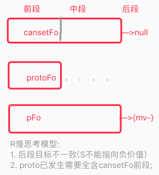 |
| 第1步 | 候选集有效判断 (初步对比S候选集是否适用于protoFo) `T`; |
| 1 | cansetFo前段,从前到后在protoFo中找匹配,必须每位都找到 `T`; |
|  | > 有一帧canset在proto里没匹配到,即proto全含canset部分结束,前段完; |
| 2 | 直至匹配到protoFo的末位为止,此时cansetFo的截点为cutIndex `T`; |
| 3 | 此时判断cansetFo在cutIndex后面还有>=0位数,即通过 `T`; |
| 4 | 计算前段匹配度=`匹配度总和 / protoFo.count` `T`; |
| 第2步 | 候选集排序方式 (进一步对S进行排序择优) `T`; |
| 1 | 对cansetFo在cutIndex后的部分计算:stableScore `T`; |
| 2 | 候选集综合分=`前段matchValue x 后段stableScore` `T`; |
| 3 | 过滤掉`候选集综合评分` < `pFo稳定性`的候选集 `废弃`; |
|  | > pFo的结果是坏,S的结果是好,二者没法大小比较,所以废弃; |

| 26129 | 概念识别性能优化 `T` |
| --- | --- |
| 方案1 | 将概念识别中中无mv指向的结果关闭 `弃掉`; |
| 分析 | 虽然速度慢,但概念识别为了准确性需要非mv指向结果 |
| 示例 | 蛇咬怕绳,其实知道是绳,只是怕被蛇咬的时序和价值,而不是直接识别成蛇; |
|  | 流程: `识别A绳`->`识别F像蛇,咬`->`预测M(stable很小)疼`; |
|  | 说明: 明知是(绳子),但看着想到[像蛇,咬],虽不稳定但依触发一定的{害怕}; |
| 所以 | 综上,方案1废弃,先不关闭; |
| 方案2 | 实测看下概念识别算法哪里慢,测得如下三处; |
|  | 1. 识别后的概念外类比慢, (每条200ms) `T`; |
|  | 2. KV转DATA慢,改成用pId (有时耗100ms,但系统应该有复用机制) `T`; |
|  | 3. 统计countDic和sumNearDic慢,ref太多了可限下 `暂不限`; |
| 结果 | 方案2采用,且改了两个,第1个需要慢慢回测有没副作用; |

| 2612a | 时序识别性能优化 `搁置` |
| --- | --- |
| 方案1 | 把时序识别rFo窄出调为0条(关闭),rFos没啥用还耗能; |
| 分析 | 目前rFo的唯一作用是用于rLearning的外类比再抽象; |
| 暂停 | 目前rFos的窄出配置为2,不算太耗能,且关掉后影响情况未明; |
| 结果 | 所以,先不关了,避免关了后反而出了外类比全是mv时序啥的有别的问题; |

***

## n26p13 十八测4-FRSTime推迟帧 & 迭代ActYes每帧O反省
`CreateTime 2022.05.28`

上节中,迭代了rSolution()思考过程,本节负责重训练回测,以及改掉发现的问题等;

| 26131 | 训练步骤规划 | 目标 |
| --- | --- | --- |
| 1 | 随机出生位置: `扔木棒,重启` x 200轮 | 识别`偏上下`pFo |
| 2 | 随机偏中出生位置: `木,随机飞x2,木,重启` x 100轮 | 学飞躲 |

| 26132 | 还是经常无计可施BUG |
| --- | --- |
| 说明 | 在26131重训第2步时,发现所有候选方案全被FRSTime过滤掉了 |
| 调试 | 第2步训练从扔木棒到飞需要近10s,而预测危险从见木棒到被撞仅需5s内; |
| 方案1 | 训练方案: 训练改成扔棒后立马飞,以习得躲开且时间来的及的经验 |
|  | 分析: 此方案当然是有效的,但那个10s的候选集就真的无效么? |
|  | 示例: 比如我坐在路边一小时,看到车来了就起开,难道会时间来不及? |
|  | 结果: 本方案虽有效,但并不解决本质上的问题 `弃掉`; |
| 方案2 | 推迟FRSTime判断帧 (应判断躲避行用时来的及,而不是前面坐了1h); |
|  | 分析: 此方案看似也是有效的,但车真的瞬息而至,就不躲了么? |
|  | 结果: 即使来不及,还是有可能会尝试,只是用时更短的S更好而已; |
|  | 追加: 考虑哪个更短S更好,这是后天的事儿 `参考26134-后天分析` |
|  | 追加: 而考虑当前帧行为输出是否来的及是先天的事儿 `转26134-方案`; |
| 方案3 | 废弃FRSTime或后置FRSTime评价器 `转26134`; |
| 结果 | 最终选择将FRSTime后置,并推迟评价帧 (即方案2+方案3后置部分); |
| 追加 | 最终选择方案2,并代码实践,回测Ok; |

| 26133 | rSolution性能优化: FRSTime提前 |
| --- | --- |
| 说明 | 越靠前进行过滤,就越性能好,FRSTime即使过滤性那么强,是否可以提前? |
| 分析 | 在判断全含后,甚至全含之前,能不能把frsTime评价提前,以优化性能? |
| 暂停 | 参考26132-方案3,FRSTime都要废弃了,靠它优化性能的事搁置先; |

| 26134 | FRSTime`废弃`或`后置`或`推迟一帧`分析 `参考26132-方案2&3` |
| --- | --- |
| 后天分析 | 用更后天的时间概念化,或后天决策功能来接替它的作用 |
|  | 示例: `朋友30min到,做饭要40min来不及`,`种好明年的粮食`; |
|  | 结果: 后天的不用写,主要分析下是否有先天成份,或先天的情况; |
| 先天分析 | 微观先天的: 单帧所需时间,还是有必要的; |
|  | 示例: 车立马撞到,躲的动作是否来的及; |
|  | 结果: 即当前帧所需时间,还是有必要判断的; |
| 线索 | 综上分析,FRSTime先天部分有需要,所以不能废弃,可以后置下,见方案: |
| 方案1 | 将FRSTime后置到,TCAction中TCOut前,每帧都判断一次; |
|  | 分析: 如果每帧判断,最后一帧判断时发现来不及,前面不是白干了? |
|  | 结果: 所以此方案废弃,不后置,新的方案见方案2 `弃掉,转方案2`; |
| 方案2 | FRSTime不后置,把判断帧改成下一帧,即下帧行为是否时间来的及; |
| 结果 | 选定方案2 (与26132-方案2一致),代码实践,并回测ok `T`; |

| 26135 | 废弃effect作为O反省首帧的功能 `T` |
| --- | --- |
| 回顾 | 在26127-TODO1刚把effectDic作为O反省首帧,更新到spDic中了; |
| 结果 | 在26136要彻底放开actYes的每帧O反省了,不用effectDic做首帧了; |
| 追加 | effect不做首帧了,那么它是否可以继续做原来的`有效率`呢? `转26142` |

| 26136 | 迭代TCActYes: 每帧都触发O反省-方案分析 |
| --- | --- |
| 前提 | 前段时间写的TCEffect是整个S的有效率,后来又把它改成首帧O反省; |
|  | 更新spDic行为化的首帧,其实就相当于是加了首帧行为化的反省; |
| 说明 | 以前的ActYes是对末帧进行反省,现在又是首帧,但有首尾还是不全面; |
| 方案 | 可以像TCForecast里对每帧都进行I反省一样,O也改成对每帧都进行反省; |

| 26137 | 迭代TCActYes: 每帧触发O反省-代码实践 |
| --- | --- |
| TODO1 | 写frameActYes(),支持每帧调用,并同时支持感性理性 `T`; |
| TODO2 | 用frameActYes()替代rActYes,并改调用代码 `T`; |
| TODO3 | 用frameActYes()替代hActYes,并改调用代码 `T`; |
| TODO4 | 用frameActYes()替代pActYes,并改调用代码 `T`; |
| 结果 | 已改完,回测效果转下节; |

***

## n26p14 十八测5-快思考
`CreateTime 2022.05.28`

上节中,迭代了frameActYes()每帧O反省,本节负责重训练回测,以及改掉发现的问题等;

| 26141 | 回测训练计划 |
| --- | --- |
| 1 | 用26131步骤重训下 `重训顺利`; |
| 2 | 看下SP在O阶段是否正常反省,看下解决方案是否稳定性逐步竞争增强; |
|  | BUG1: 测得OR反省很正常,但OP反省未出现; |
|  | 修复: 原因TOP反馈应与demand.mv匹配而不是sFo,sFo没有mv指向 `T`; |
| 3 | 改进下26131的训练步骤2,能够随机飞和扔木棒,找出更好解决方案 `T`; |
| 4 | 测连续飞躲能力,新帧新预测,新决策,新行为继续躲; |
| 5 | 测安全停止能力,躲到安全地带后,停下飞行 `时序准备后,已ok T`; |
| 6 | 测敢飞到路上,即飞到路上不会多怕危险,只有木棒飞出才会害怕并躲; |
| 7 | 测下性能 |
|  | BUG2: 测得`慢思考算法`相当慢,优化 `转26142`; |

| 26142 | 快思考算法-方案制定 |
| --- | --- |
| 示图 | 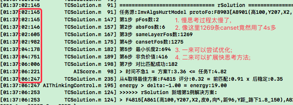 |
| 说明 | 如图示,可以制定快思考算法,方案如下: |
| 方案1 | 快思考算法以effect为准,有效率重新封装迭代而来 `选定`; |
| 方案2 | 快思考算法与慢思考复用算法,不同配置参数修改而来 `弃掉`; |
| 结果 | 快思考,要的就是一下想到曾经这么搞过,可行性高,所以选定方案1; |

| 26143 | 快思考算法-代码实践 |
| --- | --- |
| TODO1 | 写rSolution快思考算法 `T`; |
| TODO2 | rSolution快思考算法调用(前3条优先快思考,无效或后2再慢思考) `T`; |
| TODO3 | 写hSolution快思考算法 `本就是` |
| TODO4 | 写hSolution慢思考算法 `先不写,有可能废弃H,转26152` |

***

## n26p15 废弃反思子任务和H任务
`CreateTime 2022.05.29`

HE在开发过程中，使用了太多的示例，从示例出发用于分析理论与模型是好事。但直接用于改变代码细节，或新增代码模块，确是坏事。这三年来因为这个原因而写了多少多余的功能呢？在决策部分HE的模型研究不充分，导致边测边完善细节的方式，为此浪费了大量时间。直至去年底才做了螺旋架构迭代，随后的半年废弃掉许多多余无用的东西，本节将继续分析，是否可以将子任务功能和H任务废弃掉，以及别的还有什么。

| 26151 | 废弃子任务分析 `不可行,参考26152` |
| --- | --- |
| 思考 | 以往反思后生成子任务,能否改为生成根任务; |

| 26152 | 废弃H任务分析 `不可行` |
| --- | --- |
| 分析 | 以下通过分析两种短时树来分析废弃H; |
| 1恒树 | 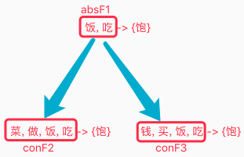 |
|  | 说明: 先找到S=f1,然后判断没饭,转H到f2做饭,然后递归到f1吃掉; |
|  | 特点: 百瞬一树: 无论多么繁杂,都体现在一颗树上不断更新 (恒树); |
|  | 缺点: 应对各种各样的变化时,不够灵活; |
| 2瞬树 | 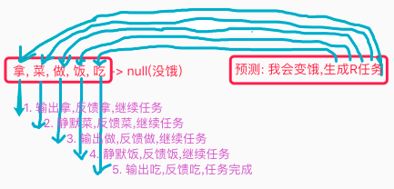 |
|  | 说明: 预测饿,找不饿的办法S,只对下帧行为化,并输出; |
|  | 特点: 百瞬百树: 每颗树,只为了输出一下,这树就完成使命了 (瞬树); |
|  | 缺点: 很长远的任务,会容易健忘原本的目标; |
|  | 分析: 瞬树根本就不可行,百瞬百树经常就连不起来; |
| 对比 | 以上,以前完全是第1种,最近的做法越来越偏向第2种; |
| 示例 | 小鸟向着路边连续飞躲,最初危险很大,飞躲一次,危险小一些; |
|  | 1. 每一次feedbackAlg然后重组反思子任务,继续飞躲; |
|  | 2. 识别系统也会预测新的R任务,但没原来那么危险; |
| 所以 | 示例可见,最终其实还是顺着第1种跑到底的,而不是第2种抢占思维; |
| 方案 | 但第2种不影响第1种,所以第2种就也跑着,各跑各的; |
| 结果 | 不必也不能废弃子任务和H; |

***

## n26p16 迭代hSolution快慢思考
`CreateTime 2022.05.29`

在n26p14中,迭代了R快思考,本节继续迭代H快慢思考(其实H的快慢都写过,这次主要是分别封装一个方法出来);

回测规划: H快慢思考ok后,可以在此基础上回测连续飞躲,流程大致为: `飞躲->H反馈->重组->反思->子任务->继续飞躲`;

| 26161 | 封装H慢思考方法-代码实践 |
| --- | --- |
| 模型 | 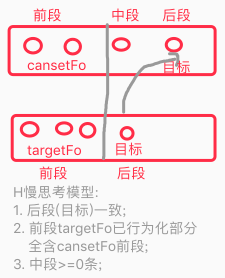 |
| 0 | cansets = targetFo + absFos + sameLayerFos `T`; |
| 1 | 前段匹配 (targetFo前段全含cansetFo前段) `T`; |
| 2 | 中段加工 (可以为0条,0条时无需加工) `TCAction本就兼容这情况`; |
| 3 | 后段: H目标帧匹配 `T`; |
| 4 | 排序因子 = 前段匹配率 x 中段稳定性 x 后段匹配度 `T`; |
| 5 | 中段稳定性 = 从cutIndex后一帧到targetIndex的衰后稳定性 `T`; |
| 6 | FRSTime评价兼容H任务:`最近R给的时间 >= S下帧所需时间` `T`; |
| 7 | 中段`(targetIndex-cutIndex>1)`为0条时,FRSTime评价直接通过 `T`; |

| 26162 | 封装H快思考方法-代码实践 |
| --- | --- |
| 1 | 从targetFo的effectDic取候选集 `T`; |
| 2 | 把hSolution里现在的快思考代码和rSolution_Fast代码融合写H快思考 `T` |
| 3 | 把H快慢思考整合到hSolution调用 `T`; |

***

## n26p17 思维可视化V3迭代
`CreateTime 2022.05.31`

| 26171 | TV支持`思维具象化`迭代 |
| --- | --- |
| 起因 | 思维可视化V2的树,其实还是不够直观,看树并不能看懂多少; |
| 说明 | 可以对思维识别结果,预测结果,任务生成,解决方案,行为输出等等; |
| 具象 | 直接在屏幕上以虚影显示出来,这样就能更加直观的看到思维的执行情况; |
| 结果 | 暂停,先不做,后面有时间再弄吧; |

***

## n26p18 十八测6-回测快慢思考 & 连续飞躲
`CreateTime 2022.05.31`

连续飞躲流程: `飞躲->H反馈->重组->反思->子任务->继续飞躲`;

| 26181 | 训练步骤规划 | 目标 |
| --- | --- | --- |
| 1 | 随机出生位置: `扔木棒,重启` x 200轮 | 识别`偏上下`pFo |
| 2 | 随机偏中出生位置: `木,随机飞x2,木,重启` x 100轮 | 学飞躲 |
| 3 | 随机偏中出生位置: `木,随机飞x2,木,重启` x 100轮 | 学飞躲 |
| 训练 | 依以上步骤重训FZ52; |  |

| 26182 | rEffect反省有效,但其实无效的BUG |
| --- | --- |
| 复现 | `FZ52,初始在路偏下,直击`; |
| 说明 | 发现日志中,有rEffect反省,明明无效(被撞到)但却显示有效; |
| 分析 | 经日志分析,在`23:485ms取到方案,44:152ms反省,45:180ms撞到`的; |
| 方案 | 可以查下延长下反省时间,或先查下为什么这么久才撞到; |
| 结果 | 多条线同时执行,导致思维流程卡乱套了,`等26183的BUG解决后,再来继续`; |

| 26183 | 一次TI触发多次TO导致思维混乱的BUG-初步分析 `转26184` |
| --- | --- |
| BUG | 发现日志中,上一轮循环的O,和下一轮循环的I,不是一对一,而是多处调用O; |
| 复现 | `FZ52,初始在路偏下,直击` |
| 调试 | 比如复现时,就有两个解决方案被同时执行,第1个还没结束,第2个就来了; |
|  | > 两个解决方案都在各跑各的,把小鸟飞的方向都搞乱了,日志如下: |
| 日志 | 1. 第1条R解决方案->行为化->飞前视觉->飞输出->识别反馈等; |
|  | 2. 进入TCScore->取第2条R方案-> 并输出另一个方向飞->行为输出; |
|  | 3. 第1条解决方案->飞后视觉; |
|  | 4. 第2条解决方案->飞前视觉->识别->反思->预测->任务->R解决方案 |
| 说明 | 从以上日志可见,现在的螺旋并非一对一,非常混乱; |
| 方案 | 每轮循环定义新的poolId,反馈,预测等全跑完后,最后终触发一次O; |
| 结果 | 等全跑完触发一次不妥,应该各触发各的,但挂起ActYes任务不响应`转下表` |

| 26184 | 多S同时执行的混乱BUG-继续分析 |
| --- | --- |
| 线索 | 一般情况下,都是以下几处调用,挨着调用了TCScore导致的; |
| O调用 | 1. actYes无反馈肯定会触发TCScore; |
|  | 2. actYes有反馈肯定会触发TCScore (现在没,加上); |
|  | 3. TCDemand中,RHP三个方法都会调用TCScore; |
| 方案1 | 入口: 多种全跑完再统一执行一次O `参考26183-方案` `弃掉`; |
|  | 弃因1: 多个触发点并不属于当前I,没法统一协调(比如actYes触发器); |
|  | 弃因2: 多处调用O是难免的,且各有各的调用理由; |
|  | 结果: 但可以不让它们冲突,比如挂起状态不重复取S等 `转方案2` |
| 方案2 | 出口: 各有各的调用原因,但执行任务时,可以将挂起的任务不响应; |
|  | 线索: 现在每一帧action推进都会进入到frameActYes中挂起; |
|  | 结果: 采纳,但需分析actYes的传染原则,是向上传染还是向下,如下: |
| 下示例 | sub继续执行: H任务时,它的baseR是挂起状态,但H可继续推进; |
| 中示例 | self应不响应: 任务自身挂起状态,应该等反馈或触发器,然后再继续; |
| 上示例 | base应不响应: base作为协作者,应等下挂起的子任务; |
| 原则 | 综上,传染原则为: 挂起状态自身及向上传染,不向下传染; |
|  | 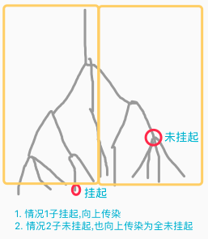 |
| 例外 | finish为截停状态,如hDemand已为finish状态,它下面却挂了一个actYes |
|  | 此时,传染会被截停,即末端不是最末的那个actYes,而是hDemand; |
| 解释 | 现在的actYes状态,有些像执行中,等待中,等含义; |
| 结果 | 选定方案2,代码实践转下表; |

| 26185 | 挂起任务不响应-代码实践 |
| --- | --- |
| TODO1 | actYes仅标记自己及所在的demand,不向上标记base和root `T`; |
| TODO2 | actYes有反馈时,调用TCScore `T`; |
| TODO3 | 任务池root竞争时,当末尾为actYes时向父传染,即排除掉此root `T`; |
|  | > 然后可以尝试下别的root,比如等饭看电视; |
| TODO4 | actYes向上层传染,只要下层还在actYes,则上层不取新S `T`; |
| TODO5 | 查下TCScore中,是否对挂起状态的自身与base评了min分 `弃掉`; |
|  | > 只要root响应激活了,那它肯定有末枝可执行,那actYes也应正常评分; |
|  | > 挂起不能评min分,不然它的下层就无法响应,推进action下一帧; |
| TODO6 | 当HDemand.targetAlg提前反馈时,HDemand改为finish状态 `T`; |
| TODO7 | 查TCPlan中,中层ActYes则继续向下找路径,因为中层不向下传染 `T`; |

| 26186 | 重训回测本文bug |
| --- | --- |
| 重训 | 根据26181前两步重训回测; |
| 结果 | 暂未再发现多S同时触发执行的混乱情况,大致是ok了; |

***

## n26p19 十八测7-回测快慢思考 & 连续飞躲
`CreateTime 2022.06.02`

连续飞躲流程: `飞躲->H反馈->重组->反思->子任务->继续飞躲`;

| 26191 | 稳定性评分不太合理问题 `T` |
| --- | --- |
| 复现 | 在26186训练完,在偏路下直击,就预测危险并右下躲,反馈A1395后反思: |
| 示图 | 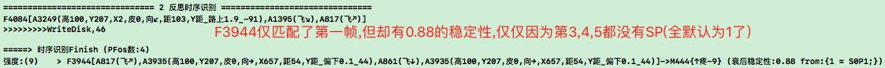 |
| 问题 | 如图,F3944仅匹配了一帧,且只有一帧的SP,竟然稳定性高达0.88; |
| 方案 | 每帧都默认为0.5,而不是1,这样就可以大大降低它的综合稳定性值; |
| 结果 | 将每帧稳定性默认由1改为0.5后,回测问题ok `T`; |

| 26192 | 快思考候选方案中有不适用当前场景的S问题 `T` |
| --- | --- |
| 示图 | 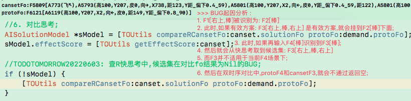 |
| 结果 | 如图将代码改成:排除掉不适用当前场景的候选方案即可 `T`; |

| 26193 | 重训FZ53,然后在此基础上测连续飞躲 |
| --- | --- |
| 步骤 | 根据26181训练FZ53; |
| 用时 | 第1步,用时40min,第2步用时80min,第3步用时110min; |

| 26194 | 快思考的前段匹配度太低问题-方案分析 `T` |
| --- | --- |
| 示图 | 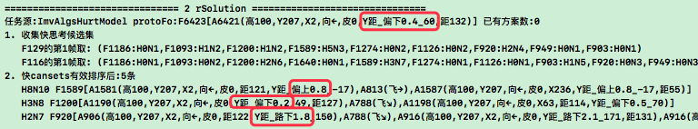 |
| 复现 | `FZ53,出生在路偏下,直击`; |
| 线索 | 现慢思考排序`=前匹配x中稳定x后匹配`,直接相乘,高稳定会拉升低匹配; |
| 原则 | 分三次竞争分别取limit阈值,三次顺序为: 先排宽松的,再排严格的; |
| 方案 | 竞争顺序为:`后匹配,中稳定,前匹配`; |
| 备注 | 以上顺序为直观认为顺序,不表示模型顺序,后续如有需要再调整; |
| 结果 | 参数制定与代码实践 `转26195` `T`; |

| 26195 | 快思考的前段匹配度太低问题-代码实践 `T` |
| --- | --- |
| TODO1 | 后段-目标匹配 (取50%,限制0-40条) `T`; |
| TODO2 | 中段-加工稳定 (取50%,限制3-20条) `T`; |
| TODO3 | 前段-场景匹配 (取前3条) `T`; |

| 26196 | 飞后视觉预测不到还有危险的BUG |
| --- | --- |
| 问题 | 这会导致,首次飞躲后连续飞躲流程不通,因为一飞后预测不到还有危险; |
| 示图 | 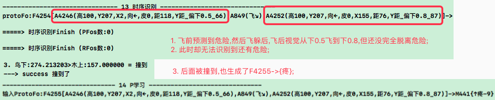 |
| 如图 | 单轮躲避后:`[飞前棒,飞躲,飞后棒]`,无法识别到现在还有危险; |
| 现状 | 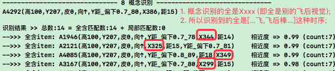 |
| 说明 | 如图,现在识别到的时序全是[飞躲,飞后棒...]的经历; |
|  | 而这些经历较杂乱,且有多余帧导致稳定性判断都<阈值0.1f; |
| 方案1 | 查下次再遇到[偏下0.5,飞躲,飞后棒]时,能否识别到这次的F4255; |
|  | 分析: 即使能,这种识别也不好,不充分不纯粹,机率低等 `弃掉`; |
| 方案2 | 支持扔出木棒的X位置随机,从而看到并习得[屏中棒]->{危险}经验; |
|  | 分析: 此方案可行,优点是木棒在任何位置都有; |
| 方案3 | 把X值改成X距,这样F4254就可以识别并全含[偏下0.8]->{危险}; |
|  | 分析: 此方案可行,优点是更符合视觉相对距离; |
| 尝试1 | 方案23都改,经`26197`,1&3步重训后效果不佳 (原因懒得查); |
| 尝试2 | 采纳方案2,经`26197`1&3步重训后效果仍然不佳 (新增第2步训练); |
| 尝试3 | 采纳方案2,经`26197`,1&2&3训练; |
|  | 回测: 尝试3的结果中,因为飞后视觉往往木棒很近,方向很多样; |
|  | 结果: 方向多样不是左,所以预测不到还有危险,所以继续尝试4: |
| 尝试4 | 尝试1和2的效果不佳原因应该一致,根据尝试3原因,所以再打开方案3; |
| 结果 | 方案2&3全打开了,且新增了第2步训练,`回测转2619b`; |

| 26197 | 训练步骤规划 | 目标 |
| --- | --- | --- |
| 1 | 随机出生位置: `随机位置扔木棒,重启` x 200轮 | 学被撞 |
| 2 | 随机出生位置: `左棒,重启` x 100轮 | 补学被撞 |
| 3 | 随机偏中出生位置: `左棒,随机飞,随机飞,左棒,重启` x 100轮 | 学飞躲 |

| 26198 | 快思考的前段匹配度太低问题2-方案分析 |
| --- | --- |
| 示图 | 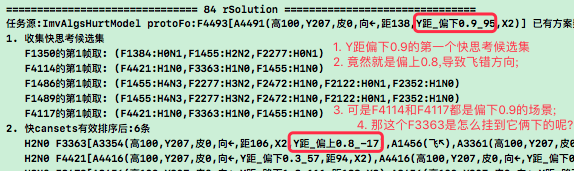 |
| 说明 | 参考26194以为慢思考三次排序就可以,看来快思考依然有问题; |
| 分析 | 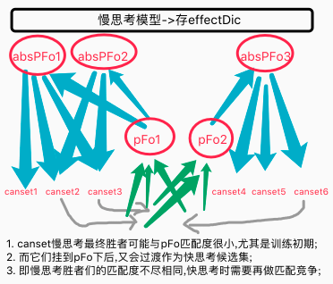 |
| 方案 | 如上图`慢思考模型`,快思考也需要单独做三次排序(用阈值); |
| 结果 | 代码实践转26199 `T`; |

| 26199 | 快思考的前段匹配度太低问题2-代码实践 |
| --- | --- |
| TODO1 | 后段-目标匹配 (阈值>80%) `T`; |
| TODO2 | 中段-按有效率 (阈值hStrong>5&&effectScore>0) `T`; |
| TODO3 | 前段-场景匹配 (阈值>80%) `T`; |
| TODO4 | 三个阈值都达标后,按有效率排序,取最高的返回 `T`; |

| 2619a | TC数据流配置调整-慢到快思考 |
| --- | --- |
| 慢_开源 | 增加慢思考候选有效源: 调整训练,加训到更多及时躲开的经历; |
| 快_固化 | 增加快思考候选集阈值: hStrong > 5 && effectScore > 0; |

| 2619b | 回测训练 |
| --- | --- |
| 训练 | 按着26197步骤训练FZ54; |
| 回测 | 1. 26196-飞后视觉能继续预测到危险; |
|  | 2. 26198-快思考结果匹配度低的问题; |
|  | 3. 2619a-慢思考到快思考的TC数据流配置调整; |
|  | 4. 测连续飞躲能力; |
| 训后 | 1. 训练后,发现快思考hStrong>5有点苛刻,没达到的; |
|  | 2. 建议把5降成3,然后快思考只尝试窄出一条试下; |
|  | 3. 这样即能快速用上快思考,又能多用慢思考过渡出更多快思考; |
| 结果 | 发现无论是从识别还是慢到快思考,数据流配置还是不太好,转2619f; |
| 追加 | 后来发现是排序代码粗心写错了,但三次竞争先筛哪个都片面是真的; |

| 2619c | 训练步骤规划 | 目标 |
| --- | --- | --- |
| 1 | 随机出生位置: `随机位置扔木棒,重启` x 200轮 | 学被撞 |
| 2 | 随机出生位置: `左棒,重启` x 100轮 | 补学被撞 |
| 3 | 随机偏中出生位置: `左棒,随机飞,随机飞,左棒,重启` x 100轮 | 学飞躲 |
| 4 | 随机偏中出生位置: `左棒,随机飞,随机飞,左棒,重启` x 200轮 | 补学飞躲 |
| 训后 | 回测问题如下: `2619d&2619e` |  |

| 2619d | HStrong达不到5的问题 |
| --- | --- |
| 示图 | 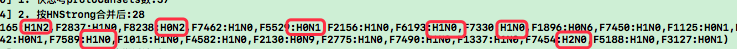 |
| 说明 | 训练这么多,结果别说5,连2都少有达到,显然没形成竞争漏斗强者愈强; |
| 调试 | 2619c-4训练一半时,还有H>3,最后H却一般才2; |
| 方案1 | 慢快思考的三次竞争,场景匹配度收太窄了,建议改成先H>5再排匹配度; |
| 方案2 | 有效的解决方案并没有挂在absPFos下; |

| 2619e | 危险地带PFos结果太少甚至为0条 `T` |
| --- | --- |
| 示图 | 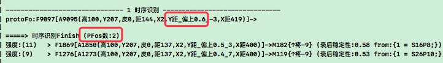 |
| 说明 | 训练这么多,结果反而经常预测不到危险了,甚至时有pFos为0条的情况; |
| 分析 | 随着防撞能力的掌握,被撞的经历越来越少,危险地带的具象经历也会躲开 |
| 方案 | 在概念识别和时序识别中,打开抽象结果; |
| 结果 | 改后危险地带预测到具象危险,安全地带预测到到抽象危险 `T` |

| 2619f | TC数据流调整-模型与原则分析 |
| --- | --- |
| 说明 | 把整个TC流程的数据流都放一块儿好好分析下,看让它们自由竞争更通顺; |
| 原则1 | 体用: 入为体,出为用 (旧有原则); |
| 原则2 | 向性: 入部分一般是具象向抽象,出部分一般是抽象向具象 (旧有原则); |
| 原则3 | 依据: 入部分一般按照本身的匹配度,出部分一般按效用度; |
| 原则4 | 竞争: 入先排后筛,出先筛后排 `弃,转n26p22`; |
|  | 分析: 其实这还是前面的三次`阈值方案`,只是在进一步分析而已; |
|  | 弃: 决策期无论先筛哪个,都有可能片面,语文前3可能数学不及格,反之亦然; |
| 原则5 | 影响: 两侧向中间影响:入时V影响AF,出时概率综合计算; |
|  | 即: 学的时候是统计(宏微统计),用的时候是概率(综合概率); |

| 2619g | 排序 | 筛选 | 向性 | 结果类型 |
| --- | --- | --- | --- | --- |
| V识别 | near |  | 入 |  |
| A识别 | sumVNear/nearCount | 匹配度>0.9 | 入(具->抽) | 抽具感理 |
| F识别 | sumANear/cutIndex*稳定性 | 稳定性>0.1 | 入(具->向) | 抽具感 |
| 任务池 | sumSPScore/pFos数 |  | 出 |  |
| 慢思考 | 稳定性 | 总匹配度 | 出(抽->具) | 具理 |
| 快思考 | 前匹配度 x 后匹配度 | H>5 | 出(抽->具) |  |

| 2619h |  |
| --- | --- |
| V识别 |  |
| A识别 |  |
| F识别 | 危险地带识别到具象结果->{负mv},安全地带识别到抽象结果->{负mv}; |
| 任务池 |  |
| 慢思考 |  |
| 快思考 |  |

| 2619i | TC数据流整理-代码流程整理 |
| --- | --- |
| 改1 | 为了自由竞争,每一级都要首先限limit,个体成长起来才有资格被用; |
| 1 | V到A: 整体竞争:V.refA取前30%; |
| 2 | V到A: 个体增强: 构建A时它会增强; |
| 改2 | 预测验证 (二次预测); |
| 1 | 安全地带时序识别到抽象时,需要对自己是否真的危险,做"验证"; |
| 2 | 即,在形成任务后,也要向具象做二次预测 |
| 3 | 将时序识别的RFos去掉,安全不会被撞不需要被预测 (因为不以它为准); |
| 4 | 而是先识别抽象危险,后再到具象预测验证出其实不危险(26211-原则); |
| 5 | 结果: 此处关了rFos结果,预测验证的方案制定和代码实践 `转n26p21`; |

| 2619j | TC数据流整理-代码实践 |
| --- | --- |
| TODO1 | V.refA取前30%以整体竞争(参考2619i-改1-1) `T`; |
|  | > 这样就不会有太新太偶然的被识别,只有沉淀一定强度才可能被识别; |
| TODO2 | 打开概念识别的抽象结果 (参考2619e) `T`; |
| TODO3 | 将时序识别的rFos关掉 (参考2619i-改2-3) `T`; |
| TODO4 | 写预测验证功能 (参考2619i-改2) `转n26p21`; |
| TODO5 | 如下图,将概念排序改成sumVNear/nearCount `T`; |
|  | 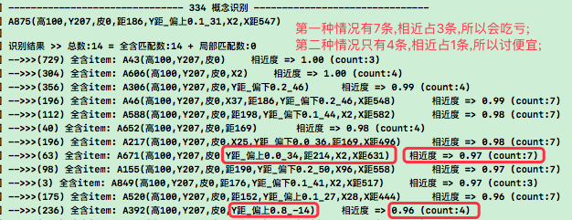 |
| TODO6 | 任务池竞争改成`sumMVScore/pFos数` `T`; |
|  | > 因为求和不公平,有些识别pFos多,有些少,求平均公平些; |
| TODO7 | 慢思考先匹配度筛选,后稳定排序 `先哪个都不妥,转n26p22`; |
| TODO8 | 快思考先H>5筛选,后匹配度排序 `先哪个都不妥,转n26p22`; |

***

## n26p20 识别性能优化-连续时序链
`CreateTime 2022.06.06`

| 26201 | 解决识别太慢的问题 |
| --- | --- |
| 简介 | 现在每次VAF识别流程要1.5s以上太慢了 |
| 分析 | 1. 价值节点成当一个普通时序元素,而不是末尾; |
|  | 2. 每帧输入压到尾部,然后将最旧超过4帧的首帧踢掉; |
|  | 3. 每帧识别都利用上帧的缓存; |
|  | 4. 把每帧的refPorts都缓存下来,matchAlgs&pFos&rFos不变; |
|  | 5. 从上帧的预测中,找这帧的匹配 (反馈式识别); |
| 性能 | 这样的话,每帧可以控制在100ms内的话,肯定可以加快强训速度; |

| 26202 | 优化识别性能后-打开多帧视觉 |
| --- | --- |
| 改动 | 将多帧未变的概念,合并为一个概念,时间跨度求和; |
|  | 示例: 张三9小时跑完马拉松; |
| 说明 | 1. 在这个过程中,跑每步具象(因为具象都有变化)都能形成一个时序; |
|  | 2. 而抽象,只形成一个跨度9小时的时序(因为抽象都是张三在跑,没变化); |
| 优点1 | 会有更好的性能 (因为缓存复用,时序少了); |
| 优点2 | 更全面构建(或加强)更抽具象层上的时序,并且更全面的预测; |

结果: 优化先放放,后面再说,先继续搞TC数据流调整和训练吧;

***

## n26p21 预测验证
`CreateTime 2022.06.08`

因为任务很可能因为抽象而非常不稳定,所以在任务进行解决方案之前,先验证下任务 (参考2619i-改2),前面已经打开了会识别到抽象时序,并且关闭了rFos结果,本节主要集中在`预测验证`的方案制定和代码实践;

结果: 不需要`预测验证`,直接走原来的慢思考流程即可,如果实际上安全的话,自然会找到`无需要加工(中段长度为0)`的S方案;

| 26211 | 预测验证-方案规划 `T` |
| --- | --- |
| 原则 | 即使安全地带也应该很预测到危险 |
| 示例 | 就像十年怕锦绳或者外面担心有坏人; |
| 思路 | 所以预测验证肯定是在构建任务后; |
| 方案 | 预测验证就可以尝试复用慢思考代码; |

| 26212 | 预测验证-实践规划 `复用慢思考代码` |
| --- | --- |
| 说明 | 下面通过前中后期三个阶段来分析对比`预测验证`与`慢思考`; |
| 前段 | 从输入看: pFo有可能是抽象稳定性0.1,或抽象0.9,或具象0.5; |
|  | 分析: 无论是稳定0.1还是0.9,是抽象还是具象,它们同样都需慢思考; |
| 中段 | 从作用看: 验证其实就是pFo转移:从抽象低稳定性,转向具象高稳定性; |
|  | 分析: 验证是低向高验证,慢思考也是低向高加工,先验证后加工并不冲突; |
| 后段 | 从行为看: 验证是验证有必要再加工,慢思考是有加工帧就加工; |
|  | 分析: 二者区别在于取得S的中段加工长度不同,二者无危险时长度都为0; |
| 区别 | 综上,二者的区别仅在于后段验证的S中段更可能为0; |
| 综上 | 分析得: 二者一模一样,可以用慢思考算法跑`预测验证`; |
| 结果 | 无需要改代码,直接回测下`抽象不稳定pFo`时,能否跑出`加工0长度`的结果 |

***

## n26p22 决策期概率竞争-S综合排名
`CreateTime 2022.06.08`

在前面,多次对决策期的竞争排序做调整:
1. 最初的直接前中后段相乘;
  * 因为可能有一个拖后腿,导致不公平,比如玩色子,稳定性就是1/6;
2. 后来阈值方案 (三次竞争) (参考26194&26195);
  * BUG_后发现TC数据流过渡转化的不太好 (参考2619b);
  * 分析: 分析阈值方案的TC数据流在决策期的先筛后排 (参考2619f-原则4);
  * 废弃: 阈值方案先筛哪个都片面,所以废弃 `参考2619f-原则4-弃`;
  * 修复: 后来发现是排序代码粗心写错了,但阈值方案废弃原因仍成立;
3. 再然后即本文制定的`综合排名方案`,实现决策期TC数据流更通畅的过度与竞争;

| 26221 | 决策期概率竞争-方案分析 |
| --- | --- |
| 原则 | 学时统计(内部宏微加强),用时概率(外部综合评价) `参考2619f-原则5`; |
| 分析 | 可以分别对三次分别竞争排名,后再计算综合排名; |
| 方案 | 综合排名 = 排名求和 / 回合数 `(score = sumRank/rankCount)`; |

| 26222 | 决策期概率竞争-代码实践 |
| --- | --- |
| TODO1 | 时序识别用匹配度排序(sumNear/nearCount),而不是稳定性 `T`; |
|  | 现在安全地带会识别到匹配度低的危险地带结果,因为它稳定性排在前面; |
|  | > 这违背了26221-原则-学时统计,所以这里改成匹配度排序; |
| TODO2 | 慢快思考都迭代用上综合排名算法 `T`; |
| TODO3 | 弃用三次竞争和H>5逻辑,综合排名不需要它了 `T`; |

<br><br><br><br><br>
