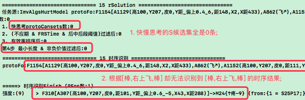

# 乌鸦挑战-TC数据流配置测调 & 迭代反思TCRefrection

> 注:
> 1. 在n26中，做了继续整理了TC数据流,快慢思考,AIAnalyst分析器,本文在此基础上继续做TC数据流整理,并回归训练;

***

<!-- TOC -->

- [乌鸦挑战-TC数据流配置测调 & 迭代反思TCRefrection](#乌鸦挑战-tc数据流配置测调--迭代反思tcrefrection)
  - [n27p01 S候选集再抽象](#n27p01-s候选集再抽象)
  - [n27p02 十九测: 回归改BUG](#n27p02-十九测-回归改bug)
  - [n27p03 快慢思考性能优化](#n27p03-快慢思考性能优化)
  - [n27p04 飞躲卡顿: TCSolution的价值PK迭代](#n27p04-飞躲卡顿-tcsolution的价值pk迭代)
  - [n27p05 转由`向性`来解决S评分PK的问题](#n27p05-转由向性来解决s评分pk的问题)
  - [n27p06 测试S反思评价](#n27p06-测试s反思评价)
  - [n27p07 思维框架图v4](#n27p07-思维框架图v4)
  - [n27p08 再测试S反思评价](#n27p08-再测试s反思评价)
  - [n27p09 卡顿问题-父任务失效机制](#n27p09-卡顿问题-父任务失效机制)
  - [n27p10 再测TCRefrection & 测父任务失效机制](#n27p10-再测tcrefrection--测父任务失效机制)
  - [n27p11 时序的时间跨度](#n27p11-时序的时间跨度)
  - [n27p12 测试任务失效机制等](#n27p12-测试任务失效机制等)
  - [n27p13 近期激活节点增益机制](#n27p13-近期激活节点增益机制)
  - [n27p14 回归测试](#n27p14-回归测试)
  - [n27p15 抽象多层多样性之: TI相似概念抽具象](#n27p15-抽象多层多样性之-ti相似概念抽具象)
  - [n27p16 抽象多层多样性之: TI迭代类比器](#n27p16-抽象多层多样性之-ti迭代类比器)
  - [n27p17 抽象多层多样性之: 时序识别和决策->复用相似度](#n27p17-抽象多层多样性之-时序识别和决策-复用相似度)
  - [n27p18 不完全时序问题: S候选集与复用indexDic](#n27p18-不完全时序问题-s候选集与复用indexdic)
  - [n27p19 抽象多层多样性之: TO调整决策系统](#n27p19-抽象多层多样性之-to调整决策系统)
  - [n27p20 三段抽具象](#n27p20-三段抽具象)
  - [n27p21 caset再类比之后](#n27p21-caset再类比之后)
  - [n27p22 回测-二十测](#n27p22-回测-二十测)

<!-- /TOC -->

## n27p01 S候选集再抽象
`CreateTime 2022.06.20`

在26235中,S解决方案都太具象繁杂,并且还经常测时有各种方向乱飞的情况,本节针对这一问题进行分析解决;

| 27011 | S候选集再抽象-方案分析 |
| --- | --- |
| 原因 | 快思考候选集随时可能加入新的，且综合排名可能靠前 |
| 原则 | 乱飞肯定是抽象度不够。 |
| 方案 | 可以尝试将其类比抽象。 |

| 27012 | S候选集再抽象-实践分析 |
| --- | --- |
| 问1 | 触发外类比的时机: |
|  | 思路: 使抽象S挂载到具象场景Fo下; |
|  | 答: 可以在输出新S结果时，与已有S类比。 |
| 问2 | 排名机制 (抽象排前机制): |
|  | 思路: 用strong强度为排序因子(抽象的强度更强); |
|  | 答1: 用强度加宽入limit即可。 |
|  | 答2: 将强度加到综合排名里做第四个排名科目; |

| 27013 | S候选集再抽象-代码实践 |
| --- | --- |
| TODO1 | 将effDic中的itemArr的指针改成AIPort类型; |

| 27014 | 反例分析 |
| --- | --- |
| 反例 | 如果8向改成无数向,那么会不会一抽象就没有具体飞躲方向了; |
|  | 思路: 所以是否意味着,进行再抽象必然会丢细节; |
|  | 思路: 到了S这一步,其实是应该保留更多细节了,要用于行为输出参数; |
| 分析 | 反例无效,因为抽象只负责找出抽象候选S,而丢细节后是否有效归effect管; |
| 所以 | 无论是否有效,都先抽象再说,抽象后: |
|  | 1. 如果抽象不合理则通过`有效率`将其否掉; |
|  | 2.如果抽象合理,则通过`有效率`使其成长; |

***

## n27p02 十九测: 回归改BUG
`CreateTime 2022.07.05`

前段时间因北京疫情中断20天,本文衔接26234-root循环卡顿的BUG,继续;

| 27021 | root循环卡顿-BUG回顾 |
| --- | --- |
| 说明 | 参考26234,在训练中遇到root循环卡顿 (finish状态的root有92条); |
| 调试 | `直击预测危险->S方案左飞->棒,左飞又预测危险->又S方案左飞`循环; |
| 疑点1 | [棒,左飞]: 为什么会预测到危险`[左飞,棒]`,即使明明在安全地带; |
| 疑点2 | [棒,左飞]: 得到解决方案[棒,左飞,棒],为什么还会左飞,飞应该是前段; |

| 27022 | root循环卡顿-BUG不复现 |
| --- | --- |
| 说明 | `FZ55,路上方直击`,此BUG死活不再复现了; |
| 重训 | 经26233重训,第2步到30%左右时卡循环,但卡20分钟后过去了,中止训练; |
| 复现 | 相当于重现了此BUG,得到FZ56; |
| 分析 | 如已在安全地带,此时`S评分 < 任务fo评分`,所以S不执行行为化; |
| 追问 | 但demandFo评分永远为负,而S评分永远为正,所以永远都会执行行为化; |
| 所以 | 问题在于究竟离路边多远,HE才会认为自己安全了? `转27023` |

| 27023 | 路边很远却预测危险在飞躲的BUG-复现与方案分析 |
| --- | --- |
| 示图 |  |
| 复现 | `FZ56,出生在下方靠近底部,直击`; |
| 说明 | 如图: 前段时间打开了抽象识别,所以很可能无论多远,都会识别到危险; |
| 回顾 | 查一下当时打开抽象的原因; |
|  | > 在2619e-因为随着躲的越来越好,在危险地带也难以识别预测到危险; |
| 方案1 | 看能不能改成仅识别抽象,但不用于价值预测; |
|  | 不采纳: 抽象预测危险是原则,预测危险后可判断没必要躲,但不能不知险; |
| 方案2 | 价值pk方案: `在反思时,判断到任务价值 > 执行后带来的后果评分`; |
|  | `危险系数很低时,懒得动` 或 `涉及别的负价值,不值得` |
| 结果 | 采纳方案2 `代码实践转n27p04`; |

***

## n27p03 快慢思考性能优化
`CreateTime 2022.07.07`

目前性能问题主要体现在cansetS太长(700多条以上),所以可考虑cansetS所有候选集加一个宽入limit,比如慢思考整体按稳定性排,然后取前100条,再做三科综合排名;

***

## n27p04 飞躲卡顿: TCSolution的价值PK迭代
`CreateTime 2022.07.09`

前段时间有明明在安全地带,却不断飞躲停不下来的BUG,然后在27023最终采纳了方案2,而本节主要做代码实践;

本节过程大纲:
1. 因为root循环卡顿,所以懒得时候应该中止循环,转27041
2. 任务评分与S评分进行PK,应该放在TCSolution算法中,转27042
3. 分两层limit,无论胜败每个pFo取3条,pFos总共胜的条数最多取5条,转27043
4. 胜败PK中,很可能误放noMvFo为S,所以在rInput时,不构建fo,转27044
5. 在生物钟触发器时只会计数SP,而不会构建noMvFo,所以它会绝种,转27045
6. 提前分析noMvFo消失后的影响,与消失后的决策预演(尤其是退出root循环),转27046
7. 打开抽象识别就root卡顿循环,关闭抽象识别就有时危险却预测不到,转27047

| 27041 | 懒-实现方案分析 |
| --- | --- |
| 方案1 | 与别的mv一样,每次行为输出都触发懒mv; |
| 方案2 | 直接在代码里写死,每条行为输出对应懒mv评分值; |
| 分析 | 方案1更符合模型原则,但方案2更方便简单; |
| 结果 | 先做方案2,后面有需求了,再改为方案1,现在方案2也不至于影响到根本; |

| 27042 | `判断任务价值 > 执行后带来的后果评分`-模型大致分析 |
| --- | --- |
| 简介 | 参考27023-方案2,本表针对它的实现,先做些模型分析; |
| 示图 |  |
| 说明 | 1. S需要整体价值预测,而不能单帧重组; |
|  | 2. S的情况对比另外两种,S本身很健全,且指向的mv明确; |
| 结论 | 所以关于S价值pk拦截,应该直接放在S算法中; |

| 27043 | `判断任务价值 > 执行后带来的后果评分`-模型细节分析 |
| --- | --- |
| 简介 | 从27042中分析可得,S价值pk要在S算法中,本节具体在S算法中分析细节; |
| 方案1 | 取结果前,先pk拦截; |
|  | 700多条候选集,如果PK拦截的过早则起不到作用,其余500条未必就有效; |
| 方案2 | 取结果后,再pk拦截; |
|  | 700多条,很可能前limit3条全pk失败,导致整个任务失败; |
| 分析 | 前两个方案要么太早(太松),要么太晚(太紧),导致都不好,所以方案3如下; |
| 方案3 | 每一个pFo下都取limit条(如3条)尝试pk (无论pk胜与败,最多limit条); |
|  | 注: 与TCSolution共取5条pk胜者不冲突; |
| 结果 | 方案1太松,方案2太紧,所以选定方案3,并尝试实践 `转下面TODO表`; |

| 27044 | 方案3-有可能误放`还没发生的S`问题分析 |
| --- | --- |
| 说明 | 在rInput输出一帧时,并不意味着它最终不会撞到,只是现在还未发生; |
| 问题 | 但rInput生成的时序,如果放到S候选集中pk肯定能获胜,因为它不指向mv; |
| 分析 | `还没发生mv`和`最终没发生mv`不是一种情况; |
| 思路 | 这种还没发生P就生成的R时序,即noMvNo,我们应避免noMvFo干扰; |
| 方案 | 可以在rInput之后,只识别预测,但不构建`noMvFo`; |
| 结果 | 此方案从根本上避免了`noMvFo`对后续决策的干扰,实践 `转下面TODO表`; |
| 追加1 | 分析下,此改动,会不会导致noMvFo绝种 `转27045`; |
| 追加2 | 现在的rInput和regroupFo都是noMvFo,建议先不废弃,改成不用; |
|  | 即: 原生成protoFo和regroupFo不变,在TCSolution中排除掉无mv指向的; |
|  | 结果: 这样和废弃其实是等效的,只是不要一步废弃 (留后悔药,防风险); |

| 27045 | rInput输入不生成时序会不会导致noMvFo绝种问题 |
| --- | --- |
| 简介 | 参考27044-方案,这会导致noMvFo大量减少,会不会绝种? |
| 分析 | 不会绝种,27044-分析中,`最终没发生mv`即可生成noMvFo; |
| 思路 | 在生物钟触发器触发时,如果mv未反馈,则构建noMvFo; |
| 现状 | 但现做法是,对spDic末帧P计数+1,并不会构建noMvFo; |
| 结果 | 现P计数的做法也没啥问题,但要分析下noMvFo消失后会带来什么问题; |

| 27046 | 提前分析noMvFo消失后的影响与决策中退出循环机制 |
| --- | --- |
| 优点 | 排除了`还没发生mv`的影响; |
| 缺点 | 在安全地带的时序可能识别不到了 (其实因为只是它SP危险率极低); |
| 总结 | 变成一个概率加工游戏,动与不动各举一例如下: |
|  | 1. 动: 概率上能从更危险变更安全,就行为躲(动); |
|  | 2. 不动: 概率低在pk中失败,就行为不动; |

| 27047 | 曾数次打开抽象与关闭抽象识别-浪费许多时间的总结 |
| --- | --- |
| 关闭 | 关闭抽象识别,会导致危险地带也预测不到危险 `参考2619e`; |
| 打开 | 打开抽象识别,会导致循环root停不下来 `参考27021` |
| 总结 | 应该打开抽象,同时解决root循环的问题,即本文要做的价值PK; |

| 27048 | 飞躲卡顿: TCSolution的价值PK迭代-代码实践 |
| --- | --- |
| 简介 | 根据上面所有分析的情况,制定代码实践; |
| TODO1 | 反思与AIScore价值pk `现在本来就支持,不用改代码 T`; |
| TODO2 | 27042-取到解决方案,要先进行反思(价值pk),而不是先行为化; |
| TODO3 | 在评分<(方案评分+懒阈值)时,懒得解决它 (参考27041-方案2); |
| TODO4 | 在快慢思考不过滤负价值的候选集,S评分<任务分=不行为化 `转TODO9`; |
|  | 弃因1: 目前测试中mv比较单一,只有撞疼一种,所以此条可先不做; |
|  | 弃因2: 并且应该由TODO2反思来实现才更融于当前模型,而不是这个; |
|  | 转为不废弃: 改为不过滤,使之出现并进行价值pk; |
|  | 转为废弃无价值时序,转TODO9 `参考27044-追加2`; |
| TODO5 | 27044-取消rInput构建时序,只识别预测 `废弃,参考27044-追加2`; |
| TODO6 | 27043-TCSolution的每个pFo都pk其下的limit条 `转27049`; |
| TODO7 | 27043-然后所有pFos的pk胜者再限limit条; |
| TODO8 | 27041-先不定义懒mv,而是直接在TCSolution中将每条行为转成懒评分; |
| TODO9 | 27044-追加2: 过滤掉无价值的S候选集 `T`; |

| 27049 | 迭代getCansetFos_Slow()每条pFo取候选集 |
| --- | --- |
| 简介 | 参考27048-TODO6,每一条pFo都单独取limit条S候选集进行评分pk; |
| 说明 | 本表负责单条pFo取cansetS的算法getCansetFos_Slow()迭代细则; |
| 分析 | 原来关闭抽象识别时,不取抽象和同级就没数据可取了; |
|  | 现在打开了抽象识别后,直接取具象就有数据可取,所以改动如下: |
| TODO1 | 废弃取抽象 (因为抽象指导增加,但易因场景准确度降低而犯错) `T`; |
| TODO2 | 废弃取同级 (同级准确度也低,可能因其而犯错) `T`; |
| TODO3 | 废弃取自身 (因为自身是用来与cansetS做评分pk的) `T`; |
| TODO4 | 继续取具象 (最多取limit条,分别做评分pk) `取limit完成,pk未完成` |

| 2709a | 实践途中发现问题并中止 |
| --- | --- |
| 说明 | 在写S算法中的pk时,需要计算任务的评分; |
| 问题 | 然后发现H任务的评分不好弄,因为它的目标帧不是mv; |
|  | 并且hSolutionFo也有可能是未指向mv的,比如打人,打人就是打人; |
|  | 而打人之后的mv结果,可能并不在抽象打人时序上,而在其具象conFos中; |
| 总结 | 本节的关注点是我们找出有mv指向的时序来做候选集,这样容易评分; |
| 问题 | 而问题在于越是理性的知识,它越可能不指向mv,比如H任务与目标; |
|  | 再比如: 我用吃饭解决了不饿的问题,所以我没有饿,这个没饿也没mv指向; |
| 结果 | 我们需要从没mv指向的S去评分pk,而不是只取有mv指向的,转下节; |

结果: 本节制定的S评分PK的方向是ok的,但在实践中发现具体的实现方式还有待改进,待改进的部分主要体现在:"严格要求有mv指向的cansetS是不现实的";

那么: 我们即要继续坚定S评分PK的方向,又要求cansetS不能必须指向mv,即要马跑又不给草,所以这一矛盾交由下节n27p05来解决;

2022.11.30更新: 反思识别已废弃,因为cansets都是同层,且再相似也不是一个场景(没抽具象关联),这种识别是出力不讨好,并且后面对相似支持了抽具象关联,所以不再需要反思进行识别,它只需要根据自身的spDic等来反思评分即可 (参考27211-todo2);

***

## n27p05 转由`向性`来解决S评分PK的问题
`CreateTime 2022.07.16`

回顾前段时间的改动与回测BUG:
1. 在前段时间开放了抽象识别,所以无论在危险还是安全地带,都能识别到抽象危险;
2. 然后前段时间写了快慢思考,在回测时发现慢思考中的cansetS综合排名竞争,永远能找着最佳解;
3. 以上两条,形成了一直能识别危险,又一直能找着解的root循环卡顿中;

回顾上节:
1. 在上节中,制定了正确的解决方向: 即每次取解决方案s时,都进行pk,pk失败时说明没有更优解了,就中断行为化,即可跳出root卡顿循环;
2. 在上节中,制定的具体解决方案有问题: 即改由只取带mv的cansetS,并直接取mv评分进行pk,事实上无论是H任务,还是曾经有效的解,都未必是有mv指向的;

本节计划:
1. 本节将不要求cansetS必须有mv指向;
2. 并顺着`向性`来继续解决这一问题;

| 27051 | 向性反思 & 向性求解 |
| --- | --- |
| 例1图 |  |
| 例2图 |  |
| 步骤 | 1. 如上两例: 无论是H还是R任务,取得的S方案可能并不指向mv; |
|  | 2. 而从S方案`顺着向性向具象`才能`反思到mv`; |
|  | 3. 同样从`顺着向性向具象`也能`找着pk胜利的S解决方案`; |

| 27052 | 向性反思与求解-方案分析 |
| --- | --- |
| 说明 | 1. 以前的cansetS几百条集体综合排名,太简单暴力,偏向强化优势; |
|  | 2. 本节要做的`向性反思求解`方式是逐层下探,过程更加周到使用迁移优势; |
| 分析1 | S的反思实现; |
|  | 1. 抽象即含其下所有的模式可能性; |
|  | 2. 即conPorts有评分<任务分时,即反思不通过; |
|  | 3. 反思不通过时,继续向conPorts下探,直至找出反思通过的S方案; |
| 分析2 | pFos的优先级 (先从哪个pFo取cansetS?); |
|  | 1. 例1中,先想到让牙咬不到,然后才分析的老虎麻醉; |
|  | 2. 所以是抽象pFo优先,即指导性优先,直至找出稳定的解; |
| 结果 | 本表得两条分析结果都ok,但例子依据太过理想化,下表用防撞例子分析; |

| 27053 | 套入乌鸦防撞例子分析-向性反思与求解的可行性 |
| --- | --- |
| 说明 | 27051&27052的例子太过理想化,本表套入乌鸦防撞例子实际分析下; |
| 例子 | 乌鸦防撞的例子中,抽象的太抽象,具象的太具象,所以算是比较困难的例子; |
| 分析 | 本表从`安全地带`和`危险地带`两个分析切入点: |
| 切入1 | 安全地带时: 多个pFos中,抽象pFo有危险率,具象pFo危险率低; |
|  | 1. 这种情况要以具象的pFo为准,它更切合具象,且是安全的; |
|  | 2. 并且具象pFo取到解决方案后,也会因为懒等觉得没必要再躲更远了; |
| 切入2 | 危险地带时: 多个pFos中,抽象pFo和具象pFo都有危险率; |
|  | 1. 如何转成方向加工; |
|  | 2. 太抽象的pFo找cansetS: 不知道该往哪个方向躲是更安全的; |
|  | 3. 太具象的pFo找cansetS: 又没有conPorts指向,候选集为0条; |
| 问题 | 因为防撞例子的具象的太具象,导致很容易就下探到最具象层; |
|  | 所以`向性反思与求解`必须能够支持这种情况下,找到合理的解; |
| 解答 | 最具象fo的前段保证匹配,中段保证可行,后段保证评分通过; |
| 思路 | 建议在FZ56知识的基础上: 边实测决策中S的过程情况,边分析制定方案; |

| 27054 | 继续分析乌鸦防撞例子 |
| --- | --- |
| 示图 |  |
| 问题 | 如图,最具象的S可能只是还没发生mv,并不意味着它安全; |
| 方案 | 对相似的多条`候选S`综合判定: 无论是全含还是相似,结果总是多条; |
|  | 1. 比如: 抽象取具象,取到M条相似的,N条全含的; |
|  | 2. 要对这些综合进行后段的评分; |
|  | 3. 最后得出的安全的,也是要进行这种多条综合反思,通过才算ok; |
| 思路 | 所以,这种反思求解的整个过程,都要面向多条来综合计算,而非单条; |
| 原则 | 既然TI识别时有`相近匹配(内)`,那么TO时就有`多fo综评(外)`; |
| 步骤 | 1. 从具象中进行识别,取得综合相近度排序的limit条结果; |
|  | 2. 对这个识别结果序列,相邻的数条进行综合评分; |
|  | 3. 排出后段评分最高的一组,做为S结果的线索; |

| 27055 | 乌鸦防撞例子-步骤分析 |
| --- | --- |
| 说明 | 看起来,除了综评反思,别的没啥区别,步骤分析如下: |
| 步骤1 | 取cansetS不限mv指向全取 (但上节中的限limit保留); |
| 方案1 | 步骤2. 原综合排名不变 `95%`; |
|  | 步骤3. 对排名首位的S进行综评反思 |
| 方案2 | 步骤2. 将综评反思作为新的排名项 `5%`; |
| 说明 | 方案1有三步,方案2为两步,即先取出S后反思,还是将反思也做为排名之一; |
| 分析 | 反思综评很耗能,它需要取出具象判断相似排序,然后再分别取mv评分; |
| 所以 | 选择方案1,即综合排名不变,取到S后再进行综评反思; |

| 27056 | 三种正反思的对比 |
| --- | --- |
| 说明 | 以前有过S反思,但改成反馈反思了,而现在又在做S反思,理应对比下 |
| 1. 识别正思 | 是输入新帧借助瞬时记忆的识别 |
| 2. S反思 | 是综合s候选方案评价(s执行前); |
| 3. 反馈正思 | 是输入新帧时借助工作记忆的识别(s执行中) |
| 分析 | 其实反馈不叫反思,而是正思,而S反思与它不是一回事; |
| 结果 | 依目前来看,S反思是必要的 (否则会有卡顿循环); |

| 27057 | 实践S反思过程中-关于任务评分的一些问题 |
| --- | --- |
| 简介 | S反思评价的公式为: `pk通过 = 任务评分 - 方案评分 - 懒评分 > 0` |
| 问题1 | 任务评分取pFo的评分,还是取demand的评分? |
|  | 回答: 应该取demand比较综合,毕竟pFo很容易片面; |
| 问题2 | H任务的任务评分应该以谁为准? |
|  | 回答: H任务应该以其baseRDemand的评分为准,毕竟H都是为了推进R; |

| 27058 | 本节总结 |
| --- | --- |
| 起因 | 本节起因为解决在S未反思就执行行为化,导致一直躲一步的root卡顿循环 |
| 改动 | 本节写了S反思评价两个方法 (其实老以前的宏微决策架构就有过S反思); |
| 说明 | 本节的S反思评价更加详细,用向性的方式,在具象中反思找匹配度高的; |
| 结果 | 本节暂时仅对`慢思考`支持了S反思评价,`快思考`等测时需要再支持; |

2022.11.30更新: 反思识别已废弃,因为cansets都是同层,且再相似也不是一个场景(没抽具象关联),这种识别是出力不讨好,并且后面对相似支持了抽具象关联,所以不再需要反思进行识别,它只需要根据自身的spDic等来反思评分即可 (参考27211-todo2);

***

## n27p06 测试S反思评价
`CreateTime 2022.08.06`

说明: 上节写了S反思评价的方法,本节重点继续上轮测试,即测S反思评价的代码工作是否正常,也测下root循环卡顿的问题是否恢复正常;

| 27061 | 回测训练 |
| --- | --- |
| 1 | 随机出生位置: `随机位置扔木棒,重启`x200轮 & `左棒,重启`x100轮 |
| 2 | 随机偏中出生位置: `左棒,随机飞,随机飞,左棒,重启` x 100轮 |

| 27062 | 训练记录 |
| --- | --- |
| 训练1 | 按着27062步骤训练,但到第2步第20轮后很卡 |
|  | 情况: cpu占用0,也没死循环,就是慢; |
| 训练2 | 所以把第2步分成10份,训练到第4份时,卡了 |
|  | 情况: cpu占用99%,root有20多个,卡着 `参考5702-4卡顿` |

| 27063 | 卡进`植物模式`功能 `T` |
| --- | --- |
| 说明 | 在训练中卡住,不好查原因,因为卡着UI,所以本表解决让它别一直卡着UI; |
| 方案 | 判断一次loop达到超时时间时,就自动触发“植物”模式; |
| 实践 | 1. 先调试超时时,会是多久; |
|  | 2. 然后写自动卡进"植物模式"的功能; |
| 调试 | 经调试越来越卡时,TCScore最为明显,卡的时候每次执行都要3s左右; |
| 结果 | 在最近10次TCScore平均执行`>2500ms`时,转入植物模式; |

| 27064 | 优化TCScore `是调用者TCDemand卡,不是Score,转27065` |
| --- | --- |
| 说明 | 上表中,测得在卡时TCScore卡顿最为明显 (其实不止TCScore卡); |
| 分析 | 但TCScore和别的TC操作卡顿原因应该一致; |
| 方案 | 所以本表深入分析TCScore卡的原因,并优化; |
| 跟进 | 经测TC卡顿报出的时间并不是TCScore的时间,而是它的上一步TC调用者; |
| 调试 | 经测TCScore卡慢时,调用者全是TCDemand `参考27064调试日志`; |

```sh
//27064调试日志
当前:TCScore.m 操作计数更新:2032 用时:************************************ (3681) from:TCDemand.m
当前:TCScore.m 操作计数更新:2044 用时:*********************************** (3597) from:TCDemand.m
当前:TCScore.m 操作计数更新:2056 用时:***************************************** (4120) from:TCDemand.m
当前:TCScore.m 操作计数更新:2068 用时:******************************************* (4357) from:TCDemand.m
当前:TCScore.m 操作计数更新:2080 用时:******************************************** (4484) from:TCDemand.m
当前:TCScore.m 操作计数更新:2092 用时:******************************************* (4371) from:TCDemand.m
当前:TCScore.m 操作计数更新:2104 用时:**************************************** (4085) from:TCDemand.m
当前:TCScore.m 操作计数更新:2116 用时:**************************************** (4069) from:TCDemand.m
```

| 27065 | 优化TCDemand `T` |
| --- | --- |
| 简介 | 经27064调试分析,TCScore调用时,其实是它的调用者TCDemand在慢; |
| 说明 | 本表负责,分析TCDemand具体慢代码块,并优化; |
| 调试 | 经调试,最终是DemandManager.refreshCmvCacheSort()太慢 |
| 原因 | 它执行了4千多次score4Demand()评分,共消耗1s多 `参考27065代码块`; |
| 方案 | 把AIScore.score4MV_v2加上缓存,并回测有效 `T`; |

```js
//27065代码块:
//27065调试日志与慢代码
Score4Demand88_1 计数:4712 均耗:6 读:0 写:0
for (AIMatchFoModel *pFo in rDemand.pFos) {
    sumScore += [AIScore score4MV_v2:pFo];
}
```

总结: 本节测试反思,并中途卡顿,并优化了`score4Demand()代码性能` (但并未根治卡顿问题,转n27p08继续测和优化);

***

## n27p07 思维框架图v4
`CreateTime 2022.08.20`

回顾TC框架图v3(参考24164),很久没有重绘思维架构图了,正好周末有空,本文整理一下用词,然后重绘一下,没别的用途,就单纯想到几个词还不错;

| 27071 | 思维框架图v4 |
| --- | --- |
| 示图 |  |
| 动转静 | 其中`反馈`是动极转静,`被动反馈`等待; |
| 静转动 | 其中`意向`是阴极转阳,`主动意向`追求; |

| 27072 | 思维 | 代码 | 二 | 四 | 八 |
| --- | --- | --- | --- | --- | --- |
| 1 | 感知 | TCInput | 0静 | 1秋 | 1入 |
| 2 | 识别 | TCRecognition | 0静 | 1秋 | 0认 |
| 3 | 学习 | TCLearning | 0静 | 0冬 | 1知 |
| 4 | 任务 | TCDemand | 0静 | 0冬 | 0需 |
| 5 | 计划 | TCPlan | 1动 | 0春 | 0求 |
| 6 | 思考 | TCSolution | 1动 | 0春 | 1决 |
| 7 | 反思 | TCRefrection | 1动 | 1夏 | 0策 |
| 8 | 行为 | TCOut | 1动 | 1夏 | 1出 |

| 27073-更新-HE系统架构图V3 |
| --- |
|  |

***

## n27p08 再测试S反思评价
`CreateTime 2022.08.21`

* 说明: 上上节写了S反思评价的方法,上节修复了代码卡顿问题;
* 本节: 继续测试,即测S反思评价的代码工作是否正常,也测下root循环卡顿的问题是否恢复正常;

| 27081 | 回测训练与训练记录 |
| --- | --- |
| 1 | 随机出生位置: `随机位置扔木棒,重启`x200轮 & `左棒,重启`x100轮 |
| 2 | 随机偏中出生位置: `左棒,随机飞,随机飞,左棒,重启` x 10轮 x 10次 |

| 27082 | 训练卡顿 |
| --- | --- |
| 卡顿 | 训练到第2步最后一次(第10次)时,卡在3分1s秒,一直跑在卡顿; |
| 日志 |  |
| 说明 | 1. 可以打开`卡顿进植物模式`,看下当时的root是否有卡顿; |
|  | > 经测,卡顿进入植物模式后,并没有root卡顿 (有18个root); |
| 说明 | 2. 如图,无论当时是否卡root,这个TCRecognition都有必要优化下; |
|  | > 经测识别算法(TIUtils时序识别)的性能; |
|  | 慢代码1: `取refPorts`用时286ms(总626ms); |
|  | 慢代码2: `AIAnalyst.compareCansetAlg()比对`用时73ms(总626ms) |
| 结果 | 优化refPorts卡顿后,TCRecognition已经不卡了 `T`; |
| 说明 | 3. 分析下日志,看为什么没有root循环卡,却可以卡那么久; |
|  | 分析: 看日志比较有规律的在循环,应该是死循环了 `转27082`; |

| 27083 | 训练第2步(10轮/次)第10次时死循环卡死问题 |
| --- | --- |
| 复现 | `FZ5802-9,训练第10次飞躲`,跑1分钟左右,即可复现; |
| 分析 | 卡的时候用XGConfig工具强跳植物模式,后用思维可视化录制查循环原因; |
| 测试 | 测试中卡住后,强跳植物模式后,有时还卡了4分钟,转27084-TODO4; |
| 思路 | 查循环原因:看日志卡死时在跑啥,然后再优化27084未做的TODO; |
| 调试 | 经重训第10次飞躲,结果如下: |
|  | 1. 即使有卡的问题,也不影响测TCRefrection反思功能 `转27084-TODO6`; |
|  | 2. 看起来卡住后,都是在正常跑TC循环,没啥异常情况 `转27083B`; |

| 27083B | 分析下这个结果: `卡住后,都是在正常跑TC循环` |
| --- | --- |
| 思路1 | 是否有太多触发了TCScore到下轮循环? `T 以前做过了` |
|  | 改为: 依TC架构,无论怎么输入,只触发一次? |
|  | 结果: 这个以前就搞过,现在未证实它有问题话,先不从点这入手 `T`; |
| 思路2 | 从循环退出机制来分析问题 `转思路3` |
|  | 说明1: 循环正常_各种循环(或卡)是正常的,只是要有正确的行为输出即可 |
|  | 说明2: 退出机制_然后正确行为飞至安全地带,预测不到危险时退出循环 |
|  | 调试: 经测试,在卡住时,鸟早已飞出屏幕很远,只是未退出循环; |
|  |  |
|  | 原因: 经查,卡住后input全是`飞`,没有一次是木棒(能用来判断安全地带); |
|  |  |
|  | 总结: 即乌鸦预测危险后,完全是在盲目的疯狂逃窜; |
|  | 线索: 事实上,乌鸦早就看到木棒已飞走,而任务也已失效; |
|  | 方案1: 反省时,任务过期时,即使其失效; |
|  | 方案2: 增加视觉看到自己的位置,即使木棒已走,也可判断在安全地带; |
|  | 分析: 方案1如果判断木棒已走时任务即失效,方案2判断安全就没意义了; |
|  | 结果: 所以选择方案1 `转思路3`; |
| 思路3 | 是否对失效任务,做主动改为finish的机制 `转27084-TODO7`; |

| 27084 | 下步优化计划 & 测试计划 |
| --- | --- |
| TODO1 | 为方便调试卡时的情况: 写XGConfig支持运行中强行进入植物模式 `T`; |
| TODO2 | 取缔memPorts (没用,且会使AIPorts的强度有序无效) `转27124`; |
| TODO3 | 慢思考cansets有>5k条 (几乎所有时序),优化为limit300 `转27141`; |
| TODO4 | `参考27083-测试`,植物模式只支持TO不够,改为TI也支持植物模式 `T`; |
| TODO5 | 测下TCRefrection反思中TODOTEST传的两处cutIndex是否正确 `T`; |
| TODO6 | 无论是否循环卡顿,都不影响测TCRefrection反思功能 `转n27p10 T`; |
| TODO7 | 写任务过期失效机制 `参考27083B-思路3,转n27p09 T`; |

结果: 本节再次测试反思,且在测试过程中又遇到卡顿问题,并优化了`取refPorts`的性能,但并未根治,在重训时,它依然会卡顿`参考27083-调试2`,转n27p09;

***

## n27p09 卡顿问题-父任务失效机制
`CreateTime 2022.09.01`

在上节测试反思最后的时候测到卡顿 `优化了取refPorts后依然在卡`,后经分析卡住后其实是在正常的TC循环,只是当时一直在跑子任务(边生成子任务边解决子任务,这么循环着),而其中此时父任务早就失效了(木棒早飞走了),所以本节针对这个问题写`父任务失效机制`;

回顾: 其实在HE v1版本时,就有任务失效,抵消等机制,只是在面向现在的细化度上,这一点确实早已不大够用,本节将针对这点迭代与支持;

| 27091 | 父任务失效机制-方案制定 |
| --- | --- |
| 方案1 | 如果原本能预测到的危险,现在预测不到了,是否使其失效? `废弃` |
|  | > 任务无父子关系时: 预测未必与原任务有关,预测不到未必原任务失效; |
|  | > 任务有父子关系时: 子预测无效,未必表示父的S就不必再推进了; |
|  | 分析: 此方案跳跃了两个任务,并预设了两任务的理性结果相关 `废弃`; |
|  | 结果: 此方案不采纳,无论是否有父子关系; |
| 方案2 | 过期失效: 如果原任务在反省时,发现已过期,那么使其失效; |
|  | 结果: 此方案聚焦在任务自身的失效上 `采纳,转27092-实践规划`; |

| 27092 | 父任务失效机制-实践规划 |
| --- | --- |
| 分析 | 子任务只是追踪着任务的解决,只有任务自身反省在追踪着其过期; |
| 思路 | 所以任务失效机制需要从反省入手来写; |
| 代码 | 以前都是任务递归到根部完成时finish,现在加一个反省过期时失效状态; |

| 27093 | 父任务失效机制-代码规划 |
| --- | --- |
| 简介 | 理性的下帧,和感性的最终,都需用于反省,与失效的处理; |
|  | 1. 理性: forecastReasonIRT.reasonInRethink() |
|  | 2. 感性: forecastPerceptIRT.forecastPerceptIRT() |
|  | > 以上两个反省处,一个对理性下帧,一个对末帧,都需处理; |
| 触发 | 触发`过期`的判断条件; |
|  | 条件1: 感性反馈的`未反馈`、`S反馈`、`P反馈`,都算过期`转27095-1` |
|  | 条件2: 理性反馈的`未反馈`也算过期 `转27095-2`; |
|  | 问题: 那么理性反馈的`已反馈(P)`也算过期么? `转27094` |
| 结果 | 触发的条件`转27095-写代码`,问题`转27094`继续分析; |

| 27094 | 问题: 理性的`已反馈`是否算过期? |
| --- | --- |
| 比如 | 张三到虎园,有可能遇虎危险,如果真遇虎了,原任务树要过期么? |
| 正方 | 如果算过期,那么本帧任务止,下帧能否继续预测到任务呢? `5%` |
|  | 问题: 如果过期,可能任务中断,下帧的预测和解决方案都续不上; |
|  | 分析: 其实续的上,目前已推进的条件,仍然具备,只是需要重复决策了; |
|  | 结果: 短时树砍了重种显然风险大,即使有线索能种出相似的树也不好 `弃`; |
| 反方 | 如果不算过期,会不会有些S是为了避免遇到老虎的?却还在行为化 `95%`; |
|  | 分析: 当子S完成后,当前子任务就是finish状态了; |
|  | 结果: 选中,需更新cutIndex,且继续下帧的反省触发器; |
| 结果 | 执行反方不过期,`更新cutIndex`及`继续下帧触发器`,`转27095-3&4`; |

| 27095 | 父任务失效机制-TODOLIST |
| --- | --- |
| 1 | 感性反馈:`未反馈,S反馈,P反馈`都算过期 `T`; |
| 2 | 理性反馈:`未反馈`算过期 `T`; |
| 3 | 理性反馈:`已反馈(P)`更新cutIndex字段等 `T`; |
| 4 | 理性反馈:`已反馈(P)`继续下帧触发器 `T`; |
| 5 | 理性反馈:`已反馈(P)`更新demand的评分缓存 `T`; |
| 6 | 继续下帧时,重置status状态和isExpired失效状态 `T`; |
| 7 | 继续下帧时,更新indexDic识别的帧概念匹配字典 `转27097`; |
| 8 | 继续下帧时,更新下匹配度 `T`; |
| 9 | 在反馈时,即可触发下帧触发器,而不是非要等上帧触发器到期 `转27098`; |
| 10 | 将isExpired作用于任务 (pFos仅返回未失效的pFos部分) `T`; |

| 27096 | 反馈未照顾到任务中的pFo的问题 |
| --- | --- |
| 说明 | fbTIR和fbTIP两个反馈,只照顾到了瞬时序列 |
| 问题 | 瞬时序列只有4帧,而4帧前生成的任务,它的pFo就无法收到反馈; |
| 方案1 | TI反馈中,在瞬时序列的基础上,再加上对roots的反馈支持; |
|  | 分析: 现在瞬时序列中其实并没有matchRFos,虽然反馈还在支持它; |
| 方案2 | TI反馈中,改成仅对roots的反馈支持; |
|  | 分析: 现在识别rFos其实是关闭的,所以只对roots中的pFos支持也一样的; |
|  | 优点: 这样反馈和触发器就全部由新构建的rootDemand来推进即可; |
|  | 优点: 这样一条线:`反馈->构建任务->触发器`全都以roots数据为准; |
| 分析 | 直接选用方案2,因为方案1的rFos在识别算法中其实已经废弃了,不管它; |
| 实践1 | 以上提到的`反馈->构建任务->反省触发器`流程优化: |
| todo1 | 删掉rForecast和pForecast,TCFeedback直接调用TCDemand `T`; |
| todo2 | 然后TCDemand再调用反省触发器forecast_Multi() `T`; |
| 实践2 | 将feedbackTIR和TIP改成仅对roots的反馈支持; |
| todo3 | fbTIR改用roots `T`; |
| todo4 | fbTIP改用roots `T`; |

| 27097 | 父任务失效机制-更新indexDic带来的影响问题 |
| --- | --- |
| 描述 | 随着反馈与cutIndex的帧推进,indexDic也需要更新; |
| IN | 而indexDic是由识别系统生成的proto与match之间的映射字典; |
| OUT | 在Analyze分析器比对时序时,需要通过indexDic从protoFo取元素; |
| 问题 | 如果单纯更新indexDic,不更新protoFo/regroupFo,那么就可能越界; |
| 分析 | 代码现状: |
|  | 1. demand会记录下当时inShortModel的protoFo和regroupFo; |
|  | 2. 用indexDic.value当下标从demand.protoFo/regroupFo取元素; |
| 线索 | 1. 所以protoFo/regroupFo必须随着indexDic一起更新; |
|  | 2. 而反省触发器是随着pFo来的,所以不能更新在demand中; |
| 方案 | 在pFo中,新写一个realMaskFoContent_ps,用来存和更新元素序列; |
|  | 说明: 在每次更新indexDic时,同步把realMaskFoContent_ps也更新下; |
| todo1 | 把pFo下的maskFo改成realMaskFo `T`; |
| todo2 | 反馈顺利时,同时更新realMaskFo `T`; |
| todo3 | 在indexDic调用中,从demand取maskFo改成从pFo.realMaskFo取 `T` |

| 27098 | 反馈时,即刻处理`有反馈`的逻辑,而不用再等触发器 |
| --- | --- |
| 说明 | pFo推进一帧,其实不应该等触发器,只要反馈即可实时处理并推进下帧; |
| 问题 | 要改的话所有反馈成功的P反省也得这么处理,触发器仅处理无反馈的情况; |
| 方案1 | 代码方案1: 那么status=outBack就可废弃了; |
|  | 1. 因为反馈时直接处理 |
|  | 2. 而无反馈时,触发器进来后,只要cutIndex还没被推进,即为失败; |
| 方案2 | 代码方案2: 那么status也需要改成数组; |
|  | 1. 因为触发器时,说不定反馈早就推进到下帧了,上帧的status需要保留; |
|  | 2. 这样才能让每个触发器判断当时帧是否无反馈; |
| 分析 | 方案1确实精简,但用cutIndex判断status有些取巧,不符合定义明确原则; |
|  | 所以选择方案2,数据清晰,定义明确,易维护,不易出bug; |
| todo1 | pFo下把status改成数组,每帧独立一个值 `T`; |
| todo2 | 有反馈时,及时处理反省功能 `T`; |
| todo3 | 有反馈时,及时处理推进cutIndex到下帧功能 `T`; |
| todo4 | 无反馈时,在触发器中判断status数组里的状态,并设为失败 `T`; |

***

## n27p10 再测TCRefrection & 测父任务失效机制
`CreateTime 2022.09.01`

上节中写了`父任务失效机制`,本节再测反思,并测父任务失效机制`不复现卡顿问题即测通过`;

| 27101 | 测试流程 |
| --- | --- |
| 问题 | 使用可视化和强化训练等工具,导致我对单轮日志细节的测试不足 |
| 原则 | 其实每次调整代码后,我都应该先测单轮日志,再测跑强化; |
| 计划 | 先单轮测试和测反思,然后测大概ok了,再跑强化,测强化效果; |
| 暂停 | 此处暂停,等n27p09完成后,此处继续 `转27121`; |

| 2710a | TODO |
| --- | --- |
| TODO1 | 将27084剩下的TODO全完成下 `转27121`; |

***

## n27p11 时序的时间跨度
`CreateTime 2022.09.04`

我认为`人与动物的关键区别`在于:`时序的时间跨度`;有了更长的时间跨度,就有更长久的目标规划;本节通过4个方法的分析,提升时间跨度(从前到后,跨度效果递增);

27111. **条数限制与抽象防重**
- 说明: 人们的时序条数,受到性能的制约,时序每增加一位,性能指数级增涨;
- 现状: 瞬时记忆的长度,会直接生成为时序长度,二者长度直接相关;
- 比如: 瞬时序列的4-7条,难道就仅存4-7帧么?
- 问题: 如果我的视觉是1s24帧,那么1s之前的事我就无法分析了么?
- 分析: 抽象防重,是指如果20帧输入,如果识别到同一个抽象概念,那么这20帧可进行防重(算做一帧);
- 解决: 如果多帧可以根据一般性防重,那么就可以生成`时间跨度`更长的抽象时序;

27112. **感官限制与下轮循环**
- 说明: 感官限制,是指现实世界的感官输入就那么短效,要分析更长跨度的规律不易;
- 分析: 上一轮的结果可输入给下一轮,做为新一帧;
- 解决: 行为输出时,可以继续传递到下轮输入 (目前HE已支持);

27113. **时序限制与嵌套重组**
- 问题: 单条的孤立时序很难有大的跨度
- 分析: 而多轮循环的父子嵌套可以利用起来,形成更长跨度的时序;
- 解决: `短时记忆树`的子时序与父时序重组成新的时序 (目前HE已部分支持);

27114. **现实限制与语言指代**
- 说明: 现实限制是指,无论我们如何表征,概念与时序都是在表征那些真实发生的事;
- 分析: 如果用现实世界中身体创造的符号来替代别的现实发生;
- 分析: 那么可以更大化利用现实世界中的身体,来辅助思考更长跨度的事;
- 解决: 用肢体语言或声音语言等,来指代现实世界的事,产生更长跨度;

27115. **总结**
- 本文2和3已支持,1随后支持,4随随后支持;

***

## n27p12 测试任务失效机制等
`CreateTime 2022.09.18`

n27p09中写了`父任务失效机制`,本节测试;

| 27121 | 测试 |
| --- | --- |
| 1 | 先测单轮日志 (参考27101); |
| 2 | 再测强化训练 (参考27101) (不复现卡顿问题即测通过); |
| 3 | 然后再继续测反思 `转27141继续`; |
| 4 | 把最近代码里的TODOTEST都测下 `T`; |
| 5 | 把27084未完成的完成下 `转27141继续`; |

| 27122 | 测试单轮日志 |
| --- | --- |
| 说明 | 最近主要改的决策部分,所以看单轮日志,也得有基础知识基础,才能调试到; |
| 训练 | 1. 随机出生位置: `随机位置扔木棒,重启`x200轮 & `左棒,重启`x100轮 |
|  | 2. 随机偏中出生位置: `左棒,随机飞,随机飞,左棒,重启` x 10轮 x 1次 |
| 训练 | 把以上步骤先训练了存为FZ59,做为测单轮日志的基础训练; |
| 闪退 | 在训练第2步调用feedback时访问了PDemand.pFos导致闪退; |
|  | 修复: 经查判断仅R任务支持反馈,判断反了,成了仅P支持反馈,所以闪退; |

| 27123 | 测试强化训练 |
| --- | --- |
| 问题1 | FZ59的基础上,继续训练第2步x9次,结果中途依然卡顿; |
|  | 分析: 因为isExpired本来就没作用于任务,尴尬; |
|  | 修复: 参考27095-10,将isExpired作用于pFos仅返回未失效部分; |
| 问题2 | 改完上BUG后,继续回测,第2步第6次`FZ6002-6`时,又卡顿了; |
|  | 日志: `输出飞->反馈->重组识别->构成子任务->TCScore->TCSolution` |
|  | 分析: 以上构成循环,但具体还没看,比如每次S求解的任务目标是一个么? |
|  | 分析: 此次卡顿问题与失效机制前的那次循环卡顿没啥区别; |
|  | 思路: 经查失效机制,有时已经让pFos全失效了,但没将失效作用于任务; |
|  | 方案: 当任务失效时作用于决策系统; |
|  | 代码规划: pFos全失效时,将demand置为失效,及其子任务也不再决策; |
|  | 代码实践: 1. 在Demand下加isExpired; 2. 失效的根任务和子任务不决策; |
|  | todo1: Demand加isExpired方法,判断其pFos全失效,返回true `T`; |
|  | todo2: 在TCDemand.getCanDecisionDemand中,过滤掉失效的root `T`; |
|  | todo3: 在TCScore中,当子demand失效时,不进行综评 `T`; |
| 问题3 | 改完问题2,回测第2步第3次`FZ6102-3`,又卡顿了; |
|  |  |
|  | 如图: 一直有新的root(循环了20次以上),但每次都是一样的pFo1116,1198; |
|  | 如图: F1116,1198其实S都达到40 (很不稳定),但它们依然在循环生成root; |
|  | 分析: 按照S40来看,这个任务的评分应该很低,而解决方案应该懒得飞才对; |
|  | 思路: 查下反思代码,看下反思评分有没有返回false; |
|  | 分析: 经查代码,用于反思的候选集是最终精良的可用方案候选集; |
|  | 1. 而实际上,它应该用最原始的候选集才对,不然反思就偏见不准确了; |
|  | 2. 就像是把屎放在金子里比较它们的颜色,然后就真以为屎多贵重呢; |
|  | 3. 而精良候选集排除不应期后,更是可能只有0条,导致反思永远为true; |
|  | 方案: 将反思用的候选集改成原始候选集,这样即全面,又准确 `T`; |
|  | 结果: 方案改后,回测,循环卡顿没了,看日志反思评分结果也都ok,问题解决; |
| 问题4 | 然后再重训FZ61,至FZ6102-8时卡顿; |
|  | 分析: 查卡顿时的单轮日志,有些TC操作非常耗时; |
|  | todo1: 重训FZ6102-8,看下思维可视化的情况; |
|  | 更新: 重训FZ6102-8没复现卡,直至训练到-10都没卡; |
|  | todo2: 调试下超慢的TC操作,具体的慢代码块; |
|  | todo3: 看把前段时间慢的refPorts优化下 (把mem彻底弃掉) `转27124`; |

| 27124 | 废弃isMem和refPorts中的mem `参考27123-问题4-todo3` |
| --- | --- |
| 说明 | 在早前,XGRedis就已替代了isMem方案,只是isMem相关代码一直没删 |
| todo1 | 把AIPointer下的isMem及其调用代码删掉 `T`; |
| todo2 | 废弃内存缓存时间配置中isMem部分的配置 `T` |
| todo3 | 废弃内存缓存路径配置中isMem部分的配置 `T` |
| todo4 | 把refPorts中废弃isMem部分 `T`; |
| todo5 | regroupFo也不存在isMem=true下了,而是直接存hd `T`; |
|  | > 这么做可以让时间跨度更高,其实倒是好事; |
| todo6 | Input时,alg从打包到isMem=true改为hd `T`; |
|  | > 其实原本即使打包到内存,生成时序时,照样会转移到硬盘; |

***

## n27p13 近期激活节点增益机制
`CreateTime 2022.10.09`

过去一直对近期激活的节点没有设定增益,此节分析一个方案出来,未必马上就写,但先制定方案在此;

| 27131 | 近期激活节点增益机制 |
| --- | --- |
| 说明 | 近期激活过的节点,再被启发取用时,有增益(使之在ports排序中靠前些); |
| 方案1 | 判断在XGRedis内存中,则根据时间计算衰减曲线,对强度进行增强 |
|  | 问题: 如果有些缓存只有3分钟,但增益时效却有5分钟,就跪了; |
| 方案2 | 在Node中存一个updateTime,以此来计算误差曲线和增益; |
|  | 分析: 如果每次都要先读出node,再排序,那性能就坑爹了; |
| 方案3 | 单独写一个增益类,把updateTime字典存在里面,item的时效自定; |
|  | 分析: 此方案即专项专用,不存在命名不明确问题,也能够达到效果 `95%`; |
| 选用 | 选用方案3,暂不实践后续再实践; |

| 27132 | 旧节点遗忘 |
| --- | --- |
| 说明 | 3天以上无mv指向的遗忘掉,因为短期内它还有些用,但长期是几乎无用的 |
| 结果 | 同27131的增益功能,暂不实践,后续再实践; |

***

## n27p14 回归测试
`CreateTime 2022.10.10`

参考27125,废弃isMem后,此节负责回归测试,但有遗留事项见27141-回顾;

| 27141 | 回顾: 遗留事项TODO |
| --- | --- |
| 1 | 之前`27123-问题4`时有卡顿问题,但未复现,待此重训时再观察下 `不复现`; |
| 2 | 之前`27121-3`回测反思功能,此节继续 `转27142`; |
| 3 | 之前`27084-TODO3`优化慢思考的候选集避免太长,此节继续 `不复现`; |
|  | 慢思维候选集有>5k条的情况(几乎所有时序),优化为limit300; |
|  | 分析: 想要的S解决方案可能不在limit300内,而取5k又太卡 `转n27p15` |
| 结果 | `2转27142`,`1和3不复现,等复现时再继续`; |

| 27142 | 废弃isMem后,重训FZ62,顺便测试一下反思 |
| --- | --- |
| 步骤1 | 随机出生位置: `随机位置扔木棒,重启`x200轮 & `左棒,重启`x100轮 |
| 步骤2 | 随机偏中出生位置: `随机飞/扔木棒,重启` x 33轮 x 3次 |
|  | 调整: 因为前段时间卡顿问题不怎么出现了,所以改成33轮x3次; |
| todo1 | 如果训练顺利:观察`躲避情况,思维可视化,反思日志,反思断点`等; |
| todo2 | 如果卡顿,`转27143`; |
| 结果 | 训练时未卡,加训时卡顿 `转27143`; |

| 27143 | FZ62加训时卡顿问题 |
| --- | --- |
| 说明 | 原本训练FZ62顺利,但第2步再加训一次(33轮),有卡顿; |
| 复现 | `6202-4加训卡顿可复现,左下飞`,即可复现一直左下飞循环着; |
| 调试 |  |
| 说明 | 如上图,1-7步形成了死循环,两个问题; |
| 问题1 | 右飞匹配到左下飞,其实不是问题,二者确有相似; |
|  | 但确实显的突兀,可以通过更全面的相似度的应用来尝试改进 `转n27p15`; |
| 问题2 | 快思考未反思,所以懒未起到中断循环的作用; |
|  | 解决: 把快思考也支持反思即可因为懒而中断循环 `T`; |
| 结果 | 卡顿循环问题已解决,但问题1也浮现了当前HE相似度不太到位的问题; |
| 计划 | 先继续在当前成果上训练试下`转27144`,如果不行就执行n27p15的改动; |

| 27144 | 接下来训练规划 |
| --- | --- |
| 1 | 重训FZ62; |
| 2 | 看能不把各向躲的经验都学学; |
| 3 | 然后试下,在决策中,能否找出正确的躲避方向,并执行躲避; |

| 27145 | 训练步骤 |
| --- | --- |
| 步骤1 | 随机出生位置: `随机位置扔木棒,重启`x200轮 & `左棒,重启`x100轮 |
| 步骤2 | `重启,偏上危险地带,扔木棒,立马手动右向上飞未躲开` x 5次 |
| 步骤3 | `重启,偏上危险地带,扔木棒,立马手动右向上飞躲开` x 5次 |
| 验收 | 在危险地带,扔木棒,看能否自行躲开; |

| 27146 | 训练FZ63并测得问题 |
| --- | --- |
| 问题 | 依27145步骤训练FZ63顺利,但验证时发现S候选集取到0条; |
| 调试 |  |
| 分析 | 跳过步骤1,直接训练步骤2,BUG不复现,可正常识别和抽象[棒,右上飞,棒]; |
| 原因 | 1. 因为27145的步骤1训练的单[棒]经历太多; |
|  | 2. 导致概念识别时前几名都是单棒的结果; |
|  | 3. 从而导致[棒,右上飞,棒]的时序压根没资格进到时序识别候选里; |
| 方案1 | 要么第1步少训练些次,要么第2步多训练些次 (规划下自动强训); |
|  | 问题: 即使增加了概念识别候选集,也有可能几乎全仅指向[单棒]时序; |
|  | 分析1: 因为微观层(概念)永远无法保证宏观(时序)绝对能取到什么; |
|  | 分析2: 所以此方案注定治标不治本,转方案2 |
| 方案2 | 提升抽象的多样性,使保证识别到多样而少数的几个抽象概念即可; |
|  | 本质: 此问题的本质在于,要在微观层保证(或至少引导)宏观层取得什么; |
|  | 思路: 1. 抽象多样性会竞争出抽象,即多样性与抽象(更强强度)挂勾; |
|  | 2. 所以微观只需取这几个抽象,即可保证宏观时的多样性; |
|  | 比如: 如仅识别为(行走中)和(静在路上)两种识别结果即可 |
|  | 实践: 应加强相似概念与场景的抽具象关联`无论新旧只要相似就有资格关联`; |
| 扩展 | 思考：如何构建场景与解决方案的关联？ |
|  | 答：和原来一样即可，通过反省sp更好的就是解决方案。 |
| 结果 | 选中方案2,重点解决抽象多样性问题 `转27147`; |

| 27147 | 抽象多样性-解决微观到宏观的`全中取准`; |
| --- | --- |
| 问题 | 本表主要解决`微观能够引导在宏观中取得:全中取准的结果`; |
| 重点 | 重点在于: `抽象的多样性`问题; |
|  | 1. 能够把多样的场景抽象出来; |
|  | 2. 能够把各样场景的抽象加强; |
| 模型 | 微观端强化(相近则构建抽具象关联),宏观端迁移(相等则构建抽具象关联); |
| 结果 | 本表的实践需要迭代类比器支持相近抽具象关联 `转n27p15`; |

***

## n27p15 抽象多层多样性之: TI相似概念抽具象
`CreateTime 2022.10.14`

本节主要调整抽象多层多样性这个话题的整体规划,然后实践了TI相似概念抽具象关联

关于抽象多层多样性话题的起因,立点有两个:

1. **多层:** 过度抽象问题 `参考27151`: 可解决决策太慢的问题;

> 在27141-3中,因为抽象节点过度抽象的问题,抽具象层级太少(往往只有两层),导致抽象指向的具象可能巨量,然后还得一条条经过Analyze比对匹配度,所以S慢思考太慢了,本节重点从这一问题切入,分析解决方案;

2. **多样:** 抽象的多样性 `参考27147`: 可保障宏观中全中取准;

> 在27146的FZ63训练中,发现很难取得想要的宏观(识别时序)结果,因为微观层(概念)没有保证多样性,太同质,可能识别几十条,全指向类似的宏观时序;

然后需要迭代类比器,原因如下 `转n27p16`:

1. 因为类比器在`微观层的相近相似`和`宏观层的绝对指针匹配`,以及`中间的mIsC判断`,原本在类比器中微观层也采用了绝对指针匹配,导致过度抽象的问题,这次需要迭代它,让它在微观和中间层调整为`非绝对指针匹配`;

| 27150 | 三个阶段对比 | 判断标准 |
| --- | --- | --- |
| 1. 值类阶段 | 微观层(稀疏码) | 相近度 (值相近) |
| 2. 过度阶段 | 过度层(特征层)`注1` | 相似度 (二者都有)`注2` |
| 3. 指针阶段 | 宏观层(时序等) | 匹配度 (绝对匹配) |

| 27150注 |
| --- |
| 1. 过度层在v2版本是概念,v3之后是特征; |
| 2. 过度阶段的判断标准,是值阶段的`相近度和`+指针阶段的`抽具象关联匹配`; |
| 3. 所以过度阶段将`相近度的和,计算并存下来,供后面复用` |
| 4. 所以在类比器中,把过度阶段的匹配方式也改为:`mIsC关联判断匹配`; |

| 27151 | 初步分析决策慢的原因-方案制定 |
| --- | --- |
| 现状 | 大量具象聚集在一个过度抽象的节点下 (结构为1对巨量,决策时性能很慢); |
| 本质 | 问题的本质是抽象节点过度抽象问题; |
| 分析 | 1. 因为感官输入的信息非常多变,所以目前绝对类比的方式注定过度抽象; |
|  | 2. 尤其到了v3版本时,面向现实做演示,注定为比虚拟场景更加多变; |
| 思路 | 所以只要解决了过度抽象的问题,即可解决本文决策卡顿问题; |
| 方案1 | 相似也能建立抽具象关联: 类比不一定要值相等 |
|  | 分析: 都不用值相等了,还要类比干嘛,直接废弃它 |
| 方案2 | 相似也能建立抽具象关联: 用比对直接替代原类比 `95%`; |
|  | 分析: 废弃类比,把识别的成果直接作为依据建立抽具象关联即可; |
| 结果 | 选择方案2 `转27152`; |
| 更新 | 方案3: 迭代类比器:值类型参与时,以相近度构建抽具象 `转27152b`; |

| 27152 | 介入示例分析与反思方案是否有误 |
| --- | --- |
| 例1 | 小朋友往桌上放东西,动作不成熟他的动作每次都类似,没根据情况变化; |
|  | 1. 小朋友把各种玩具放到桌上,看似都是类似的动作拍上去; |
|  | 2. 不像成年人,根据不同玩具,不同放法都能很熟练多元,且分别每个都放好; |
| 例2 | 右利者左书,每写横皆近,不能以各种连笔横给出适合写法; |
|  | 1. 而右手写却能根据不同连笔写出合适不同字的横; |
| 问题1 | 相近度高,是否应该建立抽具象关联? |
|  | Q1: 感官输入常变,所以答案是肯定的; |
| 问题2 | 是否等到下版本v3时,再实践本文改动; |
|  | 分析: 面向现实输入更多变,不改则网络的抽具象架不起来 (几乎只两层); |
|  | Q2: 所以下版本是肯定需要做的,至于现在,先不改跑跑看,遇阻再改; |

| 27152b | 废弃类比会导致极度具象的问题 |
| --- | --- |
| 说明 | 彻底废弃类比器,即走向另一个极端,由原本的过度抽象,变成了过度具象 |
| 方案 | 在值类型时根据相似建立抽具关联,指针类型时则改为mIsC来决定 |
| 代码 | 把外类比中的sameValue_ps由绝对相等改成相似度竞争得出; |
| 结果 | 1. 值类型以相近度从具象中竞争得出抽象,指针类型还是类比规律得出; |
|  | 2. 所以不用废弃类比,而是迭代它; |

| 27153 | 实践规划-TODOLIST |
| --- | --- |
| todo1 | 特征层不用类比出新的抽象,而是从即有具象中竞争出抽象 `转2,3,7`; |
| todo2 | 相似度可以在algNode中分别存abs和con两个matchDic `T`; |
| todo3 | 概念识别后,直接对matchAlg和protoAlg构建抽具象关联 `T` |
| todo4 | 外类比中,原sameValue_ps也改为由概念mIsC判断得出 `转27161`; |
| todo5 | 存的相近度,再复用到概念识别算法中 `废弃,转27154-1`; |
| todo6 | 概念识别算法返回结果改成AIAlgMatchModel附带相近度等 `T`; |
| todo7 | 概念识别时,支持强中取准,即抽象竞争强者愈强 `本来如此,参27154-2`; |

| 27154 | 补充 |
| --- | --- |
| 1 | todo5存的相近度,复用到概念识别算法中 `不做`; |
|  | 原因: 因为随着稀疏码索引序列的充实,计算相近度是会变化的 |
|  | 所以: 概念识别中计算的相似度,应该重新计算,并更新matchDic中存的值; |
| 2 | todo7概念识别强中取准 `本就如此`; |
|  | 说明: 本来就是先取ref+limit然后结果再按matchCount排序,即强中取准; |

***

## n27p16 抽象多层多样性之: TI迭代类比器
`CreateTime 2022.10.26`

在上节,为相似的概念构建了(微观相似度为准)抽具象关联后,也相应需要调整类比器(也以相似度的成果为准),本节针对这一点对类比器进行迭代;

| 27161 | 外类比中,原sameValue_ps也改为由概念mIsC判断得出 |
| --- | --- |
| 现状 | 类比器中的algA和algB分别来源为protoFo和matchFo; |
| 问题 | algB绝对是algA的抽象吗?有没有可能反过来?或者二者有共同的抽象? |
| 说明 | 以下分析调试方法,都是训练完27145第1步后,在训练第2步时调试; |
| 分析1 | 按前面识别算法,algB肯定是algA的抽象,但不确定,所以实际调试下如下: |
| 调试1 | 经训练调试,一般B都是抽象,而不是的也是识别期就没关联过,不用管它; |
| 分析2 | B应该都是直接在A的抽象上,不用跳层,调试一下是否直接mIsC_1指向的; |
| 调试2 | 经训练调试 `1层抽象的占99.2%,需2层才判断抽象的占0.8%`; |
| 代码 | 将类比器中sameValue_ps改由mIsC (algA抽象指向algB)判断 `T`; |

***

## n27p17 抽象多层多样性之: 时序识别和决策->复用相似度
`CreateTime 2022.10.25`

抽象多层多样性调整认知期(相似概念抽具象)后,在TO中可以复用相似度,本节重点做这个;

1. 在改的期间发现,时序识别也需复用相似度,所以转而做时序的迭代 `参考27175-5`;
2. 改完时序部分,继续改TO部分的复用 `参考27175-4`;

| 27171 | 大致本节任务分析 |
| --- | --- |
| 任务 | 在决策中,复用此次改动matchDic的相似度; |
| 复用 | 在TCSolution中,对AIAnalyst的相似度计算,改为复用matchDic; |
| 经查 | TCSolution和AIAnalyst代码,关键在于alg比对方法; |
| 方案 | TI允许调用alg和value比对,TO只允许调用fo比对方法 (转27175); |

| 27172 | 复用相似度之: 反思部分方案分析 |
| --- | --- |
| 说明 | 在反思中,需要评价canset,所以会调用Analyst进行相似度计算; |
| 缩写 | 本表中将protoAlg,matchAlg,cansetA,分别缩写为pA,mA,cA; |
| 问题 | cansets在同层,而不是抽具象关系,它没有可复用的相似度值; |
| 方案1 | 可以尝试通过pA:mA,然后mA:cA两个值综合计算出相似度 `5%`; |
|  | 分析: 假设pA和cA都是同一只白猫,这么综合计算相似度值,肯定有失准确; |
|  | 所以: 不可能对两个相似度再求综合,大不了直接计算pA:cA (现即如此); |
|  | 总结: 而本表主要是为了复用相似度,所以下面方案2继续尝试推进; |
| 方案2 | 仅处理mA和cA相似度即可 `95%`; |
|  |  |
|  | 说明: 如图预测pFo有抽象优势,在决策伊始`凶猫完全当成野兽`对待; |
| ★ | 重点: **pA和cA的相似度不重要,mA和cA的相似度才重要;** |
|  | 所以: 此方案仅判断mA比对cA即可; |
| 结果1 | 综上分析,选定方案2,代码的规划与实践`转27173` |

| 27173 | 复用相似度之: 反思部分代码实践 |
| --- | --- |
| 简述 | 现反思的竞争机制大体ok,只需要调整前段匹配改为方案2即可; |
| todo1 | 把反思的前段匹配度改为由mA和cA来比对 `转27175-4`; |

| 27174 | 27172的扩展: 因mA比对cA导致的反思不到位问题 |
| --- | --- |
| 问题 | 27172方案2中用陷阱解决,但猫会有陷阱中跳出来的问题; |
|  | 解答: 这是再一层循环的反思了(针对猫的陷阱问题),不在本轮循环中解决; |
|  | 分析: 即,肯定需要regroupFo将猫代入其中,再进行识别,然后又预测到危险; |
|  | > 又预测的危险其实已经不是前面的危险了,前面的已解; |
| 结果 | 此问题等测试时肯定会遇到 `暂停:等遇到时再继续`; |

| 27175 | 复用相似度之: TODOLIST |
| --- | --- |
| 1 | AIMatchFoModel.feedbackPushFrame反馈时计算相似度复用 `T` |
| 2 | AIAnalyst.compareRCansetFo比对alg复用相似度 `T`; |
|  | 分析: R时方法中mask就是pFo.realMaskFo,即protoFo,所以: |
|  | 1. pFo.matchFo则: `canset抽象指向pFo.matchFo`; |
|  | 2. pFo.realMaskFo则: `cansetA和protoA有共同抽象` |
|  |  |
| 3 | AIAnalyst.compareHCansetFo比对alg复用相似度 `T`; |
|  | 分析: H时,canset抽象指向targetFo,所以直接复用相似度即可; |
| 4 | AIAnalyst.compareFromSolutionCanset复用alg相似度 `转27192`; |
|  | 代码: 把pFo传到Analyst中,然后复用cansetA抽象指向pFo.matchA的值; |
| 思路 | 或者我们不需要处理realMaskFo,只需要根据matchFo来即可... |
|  | > 前段本就只是为了判断canset与match的匹配度; |
| 示例 | 想个示例,在canset与proto不匹配时,因为canset与match匹配,而最终选定canset并推进行为化; |
| 举例 | 小朋友用玩具做食物玩(matchA),然后想到用玩具水果(protoA)做水果沙拉(cansetA); |
|  | 说明: 只要小朋友这么想了且做了,哪怕只是玩玩(忽略regroup反思),那么也是从决策系统中取得了这一解决方案; |
|  | 跟进: 上述推进没问题,但反思还有另一问题,当前反思全是同层 `转27192` |
| 5 | 在时序识别算法中复用alg持久化相似度 `T`; |
| 6 | 在时序识别算法中,将indexDic持久化存储 `转27176`; |
|  | 注: 如果Analyst时序比对中,重算indexDic的成本低,则可不存不复用; |
| 7 | 顺便把时序识别算法整理一下,末位匹配和全含匹配两个部分合而为一 `T`; |
| 8 | BUG_时序识别中indexDic有重复的Value,导致映射重复 `T` |
| 9 | BUG_时序识别中当protoA=assA时,统计near=0,改成1 `T`; |
| 10 | BUG_protoA!=assA也有near=0的,经查matchDic持久化有误 `T` |

| 27176 | 将时序识别的indexDic持久化存储 |
| --- | --- |
| 方案1 | 将indexDic持久化存储; |
|  | 缺点: 万一,概念的抽具象关系发生变化了,indexDic不能跟着变化 |
|  | 优点: 封装与性能,TI期搞认知,TO期绝不调用 (TI仅体,TO仅用); |
|  | 分析: 原则重要,虽缺点无解 (可找个示例支持下此方案,参考`示例`); |
| 方案2 | 将时序识别中取indexDic单独封装成方法; |
|  | 优点: 在决策时,再跑一下这个方法,即可取得实时新的indexDic; |
|  | 缺点: 涉及到重新计算的性能问题,且违背TI和TO的各自职责的原则; |
|  | 分析: 性能问题可解:mIsC优先用抽象取具象来达成即可,但原则问题无解; |
| 示例 | 场景: 张三以往一直经历的事没想明白原因,突然想明白了; |
|  | 结局: 那以前没想明白的经历也会变成想明白的吗?显然不会; |
| 所以 | 根据方案1&2的分析,1的缺点不致命,缺点还有示例支持; |
|  | 而方案2的缺点致命,优点盖不住缺点,所以最终`选择方案1`; |
| 结果 | 选定方案1,代码执行部分,`转27177` |

| 27177 | 迭代时序识别全含算法V2 |
| --- | --- |
| 说明 | 时序识别仅返回indexDic,而cutIndex&matchValue全由它算出来; |
| todo1 | 迭代时序全含算法V2,仅返回indexDic字典 `T`; |
| todo2 | 根据indexDic中max(assIndex)得出截点cutIndex `T`; |
|  | 算法数据: indexDic对应的KV全是mIsC成立的protoA和assA,所以: |
| todo3 | 可遍历indexDic,然后复用相似度,算出sumNear&nearCount `T`; |
| todo4 | 在Solution快慢思考pk时,也可根据indexDic比对时序 `转27202`; |
|  | 性能: 需要根据cansetFo.content来算,如canset有70条,那么就要70条IO |
|  | 分析: 那也比现在性能好,现在的比对是完全将每条alg又取出来再比对的; |
| todo5 | 持久化存储indexDic到foNode中 `T`; |
| todo6 | 对时序识别结果,直接和protoFo建立抽具象关联 `T`; |
|  | Q: matchFo在cutIndex后是预测部分,那么二者直接抽具象关联可取吗? |
|  | A: 虽然match可能有proto不含的部分,但有index坐镇,其实可辨别; |
|  | A: 并且,本来proto也是希望更敏锐的识别到matchFo预测的; |
|  | 结果: 不应该直接构建关联,因为protoFo是不完全时序 `转n27p18` |

| 27178 | 迭代类比支持indexDic的复用 |
| --- | --- |
| 思路1 | 用rLearning的indexDic,使外类比更快速取得类比结果; |
| 思路2 | 用外类比获得indexDic,使pLearning的抽具象也有indexDic缓存; |
|  | 分析下R帧识别,P帧,直接抽具象关联,和类比抽具象关联,理顺几者之间的关系; |
|  | 如: R帧识别后,不必调用外类比 (查下决策时是否有用到它的外类比成果); |
|  | 如: P帧时,不必建立直接抽具象关联,因为它都没经历识别; |
| 思路 | 用画抽具象关系图分析类比结果，是否在决策中有用。 |
|  |  |
| 说明 | 1. 如图,R帧进行类比,反而产生不完全时序,影响决策系统; |
|  | 2. P帧类比只是触发决策更有效,但对于canset候选S无用; |
|  | > P帧也有可能indexDic不全 (可能前几帧识别的); |
|  | > P帧在不完全时,识别到同区mv的matchFo,也可参与类比; |
|  | > 因为: 含mv指向的matchFo全是完全的,所以它参与类比没毛病; |
| 结果 | 本表思路转向canset候选S复用indexDic,而不是类比复用,`转n27p18` |
| 废弃 | 且因为protoFo和assFo是同级,无法复用indexDic,所以本表废弃; |
| 结果 | 本节P帧的观点现在代码本就如此,不必改,而R则需要改 `转n27p18`; |

***

## n27p18 不完全时序问题: S候选集与复用indexDic
`CreateTime 2022.11.16`

在抽象多层多样性推进到类比复用indexDic时,发现R帧时序是`不完全的`,它们被类比后一样是不完全的,所以这些`不完全时序是不应该类比的`,然后这些时序在`完全之后是否应该调用类比`?全节针对这一问题进行改动,算是插入到`外层多样性`之间的需求;

| 27181 | 不完全时序的害处 |
| --- | --- |
| 简介 | 在决策时,许多不完全时序会影响到决策 (可能行为化半天浪费感情); |
| 害处 | 不安全时序可能只是暂时安全,也可能结束时真的安全 (不确定); |
| 方案 | R帧是不完全时序,最好在真的结束时再类比 (触发器触发时结束); |
| 示图 |  |
| 说明 | R帧表示`预测价值`与`真实场景` (完全发生后,可建立cansets关联) |
|  | P帧表示`预测价值`与`真实价值` (俩价值同质时,可类比这情况的原因); |
| 实践 | P帧现代码即如此不用改,R需要禁止类比,且加上canset关联; |
| 改动 | 要避免不完全时序的类比(如R),仅对完全时序进行类比(如P); |
| 结果 | 本节改了R帧禁用类比,加canset关联 `转27182`; |

| 27182 | S候选集生命周期 |
| --- | --- |
| 说明 | 直接`构建抽具象关联=>即S候选集` (可命名为conCansets); |
| 1. 生成 | R帧触发器触发无反馈即完全,则`加conCansets & 存indexDic`; |
| 2. 使用 | 在慢思考中,使用conCansets; |
| 3. 实践 | 在行为化中推进canset,并在实际推进后; |
| 4. 类比 | 对protoCanset和cansetS类比,找出抽象canset (存疑); |
| 结果 | conCansets实践`转27201`,cansetS的再类比`转n27p20第三段`; |

| 27183 | 构建conCansets |
| --- | --- |
| 否定 | 识别时几乎是不完全时序,它不应建立抽具象关联; |
| 肯定 | 在R帧完全时,再构建抽具象关联,并将AIMatchFoModel.indexDic存入; |
| 代码 | 本节中构建conCansets关联的代码实践 `转27201`; |

结果: 本节代码实践,转27201;

***

## n27p19 抽象多层多样性之: TO调整决策系统
`CreateTime 2022.10.25`

抽象多层多样性后,也相应需要调整决策系统,本文即主要做这部分;

| 27191 | 大致本节任务分析 |
| --- | --- |
| 任务 | 因为网络结构抽象多样性变化,相应调整决策系统; |
| 调试 | 需要实测下,在跑决策时遇到的问题,再针对分析修改; |
|  | > 涉及1: 有了丰富的抽象,经常可以有反馈匹配,但其却未必有效; |

| 27192 | 复用indexDic和matchValue的决策反思迭代-方案分析 |
| --- | --- |
| 参考 | 参考27175-4,反思在复用indexDic和matchValue时遇到新的问题 |
| 旧况 | 反思以前的做法是,在cansets中找出与protoCansets最相近的5条为准; |
| 错误 | 但cansets全是同层,**从同层反思是原则性错误;** |
| 原因 | 因为同层再相似也只是相似,它不表示场景匹配,可能误判; |
| 比如 | 食物A像铁块,不能因为看着像就怕咯牙,因为食物A可能并不硬; |
| 回顾 | 原来的反思,是基于以下两张图,向性向着具象找出canset和反思依据; |
|  |  |
|  |  |
|  | 而现在的反思,conCansets独立出来了,如图1canset直接就是f4和f5; |
| 现状 | 现状是conCansets直接就是f4f5解决方案,且指向mv; |
|  | 所以,上两张图中向具象反思不适用于新的知识结构情况; |
| Q1 | 新的canset无抽象反思不到的问题; |
| A1 | 正常,当技能成熟后都是抽象canset了,具象的很难出头; |
|  | > 而具象任务,即使无法反思也没什么,毕竟新知识就是容易犯点低级错误; |
| Q2 | 现conCansets单独存储后,canset全没mv指向反思不出个所以然; |
|  | 分析: 所以需要找出抽象canset的好坏评分,但canset一般无mv指向; |
| A2 | canset可根据matchFo的mv判断正负,它只需要有spDic即可; |
| 总结 | Q1指明canset需要再抽象,Q2指明canset需要spDic; |
| 方案 | 想办法习得抽象canset 和 SP好坏,然后向抽象进行反思即可; |
|  | 1. 在行为化完全(结束)时,类比canset得到抽象canset; |
|  | 2. 在行为化每帧(触发)时,都记录spDic得到SP; |
| 结果 | 执行方案1: `行为化结束时类比` & `反思时以spDic为准` `转27193`; |

| 27193 | 反思迭代实践规划-TODOLIST |
| --- | --- |
| 1 | 在行为化结束时,类比`canset和realProto真实发生序列` `转27203`; |
| 2 | 将正在行为化中的canset自身spDic为反思评价依据 `转27211-todo2`; |

## n27p20 三段抽具象
`CreateTime 2022.11.17`

因为n27p18的不完全时序问题,进而得出`P帧类比得出抽象`->`R帧预测完全时直接具象关联`->`O行为完全时类比S得出抽象cansetS`;

这里有三处处理抽具象关系的,即为`三段抽具象`,其中:
1. 第一段P类比,代码本就如此不用改;
2. 第二段R关联,在n27p18已有分析,本节仅做代码实践即可;
3. 第三段S类比,在本节中做分析与实践;

| 27201 | R关联代码实践-认知部分-TODOLIST |
| --- | --- |
| 说明 | realMaskFo和realDeltaTimes都是原proto加逐帧发生时收集的; |
| 1 | 在预测中时序完全时,将realMaskFo生成protoFo `T`; |
| 2 | 在预测中`时序完全时`,将protoFo计入conCansets中 `T`; |
| 3 | 在预测中`时序完全时`,将indexDic计入fo持久化 `T`; |
| 4 | 在识别前不必生成regroupFo和protoFo `随后再改` |
|  | > 放任这种游离protoFo先不改,因为改的话太麻烦了,随后有不良影响再改; |
| 5 | 在预测时序完全时,将realDeltaTimes生成protoFo `T`; |
| 6 | 将以上1&2&3&5封装成pushFrameFinish(),推进完全时调用 `T` |

| 27202 | R关联代码实践-决策部分-TODOLIST |
| --- | --- |
| 1 | 在TCSolution中取conCansets `T`; |
| 2 | 取conCansets的limit由5改成500,因为它可复用数据多,性能ok `T`; |
| 3 | 改R快慢思考,支持复用持久化indexDic和matchValue `T`; |
| 4 | 改H快慢思考,支持复用持久化indexDic和matchValue `T`; |
| 5 | Analyze比对由`proto改成match`与canset比对 (参考27175-示例) `T` |
| 6 | 改决策反思时,支持复用持久化indexDic和matchValue `转27192`; |
|  | 现反思代码是通过同层间找相似进行,同层没法复用,转27192专项解决下; |

| 27203 | 分析三段S类比: canset的再抽象-实践前分析 |
| --- | --- |
| 说明 | 参考27193-1: 在行为化完成时,真实发生与解决方案进行类比抽象; |
| 问题 | `protoCansetFo,cansetFo和absCansetFo`三者是否全挂在原任务下; |
| 回答 | cansetFo原本就在,absCansetFo肯定会,protoCansetFo也可先挂上 |
| 备注 | protoCansetFo就像认知期类比的protoFo一样,会成为游离fo; |
| 结果 | 那么也与认知期的protoFo一样先挂上,等以后游离太多有问题再处理它; |

| 27203b | 分析三段S类比: canset的再抽象-实践前代码回顾 |
| --- | --- |
| 说明 | 本表通过回顾现有代码各模块,来制定现在的改动应该怎么改 |
| 模块1 | actYes触发器 |
|  | 支持: 中间帧和末端; |
|  | 功能: 反省结算 |
| 模块2 | feedbackTOR & TOP |
|  | 支持: 中间帧和末端; |
|  | 功能: 反馈时记录feedbackAlg和feedbackMv; |
| 模块3 | effect触发器 |
|  | 支持: 末端(targetSPIndex) |
|  | 功能: 记录有效率 & 记录独立effectDic字典; |
|  | effectDic功能可考虑废除 `转27205` |
| 结论 | 1. feedback模块可以补全feedbackAlg和feedbackMv的记录 |
|  | 2. actYes触发器可以在最终行为化完成时,生成实际protoFo并调用类比; |

| 27204 | 分析三段S类比: canset的再抽象-TODOLIST |
| --- | --- |
| 1 | 在feedbackTOR中,补全feedbackAlg的记录 `T`; |
| 2 | 在feedbackTOP中,补全feedbackMv的记录 `T`; |
| 3 | R任务在ActYes最终成功时,将每帧feedbackAlg打包成protoFo `T` |
| 4 | 然后对当前执行中canset与protoFo进行类比 `T`; |
| 5 | 类比抽象的absCanset也做为原任务的conCanset新候选方案 `T`; |
| 6 | H任务在ActYes最终成功时,将每帧feedbackAlg打包成protoFo `T`; |
| 7 | 将conCansets改成conCansetsDic,每帧都对应一个conCansets `T`; |
|  | > 扩展: 关于H任务的conCansets演化过程 `转27204b` |
| 8 | H任务下的canset再抽象,挂到ConCansetsDic中H下标对应的Value中 `T` |
| 9 | R任务行为化最终失败时,处理还没想好 (暂停) |
| 10 | H任务行为化最终失败时,处理还没想好 (暂停) |
| 11 | canset的再抽象,怎样生成新的indexDic以供复用 `转27206` |
| 12 | canset的类比算法,复用Analogy是否有哪不适用? `转27206` |

| 27204b | H任务的canset解决方案的演化过程 `已完成` |
| --- | --- |
| 简述 | 演化过程为: `从R的cansets中找->生成H任务自己的->抽象hCanset` |
| 1 | R任务的解决方案最先生成,而它的中间帧每个都是一个H; |
| 2 | 所以H任务的canset最终是由R任务的canset来的; |
| 3 | 更后面帧的conCansets中,包含前面帧的H解决方案; |
| 4 | 所以H某帧的解决方案=SUM(>hIndex的所有后面帧的解决方案)之和; |
| 5 | 然后canset再抽象,其正在解决哪帧H,就挂到conCansetDic的哪帧下面; |
| 代码 | 本表的代码实践在27204-6&8 `已完成`; |

| 27205 | 废除effect模块 |
| --- | --- |
| 说明 | effect的功能主要有4个: |
| 功能1 | 记录有效率 |
|  | 废除依据: 有效率可以通过SP计算出来 = `每一步的S总和最终的P的比率` |
| 功能2 | 独立effectDic |
|  | 废除依据: effectDic也没啥用,用conCansets加有效率也能实时得出; |
| 功能3 | canset向别的pFos扩散 |
|  | 说明: effect可将将pFos下任一个的解决方案扩散到所有pFos下; |
|  | 废除依据: 我灭火的同时不疼了,但不能说我以后怎么疼都用末火器喷; |
| 功能4 | 快思考的性能更好; |
|  | 废除依据: 慢思考有了indexDic和相似度复用后,其实也不慢了; |
| 结论 | effect功能可废除 `先把快思考关闭了,等测试ok后,再删除effect代码`; |

| 27206 | canset再抽象的`改类比算法与生成indexDic`->思路分析 |
| --- | --- |
| 参考 | 参考27204-11&12,在canset再抽象时,类比算法应该生成indexDic; |
| 现状 | 因为在feedbackTOR中,feedbackAlg都是solutionAlg; |
|  | 所以absCansetFo其实就是solutionFo的已行为化部分; |
| 如图 |  |
| 说明 | absCansetFo其实就是solutionFo中targetIndex之前的部分; |
| 问题 | 那么抽象absCanstFo没啥用哈,抽象它和标记一下SP效果一样; |
| 思路 | 关注一下当行为化未顺着一帧帧走,而是有跳帧时; |
| 示例 | 执行canset:[罐头,起子开,盖开]时,把罐头放桌上去找起子,盖子自己开了 |
| 分析 | **自省分析:** 此时例子发生后,新构建两个canset: |
|  | 1. absCanset: [罐头,等会,盖自开]; |
|  | 2. protoCanset: [A罐头,放,B桌子上,等会,盖自开]; |
| 分析 | **跳帧分析:** 第2帧,起子这一步还没完成,第3帧盖子开就反馈了; |
| 结果 | 以上确定了,有跳帧的情况存在,方案分析`转27206b`; |

| 27206b | canset再抽象的`改类比算法与indexDic`->方案分析 |
| --- | --- |
| 方案1 | feedbackAlg时,所有action到targetIndex之间全可接受反馈; |
|  | 反例: 比如我找张三和李四回家,先找到李四了,张三仍然需要找; |
|  | 分析: 这种顺序混乱,并不能表示当前fo结束,不能触发canset再类比; |
|  | 结果: 所以此方案虽可行,但它并不针对解决当前我们的问题 `5%`; |
| 方案2 | 父完成子canset类比: feedbackAlg时,targetIndex可接受反馈; |
|  | 分析: 此时,并不是有一帧有反馈,而是父级任务有完成的; |
|  | 思路: 这个完成触使它的子solutionFo提前完成,触发类比; |
|  | 结果: 当targetIndex反馈: 它的子级可打包protoFo,并canset再类比; |
| 结果 | 选定方案2,代码实践 `转27206b继续细化,实践转27207`; |

| 27206c | canset再类比-触发时机方案分析 (针对R和H各自情况分析) |
| --- | --- |
| 说明 | R和H任务的父完成判断是不同的,本表分析它的不同,分别制定实践规划; |
| 思路 | R任务是IO都有涉猎,H则是纯O任务,所以如下R和H: |
| R任务 | R需要在I的预测中判断它在`完成`时的原因是自然未发生,还是被O解决的; |
|  | R方案: 在TI预测发生完成时,判断它是否被O解决的,还是自然未发生; |
|  | > 代码在TCForecast.pushFrameFinish中,改即可; |
|  | 示例1: 有个棉皮石头砸来 |
|  | >> 你大意了,没有躲,被砸但没疼,此功劳应归于棉皮,而非躲避; |
|  | >> 你没大意,你躲了,但没躲开,被砸但没疼,此功劳应归于棉皮,而非躲避; |
|  | >> 你没大意,你躲了,也躲开了,诶?打不着,此功劳应归于躲避,而非棉皮; |
|  | 综上: 只有躲完才归于躲避,所以ActYes行为化中状态的S才进行再类比; |
|  | 多S问题: rDemand有多个pFo,如果同R下的别的S有躲,另一个没呢? |
|  | 回答: 目前暂只针对同pFo下的canset进行抽象,不串到别的S做判断 `T`; |
| H任务 | 而H任务则只需要到O反馈中判断即可; |
|  | H方案: H的target帧有feedbackTOR反馈时,H任务计做提前`完成`; |
|  | > 代码在feedbackTOR中对H任务有效性判断(Feedback320行),改即可; |
|  | 综上: 有反馈时,只要H任务在ActYes行为化中的状态,即进行再类比; |
| 结果 | H在feedbackTOR触发,R在Forecast触发 `实践转27207-5&6`; |

| 27206d | 支持canset再类比时,生成其indexDic; |
| --- | --- |
| 说明 | 决策时需复用每个canset的indexDic,所以再类比也需要indexDic; |
| 方案1 | 在类比算法中,直接算出并返回indexDic; |
|  | 弃用: 因为TI的P帧也会调用类比,而P帧和前几帧matchFo都外类比; |
|  | 而前几帧matchFo要indexDic没啥用,而它们都计算indexDic也没必要; |
| 方案2 | 在canset再类比后,单独写算法取出indexDic并持久化; |
|  | 步骤: 再类比的protoFo其实是SFo(solution)的其中几帧,如[1,3,5]; |
|  | 而protoFo与SFo类比后,得到的是solution的元素:[sAlg1,sAlg3,sAlg5] |
|  | 生成indexDic1: 可以先取出targetOrPFo和solutionFo的indexDic; |
|  | 生成indexDic2: 然后从此indexDic中,筛选出有SFo的1,3,5帧部分; |
|  | 生成indexDic3: 如:[1=1,2=2,3=3,4=5]筛选后为[1=1,3=3,4=5]; |
|  | 然后因为absCansetFo只有3帧,所以最终结果为:[1=0,3=1,4=2]; |
| 结果 | 选定方案2,代码实践`转27207-7至11`; |

| 27207 | canset再抽象的`改类比算法与生成indexDic`->TODOLIST |
| --- | --- |
| 描述 | 前几表分析出: 仅收集有反馈部分,且触发源,及改类比器返回indexDic; |
| 实践 | 以上分析结果,全放在本表中进行代码实践改动; |
| 1 | 在canset再类比时protoFo仅收集有feedbackAlg发生的部分 `T`; |
| 2 | 参考27206b-targetIndex有反馈时,子solutionFo计为行为化完成 `T`; |
| 3 | 因为27206c-原本ActYes触发canset外类比的代码废弃掉 `T`; |
| 4 | 改类比算法,支持canset再类比时,返回indexDic `转27206d-方案2`; |
| 5 | H任务在feedbackTOR中,触发调用canset再类比 `T`; |
| 6 | R任务在forecast中,触发调用canset再类比 `T`; |
| 7 | 写个方法,将order收集到的feedbackAlg的帧,的下标数组返回 `T`; |
| 8 | 取出原targetOrPFo与solutionFo的oldIndexDic `T`; |
| 9 | 根据feedbackAlg下标数组,到oldIndexDic筛选出有效部分 `T`; |
| 10 | 根据有效部分newIndexDic,将它的V改成012...这样的新下标对应值 `T` |
| 11 | 将newIndexDic存为absCansetFo的映射字典 `T`; |

***

## n27p21 caset再类比之后
`CreateTime 2022.11.29`

上节完成了canset再类比的功能,本节一来对上节进行完善收尾,二来把前几节未完成的部分,在此处也完成一下,以准备好下节进行测试;

| 27211 | 使抽象canset有机会脱颖而出; |
| --- | --- |
| 方案 | canset的竞争力体现为: `SP更高,且更懒`; |
| todo1 | absCanset可以继承当前执行中canset的spDic `转27212`; |
| todo2 | 将正在行为化中的canset自身spDic为反思评价依据 `T`; |
| todo3 | 排查慢思考算法,实测抽象canset竞争能靠前 `测试转27222-1`; |
|  | 继承spDic已保证了抽象canset有竞争力,只是需要实测下而已; |
| todo4 | 废弃反思识别代码,方便复用indexDic等 `T`; |
|  | 正向依据1: 相似支持抽具象了,不用再识别,也能方便复用indexDic等; |
|  | 正向依据2: 因为canset再相似也不是同场景,反而出BUG; |

| 27212 | 抽象Canset的spDic的计算方式-方案制定 |
| --- | --- |
| 前提 | 此算法需要使用到的数据准备步骤如下 (以抽象S的第3帧为例): |
| 步骤1 | 取得solutionFo有反馈的帧数组,如Arr1[2,3,7]; |
| 步骤2 | Arr1的每两个元素间所有值,如第3个元素7即取Arr2[4,5,6,7]; |
| 步骤3 | 取Arr2每个元素对应旧有spDic的sp值,为Arr3[sp4,sp5,sp6,sp7]; |
| 说明 | 下面思考方案,重点分析新的SP值; |
| 方案1 | SP7的P为最终P,SP4的S+P为总发生数; |
|  | 分析: 因为每帧都会计数,前面的S+P就是当前加后面帧发生数的总和; |
| 方案2 | 每一帧的P率相乘,做为最终P率; |
|  | 分析: 但它的分子分母好像不太明朗,用什么值做? |
| 示图 |  |
| 说明 | 如图所示,两个方案等效,而方案1有明确的SP值,所以选定方案1; |
| 追加 | 问题: 前面的S+P是否绝对是总发生数? |
|  | 解答: 不是,因为触发预测的pFo,并没有给前面帧P+1,需要补上; |

| 27213 | 抽象Canset的spDic的计算方式-TODOLIST |
| --- | --- |
| 1 | 写27212的前三个步骤数据准备代码 `T`; |
| 2 | 最终P = 后帧的P `T`; |
| 3 | 最终S = 前帧的SP之和 - 最终P `T`; |
| 4 | 在时序识别完后,为pFo补上前面帧P+1 `T`; |
| 5 | canset再类比后,调用生成新spDic并持久化 `T`; |

***

## n27p22 回测-二十测
`CreateTime 2022.10.31`

本节主要针对其进行测试上面多节的两大改动:
1. 抽象多层多样性的改动影响很大 `2022.10.31`;
2. canset的演化周期改动也巨大 `2022.11.29`;

| 27221 | 测试规划 |
| --- | --- |
| 说明 | 改动涉及认知期和决策期,所以针对这二者都做充分回测; |
| 认知期 | 测试能否习得稳定的`安全地带`和`危险地带`两个抽象; |
| 决策期 | 测试`危险地带躲避到安全位置`和`安全地带能否预测一点危险并懒得动`; |

| 27222 | 测试项 |
| --- | --- |
| 1 | 测下TCSolution中能够取得抽象canset; |

<br><br><br><br><br>
