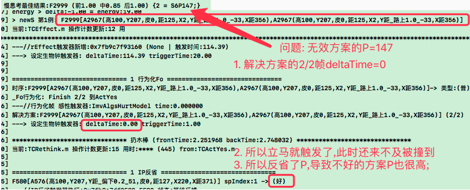
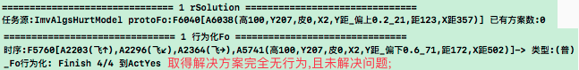
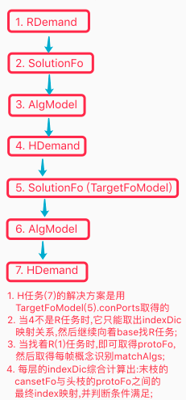

# 螺旋调教 & TCSolution前段条件满足迭代

***

<!-- TOC -->

- [螺旋调教 & TCSolution前段条件满足迭代](#螺旋调教--tcsolution前段条件满足迭代)
  - [n28p01 回测](#n28p01-回测)
  - [n28p02 迭代Canset前段条件满足](#n28p02-迭代canset前段条件满足)
  - [n28p03 回测条件满足代码](#n28p03-回测条件满足代码)

<!-- /TOC -->

## n28p01 回测
`CreateTime 2022.12.29`

在n27末，做了概念与时序的综合竞争,本节从其测试入手,看是否实现了概念和时序的优中择优;

| 28011 | 回测前分析 |
| --- | --- |
| 回顾 | 在2722f中,概念时序识别后,立马进行了refStrong和contentStrong增强 |
| 问题 | 在后续持续激活(有用)时,是否应该续杯(再增强strong)? |
|  | 比如: 时序跟进顺利了,然后引发了思考,解决了问题,等等; |
| 先测 | 或者先测下,如果跑着没实现优者更优,再来做这个; |

| 28012 | 回测训练 |
| --- | --- |
| 说明 | 回测下概念和时序的自然竞争,并训练下危险/安全地带; |
| 训练 | 依2722c步骤训练得FZ67; |

| 28013 | 触发器时间为0导致无效方案P值高的BUG |
| --- | --- |
| 复现 | `FZ67,危险地带,直投`,发现执行方案的末帧deltaTime=0,导致反省为P; |
| 示图 |  |
| 调试 | 经调试,canset本来就没Mv指向,所以=0; |
| 方案 | 应继承任务的mvDeltaTime,等pFo自然无解时,此处再触发即是准确的; |
| 结果 | 改为pFo.mvDeltaTime后,回测重训FZ68后ok,不再有此BUG `T`; |

| 28014 | 取得无效解决方案且未有效执行BUG |
| --- | --- |
| 问题 | `FZ68,危险地带,扔木棒`,测得下图问题,取得方案无效,且未有效执行; |
| 说明 | 本表重点关注取得`解决方案`的有效性,并能够有效执行后解决实际问题; |
| 示图 |  |
| 如图 | 偏上0.2的危险地带,取得解决方案为`偏下0.6`,且为末帧,无行为输出; |
| 分析1 | 找个实例,是解决方案的过去帧导致其有效,如果没有过去帧,则致其无效; |
|  | 实例: 张三做饭,小红就开心,如果张三买饭,小红不一定开心; |
| 分析2 | 能不能使`有行为输出的解决方案`更有优先级? |
|  | 分析: 即更全时序条件满足,比如前段全匹配且已发生; |
| 分析3 | 现代码用indexDic判断截点,indexDic即mIsC容易不太匹配时也有关联; |
|  | 说明: 学习后期`危险地带`很明确时,是否改为contains判断匹配; |
| 方案 | 综上三条分析,即前段必须全contains满足,才做为解决方案并行为化后段; |
| 结果 | 即本问题其实是`solutionFo前段条件满足`问题,`代码实践转n28p02`; |

***

## n28p02 迭代Canset前段条件满足
`CreateTime 2023.01.04`

在上节测试中,发现`无效解决方案`的问题,后经28014的三条分析,解决方案的前段应由瞬时序列判断contains成立,然后行为化后段,本节重点对其代码实践;

| 28021 | 迭代Canset前段条件满足-实践前回顾现有相关代码 |
| --- | --- |
| 回顾 | 在27224中: `canset前段如果有遗漏,则当前canset为无效方案` |
| 例如 | [准备好枪,老虎出现,开枪吓跑],还没准备枪老虎就出现,则方案无效; |
| 分析 | 在27224中,是判断canset包含pFo已发生部分; |
| 问题1 | 27224好像并没有正面解决此问题,因为indexDic的缘故,它似乎必然满足; |
|  | > 原因: canset与pFo有indexDic所以肯定关联,但关联过度广泛(泛而不准) |
|  | > 分析: 所以现在需要改为contains判断,不能依赖indexDic; |
| 问题2 | `准备枪`肯定不在瞬时记忆中,那么我们不能通过瞬时序列判断contains; |
|  | 分析: 那么它就在工作记忆树中,比如路径如下: |
|  | 目标: 顺着pFo,找出它当时识别的matchAlgs,进而判断contains; |
|  | 因为: protoFo/regroupFo本来就是protoAlg或feedbackProtoAlg组成; |
|  | 结果: 所以protoAlg的抽象即matchAlgs `转28022-todo1`; |
| 结果 | 综上,现有代码27224压根没起到作用,本次条件满足代码改动`转28022`; |

| 28022 | 迭代Canset前段条件满足-R任务-代码实践 |
| --- | --- |
| todo1 | 顺着工作记忆找出每帧的概念识别结果matchAlgs `T`; |
| todo2 | 判断每帧的matchAlgs是否包含对应的cansetAlg `T`; |
| todo3 | TCSolution的cansets写前段条件满足代码 (一帧不包含则过虑掉) `T`; |
| todo4 | 所有已发生帧,都要判断一下条件满足 (<ptAleardayCount部分) `T`; |
| todo5 | 将前段条件满足功能写到`canset候选集过滤器`中 `T`; |
| todo6 | matchFo是抽象的,所以它缺帧时的满足也需要判断 `转28023`; |

| 28023 | 分析一下canset的前段在match中不具备的帧 |
| --- | --- |
| 比如 | matchFo是[遇老虎],cansetFo是[拿枪,遇老虎] |
| 说明 | 此时,即使canset的遇老虎条件满足,但拿枪未必满足; |
| 思路 | 所以要从protoFo中,看有没有(拿枪),而这一判断不能依赖matchFo; |

| 28024 | 迭代Canset前段条件满足-H任务 |
| --- | --- |
| 说明 | 在28022中,仅对R任务做了做了代码实践,H任务放在本表进行 |
| 示图 |  |
| 问题1 | 怎么取H任务时的综合indexDic? |
| 回答1 | 从工作记忆树的末枝向头枝递归找R任务下的protoFo; |
|  | 每一次递归,都将执行过的indexDic累计为sumIndexDic `代码转28025-2`; |
| 问题2 | 问题1中的sumIndexDic累计方式是什么? |
|  | 设: 将已累计的讲为sumIndexDic,新一条计为itemIndexDic; |
| 回答2 | sum是具象,item是抽象,故sum中的抽象等于item的具象时,综合记为新的; |
|  | 比如: sum<抽2,具1>,item<抽3,具2>,因为sum的抽(2)=item的具(2); |
|  | > 所以最终得出的结果就是newSumIndexDic<抽3,具1> `代码转28025-3`; |
| 结果 | 如上H任务的indexDic综合计算方式代码实践转28025; |

| 28025 | 迭代Canset前段条件满足-H任务-代码实践 |
| --- | --- |
| todo1 | 将basePFoOrTargetFo在短时记忆树R下层的每层H中一直传递 `T`; |
| todo2 | 写H向工作记忆树根方向找R.protoFo的递归方法 `T`; |
| todo3 | 递归方法中,计算28024回答2中sumIndexDic的方式 `T`; |
| todo4 | 找到R.protoFo后,退出递归,算法可复用28022中R任务时的代码 `T`; |
| todo5 | 前段条件满足的代码,也复用28022中R任务时的代码 `T`; |
| todo6 | 将H任务递归算法写成最终返回cansetMatchIndexDic `T`; |
| todo7 | H任务取cansetMatchIndexDic与R任务取它复用一个算法 `T`; |
| todo8 | H任务向root方向找pFo (R任务也封装复用一个算法) `T`; |

结果: R和H任务的前段条件满足代码全写了,但28023空帧的问题还未写,后面再写;

***

## n28p03 回测条件满足代码
`CreateTime 2023.01.13`

| 28031 | 回测条件满足代码 |
| --- | --- |
| 第一轮测试 | 经`6802,再跑第二步训练`测试,发现R任务跑条件满足代码大致ok; |

| 28032 | 识别不够准的问题 |
| --- | --- |
| proto | A6059(高100,Y207,皮0,X2,Y距_偏下0.4_59,距129,X距374) |
| match | A1765(高100,Y207,皮0,X2,距80,Y距_路下1.4_123,X距213) |
| 问题 | A6059偏上0.4,却识别到A1765路下1.4,可见不够准; |
| 方案 | 可以边训练边观察一下识别结果,是否变的越来越准,如果是那就加训解决; |

| 28033 | 以往训练步骤 `训练无果,但经分析制定了修改方案` |
| --- | --- |
| 步骤1 | 随机出生位置:`随机位置扔木棒,重启`x200轮 & `左棒,重启`x100轮x3次 |
| 说明 | 训练完后,观察日志,看有没有越来越明确的识别结果; |
| 问题 | 经训练,概念识别准确度提升不明显,到最后偏上0.4还是会识别有路下1.5; |
| 关键 | 识别无法越来越准会导致很多问题; |
|  | 比如: 这次在决策时判断前置条件满足时就出现因为这里而不准的情况; |
| 分析1 | 识别竞争里也有sp竞争,所以重新调整下训练步骤试试 `转28034` |
|  | > 识别竞争是相似度和强度,没有sp,所以28034无意义; |
| 分析2 | 也有可能这识别结果很正常,但要分析下,能不能辨别它的危险性很低; |
|  | > 即在安全位置时,危险可能性不是90%左右,而是接近0%; |
|  | > 而这种安全性,在识别中,也只能通过相似度来辨别 (识别时只有相似度); |
|  | > 即,可能需要辨别出哪些细节是重要的,哪些不重要,更理性的判断相似度; |
| 方案 | 根据`分析2`,目前的相似度是求和`sumNear/sumCount`,应改为求乘; |
|  | 比如: `求和: 1+1+0.7/3=0.9`,`求乘: 1*1*0.7=0.7`; |
| 结果 | 本表确定了识别时相似度改为求乘的方案,代码实践转28035; |

| 28034 | 调整训练步骤 `废弃` |
| --- | --- |
| 规划 | 识别的综合竞争中含sp竞争,所以学撞学躲都要训练(交替执行&增加步数) |
| 步骤 | 按以下步骤在随机出生位置训练300轮; |
|  | 单步: `随机位置扔木棒,重启,左棒,重启,随机飞或左棒x5,重启`; |
| 目标 | 训练完后,观察日志,看有没有越来越明确的识别结果; |
| 问题 | 经训练,概念识别准确度提升不明显,到最后偏上0.7还是会识别有路下1.6; |
| 结果 | 识别竞争依据是相似度和强度,没有sp,所以本表无用 `废弃`; |

| 28035 | 识别时相似度改为求乘-TODOLIST |
| --- | --- |
| todo1 | 概念识别计算sumNear用相乘 `T`; |
| todo2 | 时序识别计算sumNear用相乘 `T`; |
| todo3 | 在compareCansetFo()中前段匹配度也改为相乘 (参考26128-1-4); |

     
